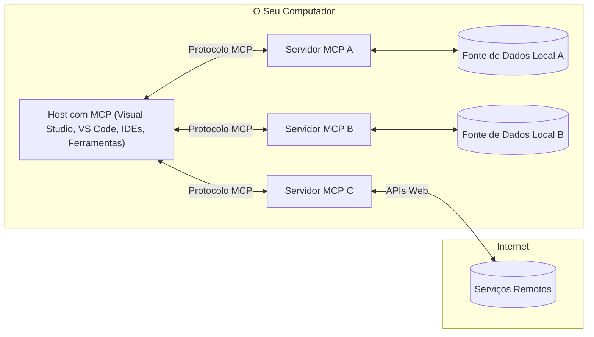

# MCP Conceitos Fundamentais: Dominar o Protocolo de Contexto do Modelo para Integração de IA

[](https://youtu.be/earDzWGtE84)

_(Clique na imagem acima para ver o vídeo desta lição)_

O [Protocolo de Contexto do Modelo (MCP)](https://github.com/modelcontextprotocol) é uma estrutura poderosa e padronizada que otimiza a comunicação entre Grandes Modelos de Linguagem (LLMs) e ferramentas, aplicações e fontes de dados externas.  
Este guia irá conduzi-lo pelos conceitos fundamentais do MCP. Você irá aprender sobre a sua arquitetura cliente-servidor, componentes essenciais, mecânicas de comunicação e as melhores práticas de implementação.

- **Consentimento Explícito do Utilizador**: Todo o acesso a dados e operações requer aprovação explícita do utilizador antes da execução. Os utilizadores devem compreender claramente quais dados serão acedidos e que ações serão executadas, com controlo granular sobre permissões e autorizações.

- **Proteção da Privacidade dos Dados**: Os dados do utilizador só são expostos com consentimento explícito e devem ser protegidos por controlos de acesso robustos ao longo de todo o ciclo de vida da interação. As implementações devem prevenir transmissões não autorizadas e manter fronteiras de privacidade rigorosas.

- **Segurança na Execução de Ferramentas**: Cada invocação de ferramenta exige consentimento explícito do utilizador com entendimento claro da funcionalidade da ferramenta, parâmetros e impacto potencial. Fronteiras de segurança robustas devem impedir execuções acidentais, inseguras ou maliciosas.

- **Segurança da Camada de Transporte**: Todos os canais de comunicação devem usar mecanismos adequados de encriptação e autenticação. As ligações remotas devem implementar protocolos seguros de transporte e gestão adequada de credenciais.

#### Diretrizes de Implementação:

- **Gestão de Permissões**: Implemente sistemas de permissões granulares que permitam aos utilizadores controlar quais servidores, ferramentas e recursos são acessíveis  
- **Autenticação e Autorização**: Use métodos seguros de autenticação (OAuth, chaves API) com gestão e expiração adequada de tokens  
- **Validação de Entrada**: Valide todos os parâmetros e dados de entrada segundo esquemas definidos para prevenir ataques de injeção  
- **Registo de Auditoria**: Mantenha logs abrangentes de todas as operações para monitorização de segurança e conformidade  

## Visão Geral

Esta lição explora a arquitetura fundamental e os componentes que constituem o ecossistema do Protocolo de Contexto do Modelo (MCP). Vai aprender sobre a arquitetura cliente-servidor, componentes chave e mecanismos de comunicação que suportam as interações MCP.

## Objetivos de Aprendizagem Principais

No final desta lição, você irá:

- Compreender a arquitetura cliente-servidor do MCP.  
- Identificar papéis e responsabilidades dos Hosts, Clientes e Servidores.  
- Analisar as funcionalidades essenciais que tornam o MCP uma camada de integração flexível.  
- Aprender como a informação flui dentro do ecossistema MCP.  
- Obter insights práticos através de exemplos de código em .NET, Java, Python e JavaScript.  

## Arquitetura MCP: Um Olhar Mais Aprofundado

O ecossistema MCP é construído num modelo cliente-servidor. Esta estrutura modular permite que aplicações de IA interajam eficientemente com ferramentas, bases de dados, APIs e recursos contextuais. Vamos decompor esta arquitetura nos seus componentes essenciais.

No seu núcleo, o MCP segue uma arquitetura cliente-servidor onde uma aplicação anfitriã pode conectar-se a múltiplos servidores:


- **Hosts MCP**: Programas como VSCode, Claude Desktop, IDEs ou ferramentas de IA que querem aceder a dados através do MCP  
- **Clientes MCP**: Clientes do protocolo que mantêm ligações 1:1 com os servidores  
- **Servidores MCP**: Programas leves que expõem capacidades específicas através do Protocolo de Contexto do Modelo padronizado  
- **Fontes de Dados Locais**: Ficheiros, bases de dados e serviços do seu computador que os servidores MCP podem aceder com segurança  
- **Serviços Remotos**: Sistemas externos disponíveis pela Internet que os servidores MCP podem ligar através de APIs.

O Protocolo MCP é um padrão em evolução usando versionamento baseado em data (formato AAAA-MM-DD). A versão atual do protocolo é **2025-11-25**. Pode consultar as últimas atualizações na [especificação do protocolo](https://modelcontextprotocol.io/specification/2025-11-25/)

### 1. Hosts

No Protocolo de Contexto do Modelo (MCP), os **Hosts** são aplicações de IA que funcionam como a interface principal através da qual os utilizadores interagem com o protocolo. Os Hosts coordenam e gerem ligações a múltiplos servidores MCP criando clientes MCP dedicados para cada ligação a servidor. Exemplos de Hosts incluem:

- **Aplicações de IA**: Claude Desktop, Visual Studio Code, Claude Code  
- **Ambientes de Desenvolvimento**: IDEs e editores de código com integração MCP  
- **Aplicações Customizadas**: Agentes de IA específicos e ferramentas personalizadas  

Os **Hosts** são aplicações que coordenam interações com modelos de IA. Eles:

- **Orquestram Modelos de IA**: Executam ou interagem com LLMs para gerar respostas e coordenar fluxos de trabalho de IA  
- **Gerem Ligações de Cliente**: Criam e mantêm um cliente MCP por cada ligação a servidor MCP  
- **Controlam a Interface de Utilizador**: Gerem o fluxo de conversação, interações de utilizador e apresentação de respostas  
- **Aplicam Segurança**: Controlam permissões, constrangimentos de segurança e autenticação  
- **Gerem Consentimento do Utilizador**: Tratam da aprovação do utilizador para partilha de dados e execução de ferramentas  

### 2. Clientes

Os **Clientes** são componentes essenciais que mantêm ligações dedicadas um-para-um entre Hosts e servidores MCP. Cada cliente MCP é instanciado pelo Host para ligar-se a um servidor MCP específico, garantindo canais de comunicação organizados e seguros. Múltiplos clientes permitem aos Hosts ligar-se a múltiplos servidores simultaneamente.

Os **Clientes** são componentes conetores dentro da aplicação host. Eles:

- **Comunicação do Protocolo**: Enviam pedidos JSON-RPC 2.0 para servidores com prompts e instruções  
- **Negociação de Capacidades**: Negociam funcionalidades suportadas e versões do protocolo com servidores durante a inicialização  
- **Execução de Ferramentas**: Gerem pedidos de execução de ferramentas proveniente dos modelos e processam as respostas  
- **Atualizações em Tempo Real**: Tratam notificações e atualizações em tempo real dos servidores  
- **Processamento de Respostas**: Processam e formatam respostas do servidor para apresentação ao utilizador  

### 3. Servidores

**Servidores** são programas que fornecem contexto, ferramentas e capacidades aos clientes MCP. Podem ser executados localmente (mesmo computador que o Host) ou remotamente (em plataformas externas), sendo responsáveis por tratar pedidos dos clientes e fornecer respostas estruturadas. Os servidores expõem funcionalidades específicas através do Protocolo de Contexto do Modelo padronizado.

Os **Servidores** são serviços que disponibilizam contexto e capacidades. Eles:

- **Registo de Funcionalidades**: Registam e expõem primitivas disponíveis (recursos, prompts, ferramentas) aos clientes  
- **Processamento de Pedidos**: Recebem e executam chamadas de ferramentas, pedidos de recursos e de prompts dos clientes  
- **Fornecimento de Contexto**: Disponibilizam informação contextual e dados para melhorar respostas do modelo  
- **Gestão de Estado**: Mantêm estado de sessão e gerem interações com estado quando necessário  
- **Notificações em Tempo Real**: Enviam notificações sobre alterações de capacidades e atualizações aos clientes ligados  

Os servidores podem ser desenvolvidos por qualquer pessoa para estender capacidades do modelo com funcionalidades especializadas, suportando cenários de implantação locais e remotos.

### 4. Primitivas de Servidor

Os servidores no Protocolo de Contexto do Modelo (MCP) fornecem três **primitivas** essenciais que definem os blocos de construção fundamentais para interações ricas entre clientes, hosts e modelos de linguagem. Estas primitivas especificam os tipos de informação contextual e ações disponíveis através do protocolo.

Os servidores MCP podem expor qualquer combinação das seguintes três primitivas essenciais:

#### Recursos

**Recursos** são fontes de dados que fornecem informação contextual às aplicações de IA. Representam conteúdos estáticos ou dinâmicos que podem melhorar a compreensão e tomada de decisão do modelo:

- **Dados Contextuais**: Informação estruturada e contexto para consumo do modelo de IA  
- **Bases de Conhecimento**: Repositórios de documentos, artigos, manuais e publicações científicas  
- **Fontes de Dados Locais**: Ficheiros, bases de dados e informação do sistema local   
- **Dados Externos**: Respostas de APIs, serviços web e dados de sistemas remotos  
- **Conteúdo Dinâmico**: Dados em tempo real que se atualizam com base em condições externas  

Os recursos são identificados por URIs e suportam descoberta através dos métodos `resources/list` e obtenção através de `resources/read`:

```text
file://documents/project-spec.md
database://production/users/schema
api://weather/current
```

#### Prompts

**Prompts** são templates reutilizáveis que ajudam a estruturar interações com modelos de linguagem. Fornecem padrões padronizados de interação e fluxos de trabalho templated:

- **Interações Baseadas em Templates**: Mensagens pré-estruturadas e iniciadores de conversa  
- **Templates de Fluxo de Trabalho**: Sequências padronizadas para tarefas e interações comuns  
- **Exemplos Few-shot**: Templates baseados em exemplos para instrução do modelo  
- **Prompts de Sistema**: Prompts fundamentais que definem comportamento e contexto do modelo  
- **Templates Dinâmicos**: Prompts parametrizados que se adaptam a contextos específicos  

Para além disso, prompts suportam substituição de variáveis e podem ser descobertos via `prompts/list` e obtidos via `prompts/get`:

```markdown
Generate a {{task_type}} for {{product}} targeting {{audience}} with the following requirements: {{requirements}}
```

#### Ferramentas

**Ferramentas** são funções executáveis que os modelos de IA podem invocar para realizar ações específicas. Representam os “verbos” do ecossistema MCP, permitindo que os modelos interajam com sistemas externos:

- **Funções Executáveis**: Operações discretas que os modelos podem invocar com parâmetros específicos  
- **Integração com Sistemas Externos**: Chamadas a APIs, consultas a bases de dados, operações sobre ficheiros, cálculos  
- **Identidade Única**: Cada ferramenta tem um nome distinto, descrição e esquema de parâmetros  
- **I/O Estruturado**: As ferramentas aceitam parâmetros validados e retornam respostas estruturadas e tipadas  
- **Capacidades de Ação**: Permitem aos modelos realizarem ações no mundo real e obterem dados em tempo real  

As ferramentas são definidas com JSON Schema para validação de parâmetros, descobertas via `tools/list` e executadas via `tools/call`. As ferramentas podem também incluir **ícones** como metadados adicionais para melhor apresentação na interface.

**Anotações de Ferramenta**: As ferramentas suportam anotações comportamentais (ex.: `readOnlyHint`, `destructiveHint`) que indicam se uma ferramenta é apenas de leitura ou destrutiva, ajudando os clientes a tomar decisões informadas sobre a execução.

Exemplo de definição de ferramenta:

```typescript
server.tool(
  "search_products", 
  {
    query: z.string().describe("Search query for products"),
    category: z.string().optional().describe("Product category filter"),
    max_results: z.number().default(10).describe("Maximum results to return")
  }, 
  async (params) => {
    // Executar pesquisa e devolver resultados estruturados
    return await productService.search(params);
  }
);
```

## Primitivas de Cliente

No Protocolo de Contexto do Modelo (MCP), os **clientes** podem expor primitivas que permitem aos servidores requisitar capacidades adicionais à aplicação host. Estas primitivas do lado do cliente permitem implementações de servidor mais ricas e interativas que podem aceder a capacidades do modelo de IA e interações do utilizador.

### Sampling

**Sampling** permite que servidores requisitem completamentos do modelo de linguagem a partir da aplicação de IA do cliente. Esta primitiva permite que os servidores acedam a capacidades do LLM sem embutir as suas próprias dependências de modelo:

- **Acesso Independe do Modelo**: Os servidores podem requisitar completamentos sem incluir SDKs LLM ou gerir acesso ao modelo  
- **IA Iniciada pelo Servidor**: Permite aos servidores gerar conteúdos autonomamente usando o modelo de IA do cliente  
- **Interações Recursivas com LLM**: Suporta cenários complexos onde servidores precisam de assistência de IA para processamento  
- **Geração Dinâmica de Conteúdo**: Permite aos servidores criar respostas contextuais usando o modelo do host  
- **Suporte a Chamada de Ferramentas**: Servidores podem incluir parâmetros `tools` e `toolChoice` para permitir que o modelo do cliente invoque ferramentas durante a amostragem  

O sampling é iniciado através do método `sampling/complete`, onde os servidores enviam pedidos de completamento aos clientes.

### Roots

**Roots** fornecem uma forma padronizada para os clientes exporem fronteiras do sistema de ficheiros aos servidores, ajudando-os a entender que diretórios e ficheiros estão acessíveis:

- **Fronteiras do Sistema de Ficheiros**: Definem os limites onde os servidores podem operar dentro do sistema de ficheiros  
- **Controlo de Acesso**: Ajudam os servidores a compreender que diretórios e ficheiros têm permissão para aceder  
- **Atualizações Dinâmicas**: Os clientes podem notificar os servidores quando a lista de roots muda  
- **Identificação baseada em URI**: Roots usam URIs `file://` para identificar diretórios e ficheiros acessíveis  

As roots são descobertas através do método `roots/list`, com os clientes a enviar notificações `notifications/roots/list_changed` quando as roots mudam.

### Elicitação

**Elicitação** permite que os servidores solicitem informações adicionais ou confirmação dos utilizadores através da interface cliente:

- **Pedidos de Entrada de Utilizador**: Servidores podem pedir informações adicionais quando necessárias para execução de ferramentas  
- **Diálogos de Confirmação**: Pedir aprovação do utilizador para operações sensíveis ou de impacto  
- **Fluxos Interativos**: Permitem que servidores criem interações passo a passo com o utilizador  
- **Recolha Dinâmica de Parâmetros**: Recolhem parâmetros em falta ou opcionais durante a execução de ferramentas  

Os pedidos de elicitação são feitos através do método `elicitation/request` para recolher entrada do utilizador pela interface cliente.

**Modo Elicitação URL**: Os servidores também podem solicitar interações de utilizador baseadas em URL, permitindo direcionar os utilizadores para páginas web externas para autenticação, confirmação ou entrada de dados.

### Registo (Logging)

**Registo** permite que os servidores enviem mensagens de log estruturadas aos clientes para depuração, monitorização e visibilidade operacional:

- **Suporte à Depuração**: Permite aos servidores fornecer logs detalhados de execução para resolução de problemas  
- **Monitorização Operacional**: Enviar atualizações de estado e métricas de desempenho aos clientes  
- **Reportar Erros**: Fornecer contexto detalhado de erros e informações de diagnóstico  
- **Traços de Auditoria**: Criar logs abrangentes de operações e decisões do servidor  

As mensagens de logging são enviadas aos clientes para providenciar transparência nas operações do servidor e facilitar a depuração.

## Fluxo de Informação no MCP

O Protocolo de Contexto do Modelo (MCP) define um fluxo estruturado de informação entre hosts, clientes, servidores e modelos. Compreender este fluxo ajuda a clarificar como os pedidos dos utilizadores são processados e como ferramentas externas e dados são integrados nas respostas dos modelos.

- **Host Inicia Ligação**  
  A aplicação host (como um IDE ou interface de chat) estabelece uma ligação a um servidor MCP, tipicamente via STDIO, WebSocket ou outro transporte suportado.

- **Negociação de Capacidades**  
  O cliente (incorporado no host) e o servidor trocam informações sobre as funcionalidades, ferramentas, recursos e versões de protocolo suportadas. Isto assegura que ambas as partes compreendem quais capacidades estão disponíveis para a sessão.

- **Pedido do Utilizador**  
  O utilizador interage com o host (por exemplo, insere um prompt ou comando). O host recolhe esta entrada e passa-a para o cliente para processamento.

- **Uso de Recursos ou Ferramentas**  
  - O cliente pode pedir contexto adicional ou recursos ao servidor (como ficheiros, entradas de base de dados ou artigos da base de conhecimento) para enriquecer a compreensão do modelo.  
  - Se o modelo determina que uma ferramenta é necessária (por exemplo, para obter dados, realizar um cálculo ou chamar uma API), o cliente envia um pedido de invocação de ferramenta ao servidor, especificando o nome da ferramenta e parâmetros.

- **Execução pelo Servidor**  

O servidor recebe o pedido de recurso ou ferramenta, executa as operações necessárias (como executar uma função, consultar uma base de dados ou recuperar um ficheiro) e devolve os resultados ao cliente num formato estruturado.

- **Geração de Resposta**  
  O cliente integra as respostas do servidor (dados de recursos, resultados de ferramentas, etc.) na interação contínua com o modelo. O modelo utiliza esta informação para gerar uma resposta abrangente e contextualmente relevante.

- **Apresentação do Resultado**  
  O anfitrião recebe a saída final do cliente e apresenta-a ao utilizador, incluindo frequentemente tanto o texto gerado pelo modelo como quaisquer resultados provenientes da execução das ferramentas ou consultas a recursos.

Este fluxo permite que o MCP suporte aplicações de IA avançadas, interativas e conscientes do contexto, ao ligar perfeitamente modelos a ferramentas externas e fontes de dados.

## Arquitetura & Camadas do Protocolo

O MCP consiste em duas camadas arquitetónicas distintas que trabalham em conjunto para fornecer uma estrutura de comunicação completa:

### Camada de Dados

A **Camada de Dados** implementa o protocolo base do MCP usando **JSON-RPC 2.0** como sua base. Esta camada define a estrutura das mensagens, semântica e padrões de interação:

#### Componentes Principais:

- **Protocolo JSON-RPC 2.0**: Toda a comunicação utiliza o formato padronizado de mensagens JSON-RPC 2.0 para chamadas de método, respostas e notificações  
- **Gestão do Ciclo de Vida**: Gerencia a inicialização da conexão, negociação de capacidades e término da sessão entre clientes e servidores  
- **Primitivas do Servidor**: Permite que servidores forneçam funcionalidades básicas através de ferramentas, recursos e prompts  
- **Primitivas do Cliente**: Permite que servidores solicitem amostragem a LLMs, obtenham input do utilizador e enviem mensagens de log  
- **Notificações em Tempo Real**: Suporta notificações assíncronas para atualizações dinâmicas sem polling

#### Características Chave:

- **Negociação da Versão do Protocolo**: Usa versões baseadas em data (YYYY-MM-DD) para garantir compatibilidade  
- **Descoberta de Capacidades**: Clientes e servidores trocam informações sobre funcionalidades suportadas durante a inicialização  
- **Sessões com Estado**: Mantém o estado da conexão através de múltiplas interações para continuidade do contexto

### Camada de Transporte

A **Camada de Transporte** gere canais de comunicação, estruturação de mensagens e autenticação entre os participantes do MCP:

#### Mecanismos de Transporte Suportados:

1. **Transporte STDIO**:
   - Utiliza fluxos de entrada/saída padrão para comunicação direta entre processos  
   - Ótimo para processos locais na mesma máquina, sem overhead de rede  
   - Comumente usado para implementações locais de servidores MCP

2. **Transporte HTTP Streamable**:
   - Utiliza HTTP POST para mensagens do cliente para o servidor  
   - Opcionalmente suporta Server-Sent Events (SSE) para streaming do servidor para o cliente  
   - Permite comunicação remota entre servidores através de redes  
   - Suporta autenticação HTTP padrão (tokens bearer, chaves API, cabeçalhos personalizados)  
   - O MCP recomenda OAuth para autenticação segura baseada em tokens

#### Abstração do Transporte:

A camada de transporte abstrai os detalhes da comunicação da camada de dados, permitindo usar o mesmo formato de mensagem JSON-RPC 2.0 em todos os mecanismos de transporte. Esta abstração permite às aplicações alternar facilmente entre servidores locais e remotos.

### Considerações de Segurança

As implementações do MCP devem cumprir vários princípios críticos de segurança para assegurar interações seguras, confiáveis e protegidas em todas as operações do protocolo:

- **Consentimento e Controlo do Utilizador**: Os utilizadores devem dar consentimento explícito antes que quaisquer dados sejam acedidos ou operações executadas. Devem ter controlo claro sobre quais dados são partilhados e quais ações são autorizadas, suportado por interfaces intuitivas para rever e aprovar atividades.

- **Privacidade dos Dados**: Os dados dos utilizadores devem ser expostos apenas com consentimento explícito e protegidos por controlos de acesso adequados. As implementações MCP devem proteger contra a transmissão não autorizada de dados e assegurar a privacidade em todas as interações.

- **Segurança das Ferramentas**: Antes de invocar qualquer ferramenta, é necessário consentimento explícito do utilizador. Os utilizadores devem compreender claramente a funcionalidade de cada ferramenta e devem ser aplicadas fronteiras de segurança robustas para evitar execuções não intencionadas ou inseguras.

Ao seguir estes princípios de segurança, o MCP garante a confiança, privacidade e segurança dos utilizadores em todas as interações do protocolo, permitindo integrações de IA poderosas.

## Exemplos de Código: Componentes Chave

Abaixo estão exemplos de código em várias linguagens populares que ilustram como implementar componentes chave de um servidor MCP e ferramentas.

### Exemplo .NET: Criar um Servidor MCP Simples com Ferramentas

Aqui está um exemplo prático em .NET que demonstra como implementar um servidor MCP simples com ferramentas personalizadas. Este exemplo mostra como definir e registar ferramentas, tratar pedidos e conectar o servidor usando o Protocolo de Contexto do Modelo.

```csharp
using System;
using System.Threading.Tasks;
using ModelContextProtocol.Server;
using ModelContextProtocol.Server.Transport;
using ModelContextProtocol.Server.Tools;

public class WeatherServer
{
    public static async Task Main(string[] args)
    {
        // Create an MCP server
        var server = new McpServer(
            name: "Weather MCP Server",
            version: "1.0.0"
        );
        
        // Register our custom weather tool
        server.AddTool<string, WeatherData>("weatherTool", 
            description: "Gets current weather for a location",
            execute: async (location) => {
                // Call weather API (simplified)
                var weatherData = await GetWeatherDataAsync(location);
                return weatherData;
            });
        
        // Connect the server using stdio transport
        var transport = new StdioServerTransport();
        await server.ConnectAsync(transport);
        
        Console.WriteLine("Weather MCP Server started");
        
        // Keep the server running until process is terminated
        await Task.Delay(-1);
    }
    
    private static async Task<WeatherData> GetWeatherDataAsync(string location)
    {
        // This would normally call a weather API
        // Simplified for demonstration
        await Task.Delay(100); // Simulate API call
        return new WeatherData { 
            Temperature = 72.5,
            Conditions = "Sunny",
            Location = location
        };
    }
}

public class WeatherData
{
    public double Temperature { get; set; }
    public string Conditions { get; set; }
    public string Location { get; set; }
}
```

### Exemplo Java: Componentes de Servidor MCP

Este exemplo demonstra o mesmo servidor MCP e registo de ferramentas que o exemplo .NET acima, mas implementado em Java.

```java
import io.modelcontextprotocol.server.McpServer;
import io.modelcontextprotocol.server.McpToolDefinition;
import io.modelcontextprotocol.server.transport.StdioServerTransport;
import io.modelcontextprotocol.server.tool.ToolExecutionContext;
import io.modelcontextprotocol.server.tool.ToolResponse;

public class WeatherMcpServer {
    public static void main(String[] args) throws Exception {
        // Criar um servidor MCP
        McpServer server = McpServer.builder()
            .name("Weather MCP Server")
            .version("1.0.0")
            .build();
            
        // Registar uma ferramenta de meteorologia
        server.registerTool(McpToolDefinition.builder("weatherTool")
            .description("Gets current weather for a location")
            .parameter("location", String.class)
            .execute((ToolExecutionContext ctx) -> {
                String location = ctx.getParameter("location", String.class);
                
                // Obter dados meteorológicos (simplificado)
                WeatherData data = getWeatherData(location);
                
                // Retornar resposta formatada
                return ToolResponse.content(
                    String.format("Temperature: %.1f°F, Conditions: %s, Location: %s", 
                    data.getTemperature(), 
                    data.getConditions(), 
                    data.getLocation())
                );
            })
            .build());
        
        // Ligar o servidor utilizando transporte stdio
        try (StdioServerTransport transport = new StdioServerTransport()) {
            server.connect(transport);
            System.out.println("Weather MCP Server started");
            // Manter o servidor a funcionar até o processo ser terminado
            Thread.currentThread().join();
        }
    }
    
    private static WeatherData getWeatherData(String location) {
        // A implementação chamaria uma API meteorológica
        // Simplificado para fins de exemplo
        return new WeatherData(72.5, "Sunny", location);
    }
}

class WeatherData {
    private double temperature;
    private String conditions;
    private String location;
    
    public WeatherData(double temperature, String conditions, String location) {
        this.temperature = temperature;
        this.conditions = conditions;
        this.location = location;
    }
    
    public double getTemperature() {
        return temperature;
    }
    
    public String getConditions() {
        return conditions;
    }
    
    public String getLocation() {
        return location;
    }
}
```

### Exemplo Python: Construir um Servidor MCP

Este exemplo usa fastmcp, por isso assegure-se de o instalar primeiro:

```python
pip install fastmcp
```
Exemplo de Código:

```python
#!/usr/bin/env python3
import asyncio
from fastmcp import FastMCP
from fastmcp.transports.stdio import serve_stdio

# Criar um servidor FastMCP
mcp = FastMCP(
    name="Weather MCP Server",
    version="1.0.0"
)

@mcp.tool()
def get_weather(location: str) -> dict:
    """Gets current weather for a location."""
    return {
        "temperature": 72.5,
        "conditions": "Sunny",
        "location": location
    }

# Abordagem alternativa usando uma classe
class WeatherTools:
    @mcp.tool()
    def forecast(self, location: str, days: int = 1) -> dict:
        """Gets weather forecast for a location for the specified number of days."""
        return {
            "location": location,
            "forecast": [
                {"day": i+1, "temperature": 70 + i, "conditions": "Partly Cloudy"}
                for i in range(days)
            ]
        }

# Registar ferramentas da classe
weather_tools = WeatherTools()

# Iniciar o servidor
if __name__ == "__main__":
    asyncio.run(serve_stdio(mcp))
```

### Exemplo JavaScript: Criar um Servidor MCP

Este exemplo mostra a criação de um servidor MCP em JavaScript e como registar duas ferramentas relacionadas com o tempo.

```javascript
// A usar o SDK oficial do Protocolo de Contexto do Modelo
import { McpServer } from "@modelcontextprotocol/sdk/server/mcp.js";
import { StdioServerTransport } from "@modelcontextprotocol/sdk/server/stdio.js";
import { z } from "zod"; // Para validação de parâmetros

// Criar um servidor MCP
const server = new McpServer({
  name: "Weather MCP Server",
  version: "1.0.0"
});

// Definir uma ferramenta de meteorologia
server.tool(
  "weatherTool",
  {
    location: z.string().describe("The location to get weather for")
  },
  async ({ location }) => {
    // Normalmente, isto chamaria uma API de meteorologia
    // Simplificado para demonstração
    const weatherData = await getWeatherData(location);
    
    return {
      content: [
        { 
          type: "text", 
          text: `Temperature: ${weatherData.temperature}°F, Conditions: ${weatherData.conditions}, Location: ${weatherData.location}` 
        }
      ]
    };
  }
);

// Definir uma ferramenta de previsão
server.tool(
  "forecastTool",
  {
    location: z.string(),
    days: z.number().default(3).describe("Number of days for forecast")
  },
  async ({ location, days }) => {
    // Normalmente, isto chamaria uma API de meteorologia
    // Simplificado para demonstração
    const forecast = await getForecastData(location, days);
    
    return {
      content: [
        { 
          type: "text", 
          text: `${days}-day forecast for ${location}: ${JSON.stringify(forecast)}` 
        }
      ]
    };
  }
);

// Funções auxiliares
async function getWeatherData(location) {
  // Simular chamada de API
  return {
    temperature: 72.5,
    conditions: "Sunny",
    location: location
  };
}

async function getForecastData(location, days) {
  // Simular chamada de API
  return Array.from({ length: days }, (_, i) => ({
    day: i + 1,
    temperature: 70 + Math.floor(Math.random() * 10),
    conditions: i % 2 === 0 ? "Sunny" : "Partly Cloudy"
  }));
}

// Ligar o servidor usando transporte stdio
const transport = new StdioServerTransport();
server.connect(transport).catch(console.error);

console.log("Weather MCP Server started");
```

Este exemplo em JavaScript demonstra como criar um cliente MCP que se liga a um servidor, envia um prompt e processa a resposta incluindo quaisquer chamadas de ferramentas realizadas.

## Segurança e Autorização

O MCP inclui vários conceitos e mecanismos integrados para gerir segurança e autorização ao longo de todo o protocolo:

1. **Controlo de Permissão de Ferramentas**:  
  Os clientes podem especificar quais ferramentas um modelo pode usar durante uma sessão. Isto garante que só ferramentas explicitamente autorizadas estejam acessíveis, reduzindo o risco de operações inseguras ou não intencionadas. As permissões podem ser configuradas dinamicamente com base nas preferências do utilizador, políticas organizacionais ou contexto da interação.

2. **Autenticação**:  
  Os servidores podem exigir autenticação antes de conceder acesso a ferramentas, recursos ou operações sensíveis. Isto pode incluir chaves API, tokens OAuth ou outros esquemas de autenticação. A autenticação adequada garante que apenas clientes e utilizadores confiáveis possam invocar capacidades do servidor.

3. **Validação**:  
  É aplicada validação de parâmetros para todas as invocações de ferramentas. Cada ferramenta define os tipos, formatos e restrições esperados para os seus parâmetros, e o servidor valida as solicitações recebidas em conformidade. Isto previne entrada malformada ou maliciosa de atingir as implementações das ferramentas e ajuda a manter a integridade das operações.

4. **Limitação de Taxa (Rate Limiting)**:  
  Para prevenir abusos e garantir uso justo dos recursos do servidor, os servidores MCP podem implementar limitação de taxa para chamadas de ferramentas e acesso a recursos. Os limites podem ser aplicados por utilizador, sessão ou globalmente, ajudando a proteger contra ataques de negação de serviço ou consumo excessivo de recursos.

Combinando estes mecanismos, o MCP fornece uma base segura para integrar modelos de linguagem com ferramentas externas e fontes de dados, dando aos utilizadores e desenvolvedores controlo detalhado sobre acesso e utilização.

## Mensagens do Protocolo & Fluxo de Comunicação

A comunicação MCP usa mensagens estruturadas **JSON-RPC 2.0** para facilitar interações claras e fiáveis entre anfitriões, clientes e servidores. O protocolo define padrões específicos de mensagem para diferentes tipos de operações:

### Tipos de Mensagem Centrais:

#### **Mensagens de Inicialização**
- Pedido **`initialize`**: Estabelece conexão e negocia versão do protocolo e capacidades  
- Resposta **`initialize`**: Confirma funcionalidades suportadas e informações do servidor  
- **`notifications/initialized`**: Indica que a inicialização está completa e a sessão está pronta

#### **Mensagens de Descoberta**
- Pedido **`tools/list`**: Descobre ferramentas disponíveis no servidor  
- Pedido **`resources/list`**: Lista recursos disponíveis (fontes de dados)  
- Pedido **`prompts/list`**: Recupera templates de prompts disponíveis

#### **Mensagens de Execução**  
- Pedido **`tools/call`**: Executa uma ferramenta específica com parâmetros fornecidos  
- Pedido **`resources/read`**: Recupera conteúdo de um recurso específico  
- Pedido **`prompts/get`**: Obtém um template de prompt com parâmetros opcionais

#### **Mensagens do Lado do Cliente**
- Pedido **`sampling/complete`**: Servidor solicita conclusão LLM ao cliente  
- Pedido **`elicitation/request`**: Servidor solicita input do utilizador através da interface do cliente  
- Mensagens de Log: Servidor envia mensagens estruturadas de log para o cliente

#### **Mensagens de Notificação**
- **`notifications/tools/list_changed`**: Servidor notifica cliente sobre alterações nas ferramentas  
- **`notifications/resources/list_changed`**: Servidor notifica cliente sobre alterações nos recursos  
- **`notifications/prompts/list_changed`**: Servidor notifica cliente sobre alterações nos prompts

### Estrutura da Mensagem:

Todas as mensagens MCP seguem o formato JSON-RPC 2.0 com:
- **Mensagens de Pedido**: Incluem `id`, `method` e `params` opcionais  
- **Mensagens de Resposta**: Incluem `id` e `result` ou `error`  
- **Mensagens de Notificação**: Incluem `method` e `params` opcionais (sem `id` nem resposta esperada)

Esta comunicação estruturada assegura interações fiáveis, rastreáveis e extensíveis que suportam cenários avançados como atualizações em tempo real, encadeamento de ferramentas e tratamento robusto de erros.

### Tarefas (Experimental)

As **Tarefas** são uma funcionalidade experimental que fornece invólucros de execução duradouros que permitem recuperação diferida de resultados e acompanhamento de estado para pedidos MCP:

- **Operações de Longa Duração**: Rastreiam cálculos dispendiosos, automação de fluxos de trabalho e processamento por lotes  
- **Resultados Diferidos**: Permitem polling do estado da tarefa e recuperação dos resultados quando as operações terminam  
- **Acompanhamento de Estado**: Monitorizam progresso da tarefa através de estados definidos no ciclo de vida  
- **Operações em Multietapas**: Suportam fluxos de trabalho complexos que abrangem múltiplas interações

As Tarefas envolvem pedidos MCP padrão para permitir padrões de execução assíncronos para operações que não podem ser concluídas imediatamente.

## Principais Conclusões

- **Arquitetura**: MCP usa uma arquitetura cliente-servidor onde anfitriões gerem múltiplas conexões de clientes a servidores  
- **Participantes**: O ecossistema inclui anfitriões (aplicações IA), clientes (conectores do protocolo) e servidores (provedores de capacidades)  
- **Mecanismos de Transporte**: A comunicação suporta STDIO (local) e HTTP Streamable com SSE opcional (remoto)  
- **Primitivas Centrais**: Servidores expõem ferramentas (funções executáveis), recursos (fontes de dados) e prompts (templates)  
- **Primitivas do Cliente**: Servidores podem solicitar amostragem (completions LLM com suporte a chamada de ferramentas), elicitação (input de utilizador incluindo modo URL), raízes (limites do sistema de ficheiros) e logging dos clientes  
- **Funcionalidades Experimentais**: Tarefas fornecem invólucros duradouros para execução de operações longas  
- **Fundação do Protocolo**: Construído sobre JSON-RPC 2.0 com versionamento baseado em datas (atual: 2025-11-25)  
- **Capacidades em Tempo Real**: Suporta notificações para atualizações dinâmicas e sincronização em tempo real  
- **Segurança em Primeiro Lugar**: Consentimento explícito do utilizador, proteção da privacidade de dados e transporte seguro são requisitos centrais

## Exercício

Desenhe uma ferramenta MCP simples que seria útil na sua área. Defina:
1. Como a ferramenta se chamaria  
2. Que parâmetros aceitaria  
3. Que saída devolveria  
4. Como um modelo poderia usar esta ferramenta para resolver problemas dos utilizadores


---

## O que vem a seguir

Próximo: [Capítulo 2: Segurança](../02-Security/README.md)

---

<!-- CO-OP TRANSLATOR DISCLAIMER START -->
**Aviso Legal**:
Este documento foi traduzido utilizando o serviço de tradução automática [Co-op Translator](https://github.com/Azure/co-op-translator). Embora nos esforcemos pela precisão, por favor esteja ciente de que traduções automáticas podem conter erros ou imprecisões. O documento original na sua língua nativa deve ser considerado a fonte autorizada. Para informações críticas, recomenda-se a tradução profissional por um tradutor humano. Não nos responsabilizamos por quaisquer mal-entendidos ou interpretações incorretas resultantes da utilização desta tradução.
<!-- CO-OP TRANSLATOR DISCLAIMER END -->