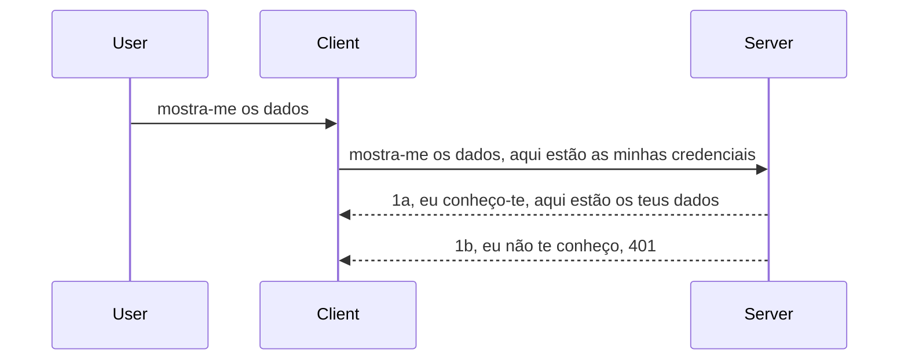

# Autenticação simples

Os SDKs MCP suportam o uso de OAuth 2.1 que, para ser sincero, é um processo bastante complexo envolvendo conceitos como servidor de autenticação, servidor de recursos, envio de credenciais, obtenção de um código, troca do código por um token bearer até que finalmente consiga obter os dados do recurso. Se não está habituado ao OAuth, que é uma ótima coisa para implementar, é uma boa ideia começar com algum nível básico de autenticação e ir evoluindo para uma segurança cada vez melhor. É por isso que este capítulo existe, para o conduzir até autenticações mais avançadas.

## Autenticação, o que queremos dizer?

Auth é abreviação de autenticação e autorização. A ideia é que precisamos fazer duas coisas:

- **Autenticação**, que é o processo de perceber se deixamos uma pessoa entrar em nossa casa, que tem o direito de estar "aqui", ou seja, tem acesso ao nosso servidor de recursos onde as funcionalidades do MCP Server vivem.
- **Autorização**, é o processo de descobrir se um utilizador deve ter acesso a esses recursos específicos que está a pedir, por exemplo estas encomendas ou estes produtos ou se está autorizado a ler o conteúdo mas não a apagar, como outro exemplo.

## Credenciais: como dizemos ao sistema quem somos

Bem, a maioria dos programadores web começa a pensar em termos de fornecer uma credencial ao servidor, normalmente um segredo que diz se têm autorização para estar aqui - "Autenticação". Esta credencial é geralmente uma versão codificada em base64 do nome de utilizador e senha ou uma chave API que identifica unicamente um utilizador específico.

Isto envolve enviá-la via um header chamado "Authorization" assim:

```json
{ "Authorization": "secret123" }
```

Isto é normalmente referido como autenticação básica. Como o fluxo geral funciona é o seguinte:


Agora que entendemos como funciona do ponto de vista do fluxo, como é que o implementamos? Bem, a maioria dos servidores web tem um conceito chamado middleware, um pedaço de código que corre como parte do pedido e que pode verificar credenciais, e se essas credenciais são válidas pode deixar o pedido passar. Se o pedido não tiver credenciais válidas, recebe um erro de autenticação. Vamos ver como isto pode ser implementado:

**Python**

```python
class AuthMiddleware(BaseHTTPMiddleware):
    async def dispatch(self, request, call_next):

        has_header = request.headers.get("Authorization")
        if not has_header:
            print("-> Missing Authorization header!")
            return Response(status_code=401, content="Unauthorized")

        if not valid_token(has_header):
            print("-> Invalid token!")
            return Response(status_code=403, content="Forbidden")

        print("Valid token, proceeding...")
       
        response = await call_next(request)
        # adicionar quaisquer cabeçalhos personalizados ou alterar a resposta de alguma forma
        return response


starlette_app.add_middleware(CustomHeaderMiddleware)
```

Aqui temos:

- Criado um middleware chamado `AuthMiddleware` cujo método `dispatch` está a ser invocado pelo servidor web.
- Adicionado o middleware ao servidor web:

    ```python
    starlette_app.add_middleware(AuthMiddleware)
    ```

- Escrito a lógica de validação que verifica se o header Authorization está presente e se o segredo enviado é válido:

    ```python
    has_header = request.headers.get("Authorization")
    if not has_header:
        print("-> Missing Authorization header!")
        return Response(status_code=401, content="Unauthorized")

    if not valid_token(has_header):
        print("-> Invalid token!")
        return Response(status_code=403, content="Forbidden")
    ```

    se o segredo estiver presente e for válido, deixamos o pedido passar invocando `call_next` e devolvemos a resposta.

    ```python
    response = await call_next(request)
    # adicionar quaisquer cabeçalhos do cliente ou alterar a resposta de alguma forma
    return response
    ```

Como funciona é que, se um pedido web for feito em direção ao servidor, o middleware será invocado e, dada a sua implementação, ou deixa o pedido passar ou acaba por devolver um erro que indica que o cliente não tem permissão para prosseguir.

**TypeScript**

Aqui criamos um middleware com o popular framework Express e interceptamos o pedido antes de chegar ao MCP Server. Aqui está o código para isso:

```typescript
function isValid(secret) {
    return secret === "secret123";
}

app.use((req, res, next) => {
    // 1. Cabeçalho de autorização presente?
    if(!req.headers["Authorization"]) {
        res.status(401).send('Unauthorized');
    }
    
    let token = req.headers["Authorization"];

    // 2. Verificar validade.
    if(!isValid(token)) {
        res.status(403).send('Forbidden');
    }

   
    console.log('Middleware executed');
    // 3. Passa o pedido para o próximo passo na linha de processamento do pedido.
    next();
});
```

Neste código:

1. Verificamos se o header Authorization está presente, se não estiver, enviamos um erro 401.
2. Garantimos que a credencial/token é válido, se não, enviamos um erro 403.
3. Finalmente, passa o pedido na pipeline de pedidos e devolve o recurso pedido.

## Exercício: Implementar autenticação

Vamos usar os nossos conhecimentos e tentar implementar isto. Aqui está o plano:

Servidor

- Criar um servidor web e uma instância MCP.
- Implementar um middleware para o servidor.

Cliente

- Enviar pedido web, com credencial, via header.

### -1- Criar um servidor web e uma instância MCP

No nosso primeiro passo, precisamos criar a instância do servidor web e o MCP Server.

**Python**

Aqui criamos uma instância do MCP server, criamos uma app starlette web e alojamos com uvicorn.

```python
# a criar servidor MCP

app = FastMCP(
    name="MCP Resource Server",
    instructions="Resource Server that validates tokens via Authorization Server introspection",
    host=settings["host"],
    port=settings["port"],
    debug=True
)

# a criar aplicação web starlette
starlette_app = app.streamable_http_app()

# a servir aplicação via uvicorn
async def run(starlette_app):
    import uvicorn
    config = uvicorn.Config(
            starlette_app,
            host=app.settings.host,
            port=app.settings.port,
            log_level=app.settings.log_level.lower(),
        )
    server = uvicorn.Server(config)
    await server.serve()

run(starlette_app)
```

Neste código:

- Criamos o MCP Server.
- Construímos a app starlette web a partir do MCP Server, `app.streamable_http_app()`.
- Alojamos e servimos a app web usando uvicorn `server.serve()`.

**TypeScript**

Aqui criamos uma instância do MCP Server.

```typescript
const server = new McpServer({
      name: "example-server",
      version: "1.0.0"
    });

    // ... configurar recursos do servidor, ferramentas e prompts ...
```

Esta criação do MCP Server precisa acontecer dentro da nossa definição de rota POST /mcp, por isso vamos pegar o código acima e movê-lo assim:

```typescript
import express from "express";
import { randomUUID } from "node:crypto";
import { McpServer } from "@modelcontextprotocol/sdk/server/mcp.js";
import { StreamableHTTPServerTransport } from "@modelcontextprotocol/sdk/server/streamableHttp.js";
import { isInitializeRequest } from "@modelcontextprotocol/sdk/types.js"

const app = express();
app.use(express.json());

// Mapa para armazenar transportes por ID de sessão
const transports: { [sessionId: string]: StreamableHTTPServerTransport } = {};

// Tratar pedidos POST para comunicação cliente-servidor
app.post('/mcp', async (req, res) => {
  // Verificar existência de ID de sessão
  const sessionId = req.headers['mcp-session-id'] as string | undefined;
  let transport: StreamableHTTPServerTransport;

  if (sessionId && transports[sessionId]) {
    // Reutilizar transporte existente
    transport = transports[sessionId];
  } else if (!sessionId && isInitializeRequest(req.body)) {
    // Novo pedido de inicialização
    transport = new StreamableHTTPServerTransport({
      sessionIdGenerator: () => randomUUID(),
      onsessioninitialized: (sessionId) => {
        // Armazenar o transporte pelo ID de sessão
        transports[sessionId] = transport;
      },
      // A proteção contra re-binding de DNS está desativada por defeito para compatibilidade retroativa. Se estiver a executar este servidor
      // localmente, certifique-se de definir:
      // enableDnsRebindingProtection: true,
      // allowedHosts: ['127.0.0.1'],
    });

    // Limpar transporte quando fechado
    transport.onclose = () => {
      if (transport.sessionId) {
        delete transports[transport.sessionId];
      }
    };
    const server = new McpServer({
      name: "example-server",
      version: "1.0.0"
    });

    // ... configurar recursos do servidor, ferramentas e prompts ...

    // Ligar ao servidor MCP
    await server.connect(transport);
  } else {
    // Pedido inválido
    res.status(400).json({
      jsonrpc: '2.0',
      error: {
        code: -32000,
        message: 'Bad Request: No valid session ID provided',
      },
      id: null,
    });
    return;
  }

  // Tratar o pedido
  await transport.handleRequest(req, res, req.body);
});

// Manipulador reutilizável para pedidos GET e DELETE
const handleSessionRequest = async (req: express.Request, res: express.Response) => {
  const sessionId = req.headers['mcp-session-id'] as string | undefined;
  if (!sessionId || !transports[sessionId]) {
    res.status(400).send('Invalid or missing session ID');
    return;
  }
  
  const transport = transports[sessionId];
  await transport.handleRequest(req, res);
};

// Tratar pedidos GET para notificações servidor-cliente via SSE
app.get('/mcp', handleSessionRequest);

// Tratar pedidos DELETE para terminação de sessão
app.delete('/mcp', handleSessionRequest);

app.listen(3000);
```

Agora vê como a criação do MCP Server foi movida para dentro de `app.post("/mcp")`.

Vamos passar para o próximo passo que é criar o middleware para podermos validar a credencial que entra.

### -2- Implementar um middleware para o servidor

Vamos passar para a parte do middleware agora. Aqui vamos criar um middleware que procura uma credencial no header `Authorization` e a valida. Se for aceitável, o pedido segue para fazer o que precisa (por exemplo listar ferramentas, ler um recurso ou qualquer funcionalidade MCP que o cliente esteja a pedir).

**Python**

Para criar o middleware, temos de criar uma classe que herda de `BaseHTTPMiddleware`. Existem duas partes interessantes:

- O pedido `request`, de onde lemos a informação do header.
- `call_next` a callback que precisamos invocar se o cliente trouxe uma credencial que aceitamos.

Primeiro, temos de tratar o caso em que o header `Authorization` está em falta:

```python
has_header = request.headers.get("Authorization")

# sem cabeçalho presente, falhar com 401, caso contrário continue.
if not has_header:
    print("-> Missing Authorization header!")
    return Response(status_code=401, content="Unauthorized")
```

Aqui enviamos uma mensagem 401 unauthorized pois o cliente não está a autenticar-se.

A seguir, se foi submetida uma credencial, temos de verificar a sua validade assim:

```python
 if not valid_token(has_header):
    print("-> Invalid token!")
    return Response(status_code=403, content="Forbidden")
```

Note como enviamos uma mensagem 403 forbidden acima. Vamos ver o middleware completo abaixo, implementando tudo o que dissemos:

```python
class AuthMiddleware(BaseHTTPMiddleware):
    async def dispatch(self, request, call_next):

        has_header = request.headers.get("Authorization")
        if not has_header:
            print("-> Missing Authorization header!")
            return Response(status_code=401, content="Unauthorized")

        if not valid_token(has_header):
            print("-> Invalid token!")
            return Response(status_code=403, content="Forbidden")

        print("Valid token, proceeding...")
        print(f"-> Received {request.method} {request.url}")
        response = await call_next(request)
        response.headers['Custom'] = 'Example'
        return response

```

Ótimo, mas quanto à função `valid_token`? Aqui está abaixo:
:

```python
# NÃO usar em produção - melhore-o !!
def valid_token(token: str) -> bool:
    # remover o prefixo "Bearer "
    if token.startswith("Bearer "):
        token = token[7:]
        return token == "secret-token"
    return False
```

Isto obviamente deve ser melhorado.

IMPORTANTE: Nunca deve ter segredos assim no código. Idealmente, deve obter o valor para comparação de uma fonte de dados ou de um IDP (fornecedor de serviço de identidade) ou melhor ainda, deixar o IDP fazer a validação.

**TypeScript**

Para implementar isto com Express, precisamos chamar o método `use` que recebe funções middleware.

Precisamos de:

- Interagir com a variável request para verificar a credencial passada na propriedade `Authorization`.
- Validar a credencial, e se válido deixar o pedido continuar e permitir que o pedido MCP do cliente faça o que deve (por exemplo listar ferramentas, ler recurso ou outra funcionalidade MCP).

Aqui, verificamos se o header `Authorization` está presente, e se não, impedimos que o pedido prossiga:

```typescript
if(!req.headers["authorization"]) {
    res.status(401).send('Unauthorized');
    return;
}
```

Se o header não for enviado inicialmente, recebe um 401.

A seguir, verificamos se a credencial é válida, e se não, bloqueamos novamente o pedido mas com uma mensagem ligeiramente diferente:

```typescript
if(!isValid(token)) {
    res.status(403).send('Forbidden');
    return;
} 
```

Note como agora recebe um erro 403.

Aqui está o código completo:

```typescript
app.use((req, res, next) => {
    console.log('Request received:', req.method, req.url, req.headers);
    console.log('Headers:', req.headers["authorization"]);
    if(!req.headers["authorization"]) {
        res.status(401).send('Unauthorized');
        return;
    }
    
    let token = req.headers["authorization"];

    if(!isValid(token)) {
        res.status(403).send('Forbidden');
        return;
    }  

    console.log('Middleware executed');
    next();
});
```

Configuração do servidor web para aceitar um middleware que verifica a credencial que o cliente espera enviar-nos. E quanto ao cliente?

### -3- Enviar pedido web com credencial via header

Precisamos garantir que o cliente passa a credencial através do header. Como vamos usar um cliente MCP para isso, precisamos de perceber como se faz.

**Python**

Para o cliente, precisamos passar um header com a nossa credencial assim:

```python
# NÃO codifique o valor diretamente, mantenha-o pelo menos numa variável de ambiente ou num armazenamento mais seguro
token = "secret-token"

async with streamablehttp_client(
        url = f"http://localhost:{port}/mcp",
        headers = {"Authorization": f"Bearer {token}"}
    ) as (
        read_stream,
        write_stream,
        session_callback,
    ):
        async with ClientSession(
            read_stream,
            write_stream
        ) as session:
            await session.initialize()
      
            # A FAZER, o que pretende que seja feito no cliente, por exemplo listar ferramentas, chamar ferramentas, etc.
```

Note como preenchemos a propriedade `headers` assim ` headers = {"Authorization": f"Bearer {token}"}`.

**TypeScript**

Podemos resolver isto em dois passos:

1. Preencher um objeto de configuração com a nossa credencial.
2. Passar o objeto de configuração para o transporte.

```typescript

// NÃO codifique o valor diretamente como mostrado aqui. Pelo menos tenha-o como uma variável de ambiente e use algo como dotenv (em modo de desenvolvimento).
let token = "secret123"

// definir um objeto de opções de transporte do cliente
let options: StreamableHTTPClientTransportOptions = {
  sessionId: sessionId,
  requestInit: {
    headers: {
      "Authorization": "secret123"
    }
  }
};

// passar o objeto de opções para o transporte
async function main() {
   const transport = new StreamableHTTPClientTransport(
      new URL(serverUrl),
      options
   );
```

Aqui pode ver acima como tivemos de criar um objeto `options` e colocar os nossos headers na propriedade `requestInit`.

IMPORTANTE: Mas como melhoramos isto daqui para a frente? Bem, a implementação atual tem alguns problemas. Primeiro, passar uma credencial assim é bastante arriscado a menos que tenha HTTPS, no mínimo. Mesmo assim, a credencial pode ser roubada, por isso precisa de um sistema onde possa facilmente revogar o token e adicionar verificações adicionais como de onde no mundo o pedido vem, se o pedido acontece demasiado frequentemente (comportamento tipo bot), em resumo, há muitas preocupações.

Dito isto, para APIs muito simples onde não quer que ninguém chame a sua API sem autenticação, o que temos aqui é um bom começo.

Com isso dito, vamos tentar reforçar a segurança um pouco usando um formato padronizado como JSON Web Token, também conhecido como JWT ou tokens "JOT".

## JSON Web Tokens, JWT

Portanto, estamos a tentar melhorar as coisas em relação ao envio de credenciais muito simples. Quais as melhorias imediatas que obtemos adotando JWT?

- **Melhorias de segurança**. Na autenticação básica, envia o nome de utilizador e senha como um token codificado em base64 (ou envia uma chave API) repetidamente, o que aumenta o risco. Com JWT, envia o nome de utilizador e senha e recebe um token em retorno que também tem limite temporal, ou seja, expira. O JWT permite controlar acessos finamente usando roles, scopes e permissões.
- **Ausência de estado e escalabilidade**. Os JWTs são autocontidos, transportam toda a informação do utilizador e eliminam a necessidade de armazenar sessões do lado do servidor. O token pode ser validado localmente.
- **Interoperabilidade e federação**. Os JWTs são centrais no Open ID Connect e são usados com fornecedores de identidade conhecidos como Entra ID, Google Identity e Auth0. Permitem usar single sign on e muito mais, sendo de nível empresarial.
- **Modularidade e flexibilidade**. Os JWTs podem também ser usados com API Gateways como Azure API Management, NGINX e outros. Suportam cenários de autenticação de utilizadores e comunicação servidor-servidor incluindo impersonação e delegação.
- **Performance e cache**. Os JWTs podem ser cacheados após decodificação o que reduz a necessidade de parsing. Isto ajuda especialmente em apps com tráfego alto, pois melhora o throughput e reduz carga da infraestrutura escolhida.
- **Funcionalidades avançadas**. Também suportam introspeção (verificar validade no servidor) e revogação (invalidar um token).

Com todos estes benefícios, vamos ver como podemos levar a nossa implementação para o próximo nível.

## Transformar autenticação básica em JWT

Portanto, as alterações que precisamos de fazer, a grandes linhas, são:

- **Aprender a construir um token JWT** e prepará-lo para ser enviado do cliente para o servidor.
- **Validar um token JWT** e, se válido, permitir que o cliente aceda aos nossos recursos.
- **Armazenamento seguro do token**. Como guardamos este token.
- **Proteger as rotas**. Precisamos de proteger as rotas, no nosso caso, as rotas e funcionalidades MCP específicas.
- **Adicionar tokens de refresh**. Assegurar que criamos tokens que são de curta duração mas com tokens de refresh que são de longa duração e podem ser usados para adquirir novos tokens caso expirem. Também garantir que existe um endpoint de refresh e uma estratégia de rotação.

### -1- Construir um token JWT

Antes de mais, um token JWT tem as seguintes partes:

- **header**, algoritmo usado e tipo do token.
- **payload**, claims, como sub (o utilizador ou entidade que o token representa. Num cenário de autenticação isto é tipicamente o userid), exp (quando expira), role (a role)
- **assinatura**, assinada com um segredo ou chave privada.

Para isto, precisamos construir o header, o payload e o token codificado.

**Python**

```python

import jwt
import jwt
from jwt.exceptions import ExpiredSignatureError, InvalidTokenError
import datetime

# Chave secreta usada para assinar o JWT
secret_key = 'your-secret-key'

header = {
    "alg": "HS256",
    "typ": "JWT"
}

# as informações do utilizador e as suas declarações e tempo de expiração
payload = {
    "sub": "1234567890",               # Assunto (ID do utilizador)
    "name": "User Userson",                # Declaração personalizada
    "admin": True,                     # Declaração personalizada
    "iat": datetime.datetime.utcnow(),# Emitido em
    "exp": datetime.datetime.utcnow() + datetime.timedelta(hours=1)  # Expiração
}

# codificá-lo
encoded_jwt = jwt.encode(payload, secret_key, algorithm="HS256", headers=header)
```

No código acima fizemos:

- Definimos um header usando HS256 como algoritmo e tipo JWT.
- Construímos um payload que contém um subject ou id de utilizador, um username, uma role, quando foi emitido e quando está para expirar, implementando assim o aspeto de limite temporal que mencionámos antes.

**TypeScript**

Aqui vamos precisar de algumas dependências que nos ajudam a construir o token JWT.

Dependências

```sh

npm install jsonwebtoken
npm install --save-dev @types/jsonwebtoken
```

Agora que temos isto em lugar, vamos criar o header, payload e, através disso, criar o token codificado.

```typescript
import jwt from 'jsonwebtoken';

const secretKey = 'your-secret-key'; // Usar variáveis de ambiente em produção

// Definir a carga útil
const payload = {
  sub: '1234567890',
  name: 'User usersson',
  admin: true,
  iat: Math.floor(Date.now() / 1000), // Emitido em
  exp: Math.floor(Date.now() / 1000) + 60 * 60 // Expira em 1 hora
};

// Definir o cabeçalho (opcional, jsonwebtoken define padrões)
const header = {
  alg: 'HS256',
  typ: 'JWT'
};

// Criar o token
const token = jwt.sign(payload, secretKey, {
  algorithm: 'HS256',
  header: header
});

console.log('JWT:', token);
```

Este token é:

Assinado usando HS256  
Válido por 1 hora  
Inclui claims como sub, name, admin, iat, e exp.

### -2- Validar um token

Também precisaremos validar um token, algo que devemos fazer no servidor para garantir que o que o cliente nos está a enviar é de facto válido. Há muitas verificações que devemos fazer aqui, desde validar a estrutura até à validade. É encorajado a adicionar outras verificações para saber se o utilizador está no seu sistema e mais.

Para validar um token, precisamos decodificá-lo para podermos ler e depois começar a verificar a sua validade:

**Python**

```python

# Decodificar e verificar o JWT
try:
    decoded = jwt.decode(token, secret_key, algorithms=["HS256"])
    print("✅ Token is valid.")
    print("Decoded claims:")
    for key, value in decoded.items():
        print(f"  {key}: {value}")
except ExpiredSignatureError:
    print("❌ Token has expired.")
except InvalidTokenError as e:
    print(f"❌ Invalid token: {e}")

```

Neste código, chamamos `jwt.decode` com o token, a chave secreta e o algoritmo escolhido como entrada. Note que usamos uma construção try-catch pois uma validação falhada gera uma exceção.

**TypeScript**

Aqui precisamos chamar `jwt.verify` para obter uma versão decodificada do token que podemos analisar mais. Se esta chamada falhar, significa que a estrutura do token está incorreta ou já não é válido.

```typescript

try {
  const decoded = jwt.verify(token, secretKey);
  console.log('Decoded Payload:', decoded);
} catch (err) {
  console.error('Token verification failed:', err);
}
```

NOTA: como referido anteriormente, devemos executar verificações adicionais para garantir que este token aponta para um utilizador no nosso sistema e garantir que o utilizador tem os direitos que diz ter.
De seguida, vamos analisar o controlo de acesso baseado em funções, também conhecido como RBAC.

## Adicionar controlo de acesso baseado em funções

A ideia é que queremos expressar que diferentes funções têm permissões diferentes. Por exemplo, assumimos que um administrador pode fazer tudo, que um utilizador normal pode fazer leitura/escrita e que um convidado só pode ler. Portanto, aqui estão alguns níveis de permissão possíveis:

- Admin.Write 
- User.Read
- Guest.Read

Vamos ver como podemos implementar este controlo com middleware. Os middlewares podem ser adicionados por rota assim como para todas as rotas.

**Python**

```python
from starlette.middleware.base import BaseHTTPMiddleware
from starlette.responses import JSONResponse
import jwt

# NÃO tenha o segredo no código assim, isto é apenas para fins de demonstração. Leia-o a partir de um local seguro.
SECRET_KEY = "your-secret-key" # coloque isto numa variável de ambiente
REQUIRED_PERMISSION = "User.Read"

class JWTPermissionMiddleware(BaseHTTPMiddleware):
    async def dispatch(self, request, call_next):
        auth_header = request.headers.get("Authorization")
        if not auth_header or not auth_header.startswith("Bearer "):
            return JSONResponse({"error": "Missing or invalid Authorization header"}, status_code=401)

        token = auth_header.split(" ")[1]
        try:
            decoded = jwt.decode(token, SECRET_KEY, algorithms=["HS256"])
        except jwt.ExpiredSignatureError:
            return JSONResponse({"error": "Token expired"}, status_code=401)
        except jwt.InvalidTokenError:
            return JSONResponse({"error": "Invalid token"}, status_code=401)

        permissions = decoded.get("permissions", [])
        if REQUIRED_PERMISSION not in permissions:
            return JSONResponse({"error": "Permission denied"}, status_code=403)

        request.state.user = decoded
        return await call_next(request)


```
  
Existem algumas formas diferentes de adicionar o middleware como abaixo:

```python

# Alt 1: adicionar middleware enquanto se constrói a aplicação starlette
middleware = [
    Middleware(JWTPermissionMiddleware)
]

app = Starlette(routes=routes, middleware=middleware)

# Alt 2: adicionar middleware depois da aplicação starlette já estar construída
starlette_app.add_middleware(JWTPermissionMiddleware)

# Alt 3: adicionar middleware por rota
routes = [
    Route(
        "/mcp",
        endpoint=..., # manipulador
        middleware=[Middleware(JWTPermissionMiddleware)]
    )
]
```
  
**TypeScript**

Podemos usar `app.use` e um middleware que irá correr para todos os pedidos.

```typescript
app.use((req, res, next) => {
    console.log('Request received:', req.method, req.url, req.headers);
    console.log('Headers:', req.headers["authorization"]);

    // 1. Verificar se o cabeçalho de autorização foi enviado

    if(!req.headers["authorization"]) {
        res.status(401).send('Unauthorized');
        return;
    }
    
    let token = req.headers["authorization"];

    // 2. Verificar se o token é válido
    if(!isValid(token)) {
        res.status(403).send('Forbidden');
        return;
    }  

    // 3. Verificar se o utilizador do token existe no nosso sistema
    if(!isExistingUser(token)) {
        res.status(403).send('Forbidden');
        console.log("User does not exist");
        return;
    }
    console.log("User exists");

    // 4. Verificar se o token tem as permissões corretas
    if(!hasScopes(token, ["User.Read"])){
        res.status(403).send('Forbidden - insufficient scopes');
    }

    console.log("User has required scopes");

    console.log('Middleware executed');
    next();
});

```
  
Existem várias coisas que podemos deixar que o nosso middleware faça e que o nosso middleware DEVE fazer, nomeadamente:

1. Verificar se o cabeçalho de autorização está presente
2. Verificar se o token é válido, chamamos `isValid` que é um método que escrevemos para verificar a integridade e validade do token JWT.
3. Verificar se o utilizador existe no nosso sistema, devemos verificar isto.

   ```typescript
    // utilizadores na base de dados
   const users = [
     "user1",
     "User usersson",
   ]

   function isExistingUser(token) {
     let decodedToken = verifyToken(token);

     // TODO, verificar se o utilizador existe na base de dados
     return users.includes(decodedToken?.name || "");
   }
   ```
  
   Acima, criámos uma lista muito simples de `users`, que obviamente deveria estar numa base de dados.

4. Além disso, devemos também verificar se o token tem as permissões corretas.

   ```typescript
   if(!hasScopes(token, ["User.Read"])){
        res.status(403).send('Forbidden - insufficient scopes');
   }
   ```
  
   No código acima do middleware, verificamos que o token contém a permissão User.Read, caso contrário enviamos um erro 403. Abaixo está o método auxiliar `hasScopes`.

   ```typescript
   function hasScopes(scope: string, requiredScopes: string[]) {
     let decodedToken = verifyToken(scope);
    return requiredScopes.every(scope => decodedToken?.scopes.includes(scope));
  }  
   ```

Have a think which additional checks you should be doing, but these are the absolute minimum of checks you should be doing.

Using Express as a web framework is a common choice. There are helpers library when you use JWT so you can write less code.

- `express-jwt`, helper library that provides a middleware that helps decode your token.
- `express-jwt-permissions`, this provides a middleware `guard` that helps check if a certain permission is on the token.

Here's what these libraries can look like when used:

```typescript
const express = require('express');
const jwt = require('express-jwt');
const guard = require('express-jwt-permissions')();

const app = express();
const secretKey = 'your-secret-key'; // put this in env variable

// Decode JWT and attach to req.user
app.use(jwt({ secret: secretKey, algorithms: ['HS256'] }));

// Check for User.Read permission
app.use(guard.check('User.Read'));

// multiple permissions
// app.use(guard.check(['User.Read', 'Admin.Access']));

app.get('/protected', (req, res) => {
  res.json({ message: `Welcome ${req.user.name}` });
});

// Error handler
app.use((err, req, res, next) => {
  if (err.code === 'permission_denied') {
    return res.status(403).send('Forbidden');
  }
  next(err);
});

```
  
Agora que viu como middleware pode ser usado tanto para autenticação como para autorização, e o MCP, muda o modo como fazemos autenticação? Vamos descobrir na próxima secção.

### -3- Adicionar RBAC ao MCP

Até agora viu como pode adicionar RBAC via middleware, no entanto, para MCP não há uma forma fácil de adicionar RBAC por funcionalidade do MCP, então o que fazemos? Bem, temos simplesmente de adicionar um código como este que verifica neste caso se o cliente tem os direitos para chamar uma ferramenta específica:

Tem algumas escolhas diferentes sobre como conseguir RBAC por funcionalidade, aqui estão algumas:

- Adicionar uma verificação para cada ferramenta, recurso, prompt onde precisa verificar o nível de permissão.

   **python**

   ```python
   @tool()
   def delete_product(id: int):
      try:
          check_permissions(role="Admin.Write", request)
      catch:
        pass # cliente falhou na autorização, levantar erro de autorização
   ```
  
   **typescript**

   ```typescript
   server.registerTool(
    "delete-product",
    {
      title: Delete a product",
      description: "Deletes a product",
      inputSchema: { id: z.number() }
    },
    async ({ id }) => {
      
      try {
        checkPermissions("Admin.Write", request);
        // todo, enviar id para productService e entrada remota
      } catch(Exception e) {
        console.log("Authorization error, you're not allowed");  
      }

      return {
        content: [{ type: "text", text: `Deletected product with id ${id}` }]
      };
    }
   );
   ```


- Usar uma abordagem avançada de servidor e os manipuladores de pedidos de forma a minimizar os locais onde precisa fazer a verificação.

   **Python**

   ```python
   
   tool_permission = {
      "create_product": ["User.Write", "Admin.Write"],
      "delete_product": ["Admin.Write"]
   }

   def has_permission(user_permissions, required_permissions) -> bool:
      # user_permissions: lista de permissões que o utilizador tem
      # required_permissions: lista de permissões necessárias para a ferramenta
      return any(perm in user_permissions for perm in required_permissions)

   @server.call_tool()
   async def handle_call_tool(
     name: str, arguments: dict[str, str] | None
   ) -> list[types.TextContent]:
    # Assume que request.user.permissions é uma lista de permissões para o utilizador
     user_permissions = request.user.permissions
     required_permissions = tool_permission.get(name, [])
     if not has_permission(user_permissions, required_permissions):
        # Lançar erro "Não tem permissão para usar a ferramenta {name}"
        raise Exception(f"You don't have permission to call tool {name}")
     # continuar e chamar a ferramenta
     # ...
   ```   
   

   **TypeScript**

   ```typescript
   function hasPermission(userPermissions: string[], requiredPermissions: string[]): boolean {
       if (!Array.isArray(userPermissions) || !Array.isArray(requiredPermissions)) return false;
       // Retorna verdadeiro se o utilizador tiver pelo menos uma permissão necessária
       
       return requiredPermissions.some(perm => userPermissions.includes(perm));
   }
  
   server.setRequestHandler(CallToolRequestSchema, async (request) => {
      const { params: { name } } = request;
  
      let permissions = request.user.permissions;
  
      if (!hasPermission(permissions, toolPermissions[name])) {
         return new Error(`You don't have permission to call ${name}`);
      }
  
      // continua..
   });
   ```
  
   Nota, vai precisar de garantir que o seu middleware atribui um token decodificado à propriedade user do pedido para que o código acima seja simples de implementar.

### Resumindo

Agora que discutimos como adicionar suporte para RBAC em geral e para MCP em particular, é altura de tentar implementar segurança por conta própria para garantir que compreendeu os conceitos apresentados.

## Trabalho 1: Construir um servidor mcp e um cliente mcp usando autenticação básica

Aqui vai pegar no que aprendeu em termos de envio de credenciais através de cabeçalhos.

## Solução 1

[Solução 1](./code/basic/README.md)

## Trabalho 2: Atualizar a solução do Trabalho 1 para usar JWT

Pegue na primeira solução, mas desta vez, vamos melhorar.

Em vez de usar Basic Auth, vamos usar JWT.

## Solução 2

[Solução 2](./solution/jwt-solution/README.md)

## Desafio

Adicione RBAC por ferramenta como descrito na secção "Adicionar RBAC ao MCP".

## Resumo

Deverá ter aprendido muito neste capítulo, desde nenhuma segurança, à segurança básica, ao JWT e como pode ser adicionado ao MCP.

Construímos uma base sólida com JWTs personalizados, mas à medida que escalamos, estamos a avançar para um modelo de identidade baseado em standards. Adotar um IdP como Entra ou Keycloak permite-nos delegar a emissão, validação e gestão do ciclo de vida dos tokens a uma plataforma confiável — libertando-nos para focar na lógica da aplicação e na experiência do utilizador.

Para isso, temos um capítulo mais [avançado sobre Entra](../../05-AdvancedTopics/mcp-security-entra/README.md)

## O que vem a seguir

- A seguir: [Configurar Hosts MCP](../12-mcp-hosts/README.md)

---

<!-- CO-OP TRANSLATOR DISCLAIMER START -->
**Aviso Legal**:
Este documento foi traduzido utilizando o serviço de tradução por IA [Co-op Translator](https://github.com/Azure/co-op-translator). Embora nos esforcemos para garantir a precisão, esteja ciente de que traduções automáticas podem conter erros ou imprecisões. O documento original na sua língua original deve ser considerado a fonte oficial. Para informações críticas, recomenda-se a tradução profissional por um humano. Não nos responsabilizamos por quaisquer mal-entendidos ou interpretações erradas decorrentes do uso desta tradução.
<!-- CO-OP TRANSLATOR DISCLAIMER END -->