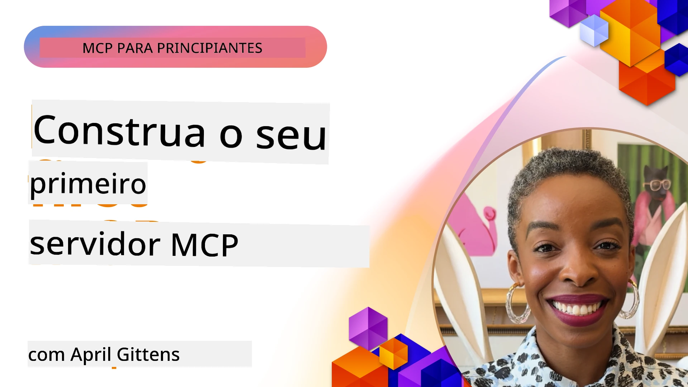

## Começar  

_(Clique na imagem acima para ver o vídeo desta lição)_

Esta secção consiste em várias lições:

- **1 O seu primeiro servidor**, nesta primeira lição, vai aprender a criar o seu primeiro servidor e a inspecioná-lo com a ferramenta inspector, uma forma valiosa de testar e depurar o seu servidor, [para a lição](01-first-server/README.md)

- **2 Cliente**, nesta lição, vai aprender a escrever um cliente que pode ligar-se ao seu servidor, [para a lição](02-client/README.md)

- **3 Cliente com LLM**, uma forma ainda melhor de escrever um cliente é adicionando-lhe um LLM para que possa "negociar" com o seu servidor sobre o que fazer, [para a lição](03-llm-client/README.md)

- **4 Consumo de um servidor GitHub Copilot Agent em Visual Studio Code**. Aqui, vamos ver como executar o nosso Servidor MCP a partir do Visual Studio Code, [para a lição](04-vscode/README.md)

- **5 Servidor de Transporte stdio**. O transporte stdio é o padrão recomendado para comunicação local MCP servidor-cliente, fornecendo comunicação segura baseada em subprocessos com isolamento de processos incorporado [para a lição](05-stdio-server/README.md)

- **6 Streaming HTTP com MCP (HTTP Transmissível)**. Aprenda sobre transporte moderno de streaming HTTP (a abordagem recomendada para servidores MCP remotos segundo a [Especificação MCP 2025-11-25](https://spec.modelcontextprotocol.io/specification/2025-11-25/basic/transports/#streamable-http)), notificações de progresso, e como implementar servidores e clientes MCP escaláveis em tempo real usando HTTP transmissível. [para a lição](06-http-streaming/README.md)

- **7 Utilização do Toolkit AI para VSCode** para consumir e testar os seus Clientes e Servidores MCP [para a lição](07-aitk/README.md)

- **8 Testes**. Aqui vamos focar especialmente como podemos testar o nosso servidor e cliente de diferentes formas, [para a lição](08-testing/README.md)

- **9 Implementação**. Este capítulo vai analisar formas diferentes de implementar as suas soluções MCP, [para a lição](09-deployment/README.md)

- **10 Uso avançado do servidor**. Este capítulo cobre o uso avançado do servidor, [para a lição](./10-advanced/README.md)

- **11 Autenticação**. Este capítulo cobre como adicionar autenticação simples, desde Basic Auth a usar JWT e RBAC. É recomendado começar aqui e depois olhar para os Tópicos Avançados no Capítulo 5 e aplicar endurecimento de segurança adicional via recomendações no Capítulo 2, [para a lição](./11-simple-auth/README.md)

- **12 Hosts MCP**. Configure e use clientes hospedeiros MCP populares incluindo Claude Desktop, Cursor, Cline e Windsurf. Aprenda os tipos de transporte e resolução de problemas, [para a lição](./12-mcp-hosts/README.md)

- **13 Inspector MCP**. Depure e teste os seus servidores MCP interativamente usando a ferramenta Inspector MCP. Aprenda a resolver problemas com ferramentas, recursos e mensagens de protocolo, [para a lição](./13-mcp-inspector/README.md)

O Model Context Protocol (MCP) é um protocolo aberto que padroniza como as aplicações fornecem contexto às LLMs. Pense no MCP como uma porta USB-C para aplicações de IA - proporciona uma forma padronizada de ligar modelos de IA a diferentes fontes de dados e ferramentas.

## Objetivos de Aprendizagem

No final desta lição, será capaz de:

- Configurar ambientes de desenvolvimento para MCP em C#, Java, Python, TypeScript e JavaScript
- Construir e implementar servidores MCP básicos com funcionalidades personalizadas (recursos, prompts e ferramentas)
- Criar aplicações hospedeiras que se liguem a servidores MCP
- Testar e depurar implementações MCP
- Compreender desafios comuns de configuração e as suas soluções
- Ligar as suas implementações MCP a serviços LLM populares

## Configurar o Seu Ambiente MCP

Antes de começar a trabalhar com MCP, é importante preparar o seu ambiente de desenvolvimento e entender o fluxo básico de trabalho. Esta secção irá guiá-lo através dos passos iniciais para assegurar um início suave com MCP.

### Pré-requisitos

Antes de se lançar no desenvolvimento MCP, certifique-se que tem:

- **Ambiente de Desenvolvimento**: Para a linguagem escolhida (C#, Java, Python, TypeScript ou JavaScript)
- **IDE/Editor**: Visual Studio, Visual Studio Code, IntelliJ, Eclipse, PyCharm, ou qualquer editor de código moderno
- **Gestores de Pacotes**: NuGet, Maven/Gradle, pip, ou npm/yarn
- **Chaves API**: Para quaisquer serviços de IA que planeie usar nas suas aplicações hospedeiras

### SDKs Oficiais

Nos capítulos seguintes verá soluções construídas usando Python, TypeScript, Java e .NET. Aqui estão todos os SDKs oficialmente suportados.

O MCP fornece SDKs oficiais para várias linguagens (alinhados com a [Especificação MCP 2025-11-25](https://spec.modelcontextprotocol.io/specification/2025-11-25/)):
- [SDK C#](https://github.com/modelcontextprotocol/csharp-sdk) - Mantido em colaboração com a Microsoft
- [SDK Java](https://github.com/modelcontextprotocol/java-sdk) - Mantido em colaboração com a Spring AI
- [SDK TypeScript](https://github.com/modelcontextprotocol/typescript-sdk) - A implementação oficial em TypeScript
- [SDK Python](https://github.com/modelcontextprotocol/python-sdk) - A implementação oficial em Python (FastMCP)
- [SDK Kotlin](https://github.com/modelcontextprotocol/kotlin-sdk) - A implementação oficial em Kotlin
- [SDK Swift](https://github.com/modelcontextprotocol/swift-sdk) - Mantido em colaboração com a Loopwork AI
- [SDK Rust](https://github.com/modelcontextprotocol/rust-sdk) - A implementação oficial em Rust
- [SDK Go](https://github.com/modelcontextprotocol/go-sdk) - A implementação oficial em Go

## Pontos-Chave

- Configurar um ambiente de desenvolvimento MCP é simples com SDKs específicos para cada linguagem
- Construir servidores MCP envolve criar e registar ferramentas com esquemas claros
- Clientes MCP ligam-se a servidores e modelos para tirar partido de capacidades estendidas
- Testar e depurar são essenciais para implementações MCP confiáveis
- As opções de implementação vão desde desenvolvimento local a soluções baseadas na cloud

## Prática

Temos um conjunto de exemplos que complementa os exercícios que verá em todos os capítulos desta secção. Além disso, cada capítulo tem também os seus próprios exercícios e trabalhos

- [Calculadora Java](./samples/java/calculator/README.md)
- [Calculadora .Net](../../../03-GettingStarted/samples/csharp)
- [Calculadora JavaScript](./samples/javascript/README.md)
- [Calculadora TypeScript](./samples/typescript/README.md)
- [Calculadora Python](../../../03-GettingStarted/samples/python)

## Recursos Adicionais

- [Construir agentes usando Model Context Protocol na Azure](https://learn.microsoft.com/azure/developer/ai/intro-agents-mcp)
- [MCP remoto com Azure Container Apps (Node.js/TypeScript/JavaScript)](https://learn.microsoft.com/samples/azure-samples/mcp-container-ts/mcp-container-ts/)
- [Agente MCP OpenAI .NET](https://learn.microsoft.com/samples/azure-samples/openai-mcp-agent-dotnet/openai-mcp-agent-dotnet/)

## O que vem a seguir

Comece com a primeira lição: [Criar o seu primeiro Servidor MCP](01-first-server/README.md)

Depois de completar este módulo, continue para: [Módulo 4: Implementação Prática](../04-PracticalImplementation/README.md)

---

<!-- CO-OP TRANSLATOR DISCLAIMER START -->
**Aviso Legal**:  
Este documento foi traduzido utilizando o serviço de tradução por IA [Co-op Translator](https://github.com/Azure/co-op-translator). Embora nos esforcemos para garantir a precisão, por favor tenha em atenção que traduções automáticas podem conter erros ou imprecisões. O documento original, na sua língua nativa, deve ser considerado a fonte oficial. Para informações críticas, recomenda-se a tradução profissional humana. Não nos responsabilizamos por quaisquer mal-entendidos ou interpretações incorretas decorrentes do uso desta tradução.
<!-- CO-OP TRANSLATOR DISCLAIMER END -->