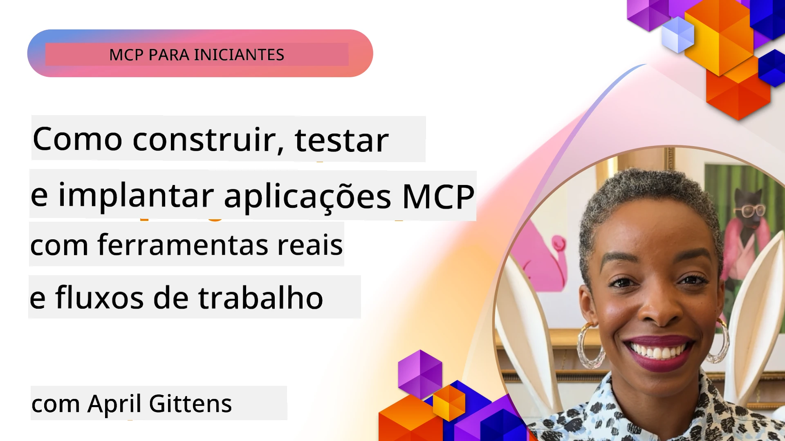
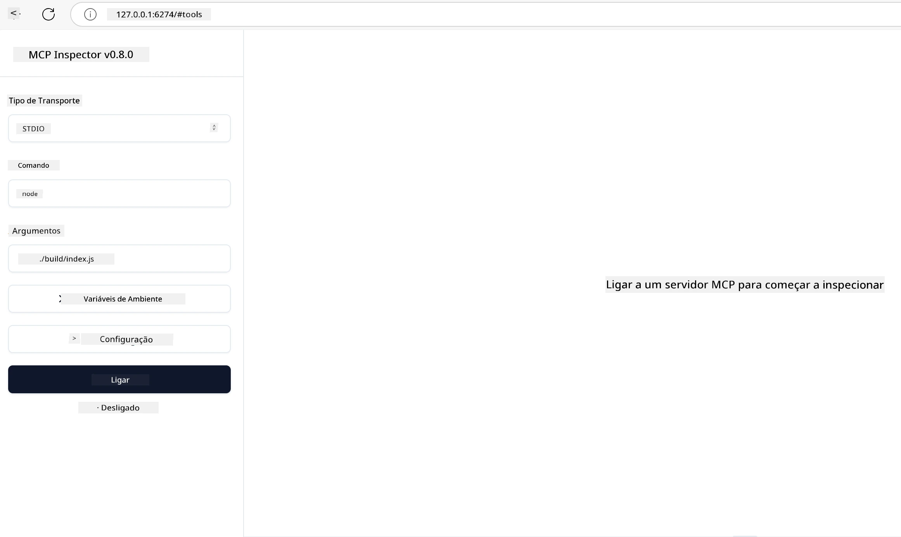

# Implementação Prática

[](https://youtu.be/vCN9-mKBDfQ)

_(Clique na imagem acima para ver o vídeo desta lição)_

A implementação prática é onde o poder do Model Context Protocol (MCP) se torna tangível. Embora compreender a teoria e a arquitetura por trás do MCP seja importante, o verdadeiro valor surge quando aplicamos estes conceitos para construir, testar e implementar soluções que resolvem problemas do mundo real. Este capítulo faz a ponte entre o conhecimento conceptual e o desenvolvimento prático, guiando-o pelo processo de dar vida a aplicações baseadas em MCP.

Quer esteja a desenvolver assistentes inteligentes, a integrar IA em fluxos de trabalho empresariais ou a construir ferramentas personalizadas para processamento de dados, o MCP oferece uma base flexível. O seu design agnóstico à linguagem e SDKs oficiais para linguagens de programação populares tornam-no acessível a um vasto leque de programadores. Aproveitando estes SDKs, pode criar protótipos rapidamente, iterar e escalar as suas soluções em diferentes plataformas e ambientes.

Nas seções seguintes, encontrará exemplos práticos, código de amostra e estratégias de implementação que demonstram como implementar MCP em C#, Java com Spring, TypeScript, JavaScript e Python. Também aprenderá a fazer debug e testar os seus servidores MCP, gerir APIs e implementar soluções na cloud usando Azure. Estes recursos práticos são desenhados para acelerar o seu aprendizado e ajudar a construir com confiança aplicações MCP robustas e prontas para produção.

## Visão Geral

Esta lição foca-se nos aspetos práticos da implementação de MCP em múltiplas linguagens de programação. Vamos explorar como usar os SDKs MCP em C#, Java com Spring, TypeScript, JavaScript e Python para construir aplicações robustas, fazer debug e testar servidores MCP, e criar recursos, prompts e ferramentas reutilizáveis.

## Objetivos de Aprendizagem

No final desta lição, será capaz de:

- Implementar soluções MCP usando SDKs oficiais em várias linguagens de programação
- Fazer debug e testar servidores MCP de forma sistemática
- Criar e usar funcionalidades de servidor (Recursos, Prompts e Ferramentas)
- Projetar workflows MCP eficazes para tarefas complexas
- Otimizar implementações MCP para desempenho e fiabilidade

## Recursos Oficiais dos SDKs

O Model Context Protocol oferece SDKs oficiais para várias linguagens (alinhados com a [Especificação MCP 2025-11-25](https://spec.modelcontextprotocol.io/specification/2025-11-25/)):

- [SDK C#](https://github.com/modelcontextprotocol/csharp-sdk)
- [SDK Java com Spring](https://github.com/modelcontextprotocol/java-sdk) **Nota:** requer dependência do [Project Reactor](https://projectreactor.io). (Veja a [discussão issue 246](https://github.com/orgs/modelcontextprotocol/discussions/246).)
- [SDK TypeScript](https://github.com/modelcontextprotocol/typescript-sdk)
- [SDK Python](https://github.com/modelcontextprotocol/python-sdk)
- [SDK Kotlin](https://github.com/modelcontextprotocol/kotlin-sdk)
- [SDK Go](https://github.com/modelcontextprotocol/go-sdk)

## Trabalhar com os SDKs MCP

Esta seção fornece exemplos práticos de implementação MCP em várias linguagens de programação. Pode encontrar código de amostra na diretoria `samples` organizada por linguagem.

### Amostras Disponíveis

O repositório inclui [implementações de exemplo](../../../04-PracticalImplementation/samples) nas seguintes linguagens:

- [C#](./samples/csharp/README.md)
- [Java com Spring](./samples/java/containerapp/README.md)
- [TypeScript](./samples/typescript/README.md)
- [JavaScript](./samples/javascript/README.md)
- [Python](./samples/python/README.md)

Cada amostra demonstra conceitos e padrões chave do MCP para essa linguagem e ecossistema específicos.

### Guias Práticos

Guias adicionais para implementação prática MCP:

- [Paginação e Grandes Conjuntos de Resultados](./pagination/README.md) - Gerir paginação baseada em cursor para ferramentas, recursos e grandes conjuntos de dados

## Funcionalidades Principais do Servidor

Servidores MCP podem implementar qualquer combinação destas funcionalidades:

### Recursos

Recursos fornecem contexto e dados para o utilizador ou modelo de IA usar:

- Repositórios de documentos
- Bases de conhecimento
- Fontes de dados estruturados
- Sistemas de ficheiros

### Prompts

Prompts são mensagens e workflows modelados para utilizadores:

- Modelos de conversação pré-definidos
- Padrões de interação guiada
- Estruturas de diálogo especializadas

### Ferramentas

Ferramentas são funções para o modelo de IA executar:

- Utilitários de processamento de dados
- Integrações com APIs externas
- Capacidades computacionais
- Funcionalidade de pesquisa

## Implementações de Amostra: Implementação em C#

O repositório oficial do SDK C# contém várias implementações de exemplo que demonstram diferentes aspetos do MCP:

- **Cliente MCP Básico**: Exemplo simples mostrando como criar um cliente MCP e chamar ferramentas
- **Servidor MCP Básico**: Implementação mínima de servidor com registo básico de ferramentas
- **Servidor MCP Avançado**: Servidor completo com registo de ferramentas, autenticação e tratamento de erros
- **Integração com ASP.NET**: Exemplos demonstrando integração com ASP.NET Core
- **Padrões de Implementação de Ferramentas**: Vários padrões para implementar ferramentas com diferentes níveis de complexidade

O SDK MCP C# está em pré-visualização e as APIs podem mudar. Vamos atualizar continuamente este blogue à medida que o SDK evolui.

### Funcionalidades Principais

- [NuGet MCP C# ModelContextProtocol](https://www.nuget.org/packages/ModelContextProtocol)
- Construir o seu [primeiro Servidor MCP](https://devblogs.microsoft.com/dotnet/build-a-model-context-protocol-mcp-server-in-csharp/).

Para amostras completas de implementação em C#, visite o [repositório oficial de amostras do SDK C#](https://github.com/modelcontextprotocol/csharp-sdk)

## Implementação de Exemplo: Implementação Java com Spring

O SDK Java com Spring oferece opções robustas para implementação MCP com funcionalidades empresariais.

### Funcionalidades Principais

- Integração com o Spring Framework
- Forte segurança de tipos
- Suporte a programação reativa
- Tratamento completo de erros

Para uma amostra completa de implementação Java com Spring, veja a [amostra Java com Spring](samples/java/containerapp/README.md) na diretoria de samples.

## Implementação de Exemplo: Implementação JavaScript

O SDK JavaScript fornece uma abordagem leve e flexível para a implementação MCP.

### Funcionalidades Principais

- Suporte para Node.js e browser
- API baseada em Promises
- Integração fácil com Express e outros frameworks
- Suporte WebSocket para streaming

Para uma amostra completa de implementação JavaScript, veja a [amostra JavaScript](samples/javascript/README.md) na diretoria de samples.

## Implementação de Exemplo: Implementação Python

O SDK Python oferece uma abordagem Pythonica para a implementação MCP com excelentes integrações de frameworks ML.

### Funcionalidades Principais

- Suporte async/await com asyncio
- Integração FastAPI``
- Registo simples de ferramentas
- Integração nativa com bibliotecas ML populares

Para uma amostra completa de implementação Python, veja a [amostra Python](samples/python/README.md) na diretoria de samples.

## Gestão de API

Azure API Management é uma ótima solução para garantir a segurança dos Servidores MCP. A ideia é colocar uma instância do Azure API Management à frente do seu Servidor MCP e deixar que este trate funcionalidades que provavelmente desejará, como:

- limitação de taxa
- gestão de tokens
- monitorização
- balanceamento de carga
- segurança

### Exemplo Azure

Aqui está um exemplo Azure que faz exatamente isso, i.e [criar um Servidor MCP e protegê-lo com Azure API Management](https://github.com/Azure-Samples/remote-mcp-apim-functions-python).

Veja como ocorre o fluxo de autorização na imagem abaixo:


Na imagem anterior, ocorre o seguinte:

- Autenticação/Autorização acontece usando Microsoft Entra.
- O Azure API Management atua como gateway e usa políticas para direcionar e gerir o tráfego.
- O Azure Monitor regista todas as solicitações para análise posterior.

#### Fluxo de autorização

Vamos olhar com mais detalhe para o fluxo de autorização:


#### Especificação de autorização MCP

Saiba mais sobre a [Especificação de Autorização MCP](https://spec.modelcontextprotocol.io/specification/2025-11-25/basic/authorization/)

## Implementar Servidor MCP Remoto no Azure

Vamos ver se conseguimos implantar o exemplo mencionado anteriormente:

1. Clone o repositório

    ```bash
    git clone https://github.com/Azure-Samples/remote-mcp-apim-functions-python.git
    cd remote-mcp-apim-functions-python
    ```

1. Registe o fornecedor de recursos `Microsoft.App`.

   - Se estiver a usar Azure CLI, execute `az provider register --namespace Microsoft.App --wait`.
   - Se estiver a usar Azure PowerShell, execute `Register-AzResourceProvider -ProviderNamespace Microsoft.App`. Depois, execute `(Get-AzResourceProvider -ProviderNamespace Microsoft.App).RegistrationState` passado algum tempo para verificar se o registo está completo.

1. Execute este comando [azd](https://aka.ms/azd) para provisionar o serviço de gestão de API, função app (com código) e todos os outros recursos Azure necessários

    ```shell
    azd up
    ```

    Estes comandos deverão implantar todos os recursos na cloud no Azure

### Testar o seu servidor com o MCP Inspector

1. Numa **nova janela de terminal**, instale e execute o MCP Inspector

    ```shell
    npx @modelcontextprotocol/inspector
    ```

    Deverá ver uma interface semelhante a:

    

1. CTRL clique para carregar a aplicação web MCP Inspector a partir da URL exibida pela app (exemplo: [http://127.0.0.1:6274/#resources](http://127.0.0.1:6274/#resources))
1. Defina o tipo de transporte para `SSE`
1. Defina o URL para o seu endpoint SSE do API Management em execução que é exibido após o comando `azd up` e **ligue-se**:

    ```shell
    https://<apim-servicename-from-azd-output>.azure-api.net/mcp/sse
    ```

1. **Listar Ferramentas**. Clique numa ferramenta e **Executar Ferramenta**.  

Se todos os passos funcionaram, deverá agora estar ligado ao servidor MCP e ter sido capaz de chamar uma ferramenta.

## Servidores MCP para Azure

[Remote-mcp-functions](https://github.com/Azure-Samples/remote-mcp-functions-dotnet): Este conjunto de repositórios são templates de arranque rápido para construir e implementar servidores MCP remotos personalizados usando Azure Functions com Python, C# .NET ou Node/TypeScript.

As amostras fornecem uma solução completa que permite aos programadores:

- Construir e executar localmente: Desenvolver e depurar um servidor MCP numa máquina local
- Implementar no Azure: Implantar facilmente na cloud com um simples comando azd up
- Ligar a partir de clientes: Ligar ao servidor MCP de vários clientes, incluindo o modo agente Copilot do VS Code e a ferramenta MCP Inspector

### Funcionalidades Principais

- Segurança por design: O servidor MCP é seguro usando chaves e HTTPS
- Opções de autenticação: Suporta OAuth usando autenticação integrada e/ou API Management
- Isolamento de rede: Permite isolamento de rede usando Azure Virtual Networks (VNET)
- Arquitetura serverless: Utiliza Azure Functions para execução escalável orientada a eventos
- Desenvolvimento local: Suporte completo para desenvolvimento e depuração local
- Implantação simples: Processo simplificado de implantação para o Azure

O repositório inclui todos os ficheiros de configuração necessários, código-fonte e definições de infraestrutura para começar rapidamente com uma implementação de servidor MCP pronta para produção.

- [Azure Remote MCP Functions Python](https://github.com/Azure-Samples/remote-mcp-functions-python) - Exemplo de implementação MCP usando Azure Functions com Python

- [Azure Remote MCP Functions .NET](https://github.com/Azure-Samples/remote-mcp-functions-dotnet) - Exemplo de implementação MCP usando Azure Functions com C# .NET

- [Azure Remote MCP Functions Node/Typescript](https://github.com/Azure-Samples/remote-mcp-functions-typescript) - Exemplo de implementação MCP usando Azure Functions com Node/TypeScript.

## Principais Conclusões

- SDKs MCP fornecem ferramentas específicas por linguagem para implementar soluções MCP robustas
- O processo de debug e teste é crítico para aplicações MCP fiáveis
- Modelos de prompts reutilizáveis permitem interações consistentes com IA
- Workflows bem desenhados podem orquestrar tarefas complexas usando múltiplas ferramentas
- Implementar soluções MCP requer consideração da segurança, desempenho e tratamento de erros

## Exercício

Projete um workflow prático MCP que resolva um problema real no seu domínio:

1. Identifique 3-4 ferramentas que seriam úteis para resolver esse problema
2. Crie um diagrama de workflow que mostre como essas ferramentas interagem
3. Implemente uma versão básica de uma das ferramentas usando a sua linguagem preferida
4. Crie um modelo de prompt que ajude o modelo a usar efetivamente a sua ferramenta

## Recursos Adicionais

---

## O Que Vem a Seguir

Seguinte: [Tópicos Avançados](../05-AdvancedTopics/README.md)

---

<!-- CO-OP TRANSLATOR DISCLAIMER START -->
**Aviso Legal**:
Este documento foi traduzido utilizando o serviço de tradução automática [Co-op Translator](https://github.com/Azure/co-op-translator). Embora nos esforcemos pela precisão, por favor tenha em conta que traduções automáticas podem conter erros ou imprecisões. O documento original na sua língua nativa deve ser considerado a fonte autorizada. Para informação crítica, recomenda-se tradução profissional realizada por humanos. Não nos responsabilizamos por quaisquer mal-entendidos ou interpretações erradas decorrentes da utilização desta tradução.
<!-- CO-OP TRANSLATOR DISCLAIMER END -->