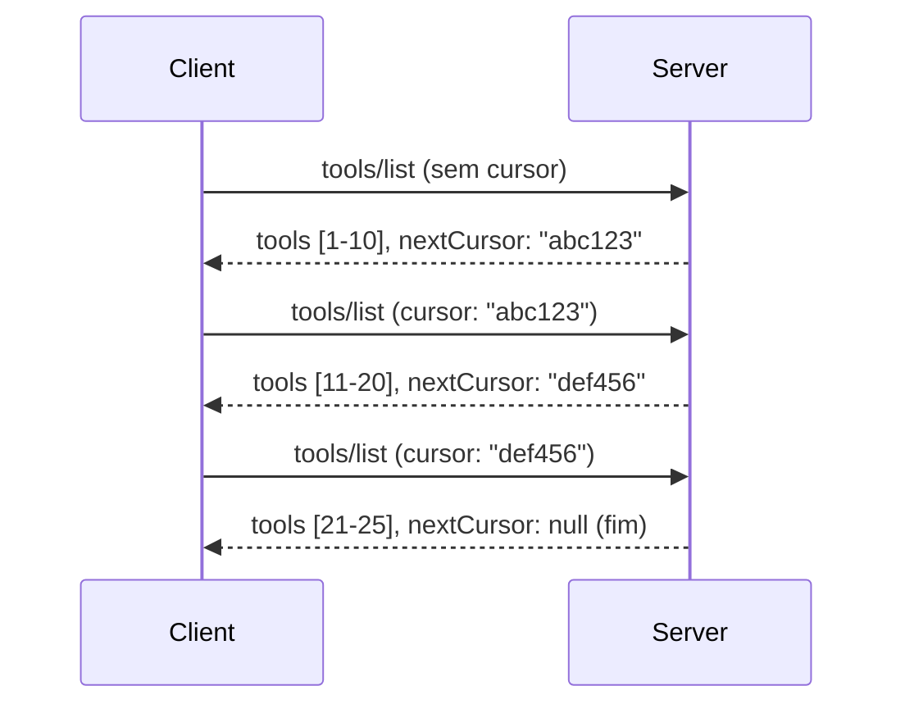

# Paginação e Conjuntos de Resultados Grandes no MCP

Quando o seu servidor MCP lida com grandes conjuntos de dados - seja listando milhares de ficheiros, registos de bases de dados, ou resultados de pesquisa - necessita de paginação para gerir a memória eficientemente e fornecer experiências de utilizador responsivas. Este guia cobre como implementar e usar a paginação no MCP.

## Porquê a Paginação

Sem paginação, respostas grandes podem causar:

- **Exaustão de memória** - Carregamento de milhões de registos de uma só vez
- **Tempos de resposta lentos** - Utilizadores esperam enquanto todos os dados carregam
- **Erros de timeout** - Pedidos excedem os limites de tempo
- **Desempenho pobre de IA** - LLMs têm dificuldades com contexto massivo

O MCP utiliza **paginação baseada em cursor** para uma paginação fiável e consistente através dos conjuntos de resultados.

---

## Como Funciona a Paginação no MCP

### O Conceito de Cursor

Um **cursor** é uma cadeia opaca que marca a sua posição num conjunto de resultados. Pense nele como um marcador num livro longo.


### Paginação nos Métodos MCP

Estes métodos MCP suportam paginação:

| Método | Retorna | Suporte a Cursor |
|--------|---------|------------------|
| `tools/list` | Definições de ferramentas | ✅ |
| `resources/list` | Definições de recursos | ✅ |
| `prompts/list` | Definições de prompts | ✅ |
| `resources/templates/list` | Templates de recursos | ✅ |

---

## Implementação no Servidor

### Python (FastMCP)

```python
from mcp.server import Server
from mcp.types import Tool, ListToolsResult
import math

app = Server("paginated-server")

# Conjunto de dados grande simulado
ALL_TOOLS = [
    Tool(name=f"tool_{i}", description=f"Tool number {i}", inputSchema={})
    for i in range(100)
]

PAGE_SIZE = 10

@app.list_tools()
async def list_tools(cursor: str | None = None) -> ListToolsResult:
    """List tools with pagination support."""
    
    # Decodificar cursor para obter índice inicial
    start_index = 0
    if cursor:
        try:
            start_index = int(cursor)
        except ValueError:
            start_index = 0
    
    # Obter página de resultados
    end_index = min(start_index + PAGE_SIZE, len(ALL_TOOLS))
    page_tools = ALL_TOOLS[start_index:end_index]
    
    # Calcular próximo cursor
    next_cursor = None
    if end_index < len(ALL_TOOLS):
        next_cursor = str(end_index)
    
    return ListToolsResult(
        tools=page_tools,
        nextCursor=next_cursor
    )
```

### TypeScript

```typescript
import { Server } from "@modelcontextprotocol/sdk/server/index.js";
import { ListToolsResultSchema } from "@modelcontextprotocol/sdk/types.js";

const server = new Server({
  name: "paginated-server",
  version: "1.0.0"
});

// Conjunto de dados grande simulado
const ALL_TOOLS = Array.from({ length: 100 }, (_, i) => ({
  name: `tool_${i}`,
  description: `Tool number ${i}`,
  inputSchema: { type: "object", properties: {} }
}));

const PAGE_SIZE = 10;

server.setRequestHandler(ListToolsResultSchema, async (request) => {
  // Decodificar cursor
  let startIndex = 0;
  if (request.params?.cursor) {
    startIndex = parseInt(request.params.cursor, 10) || 0;
  }
  
  // Obter página de resultados
  const endIndex = Math.min(startIndex + PAGE_SIZE, ALL_TOOLS.length);
  const pageTools = ALL_TOOLS.slice(startIndex, endIndex);
  
  // Calcular próximo cursor
  const nextCursor = endIndex < ALL_TOOLS.length ? String(endIndex) : undefined;
  
  return {
    tools: pageTools,
    nextCursor
  };
});
```

### Java (Spring MCP)

```java
@Service
public class PaginatedToolService {
    
    private static final int PAGE_SIZE = 10;
    private final List<Tool> allTools;
    
    public PaginatedToolService() {
        // Inicializar conjunto de dados grande
        this.allTools = IntStream.range(0, 100)
            .mapToObj(i -> new Tool("tool_" + i, "Tool number " + i, Map.of()))
            .collect(Collectors.toList());
    }
    
    @McpMethod("tools/list")
    public ListToolsResult listTools(@Param("cursor") String cursor) {
        // Decodificar cursor
        int startIndex = 0;
        if (cursor != null && !cursor.isEmpty()) {
            try {
                startIndex = Integer.parseInt(cursor);
            } catch (NumberFormatException e) {
                startIndex = 0;
            }
        }
        
        // Obter página de resultados
        int endIndex = Math.min(startIndex + PAGE_SIZE, allTools.size());
        List<Tool> pageTools = allTools.subList(startIndex, endIndex);
        
        // Calcular próximo cursor
        String nextCursor = endIndex < allTools.size() ? String.valueOf(endIndex) : null;
        
        return new ListToolsResult(pageTools, nextCursor);
    }
}
```

---

## Implementação no Cliente

### Cliente Python

```python
from mcp import ClientSession

async def get_all_tools(session: ClientSession) -> list:
    """Fetch all tools using pagination."""
    all_tools = []
    cursor = None
    
    while True:
        result = await session.list_tools(cursor=cursor)
        all_tools.extend(result.tools)
        
        if result.nextCursor is None:
            break
        cursor = result.nextCursor
    
    return all_tools

# Utilização
async with client_session as session:
    tools = await get_all_tools(session)
    print(f"Found {len(tools)} tools")
```

### Cliente TypeScript

```typescript
import { Client } from "@modelcontextprotocol/sdk/client/index.js";

async function getAllTools(client: Client): Promise<Tool[]> {
  const allTools: Tool[] = [];
  let cursor: string | undefined = undefined;
  
  do {
    const result = await client.listTools({ cursor });
    allTools.push(...result.tools);
    cursor = result.nextCursor;
  } while (cursor);
  
  return allTools;
}

// Utilização
const tools = await getAllTools(client);
console.log(`Found ${tools.length} tools`);
```

### Padrão de Carregamento Preguiçoso

Para conjuntos de dados muito grandes, carregue páginas a pedido:

```python
class PaginatedToolIterator:
    """Lazily iterate through paginated tools."""
    
    def __init__(self, session: ClientSession):
        self.session = session
        self.cursor = None
        self.buffer = []
        self.exhausted = False
    
    async def __anext__(self):
        # Retornar do buffer se disponível
        if self.buffer:
            return self.buffer.pop(0)
        
        # Verificar se esgotámos todas as páginas
        if self.exhausted:
            raise StopAsyncIteration
        
        # Buscar próxima página
        result = await self.session.list_tools(cursor=self.cursor)
        self.buffer = list(result.tools)
        self.cursor = result.nextCursor
        
        if self.cursor is None:
            self.exhausted = True
        
        if not self.buffer:
            raise StopAsyncIteration
        
        return self.buffer.pop(0)
    
    def __aiter__(self):
        return self

# Utilização - eficiente em memória para grandes conjuntos de dados
async for tool in PaginatedToolIterator(session):
    process_tool(tool)
```

---

## Paginação para Recursos

Recursos frequentemente necessitam paginação para diretórios ou conjuntos grandes de dados:

```python
from mcp.server import Server
from mcp.types import Resource, ListResourcesResult
import os

app = Server("file-server")

@app.list_resources()
async def list_resources(cursor: str | None = None) -> ListResourcesResult:
    """List files in directory with pagination."""
    
    directory = "/data/files"
    all_files = sorted(os.listdir(directory))
    
    # Decodificar cursor (índice do ficheiro)
    start_index = int(cursor) if cursor else 0
    page_size = 20
    end_index = min(start_index + page_size, len(all_files))
    
    # Criar lista de recursos para esta página
    resources = []
    for filename in all_files[start_index:end_index]:
        filepath = os.path.join(directory, filename)
        resources.append(Resource(
            uri=f"file://{filepath}",
            name=filename,
            mimeType="application/octet-stream"
        ))
    
    # Calcular próximo cursor
    next_cursor = str(end_index) if end_index < len(all_files) else None
    
    return ListResourcesResult(
        resources=resources,
        nextCursor=next_cursor
    )
```

---

## Estratégias de Design para Cursor

### Estratégia 1: Baseada em Índice (Simples)

```python
# O cursor é apenas o índice
cursor = "50"  # Começar no item 50
```

**Prós:** Simples, sem estado  
**Contras:** Resultados podem mudar se items forem adicionados/removidos

### Estratégia 2: Baseada em ID (Estável)

```python
# Cursor é o último ID visto
cursor = "item_abc123"  # Começar após este item
```

**Prós:** Estável mesmo se os items mudarem  
**Contras:** Requer IDs ordenados

### Estratégia 3: Estado Codificado (Complexo)

```python
import base64
import json

def encode_cursor(state: dict) -> str:
    return base64.b64encode(json.dumps(state).encode()).decode()

def decode_cursor(cursor: str) -> dict:
    return json.loads(base64.b64decode(cursor).decode())

# O cursor contém múltiplos campos de estado
cursor = encode_cursor({
    "offset": 50,
    "filter": "active",
    "sort": "name"
})
```

**Prós:** Pode codificar estados complexos  
**Contras:** Mais complexo, strings de cursor maiores

---

## Boas Práticas

### 1. Escolha Tamanhos de Página Apropriados

```python
# Considerar o tamanho dos dados
PAGE_SIZE_SMALL_ITEMS = 100   # Metadados simples
PAGE_SIZE_MEDIUM_ITEMS = 20   # Objetos mais complexos
PAGE_SIZE_LARGE_ITEMS = 5     # Conteúdo complexo
```

### 2. Trate Cursors Inválidos de Forma Elegante

```python
@app.list_tools()
async def list_tools(cursor: str | None = None) -> ListToolsResult:
    try:
        start_index = int(cursor) if cursor else 0
        if start_index < 0 or start_index >= len(ALL_TOOLS):
            start_index = 0  # Repor para o início
    except (ValueError, TypeError):
        start_index = 0  # Cursor inválido, começar de novo
    # ...
```

### 3. Inclua Contagem Total (Opcional)

```python
return ListToolsResult(
    tools=page_tools,
    nextCursor=next_cursor,
    # Algumas implementações incluem total para progresso da UI
    _meta={"total": len(ALL_TOOLS)}
)
```

### 4. Teste Casos Limite

```python
async def test_pagination():
    # Conjunto de resultados vazio
    result = await session.list_tools()
    assert result.tools == []
    assert result.nextCursor is None
    
    # Página única
    result = await session.list_tools()
    assert len(result.tools) <= PAGE_SIZE
    
    # Cursor inválido
    result = await session.list_tools(cursor="invalid")
    assert result.tools  # Deve devolver a primeira página
```

---

## Armadilhas Comuns

### ❌ Retornar Todos os Resultados e Depois Paginar no Cliente

```python
# MAU: Carrega tudo para a memória
@app.list_tools()
async def list_tools() -> ListToolsResult:
    all_tools = load_all_tools()  # 1 milhão de ferramentas!
    return ListToolsResult(tools=all_tools)
```

### ✅ Pagine na Fonte dos Dados

```python
# BOM: Carrega apenas o que é necessário
@app.list_tools()
async def list_tools(cursor: str | None = None) -> ListToolsResult:
    offset = int(cursor) if cursor else 0
    tools = await db.query_tools(offset=offset, limit=PAGE_SIZE)
    return ListToolsResult(tools=tools, nextCursor=...)
```

---

## Próximos Passos

- [Módulo 5.14 - Engenharia de Contexto](../../05-AdvancedTopics/mcp-contextengineering/README.md)
- [Módulo 8 - Boas Práticas](../../08-BestPractices/README.md)
- [3.8 - Testar o Seu Servidor MCP](../../03-GettingStarted/08-testing/README.md)

---

## Recursos Adicionais

- [Especificação MCP - Paginação](https://spec.modelcontextprotocol.io/specification/2025-11-25/)
- [Paginação Baseada em Cursor Explicada](https://slack.engineering/evolving-api-pagination-at-slack/)
- [Testes de paginação do SDK Python](https://github.com/modelcontextprotocol/python-sdk/blob/main/tests/client/test_list_methods_cursor.py)

---

<!-- CO-OP TRANSLATOR DISCLAIMER START -->
**Aviso Legal**:  
Este documento foi traduzido utilizando o serviço de tradução automática [Co-op Translator](https://github.com/Azure/co-op-translator). Embora nos esforcemos pela precisão, por favor tenha em conta que traduções automáticas podem conter erros ou imprecisões. O documento original na sua língua nativa deve ser considerado a fonte oficial. Para informação crítica, recomenda-se a tradução profissional por um humano. Não nos responsabilizamos por quaisquer mal-entendidos ou interpretações incorretas decorrentes do uso desta tradução.
<!-- CO-OP TRANSLATOR DISCLAIMER END -->