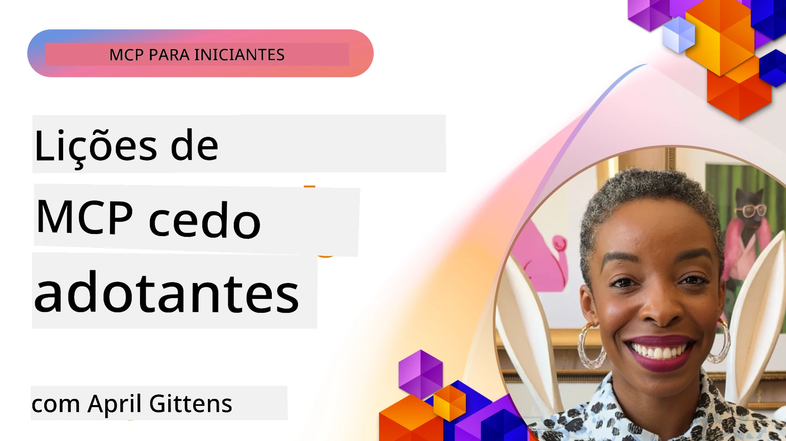

# 🌟 Lições dos Primeiros Adoptantes

[](https://youtu.be/jds7dSmNptE)

_(Clique na imagem acima para ver o vídeo desta lição)_

## 🎯 O Que Este Módulo Cobre

Este módulo explora como organizações e desenvolvedores reais estão a aproveitar o Model Context Protocol (MCP) para resolver desafios reais e impulsionar a inovação. Através de estudos de caso detalhados, projetos práticos e exemplos aplicados, descobrirá como MCP permite uma integração de IA segura, escalável que conecta modelos de linguagem, ferramentas e dados empresariais.

### 📚 Veja o MCP em Ação

Quer ver estes princípios aplicados a ferramentas prontas para produção? Confira os nossos [**10 Servidores MCP da Microsoft Que Estão a Transformar a Produtividade dos Desenvolvedores**](microsoft-mcp-servers.md), que apresentam servidores MCP reais da Microsoft que pode usar hoje.

## Visão Geral

Esta lição explora como os primeiros adoptantes tiraram partido do Model Context Protocol (MCP) para resolver desafios do mundo real e impulsionar a inovação em várias indústrias. Através de estudos de caso detalhados e projetos práticos, verá como MCP permite uma integração normalizada, segura e escalável de IA — ligando grandes modelos de linguagem, ferramentas e dados empresariais numa estrutura unificada. Irá ganhar experiência prática no design e construção de soluções baseadas em MCP, aprender com padrões comprovados de implementação e descobrir as melhores práticas para implantar MCP em ambientes de produção. A lição também destaca tendências emergentes, direções futuras e recursos open-source para o ajudar a manter-se na vanguarda da tecnologia MCP e do seu ecossistema em evolução.

## Objetivos de Aprendizagem

- Analisar implementações reais de MCP em diferentes indústrias
- Projetar e construir aplicações completas baseadas em MCP
- Explorar tendências emergentes e direções futuras na tecnologia MCP
- Aplicar melhores práticas em cenários reais de desenvolvimento

## Implementações Reais de MCP

### Estudo de Caso 1: Automação de Suporte ao Cliente Empresarial

Uma multinacional implementou uma solução baseada em MCP para padronizar as interações de IA nos seus sistemas de suporte ao cliente. Isto permitiu-lhes:

- Criar uma interface unificada para múltiplos fornecedores de LLM
- Manter uma gestão consistente de prompts em vários departamentos
- Implementar controlos robustos de segurança e conformidade
- Alternar facilmente entre diferentes modelos de IA consoante necessidades específicas

**Implementação Técnica:**

```python
# Implementação do servidor MCP em Python para suporte ao cliente
import logging
import asyncio
from modelcontextprotocol import create_server, ServerConfig
from modelcontextprotocol.server import MCPServer
from modelcontextprotocol.transports import create_http_transport
from modelcontextprotocol.resources import ResourceDefinition
from modelcontextprotocol.prompts import PromptDefinition
from modelcontextprotocol.tool import ToolDefinition

# Configurar o registo
logging.basicConfig(level=logging.INFO)

async def main():
    # Criar configuração do servidor
    config = ServerConfig(
        name="Enterprise Customer Support Server",
        version="1.0.0",
        description="MCP server for handling customer support inquiries"
    )
    
    # Inicializar o servidor MCP
    server = create_server(config)
    
    # Registar recursos da base de conhecimento
    server.resources.register(
        ResourceDefinition(
            name="customer_kb",
            description="Customer knowledge base documentation"
        ),
        lambda params: get_customer_documentation(params)
    )
    
    # Registar modelos de prompts
    server.prompts.register(
        PromptDefinition(
            name="support_template",
            description="Templates for customer support responses"
        ),
        lambda params: get_support_templates(params)
    )
    
    # Registar ferramentas de suporte
    server.tools.register(
        ToolDefinition(
            name="ticketing",
            description="Create and update support tickets"
        ),
        handle_ticketing_operations
    )
    
    # Iniciar servidor com transporte HTTP
    transport = create_http_transport(port=8080)
    await server.run(transport)

if __name__ == "__main__":
    asyncio.run(main())
```
  
**Resultados:** redução de 30% nos custos dos modelos, melhoria de 45% na consistência das respostas e maior conformidade nas operações globais.

### Estudo de Caso 2: Assistente Diagnóstico na Saúde

Um prestador de cuidados de saúde desenvolveu uma infraestrutura MCP para integrar múltiplos modelos médicos especializados em IA, garantindo que dados sensíveis dos pacientes permanecem protegidos:

- Alternância suave entre modelos médicos generalistas e especialistas
- Controlos rigorosos de privacidade e registos de auditoria
- Integração com sistemas existentes de Registo Eletrónico de Saúde (EHR)
- Engenharia consistente de prompts para terminologia médica

**Implementação Técnica:**

```csharp
// C# MCP host application implementation in healthcare application
using Microsoft.Extensions.DependencyInjection;
using ModelContextProtocol.SDK.Client;
using ModelContextProtocol.SDK.Security;
using ModelContextProtocol.SDK.Resources;

public class DiagnosticAssistant
{
    private readonly MCPHostClient _mcpClient;
    private readonly PatientContext _patientContext;
    
    public DiagnosticAssistant(PatientContext patientContext)
    {
        _patientContext = patientContext;
        
        // Configure MCP client with healthcare-specific settings
        var clientOptions = new ClientOptions
        {
            Name = "Healthcare Diagnostic Assistant",
            Version = "1.0.0",
            Security = new SecurityOptions
            {
                Encryption = EncryptionLevel.Medical,
                AuditEnabled = true
            }
        };
        
        _mcpClient = new MCPHostClientBuilder()
            .WithOptions(clientOptions)
            .WithTransport(new HttpTransport("https://healthcare-mcp.example.org"))
            .WithAuthentication(new HIPAACompliantAuthProvider())
            .Build();
    }
    
    public async Task<DiagnosticSuggestion> GetDiagnosticAssistance(
        string symptoms, string patientHistory)
    {
        // Create request with appropriate resources and tool access
        var resourceRequest = new ResourceRequest
        {
            Name = "patient_records",
            Parameters = new Dictionary<string, object>
            {
                ["patientId"] = _patientContext.PatientId,
                ["requestingProvider"] = _patientContext.ProviderId
            }
        };
        
        // Request diagnostic assistance using appropriate prompt
        var response = await _mcpClient.SendPromptRequestAsync(
            promptName: "diagnostic_assistance",
            parameters: new Dictionary<string, object>
            {
                ["symptoms"] = symptoms,
                patientHistory = patientHistory,
                relevantGuidelines = _patientContext.GetRelevantGuidelines()
            });
            
        return DiagnosticSuggestion.FromMCPResponse(response);
    }
}
```
  
**Resultados:** sugestões diagnósticas melhoradas para médicos, mantendo total conformidade HIPAA e redução significativa na troca de contexto entre sistemas.

### Estudo de Caso 3: Análise de Risco em Serviços Financeiros

Uma instituição financeira implementou MCP para padronizar os seus processos de análise de risco em vários departamentos:

- Criou uma interface unificada para modelos de risco de crédito, deteção de fraude e risco de investimento
- Implementou controlos estritos de acesso e versionamento de modelos
- Garantiu auditoria de todas as recomendações de IA
- Manteve formatação de dados consistente em sistemas diversos

**Implementação Técnica:**

```java
// Servidor MCP Java para avaliação de risco financeiro
import org.mcp.server.*;
import org.mcp.security.*;

public class FinancialRiskMCPServer {
    public static void main(String[] args) {
        // Criar servidor MCP com funcionalidades de conformidade financeira
        MCPServer server = new MCPServerBuilder()
            .withModelProviders(
                new ModelProvider("risk-assessment-primary", new AzureOpenAIProvider()),
                new ModelProvider("risk-assessment-audit", new LocalLlamaProvider())
            )
            .withPromptTemplateDirectory("./compliance/templates")
            .withAccessControls(new SOCCompliantAccessControl())
            .withDataEncryption(EncryptionStandard.FINANCIAL_GRADE)
            .withVersionControl(true)
            .withAuditLogging(new DatabaseAuditLogger())
            .build();
            
        server.addRequestValidator(new FinancialDataValidator());
        server.addResponseFilter(new PII_RedactionFilter());
        
        server.start(9000);
        
        System.out.println("Financial Risk MCP Server running on port 9000");
    }
}
```
  
**Resultados:** maior conformidade regulatória, ciclos de implantação de modelos 40% mais rápidos e melhor consistência na avaliação de risco entre departamentos.

### Estudo de Caso 4: Microsoft Playwright MCP Server para Automação de Navegadores

A Microsoft desenvolveu o [Playwright MCP server](https://github.com/microsoft/playwright-mcp) para permitir a automação segura e normalizada de navegadores através do Model Context Protocol. Este servidor pronto para produção permite que agentes IA e LLMs interajam com navegadores web de forma controlada, auditável e extensível — possibilitando casos de uso como testes web automatizados, extração de dados e fluxos de trabalho end-to-end.

> **🎯 Ferramenta Pronta para Produção**  
>  
> Este estudo de caso apresenta um servidor MCP real que pode usar hoje! Saiba mais sobre o Playwright MCP Server e outros 9 servidores MCP da Microsoft em produção no nosso [**Guia de Servidores MCP da Microsoft**](microsoft-mcp-servers.md#8--playwright-mcp-server).

**Principais Funcionalidades:**  
- Expõe capacidades de automação do navegador (navegação, preenchimento de formulários, captura de ecrã, etc.) como ferramentas MCP  
- Implementa controlos de acesso rigorosos e sandboxing para evitar ações não autorizadas  
- Fornece registos detalhados de auditoria para toda a interação com o navegador  
- Suporta integração com Azure OpenAI e outros fornecedores de LLM para automação conduzida por agentes  
- Alimenta o Agente de Codificação do GitHub Copilot com capacidades de navegação web  

**Implementação Técnica:**

```typescript
// TypeScript: Registar ferramentas de automação de browser Playwright num servidor MCP
import { createServer, ToolDefinition } from 'modelcontextprotocol';
import { launch } from 'playwright';

const server = createServer({
  name: 'Playwright MCP Server',
  version: '1.0.0',
  description: 'MCP server for browser automation using Playwright'
});

// Registar uma ferramenta para navegar para uma URL e capturar uma captura de ecrã
server.tools.register(
  new ToolDefinition({
    name: 'navigate_and_screenshot',
    description: 'Navigate to a URL and capture a screenshot',
    parameters: {
      url: { type: 'string', description: 'The URL to visit' }
    }
  }),
  async ({ url }) => {
    const browser = await launch();
    const page = await browser.newPage();
    await page.goto(url);
    const screenshot = await page.screenshot();
    await browser.close();
    return { screenshot };
  }
);

// Iniciar o servidor MCP
server.listen(8080);
```
  
**Resultados:**

- Automação programática segura de navegadores para agentes IA e LLMs  
- Redução do esforço manual de testes e melhoria da cobertura em aplicações web  
- Framework reutilizável e extensível para integração de ferramentas baseadas em navegador em ambientes empresariais  
- Alimenta as capacidades de navegação web do GitHub Copilot  

**Referências:**

- [Repositório Playwright MCP Server no GitHub](https://github.com/microsoft/playwright-mcp)  
- [Soluções Microsoft de IA e Automação](https://azure.microsoft.com/en-us/products/ai-services/)

### Estudo de Caso 5: Azure MCP – Model Context Protocol Empresarial como Serviço

O Azure MCP Server ([https://aka.ms/azmcp](https://aka.ms/azmcp)) é a implementação gerida e empresarial do Model Context Protocol pela Microsoft, concebida para fornecer capacidades escaláveis, seguras e em conformidade como um serviço na nuvem. O Azure MCP permite às organizações implementar, gerir e integrar rapidamente servidores MCP com os serviços Azure AI, dados e segurança, reduzindo a sobrecarga operacional e acelerando a adoção de IA.

> **🎯 Ferramenta Pronta para Produção**  
>  
> Este é um servidor MCP real que pode usar hoje! Saiba mais sobre o Azure AI Foundry MCP Server no nosso [**Guia de Servidores MCP da Microsoft**](microsoft-mcp-servers.md).

- Hospedagem totalmente gerida de servidores MCP com escalabilidade, monitorização e segurança incorporadas  
- Integração nativa com Azure OpenAI, Azure AI Search e outros serviços Azure  
- Autenticação e autorização empresarial via Microsoft Entra ID  
- Suporte para ferramentas personalizadas, modelos de prompt e conectores de recursos  
- Conformidade com requisitos de segurança e regulamentares empresariais  

**Implementação Técnica:**

```yaml
# Example: Azure MCP server deployment configuration (YAML)
apiVersion: mcp.microsoft.com/v1
kind: McpServer
metadata:
  name: enterprise-mcp-server
spec:
  modelProviders:
    - name: azure-openai
      type: AzureOpenAI
      endpoint: https://<your-openai-resource>.openai.azure.com/
      apiKeySecret: <your-azure-keyvault-secret>
  tools:
    - name: document_search
      type: AzureAISearch
      endpoint: https://<your-search-resource>.search.windows.net/
      apiKeySecret: <your-azure-keyvault-secret>
  authentication:
    type: EntraID
    tenantId: <your-tenant-id>
  monitoring:
    enabled: true
    logAnalyticsWorkspace: <your-log-analytics-id>
```
  
**Resultados:**  
- Redução do tempo para valor em projetos empresariais de IA através de uma plataforma MCP pronta a usar e em conformidade  
- Integração simplificada de LLMs, ferramentas e fontes de dados empresariais  
- Maior segurança, observabilidade e eficiência operacional para cargas MCP  
- Melhoria da qualidade de código com as melhores práticas da Azure SDK e padrões atuais de autenticação  

**Referências:**  
- [Documentação Azure MCP](https://aka.ms/azmcp)  
- [Repositório Azure MCP Server no GitHub](https://github.com/Azure/azure-mcp)  
- [Serviços Azure AI](https://azure.microsoft.com/en-us/products/ai-services/)  
- [Centro Microsoft MCP](https://mcp.azure.com)

## Estudo de Caso 6: NLWeb  
MCP (Model Context Protocol) é um protocolo emergente para chatbots e assistentes IA interagirem com ferramentas. Cada instância NLWeb é também um servidor MCP, que suporta um método principal, ask, usado para fazer perguntas a um website em linguagem natural. A resposta retornada usa schema.org, um vocabulário amplamente usado para descrever dados web. Em termos simples, MCP é para NLWeb o que Http é para HTML. NLWeb combina protocolos, formatos Schema.org e código de exemplo para ajudar sites a criar rapidamente estes endpoints, beneficiando tanto humanos com interfaces conversacionais como máquinas com interação natural agente-a-agente.

Existem duas componentes distintas no NLWeb.  
- Um protocolo, muito simples inicialmente, para interfacear com um site em linguagem natural e um formato, que utiliza json e schema.org para a resposta retornada. Veja a documentação sobre a REST API para mais detalhes.  
- Uma implementação simples de (1) que aproveita marcação existente, para sites que podem ser abstratados como listas de itens (produtos, receitas, atrações, avaliações, etc.). Juntamente com um conjunto de widgets para interface do utilizador, os sites podem fornecer facilmente interfaces conversacionais para o seu conteúdo. Veja a documentação sobre Vida de uma consulta de chat para mais detalhes de como isto funciona.

**Referências:**  
- [Documentação Azure MCP](https://aka.ms/azmcp)  
- [NLWeb](https://github.com/microsoft/NlWeb)

### Estudo de Caso 7: Azure AI Foundry MCP Server – Integração de Agentes IA Empresariais

Os servidores Azure AI Foundry MCP demonstram como MCP pode ser usado para orquestrar e gerir agentes IA e fluxos de trabalho em ambientes empresariais. Ao integrar MCP com Azure AI Foundry, as organizações podem padronizar interações de agentes, aproveitar a gestão de workflows da Foundry e garantir implantações seguras e escaláveis.

> **🎯 Ferramenta Pronta para Produção**  
>  
> Este é um servidor MCP real que pode usar hoje! Saiba mais sobre o Azure AI Foundry MCP Server no nosso [**Guia de Servidores MCP da Microsoft**](microsoft-mcp-servers.md#9--azure-ai-foundry-mcp-server).

**Principais Funcionalidades:**  
- Acesso completo ao ecossistema AI da Azure, incluindo catálogos de modelos e gestão de implantações  
- Indexação de conhecimento com Azure AI Search para aplicações RAG  
- Ferramentas de avaliação para desempenho e garantia de qualidade de modelos IA  
- Integração com Azure AI Foundry Catalog e Labs para modelos de investigação avançados  
- Capacidade de gestão e avaliação de agentes para cenários de produção  

**Resultados:**  
- Protótipos rápidos e monitorização robusta de workflows de agentes IA  
- Integração fluida com serviços Azure AI para cenários avançados  
- Interface unificada para criação, implantação e monitorização de pipelines de agentes  
- Segurança, conformidade e eficiência operacional melhoradas para empresas  
- Adoção acelerada de IA mantendo controlo sobre processos complexos conduzidos por agentes  

**Referências:**  
- [Repositório Azure AI Foundry MCP Server no GitHub](https://github.com/azure-ai-foundry/mcp-foundry)  
- [Integração de Agentes Azure AI com MCP (Microsoft Foundry Blog)](https://devblogs.microsoft.com/foundry/integrating-azure-ai-agents-mcp/)

### Estudo de Caso 8: Foundry MCP Playground – Experimentação e Prototipagem

O Foundry MCP Playground oferece um ambiente pronto para usar para experimentar com servidores MCP e integrações Azure AI Foundry. Os desenvolvedores podem rapidamente prototipar, testar e avaliar modelos IA e workflows de agentes usando recursos do Azure AI Foundry Catalog e Labs. O playground simplifica a configuração, fornece projetos de exemplo e apoia o desenvolvimento colaborativo, tornando fácil explorar melhores práticas e novos cenários com mínima sobrecarga. É especialmente útil para equipas que procuram validar ideias, partilhar experiências e acelerar o aprendizado sem necessidade de infraestrutura complexa. Ao reduzir a barreira de entrada, o playground ajuda a fomentar a inovação e as contribuições da comunidade no ecossistema MCP e Azure AI Foundry.

**Referências:**

- [Repositório Foundry MCP Playground no GitHub](https://github.com/azure-ai-foundry/foundry-mcp-playground)

### Estudo de Caso 9: Microsoft Learn Docs MCP Server – Acesso a Documentação Assistido por IA

O Microsoft Learn Docs MCP Server é um serviço alojado na nuvem que fornece a assistentes IA acesso em tempo real à documentação oficial da Microsoft através do Model Context Protocol. Este servidor pronto para produção liga-se ao ecossistema completo Microsoft Learn e permite pesquisa semântica através de todas as fontes oficiais Microsoft.

> **🎯 Ferramenta Pronta para Produção**  
>  
> Este é um servidor MCP real que pode usar hoje! Saiba mais sobre o Microsoft Learn Docs MCP Server no nosso [**Guia de Servidores MCP da Microsoft**](microsoft-mcp-servers.md#1--microsoft-learn-docs-mcp-server).

**Principais Funcionalidades:**  
- Acesso em tempo real à documentação oficial Microsoft, documentação Azure e Microsoft 365  
- Capacidades avançadas de pesquisa semântica que compreendem contexto e intenção  
- Informação sempre atualizada à medida que o conteúdo Microsoft Learn é publicado  
- Cobertura abrangente de Microsoft Learn, documentação Azure e fontes Microsoft 365  
- Retorna até 10 fragmentos de conteúdo de alta qualidade com títulos e URLs  

**Porque É Fundamental:**  
- Resolve o problema do "conhecimento de IA desatualizado" para tecnologias Microsoft  
- Garante que assistentes IA têm acesso às funcionalidades mais recentes de .NET, C#, Azure e Microsoft 365  
- Fornece informação autoritativa e oficial para geração precisa de código  
- Essencial para desenvolvedores que trabalham com tecnologias Microsoft em rápida evolução  

**Resultados:**  
- Precisonaria dramaticamente melhorada do código gerado por IA para tecnologias Microsoft  
- Redução do tempo gasto a procurar documentação atualizada e melhores práticas  
- Produtividade do desenvolvedor melhorada com recuperação de documentação consciente de contexto  
- Integração perfeita com fluxos de trabalho de desenvolvimento sem sair do IDE  

**Referências:**  
- [Repositório Microsoft Learn Docs MCP Server no GitHub](https://github.com/MicrosoftDocs/mcp)  
- [Documentação Microsoft Learn](https://learn.microsoft.com/)

## Projetos Práticos

### Projeto 1: Construir um Servidor MCP Multi-Fornecedor

**Objetivo:** Criar um servidor MCP que possa encaminhar pedidos para vários fornecedores de modelos IA com base em critérios específicos.

**Requisitos:**

- Suportar pelo menos três fornecedores de modelos diferentes (ex: OpenAI, Anthropic, modelos locais)  
- Implementar um mecanismo de encaminhamento baseado em metadados do pedido  
- Criar um sistema de configuração para gerir credenciais dos fornecedores  
- Adicionar caching para otimizar desempenho e custos  
- Construir um painel simples para monitorização de uso  

**Passos da Implementação:**

1. Configurar a infraestrutura básica do servidor MCP  
2. Implementar adaptadores para cada serviço de modelo IA  
3. Criar lógica de encaminhamento baseada em atributos do pedido  
4. Adicionar mecanismos de caching para pedidos frequentes  
5. Desenvolver o painel de monitorização  
6. Testar com vários padrões de pedidos  

**Tecnologias:** Escolha entre Python (.NET/Java/Python consoante sua preferência), Redis para caching e um framework web simples para o painel.

### Projeto 2: Sistema Empresarial de Gestão de Prompts
**Objetivo:** Desenvolver um sistema baseado em MCP para gerir, versionar e implementar templates de prompts em toda a organização.

**Requisitos:**

- Criar um repositório centralizado para templates de prompts
- Implementar versionamento e fluxos de aprovação
- Construir capacidades de teste de templates com entradas de exemplo
- Desenvolver controlos de acesso baseados em funções
- Criar uma API para recuperação e implementação de templates

**Passos de Implementação:**

1. Desenhar o esquema de base de dados para armazenamento de templates
2. Criar a API principal para operações CRUD de templates
3. Implementar o sistema de versionamento
4. Construir o fluxo de trabalho de aprovação
5. Desenvolver o framework de testes
6. Criar uma interface web simples para gestão
7. Integrar com um servidor MCP

**Tecnologias:** A sua escolha de framework backend, base de dados SQL ou NoSQL, e um framework frontend para a interface de gestão.

### Projeto 3: Plataforma de Geração de Conteúdos Baseada em MCP

**Objetivo:** Construir uma plataforma de geração de conteúdos que utilize MCP para fornecer resultados consistentes em diferentes tipos de conteúdos.

**Requisitos:**

- Suportar múltiplos formatos de conteúdos (posts de blog, redes sociais, textos promocionais)
- Implementar geração baseada em templates com opções de personalização
- Criar um sistema de revisão e feedback de conteúdos
- Monitorizar métricas de desempenho dos conteúdos
- Suportar versionamento e iteração de conteúdos

**Passos de Implementação:**

1. Configurar a infraestrutura do cliente MCP
2. Criar templates para diferentes tipos de conteúdos
3. Construir a pipeline de geração de conteúdos
4. Implementar o sistema de revisão
5. Desenvolver o sistema de monitorização de métricas
6. Criar uma interface de utilizador para gestão de templates e geração de conteúdos

**Tecnologias:** A sua linguagem de programação preferida, framework web e sistema de base de dados.

## Direções Futuras para a Tecnologia MCP

### Tendências Emergentes

1. **MCP Multi-Modal**
   - Expansão do MCP para padronizar interações com modelos de imagem, áudio e vídeo
   - Desenvolvimento de capacidades de raciocínio cross-modal
   - Formatos de prompt padronizados para diferentes modalidades

2. **Infraestrutura Federada MCP**
   - Redes MCP distribuídas que possam partilhar recursos entre organizações
   - Protocolos padronizados para partilha segura de modelos
   - Técnicas de computação preservadora de privacidade

3. **Mercados MCP**
   - Ecossistemas para partilha e monetização de templates e plugins MCP
   - Processos de garantia de qualidade e certificação
   - Integração com marketplaces de modelos

4. **MCP para Edge Computing**
   - Adaptação dos padrões MCP para dispositivos edge com recursos limitados
   - Protocolos otimizados para ambientes de baixa largura de banda
   - Implementações especializadas MCP para ecossistemas IoT

5. **Quadros Regulatórios**
   - Desenvolvimento de extensões MCP para conformidade regulatória
   - Trilhas de auditoria padronizadas e interfaces de explicabilidade
   - Integração com quadros emergentes de governação de IA

### Soluções MCP da Microsoft

A Microsoft e a Azure desenvolveram vários repositórios open-source para ajudar os desenvolvedores a implementar MCP em vários cenários:

#### Organização Microsoft

1. [playwright-mcp](https://github.com/microsoft/playwright-mcp) - Um servidor MCP Playwright para automação e testes de browser
2. [files-mcp-server](https://github.com/microsoft/files-mcp-server) - Implementação de servidor MCP OneDrive para testes locais e contribuição comunitária
3. [NLWeb](https://github.com/microsoft/NlWeb) - NLWeb é uma coleção de protocolos abertos e ferramentas open source associadas. O seu foco principal é estabelecer uma camada base para a Web da IA

#### Organização Azure-Samples

1. [mcp](https://github.com/Azure-Samples/mcp) - Ligações para exemplos, ferramentas e recursos para construir e integrar servidores MCP na Azure usando múltiplas linguagens
2. [mcp-auth-servers](https://github.com/Azure-Samples/mcp-auth-servers) - Servidores MCP de referência demonstrando autenticação com a especificação atual do Model Context Protocol
3. [remote-mcp-functions](https://github.com/Azure-Samples/remote-mcp-functions) - Página de lançamento para implementações Remote MCP Server nas Azure Functions com ligações para repositórios específicos por linguagem
4. [remote-mcp-functions-python](https://github.com/Azure-Samples/remote-mcp-functions-python) - Template quickstart para construir e implementar servidores MCP remotos personalizados usando Azure Functions com Python
5. [remote-mcp-functions-dotnet](https://github.com/Azure-Samples/remote-mcp-functions-dotnet) - Template quickstart para construir e implementar servidores MCP remotos personalizados usando Azure Functions com .NET/C#
6. [remote-mcp-functions-typescript](https://github.com/Azure-Samples/remote-mcp-functions-typescript) - Template quickstart para construir e implementar servidores MCP remotos personalizados usando Azure Functions com TypeScript
7. [remote-mcp-apim-functions-python](https://github.com/Azure-Samples/remote-mcp-apim-functions-python) - Azure API Management como Gateway de IA para servidores MCP remotos usando Python
8. [AI-Gateway](https://github.com/Azure-Samples/AI-Gateway) - Experimentos APIM ❤️ IA incluindo capacidades MCP, integrando com Azure OpenAI e AI Foundry

Estes repositórios fornecem várias implementações, templates e recursos para trabalhar com o Model Context Protocol em diferentes linguagens de programação e serviços Azure. Cobre uma diversidade de casos de uso desde implementações básicas de servidores até autenticação, deployment na cloud e cenários de integração empresarial.

#### Diretório de Recursos MCP

O [diretório de Recursos MCP](https://github.com/microsoft/mcp/tree/main/Resources) no repositório oficial Microsoft MCP fornece uma coleção selecionada de recursos de exemplo, templates de prompt e definições de ferramentas para uso com servidores Model Context Protocol. Este diretório foi criado para ajudar os desenvolvedores a começar rapidamente com MCP, oferecendo blocos reutilizáveis e exemplos de melhores práticas para:

- **Templates de Prompt:** Templates de prompt prontos a usar para tarefas e cenários comuns de IA, que podem ser adaptados para as suas próprias implementações de servidores MCP.
- **Definições de Ferramentas:** Exemplos de esquemas de ferramentas e metadados para padronizar a integração e invocação de ferramentas em diferentes servidores MCP.
- **Recursos de Exemplo:** Definições de recursos de exemplo para ligação a fontes de dados, APIs e serviços externos dentro do framework MCP.
- **Implementações de Referência:** Exemplos práticos que demonstram como estruturar e organizar recursos, prompts e ferramentas em projetos MCP do mundo real.

Estes recursos aceleram o desenvolvimento, promovem a padronização e ajudam a garantir melhores práticas na construção e deployment de soluções baseadas em MCP.

#### Diretório de Recursos MCP

- [Recursos MCP (Prompt de Exemplo, Ferramentas e Definições de Recursos)](https://github.com/microsoft/mcp/tree/main/Resources)

### Oportunidades de Investigação

- Técnicas eficientes de otimização de prompts dentro de frameworks MCP
- Modelos de segurança para implementações MCP multi-inquilino
- Benchmarking de desempenho entre diferentes implementações MCP
- Métodos formais de verificação para servidores MCP

## Conclusão

O Model Context Protocol (MCP) está a moldar rapidamente o futuro da integração de IA padronizada, segura e interoperável através de indústrias. Através dos estudos de caso e projetos práticos nesta lição, viu como os primeiros adotantes—incluindo Microsoft e Azure—estão a aproveitar o MCP para resolver desafios do mundo real, acelerar a adoção de IA e garantir conformidade, segurança e escalabilidade. A abordagem modular do MCP permite às organizações conectar modelos de linguagem grandes, ferramentas e dados empresariais num framework unificado e auditável. À medida que o MCP continua a evoluir, manter-se envolvido com a comunidade, explorar recursos open-source e aplicar melhores práticas será fundamental para construir soluções de IA robustas e preparadas para o futuro.

## Recursos Adicionais

- [Repositório GitHub MCP Foundry](https://github.com/azure-ai-foundry/mcp-foundry)
- [Foundry MCP Playground](https://github.com/azure-ai-foundry/foundry-mcp-playground)
- [Integração de Agentes Azure AI com MCP (Microsoft Foundry Blog)](https://devblogs.microsoft.com/foundry/integrating-azure-ai-agents-mcp/)
- [Repositório GitHub MCP (Microsoft)](https://github.com/microsoft/mcp)
- [Diretório de Recursos MCP (Templates, Ferramentas e Definições de Recursos)](https://github.com/microsoft/mcp/tree/main/Resources)
- [Comunidade & Documentação MCP](https://modelcontextprotocol.io/introduction)
- [Especificação MCP (2025-11-25)](https://spec.modelcontextprotocol.io/specification/2025-11-25/)
- [Documentação Azure MCP](https://aka.ms/azmcp)
- [OWASP MCP Top 10](https://microsoft.github.io/mcp-azure-security-guide/mcp/) - Melhores práticas de segurança
- [Repositório GitHub Playwright MCP Server](https://github.com/microsoft/playwright-mcp)
- [Files MCP Server (OneDrive)](https://github.com/microsoft/files-mcp-server)
- [Azure-Samples MCP](https://github.com/Azure-Samples/mcp)
- [MCP Auth Servers (Azure-Samples)](https://github.com/Azure-Samples/mcp-auth-servers)
- [Remote MCP Functions (Azure-Samples)](https://github.com/Azure-Samples/remote-mcp-functions)
- [Remote MCP Functions Python (Azure-Samples)](https://github.com/Azure-Samples/remote-mcp-functions-python)
- [Remote MCP Functions .NET (Azure-Samples)](https://github.com/Azure-Samples/remote-mcp-functions-dotnet)
- [Remote MCP Functions TypeScript (Azure-Samples)](https://github.com/Azure-Samples/remote-mcp-functions-typescript)
- [Remote MCP APIM Functions Python (Azure-Samples)](https://github.com/Azure-Samples/remote-mcp-apim-functions-python)
- [AI-Gateway (Azure-Samples)](https://github.com/Azure-Samples/AI-Gateway)
- [Soluções Microsoft para IA e Automatização](https://azure.microsoft.com/en-us/products/ai-services/)

## Exercícios

1. Analise um dos estudos de caso e proponha uma abordagem alternativa de implementação.
2. Escolha uma das ideias de projeto e crie uma especificação técnica detalhada.
3. Pesquise uma indústria não abordada nos estudos de caso e esboce como o MCP poderia resolver os seus desafios específicos.
4. Explore uma das direções futuras e crie um conceito para uma nova extensão MCP que a suporte.

## O que vem a seguir

Explore mais: [Microsoft MCP Servers](./microsoft-mcp-servers.md)

Continue para: [Módulo 8: Melhores Práticas](../08-BestPractices/README.md)

---

<!-- CO-OP TRANSLATOR DISCLAIMER START -->
**Aviso Legal**:
Este documento foi traduzido utilizando o serviço de tradução automática [Co-op Translator](https://github.com/Azure/co-op-translator). Embora nos esforcemos por garantir a precisão, por favor, tenha em conta que traduções automáticas podem conter erros ou imprecisões. O documento original no seu idioma nativo deve ser considerado a fonte autorizada. Para informações críticas, recomenda-se tradução profissional realizada por um humano. Não nos responsabilizamos por quaisquer mal-entendidos ou interpretações incorretas resultantes da utilização desta tradução.
<!-- CO-OP TRANSLATOR DISCLAIMER END -->