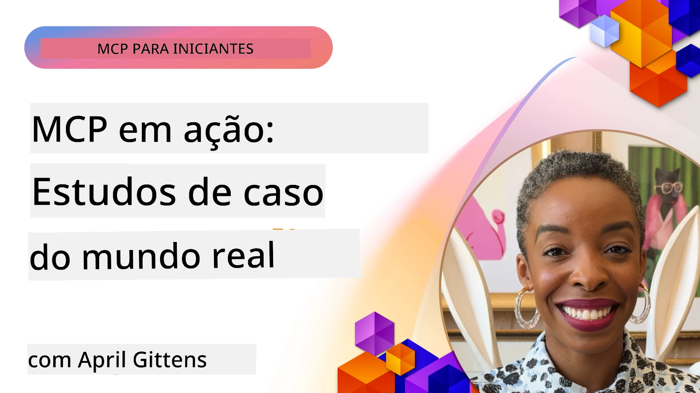

# MCP em Ação: Estudos de Caso do Mundo Real

_(Clique na imagem acima para assistir ao vídeo desta lição)_

O Model Context Protocol (MCP) está a transformar a forma como as aplicações de IA interagem com dados, ferramentas e serviços. Esta secção apresenta estudos de caso do mundo real que demonstram aplicações práticas do MCP em vários cenários empresariais.

## Visão Geral

Esta secção mostra exemplos concretos de implementações do MCP, destacando como as organizações estão a aproveitar este protocolo para resolver desafios empresariais complexos. Ao examinar estes estudos de caso, obterá insights sobre a versatilidade, escalabilidade e benefícios práticos do MCP em cenários reais.

## Objetivos Principais de Aprendizagem

Ao explorar estes estudos de caso, irá:

- Compreender como o MCP pode ser aplicado para resolver problemas empresariais específicos
- Aprender sobre diferentes padrões de integração e abordagens arquitetónicas
- Reconhecer as melhores práticas para implementar o MCP em ambientes empresariais
- Obter insights sobre os desafios e soluções encontrados em implementações reais
- Identificar oportunidades para aplicar padrões similares nos seus próprios projetos

## Estudos de Caso em Destaque

### 1. [Azure AI Travel Agents – Implementação de Referência](./travelagentsample.md)

Este estudo de caso examina a solução de referência abrangente da Microsoft que demonstra como construir uma aplicação de planeamento de viagens multi-agente, potenciadas por IA, utilizando MCP, Azure OpenAI e Azure AI Search. O projeto apresenta:

- Orquestração multi-agente através do MCP
- Integração de dados empresariais com Azure AI Search
- Arquitectura segura e escalável utilizando serviços Azure
- Ferramentas extensíveis com componentes MCP reutilizáveis
- Experiência de utilizador conversacional alimentada por Azure OpenAI

A arquitetura e detalhes de implementação oferecem insights valiosos para construir sistemas multi-agente complexos com o MCP como camada de coordenação.

### 2. [Atualização de Itens Azure DevOps a partir de Dados do YouTube](./UpdateADOItemsFromYT.md)

Este estudo de caso demonstra uma aplicação prática do MCP para automatizar processos de trabalho. Mostra como as ferramentas MCP podem ser usadas para:

- Extrair dados de plataformas online (YouTube)
- Atualizar itens de trabalho nos sistemas Azure DevOps
- Criar fluxos de automação repetíveis
- Integrar dados entre sistemas distintos

Este exemplo ilustra como implementações MCP relativamente simples podem oferecer ganhos significativos de eficiência ao automatizar tarefas rotineiras e melhorar a consistência dos dados entre sistemas.

### 3. [Recuperação em Tempo Real de Documentação com MCP](./docs-mcp/README.md)

Este estudo de caso orienta-o a conectar um cliente de consola Python a um servidor Model Context Protocol (MCP) para recuperar e registar documentação Microsoft em tempo real, consciente do contexto. Irá aprender a:

- Conectar a um servidor MCP usando um cliente Python e o SDK oficial MCP
- Utilizar clientes HTTP de streaming para recuperação eficiente e em tempo real de dados
- Chamar ferramentas de documentação no servidor e registar respostas diretamente na consola
- Integrar documentação Microsoft atualizada no seu fluxo de trabalho sem sair do terminal

O capítulo inclui um exercício prático, um exemplo mínimo de código funcional, e ligações a recursos adicionais para aprendizagem aprofundada. Consulte o walkthrough completo e código no capítulo ligado para entender como o MCP pode transformar o acesso à documentação e a produtividade do programador em ambientes de consola.

### 4. [Aplicação Web Interativa de Gerador de Plano de Estudos com MCP](./docs-mcp/README.md)

Este estudo de caso demonstra como construir uma aplicação web interativa usando Chainlit e o Model Context Protocol (MCP) para gerar planos de estudo personalizados para qualquer tópico. Os utilizadores podem especificar um assunto (como "certificação AI-900") e uma duração de estudo (ex.: 8 semanas), e a aplicação fornecerá uma discriminação semanal do conteúdo recomendado. O Chainlit permite uma interface de chat conversacional, tornando a experiência envolvente e adaptativa.

- Aplicação web conversacional alimentada por Chainlit
- Prompts orientados pelo utilizador para tópico e duração
- Recomendações de conteúdo semana a semana utilizando MCP
- Respostas adaptativas em tempo real numa interface de chat

O projeto ilustra como a IA conversacional e o MCP podem ser combinados para criar ferramentas educativas dinâmicas e orientadas pelo utilizador num ambiente web moderno.

### 5. [Documentação no Editor com Servidor MCP no VS Code](./docs-mcp/README.md)

Este estudo de caso demonstra como pode trazer os Microsoft Learn Docs diretamente para o seu ambiente VS Code usando o servidor MCP – acabou o alternar entre as abas do navegador! Irá ver como:

- Pesquisar e ler documentação instantaneamente dentro do VS Code usando o painel MCP ou a paleta de comandos
- Referenciar documentação e inserir links diretamente nos seus ficheiros README ou markdown dos cursos
- Usar GitHub Copilot e MCP em conjunto para fluxos de trabalho integrados de documentação e código potenciados por IA
- Validar e melhorar a sua documentação com feedback em tempo real e precisão proveniente da Microsoft
- Integrar MCP com fluxos de trabalho GitHub para validação contínua da documentação

A implementação inclui:

- Configuração de exemplo `.vscode/mcp.json` para fácil configuração
- Passo a passo com capturas de ecrã da experiência no editor
- Dicas para combinar Copilot e MCP para máxima produtividade

Este cenário é ideal para autores de cursos, escritores de documentação e programadores que querem manter o foco no editor enquanto trabalham com documentação, Copilot e ferramentas de validação — tudo alimentado por MCP.

### 6. [Criação de Servidor MCP com APIM](./apimsample.md)

Este estudo de caso oferece um guia passo a passo sobre como criar um servidor MCP utilizando o Azure API Management (APIM). Cobre:

- Configuração de um servidor MCP no Azure API Management
- Exposição das operações API como ferramentas MCP
- Configuração de políticas para limitação de taxa e segurança
- Testar o servidor MCP usando Visual Studio Code e GitHub Copilot

Este exemplo ilustra como aproveitar as capacidades do Azure para criar um servidor MCP robusto que pode ser utilizado em várias aplicações, melhorando a integração de sistemas de IA com APIs empresariais.

### 7. [Registro MCP GitHub — Acelerar a Integração Agentic](https://github.com/mcp)

Este estudo de caso examina como o Registro MCP do GitHub, lançado em setembro de 2025, aborda um desafio crítico no ecossistema de IA: a descoberta fragmentada e o deployment dos servidores Model Context Protocol (MCP).

#### Visão Geral
O **Registro MCP** resolve a dor crescente de servidores MCP dispersos por repositórios e registos, que anteriormente tornavam a integração lenta e propensa a erros. Estes servidores permitem que agentes de IA interajam com sistemas externos como APIs, bases de dados e fontes de documentação.

#### Problema
Os programadores a construir fluxos de trabalho agentic enfrentavam vários desafios:
- **Baixa descoberta** de servidores MCP em diferentes plataformas
- **Questões redundantes** dispersas por fóruns e documentação
- **Riscos de segurança** de fontes não verificadas e não confiáveis
- **Falta de padronização** na qualidade e compatibilidade dos servidores

#### Arquitetura da Solução
O Registro MCP do GitHub centraliza servidores MCP confiáveis com características principais:
- **Instalação com um clique** via VS Code para configuração simplificada
- **Ordenação sinal-ruído** por estrelas, atividade e validação comunitária
- **Integração direta** com GitHub Copilot e outras ferramentas compatíveis MCP
- **Modelo aberto de contribuição** permitindo a comunidade e parceiros empresariais contribuírem

#### Impacto Empresarial
O registro proporcionou melhorias mensuráveis:
- **Integração mais rápida** para programadores usando ferramentas como o Microsoft Learn MCP Server, que transmite documentação oficial diretamente para agentes
- **Produtividade melhorada** via servidores especializados como `github-mcp-server`, permitindo automação natural em GitHub (criação de PR, rerun de CI, scanning de código)
- **Confiança reforçada no ecossistema** através de listagens curadas e padrões de configuração transparentes

#### Valor Estratégico
Para praticantes especializados em gestão de ciclo de vida de agentes e fluxos de trabalho reproduzíveis, o Registro MCP oferece:
- **Capacidades modulares de deployment de agentes** com componentes padronizados
- **Pipelines de avaliação suportadas pelo registro** para testes e validação consistentes
- **Interoperabilidade entre ferramentas** permitindo integração fluida entre diferentes plataformas de IA

Este estudo de caso demonstra que o Registro MCP é mais do que um simples diretório — é uma plataforma fundamental para integração escalável de modelos em ambiente real e deployment de sistemas agentic.

## Conclusão

Estes sete estudos de caso abrangentes demonstram a notável versatilidade e aplicações práticas do Model Context Protocol em diversos cenários do mundo real. Desde sistemas complexos de planeamento de viagens multi-agente e gestão empresarial de APIs até fluxos de trabalho de documentação otimizada e o revolucionário Registro MCP do GitHub, estes exemplos mostram como o MCP oferece uma forma padronizada e escalável de conectar sistemas de IA com as ferramentas, dados e serviços necessários para entregar valor excecional.

Os estudos de caso abrangem várias dimensões da implementação MCP:
- **Integração Empresarial**: Azure API Management e automação Azure DevOps
- **Orquestração Multi-Agente**: Planeamento de viagens com agentes IA coordenados
- **Produtividade do Programador**: Integração VS Code e acesso a documentação em tempo real
- **Desenvolvimento do Ecossistema**: Registro MCP do GitHub como plataforma fundamental
- **Aplicações Educativas**: Geradores interativos de planos de estudo e interfaces conversacionais

Ao estudar estas implementações, obtém insights críticos sobre:
- **Padrões arquitetónicos** para diferentes escalas e casos de uso
- **Estratégias de implementação** que equilibram funcionalidade e mantenibilidade
- **Considerações de segurança e escalabilidade** para deploys em produção
- **Melhores práticas** para desenvolvimento de servidores MCP e integração de clientes
- **Pensamento de ecossistema** para construir soluções interconectadas potentes por IA

Estes exemplos demonstram coletivamente que o MCP não é apenas um framework teórico, mas um protocolo maduro e pronto para produção que permite soluções práticas para desafios empresariais complexos. Quer esteja a construir ferramentas simples de automação ou sistemas sofisticados multi-agente, os padrões e abordagens aqui ilustrados fornecem uma base sólida para os seus próprios projetos MCP.

## Recursos Adicionais

- [Repositório GitHub Azure AI Travel Agents](https://github.com/Azure-Samples/azure-ai-travel-agents)
- [Ferramenta MCP Azure DevOps](https://github.com/microsoft/azure-devops-mcp)
- [Ferramenta MCP Playwright](https://github.com/microsoft/playwright-mcp)
- [Servidor MCP Microsoft Docs](https://github.com/MicrosoftDocs/mcp)
- [Registro MCP GitHub — Acelerar a Integração Agentic](https://github.com/mcp)
- [Exemplos da Comunidade MCP](https://github.com/microsoft/mcp)

## Próximos Passos

- Anterior: [Módulo 8: Melhores Práticas](../08-BestPractices/README.md)
- Seguinte: [Módulo 10: Simplificação de Fluxos de Trabalho IA: Construir um Servidor MCP com AI Toolkit](../10-StreamliningAIWorkflowsBuildingAnMCPServerWithAIToolkit/README.md)

---

<!-- CO-OP TRANSLATOR DISCLAIMER START -->
**Aviso Legal**:
Este documento foi traduzido utilizando o serviço de tradução automática [Co-op Translator](https://github.com/Azure/co-op-translator). Embora nos esforcemos por garantir a precisão, por favor note que traduções automáticas podem conter erros ou imprecisões. O documento original na sua língua nativa deve ser considerado a fonte autoritativa. Para informações críticas, recomenda-se a tradução profissional por um tradutor humano. Não nos responsabilizamos por quaisquer mal-entendidos ou interpretações incorretas resultantes da utilização desta tradução.
<!-- CO-OP TRANSLATOR DISCLAIMER END -->