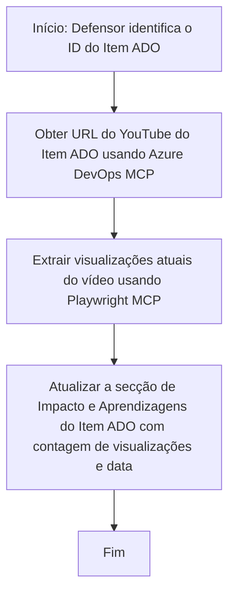

# Estudo de Caso: Atualizar Itens do Azure DevOps com Dados do YouTube usando MCP

> **Aviso:** Existem ferramentas e relatórios online que podem automatizar o processo de atualização de itens do Azure DevOps com dados de plataformas como o YouTube. O cenário a seguir é fornecido puramente como um exemplo de caso de uso para ilustrar como as ferramentas MCP podem ser aplicadas para tarefas de automação e integração.

## Visão Geral

Este estudo de caso demonstra um exemplo de como o Model Context Protocol (MCP) e suas ferramentas podem ser usados para automatizar o processo de atualização de itens de trabalho do Azure DevOps (ADO) com informações provenientes de plataformas online, como o YouTube. O cenário descrito é apenas uma ilustração das capacidades mais amplas dessas ferramentas, que podem ser adaptadas a muitas necessidades semelhantes de automação.

Neste exemplo, um Advocate acompanha sessões online usando itens do ADO, onde cada item inclui uma URL de vídeo do YouTube. Ao aproveitar as ferramentas MCP, o Advocate pode manter os itens do ADO atualizados com as métricas mais recentes dos vídeos, como a contagem de visualizações, de forma repetível e automatizada. Esta abordagem pode ser generalizada para outros casos em que seja necessário integrar informações de fontes online no ADO ou outros sistemas.

## Cenário

Um Advocate é responsável por acompanhar o impacto das sessões online e dos envolvimentos da comunidade. Cada sessão é registada como um item de trabalho ADO no projeto 'DevRel', e o item de trabalho contém um campo para a URL do vídeo do YouTube. Para reportar com exatidão o alcance da sessão, o Advocate precisa atualizar o item ADO com o número atual de visualizações do vídeo e a data em que esta informação foi obtida.

## Ferramentas Utilizadas

- [Azure DevOps MCP](https://github.com/microsoft/azure-devops-mcp): Permite o acesso programático e atualizações aos itens de trabalho do ADO via MCP.
- [Playwright MCP](https://github.com/microsoft/playwright-mcp): Automatiza ações no navegador para extrair dados em tempo real de páginas web, como estatísticas de vídeos do YouTube.

## Fluxo de Trabalho Passo a Passo

1. **Identificar o Item ADO**: Começar com o ID do item de trabalho ADO (ex., 1234) no projeto 'DevRel'.
2. **Obter a URL do YouTube**: Usar a ferramenta Azure DevOps MCP para obter a URL do YouTube a partir do item de trabalho.
3. **Extrair Visualizações do Vídeo**: Usar a ferramenta Playwright MCP para navegar até à URL do YouTube e extrair a contagem atual de visualizações.
4. **Atualizar o Item ADO**: Escrever a contagem mais recente de visualizações e a data de obtenção na seção 'Impacto e Aprendizagens' do item de trabalho ADO usando a ferramenta Azure DevOps MCP.

## Exemplo de Prompt

```bash
- Work with the ADO Item ID: 1234
- The project is '2025-Awesome'
- Get the YouTube URL for the ADO item
- Use Playwright to get the current views from the YouTube video
- Update the ADO item with the current video views and the updated date of the information
```

## Diagrama Mermaid


## Implementação Técnica

- **Orquestração MCP**: O fluxo de trabalho é orquestrado por um servidor MCP, que coordena o uso das ferramentas Azure DevOps MCP e Playwright MCP.
- **Automação**: O processo pode ser disparado manualmente ou agendado para correr em intervalos regulares para manter os itens ADO atualizados.
- **Extensibilidade**: O mesmo padrão pode ser estendido para atualizar itens ADO com outras métricas online (ex., gostos, comentários) ou de outras plataformas.

## Resultados e Impacto

- **Eficiência**: Reduz o esforço manual dos Advocates ao automatizar a recuperação e atualização das métricas dos vídeos.
- **Precisão**: Garante que os itens ADO reflitam os dados mais atuais disponíveis a partir das fontes online.
- **Repetibilidade**: Fornece um fluxo de trabalho reutilizável para cenários semelhantes envolvendo outras fontes de dados ou métricas.

## Referências

- [Azure DevOps MCP](https://github.com/microsoft/azure-devops-mcp)
- [Playwright MCP](https://github.com/microsoft/playwright-mcp)
- [Model Context Protocol (MCP)](https://modelcontextprotocol.io/)

## Próximos Passos

- Voltar para: [Visão Geral dos Estudos de Caso](./README.md)
- Seguinte: [Recuperação de Documentação em Tempo Real com MCP](./docs-mcp/README.md)

---

<!-- CO-OP TRANSLATOR DISCLAIMER START -->
**Aviso Legal**:
Este documento foi traduzido utilizando o serviço de tradução automática [Co-op Translator](https://github.com/Azure/co-op-translator). Embora nos esforcemos para garantir a precisão, esteja ciente de que traduções automáticas podem conter erros ou imprecisões. O documento original, na sua língua nativa, deve ser considerado a fonte autorizada. Para informações críticas, recomenda-se a tradução profissional humana. Não nos responsabilizamos por quaisquer mal-entendidos ou interpretações incorretas decorrentes da utilização desta tradução.
<!-- CO-OP TRANSLATOR DISCLAIMER END -->