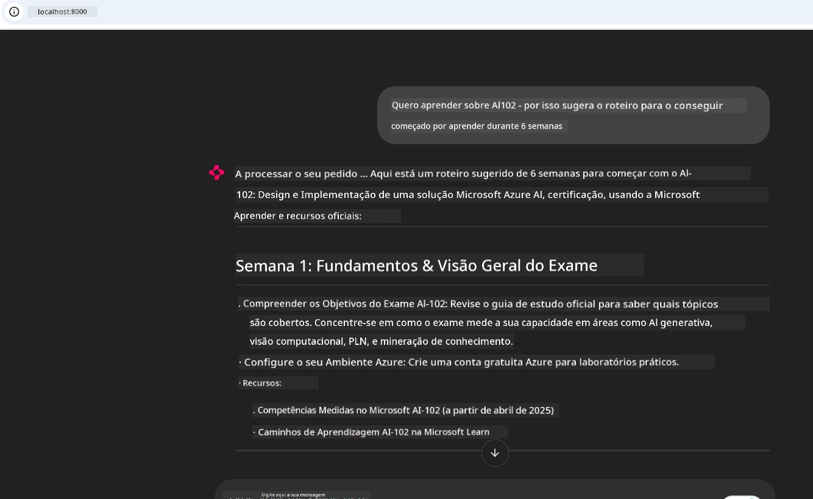
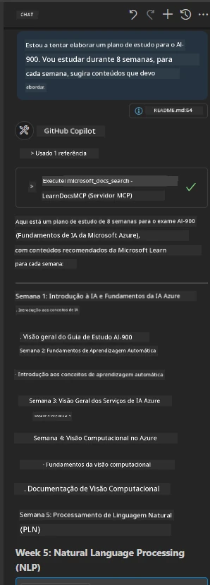

# Estudo de Caso: Ligação ao Servidor Microsoft Learn Docs MCP a partir de um Cliente

Alguma vez se encontrou a alternar entre sites de documentação, Stack Overflow e abas intermináveis do motor de busca, tudo enquanto tenta resolver um problema no seu código? Talvez tenha um segundo monitor só para documentação, ou esteja constantemente a alternar entre o seu IDE e um navegador. Não seria melhor se pudesse trazer a documentação diretamente para o seu fluxo de trabalho—integrado nas suas aplicações, no seu IDE, ou até nas suas próprias ferramentas personalizadas? Neste estudo de caso, iremos explorar exatamente como fazer isso ligando-se diretamente ao servidor Microsoft Learn Docs MCP a partir da sua própria aplicação cliente.

## Visão Geral

O desenvolvimento moderno é mais do que apenas escrever código—trata-se de encontrar a informação correta no momento certo. A documentação está em todo lado, mas raramente onde mais precisa: dentro das suas ferramentas e fluxos de trabalho. Ao integrar a obtenção de documentação diretamente nas suas aplicações, pode poupar tempo, reduzir a troca de contexto e aumentar a produtividade. Nesta secção, mostramos como ligar um cliente ao servidor Microsoft Learn Docs MCP, para que possa aceder a documentação em tempo real, contextualizada, sem sair da sua aplicação.

Iremos orientar o processo de estabelecimento da ligação, envio de um pedido, e gestão eficiente das respostas em streaming. Esta abordagem não só simplifica o seu fluxo de trabalho como também abre a porta à criação de ferramentas para desenvolvedores mais inteligentes e úteis.

## Objetivos de Aprendizagem

Porque é que estamos a fazer isto? Porque as melhores experiências para desenvolvedores são aquelas que eliminam atritos. Imagine um mundo onde o seu editor de código, chatbot, ou aplicação web pode responder instantaneamente às suas perguntas de documentação, utilizando o conteúdo mais recente do Microsoft Learn. No final deste capítulo, saberá como:

- Compreender os fundamentos da comunicação servidor-cliente MCP para documentação
- Implementar uma aplicação de consola ou web para ligar-se ao servidor Microsoft Learn Docs MCP
- Usar clientes HTTP com streaming para obtenção de documentação em tempo real
- Registar e interpretar respostas de documentação na sua aplicação

Verá como estas competências o podem ajudar a construir ferramentas que não são apenas reativas, mas verdadeiramente interativas e conscientes do contexto.

## Cenário 1 - Obtenção de Documentação em Tempo Real com MCP

Neste cenário, mostramos como ligar um cliente ao servidor Microsoft Learn Docs MCP, para que possa aceder a documentação em tempo real, contextualizada, sem sair da sua aplicação.

Vamos pôr isto em prática. A sua tarefa é escrever uma aplicação que se ligue ao servidor Microsoft Learn Docs MCP, invoque a ferramenta `microsoft_docs_search` e registe a resposta em streaming na consola.

### Porque esta abordagem?
Porque é a base para construir integrações mais avançadas—seja para alimentar um chatbot, uma extensão do IDE, ou um painel web.

Encontrará o código e as instruções para este cenário na pasta [`solution`](./solution/README.md) dentro deste estudo de caso. Os passos irão guiar-no na configuração da ligação:
- Usar o SDK oficial MCP e cliente HTTP com streaming para a ligação
- Chamar a ferramenta `microsoft_docs_search` com um parâmetro de consulta para obter documentação
- Implementar registo adequado e tratamento de erros
- Criar uma interface interactiva na consola para permitir aos utilizadores inserir múltiplas consultas de pesquisa

Este cenário demonstra como:
- Ligar ao servidor Docs MCP
- Enviar uma consulta
- Interpretar e imprimir os resultados

Aqui está uma ideia de como executar a solução poderá ser:

```
Prompt> What is Azure Key Vault?
Answer> Azure Key Vault is a cloud service for securely storing and accessing secrets. ...
```

Abaixo está uma solução de exemplo mínima. O código completo e detalhes estão disponíveis na pasta da solução.

<details>
<summary>Python</summary>

```python
import asyncio
from mcp.client.streamable_http import streamablehttp_client
from mcp import ClientSession

async def main():
    async with streamablehttp_client("https://learn.microsoft.com/api/mcp") as (read_stream, write_stream, _):
        async with ClientSession(read_stream, write_stream) as session:
            await session.initialize()
            result = await session.call_tool("microsoft_docs_search", {"query": "Azure Functions best practices"})
            print(result.content)

if __name__ == "__main__":
    asyncio.run(main())
```

- Para a implementação completa e registo, veja [`scenario1.py`](../../../../09-CaseStudy/docs-mcp/solution/python/scenario1.py).
- Para instruções de instalação e uso, consulte o ficheiro [`README.md`](./solution/python/README.md) na mesma pasta.
</details>


## Cenário 2 - Aplicação Web Interativa de Gerador de Plano de Estudo com MCP

Neste cenário, aprenderá a integrar o Docs MCP num projeto de desenvolvimento web. O objetivo é permitir que os utilizadores pesquisem na documentação Microsoft Learn diretamente a partir de uma interface web, tornando a documentação instantaneamente acessível dentro da sua aplicação ou site.

Verá como:
- Configurar uma aplicação web
- Ligar-se ao servidor Docs MCP
- Tratar a entrada do utilizador e mostrar resultados

Aqui está uma ideia de como executar a solução poderá ser:

```
User> I want to learn about AI102 - so suggest the roadmap to get it started from learn for 6 weeks

Assistant> Here’s a detailed 6-week roadmap to start your preparation for the AI-102: Designing and Implementing a Microsoft Azure AI Solution certification, using official Microsoft resources and focusing on exam skills areas:

---
## Week 1: Introduction & Fundamentals
- **Understand the Exam**: Review the [AI-102 exam skills outline](https://learn.microsoft.com/en-us/credentials/certifications/exams/ai-102/).
- **Set up Azure**: Sign up for a free Azure account if you don't have one.
- **Learning Path**: [Introduction to Azure AI services](https://learn.microsoft.com/en-us/training/modules/intro-to-azure-ai/)
- **Focus**: Get familiar with Azure portal, AI capabilities, and necessary tools.

....more weeks of the roadmap...

Let me know if you want module-specific recommendations or need more customized weekly tasks!
```

Abaixo está uma solução de exemplo mínima. O código completo e detalhes estão disponíveis na pasta da solução.



<details>
<summary>Python (Chainlit)</summary>

Chainlit é um framework para construir aplicações web de IA conversacional. Facilita a criação de chatbots interativos e assistentes que podem chamar ferramentas MCP e mostrar resultados em tempo real. É ideal para prototipagem rápida e interfaces amigáveis para o utilizador.

```python
import chainlit as cl
import requests

MCP_URL = "https://learn.microsoft.com/api/mcp"

@cl.on_message
def handle_message(message):
    query = {"question": message}
    response = requests.post(MCP_URL, json=query)
    if response.ok:
        result = response.json()
        cl.Message(content=result.get("answer", "No answer found.")).send()
    else:
        cl.Message(content="Error: " + response.text).send()
```

- Para a implementação completa, veja [`scenario2.py`](../../../../09-CaseStudy/docs-mcp/solution/python/scenario2.py).
- Para instruções de configuração e execução, consulte o [`README.md`](./solution/python/README.md).
</details>


## Cenário 3: Documentação no Editor com Servidor MCP no VS Code

Se desejar obter os Microsoft Learn Docs diretamente dentro do seu VS Code (em vez de alternar entre abas do navegador), pode usar o servidor MCP no seu editor. Isto permite:
- Pesquisar e ler documentação no VS Code sem sair do seu ambiente de codificação.
- Referenciar documentação e inserir ligações diretamente nos seus ficheiros README ou de curso.
- Aproveitar o GitHub Copilot e MCP juntos para um fluxo de trabalho de documentação alimentado por IA, sem descontinuidades.

**Verá como:**
- Adicionar um ficheiro `.vscode/mcp.json` válido na raiz do seu espaço de trabalho (veja o exemplo abaixo).
- Abrir o painel MCP ou usar a paleta de comandos no VS Code para pesquisar e inserir documentação.
- Referenciar documentação diretamente nos seus ficheiros markdown enquanto trabalha.
- Combinar este fluxo de trabalho com o GitHub Copilot para ainda maior produtividade.

Aqui está um exemplo de como configurar o servidor MCP no VS Code:

```json
{
  "servers": {
    "LearnDocsMCP": {
      "url": "https://learn.microsoft.com/api/mcp"
    }
  }
}
```

</details>

> Para um guia detalhado com capturas de ecrã e instruções passo a passo, consulte [`README.md`](./solution/scenario3/README.md).



Esta abordagem é ideal para quem constrói cursos técnicos, escreve documentação, ou desenvolve código com necessidades frequentes de referência.

## Principais Conclusões

Integrar documentação diretamente nas suas ferramentas não é apenas uma comodidade—é uma revolução na produtividade. Ao ligar-se ao servidor Microsoft Learn Docs MCP a partir do seu cliente, pode:

- Eliminar a troca de contexto entre o seu código e a documentação
- Obter documentação atualizada e contextualizada em tempo real
- Construir ferramentas para desenvolvedores mais inteligentes e interativas

Estas competências irão ajudá-lo a criar soluções não só eficientes, mas também agradáveis de usar.

## Recursos Adicionais

Para aprofundar a sua compreensão, explore estes recursos oficiais:

- [Microsoft Learn Docs MCP Server (GitHub)](https://github.com/MicrosoftDocs/mcp)
- [Começar com o Azure MCP Server (mcp-python)](https://learn.microsoft.com/en-us/azure/developer/azure-mcp-server/get-started#create-the-python-app)
- [O que é o Azure MCP Server?](https://learn.microsoft.com/en-us/azure/developer/azure-mcp-server/)
- [Introdução ao Model Context Protocol (MCP)](https://modelcontextprotocol.io/introduction)
- [Adicionar plugins de um MCP Server (Python)](https://learn.microsoft.com/en-us/semantic-kernel/concepts/plugins/adding-mcp-plugins)

## O Que Segue

- Voltar para: [Visão Geral dos Estudos de Caso](../README.md)
- Continuar para: [Módulo 10: Otimização de Fluxos de Trabalho com IA com o AI Toolkit](../../10-StreamliningAIWorkflowsBuildingAnMCPServerWithAIToolkit/README.md)

---

<!-- CO-OP TRANSLATOR DISCLAIMER START -->
**Aviso Legal**:  
Este documento foi traduzido utilizando o serviço de tradução automática [Co-op Translator](https://github.com/Azure/co-op-translator). Embora nos esforcemos pela precisão, pedimos que tenha em conta que traduções automáticas podem conter erros ou imprecisões. O documento original, na sua língua nativa, deve ser considerado a fonte autorizada. Para informações críticas, recomenda-se a tradução profissional humana. Não nos responsabilizamos por quaisquer mal-entendidos ou interpretações incorretas decorrentes da utilização desta tradução.
<!-- CO-OP TRANSLATOR DISCLAIMER END -->