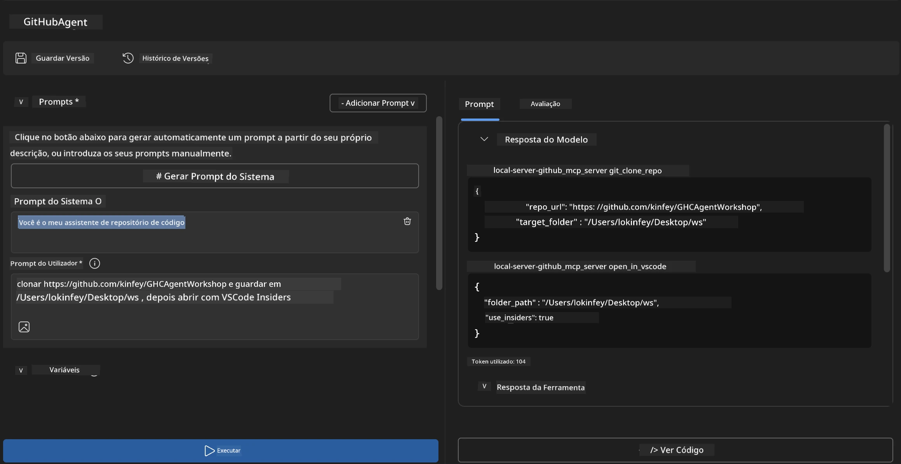
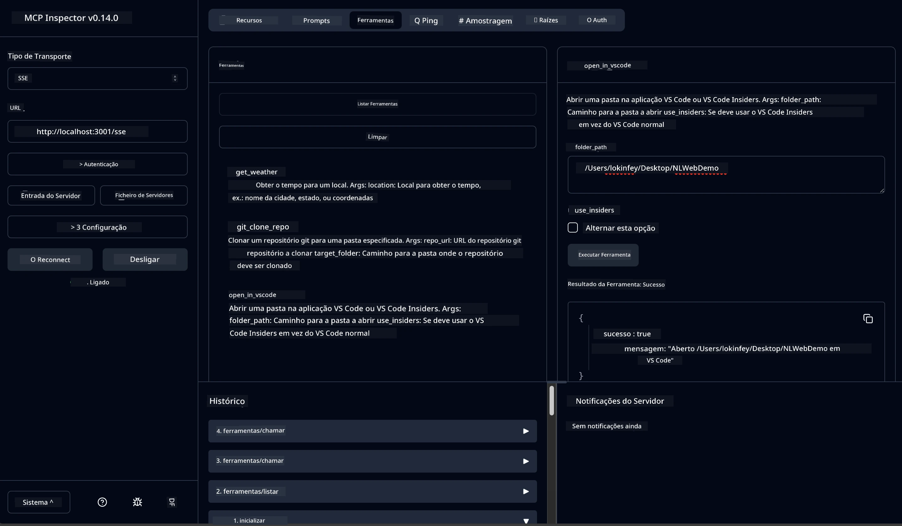

# 🐙 Módulo 4: Desenvolvimento Prático MCP - Servidor Personalizado para Clonar Repositórios GitHub


> **⚡ Começo Rápido:** Construa um servidor MCP pronto para produção que automatiza a clonagem de repositórios GitHub e a integração com VS Code em apenas 30 minutos!

## 🎯 Objetivos de Aprendizagem

No final deste laboratório, será capaz de:

- ✅ Criar um servidor MCP personalizado para fluxos de trabalho de desenvolvimento no mundo real
- ✅ Implementar funcionalidade de clonagem de repositórios GitHub via MCP
- ✅ Integrar servidores MCP personalizados com VS Code e Agent Builder
- ✅ Utilizar o modo Agente do GitHub Copilot com ferramentas MCP personalizadas
- ✅ Testar e implementar servidores MCP personalizados em ambientes de produção

## 📋 Pré-requisitos

- Conclusão dos Laboratórios 1-3 (fundamentos MCP e desenvolvimento avançado)
- Assinatura do GitHub Copilot ([inscrição gratuita disponível](https://github.com/github-copilot/signup))
- VS Code com as extensões AI Toolkit e GitHub Copilot
- Git CLI instalado e configurado

## 🏗️ Visão Geral do Projeto

### **Desafio de Desenvolvimento no Mundo Real**
Como desenvolvedores, usamos frequentemente o GitHub para clonar repositórios e abri-los no VS Code ou VS Code Insiders. Este processo manual envolve:
1. Abrir terminal/prompt de comando
2. Navegar para o diretório desejado
3. Executar o comando `git clone`
4. Abrir o VS Code no diretório clonado

**A nossa solução MCP simplifica isto numa única linha de comando inteligente!**

### **O Que Vai Construir**
Um **Servidor MCP de Clonagem GitHub** (`git_mcp_server`) que oferece:

| Funcionalidade | Descrição | Benefício |
|---------|-------------|---------|
| 🔄 **Clonagem Inteligente de Repositórios** | Clonar repositórios GitHub com validação | Verificação automática de erros |
| 📁 **Gestão Inteligente de Diretórios** | Verifica e cria diretórios com segurança | Evita sobreescrita |
| 🚀 **Integração Multiplataforma com VS Code** | Abre projetos no VS Code/Insiders | Transição fluída no fluxo de trabalho |
| 🛡️ **Manuseamento Robusto de Erros** | Trata problemas de rede, permissões e caminhos | Confiabilidade pronta para produção |

---

## 📖 Implementação Passo a Passo

### Passo 1: Criar Agente GitHub no Agent Builder

1. **Inicie o Agent Builder** através da extensão AI Toolkit
2. **Crie um novo agente** com a seguinte configuração:
   ```
   Agent Name: GitHubAgent
   ```

3. **Inicie o servidor MCP personalizado:**
   - Navegue para **Ferramentas** → **Adicionar Ferramenta** → **Servidor MCP**
   - Selecione **"Criar um novo Servidor MCP"**
   - Escolha o **modelo Python** para máxima flexibilidade
   - **Nome do Servidor:** `git_mcp_server`

### Passo 2: Configurar o Modo Agente do GitHub Copilot

1. **Abra o GitHub Copilot** no VS Code (Ctrl/Cmd + Shift + P → "GitHub Copilot: Open")
2. **Selecione o Modelo de Agente** na interface do Copilot
3. **Escolha o modelo Claude 3.7** para capacidades avançadas de raciocínio
4. **Ative a integração MCP** para acesso às ferramentas

> **💡 Dica Profissional:** O Claude 3.7 fornece uma compreensão superior dos fluxos de trabalho de desenvolvimento e padrões de gestão de erros.

### Passo 3: Implementar a Funcionalidade Principal do Servidor MCP

**Use o seguinte prompt detalhado com o Modo Agente do GitHub Copilot:**

```
Create two MCP tools with the following comprehensive requirements:

🔧 TOOL A: clone_repository
Requirements:
- Clone any GitHub repository to a specified local folder
- Return the absolute path of the successfully cloned project
- Implement comprehensive validation:
  ✓ Check if target directory already exists (return error if exists)
  ✓ Validate GitHub URL format (https://github.com/user/repo)
  ✓ Verify git command availability (prompt installation if missing)
  ✓ Handle network connectivity issues
  ✓ Provide clear error messages for all failure scenarios

🚀 TOOL B: open_in_vscode
Requirements:
- Open specified folder in VS Code or VS Code Insiders
- Cross-platform compatibility (Windows/Linux/macOS)
- Use direct application launch (not terminal commands)
- Auto-detect available VS Code installations
- Handle cases where VS Code is not installed
- Provide user-friendly error messages

Additional Requirements:
- Follow MCP 1.9.3 best practices
- Include proper type hints and documentation
- Implement logging for debugging purposes
- Add input validation for all parameters
- Include comprehensive error handling
```

### Passo 4: Testar o Seu Servidor MCP

#### 4a. Testar no Agent Builder

1. **Inicie a configuração de depuração** para o Agent Builder
2. **Configure o seu agente com este prompt do sistema:**

```
SYSTEM_PROMPT:
You are my intelligent coding repository assistant. You help developers efficiently clone GitHub repositories and set up their development environment. Always provide clear feedback about operations and handle errors gracefully.
```

3. **Teste com cenários realistas de utilizador:**

```
USER_PROMPT EXAMPLES:

Scenario : Basic Clone and Open
"Clone {Your GitHub Repo link such as https://github.com/kinfey/GHCAgentWorkshop
 } and save to {The global path you specify}, then open it with VS Code Insiders"
```



**Resultados Esperados:**
- ✅ Clonagem bem-sucedida com confirmação do caminho
- ✅ Abertura automática do VS Code
- ✅ Mensagens de erro claras para cenários inválidos
- ✅ Manuseamento adequado de casos limite

#### 4b. Testar no MCP Inspector




---


**🎉 Parabéns!** Criou com sucesso um servidor MCP prático e pronto para produção que resolve desafios reais de fluxo de trabalho de desenvolvimento. O seu servidor personalizado de clonagem GitHub demonstra o poder do MCP para automatizar e melhorar a produtividade do desenvolvedor.

### 🏆 Conquistas Desbloqueadas:
- ✅ **Desenvolvedor MCP** - Criou um servidor MCP personalizado
- ✅ **Automatizador de Fluxos de Trabalho** - Simplificou processos de desenvolvimento  
- ✅ **Especialista em Integração** - Ligou múltiplas ferramentas de desenvolvimento
- ✅ **Pronto para Produção** - Construíu soluções para implementação

---

## 🎓 Conclusão do Workshop: O Seu Percurso com o Model Context Protocol

**Caro Participante do Workshop,**

Parabéns por concluir os quatro módulos do workshop Model Context Protocol! Percorreu um longo caminho desde a compreensão dos conceitos básicos do AI Toolkit até à construção de servidores MCP prontos para produção que solucionam desafios reais de desenvolvimento.

### 🚀 Recapitulação do Seu Percurso de Aprendizagem:

**[Módulo 1](../lab1/README.md)**: Começou explorando fundamentos do AI Toolkit, testes de modelo e criando o seu primeiro agente AI.

**[Módulo 2](../lab2/README.md)**: Aprendeu arquitetura MCP, integrou Playwright MCP e construiu o seu primeiro agente de automação de browser.

**[Módulo 3](../lab3/README.md)**: Avançou para desenvolvimento de servidores MCP personalizados com o servidor Weather MCP e dominou ferramentas de depuração.

**[Módulo 4](../lab4/README.md)**: Aplicou tudo para criar uma ferramenta prática de automação de fluxo de trabalho de repositórios GitHub.

### 🌟 O Que Dominou:

- ✅ **Ecossistema AI Toolkit**: Modelos, agentes e padrões de integração
- ✅ **Arquitetura MCP**: Design cliente-servidor, protocolos de transporte e segurança
- ✅ **Ferramentas para Desenvolvedores**: De Playground a Inspector até implantação em produção
- ✅ **Desenvolvimento Personalizado**: Construção, testes e implementação dos seus próprios servidores MCP
- ✅ **Aplicações Práticas**: Resolver desafios reais de fluxo de trabalho com IA

### 🔮 Os Seus Próximos Passos:

1. **Construa o Seu Próprio Servidor MCP**: Aplique estas competências para automatizar os seus fluxos de trabalho únicos
2. **Junte-se à Comunidade MCP**: Partilhe as suas criações e aprenda com outros
3. **Explore Integrações Avançadas**: Ligue servidores MCP a sistemas empresariais
4. **Contribua para o Open Source**: Ajude a melhorar as ferramentas e documentação MCP

Lembre-se, este workshop é apenas o começo. O ecossistema Model Context Protocol está a evoluir rapidamente, e agora está equipado para estar na vanguarda das ferramentas de desenvolvimento potenciadas por IA.

**Obrigado pela sua participação e dedicação à aprendizagem!**

Esperamos que este workshop tenha inspirado ideias que transformarão a forma como constrói e interage com ferramentas AI na sua jornada de desenvolvimento.

**Feliz programação!**

---

## O Que Segue

Parabéns por completar todos os laboratórios no Módulo 10!

- Voltar para: [Visão Geral do Módulo 10](../README.md)
- Continuar para: [Módulo 11: Laboratórios Práticos MCP Server](../../11-MCPServerHandsOnLabs/README.md)

---

<!-- CO-OP TRANSLATOR DISCLAIMER START -->
**Aviso Legal**:
Este documento foi traduzido utilizando o serviço de tradução automática [Co-op Translator](https://github.com/Azure/co-op-translator). Embora nos empenhemos em garantir a precisão, esteja ciente de que traduções automáticas podem conter erros ou imprecisões. O documento original no seu idioma nativo deve ser considerado a fonte oficial. Para informações críticas, recomenda-se tradução profissional por humanos. Não nos responsabilizamos por quaisquer mal-entendidos ou interpretações erradas decorrentes da utilização desta tradução.
<!-- CO-OP TRANSLATOR DISCLAIMER END -->