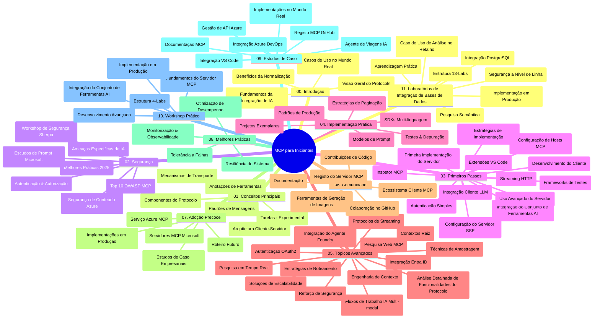

# Protocolo de Contexto de Modelo (MCP) para Iniciantes - Guia de Estudo

Este guia de estudo fornece uma visão geral da estrutura e do conteúdo do repositório para o currículo "Protocolo de Contexto de Modelo (MCP) para Iniciantes". Utilize este guia para navegar eficientemente no repositório e tirar o máximo proveito dos recursos disponíveis.

## Visão Geral do Repositório

O Protocolo de Contexto de Modelo (MCP) é uma estrutura padronizada para interações entre modelos de IA e aplicações clientes. Inicialmente criado pela Anthropic, o MCP é agora mantido pela comunidade MCP mais ampla através da organização oficial no GitHub. Este repositório oferece um currículo abrangente com exemplos práticos de código em C#, Java, JavaScript, Python e TypeScript, destinado a desenvolvedores de IA, arquitetos de sistemas e engenheiros de software.

## Mapa Visual do Currículo

## Estrutura do Repositório

O repositório está organizado em onze seções principais, cada uma focada em diferentes aspetos do MCP:

1. **Introdução (00-Introduction/)**
   - Visão geral do Protocolo de Contexto de Modelo
   - Por que a padronização é importante em pipelines de IA
   - Casos de uso práticos e benefícios

2. **Conceitos Fundamentais (01-CoreConcepts/)**
   - Arquitetura cliente-servidor
   - Componentes chave do protocolo
   - Padrões de mensagens no MCP

3. **Segurança (02-Security/)**
   - Ameaças de segurança em sistemas baseados em MCP
   - Melhores práticas para implementar segurança
   - Estratégias de autenticação e autorização
   - **Documentação Abrangente de Segurança**:
     - Melhores Práticas de Segurança MCP 2025
     - Guia de Implementação de Segurança de Conteúdo Azure
     - Controles e Técnicas de Segurança MCP
     - Referência Rápida de Melhores Práticas MCP
   - **Tópicos-chave de Segurança**:
     - Ataques de injeção de prompt e envenenamento de ferramentas
     - Sequestro de sessão e problema do delegado confuso
     - Vulnerabilidades de passagem de token
     - Permissões excessivas e controlo de acesso
     - Segurança da cadeia de fornecimento para componentes de IA
     - Integração com Microsoft Prompt Shields

4. **Primeiros Passos (03-GettingStarted/)**
   - Configuração e preparação do ambiente
   - Criação de servidores e clientes MCP básicos
   - Integração com aplicações existentes
   - Inclui secções para:
     - Primeira implementação de servidor
     - Desenvolvimento de cliente
     - Integração de cliente LLM
     - Integração com VS Code
     - Servidor Server-Sent Events (SSE)
     - Uso avançado de servidor
     - Streaming HTTP
     - Integração com AI Toolkit
     - Estratégias de teste
     - Diretrizes de despliegue

5. **Implementação Prática (04-PracticalImplementation/)**
   - Uso de SDKs em diferentes linguagens de programação
   - Técnicas de debugging, teste e validação
   - Criação de templates reutilizáveis de prompts e fluxos de trabalho
   - Projetos de exemplo com casos de implementação

6. **Tópicos Avançados (05-AdvancedTopics/)**
   - Técnicas de engenharia de contexto
   - Integração de agente Foundry
   - Fluxos de trabalho multímode de IA  
   - Demos de autenticação OAuth2
   - Capacidades de pesquisa em tempo real
   - Streaming em tempo real
   - Implementação de contextos raiz
   - Estratégias de roteamento
   - Técnicas de amostragem
   - Abordagens de escala
   - Considerações de segurança
   - Integração de segurança Entra ID
   - Integração de pesquisa web

7. **Contribuições da Comunidade (06-CommunityContributions/)**
   - Como contribuir com código e documentação
   - Colaboração via GitHub
   - Melhorias e feedback orientados pela comunidade
   - Uso de vários clientes MCP (Claude Desktop, Cline, VSCode)
   - Trabalho com servidores MCP populares incluindo geração de imagens

8. **Lições da Adoção Inicial (07-LessonsfromEarlyAdoption/)**
   - Implementações reais e histórias de sucesso
   - Construção e despliegue de soluções baseadas em MCP
   - Tendências e roteiro futuro
   - **Guia dos Servidores MCP da Microsoft**: Guia completo para 10 servidores MCP Microsoft prontos para produção incluindo:
     - Microsoft Learn Docs MCP Server
     - Azure MCP Server (15+ conectores especializados)
     - GitHub MCP Server
     - Azure DevOps MCP Server
     - MarkItDown MCP Server
     - SQL Server MCP Server
     - Playwright MCP Server
     - Dev Box MCP Server
     - Azure AI Foundry MCP Server
     - Microsoft 365 Agents Toolkit MCP Server

9. **Melhores Práticas (08-BestPractices/)**
   - Otimização e tuning de performance
   - Desenho de sistemas MCP tolerantes a falhas
   - Estratégias de teste e resiliência

10. **Estudos de Caso (09-CaseStudy/)**
    - **Sete estudos de caso abrangentes** demonstrando a versatilidade MCP em diversos cenários:
    - **Azure AI Travel Agents**: orquestração multiagente com Azure OpenAI e AI Search
    - **Integração Azure DevOps**: automatização de processos de fluxo de trabalho com atualizações de dados do YouTube
    - **Recuperação de Documentação em Tempo Real**: cliente console Python com streaming HTTP
    - **Gerador Interativo de Plano de Estudo**: aplicação web Chainlit com IA conversacional
    - **Documentação In-Editor**: integração VS Code com fluxos de trabalho GitHub Copilot
    - **Gestão API Azure**: integração empresarial API com criação de servidor MCP
    - **Registo MCP GitHub**: desenvolvimento do ecossistema e plataforma de integração agente
    - Exemplos de implementação abrangendo integração empresarial, produtividade do desenvolvedor e desenvolvimento ecossistêmico

11. **Workshop Prático (10-StreamliningAIWorkflowsBuildingAnMCPServerWithAIToolkit/)**
    - Workshop prático abrangente combinando MCP com AI Toolkit
    - Construção de aplicações inteligentes a ligar modelos de IA a ferramentas do mundo real
    - Módulos práticos cobrindo fundamentos, desenvolvimento personalizado de servidor e estratégias de despliegue em produção
    - **Estrutura do Laboratório**:
      - Laboratório 1: Fundamentos do Servidor MCP
      - Laboratório 2: Desenvolvimento Avançado de Servidor MCP
      - Laboratório 3: Integração AI Toolkit
      - Laboratório 4: Despliegue e Escalabilidade em Produção
    - Abordagem de aprendizagem baseada em laboratórios com instruções passo a passo

12. **Laboratórios Práticos de Integração de Base de Dados MCP Server (11-MCPServerHandsOnLabs/)**
    - **Percurso de aprendizagem abrangente com 13 laboratórios** para construção de servidores MCP prontos para produção com integração PostgreSQL
    - **Implementação real do caso de uso Zava Retail** em análise de retalho
    - **Padrões empresariais** incluindo Row Level Security (RLS), pesquisa semântica e acesso multi-inquilino a dados
    - **Estrutura Completa do Laboratório**:
      - **Laboratórios 00-03: Fundamentos** - Introdução, Arquitetura, Segurança, Preparação do Ambiente
      - **Laboratórios 04-06: Construção do Servidor MCP** - Design de Base de Dados, Implementação do Servidor MCP, Desenvolvimento de Ferramentas
      - **Laboratórios 07-09: Funcionalidades Avançadas** - Pesquisa Semântica, Testes & Debugging, Integração VS Code
      - **Laboratórios 10-12: Produção & Melhores Práticas** - Despliegue, Monitorização, Otimização
    - **Tecnologias Abrangidas**: framework FastMCP, PostgreSQL, Azure OpenAI, Azure Container Apps, Application Insights
    - **Resultados de Aprendizagem**: servidores MCP prontos para produção, padrões de integração de base de dados, análises potenciadas por IA, segurança empresarial

## Recursos Adicionais

O repositório inclui recursos de suporte:

- **Pasta de imagens**: Contém diagramas e ilustrações usados ao longo do currículo
- **Traduções**: Suporte multilíngue com traduções automatizadas da documentação
- **Recursos Oficiais MCP**:
  - [Documentação MCP](https://modelcontextprotocol.io/)
  - [Especificação MCP](https://spec.modelcontextprotocol.io/)
  - [Repositório MCP no GitHub](https://github.com/modelcontextprotocol)

## Como Usar Este Repositório

1. **Aprendizagem Sequencial**: Siga os capítulos por ordem (de 00 a 11) para uma experiência de aprendizagem estruturada.
2. **Foco em Linguagem Específica**: Se estiver interessado numa linguagem de programação em particular, explore os diretórios de exemplos para implementações na sua linguagem preferida.
3. **Implementação Prática**: Comece pela seção "Primeiros Passos" para configurar o ambiente e criar o seu primeiro servidor e cliente MCP.
4. **Exploração Avançada**: Uma vez confortável com o básico, mergulhe nos tópicos avançados para expandir os seus conhecimentos.
5. **Envolvimento Comunitário**: Junte-se à comunidade MCP através das discussões no GitHub e canais de Discord para conectar-se com especialistas e outros desenvolvedores.

## Clientes e Ferramentas MCP

O currículo cobre vários clientes e ferramentas MCP:

1. **Clientes Oficiais**:
   - Visual Studio Code 
   - MCP no Visual Studio Code
   - Claude Desktop
   - Claude no VSCode 
   - Claude API

2. **Clientes da Comunidade**:
   - Cline (baseado em terminal)
   - Cursor (editor de código)
   - ChatMCP
   - Windsurf

3. **Ferramentas de Gestão MCP**:
   - MCP CLI
   - MCP Manager
   - MCP Linker
   - MCP Router

## Servidores MCP Populares

O repositório apresenta vários servidores MCP, incluindo:

1. **Servidores MCP Oficiais da Microsoft**:
   - Microsoft Learn Docs MCP Server
   - Azure MCP Server (15+ conectores especializados)
   - GitHub MCP Server
   - Azure DevOps MCP Server
   - MarkItDown MCP Server
   - SQL Server MCP Server
   - Playwright MCP Server
   - Dev Box MCP Server
   - Azure AI Foundry MCP Server
   - Microsoft 365 Agents Toolkit MCP Server

2. **Servidores de Referência Oficiais**:
   - Filesystem
   - Fetch
   - Memory
   - Sequential Thinking

3. **Geração de Imagens**:
   - Azure OpenAI DALL-E 3
   - Stable Diffusion WebUI
   - Replicate

4. **Ferramentas de Desenvolvimento**:
   - Git MCP
   - Terminal Control
   - Code Assistant

5. **Servidores Especializados**:
   - Salesforce
   - Microsoft Teams
   - Jira & Confluence

## Contribuições

Este repositório acolhe contribuições da comunidade. Veja a seção de Contribuições da Comunidade para orientação sobre como contribuir eficazmente para o ecossistema MCP.

----

*Este guia de estudo foi atualizado pela última vez a 5 de fevereiro de 2026, refletindo a mais recente Especificação MCP 2025-11-25 e fornece uma visão geral do repositório até essa data. O conteúdo do repositório pode ser atualizado após esta data.*

---

<!-- CO-OP TRANSLATOR DISCLAIMER START -->
**Aviso Legal**:  
Este documento foi traduzido utilizando o serviço de tradução automática [Co-op Translator](https://github.com/Azure/co-op-translator). Embora nos esforcemos pela precisão, por favor tenha em atenção que traduções automáticas podem conter erros ou imprecisões. O documento original na sua língua nativa deverá ser considerado a fonte autorizada. Para informações críticas, recomenda-se uma tradução profissional realizada por um humano. Não nos responsabilizamos por quaisquer mal-entendidos ou interpretações incorretas decorrentes do uso desta tradução.
<!-- CO-OP TRANSLATOR DISCLAIMER END -->