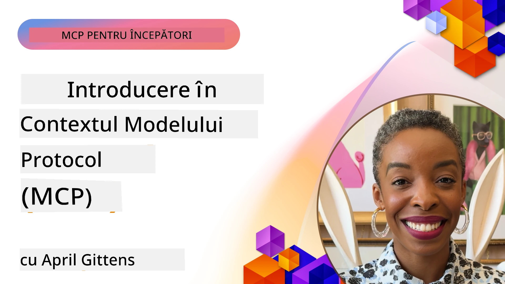
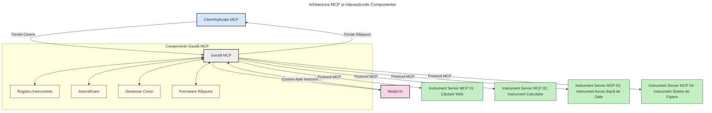

# Introducere în Model Context Protocol (MCP): De ce este important pentru aplicațiile AI scalabile

[](https://youtu.be/agBbdiOPLQA)

_(Click pe imaginea de mai sus pentru a viziona videoclipul acestei lecții)_

Aplicațiile AI generative sunt un mare pas înainte deoarece adesea permit utilizatorului să interacționeze cu aplicația folosind prompturi în limbaj natural. Totuși, pe măsură ce se investesc mai mult timp și resurse în astfel de aplicații, doriți să vă asigurați că puteți integra ușor funcționalități și resurse în așa fel încât să fie ușor de extins, ca aplicația dvs. să poată deservi mai mult de un model utilizat și să gestioneze diverse particularități ale modelelor. Pe scurt, construirea aplicațiilor Gen AI este ușoară la început, dar pe măsură ce acestea cresc și devin mai complexe, trebuie să începeți să definiți o arhitectură și probabil veți avea nevoie să vă bazați pe un standard pentru a vă asigura că aplicațiile dvs. sunt construite într-un mod consistent. Aici intervine MCP pentru a organiza lucrurile și a oferi un standard.

---

## **🔍 Ce este Model Context Protocol (MCP)?**

**Model Context Protocol (MCP)** este o **interfață deschisă, standardizată** care permite modelelor mari de limbaj (LLM-uri) să interacționeze perfect cu unelte externe, API-uri și surse de date. Oferă o arhitectură consistentă pentru a îmbunătăți funcționalitatea modelelor AI dincolo de datele lor de antrenament, permițând sisteme AI mai inteligente, scalabile și mai receptive.

---

## **🎯 De ce contează standardizarea în AI**

Pe măsură ce aplicațiile AI generative devin mai complexe, este esențial să adoptați standarde care să asigure **scalabilitate, extindere, întreținere** și **evitarea dependenței de un singur furnizor**. MCP abordează aceste nevoi prin:

- Unificarea integrărilor model-unealtă
- Reducerea soluțiilor personalizate fragile, unice
- Permite coexistenta mai multor modele de la diferiți furnizori în cadrul unui singur ecosistem

**Notă:** Deși MCP se prezintă ca un standard deschis, nu există planuri de a standardiza MCP prin organisme de standardizare existente precum IEEE, IETF, W3C, ISO sau orice alt organism de standardizare.

---

## **📚 Obiective de învățare**

La finalul acestui articol, veți putea:

- Defini **Model Context Protocol (MCP)** și cazurile sale de utilizare
- Înțelege cum MCP standardizează comunicarea între model și unealtă
- Identifica componentele principale ale arhitecturii MCP
- Explora aplicații reale ale MCP în contexte enterprise și de dezvoltare

---

## **💡 De ce Model Context Protocol (MCP) este revoluționar**

### **🔗 MCP rezolvă fragmentarea în interacțiunile AI**

Înainte de MCP, integrarea modelelor cu unelte necesita:

- Cod personalizat pentru fiecare pereche unealtă-model
- API-uri non-standard pentru fiecare furnizor
- Ruperea frecventă a integrărilor din cauza actualizărilor
- Scalabilitate slabă pe măsură ce uneltele cresc în număr

### **✅ Beneficiile standardizării MCP**

| **Beneficiu**            | **Descriere**                                                                 |
|--------------------------|-------------------------------------------------------------------------------|
| Interoperabilitate       | LLM-urile funcționează fără probleme cu unelte de la diferiți furnizori      |
| Consistență              | Comportament uniform pe platforme și unelte                                   |
| Reutilizabilitate        | Uneltele construite o dată pot fi folosite în multiple proiecte și sisteme    |
| Dezvoltare accelerată    | Se reduce timpul de dezvoltare folosind interfețe standardizate, plug-and-play|

---

## **🧱 Prezentare generală a arhitecturii MCP la nivel înalt**

MCP urmează un **model client-server**, unde:

- **Host-urile MCP** rulează modelele AI
- **Clienții MCP** inițiază cereri
- **Serverele MCP** oferă context, unelte și capabilități

### **Componente cheie:**

- **Resurse** – date statice sau dinamice pentru modele  
- **Prompts** – fluxuri de lucru predefinite pentru generare ghidată  
- **Unelte** – funcții executabile precum căutare, calcule  
- **Sampling** – comportament agentic prin interacțiuni recursive
- **Elicitation** – cereri inițiate de server pentru input utilizator
- **Roots** – limite ale sistemului de fișiere pentru control acces server

### **Arhitectura Protocolului:**

MCP utilizează o arhitectură pe două straturi:
- **Stratul de Date**: comunicație bazată pe JSON-RPC 2.0 cu managementul ciclului de viață și primitive
- **Stratul de Transport**: canale de comunicare STDIO (local) și HTTP Streamable cu SSE (remote)

---

## Cum funcționează Serverele MCP

Serverele MCP funcționează astfel:

- **Fluxul cererii**:
    1. O cerere este inițiată de un utilizator final sau software care acționează în numele lui.
    2. **Clientul MCP** trimite cererea către un **Host MCP** care gestionează runtime-ul Modelului AI.
    3. **Modelul AI** primește promptul utilizatorului și poate solicita acces la unelte sau date externe prin una sau mai multe apeluri către unelte.
    4. **Host-ul MCP**, nu modelul direct, comunică cu **Serverul/Serverele MCP** corespunzătoare folosind protocolul standardizat.
- **Funcționalitatea Host-ului MCP**:
    - **Registru unelte**: Menține un catalog al uneltelor disponibile și capabilitățile acestora.
    - **Autentificare**: Verifică permisiunile pentru accesul la unelte.
    - **Gestionarea cererilor**: Procesează cererile primite către unelte din partea modelului.
    - **Formatarea răspunsurilor**: Structurează ieșirile uneltelor într-un format inteligibil pentru model.
- **Executarea Serverului MCP**:
    - **Host-ul MCP** direcționează apelurile către una sau mai multe **Servere MCP**, fiecare oferind funcții specializate (ex: căutare, calcule, interogări baze de date).
    - **Serverele MCP** își execută operațiile și returnează rezultatele către **Host-ul MCP** într-un format consistent.
    - **Host-ul MCP** formatează și transmite aceste rezultate către **Modelul AI**.
- **Finalizarea răspunsului**:
    - **Modelul AI** integrează ieșirile uneltelor într-un răspuns final.
    - **Host-ul MCP** trimite acest răspuns înapoi către **Clientul MCP**, care îl livrează utilizatorului final sau software-ului apelant.
    


## 👨‍💻 Cum să construiești un server MCP (cu exemple)

Serverele MCP vă permit să extindeți capabilitățile LLM oferind date și funcționalitate.

Gata să încercați? Iată SDK-uri specifice limbajelor și/sau tehnologiilor cu exemple de creare a unor servere MCP simple în diverse limbaje/tehnologii:

- **Python SDK**: https://github.com/modelcontextprotocol/python-sdk

- **TypeScript SDK**: https://github.com/modelcontextprotocol/typescript-sdk

- **Java SDK**: https://github.com/modelcontextprotocol/java-sdk

- **C#/.NET SDK**: https://github.com/modelcontextprotocol/csharp-sdk


## 🌍 Cazuri de utilizare reale pentru MCP

MCP permite o gamă largă de aplicații prin extinderea capacităților AI:

| **Aplicație**               | **Descriere**                                                                |
|-----------------------------|-------------------------------------------------------------------------------|
| Integrare date enterprise    | Conectarea LLM-urilor la baze de date, CRM-uri sau unelte interne             |
| Sisteme AI agentice          | Permite agenților autonomi accesul la unelte și fluxuri decizionale           |
| Aplicații multimodale        | Combină unelte text, imagine și audio într-o singură aplicație AI unificată   |
| Integrare date în timp real  | Adu date live în interacțiunile AI pentru rezultate mai precise și actuale   |


### 🧠 MCP = Standard universal pentru interacțiuni AI

Model Context Protocol (MCP) acționează ca un standard universal pentru interacțiunile AI, similar cu modul în care USB-C a standardizat conexiunile fizice pentru dispozitive. În lumea AI, MCP oferă o interfață consistentă, permițând modelelor (clienților) să se integreze perfect cu uneltele externe și furnizorii de date (serverele). Acest lucru elimină necesitatea unor protocoale diverse, personalizate pentru fiecare API sau sursă de date.

Conform MCP, o unealtă compatibilă (numită server MCP) urmează un standard unificat. Aceste servere pot lista uneltele sau acțiunile pe care le oferă și execută aceste acțiuni când sunt solicitate de un agent AI. Platformele de agenți AI care suportă MCP sunt capabile să descopere uneltele disponibile de la servere și să le invoce prin acest protocol standard.

### 💡 Facilitează accesul la cunoștințe

Dincolo de oferirea uneltelor, MCP facilitează și accesul la cunoștințe. Permite aplicațiilor să ofere context modelelor mari de limbaj (LLM-uri) prin conectarea acestora la diverse surse de date. De exemplu, un server MCP ar putea reprezenta un depozit de documente al unei companii, permițând agenților să preia informații relevante la cerere. Un alt server ar putea gestiona acțiuni specifice precum trimiterea de emailuri sau actualizarea înregistrărilor. Din perspectiva agentului, acestea sunt pur și simplu unelte pe care le poate utiliza – unele unelte returnează date (context de cunoștințe), altele execută acțiuni. MCP gestionează eficient ambele.

Un agent care se conectează la un server MCP învață automat capabilitățile disponibile ale serverului și datele accesibile printr-un format standard. Această standardizare permite disponibilitatea dinamică a uneltelor. De exemplu, adăugarea unui nou server MCP în sistemul unui agent face funcțiile sale imediat utilizabile fără a necesita personalizare suplimentară a instrucțiunilor agentului.

Această integrare simplificată se aliniază cu fluxul ilustrat în diagrama următoare, în care serverele oferă atât unelte, cât și cunoștințe, asigurând o colaborare fără întreruperi între sisteme.

### 👉 Exemplu: Soluție agent scalabilă

```mermaid
---
title: Soluție Agent Scalabilă cu MCP
description: Un diagram care ilustrează cum un utilizator interacționează cu un LLM care se conectează la multiple servere MCP, fiecare server oferind atât cunoștințe cât și instrumente, creând o arhitectură de sistem AI scalabilă
---
graph TD
    User -->|Solicitare| LLM
    LLM -->|Răspuns| User
    LLM -->|MCP| ServerA
    LLM -->|MCP| ServerB
    ServerA -->|Conector universal| ServerB
    ServerA --> KnowledgeA
    ServerA --> ToolsA
    ServerB --> KnowledgeB
    ServerB --> ToolsB

    subgraph Server A
        KnowledgeA[Cunoștințe]
        ToolsA[Instrumente]
    end

    subgraph Server B
        KnowledgeB[Cunoștințe]
        ToolsB[Instrumente]
    end
```Universal Connector permite serverelor MCP să comunice și să împartă capabilități între ele, permițând ServerA să delege sarcini către ServerB sau să acceseze uneltele și cunoștințele acestuia. Acest lucru federă uneltele și datele între servere, susținând arhitecturi agentice scalabile și modulare. Deoarece MCP standardizează expunerea uneltelor, agenții pot descoperi dinamic și redirecționa cereri între servere fără integrări hardcodate.


Federarea uneltelor și cunoștințelor: Uneltele și datele pot fi accesate între servere, permițând arhitecturi agentice mai scalabile și modulare.

### 🔄 Scenarii avansate MCP cu integrarea LLM pe client

Dincolo de arhitectura de bază MCP, există scenarii avansate în care atât clientul, cât și serverul conțin LLM-uri, permițând interacțiuni mai sofisticate. În diagrama următoare, **Aplicația Client** ar putea fi un IDE cu un număr de unelte MCP disponibile pentru utilizare de către LLM:

```mermaid
---
title: Scenarii MCP avansate cu integrarea LLM client-server
description: Un diagramă de secvență care arată fluxul detaliat de interacțiune între utilizator, aplicația client, LLM client, multiple servere MCP și LLM server, ilustrând descoperirea uneltelor, interacțiunea utilizatorului, apelul direct al uneltelor și fazele de negociere a funcționalităților
---
sequenceDiagram
    autonumber
    actor User as 👤 Utilizator
    participant ClientApp as 🖥️ Aplicație Client
    participant ClientLLM as 🧠 LLM Client
    participant Server1 as 🔧 Server MCP 1
    participant Server2 as 📚 Server MCP 2
    participant ServerLLM as 🤖 LLM Server
    
    %% Faza de Descoperire
    rect rgb(220, 240, 255)
        Note over ClientApp, Server2: FAZA DE DESCOPERIRE A UNELETELOR
        ClientApp->>+Server1: Solicită unelte/resurse disponibile
        Server1-->>-ClientApp: Returnează lista de unelte (JSON)
        ClientApp->>+Server2: Solicită unelte/resurse disponibile
        Server2-->>-ClientApp: Returnează lista de unelte (JSON)
        Note right of ClientApp: Stochează catalogul combinat<br/>de unelte local
    end
    
    %% Interacțiunea Utilizatorului
    rect rgb(255, 240, 220)
        Note over User, ClientLLM: FAZA DE INTERACȚIUNE CU UTILIZATORUL
        User->>+ClientApp: Introdu prompt în limbaj natural
        ClientApp->>+ClientLLM: Trimite prompt + catalogul uneltelor
        ClientLLM->>-ClientLLM: Analizează promptul și selectează uneltele
    end
    
    %% Scenariul A: Apel Direct al Uneltei
    alt Apel Direct al Uneltei
        rect rgb(220, 255, 220)
            Note over ClientApp, Server1: SCENARIUL A: APEL DIRECT AL UNELETEI
            ClientLLM->>+ClientApp: Cere executarea uneltei
            ClientApp->>+Server1: Execută unealta specifică
            Server1-->>-ClientApp: Returnează rezultatele
            ClientApp->>+ClientLLM: Procesează rezultatele
            ClientLLM-->>-ClientApp: Generează răspunsul
            ClientApp-->>-User: Afișează răspunsul final
        end
    
    %% Scenariul B: Negociere de Funcționalități (stil VS Code)
    else Negociere de Funcționalități (stil VS Code)
        rect rgb(255, 220, 220)
            Note over ClientApp, ServerLLM: SCENARIUL B: NEGOCIERE DE FUNCȚIONALITĂȚI
            ClientLLM->>+ClientApp: Identifică capabilitățile necesare
            ClientApp->>+Server2: Negociază funcționalitățile/capabilitățile
            Server2->>+ServerLLM: Solicită context suplimentar
            ServerLLM-->>-Server2: Oferă contextul
            Server2-->>-ClientApp: Returnează funcționalitățile disponibile
            ClientApp->>+Server2: Apelează uneltele negociate
            Server2-->>-ClientApp: Returnează rezultatele
            ClientApp->>+ClientLLM: Procesează rezultatele
            ClientLLM-->>-ClientApp: Generează răspunsul
            ClientApp-->>-User: Afișează răspunsul final
        end
    end
```
## 🔐 Beneficii practice ale MCP

Iată beneficiile practice ale utilizării MCP:

- **Actualitate**: Modelele pot accesa informații actualizate dincolo de datele lor de antrenament
- **Extinderea capabilităților**: Modelele pot folosi unelte specializate pentru sarcini pentru care nu au fost antrenate
- **Reducerea halucinațiilor**: Sursele externe de date oferă bază factuală
- **Confidențialitate**: Date sensibile pot rămâne în medii securizate în loc să fie incluse direct în prompturi

## 📌 Concluzii cheie

Iată concluziile cheie pentru utilizarea MCP:

- **MCP** standardizează modul în care modelele AI interacționează cu unelte și date
- Promovează **extensibilitatea, consistența și interoperabilitatea**
- MCP ajută la **reducerea timpului de dezvoltare, îmbunătățirea fiabilității și extinderea capabilităților modelelor**
- Arhitectura client-server **permite aplicații AI flexibile și extensibile**

## 🧠 Exercițiu

Gândește-te la o aplicație AI pe care vrei să o construiești.

- Ce **unelte sau date externe** ar putea să-i îmbunătățească capabilitățile?
- Cum ar putea MCP să facă integrarea **mai simplă și mai sigură**?

## Resurse suplimentare

- [MCP GitHub Repository](https://github.com/modelcontextprotocol)


## Ce urmează

Următorul: [Capitolul 1: Concepte de bază](../01-CoreConcepts/README.md)

---

<!-- CO-OP TRANSLATOR DISCLAIMER START -->
**Declinare de responsabilitate**:
Acest document a fost tradus utilizând serviciul de traducere AI [Co-op Translator](https://github.com/Azure/co-op-translator). Deși ne străduim pentru acuratețe, vă rugăm să rețineți că traducerile automate pot conține erori sau inexactități. Documentul original în limba sa nativă trebuie considerat sursa autorizată. Pentru informații critice, se recomandă o traducere profesională realizată de un specialist uman. Nu ne asumăm răspunderea pentru eventualele neînțelegeri sau interpretări greșite care pot apărea în urma utilizării acestei traduceri.
<!-- CO-OP TRANSLATOR DISCLAIMER END -->