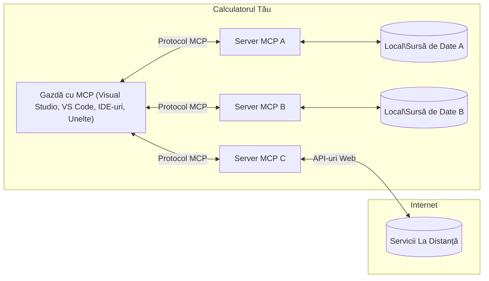

# MCP Core Concepts: Stăpânirea Protocolului Contextului Modelului pentru Integrarea AI

[](https://youtu.be/earDzWGtE84)

_(Apasă pe imaginea de mai sus pentru a viziona videoclipul acestei lecții)_

[Model Context Protocol (MCP)](https://github.com/modelcontextprotocol) este un cadru puternic, standardizat care optimizează comunicarea între Modelele Mari de Limbaj (LLM-uri) și uneltele externe, aplicațiile și sursele de date.  
Acest ghid te va parcurge prin conceptele de bază ale MCP. Vei învăța despre arhitectura client-server, componentele esențiale, mecanica comunicării și cele mai bune practici de implementare.

- **Consimțământ Explicit al Utilizatorului**: Toate accesările datelor și operațiunile necesită aprobarea explicită a utilizatorului înainte de execuție. Utilizatorii trebuie să înțeleagă clar ce date vor fi accesate și ce acțiuni vor fi efectuate, având control granular asupra permisiunilor și autorizărilor.

- **Protecția Intimității Datelor**: Datele utilizatorului sunt expuse doar cu consimțământ explicit și trebuie protejate prin controale riguroase de acces pe toată durata interacțiunii. Implementările trebuie să prevină transmiterea neautorizată a datelor și să mențină limite stricte de confidențialitate.

- **Siguranța Executării Uneltelor**: Fiecare invocare a unei unelte necesită consimțământ explicit al utilizatorului, cu înțelegerea clară a funcționalității, parametrilor și impactului potențial al uneltei. Sunt necesare limite de securitate robuste pentru a preveni execuțiile nesigure, neintenționate sau malițioase.

- **Securitatea Stratului de Transport**: Toate canalele de comunicare ar trebui să utilizeze mecanisme adecvate de criptare și autentificare. Conexiunile la distanță trebuie să implementeze protocoale de transport securizate și o gestionare corespunzătoare a acreditărilor.

#### Linii directoare de implementare:

- **Gestionarea Permisiunilor**: Implementați sisteme de permisiuni fine care permit utilizatorilor să controleze ce servere, unelte și resurse sunt accesibile  
- **Autentificare & Autorizare**: Folosiți metode de autentificare securizată (OAuth, chei API) cu o gestionare corectă a token-urilor și expirării  
- **Validarea Intrărilor**: Validați toți parametrii și datele de intrare conform schemelor definite pentru a preveni atacurile de tip injecție  
- **Auditare și Jurnalizare**: Mențineți jurnale cuprinzătoare ale tuturor operațiunilor pentru monitorizare securitară și conformitate

## Prezentare generală

Această lecție explorează arhitectura fundamentală și componentele care compun ecosistemul Model Context Protocol (MCP). Vei învăța despre arhitectura client-server, componentele cheie și mecanismele de comunicare care alimentează interacțiunile MCP.

## Obiective cheie de învățare

La finalul acestei lecții, vei:

- Înțelege arhitectura client-server a MCP.
- Identifica rolurile și responsabilitățile Host-urilor, Clienților și Serverelor.
- Analiza caracteristicile cheie care fac MCP un strat flexibil de integrare.
- Înțelege fluxul de informații din ecosistemul MCP.
- Dobândi perspective practice prin exemple de cod în .NET, Java, Python și JavaScript.

## Arhitectura MCP: O privire mai profundă

Ecosistemul MCP este construit pe un model client-server. Această structură modulară permite aplicațiilor AI să interacționeze eficient cu unelte, baze de date, API-uri și resurse contextuale. Hai să detaliem această arhitectură prin componentele sale de bază.

La bază, MCP urmează o arhitectură client-server unde o aplicație gazdă se poate conecta la mai multe servere:


- **Host-uri MCP**: Programe precum VSCode, Claude Desktop, IDE-uri sau unelte AI care doresc să acceseze date prin MCP  
- **Clienți MCP**: Clienți de protocol care mențin conexiuni unu-la-unu cu serverele  
- **Servere MCP**: Programe ușoare care expun anumite capabilități prin protocolul standardizat Model Context Protocol  
- **Surse locale de date**: Fișierele computerului tău, baze de date și servicii accesibile securizat de serverele MCP  
- **Servicii de la distanță**: Sisteme externe disponibile pe internet la care serverele MCP se pot conecta prin API-uri.

Protocolul MCP este un standard în evoluție care utilizează versiuni bazate pe dată (format YYYY-MM-DD). Versiunea curentă a protocolului este **2025-11-25**. Poți vedea ultimele actualizări ale [specificației protocolului](https://modelcontextprotocol.io/specification/2025-11-25/)

### 1. Host-uri

În Model Context Protocol (MCP), **Host-urile** sunt aplicații AI care servesc drept interfața principală prin care utilizatorii interacționează cu protocolul. Host-urile coordonează și gestionează conexiunile cu mai multe servere MCP prin crearea de clienți MCP dedicați pentru fiecare conexiune la server. Exemple de Host-uri includ:

- **Aplicații AI**: Claude Desktop, Visual Studio Code, Claude Code  
- **Mediile de dezvoltare**: IDE-uri și editori de cod cu integrare MCP  
- **Aplicații personalizate**: Agenți și unelte AI construite pentru scopuri specifice

**Host-urile** sunt aplicații care coordonează interacțiunile cu modelele AI. Ele:

- **Orchestra modele AI**: Execută sau interacționează cu LLM-uri pentru a genera răspunsuri și coordona fluxuri de lucru AI  
- **Administrează conexiunile client**: Creează și mențin câte un client MCP pentru fiecare conexiune la server MCP  
- **Controlează interfața utilizatorului**: Gestionează fluxul conversației, interacțiunile și prezentarea răspunsurilor  
- **Aplică securitatea**: Controlează permisiunile, restricțiile de securitate și autentificarea  
- **Gestionează consimțământul utilizatorului**: Administrează aprobarea utilizatorilor pentru partajarea datelor și execuția uneltelor

### 2. Clienți

**Clienții** sunt componente esențiale care mențin conexiuni dedicate unu-la-unu între Host-uri și serverele MCP. Fiecărui client MCP îi revine responsabilitatea de a se conecta la un anumit server MCP, asigurând canale de comunicare organizate și sigure. Mai mulți clienți permit Host-urilor să se conecteze simultan la mai multe servere.

**Clienții** sunt componente de conectare în cadrul aplicației gazdă. Ei:

- **Comunicarea protocolului**: Trimit cereri JSON-RPC 2.0 către servere cu prompturi și instrucțiuni  
- **Negocierea capabilităților**: Negociază caracteristicile suportate și versiunile protocolului cu serverele la inițializare  
- **Execuția uneltelor**: Gestionează cererile de execuție a uneltelor venite de la modele și procesează răspunsurile  
- **Actualizări în timp real**: Primesc notificări și actualizări în timp real de la servere  
- **Procesarea răspunsurilor**: Procesează și formatează răspunsurile serverului pentru a fi afișate utilizatorilor

### 3. Servere

**Serverele** sunt programe care oferă context, unelte și capabilități clienților MCP. Acestea pot fi executate local (pe aceeași mașină ca Host-ul) sau la distanță (pe platforme externe) și sunt responsabile de gestionarea cererilor clienților și oferirea răspunsurilor structurate. Serverele expun funcționalități specifice prin protocolul standardizat Model Context Protocol.

**Serverele** sunt servicii care oferă context și capabilități. Ele:

- **Înregistrarea funcțiilor**: Înregistrează și expun primitive disponibile (resurse, prompturi, unelte) către clienți  
- **Procesarea cererilor**: Primește și execută apeluri de unelte, cereri de resurse și solicitări de prompturi de la clienți  
- **Furnizarea de context**: Oferă informații contextuale și date pentru a îmbunătăți răspunsurile modelelor  
- **Gestionarea stării**: Mențin starea sesiunii și gestionează interacțiuni ce țin de stare, când este necesar  
- **Notificări în timp real**: Trimit notificări despre schimbări de capabilități și actualizări către clienții conectați

Serverele pot fi dezvoltate de oricine pentru a extinde capabilitățile modelelor cu funcționalități specializate și suportă scenarii de implementare atât local, cât și la distanță.

### 4. Primitivele Serverului

Serverele din Model Context Protocol (MCP) oferă trei primitive principale care definesc blocurile fundamentale pentru interacțiuni bogate între clienți, host-uri și modele de limbaj. Aceste primitive specifică tipurile de informații contextuale și acțiuni disponibile prin protocol.

Serverele MCP pot expune orice combinație a celor trei primitive principale următoare:

#### Resurse

**Resursele** sunt surse de date care furnizează informații contextuale aplicațiilor AI. Ele reprezintă conținut static sau dinamic care poate îmbunătăți înțelegerea și luarea deciziilor modelului:

- **Date contextuale**: Informații structurate și context pentru consumul modelelor AI  
- **Baze de cunoștințe**: Repositorii de documente, articole, manuale și lucrări de cercetare  
- **Surse locale de date**: Fișiere, baze de date și informații ale sistemului local  
- **Date externe**: Răspunsuri API, servicii web și date de la sisteme la distanță  
- **Conținut dinamic**: Date în timp real care se actualizează în funcție de condiții externe

Resursele sunt identificate prin URI-uri și suportă descoperirea prin metodele `resources/list` și accesarea prin `resources/read`:

```text
file://documents/project-spec.md
database://production/users/schema
api://weather/current
```

#### Prompturi

**Prompturile** sunt șabloane reutilizabile care ajută la structurarea interacțiunilor cu modelele de limbaj. Ele oferă modele standardizate de interacțiune și fluxuri de lucru șablonizate:

- **Interacțiuni bazate pe șabloane**: Mesaje pre-structurate și moduri de inițiere a conversației  
- **Șabloane de fluxuri de lucru**: Secvențe standardizate pentru sarcini și interacțiuni comune  
- **Exemple Few-shot**: Șabloane bazate pe exemple pentru instrucțiunea modelului  
- **Prompturi sistem**: Prompturi fundamentale care definesc comportamentul și contextul modelului  
- **Șabloane dinamice**: Prompturi parametrizate care se adaptează la contexte specifice

Prompturile suportă substituirea variabilelor și pot fi descoperite prin `prompts/list` și accesate cu `prompts/get`:

```markdown
Generate a {{task_type}} for {{product}} targeting {{audience}} with the following requirements: {{requirements}}
```

#### Unelte

**Uneltele** sunt funcții executabile pe care modelele AI le pot invoca pentru a efectua acțiuni specifice. Ele reprezintă „verbele” ecosistemului MCP, permițând modelelor să interacționeze cu sisteme externe:

- **Funcții executabile**: Operații discrete pe care modelele le pot invoca cu parametri specifici  
- **Integrare cu sisteme externe**: Apeluri API, interogări de baze de date, operațiuni pe fișiere, calcule  
- **Identitate unică**: Fiecare unealtă are un nume distinct, descriere și schemă de parametri  
- **I/O structurat**: Uneltele acceptă parametri validați și returnează răspunsuri structurate, tipizate  
- **Capabilități de acțiune**: Permite modelelor să efectueze acțiuni reale și să obțină date live

Uneltele sunt definite cu JSON Schema pentru validarea parametrilor și pot fi descoperite prin `tools/list` și executate prin `tools/call`. Uneltele pot include și **iconițe** ca metadate suplimentare pentru o prezentare UI mai bună.

**Anotări pentru unelte**: Uneltele suportă și anotări comportamentale (de exemplu, `readOnlyHint`, `destructiveHint`) care descriu dacă unealta este doar pentru citire sau distructivă, ajutând clienții să ia decizii informate despre executarea uneltei.

Exemplu de definiție de unealtă:

```typescript
server.tool(
  "search_products", 
  {
    query: z.string().describe("Search query for products"),
    category: z.string().optional().describe("Product category filter"),
    max_results: z.number().default(10).describe("Maximum results to return")
  }, 
  async (params) => {
    // Execută căutarea și returnează rezultatele structurate
    return await productService.search(params);
  }
);
```

## Primitivele Clientului

În Model Context Protocol (MCP), **clienții** pot expune primitive care permit serverelor să solicite capabilități suplimentare de la aplicația gazdă. Aceste primitive pe partea clientului permit implementări server mai bogate, mai interactive, care pot accesa capabilități ale modelelor AI și interacțiuni cu utilizatorii.

### Sampling

**Sampling** permite serverelor să solicite completări de model de limbaj din aplicația AI a clientului. Această primitivă permite serverelor să acceseze capabilitățile LLM fără a-și include propriile dependențe de model:

- **Acces independent de model**: Serverele pot solicita completări fără a include SDK-uri LLM sau a gestiona accesul la model  
- **AI inițiat de server**: Permite serverelor să genereze conținut autonom folosind modelul AI al clientului  
- **Interacțiuni recursive LLM**: Suportă scenarii complexe unde serverele au nevoie de ajutor AI pentru procesare  
- **Generare dinamică de conținut**: Permite serverelor să creeze răspunsuri contextuale folosind modelul gazdei  
- **Suport pentru apelarea uneltelor**: Serverele pot include parametrii `tools` și `toolChoice` pentru a permite modelului client să invoce unelte în timpul sampling-ului

Sampling-ul este inițiat prin metoda `sampling/complete`, unde serverele trimit cereri de completare către clienți.

### Rădăcini (Roots)

**Roots** oferă o modalitate standardizată pentru clienți de a expune limitele sistemului de fișiere către servere, ajutând serverele să înțeleagă ce directoare și fișiere au acces:

- **Limitele sistemului de fișiere**: Definirea limitelor în care serverele pot opera în sistemul de fișiere  
- **Controlul accesului**: Ajută serverele să înțeleagă ce directoare și fișiere pot accesa  
- **Actualizări dinamice**: Clienții pot notifica serverele când lista rădăcinilor se schimbă  
- **Identificare bazată pe URI**: Rădăcinile folosesc URI-uri `file://` pentru a identifica directoarele și fișierele accesibile

Rădăcinile sunt descoperite prin metoda `roots/list`, iar clienții trimit notificări `notifications/roots/list_changed` când rădăcinile se modifică.

### Elicitation

**Elicitation** permite serverelor să solicite informații suplimentare sau confirmare de la utilizatori prin interfața clientului:

- **Solicitări de input de la utilizator**: Serverele pot cere informații suplimentare când sunt necesare pentru execuția unei unelte  
- **Dialoguri de confirmare**: Solicită aprobarea utilizatorului pentru operațiuni sensibile sau cu impact mare  
- **Fluxuri de lucru interactive**: Permit serverelor să creeze interacțiuni pas cu pas cu utilizatorii  
- **Colectare dinamică de parametri**: Strângere de parametri lipsă sau opționali în timpul execuției uneltei

Cererile de elicitation se fac folosind metoda `elicitation/request` pentru a colecta input de la utilizator prin interfața clientului.

**Elicitation în modul URL**: Serverele pot, de asemenea, să solicite interacțiuni bazate pe URL, permițând direcționarea utilizatorilor către pagini web externe pentru autentificare, confirmare sau introducere de date.

### Jurnalizare (Logging)

**Logging** permite serverelor să trimită mesaje structurate de jurnal către clienți pentru depanare, monitorizare și vizibilitate operațională:

- **Suport pentru depanare**: Permite serverelor să ofere jurnale detaliate de execuție pentru depanare  
- **Monitorizare operațională**: Trimite actualizări de stare și metrici de performanță către clienți  
- **Raportare erori**: Oferă context detaliat și informații diagnostice despre erori  
- **Trasee de audit**: Creează jurnale cuprinzătoare ale operațiunilor și deciziilor serverului

Mesajele de jurnal sunt trimise către clienți pentru a oferi transparență asupra operațiunilor serverului și pentru a facilita depanarea.

## Fluxul informației în MCP

Model Context Protocol (MCP) definește un flux structurat de informații între host-uri, clienți, servere și modele. Înțelegerea acestui flux ajută la clarificarea modului în care cererile utilizatorilor sunt procesate și cum uneltele și datele externe sunt integrate în răspunsurile modelului.

- **Host-ul inițiază conexiunea**  
  Aplicația gazdă (de exemplu un IDE sau o interfață de chat) stabilește o conexiune către un server MCP, de obicei prin STDIO, WebSocket sau alt transport suportat.

- **Negocierea capabilităților**  
  Clientul (încorporat în host) și serverul își schimbă informații despre funcționalitățile, uneltele, resursele și versiunile protocolului suportate. Astfel, ambele părți înțeleg ce capabilități sunt disponibile pentru sesiune.

- **Cererea utilizatorului**  
  Utilizatorul interacționează cu host-ul (ex. introduc un prompt sau o comandă). Host-ul colectează acest input și îl transmite clientului pentru procesare.

- **Utilizarea resurselor sau uneltelor**  
  - Clientul poate solicita context sau resurse suplimentare de la server (de exemplu fișiere, intrări în bază de date sau articole din baze de cunoștințe) pentru a îmbogăți înțelegerea modelului.  
  - Dacă modelul determină că e nevoie de o unealtă (ex. pentru a obține date, a efectua un calcul sau a apela un API), clientul trimite o cerere de invocare a uneltei către server, specificând numele uneltei și parametrii.

- **Execuția de către server**  

Serverul primește cererea pentru resursă sau unealtă, execută operațiile necesare (cum ar fi rularea unei funcții, interogarea unei baze de date sau recuperarea unui fișier) și returnează rezultatele către client într-un format structurat.

- **Generarea răspunsului**  
  Clientul integrează răspunsurile serverului (datele resursei, rezultatele uneltelor etc.) în interacțiunea curentă cu modelul. Modelul folosește aceste informații pentru a genera un răspuns cuprinzător și relevant contextual.

- **Prezentarea rezultatului**  
  Gazda primește rezultatul final de la client și îl prezintă utilizatorului, adesea incluzând atât textul generat de model, cât și orice rezultate ale execuțiilor uneltelor sau căutărilor în resurse.

Acest flux permite MCP să susțină aplicații AI avansate, interactive și conștiente de context prin conectarea transparentă a modelelor cu unelte și surse externe de date.

## Arhitectura și straturile protocolului

MCP constă din două straturi arhitecturale distincte care lucrează împreună pentru a oferi un cadru complet de comunicare:

### Strat de date

**Stratul de date** implementează protocolul de bază MCP folosind **JSON-RPC 2.0** ca fundație. Acest strat definește structura mesajelor, semantica și tiparele de interacțiune:

#### Componente principale:

- **Protocol JSON-RPC 2.0**: Toată comunicarea folosește formatul standardizat al mesajelor JSON-RPC 2.0 pentru apeluri de metode, răspunsuri și notificări
- **Managementul ciclului de viață**: Gestionează inițializarea conexiunii, negocierea capabilităților și terminarea sesiunii între clienți și servere
- **Primitive server**: Permite serverelor să ofere funcționalitate de bază prin unelte, resurse și prompturi
- **Primitive client**: Permite serverelor să solicite eșantionare de la LLM-uri, să ceară input de la utilizator și să trimită mesaje de jurnalizare
- **Notificări în timp real**: Suportă notificări asincrone pentru actualizări dinamice fără interogare continuă

#### Caracteristici cheie:

- **Negocierea versiunii protocolului**: Utilizează versiuni bazate pe dată (AAAA-LL-ZZ) pentru a asigura compatibilitatea
- **Descoperirea capabilităților**: Clienții și serverele schimbă informații despre funcționalitățile suportate în timpul inițializării
- **Sesiuni cu stare**: Menține starea conexiunii prin multiple interacțiuni pentru continuitatea contextului

### Strat de transport

**Stratul de transport** gestionează canalele de comunicare, încapsularea mesajelor și autentificarea între participanții MCP:

#### Mecanisme de transport suportate:

1. **Transport STDIO**:
   - Folosește fluxurile standard de intrare/ieșire pentru comunicare directă între procese
   - Optim pentru procese locale pe aceeași mașină, fără overhead de rețea
   - Utilizat frecvent pentru implementări locale ale serverului MCP

2. **Transport HTTP care suportă streaming**:
   - Folosește HTTP POST pentru mesaje client-server  
   - Opțional Server-Sent Events (SSE) pentru streaming server-client
   - Permite comunicarea cu servere de la distanță prin rețele
   - Suportă autentificare HTTP standard (token-uri bearer, chei API, anteturi personalizate)
   - MCP recomandă OAuth pentru autentificare securizată bazată pe token-uri

#### Abstracția transportului:

Stratul de transport abstractizează detaliile de comunicare față de stratul de date, permițând același format JSON-RPC 2.0 al mesajelor pe toate mecanismele de transport. Această abstracție permite aplicațiilor să comute fără probleme între servere locale și remote.

### Considerații de securitate

Implementările MCP trebuie să respecte principii critice de securitate pentru a asigura interacțiuni sigure, de încredere și protejate pe tot parcursul operațiunilor protocolului:

- **Consimțământul și controlul utilizatorului**: Utilizatorii trebuie să ofere consimțământ explicit înainte ca orice date să fie accesate sau operații să fie efectuate. Ei trebuie să aibă un control clar asupra datelor partajate și acțiunilor autorizate, susținut de interfețe intuitive pentru revizuire și aprobare.

- **Confidențialitatea datelor**: Datele utilizatorului trebuie expuse doar cu consimțământ explicit și trebuie protejate prin controale adecvate de acces. Implementările MCP trebuie să prevină transmiterea neautorizată a datelor și să asigure păstrarea confidențialității pe tot parcursul interacțiunilor.

- **Siguranța uneltelor**: Înainte de a apela orice unealtă, este necesar consimțământ explicit al utilizatorului. Utilizatorii trebuie să înțeleagă clar funcționalitatea fiecărei unelte, iar limite de securitate robuste trebuie aplicate pentru a preveni execuții neintenționate sau nesigure.

Prin respectarea acestor principii de securitate, MCP asigură încrederea, confidențialitatea și siguranța utilizatorului în toate interacțiunile protocolului, oferind în același timp integrări puternice AI.

## Exemple de cod: componente cheie

Mai jos sunt exemple de cod în mai multe limbaje populare care ilustrează cum să implementați componente cheie ale unui server MCP și unelte.

### Exemplu .NET: Crearea unui server MCP simplu cu unelte

Următorul exemplu practic în .NET demonstrează cum să implementați un server MCP simplu cu unelte personalizate. Acest exemplu arată cum să definiți și să înregistrați unelte, să gestionați cereri și să conectați serverul folosind Model Context Protocol.

```csharp
using System;
using System.Threading.Tasks;
using ModelContextProtocol.Server;
using ModelContextProtocol.Server.Transport;
using ModelContextProtocol.Server.Tools;

public class WeatherServer
{
    public static async Task Main(string[] args)
    {
        // Create an MCP server
        var server = new McpServer(
            name: "Weather MCP Server",
            version: "1.0.0"
        );
        
        // Register our custom weather tool
        server.AddTool<string, WeatherData>("weatherTool", 
            description: "Gets current weather for a location",
            execute: async (location) => {
                // Call weather API (simplified)
                var weatherData = await GetWeatherDataAsync(location);
                return weatherData;
            });
        
        // Connect the server using stdio transport
        var transport = new StdioServerTransport();
        await server.ConnectAsync(transport);
        
        Console.WriteLine("Weather MCP Server started");
        
        // Keep the server running until process is terminated
        await Task.Delay(-1);
    }
    
    private static async Task<WeatherData> GetWeatherDataAsync(string location)
    {
        // This would normally call a weather API
        // Simplified for demonstration
        await Task.Delay(100); // Simulate API call
        return new WeatherData { 
            Temperature = 72.5,
            Conditions = "Sunny",
            Location = location
        };
    }
}

public class WeatherData
{
    public double Temperature { get; set; }
    public string Conditions { get; set; }
    public string Location { get; set; }
}
```

### Exemplu Java: Componente server MCP

Acest exemplu ilustrează același server MCP și înregistrarea uneltelor ca exemplul .NET de mai sus, dar implementat în Java.

```java
import io.modelcontextprotocol.server.McpServer;
import io.modelcontextprotocol.server.McpToolDefinition;
import io.modelcontextprotocol.server.transport.StdioServerTransport;
import io.modelcontextprotocol.server.tool.ToolExecutionContext;
import io.modelcontextprotocol.server.tool.ToolResponse;

public class WeatherMcpServer {
    public static void main(String[] args) throws Exception {
        // Creează un server MCP
        McpServer server = McpServer.builder()
            .name("Weather MCP Server")
            .version("1.0.0")
            .build();
            
        // Înregistrează un instrument meteo
        server.registerTool(McpToolDefinition.builder("weatherTool")
            .description("Gets current weather for a location")
            .parameter("location", String.class)
            .execute((ToolExecutionContext ctx) -> {
                String location = ctx.getParameter("location", String.class);
                
                // Obține date meteo (simplificat)
                WeatherData data = getWeatherData(location);
                
                // Returnează răspuns formatat
                return ToolResponse.content(
                    String.format("Temperature: %.1f°F, Conditions: %s, Location: %s", 
                    data.getTemperature(), 
                    data.getConditions(), 
                    data.getLocation())
                );
            })
            .build());
        
        // Conectează serverul folosind transportul stdio
        try (StdioServerTransport transport = new StdioServerTransport()) {
            server.connect(transport);
            System.out.println("Weather MCP Server started");
            // Menține serverul activ până când procesul este încheiat
            Thread.currentThread().join();
        }
    }
    
    private static WeatherData getWeatherData(String location) {
        // Implementarea ar apela o API meteo
        // Simplificat pentru scopuri demonstrative
        return new WeatherData(72.5, "Sunny", location);
    }
}

class WeatherData {
    private double temperature;
    private String conditions;
    private String location;
    
    public WeatherData(double temperature, String conditions, String location) {
        this.temperature = temperature;
        this.conditions = conditions;
        this.location = location;
    }
    
    public double getTemperature() {
        return temperature;
    }
    
    public String getConditions() {
        return conditions;
    }
    
    public String getLocation() {
        return location;
    }
}
```

### Exemplu Python: Construirea unui server MCP

Acest exemplu folosește fastmcp, deci asigurați-vă că îl instalați înainte:

```python
pip install fastmcp
```
Exemplu de cod:

```python
#!/usr/bin/env python3
import asyncio
from fastmcp import FastMCP
from fastmcp.transports.stdio import serve_stdio

# Creează un server FastMCP
mcp = FastMCP(
    name="Weather MCP Server",
    version="1.0.0"
)

@mcp.tool()
def get_weather(location: str) -> dict:
    """Gets current weather for a location."""
    return {
        "temperature": 72.5,
        "conditions": "Sunny",
        "location": location
    }

# Abordare alternativă folosind o clasă
class WeatherTools:
    @mcp.tool()
    def forecast(self, location: str, days: int = 1) -> dict:
        """Gets weather forecast for a location for the specified number of days."""
        return {
            "location": location,
            "forecast": [
                {"day": i+1, "temperature": 70 + i, "conditions": "Partly Cloudy"}
                for i in range(days)
            ]
        }

# Înregistrează uneltele clasei
weather_tools = WeatherTools()

# Pornește serverul
if __name__ == "__main__":
    asyncio.run(serve_stdio(mcp))
```

### Exemplu JavaScript: Crearea unui server MCP

Acest exemplu arată crearea serverului MCP în JavaScript și cum să înregistrați două unelte legate de vreme.

```javascript
// Folosind SDK-ul oficial Model Context Protocol
import { McpServer } from "@modelcontextprotocol/sdk/server/mcp.js";
import { StdioServerTransport } from "@modelcontextprotocol/sdk/server/stdio.js";
import { z } from "zod"; // Pentru validarea parametrilor

// Creează un server MCP
const server = new McpServer({
  name: "Weather MCP Server",
  version: "1.0.0"
});

// Definește un instrument meteo
server.tool(
  "weatherTool",
  {
    location: z.string().describe("The location to get weather for")
  },
  async ({ location }) => {
    // De obicei, acesta ar apela o API meteo
    // Simplificat pentru demonstrație
    const weatherData = await getWeatherData(location);
    
    return {
      content: [
        { 
          type: "text", 
          text: `Temperature: ${weatherData.temperature}°F, Conditions: ${weatherData.conditions}, Location: ${weatherData.location}` 
        }
      ]
    };
  }
);

// Definește un instrument de prognoză
server.tool(
  "forecastTool",
  {
    location: z.string(),
    days: z.number().default(3).describe("Number of days for forecast")
  },
  async ({ location, days }) => {
    // De obicei, acesta ar apela o API meteo
    // Simplificat pentru demonstrație
    const forecast = await getForecastData(location, days);
    
    return {
      content: [
        { 
          type: "text", 
          text: `${days}-day forecast for ${location}: ${JSON.stringify(forecast)}` 
        }
      ]
    };
  }
);

// Funcții ajutătoare
async function getWeatherData(location) {
  // Simulează apelul API
  return {
    temperature: 72.5,
    conditions: "Sunny",
    location: location
  };
}

async function getForecastData(location, days) {
  // Simulează apelul API
  return Array.from({ length: days }, (_, i) => ({
    day: i + 1,
    temperature: 70 + Math.floor(Math.random() * 10),
    conditions: i % 2 === 0 ? "Sunny" : "Partly Cloudy"
  }));
}

// Conectează serverul folosind transportul stdio
const transport = new StdioServerTransport();
server.connect(transport).catch(console.error);

console.log("Weather MCP Server started");
```
  
Acest exemplu JavaScript demonstrează cum să creați un client MCP care se conectează la server, trimite un prompt și procesează răspunsul, inclusiv eventualele apeluri ale uneltelor efectuate.

## Securitate și autorizare

MCP include mai multe concepte și mecanisme încorporate pentru gestionarea securității și autorizării pe tot parcursul protocolului:

1. **Controlul permisiunilor uneltelor**:  
  Clienții pot specifica ce unelte are voie modelul să folosească în timpul unei sesiuni. Acest lucru asigură accesul doar la uneltele explicit autorizate, reducând riscul operațiilor neintenționate sau nesigure. Permisiunile pot fi configurate dinamic în funcție de preferințele utilizatorului, politicile organizației sau contextul interacțiunii.

2. **Autentificare**:  
  Serverele pot solicita autentificare înainte de a acorda acces la unelte, resurse sau operații sensibile. Aceasta poate implica chei API, token-uri OAuth sau alte scheme de autentificare. Autentificarea corectă garantează că doar clienții și utilizatorii de încredere pot apela capabilități server-side.

3. **Validare**:  
  Validarea parametrilor este impusă pentru toate apelurile uneltelor. Fiecare unealtă definește tipurile, formatele și constrângerile așteptate pentru parametri, iar serverul validează cererile primite în consecință. Aceasta previne intrarea de date incorecte sau malițioase în implementările uneltelor și ajută la menținerea integrității operațiunilor.

4. **Limitarea ratei**:  
  Pentru a preveni abuzul și a asigura utilizare corectă a resurselor serverului, serverele MCP pot implementa limitări de rată pentru apelurile uneltelor și accesul la resurse. Limitările pot fi aplicate per utilizator, per sesiune sau global și protejează împotriva atacurilor denial-of-service sau consumului excesiv.

Combinând aceste mecanisme, MCP oferă o fundație securizată pentru integrarea modelelor lingvistice cu unelte și surse de date externe, oferind utilizatorilor și dezvoltatorilor control detaliat asupra accesului și utilizării.

## Mesaje protocol și fluxul de comunicare

Comunicarea MCP folosește mesaje structurate **JSON-RPC 2.0** pentru a facilita interacțiuni clare și sigure între gazde, clienți și servere. Protocolul definește tipare specifice de mesaje pentru diferite tipuri de operații:

### Tipuri principale de mesaje:

#### **Mesaje de inițializare**
- Cerere `initialize`: stabilește conexiunea și negociază versiunea protocolului și capabilitățile
- Răspuns `initialize`: confirmă funcționalitățile suportate și informațiile serverului  
- Notificare `notifications/initialized`: semnalează că inițializarea este completă și sesiunea este gata

#### **Mesaje de descoperire**
- Cerere `tools/list`: descoperă uneltele disponibile de la server
- Cerere `resources/list`: listează resursele disponibile (surse de date)
- Cerere `prompts/list`: preia șabloanele de prompturi disponibile

#### **Mesaje de execuție**  
- Cerere `tools/call`: execută o unealtă specifică cu parametrii furnizați
- Cerere `resources/read`: preia conținutul unei resurse specifice
- Cerere `prompts/get`: obține un șablon de prompt cu parametri opționali

#### **Mesaje de partea clientului**
- Cerere `sampling/complete`: serverul solicită completarea LLM de la client
- Cerere `elicitation/request`: serverul solicită input de la utilizator prin interfața clientului
- Mesaje de jurnalizare: serverul trimite mesaje structurate de logare către client

#### **Mesaje de notificare**
- Notificare `notifications/tools/list_changed`: serverul notifică clientul despre modificări ale uneltelor
- Notificare `notifications/resources/list_changed`: modificări ale resurselor  
- Notificare `notifications/prompts/list_changed`: modificări ale prompturilor

### Structura mesajelor:

Toate mesajele MCP respectă formatul JSON-RPC 2.0 cu:  
- Mesaje de cerere: conțin `id`, `method` și opțional `params`  
- Mesaje de răspuns: conțin `id` și fie `result`, fie `error`  
- Mesaje de notificare: conțin `method` și opțional `params` (fără `id` și fără răspuns așteptat)

Această comunicare structurată asigură interacțiuni robuste, trasabile și extensibile, suportând scenarii avansate precum actualizări în timp real, concatenarea uneltelor și gestionarea solidă a erorilor.

### Sarcini (Experimental)

**Sarcinile** sunt o funcționalitate experimentală care oferă ambalaje de execuție durabile, permițând recuperarea amânată a rezultatelor și urmărirea statusului pentru cererile MCP:

- **Operații de durată lungă**: urmăresc calcule costisitoare, automatizarea fluxurilor și procesarea loturilor
- **Rezultate amânate**: poll pentru statusul sarcinii și recuperare rezultate la finalizare
- **Monitorizarea stării**: supraveghează progresul sarcinii prin stări de ciclu de viață definite
- **Operații multi-etape**: suport pentru fluxuri complexe care acoperă multiple interacțiuni

Sarcinile înfășoară cererile standard MCP pentru a permite executarea asincronă a operațiilor ce nu se pot încheia imediat.

## Aspecte esențiale

- **Arhitectură**: MCP folosește o arhitectură client-server unde gazdele gestionează conexiuni multiple ale clienților către servere  
- **Participanți**: Ecosistemul include gazde (aplicații AI), clienți (conectori protocol) și servere (furnizori de capabilități)  
- **Mecanisme de transport**: comunicarea suportă STDIO (local) și HTTP cu streaming opțional SSE (remote)  
- **Primitive de bază**: serverele expun unelte (funcții executabile), resurse (surse de date) și prompturi (șabloane)  
- **Primitive client**: serverele pot solicita eșantionare (completări LLM cu suport apel unelte), elicitație (input utilizator inclusiv modul URL), rădăcini (granițe sistem fișiere) și jurnalizare de la clienți  
- **Funcționalități experimentale**: sarcinile oferă ambalaje durabile pentru operații pe termen lung  
- **Fundația protocolului**: construit pe JSON-RPC 2.0 cu versiuni bazate pe dată (actual: 2025-11-25)  
- **Capabilități în timp real**: suportă notificări pentru actualizări dinamice și sincronizare în timp real  
- **Securitate pe primul loc**: consimțământ explicit al utilizatorului, protecție a confidențialității datelor și transport securizat sunt cerințe de bază

## Exercițiu

Concepeți o unealtă MCP simplă care ar fi utilă în domeniul dvs. Definiți:  
1. Cum s-ar numi unealta  
2. Ce parametri ar accepta  
3. Ce rezultat ar returna  
4. Cum ar putea un model să folosească această unealtă pentru a rezolva problemele utilizatorilor

---

## Ce urmează

Următorul capitol: [Capitolul 2: Securitate](../02-Security/README.md)

---

<!-- CO-OP TRANSLATOR DISCLAIMER START -->
**Declinare a responsabilității**:  
Acest document a fost tradus folosind serviciul de traducere AI [Co-op Translator](https://github.com/Azure/co-op-translator). Deși ne străduim să fim cât mai preciși, vă rugăm să rețineți că traducerile automate pot conține erori sau inexactități. Documentul original, în limba sa nativă, trebuie considerat sursa oficială. Pentru informații critice, se recomandă traducerea profesională realizată de un specialist uman. Nu ne asumăm nicio responsabilitate pentru neînțelegeri sau interpretări greșite care pot apărea din utilizarea acestei traduceri.
<!-- CO-OP TRANSLATOR DISCLAIMER END -->