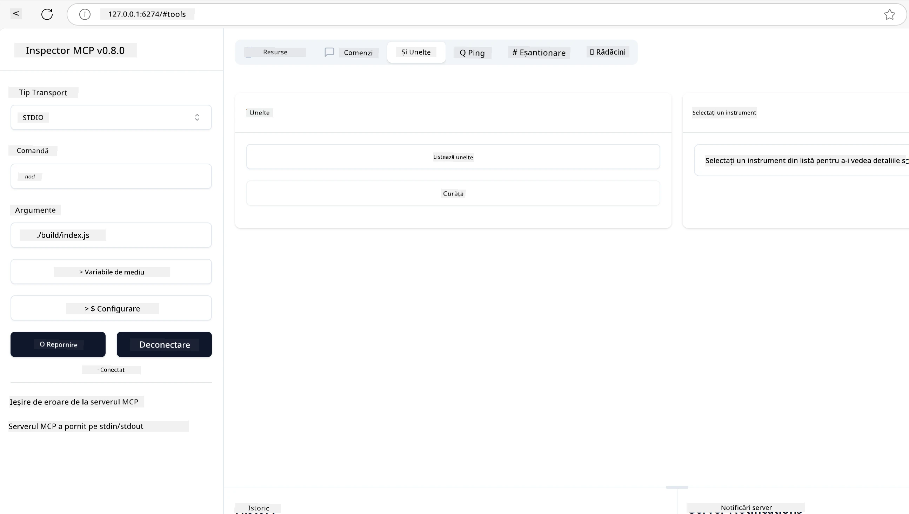
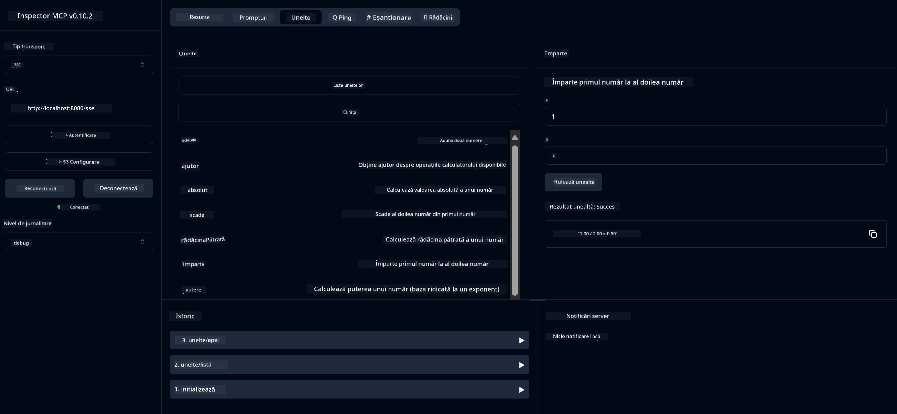
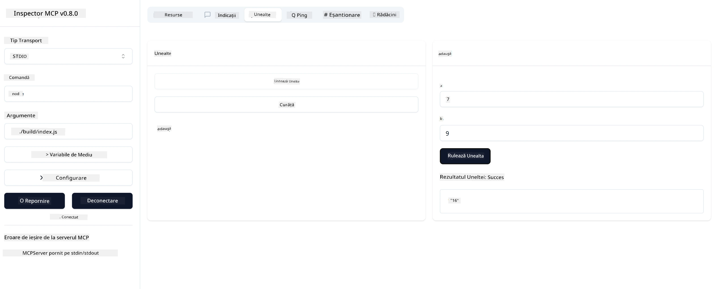

# Început cu MCP

Bine ați venit la primii pași cu Model Context Protocol (MCP)! Fie că sunteți nou în MCP sau doriți să vă aprofundați înțelegerea, acest ghid vă va conduce prin procesul esențial de configurare și dezvoltare. Veți descoperi cum MCP permite integrarea fără probleme între modelele AI și aplicații și veți învăța cum să vă pregătiți rapid mediul pentru a construi și testa soluții bazate pe MCP.

> TLDR; Dacă dezvoltați aplicații AI, știți că puteți adăuga unelte și alte resurse la LLM-ul dvs. (modelul lingvistic mare), pentru a-l face mai informat. Totuși, dacă plasați acele unelte și resurse pe un server, capacitățile aplicației și serverului pot fi folosite de orice client cu/fără un LLM.

## Prezentare generală

Această lecție oferă îndrumări practice pentru configurarea mediilor MCP și construirea primelor aplicații MCP. Veți învăța cum să configurați uneltele și cadrele necesare, să construiți servere MCP de bază, să creați aplicații gazdă și să testați implementările dvs.

Model Context Protocol (MCP) este un protocol deschis care standardizează modul în care aplicațiile oferă context către LLM-uri. Gândiți-vă la MCP ca la un port USB-C pentru aplicațiile AI - oferă o modalitate standardizată de a conecta modelele AI la diferite surse de date și unelte.

## Obiective de învățare

La finalul acestei lecții, veți putea:

- Configura medii de dezvoltare pentru MCP în C#, Java, Python, TypeScript și Rust
- Construi și implementa servere MCP de bază cu funcționalități personalizate (resurse, prompturi și unelte)
- Crea aplicații gazdă care se conectează la servere MCP
- Testa și depana implementările MCP

## Configurarea mediului MCP

Înainte de a începe să lucrați cu MCP, este important să vă pregătiți mediul de dezvoltare și să înțelegeți fluxul de lucru de bază. Această secțiune vă va ghida prin pașii inițiali de configurare pentru a asigura un început lin cu MCP.

### Cerințe preliminare

Înainte de a începe dezvoltarea MCP, asigurați-vă că aveți:

- **Mediu de dezvoltare**: Pentru limbajul ales (C#, Java, Python, TypeScript sau Rust)
- **IDE/Editor**: Visual Studio, Visual Studio Code, IntelliJ, Eclipse, PyCharm sau orice editor modern de cod
- **Manageri de pachete**: NuGet, Maven/Gradle, pip, npm/yarn sau Cargo
- **Chei API**: Pentru orice servicii AI pe care intenționați să le folosiți în aplicațiile gazdă

## Structura de bază a unui server MCP

Un server MCP include de obicei:

- **Configurarea serverului**: Setarea portului, autentificarea și alte setări
- **Resurse**: Date și context puse la dispoziția LLM-urilor
- **Unelte**: Funcționalități pe care modelele le pot invoca
- **Prompturi**: Șabloane pentru generarea sau structurarea textului

Iată un exemplu simplificat în TypeScript:

```typescript
import { McpServer, ResourceTemplate } from "@modelcontextprotocol/sdk/server/mcp.js";
import { StdioServerTransport } from "@modelcontextprotocol/sdk/server/stdio.js";
import { z } from "zod";

// Creează un server MCP
const server = new McpServer({
  name: "Demo",
  version: "1.0.0"
});

// Adaugă un instrument de adunare
server.tool("add",
  { a: z.number(), b: z.number() },
  async ({ a, b }) => ({
    content: [{ type: "text", text: String(a + b) }]
  })
);

// Adaugă o resursă de salut dinamic
server.resource(
  "file",
  // Parametrul 'list' controlează modul în care resursa listează fișierele disponibile. Setarea lui la undefined dezactivează listarea pentru această resursă.
  new ResourceTemplate("file://{path}", { list: undefined }),
  async (uri, { path }) => ({
    contents: [{
      uri: uri.href,
      text: `File, ${path}!`
    }]
  })
);

// Adaugă o resursă de fișier care citește conținutul fișierului
server.resource(
  "file",
  new ResourceTemplate("file://{path}", { list: undefined }),
  async (uri, { path }) => {
    let text;
    try {
      text = await fs.readFile(path, "utf8");
    } catch (err) {
      text = `Error reading file: ${err.message}`;
    }
    return {
      contents: [{
        uri: uri.href,
        text
      }]
    };
  }
);

server.prompt(
  "review-code",
  { code: z.string() },
  ({ code }) => ({
    messages: [{
      role: "user",
      content: {
        type: "text",
        text: `Please review this code:\n\n${code}`
      }
    }]
  })
);

// Începe să primești mesaje pe stdin și să trimiți mesaje pe stdout
const transport = new StdioServerTransport();
await server.connect(transport);
```

În codul de mai sus am:

- Importat clasele necesare din SDK-ul MCP pentru TypeScript.
- Creat și configurat o nouă instanță de server MCP.
- Înregistrat o unealtă personalizată (`calculator`) cu o funcție handler.
- Pornit serverul pentru a asculta cererile MCP primite.

## Testare și depanare

Înainte de a începe testarea serverului MCP, este important să înțelegeți uneltele disponibile și cele mai bune practici pentru depanare. Testarea eficientă asigură că serverul dvs. se comportă conform așteptărilor și vă ajută să identificați și să rezolvați rapid problemele. Secțiunea următoare descrie abordările recomandate pentru validarea implementării MCP.

MCP oferă unelte care vă ajută să testați și să depanați serverele:

- **Unealta Inspector**, această interfață grafică vă permite să vă conectați la server și să testați uneltele, prompturile și resursele.
- **curl**, puteți de asemenea să vă conectați la server folosind un instrument de linie de comandă precum curl sau alți clienți care pot crea și rula comenzi HTTP.

### Utilizarea MCP Inspector

[MCP Inspector](https://github.com/modelcontextprotocol/inspector) este o unealtă vizuală de testare care vă ajută să:

1. **Descoperiți capacitățile serverului**: Detectați automat resursele, uneltele și prompturile disponibile
2. **Testați execuția uneltelor**: Încercați diferiți parametri și vedeți răspunsurile în timp real
3. **Vizualizați metadatele serverului**: Examinați informațiile serverului, schemele și configurațiile

```bash
# exemplu TypeScript, instalarea și rularea MCP Inspector
npx @modelcontextprotocol/inspector node build/index.js
```

Când rulați comenzile de mai sus, MCP Inspector va lansa o interfață web locală în browserul dvs. Vă puteți aștepta să vedeți un tablou de bord care afișează serverele MCP înregistrate, uneltele, resursele și prompturile disponibile. Interfața vă permite să testați interactiv execuția uneltelor, să inspectați metadatele serverului și să vizualizați răspunsurile în timp real, facilitând validarea și depanarea implementărilor serverului MCP.

Iată o captură de ecran cu cum poate arăta:



## Probleme comune de configurare și soluții

| Problemă | Soluție posibilă |
|----------|------------------|
| Conexiune refuzată | Verificați dacă serverul rulează și portul este corect |
| Erori la execuția uneltelor | Revizuiți validarea parametrilor și gestionarea erorilor |
| Eșecuri de autentificare | Verificați cheile API și permisiunile |
| Erori de validare a schemei | Asigurați-vă că parametrii corespund schemei definite |
| Serverul nu pornește | Verificați conflictele de port sau dependențele lipsă |
| Erori CORS | Configurați corect anteturile CORS pentru cereri cross-origin |
| Probleme de autentificare | Verificați validitatea tokenului și permisiunile |

## Dezvoltare locală

Pentru dezvoltare și testare locală, puteți rula servere MCP direct pe mașina dvs.:

1. **Porniți procesul serverului**: Rulați aplicația server MCP
2. **Configurați rețeaua**: Asigurați-vă că serverul este accesibil pe portul așteptat
3. **Conectați clienți**: Folosiți URL-uri de conexiune locală precum `http://localhost:3000`

```bash
# Exemplu: Rularea unui server MCP TypeScript local
npm run start
# Serverul rulează la http://localhost:3000
```

## Construirea primului server MCP

Am acoperit [Conceptele de bază](/01-CoreConcepts/README.md) într-o lecție anterioară, acum este timpul să punem acea cunoaștere în practică.

### Ce poate face un server

Înainte să începem să scriem cod, să ne reamintim ce poate face un server:

Un server MCP poate, de exemplu:

- Accesa fișiere și baze de date locale
- Conecta la API-uri externe
- Efectua calcule
- Integra cu alte unelte și servicii
- Oferi o interfață utilizator pentru interacțiune

Perfect, acum că știm ce putem face, să începem să codăm.

## Exercițiu: Crearea unui server

Pentru a crea un server, trebuie să urmați acești pași:

- Instalați SDK-ul MCP.
- Creați un proiect și configurați structura proiectului.
- Scrieți codul serverului.
- Testați serverul.

### -1- Crearea proiectului

#### TypeScript

```sh
# Creează directorul proiectului și inițializează proiectul npm
mkdir calculator-server
cd calculator-server
npm init -y
```

#### Python

```sh
# Creează directorul proiectului
mkdir calculator-server
cd calculator-server
# Deschide folderul în Visual Studio Code - Sari peste acest pas dacă folosești un alt IDE
code .
```

#### .NET

```sh
dotnet new console -n McpCalculatorServer
cd McpCalculatorServer
```

#### Java

Pentru Java, creați un proiect Spring Boot:

```bash
curl https://start.spring.io/starter.zip \
  -d dependencies=web \
  -d javaVersion=21 \
  -d type=maven-project \
  -d groupId=com.example \
  -d artifactId=calculator-server \
  -d name=McpServer \
  -d packageName=com.microsoft.mcp.sample.server \
  -o calculator-server.zip
```

Dezarhivați fișierul zip:

```bash
unzip calculator-server.zip -d calculator-server
cd calculator-server
# opțional eliminați testul neutilizat
rm -rf src/test/java
```

Adăugați următoarea configurație completă în fișierul *pom.xml*:

```xml
<?xml version="1.0" encoding="UTF-8"?>
<project xmlns="http://maven.apache.org/POM/4.0.0"
    xmlns:xsi="http://www.w3.org/2001/XMLSchema-instance"
    xsi:schemaLocation="http://maven.apache.org/POM/4.0.0 http://maven.apache.org/xsd/maven-4.0.0.xsd">
    <modelVersion>4.0.0</modelVersion>
    
    <!-- Spring Boot parent for dependency management -->
    <parent>
        <groupId>org.springframework.boot</groupId>
        <artifactId>spring-boot-starter-parent</artifactId>
        <version>3.5.0</version>
        <relativePath />
    </parent>

    <!-- Project coordinates -->
    <groupId>com.example</groupId>
    <artifactId>calculator-server</artifactId>
    <version>0.0.1-SNAPSHOT</version>
    <name>Calculator Server</name>
    <description>Basic calculator MCP service for beginners</description>

    <!-- Properties -->
    <properties>
        <java.version>21</java.version>
        <maven.compiler.source>21</maven.compiler.source>
        <maven.compiler.target>21</maven.compiler.target>
    </properties>

    <!-- Spring AI BOM for version management -->
    <dependencyManagement>
        <dependencies>
            <dependency>
                <groupId>org.springframework.ai</groupId>
                <artifactId>spring-ai-bom</artifactId>
                <version>1.0.0-SNAPSHOT</version>
                <type>pom</type>
                <scope>import</scope>
            </dependency>
        </dependencies>
    </dependencyManagement>

    <!-- Dependencies -->
    <dependencies>
        <dependency>
            <groupId>org.springframework.ai</groupId>
            <artifactId>spring-ai-starter-mcp-server-webflux</artifactId>
        </dependency>
        <dependency>
            <groupId>org.springframework.boot</groupId>
            <artifactId>spring-boot-starter-actuator</artifactId>
        </dependency>
        <dependency>
         <groupId>org.springframework.boot</groupId>
         <artifactId>spring-boot-starter-test</artifactId>
         <scope>test</scope>
      </dependency>
    </dependencies>

    <!-- Build configuration -->
    <build>
        <plugins>
            <plugin>
                <groupId>org.springframework.boot</groupId>
                <artifactId>spring-boot-maven-plugin</artifactId>
            </plugin>
            <plugin>
                <groupId>org.apache.maven.plugins</groupId>
                <artifactId>maven-compiler-plugin</artifactId>
                <configuration>
                    <release>21</release>
                </configuration>
            </plugin>
        </plugins>
    </build>

    <!-- Repositories for Spring AI snapshots -->
    <repositories>
        <repository>
            <id>spring-milestones</id>
            <name>Spring Milestones</name>
            <url>https://repo.spring.io/milestone</url>
            <snapshots>
                <enabled>false</enabled>
            </snapshots>
        </repository>
        <repository>
            <id>spring-snapshots</id>
            <name>Spring Snapshots</name>
            <url>https://repo.spring.io/snapshot</url>
            <releases>
                <enabled>false</enabled>
            </releases>
        </repository>
    </repositories>
</project>
```

#### Rust

```sh
mkdir calculator-server
cd calculator-server
cargo init
```

### -2- Adăugarea dependențelor

Acum că aveți proiectul creat, să adăugăm dependențele:

#### TypeScript

```sh
# Dacă nu este deja instalat, instalează TypeScript la nivel global
npm install typescript -g

# Instalează MCP SDK și Zod pentru validarea schemelor
npm install @modelcontextprotocol/sdk zod
npm install -D @types/node typescript
```

#### Python

```sh
# Creează un mediu virtual și instalează dependențele
python -m venv venv
venv\Scripts\activate
pip install "mcp[cli]"
```

#### Java

```bash
cd calculator-server
./mvnw clean install -DskipTests
```

#### Rust

```sh
cargo add rmcp --features server,transport-io
cargo add serde
cargo add tokio --features rt-multi-thread
```

### -3- Crearea fișierelor proiectului

#### TypeScript

Deschideți fișierul *package.json* și înlocuiți conținutul cu următorul pentru a vă asigura că puteți construi și rula serverul:

```json
{
  "name": "calculator-server",
  "version": "1.0.0",
  "main": "index.js",
  "type": "module",
  "scripts": {
    "build": "tsc",
    "start": "npm run build && node ./build/index.js",
  },
  "keywords": [],
  "author": "",
  "license": "ISC",
  "description": "A simple calculator server using Model Context Protocol",
  "dependencies": {
    "@modelcontextprotocol/sdk": "^1.16.0",
    "zod": "^3.25.76"
  },
  "devDependencies": {
    "@types/node": "^24.0.14",
    "typescript": "^5.8.3"
  }
}
```

Creați un *tsconfig.json* cu următorul conținut:

```json
{
  "compilerOptions": {
    "target": "ES2022",
    "module": "Node16",
    "moduleResolution": "Node16",
    "outDir": "./build",
    "rootDir": "./src",
    "strict": true,
    "esModuleInterop": true,
    "skipLibCheck": true,
    "forceConsistentCasingInFileNames": true
  },
  "include": ["src/**/*"],
  "exclude": ["node_modules"]
}
```

Creați un director pentru codul sursă:

```sh
mkdir src
touch src/index.ts
```

#### Python

Creați un fișier *server.py*

```sh
touch server.py
```

#### .NET

Instalați pachetele NuGet necesare:

```sh
dotnet add package ModelContextProtocol --prerelease
dotnet add package Microsoft.Extensions.Hosting
```

#### Java

Pentru proiectele Java Spring Boot, structura proiectului este creată automat.

#### Rust

Pentru Rust, un fișier *src/main.rs* este creat implicit când rulați `cargo init`. Deschideți fișierul și ștergeți codul implicit.

### -4- Crearea codului serverului

#### TypeScript

Creați un fișier *index.ts* și adăugați următorul cod:

```typescript
import { McpServer, ResourceTemplate } from "@modelcontextprotocol/sdk/server/mcp.js";
import { StdioServerTransport } from "@modelcontextprotocol/sdk/server/stdio.js";
import { z } from "zod";
 
// Creează un server MCP
const server = new McpServer({
  name: "Calculator MCP Server",
  version: "1.0.0"
});
```

Acum aveți un server, dar nu face prea multe, să remediem asta.

#### Python

```python
# server.py
from mcp.server.fastmcp import FastMCP

# Creează un server MCP
mcp = FastMCP("Demo")
```

#### .NET

```csharp
using Microsoft.Extensions.DependencyInjection;
using Microsoft.Extensions.Hosting;
using Microsoft.Extensions.Logging;
using ModelContextProtocol.Server;
using System.ComponentModel;

var builder = Host.CreateApplicationBuilder(args);
builder.Logging.AddConsole(consoleLogOptions =>
{
    // Configure all logs to go to stderr
    consoleLogOptions.LogToStandardErrorThreshold = LogLevel.Trace;
});

builder.Services
    .AddMcpServer()
    .WithStdioServerTransport()
    .WithToolsFromAssembly();
await builder.Build().RunAsync();

// add features
```

#### Java

Pentru Java, creați componentele de bază ale serverului. Mai întâi, modificați clasa principală a aplicației:

*src/main/java/com/microsoft/mcp/sample/server/McpServerApplication.java*:

```java
package com.microsoft.mcp.sample.server;

import org.springframework.ai.tool.ToolCallbackProvider;
import org.springframework.ai.tool.method.MethodToolCallbackProvider;
import org.springframework.boot.SpringApplication;
import org.springframework.boot.autoconfigure.SpringBootApplication;
import org.springframework.context.annotation.Bean;
import com.microsoft.mcp.sample.server.service.CalculatorService;

@SpringBootApplication
public class McpServerApplication {

    public static void main(String[] args) {
        SpringApplication.run(McpServerApplication.class, args);
    }
    
    @Bean
    public ToolCallbackProvider calculatorTools(CalculatorService calculator) {
        return MethodToolCallbackProvider.builder().toolObjects(calculator).build();
    }
}
```

Creați serviciul calculator *src/main/java/com/microsoft/mcp/sample/server/service/CalculatorService.java*:

```java
package com.microsoft.mcp.sample.server.service;

import org.springframework.ai.tool.annotation.Tool;
import org.springframework.stereotype.Service;

/**
 * Service for basic calculator operations.
 * This service provides simple calculator functionality through MCP.
 */
@Service
public class CalculatorService {

    /**
     * Add two numbers
     * @param a The first number
     * @param b The second number
     * @return The sum of the two numbers
     */
    @Tool(description = "Add two numbers together")
    public String add(double a, double b) {
        double result = a + b;
        return formatResult(a, "+", b, result);
    }

    /**
     * Subtract one number from another
     * @param a The number to subtract from
     * @param b The number to subtract
     * @return The result of the subtraction
     */
    @Tool(description = "Subtract the second number from the first number")
    public String subtract(double a, double b) {
        double result = a - b;
        return formatResult(a, "-", b, result);
    }

    /**
     * Multiply two numbers
     * @param a The first number
     * @param b The second number
     * @return The product of the two numbers
     */
    @Tool(description = "Multiply two numbers together")
    public String multiply(double a, double b) {
        double result = a * b;
        return formatResult(a, "*", b, result);
    }

    /**
     * Divide one number by another
     * @param a The numerator
     * @param b The denominator
     * @return The result of the division
     */
    @Tool(description = "Divide the first number by the second number")
    public String divide(double a, double b) {
        if (b == 0) {
            return "Error: Cannot divide by zero";
        }
        double result = a / b;
        return formatResult(a, "/", b, result);
    }

    /**
     * Calculate the power of a number
     * @param base The base number
     * @param exponent The exponent
     * @return The result of raising the base to the exponent
     */
    @Tool(description = "Calculate the power of a number (base raised to an exponent)")
    public String power(double base, double exponent) {
        double result = Math.pow(base, exponent);
        return formatResult(base, "^", exponent, result);
    }

    /**
     * Calculate the square root of a number
     * @param number The number to find the square root of
     * @return The square root of the number
     */
    @Tool(description = "Calculate the square root of a number")
    public String squareRoot(double number) {
        if (number < 0) {
            return "Error: Cannot calculate square root of a negative number";
        }
        double result = Math.sqrt(number);
        return String.format("√%.2f = %.2f", number, result);
    }

    /**
     * Calculate the modulus (remainder) of division
     * @param a The dividend
     * @param b The divisor
     * @return The remainder of the division
     */
    @Tool(description = "Calculate the remainder when one number is divided by another")
    public String modulus(double a, double b) {
        if (b == 0) {
            return "Error: Cannot divide by zero";
        }
        double result = a % b;
        return formatResult(a, "%", b, result);
    }

    /**
     * Calculate the absolute value of a number
     * @param number The number to find the absolute value of
     * @return The absolute value of the number
     */
    @Tool(description = "Calculate the absolute value of a number")
    public String absolute(double number) {
        double result = Math.abs(number);
        return String.format("|%.2f| = %.2f", number, result);
    }

    /**
     * Get help about available calculator operations
     * @return Information about available operations
     */
    @Tool(description = "Get help about available calculator operations")
    public String help() {
        return "Basic Calculator MCP Service\n\n" +
               "Available operations:\n" +
               "1. add(a, b) - Adds two numbers\n" +
               "2. subtract(a, b) - Subtracts the second number from the first\n" +
               "3. multiply(a, b) - Multiplies two numbers\n" +
               "4. divide(a, b) - Divides the first number by the second\n" +
               "5. power(base, exponent) - Raises a number to a power\n" +
               "6. squareRoot(number) - Calculates the square root\n" + 
               "7. modulus(a, b) - Calculates the remainder of division\n" +
               "8. absolute(number) - Calculates the absolute value\n\n" +
               "Example usage: add(5, 3) will return 5 + 3 = 8";
    }

    /**
     * Format the result of a calculation
     */
    private String formatResult(double a, String operator, double b, double result) {
        return String.format("%.2f %s %.2f = %.2f", a, operator, b, result);
    }
}
```

**Componente opționale pentru un serviciu gata de producție:**

Creați o configurație de pornire *src/main/java/com/microsoft/mcp/sample/server/config/StartupConfig.java*:

```java
package com.microsoft.mcp.sample.server.config;

import org.springframework.boot.CommandLineRunner;
import org.springframework.context.annotation.Bean;
import org.springframework.context.annotation.Configuration;

@Configuration
public class StartupConfig {
    
    @Bean
    public CommandLineRunner startupInfo() {
        return args -> {
            System.out.println("\n" + "=".repeat(60));
            System.out.println("Calculator MCP Server is starting...");
            System.out.println("SSE endpoint: http://localhost:8080/sse");
            System.out.println("Health check: http://localhost:8080/actuator/health");
            System.out.println("=".repeat(60) + "\n");
        };
    }
}
```

Creați un controller de sănătate *src/main/java/com/microsoft/mcp/sample/server/controller/HealthController.java*:

```java
package com.microsoft.mcp.sample.server.controller;

import org.springframework.http.ResponseEntity;
import org.springframework.web.bind.annotation.GetMapping;
import org.springframework.web.bind.annotation.RestController;
import java.time.LocalDateTime;
import java.util.HashMap;
import java.util.Map;

@RestController
public class HealthController {
    
    @GetMapping("/health")
    public ResponseEntity<Map<String, Object>> healthCheck() {
        Map<String, Object> response = new HashMap<>();
        response.put("status", "UP");
        response.put("timestamp", LocalDateTime.now().toString());
        response.put("service", "Calculator MCP Server");
        return ResponseEntity.ok(response);
    }
}
```

Creați un handler pentru excepții *src/main/java/com/microsoft/mcp/sample/server/exception/GlobalExceptionHandler.java*:

```java
package com.microsoft.mcp.sample.server.exception;

import org.springframework.http.HttpStatus;
import org.springframework.http.ResponseEntity;
import org.springframework.web.bind.annotation.ExceptionHandler;
import org.springframework.web.bind.annotation.RestControllerAdvice;

@RestControllerAdvice
public class GlobalExceptionHandler {

    @ExceptionHandler(IllegalArgumentException.class)
    public ResponseEntity<ErrorResponse> handleIllegalArgumentException(IllegalArgumentException ex) {
        ErrorResponse error = new ErrorResponse(
            "Invalid_Input", 
            "Invalid input parameter: " + ex.getMessage());
        return new ResponseEntity<>(error, HttpStatus.BAD_REQUEST);
    }

    public static class ErrorResponse {
        private String code;
        private String message;

        public ErrorResponse(String code, String message) {
            this.code = code;
            this.message = message;
        }

        // Accesori (Getters)
        public String getCode() { return code; }
        public String getMessage() { return message; }
    }
}
```

Creați un banner personalizat *src/main/resources/banner.txt*:

```text
_____      _            _       _             
 / ____|    | |          | |     | |            
| |     __ _| | ___ _   _| | __ _| |_ ___  _ __ 
| |    / _` | |/ __| | | | |/ _` | __/ _ \| '__|
| |___| (_| | | (__| |_| | | (_| | || (_) | |   
 \_____\__,_|_|\___|\__,_|_|\__,_|\__\___/|_|   
                                                
Calculator MCP Server v1.0
Spring Boot MCP Application
```

</details>

#### Rust

Adăugați următorul cod în partea de sus a fișierului *src/main.rs*. Acesta importă bibliotecile și modulele necesare pentru serverul MCP.

```rust
use rmcp::{
    handler::server::{router::tool::ToolRouter, tool::Parameters},
    model::{ServerCapabilities, ServerInfo},
    schemars, tool, tool_handler, tool_router,
    transport::stdio,
    ServerHandler, ServiceExt,
};
use std::error::Error;
```

Serverul calculator va fi unul simplu care poate aduna două numere. Să creăm o structură pentru a reprezenta cererea calculatorului.

```rust
#[derive(Debug, serde::Deserialize, schemars::JsonSchema)]
pub struct CalculatorRequest {
    pub a: f64,
    pub b: f64,
}
```

Apoi, creați o structură pentru a reprezenta serverul calculator. Această structură va deține routerul de unelte, folosit pentru a înregistra uneltele.

```rust
#[derive(Debug, Clone)]
pub struct Calculator {
    tool_router: ToolRouter<Self>,
}
```

Acum, putem implementa structura `Calculator` pentru a crea o nouă instanță a serverului și pentru a implementa handlerul serverului care oferă informații despre server.

```rust
#[tool_router]
impl Calculator {
    pub fn new() -> Self {
        Self {
            tool_router: Self::tool_router(),
        }
    }
}

#[tool_handler]
impl ServerHandler for Calculator {
    fn get_info(&self) -> ServerInfo {
        ServerInfo {
            instructions: Some("A simple calculator tool".into()),
            capabilities: ServerCapabilities::builder().enable_tools().build(),
            ..Default::default()
        }
    }
}
```

În final, trebuie să implementăm funcția principală pentru a porni serverul. Această funcție va crea o instanță a structurii `Calculator` și o va servi prin intrare/ieșire standard.

```rust
#[tokio::main]
async fn main() -> Result<(), Box<dyn Error>> {
    let service = Calculator::new().serve(stdio()).await?;
    service.waiting().await?;
    Ok(())
}
```

Serverul este acum configurat să ofere informații de bază despre sine. Următorul pas este să adăugăm o unealtă pentru a efectua adunarea.

### -5- Adăugarea unei unelte și a unei resurse

Adăugați o unealtă și o resursă prin adăugarea următorului cod:

#### TypeScript

```typescript
server.tool(
  "add",
  { a: z.number(), b: z.number() },
  async ({ a, b }) => ({
    content: [{ type: "text", text: String(a + b) }]
  })
);

server.resource(
  "greeting",
  new ResourceTemplate("greeting://{name}", { list: undefined }),
  async (uri, { name }) => ({
    contents: [{
      uri: uri.href,
      text: `Hello, ${name}!`
    }]
  })
);
```

Unealta dvs. primește parametrii `a` și `b` și rulează o funcție care produce un răspuns de forma:

```typescript
{
  contents: [{
    type: "text", content: "some content"
  }]
}
```

Resursa dvs. este accesată printr-un șir "greeting" și primește un parametru `name` și produce un răspuns similar cu cel al uneltei:

```typescript
{
  uri: "<href>",
  text: "a text"
}
```

#### Python

```python
# Adaugă un instrument de adunare
@mcp.tool()
def add(a: int, b: int) -> int:
    """Add two numbers"""
    return a + b


# Adaugă o resursă de salut dinamică
@mcp.resource("greeting://{name}")
def get_greeting(name: str) -> str:
    """Get a personalized greeting"""
    return f"Hello, {name}!"
```

În codul de mai sus am:

- Definit o unealtă `add` care primește parametrii `a` și `b`, amândoi întregi.
- Creat o resursă numită `greeting` care primește parametrul `name`.

#### .NET

Adăugați acest cod în fișierul Program.cs:

```csharp
[McpServerToolType]
public static class CalculatorTool
{
    [McpServerTool, Description("Adds two numbers")]
    public static string Add(int a, int b) => $"Sum {a + b}";
}
```

#### Java

Uneltele au fost deja create în pasul anterior.

#### Rust

Adăugați o unealtă nouă în blocul `impl Calculator`:

```rust
#[tool(description = "Adds a and b")]
async fn add(
    &self,
    Parameters(CalculatorRequest { a, b }): Parameters<CalculatorRequest>,
) -> String {
    (a + b).to_string()
}
```

### -6- Codul final

Să adăugăm ultimul cod necesar pentru ca serverul să poată porni:

#### TypeScript

```typescript
// Începe să primești mesaje pe stdin și să trimiți mesaje pe stdout
const transport = new StdioServerTransport();
await server.connect(transport);
```

Iată codul complet:

```typescript
// index.ts
import { McpServer, ResourceTemplate } from "@modelcontextprotocol/sdk/server/mcp.js";
import { StdioServerTransport } from "@modelcontextprotocol/sdk/server/stdio.js";
import { z } from "zod";

// Creează un server MCP
const server = new McpServer({
  name: "Calculator MCP Server",
  version: "1.0.0"
});

// Adaugă un instrument de adunare
server.tool(
  "add",
  { a: z.number(), b: z.number() },
  async ({ a, b }) => ({
    content: [{ type: "text", text: String(a + b) }]
  })
);

// Adaugă o resursă de salut dinamică
server.resource(
  "greeting",
  new ResourceTemplate("greeting://{name}", { list: undefined }),
  async (uri, { name }) => ({
    contents: [{
      uri: uri.href,
      text: `Hello, ${name}!`
    }]
  })
);

// Începe să primești mesaje pe stdin și să trimiți mesaje pe stdout
const transport = new StdioServerTransport();
server.connect(transport);
```

#### Python

```python
# server.py
from mcp.server.fastmcp import FastMCP

# Creează un server MCP
mcp = FastMCP("Demo")


# Adaugă un instrument de adunare
@mcp.tool()
def add(a: int, b: int) -> int:
    """Add two numbers"""
    return a + b


# Adaugă o resursă de salut dinamică
@mcp.resource("greeting://{name}")
def get_greeting(name: str) -> str:
    """Get a personalized greeting"""
    return f"Hello, {name}!"

# Blocul principal de execuție - acesta este necesar pentru a rula serverul
if __name__ == "__main__":
    mcp.run()
```

#### .NET

Creați un fișier Program.cs cu următorul conținut:

```csharp
using Microsoft.Extensions.DependencyInjection;
using Microsoft.Extensions.Hosting;
using Microsoft.Extensions.Logging;
using ModelContextProtocol.Server;
using System.ComponentModel;

var builder = Host.CreateApplicationBuilder(args);
builder.Logging.AddConsole(consoleLogOptions =>
{
    // Configure all logs to go to stderr
    consoleLogOptions.LogToStandardErrorThreshold = LogLevel.Trace;
});

builder.Services
    .AddMcpServer()
    .WithStdioServerTransport()
    .WithToolsFromAssembly();
await builder.Build().RunAsync();

[McpServerToolType]
public static class CalculatorTool
{
    [McpServerTool, Description("Adds two numbers")]
    public static string Add(int a, int b) => $"Sum {a + b}";
}
```

#### Java

Clasa principală completă a aplicației dvs. ar trebui să arate astfel:

```java
// McpServerApplication.java
package com.microsoft.mcp.sample.server;

import org.springframework.ai.tool.ToolCallbackProvider;
import org.springframework.ai.tool.method.MethodToolCallbackProvider;
import org.springframework.boot.SpringApplication;
import org.springframework.boot.autoconfigure.SpringBootApplication;
import org.springframework.context.annotation.Bean;
import com.microsoft.mcp.sample.server.service.CalculatorService;

@SpringBootApplication
public class McpServerApplication {

    public static void main(String[] args) {
        SpringApplication.run(McpServerApplication.class, args);
    }
    
    @Bean
    public ToolCallbackProvider calculatorTools(CalculatorService calculator) {
        return MethodToolCallbackProvider.builder().toolObjects(calculator).build();
    }
}
```

#### Rust

Codul final pentru serverul Rust ar trebui să arate astfel:

```rust
use rmcp::{
    ServerHandler, ServiceExt,
    handler::server::{router::tool::ToolRouter, tool::Parameters},
    model::{ServerCapabilities, ServerInfo},
    schemars, tool, tool_handler, tool_router,
    transport::stdio,
};
use std::error::Error;

#[derive(Debug, serde::Deserialize, schemars::JsonSchema)]
pub struct CalculatorRequest {
    pub a: f64,
    pub b: f64,
}

#[derive(Debug, Clone)]
pub struct Calculator {
    tool_router: ToolRouter<Self>,
}

#[tool_router]
impl Calculator {
    pub fn new() -> Self {
        Self {
            tool_router: Self::tool_router(),
        }
    }
    
    #[tool(description = "Adds a and b")]
    async fn add(
        &self,
        Parameters(CalculatorRequest { a, b }): Parameters<CalculatorRequest>,
    ) -> String {
        (a + b).to_string()
    }
}

#[tool_handler]
impl ServerHandler for Calculator {
    fn get_info(&self) -> ServerInfo {
        ServerInfo {
            instructions: Some("A simple calculator tool".into()),
            capabilities: ServerCapabilities::builder().enable_tools().build(),
            ..Default::default()
        }
    }
}

#[tokio::main]
async fn main() -> Result<(), Box<dyn Error>> {
    let service = Calculator::new().serve(stdio()).await?;
    service.waiting().await?;
    Ok(())
}
```

### -7- Testarea serverului

Porniți serverul cu următoarea comandă:

#### TypeScript

```sh
npm run build
```

#### Python

```sh
mcp run server.py
```

> Pentru a folosi MCP Inspector, folosiți `mcp dev server.py` care lansează automat Inspectorul și oferă tokenul de sesiune proxy necesar. Dacă folosiți `mcp run server.py`, va trebui să porniți manual Inspectorul și să configurați conexiunea.

#### .NET

Asigurați-vă că sunteți în directorul proiectului:

```sh
cd McpCalculatorServer
dotnet run
```

#### Java

```bash
./mvnw clean install -DskipTests
java -jar target/calculator-server-0.0.1-SNAPSHOT.jar
```

#### Rust

Rulați următoarele comenzi pentru a formata și rula serverul:

```sh
cargo fmt
cargo run
```

### -8- Rularea folosind inspectorul

Inspectorul este o unealtă excelentă care poate porni serverul și vă permite să interacționați cu el pentru a testa dacă funcționează. Să îl pornim:

> [!NOTE]
> poate arăta diferit în câmpul "command" deoarece conține comanda pentru rularea unui server cu runtime-ul dvs. specific

#### TypeScript

```sh
npx @modelcontextprotocol/inspector node build/index.js
```

sau adăugați-l în *package.json* astfel: `"inspector": "npx @modelcontextprotocol/inspector node build/index.js"` și apoi rulați `npm run inspector`

#### Python

Python înfășoară o unealtă Node.js numită inspector. Este posibil să apelați această unealtă astfel:

```sh
mcp dev server.py
```

Totuși, nu implementează toate metodele disponibile pe unealtă, așa că este recomandat să rulați unealta Node.js direct, așa cum urmează:

```sh
npx @modelcontextprotocol/inspector mcp run server.py
```

Dacă folosiți o unealtă sau un IDE care vă permite să configurați comenzi și argumente pentru rularea scripturilor, 
asigură-te că setezi `python` în câmpul `Command` și `server.py` ca `Arguments`. Acest lucru asigură că scriptul rulează corect.

#### .NET

Asigură-te că ești în directorul proiectului tău:

```sh
cd McpCalculatorServer
npx @modelcontextprotocol/inspector dotnet run
```

#### Java

Asigură-te că serverul calculator este pornit
Apoi rulează inspectorul:

```cmd
npx @modelcontextprotocol/inspector
```

În interfața web a inspectorului:

1. Selectează "SSE" ca tip de transport
2. Setează URL-ul la: `http://localhost:8080/sse`
3. Apasă "Connect"



**Acum ești conectat la server**
**Secțiunea de testare a serverului Java este acum completă**

Următoarea secțiune este despre interacțiunea cu serverul.

Ar trebui să vezi următoarea interfață de utilizator:


1. Conectează-te la server selectând butonul Connect
  Odată ce te conectezi la server, ar trebui să vezi următoarele:

  

1. Selectează "Tools" și "listTools", ar trebui să apară "Add", selectează "Add" și completează valorile parametrilor.

  Ar trebui să vezi următorul răspuns, adică un rezultat de la instrumentul "add":

  

Felicitări, ai reușit să creezi și să rulezi primul tău server!

#### Rust

Pentru a rula serverul Rust cu MCP Inspector CLI, folosește următoarea comandă:

```sh
npx @modelcontextprotocol/inspector cargo run --cli --method tools/call --tool-name add --tool-arg a=1 b=2
```

### SDK-uri Oficiale

MCP oferă SDK-uri oficiale pentru mai multe limbaje:

- [C# SDK](https://github.com/modelcontextprotocol/csharp-sdk) - Menținut în colaborare cu Microsoft
- [Java SDK](https://github.com/modelcontextprotocol/java-sdk) - Menținut în colaborare cu Spring AI
- [TypeScript SDK](https://github.com/modelcontextprotocol/typescript-sdk) - Implementarea oficială TypeScript
- [Python SDK](https://github.com/modelcontextprotocol/python-sdk) - Implementarea oficială Python
- [Kotlin SDK](https://github.com/modelcontextprotocol/kotlin-sdk) - Implementarea oficială Kotlin
- [Swift SDK](https://github.com/modelcontextprotocol/swift-sdk) - Menținut în colaborare cu Loopwork AI
- [Rust SDK](https://github.com/modelcontextprotocol/rust-sdk) - Implementarea oficială Rust

## Concluzii Cheie

- Configurarea unui mediu de dezvoltare MCP este simplă cu SDK-uri specifice limbajului
- Construirea serverelor MCP implică crearea și înregistrarea de instrumente cu scheme clare
- Testarea și depanarea sunt esențiale pentru implementări MCP fiabile

## Exemple

- [Java Calculator](../samples/java/calculator/README.md)
- [.Net Calculator](../../../../03-GettingStarted/samples/csharp)
- [JavaScript Calculator](../samples/javascript/README.md)
- [TypeScript Calculator](../samples/typescript/README.md)
- [Python Calculator](../../../../03-GettingStarted/samples/python)
- [Rust Calculator](../../../../03-GettingStarted/samples/rust)

## Temă

Creează un server MCP simplu cu un instrument la alegerea ta:

1. Implementează instrumentul în limbajul preferat (.NET, Java, Python, TypeScript sau Rust).
2. Definește parametrii de intrare și valorile de returnare.
3. Rulează instrumentul inspector pentru a te asigura că serverul funcționează conform așteptărilor.
4. Testează implementarea cu diverse intrări.

## Soluție

[Soluție](./solution/README.md)

## Resurse Suplimentare

- [Construiește agenți folosind Model Context Protocol pe Azure](https://learn.microsoft.com/azure/developer/ai/intro-agents-mcp)
- [MCP Remote cu Azure Container Apps (Node.js/TypeScript/JavaScript)](https://learn.microsoft.com/samples/azure-samples/mcp-container-ts/mcp-container-ts/)
- [Agent MCP OpenAI .NET](https://learn.microsoft.com/samples/azure-samples/openai-mcp-agent-dotnet/openai-mcp-agent-dotnet/)

## Ce urmează

Următorul: [Început cu clienții MCP](../02-client/README.md)

---

<!-- CO-OP TRANSLATOR DISCLAIMER START -->
**Declinare de responsabilitate**:  
Acest document a fost tradus folosind serviciul de traducere AI [Co-op Translator](https://github.com/Azure/co-op-translator). Deși ne străduim pentru acuratețe, vă rugăm să rețineți că traducerile automate pot conține erori sau inexactități. Documentul original în limba sa nativă trebuie considerat sursa autorizată. Pentru informații critice, se recomandă traducerea profesională realizată de un specialist uman. Nu ne asumăm răspunderea pentru eventualele neînțelegeri sau interpretări greșite rezultate din utilizarea acestei traduceri.
<!-- CO-OP TRANSLATOR DISCLAIMER END -->