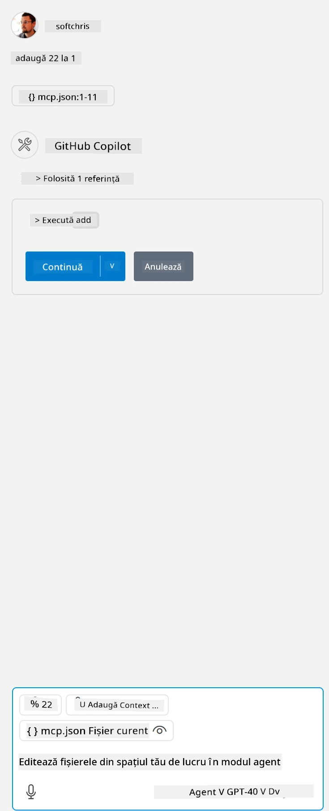

Aceasta corespunde rulării unei comenzi de genul: `node build/index.js`.

- Modifică această intrare a serverului pentru a se potrivi cu locația fișierului tău server sau cu ceea ce este necesar pentru a porni serverul, în funcție de runtime-ul ales și locația serverului.

## Folosește funcționalitățile din server

- Apasă pe pictograma `play`, după ce ai adăugat *mcp.json* în folderul *./vscode*,

    Observă cum pictograma uneltelor se schimbă pentru a crește numărul de unelte disponibile. Pictograma uneltelor se află chiar deasupra câmpului de chat în GitHub Copilot.

## Rulează o unealtă

- Scrie un prompt în fereastra de chat care să corespundă descrierii uneltei tale. De exemplu, pentru a declanșa unealta `add`, scrie ceva de genul „add 3 to 20”.

    Ar trebui să vezi o unealtă prezentată deasupra casetei de text a chatului, indicând să selectezi pentru a rula unealta, așa cum se vede în această imagine:

    

    Selectarea uneltei ar trebui să producă un rezultat numeric care să afișeze „23” dacă promptul tău a fost ca cel menționat anterior.

**Declinare de responsabilitate**:  
Acest document a fost tradus folosind serviciul de traducere AI [Co-op Translator](https://github.com/Azure/co-op-translator). Deși ne străduim pentru acuratețe, vă rugăm să rețineți că traducerile automate pot conține erori sau inexactități. Documentul original în limba sa nativă trebuie considerat sursa autorizată. Pentru informații critice, se recomandă traducerea profesională realizată de un specialist uman. Nu ne asumăm răspunderea pentru eventualele neînțelegeri sau interpretări greșite rezultate din utilizarea acestei traduceri.