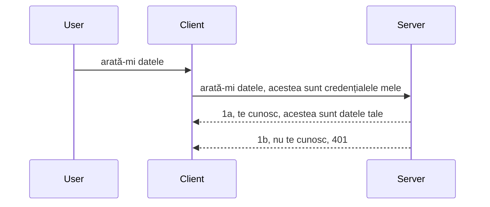

# Autentificare simplă

SDK-urile MCP suportă utilizarea OAuth 2.1 care, să fim cinstiți, este un proces destul de complex ce implică concepte precum server de autentificare, server de resurse, trimiterea de acreditări, obținerea unui cod, schimbarea codului pentru un token de tip bearer până când în cele din urmă poți obține datele resursei tale. Dacă nu ești obișnuit cu OAuth, care este un lucru grozav de implementat, este o idee bună să începi cu un nivel de bază de autentificare și să construiești spre o securitate tot mai bună. De aceea există acest capitol, pentru a te pregăti pentru autentificări mai avansate.

## Autentificare, ce înțelegem prin asta?

Auth este prescurtarea pentru autentificare și autorizare. Ideea este că trebuie să facem două lucruri:

- **Autentificarea**, care este procesul prin care stabilim dacă permitem unei persoane să intre în casa noastră, dacă are dreptul să fie „aici”, adică să aibă acces la serverul nostru de resurse unde trăiesc funcționalitățile MCP Server.
- **Autorizarea**, este procesul de a stabili dacă un utilizator ar trebui să aibă acces la aceste resurse specifice pe care le solicită, de exemplu aceste comenzi sau aceste produse sau dacă are permisiunea să citească conținutul, dar nu să îl șteargă, ca alt exemplu.

## Acreditări: cum spunem sistemului cine suntem

Ei bine, majoritatea dezvoltatorilor web încep să gândească în termeni de a furniza un set de acreditări serverului, de obicei un secret care spune dacă sunt sau nu autorizați să fie aici („Autentificare”). Această acreditare este de obicei o versiune codificată base64 a numelui de utilizator și parolei sau o cheie API ce identifică unic un utilizator specific.

Aceasta implică trimiterea ei printr-un header numit „Authorization”, astfel:

```json
{ "Authorization": "secret123" }
```

Aceasta este de obicei denumită autentificare simplă (basic authentication). Modul cum funcționează fluxul general este următorul:


Acum că înțelegem cum funcționează din punct de vedere al fluxului, cum o implementăm? Ei bine, majoritatea serverelor web au un concept numit middleware, o bucată de cod care rulează ca parte a cererii și care poate verifica acreditările, iar dacă acestea sunt valide poate permite trecerea cererii. Dacă cererea nu are acreditări valide, atunci primești o eroare de autentificare. Să vedem cum poate fi implementat asta:

**Python**

```python
class AuthMiddleware(BaseHTTPMiddleware):
    async def dispatch(self, request, call_next):

        has_header = request.headers.get("Authorization")
        if not has_header:
            print("-> Missing Authorization header!")
            return Response(status_code=401, content="Unauthorized")

        if not valid_token(has_header):
            print("-> Invalid token!")
            return Response(status_code=403, content="Forbidden")

        print("Valid token, proceeding...")
       
        response = await call_next(request)
        # adaugă orice antete personalizate sau modifică răspunsul într-un anumit fel
        return response


starlette_app.add_middleware(CustomHeaderMiddleware)
```

Aici avem:

- Creat un middleware numit `AuthMiddleware` unde metoda sa `dispatch` este invocată de serverul web.
- Adăugat middleware-ul la server-ul web:

    ```python
    starlette_app.add_middleware(AuthMiddleware)
    ```

- Scris logica de validare care verifică dacă header-ul Authorization este prezent și dacă secretul trimis este valid:

    ```python
    has_header = request.headers.get("Authorization")
    if not has_header:
        print("-> Missing Authorization header!")
        return Response(status_code=401, content="Unauthorized")

    if not valid_token(has_header):
        print("-> Invalid token!")
        return Response(status_code=403, content="Forbidden")
    ```

    dacă secretul este prezent și valid, atunci permitem cererii să treacă apelând `call_next` și returnăm răspunsul.

    ```python
    response = await call_next(request)
    # adaugă orice anteturi de client sau modifică răspunsul în vreun fel
    return response
    ```

Cum funcționează este că dacă se face o cerere web către server, middleware-ul va fi invocat și, dat fiind modul său de implementare, fie va permite cererii să treacă, fie va returna o eroare care indică că clientul nu are permisiunea să continue.

**TypeScript**

Aici creăm un middleware cu cadrul popular Express și interceptăm cererea înainte să ajungă la MCP Server. Iată codul pentru asta:

```typescript
function isValid(secret) {
    return secret === "secret123";
}

app.use((req, res, next) => {
    // 1. Antet de autorizare prezent?
    if(!req.headers["Authorization"]) {
        res.status(401).send('Unauthorized');
    }
    
    let token = req.headers["Authorization"];

    // 2. Verifică valabilitatea.
    if(!isValid(token)) {
        res.status(403).send('Forbidden');
    }

   
    console.log('Middleware executed');
    // 3. Transmite cererea către următorul pas din fluxul cererii.
    next();
});
```

În acest cod:

1. Verificăm dacă header-ul Authorization este prezent în primul rând; dacă nu, trimitem o eroare 401.
2. Ne asigurăm că acreditarea/tokenul este valid, dacă nu, trimitem o eroare 403.
3. În cele din urmă, trecem cererea mai departe în pipeline-ul cererii și returnăm resursa solicitată.

## Exercițiu: Implementarea autentificării

Să ne luăm cunoștințele și să încercăm să o implementăm. Iată planul:

Server

- Creăm un server web și o instanță MCP.
- Implementăm un middleware pentru server.

Client

- Trimitem o cerere web, cu acreditare, prin header.

### -1- Crearea unui server web și a unei instanțe MCP

În primul nostru pas, trebuie să creăm instanța serverului web și MCP Server.

**Python**

Aici creăm o instanță MCP Server, creăm o aplicație web starlette și o găzduim cu uvicorn.

```python
# crearea serverului MCP

app = FastMCP(
    name="MCP Resource Server",
    instructions="Resource Server that validates tokens via Authorization Server introspection",
    host=settings["host"],
    port=settings["port"],
    debug=True
)

# crearea aplicației web starlette
starlette_app = app.streamable_http_app()

# servirea aplicației prin uvicorn
async def run(starlette_app):
    import uvicorn
    config = uvicorn.Config(
            starlette_app,
            host=app.settings.host,
            port=app.settings.port,
            log_level=app.settings.log_level.lower(),
        )
    server = uvicorn.Server(config)
    await server.serve()

run(starlette_app)
```

În acest cod:

- Cream MCP Server.
- Construim aplicația web starlette din MCP Server, `app.streamable_http_app()`.
- Găzduim și servim aplicația web folosind uvicorn prin `server.serve()`.

**TypeScript**

Aici creăm o instanță MCP Server.

```typescript
const server = new McpServer({
      name: "example-server",
      version: "1.0.0"
    });

    // ... configurare resurse de server, unelte și prompteri ...
```

Această creare MCP Server trebuie să se întâmple în definiția rutei POST /mcp, așa că să luăm codul de mai sus și să îl mutăm astfel:

```typescript
import express from "express";
import { randomUUID } from "node:crypto";
import { McpServer } from "@modelcontextprotocol/sdk/server/mcp.js";
import { StreamableHTTPServerTransport } from "@modelcontextprotocol/sdk/server/streamableHttp.js";
import { isInitializeRequest } from "@modelcontextprotocol/sdk/types.js"

const app = express();
app.use(express.json());

// Hartă pentru stocarea transporturilor după ID-ul sesiunii
const transports: { [sessionId: string]: StreamableHTTPServerTransport } = {};

// Gestionează cererile POST pentru comunicarea client-server
app.post('/mcp', async (req, res) => {
  // Verifică existența unui ID de sesiune
  const sessionId = req.headers['mcp-session-id'] as string | undefined;
  let transport: StreamableHTTPServerTransport;

  if (sessionId && transports[sessionId]) {
    // Reutilizează transportul existent
    transport = transports[sessionId];
  } else if (!sessionId && isInitializeRequest(req.body)) {
    // Cerere nouă de inițializare
    transport = new StreamableHTTPServerTransport({
      sessionIdGenerator: () => randomUUID(),
      onsessioninitialized: (sessionId) => {
        // Stochează transportul după ID-ul sesiunii
        transports[sessionId] = transport;
      },
      // Protecția împotriva rebinding DNS este dezactivată în mod implicit pentru compatibilitate inversă. Dacă rulezi acest server
      // local, asigură-te că setezi:
      // enableDnsRebindingProtection: true,
      // allowedHosts: ['127.0.0.1'],
    });

    // Curăță transportul când este închis
    transport.onclose = () => {
      if (transport.sessionId) {
        delete transports[transport.sessionId];
      }
    };
    const server = new McpServer({
      name: "example-server",
      version: "1.0.0"
    });

    // ... configurează resursele serverului, uneltele și prompturile ...

    // Conectează-te la serverul MCP
    await server.connect(transport);
  } else {
    // Cerere invalidă
    res.status(400).json({
      jsonrpc: '2.0',
      error: {
        code: -32000,
        message: 'Bad Request: No valid session ID provided',
      },
      id: null,
    });
    return;
  }

  // Gestionează cererea
  await transport.handleRequest(req, res, req.body);
});

// Handler reutilizabil pentru cererile GET și DELETE
const handleSessionRequest = async (req: express.Request, res: express.Response) => {
  const sessionId = req.headers['mcp-session-id'] as string | undefined;
  if (!sessionId || !transports[sessionId]) {
    res.status(400).send('Invalid or missing session ID');
    return;
  }
  
  const transport = transports[sessionId];
  await transport.handleRequest(req, res);
};

// Gestionează cererile GET pentru notificările server-către-client prin SSE
app.get('/mcp', handleSessionRequest);

// Gestionează cererile DELETE pentru terminarea sesiunii
app.delete('/mcp', handleSessionRequest);

app.listen(3000);
```

Acum vezi cum crearea MCP Server a fost mutată în interiorul `app.post("/mcp")`.

Să trecem la pasul următor, crearea middleware-ului pentru a valida acreditările primite.

### -2- Implementarea middleware-ului pentru server

Să trecem la partea de middleware. Aici vom crea un middleware care caută o acreditare în header-ul `Authorization` și o validează. Dacă este acceptabilă, cererea va continua să facă ceea ce trebuie (de exemplu, listarea uneltelor, citirea unei resurse sau orice funcționalitate MCP pe care clientul a solicitat-o).

**Python**

Pentru a crea middleware-ul, trebuie să creăm o clasă care moștenește `BaseHTTPMiddleware`. Sunt două elemente interesante:

- Cererea `request`, de unde citim informațiile din header.
- `call_next`, callback-ul pe care trebuie să îl apelăm dacă clientul a adus o acreditare pe care o acceptăm.

Mai întâi, trebuie să gestionăm cazul în care header-ul `Authorization` lipsește:

```python
has_header = request.headers.get("Authorization")

# nu există un antet, eșuează cu 401, altfel continuă.
if not has_header:
    print("-> Missing Authorization header!")
    return Response(status_code=401, content="Unauthorized")
```

Aici trimitem un mesaj 401 unauthorized deoarece clientul nu reușește autentificarea.

Apoi, dacă o acreditare a fost transmisă, trebuie să-i verificăm validitatea astfel:

```python
 if not valid_token(has_header):
    print("-> Invalid token!")
    return Response(status_code=403, content="Forbidden")
```

Observă cum trimitem un mesaj 403 forbidden mai sus. Să vedem middleware-ul complet de mai jos care implementează tot ce am menționat:

```python
class AuthMiddleware(BaseHTTPMiddleware):
    async def dispatch(self, request, call_next):

        has_header = request.headers.get("Authorization")
        if not has_header:
            print("-> Missing Authorization header!")
            return Response(status_code=401, content="Unauthorized")

        if not valid_token(has_header):
            print("-> Invalid token!")
            return Response(status_code=403, content="Forbidden")

        print("Valid token, proceeding...")
        print(f"-> Received {request.method} {request.url}")
        response = await call_next(request)
        response.headers['Custom'] = 'Example'
        return response

```

Groaznic, dar ce face funcția `valid_token`? Iată-o mai jos:

```python
# NU folosiți pentru producție - îmbunătățiți-l !!
def valid_token(token: str) -> bool:
    # eliminați prefixul "Bearer "
    if token.startswith("Bearer "):
        token = token[7:]
        return token == "secret-token"
    return False
```

Acesta ar trebui desigur îmbunătățit.

IMPORTANT: Nu ar trebui NICIODATĂ să ai secrete ca acesta în cod. Ideal ar fi să obții valoarea pentru comparație dintr-o sursă de date sau de la un IDP (furnizor de servicii de identitate) sau și mai bine, să lași IDP-ul să facă validarea.

**TypeScript**

Pentru a implementa asta în Express, trebuie să apelăm metoda `use` care primește funcții middleware.

Trebuie să:

- Interacționăm cu variabila cererii pentru a verifica acreditarea transmisă în proprietatea `Authorization`.
- Validăm acreditarea și dacă este validă, să lăsăm cererea să continue și solicitarea MCP a clientului să facă ce trebuie (de ex. listare unelte, citire resursă sau orice altceva legat de MCP).

Aici, verificăm dacă header-ul `Authorization` este prezent și dacă nu, oprim cererea să continue:

```typescript
if(!req.headers["authorization"]) {
    res.status(401).send('Unauthorized');
    return;
}
```

Dacă headerul nu este trimis, primești o eroare 401.

Apoi verificăm dacă acreditarea este validă, dacă nu oprim cererea dar cu un mesaj diferit:

```typescript
if(!isValid(token)) {
    res.status(403).send('Forbidden');
    return;
} 
```

Observă cum acum primești eroarea 403.

Iată codul complet:

```typescript
app.use((req, res, next) => {
    console.log('Request received:', req.method, req.url, req.headers);
    console.log('Headers:', req.headers["authorization"]);
    if(!req.headers["authorization"]) {
        res.status(401).send('Unauthorized');
        return;
    }
    
    let token = req.headers["authorization"];

    if(!isValid(token)) {
        res.status(403).send('Forbidden');
        return;
    }  

    console.log('Middleware executed');
    next();
});
```

Am configurat serverul web să accepte un middleware pentru a verifica acreditarea pe care clientul sperăm să ne-o trimită. Dar cum rămâne cu clientul?

### -3- Trimiterea cererii web cu acreditare prin header

Trebuie să ne asigurăm că clientul transmite acreditarea prin header. Deoarece vom folosi un client MCP pentru asta, trebuie să descoperim cum se face.

**Python**

Pentru client, trebuie să transmitem un header cu acreditarea noastră astfel:

```python
# NU codifica valoarea direct în cod, ține-o cel puțin într-o variabilă de mediu sau un depozit mai sigur
token = "secret-token"

async with streamablehttp_client(
        url = f"http://localhost:{port}/mcp",
        headers = {"Authorization": f"Bearer {token}"}
    ) as (
        read_stream,
        write_stream,
        session_callback,
    ):
        async with ClientSession(
            read_stream,
            write_stream
        ) as session:
            await session.initialize()
      
            # TODO, ce dorești să faci în client, de ex. listează unelte, apelează unelte etc.
```

Observă cum populăm proprietatea `headers` astfel: ` headers = {"Authorization": f"Bearer {token}"}`.

**TypeScript**

Putem rezolva asta în doi pași:

1. Populăm un obiect de configurație cu acreditarea noastră.
2. Transmitem obiectul de configurație la transport.

```typescript

// NU codifica valoarea direct așa cum este prezentat aici. Minim, păstreaz-o ca o variabilă de mediu și folosește ceva gen dotenv (în modul dezvoltare).
let token = "secret123"

// definește un obiect de opțiuni pentru transportul clientului
let options: StreamableHTTPClientTransportOptions = {
  sessionId: sessionId,
  requestInit: {
    headers: {
      "Authorization": "secret123"
    }
  }
};

// trece obiectul de opțiuni către transport
async function main() {
   const transport = new StreamableHTTPClientTransport(
      new URL(serverUrl),
      options
   );
```

Aici vezi cum am creat un obiect `options` și am plasat headerele noastre sub proprietatea `requestInit`.

IMPORTANT: Cum îmbunătățim de aici? Ei bine, implementarea curentă are unele probleme. Mai întâi, transmiterea acreditării în acest mod este destul de riscantă decât dacă ai cel puțin HTTPS. Chiar și așa, acreditarea poate fi furată, deci ai nevoie de un sistem în care poți revoca tokenul ușor și să adaugi verificări suplimentare precum de unde în lume vine, dacă cererea este făcută prea des (comportament de bot), în esență, sunt o mulțime de preocupări.

Totuși, trebuie spus că pentru API-uri foarte simple unde nu vrei ca nimeni să-ți apeleze API-ul fără autentificare, ceea ce avem aici este un început bun.

Așadar, să încercăm să întărim puțin securitatea folosind un format standardizat precum JSON Web Token, cunoscut și ca JWT sau token-uri „JOT”.

## JSON Web Token-uri, JWT

Deci, încercăm să îmbunătățim lucrurile față de trimiterea unor acreditări foarte simple. Care sunt îmbunătățirile imediate pe care le obții adoptând JWT?

- **Îmbunătățiri de securitate**. În autentificarea simplă, trimiți numele de utilizator și parola sub forma unui token codificat base64 (sau o cheie API) iar și iar, ceea ce crește riscul. Cu JWT, trimiți numele de utilizator și parola o singură dată și primești un token în schimb, care este de asemenea limitat în timp, adică expiră. JWT îți permite să folosești controlul accesului granulat folosind roluri, scope-uri și permisiuni.
- **Statelessness și scalabilitate**. JWT-urile sunt auto-conținute, poartă toate informațiile despre utilizator și elimină necesitatea de a stoca sesiunea pe server. Tokenurile pot fi validate local.
- **Interoperabilitate și federare**. JWT este elementul central al Open ID Connect și este folosit cu furnizori cunoscuți de identitate precum Entra ID, Google Identity și Auth0. De asemenea, fac posibil Single Sign-On și multe altele, făcându-le de nivel enterprise.
- **Modularitate și flexibilitate**. JWT poate fi folosit și cu API Gateways precum Azure API Management, NGINX și altele. Suportă scenarii de autentificare de utilizator și comunicare server-la-server, inclusiv impersonări și delegări.
- **Performanță și caching**. JWT-urile pot fi cache-uite după decodare, reducând necesitatea de reconstrucții repetate. Acest lucru ajută în special aplicațiile cu trafic mare, crescând prinputerea și reducând încărcarea infrastructurii.
- **Funcționalități avansate**. De asemenea suportă introspecție (verificarea validității pe server) și revocare (invalidează token-ul).

Cu toate aceste beneficii, să vedem cum putem duce implementarea noastră la nivelul următor.

## Transformarea autentificării simple în JWT

Schimbările de nivel înalt de care avem nevoie sunt să:

- **Învățăm să construim un token JWT** și să îl pregătim pentru a fi trimis de la client la server.
- **Validăm un token JWT**, iar dacă este valid, permitem clientului să aibă acces la resursele noastre.
- **Stocăm token-ul în mod securizat**. Cum păstrăm acest token.
- **Protejăm rutele**. Trebuie să protejăm rutele, în cazul nostru trebuie să protejăm rutele și funcționalitățile MCP specifice.
- **Adăugăm token-uri de reîmprospătare**. Asigurăm crearea de tokenuri cu durată scurtă de viață dar și tokenuri de refresh cu durată lungă ce pot fi folosite pentru a obține tokenuri noi după expirare. De asemenea, să asigurăm o rută de refresh și o strategie de rotație.

### -1- Construirea unui token JWT

În primul rând, un token JWT are următoarele părți:

- **header**, algoritmul folosit și tipul tokenului.
- **payload**, revendicări (claims), precum sub (utilizatorul sau entitatea pe care o reprezintă tokenul; în cazul autentificării este, tipic, user id), exp (data expirării) rol (rolul)
- **semnătura**, semnată cu un secret sau o cheie privată.

Pentru asta, trebuie să construim header-ul, payload-ul și tokenul codificat.

**Python**

```python

import jwt
import jwt
from jwt.exceptions import ExpiredSignatureError, InvalidTokenError
import datetime

# Cheie secretă folosită pentru a semna JWT-ul
secret_key = 'your-secret-key'

header = {
    "alg": "HS256",
    "typ": "JWT"
}

# informațiile utilizatorului și revendicările acestuia și timpul de expirare
payload = {
    "sub": "1234567890",               # Subiect (ID-ul utilizatorului)
    "name": "User Userson",                # Revendicare personalizată
    "admin": True,                     # Revendicare personalizată
    "iat": datetime.datetime.utcnow(),# Emis la
    "exp": datetime.datetime.utcnow() + datetime.timedelta(hours=1)  # Expirare
}

# codifică-l
encoded_jwt = jwt.encode(payload, secret_key, algorithm="HS256", headers=header)
```

În codul de mai sus am:

- Definit un header folosind algoritmul HS256 și tipul JWT.
- Construim un payload care conține subiectul sau id-ul utilizatorului, un nume de utilizator, un rol, când a fost emis și când expiră, implementând astfel aspectul limitat în timp pe care l-am menționat anterior.

**TypeScript**

Aici vom avea nevoie de unele dependențe care ne vor ajuta să construim tokenul JWT.

Dependențe

```sh

npm install jsonwebtoken
npm install --save-dev @types/jsonwebtoken
```

Acum că avem asta stabilit, să creăm header-ul, payload-ul și, prin acestea, tokenul codificat.

```typescript
import jwt from 'jsonwebtoken';

const secretKey = 'your-secret-key'; // Folosiți variabilele de mediu în producție

// Definiți payload-ul
const payload = {
  sub: '1234567890',
  name: 'User usersson',
  admin: true,
  iat: Math.floor(Date.now() / 1000), // Emis la
  exp: Math.floor(Date.now() / 1000) + 60 * 60 // Expiră în 1 oră
};

// Definiți antetul (opțional, jsonwebtoken setează valorile implicite)
const header = {
  alg: 'HS256',
  typ: 'JWT'
};

// Creați tokenul
const token = jwt.sign(payload, secretKey, {
  algorithm: 'HS256',
  header: header
});

console.log('JWT:', token);
```

Acest token este:

Semnat folosind HS256
Valabil pentru 1 oră
Include revendicări precum sub, name, admin, iat, exp.

### -2- Validarea unui token

De asemenea, va trebui să validăm tokenul, acest lucru trebuie făcut pe server pentru a ne asigura că ceea ce clientul ne trimite este într-adevăr valid. Sunt multe verificări pe care ar trebui să le facem aici, de la validarea structurii până la verificarea valabilității. E bine să adaugi și verificări suplimentare pentru a te asigura că utilizatorul există în sistemul tău și altele.

Pentru a valida un token, trebuie să îl decodificăm pentru a-l putea citi și apoi să începem să îi verificăm valabilitatea:

**Python**

```python

# Decodează și verifică JWT-ul
try:
    decoded = jwt.decode(token, secret_key, algorithms=["HS256"])
    print("✅ Token is valid.")
    print("Decoded claims:")
    for key, value in decoded.items():
        print(f"  {key}: {value}")
except ExpiredSignatureError:
    print("❌ Token has expired.")
except InvalidTokenError as e:
    print(f"❌ Invalid token: {e}")

```

În acest cod, apelăm `jwt.decode` folosind tokenul, cheia secretă și algoritmul ales ca input. Observă cum folosim un bloc try-except deoarece o validare eșuată generează o eroare.

**TypeScript**

Aici trebuie să apelăm `jwt.verify` pentru a obține o versiune decodificată a tokenului pe care o putem analiza mai departe. Dacă acest apel eșuează, înseamnă că structura tokenului este incorectă sau nu mai este valid.

```typescript

try {
  const decoded = jwt.verify(token, secretKey);
  console.log('Decoded Payload:', decoded);
} catch (err) {
  console.error('Token verification failed:', err);
}
```

NOTĂ: după cum am menționat anterior, ar trebui să facem verificări suplimentare pentru a ne asigura că acest token indică un utilizator din sistemul nostru și să verificăm că utilizatorul are drepturile pe care susține că le are.
Next, să analizăm controlul accesului bazat pe roluri, cunoscut și ca RBAC.

## Adăugarea controlului accesului bazat pe roluri

Ideea este că vrem să exprimăm că roluri diferite au permisiuni diferite. De exemplu, presupunem că un admin poate face orice și că un utilizator normal poate citi/scrie, iar un oaspete poate doar citi. Prin urmare, iată câteva niveluri posibile de permisiuni:

- Admin.Write 
- User.Read
- Guest.Read

Să vedem cum putem implementa un astfel de control cu middleware. Middleware-urile pot fi adăugate per rută, precum și pentru toate rutele.

**Python**

```python
from starlette.middleware.base import BaseHTTPMiddleware
from starlette.responses import JSONResponse
import jwt

# NU păstra secretul în cod, așa cum este, acest lucru este doar în scop demonstrativ. Citește-l dintr-un loc sigur.
SECRET_KEY = "your-secret-key" # pune asta într-o variabilă de mediu
REQUIRED_PERMISSION = "User.Read"

class JWTPermissionMiddleware(BaseHTTPMiddleware):
    async def dispatch(self, request, call_next):
        auth_header = request.headers.get("Authorization")
        if not auth_header or not auth_header.startswith("Bearer "):
            return JSONResponse({"error": "Missing or invalid Authorization header"}, status_code=401)

        token = auth_header.split(" ")[1]
        try:
            decoded = jwt.decode(token, SECRET_KEY, algorithms=["HS256"])
        except jwt.ExpiredSignatureError:
            return JSONResponse({"error": "Token expired"}, status_code=401)
        except jwt.InvalidTokenError:
            return JSONResponse({"error": "Invalid token"}, status_code=401)

        permissions = decoded.get("permissions", [])
        if REQUIRED_PERMISSION not in permissions:
            return JSONResponse({"error": "Permission denied"}, status_code=403)

        request.state.user = decoded
        return await call_next(request)


```

Există câteva moduri diferite de a adăuga middleware-ul, ca mai jos:

```python

# Alt 1: adaugă middleware în timp ce construiești aplicația starlette
middleware = [
    Middleware(JWTPermissionMiddleware)
]

app = Starlette(routes=routes, middleware=middleware)

# Alt 2: adaugă middleware după ce aplicația starlette este deja construită
starlette_app.add_middleware(JWTPermissionMiddleware)

# Alt 3: adaugă middleware pe fiecare rută
routes = [
    Route(
        "/mcp",
        endpoint=..., # handler
        middleware=[Middleware(JWTPermissionMiddleware)]
    )
]
```

**TypeScript**

Putem folosi `app.use` și un middleware care se va rula pentru toate cererile.

```typescript
app.use((req, res, next) => {
    console.log('Request received:', req.method, req.url, req.headers);
    console.log('Headers:', req.headers["authorization"]);

    // 1. Verifică dacă antetul de autorizare a fost trimis

    if(!req.headers["authorization"]) {
        res.status(401).send('Unauthorized');
        return;
    }
    
    let token = req.headers["authorization"];

    // 2. Verifică dacă token-ul este valid
    if(!isValid(token)) {
        res.status(403).send('Forbidden');
        return;
    }  

    // 3. Verifică dacă utilizatorul token-ului există în sistemul nostru
    if(!isExistingUser(token)) {
        res.status(403).send('Forbidden');
        console.log("User does not exist");
        return;
    }
    console.log("User exists");

    // 4. Verifică dacă token-ul are permisiunile corecte
    if(!hasScopes(token, ["User.Read"])){
        res.status(403).send('Forbidden - insufficient scopes');
    }

    console.log("User has required scopes");

    console.log('Middleware executed');
    next();
});

```

Sunt destul de multe lucruri pe care le putem lăsa middleware-ului nostru și pe care middleware-ul NOSTRU AR TREBUI să le facă, respectiv:

1. Verifică dacă este prezent header-ul de autorizare
2. Verifică dacă tokenul este valid, apelăm `isValid`, care este o metodă pe care am scris-o pentru a verifica integritatea și validitatea tokenului JWT.
3. Verifică dacă utilizatorul există în sistemul nostru, ar trebui să verificăm asta.

   ```typescript
    // utilizatori în baza de date
   const users = [
     "user1",
     "User usersson",
   ]

   function isExistingUser(token) {
     let decodedToken = verifyToken(token);

     // TODO, verifică dacă utilizatorul există în baza de date
     return users.includes(decodedToken?.name || "");
   }
   ```

   Mai sus, am creat o listă foarte simplă `users`, care evident ar trebui să fie într-o bază de date.

4. În plus, ar trebui să verificăm de asemenea dacă tokenul are permisiunile corecte.

   ```typescript
   if(!hasScopes(token, ["User.Read"])){
        res.status(403).send('Forbidden - insufficient scopes');
   }
   ```

   În acest cod din middleware, verificăm că tokenul conține permisiunea User.Read, dacă nu trimitem o eroare 403. Mai jos este metoda helper `hasScopes`.

   ```typescript
   function hasScopes(scope: string, requiredScopes: string[]) {
     let decodedToken = verifyToken(scope);
    return requiredScopes.every(scope => decodedToken?.scopes.includes(scope));
  }
   ```

Have a think which additional checks you should be doing, but these are the absolute minimum of checks you should be doing.

Using Express as a web framework is a common choice. There are helpers library when you use JWT so you can write less code.

- `express-jwt`, helper library that provides a middleware that helps decode your token.
- `express-jwt-permissions`, this provides a middleware `guard` that helps check if a certain permission is on the token.

Here's what these libraries can look like when used:

```typescript
const express = require('express');
const jwt = require('express-jwt');
const guard = require('express-jwt-permissions')();

const app = express();
const secretKey = 'your-secret-key'; // put this in env variable

// Decode JWT and attach to req.user
app.use(jwt({ secret: secretKey, algorithms: ['HS256'] }));

// Check for User.Read permission
app.use(guard.check('User.Read'));

// multiple permissions
// app.use(guard.check(['User.Read', 'Admin.Access']));

app.get('/protected', (req, res) => {
  res.json({ message: `Welcome ${req.user.name}` });
});

// Error handler
app.use((err, req, res, next) => {
  if (err.code === 'permission_denied') {
    return res.status(403).send('Forbidden');
  }
  next(err);
});

```

Acum ați văzut cum middleware-ul poate fi folosit atât pentru autentificare cât și pentru autorizare, dar ce zicem despre MCP, schimbă oare modul în care facem autentificarea? Să aflăm în secțiunea următoare.

### -3- Adaugă RBAC la MCP

Până acum ați văzut cum puteți adăuga RBAC prin middleware, însă pentru MCP nu există o manieră ușoară de a adăuga RBAC per funcționalitate MCP, atunci ce facem? Ei bine, trebuie pur și simplu să adăugăm cod ca acesta care verifică în acest caz dacă clientul are drepturile de a apela un anumit tool:

Aveți câteva opțiuni diferite despre cum să realizați RBAC per funcționalitate, iată câteva:

- Adăugați o verificare pentru fiecare tool, resursă, prompt unde trebuie să verificați nivelul de permisiune.

   **python**

   ```python
   @tool()
   def delete_product(id: int):
      try:
          check_permissions(role="Admin.Write", request)
      catch:
        pass # clientul a eșuat autorizarea, aruncă eroare de autorizare
   ```

   **typescript**

   ```typescript
   server.registerTool(
    "delete-product",
    {
      title: Delete a product",
      description: "Deletes a product",
      inputSchema: { id: z.number() }
    },
    async ({ id }) => {
      
      try {
        checkPermissions("Admin.Write", request);
        // de făcut, trimite id la productService și intrare la distanță
      } catch(Exception e) {
        console.log("Authorization error, you're not allowed");  
      }

      return {
        content: [{ type: "text", text: `Deletected product with id ${id}` }]
      };
    }
   );
   ```


- Folosiți o abordare server avansată și handler-ele de cereri astfel încât să minimizați locurile unde este necesară verificarea.

   **Python**

   ```python
   
   tool_permission = {
      "create_product": ["User.Write", "Admin.Write"],
      "delete_product": ["Admin.Write"]
   }

   def has_permission(user_permissions, required_permissions) -> bool:
      # user_permissions: lista permisiunilor pe care le are utilizatorul
      # required_permissions: lista permisiunilor necesare pentru unealtă
      return any(perm in user_permissions for perm in required_permissions)

   @server.call_tool()
   async def handle_call_tool(
     name: str, arguments: dict[str, str] | None
   ) -> list[types.TextContent]:
    # Presupune că request.user.permissions este o listă de permisiuni pentru utilizator
     user_permissions = request.user.permissions
     required_permissions = tool_permission.get(name, [])
     if not has_permission(user_permissions, required_permissions):
        # Aruncă eroarea "Nu aveți permisiunea să apelați unealta {name}"
        raise Exception(f"You don't have permission to call tool {name}")
     # continuă și apelează unealta
     # ...
   ```   
   

   **TypeScript**

   ```typescript
   function hasPermission(userPermissions: string[], requiredPermissions: string[]): boolean {
       if (!Array.isArray(userPermissions) || !Array.isArray(requiredPermissions)) return false;
       // Returnează adevărat dacă utilizatorul are cel puțin o permisiune necesară
       
       return requiredPermissions.some(perm => userPermissions.includes(perm));
   }
  
   server.setRequestHandler(CallToolRequestSchema, async (request) => {
      const { params: { name } } = request;
  
      let permissions = request.user.permissions;
  
      if (!hasPermission(permissions, toolPermissions[name])) {
         return new Error(`You don't have permission to call ${name}`);
      }
  
      // continuă..
   });
   ```

   Atenție, va trebui să vă asigurați că middleware-ul atribuie un token decodat proprietății user din request astfel codul de mai sus devine simplu.

### Concluzie

Acum că am discutat cum să adăugăm suport pentru RBAC în general și pentru MCP în mod particular, este timpul să încercați să implementați securitatea pe cont propriu pentru a vă asigura că ați înțeles conceptele prezentate.

## Tema 1: Construiește un server mcp și un client mcp folosind autentificare de bază

Aici veți folosi ce ați învățat cu privire la trimiterea credențialelor prin header-e.

## Soluția 1

[Soluția 1](./code/basic/README.md)

## Tema 2: Actualizează soluția din Tema 1 pentru a folosi JWT

Ia prima soluție, dar de data aceasta să o îmbunătățim.

În loc să folosim Basic Auth, să folosim JWT.

## Soluția 2

[Soluția 2](./solution/jwt-solution/README.md)

## Provocare

Adăugați RBAC per tool așa cum am descris în secțiunea "Add RBAC to MCP".

## Rezumat

Sperăm că ați învățat multe în acest capitol, de la lipsa totală a securității, la securitate de bază, la JWT și cum poate fi adăugat în MCP.

Am construit o bază solidă cu JWT-uri personalizate, dar pe măsură ce ne extindem, ne îndreptăm spre un model de identitate bazat pe standarde. Adoptarea unui IdP precum Entra sau Keycloak ne permite să externalizăm emiterea, validarea și gestionarea ciclului de viață al tokenului către o platformă de încredere — eliberându-ne să ne concentrăm pe logica aplicației și experiența utilizatorului.

Pentru asta, avem un capitol mai [avansat despre Entra](../../05-AdvancedTopics/mcp-security-entra/README.md)

## Ce urmează

- Următorul: [Configurarea gazdelor MCP](../12-mcp-hosts/README.md)

---

<!-- CO-OP TRANSLATOR DISCLAIMER START -->
**Declinare de responsabilitate**:
Acest document a fost tradus folosind serviciul de traducere AI [Co-op Translator](https://github.com/Azure/co-op-translator). Deși ne străduim pentru acuratețe, vă rugăm să rețineți că traducerile automate pot conține erori sau inexactități. Documentul original, în limba sa nativă, trebuie considerat sursa autorizată. Pentru informații critice, se recomandă traducerea profesională realizată de un specialist uman. Nu ne asumăm răspunderea pentru eventuale neînțelegeri sau interpretări greșite rezultate din utilizarea acestei traduceri.
<!-- CO-OP TRANSLATOR DISCLAIMER END -->