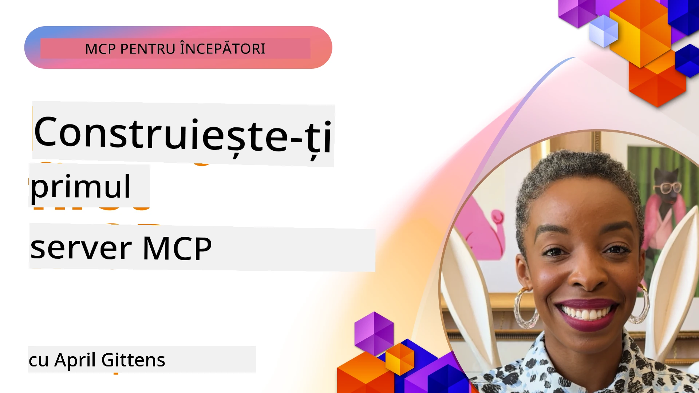

## Începutul  

_(Dă clic pe imaginea de mai sus pentru a viziona videoclipul acestei lecții)_

Această secțiune este formată din mai multe lecții:

- **1 Primul tău server**, în această primă lecție vei învăța cum să creezi primul tău server și să-l inspeți cu unelte de inspector, o metodă valoroasă de a testa și depana serverul tău, [la lecție](01-first-server/README.md)

- **2 Client**, în această lecție vei învăța cum să scrii un client care se poate conecta la serverul tău, [la lecție](02-client/README.md)

- **3 Client cu LLM**, o metodă și mai bună de a scrie un client este adăugând un LLM astfel încât să poată „negocia” cu serverul tău ce trebuie făcut, [la lecție](03-llm-client/README.md)

- **4 Consumarea unui server cu modul GitHub Copilot Agent în Visual Studio Code**. Aici, analizăm rularea MCP Serverului din Visual Studio Code, [la lecție](04-vscode/README.md)

- **5 Server de transport stdio** stdio transport este standardul recomandat pentru comunicarea locală între server MCP și client, oferind o comunicație sigură bazată pe subprocese cu izolare integrată a proceselor [la lecție](05-stdio-server/README.md)

- **6 Streaming HTTP cu MCP (HTTP Streamingabil)**. Află despre transportul modern HTTP streaming (abordarea recomandată pentru serverele MCP remote conform [MCP Specification 2025-11-25](https://spec.modelcontextprotocol.io/specification/2025-11-25/basic/transports/#streamable-http)), notificări de progres și cum să implementezi servere și clienți MCP scalabili, în timp real, folosind HTTP Streamingabil. [la lecție](06-http-streaming/README.md)

- **7 Utilizarea AI Toolkit pentru VSCode** pentru a consuma și testa clienții și serverele MCP [la lecție](07-aitk/README.md)

- **8 Testare**. Ne concentrăm aici în special pe cum putem testa serverul și clientul în moduri diferite, [la lecție](08-testing/README.md)

- **9 Implementare**. Acest capitol analizează diferite metode de a implementa soluțiile MCP, [la lecție](09-deployment/README.md)

- **10 Utilizare avansată a serverului**. Acest capitol acoperă utilizarea avansată a serverului, [la lecție](./10-advanced/README.md)

- **11 Autentificare**. Acest capitol tratează cum să adaugi autentificare simplă, de la Basic Auth la utilizarea JWT și RBAC. Se recomandă să începi de aici și apoi să consulți Subiectele Avansate în Capitolul 5 și să aplici întăriri suplimentare de securitate prin recomandările din Capitolul 2, [la lecție](./11-simple-auth/README.md)

- **12 Hosturi MCP**. Configurează și folosește clienții populari MCP host, inclusiv Claude Desktop, Cursor, Cline și Windsurf. Învață tipuri de transport și depanare, [la lecție](./12-mcp-hosts/README.md)

- **13 Inspector MCP**. Depanează și testează serverele MCP interactiv folosind instrumentul MCP Inspector. Învață să identifici probleme, resurse și mesaje de protocol, [la lecție](./13-mcp-inspector/README.md)

Model Context Protocol (MCP) este un protocol deschis care standardizează modul în care aplicațiile oferă context modelelor LLM. Gândește-te la MCP ca la un port USB-C pentru aplicațiile AI - oferă o modalitate standardizată de a conecta modelele AI la diferite surse de date și unelte.

## Obiective de învățare

La finalul acestei lecții, vei putea:

- Să configurezi medii de dezvoltare pentru MCP în C#, Java, Python, TypeScript și JavaScript
- Să construiești și să implementezi servere MCP de bază cu funcționalități personalizate (resurse, prompturi și unelte)
- Să creezi aplicații host care se conectează la servere MCP
- Să testezi și să depanezi implementările MCP
- Să înțelegi provocările comune ale configurării și soluțiile lor
- Să conectezi implementările MCP la servicii populare LLM

## Configurarea mediului tău MCP

Înainte de a începe să lucrezi cu MCP, este important să-ți pregătești mediul de dezvoltare și să înțelegi fluxul de lucru de bază. Această secțiune te va ghida prin pașii inițiali de configurare pentru a asigura un început fără probleme cu MCP.

### Cerințe preliminare

Înainte de a începe dezvoltarea MCP, asigură-te că ai:

- **Mediu de dezvoltare**: pentru limbajul ales (C#, Java, Python, TypeScript sau JavaScript)
- **IDE/Editor**: Visual Studio, Visual Studio Code, IntelliJ, Eclipse, PyCharm sau orice editor modern de cod
- **Manageri de pachete**: NuGet, Maven/Gradle, pip sau npm/yarn
- **Chei API**: pentru orice servicii AI pe care intenționezi să le folosești în aplicațiile host

### SDK-uri oficiale

În capitolele următoare vei vedea soluții construite folosind Python, TypeScript, Java și .NET. Iată toate SDK-urile oficiale suportate.

MCP oferă SDK-uri oficiale pentru mai multe limbaje (aliniate cu [MCP Specification 2025-11-25](https://spec.modelcontextprotocol.io/specification/2025-11-25/)):
- [SDK C#](https://github.com/modelcontextprotocol/csharp-sdk) - întreținut în colaborare cu Microsoft
- [SDK Java](https://github.com/modelcontextprotocol/java-sdk) - întreținut în colaborare cu Spring AI
- [SDK TypeScript](https://github.com/modelcontextprotocol/typescript-sdk) - implementarea oficială TypeScript
- [SDK Python](https://github.com/modelcontextprotocol/python-sdk) - implementarea oficială Python (FastMCP)
- [SDK Kotlin](https://github.com/modelcontextprotocol/kotlin-sdk) - implementarea oficială Kotlin
- [SDK Swift](https://github.com/modelcontextprotocol/swift-sdk) - întreținut în colaborare cu Loopwork AI
- [SDK Rust](https://github.com/modelcontextprotocol/rust-sdk) - implementarea oficială Rust
- [SDK Go](https://github.com/modelcontextprotocol/go-sdk) - implementarea oficială Go

## Concluzii importante

- Configurarea unui mediu de dezvoltare MCP este simplă folosind SDK-uri specifice limbajului
- Construirea serverelor MCP implică crearea și înregistrarea de unelte cu scheme clare
- Clienții MCP se conectează la servere și modele pentru a valorifica capabilități extinse
- Testarea și depanarea sunt esențiale pentru implementări MCP fiabile
- Opțiunile de implementare variază de la dezvoltare locală până la soluții cloud

## Practică

Avem un set de exemple care completează exercițiile pe care le vei vedea în toate capitolele din această secțiune. În plus, fiecare capitol are propriile exerciții și teme

- [Calculator Java](./samples/java/calculator/README.md)
- [Calculator .Net](../../../03-GettingStarted/samples/csharp)
- [Calculator JavaScript](./samples/javascript/README.md)
- [Calculator TypeScript](./samples/typescript/README.md)
- [Calculator Python](../../../03-GettingStarted/samples/python)

## Resurse suplimentare

- [Construiește Agenti folosind Model Context Protocol pe Azure](https://learn.microsoft.com/azure/developer/ai/intro-agents-mcp)
- [MCP Remote cu Azure Container Apps (Node.js/TypeScript/JavaScript)](https://learn.microsoft.com/samples/azure-samples/mcp-container-ts/mcp-container-ts/)
- [Agent MCP OpenAI .NET](https://learn.microsoft.com/samples/azure-samples/openai-mcp-agent-dotnet/openai-mcp-agent-dotnet/)

## Ce urmează

Începe cu prima lecție: [Crearea primului tău server MCP](01-first-server/README.md)

După ce ai terminat acest modul, continuă la: [Modulul 4: Implementare practică](../04-PracticalImplementation/README.md)

---

<!-- CO-OP TRANSLATOR DISCLAIMER START -->
**Declinare de responsabilitate**:
Acest document a fost tradus folosind serviciul de traducere AI [Co-op Translator](https://github.com/Azure/co-op-translator). Deși ne străduim pentru acuratețe, vă rugăm să rețineți că traducerile automate pot conține erori sau inexactități. Documentul original în limba sa nativă trebuie considerat sursa autorizată. Pentru informații critice, se recomandă traducerea profesională realizată de un specialist uman. Nu ne asumăm responsabilitatea pentru eventualele neînțelegeri sau interpretări eronate care pot apărea în urma utilizării acestei traduceri.
<!-- CO-OP TRANSLATOR DISCLAIMER END -->