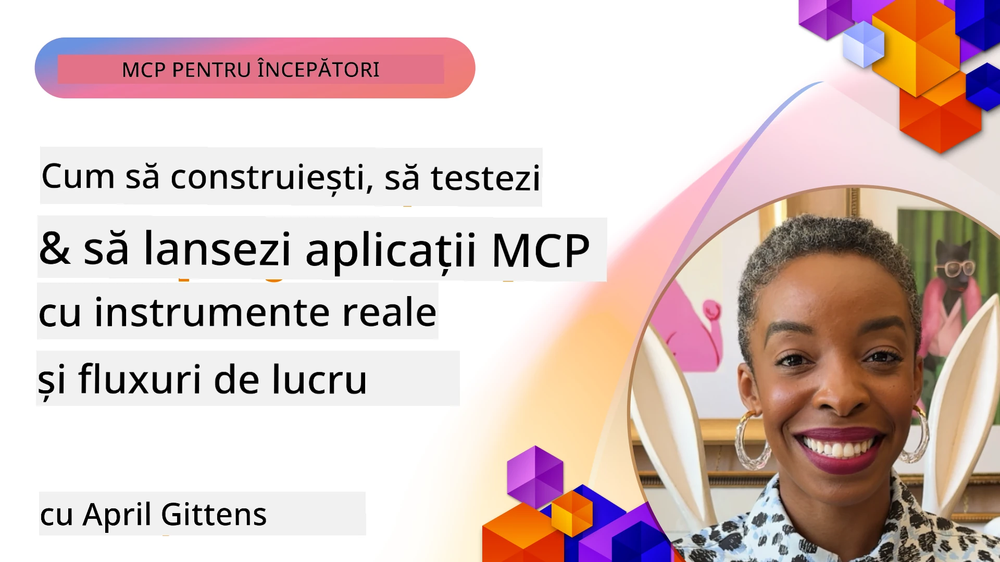
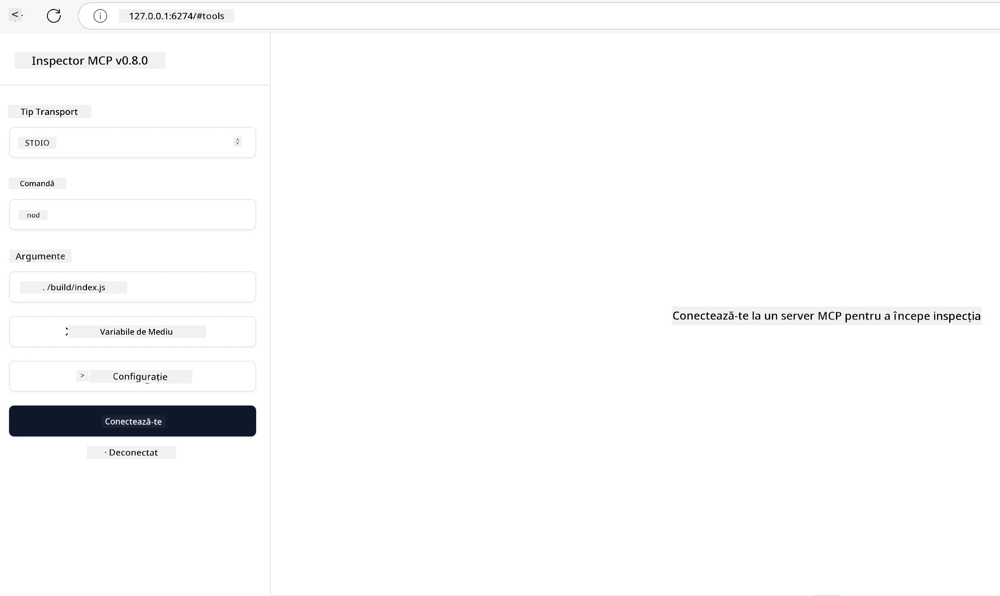

# Implementare practică

[](https://youtu.be/vCN9-mKBDfQ)

_(Faceți clic pe imaginea de mai sus pentru a viziona videoclipul acestei lecții)_

Implementarea practică este locul unde puterea Model Context Protocol (MCP) devine tangibilă. Deși înțelegerea teoriei și arhitecturii din spatele MCP este importantă, adevărata valoare apare atunci când aplici aceste concepte pentru a construi, testa și implementa soluții care rezolvă probleme reale. Acest capitol face legătura între cunoașterea conceptuală și dezvoltarea practică, ghidându-vă prin procesul de aducere la viață a aplicațiilor bazate pe MCP.

Indiferent dacă dezvoltați asistenți inteligenți, integrați AI în fluxurile de lucru ale afacerii sau construiți unelte personalizate pentru procesarea datelor, MCP oferă o bază flexibilă. Design-ul său independent de limbaj și SDK-urile oficiale pentru limbaje de programare populare îl fac accesibil unui spectru larg de dezvoltatori. Folosind aceste SDK-uri, puteți prototipa rapid, itera și scala soluțiile pe diferite platforme și medii.

În secțiunile următoare, veți găsi exemple practice, cod exemplu și strategii de implementare care demonstrează cum să implementați MCP în C#, Java cu Spring, TypeScript, JavaScript și Python. De asemenea, veți învăța cum să depanați și să testați serverele MCP, să gestionați API-urile și să implementați soluții în cloud folosind Azure. Aceste resurse practice sunt concepute pentru a accelera învățarea și pentru a vă ajuta să construiți cu încredere aplicații MCP robuste, pregătite pentru producție.

## Prezentare generală

Această lecție se concentrează pe aspectele practice ale implementării MCP în mai multe limbaje de programare. Vom explora cum să folosiți SDK-urile MCP în C#, Java cu Spring, TypeScript, JavaScript și Python pentru a construi aplicații robuste, a depana și testa servere MCP și a crea resurse reutilizabile, prompturi și unelte.

## Obiective de învățare

La finalul acestei lecții, veți putea:

- Implementa soluții MCP folosind SDK-urile oficiale în diferite limbaje de programare
- Depana și testa servere MCP sistematic
- Crea și utiliza funcționalități de server (Resurse, Prompturi și Unelte)
- Proiecta fluxuri de lucru MCP eficiente pentru sarcini complexe
- Optimiza implementările MCP pentru performanță și fiabilitate

## Resurse SDK oficiale

Model Context Protocol oferă SDK-uri oficiale pentru mai multe limbaje (aliniate cu [Specificația MCP 2025-11-25](https://spec.modelcontextprotocol.io/specification/2025-11-25/)):

- [C# SDK](https://github.com/modelcontextprotocol/csharp-sdk)
- [Java cu Spring SDK](https://github.com/modelcontextprotocol/java-sdk) **Notă:** necesită dependență de [Project Reactor](https://projectreactor.io). (Vezi [discuția issue 246](https://github.com/orgs/modelcontextprotocol/discussions/246).)
- [TypeScript SDK](https://github.com/modelcontextprotocol/typescript-sdk)
- [Python SDK](https://github.com/modelcontextprotocol/python-sdk)
- [Kotlin SDK](https://github.com/modelcontextprotocol/kotlin-sdk)
- [Go SDK](https://github.com/modelcontextprotocol/go-sdk)

## Lucrul cu SDK-urile MCP

Această secțiune oferă exemple practice de implementare MCP în mai multe limbaje de programare. Puteți găsi cod exemplu în directorul `samples` organizat după limbaj.

### Exemple disponibile

Repository-ul include [implementări exemplu](../../../04-PracticalImplementation/samples) în următoarele limbaje:

- [C#](./samples/csharp/README.md)
- [Java cu Spring](./samples/java/containerapp/README.md)
- [TypeScript](./samples/typescript/README.md)
- [JavaScript](./samples/javascript/README.md)
- [Python](./samples/python/README.md)

Fiecare exemplu demonstrează concepte și tipare cheie MCP pentru limbajul și ecosistemul specific.

### Ghiduri practice

Ghiduri suplimentare pentru implementarea practică MCP:

- [Paginare și seturi mari de rezultate](./pagination/README.md) - Gestionarea paginării bazate pe cursor pentru unelte, resurse și seturi mari de date

## Funcționalități principale de server

Serverele MCP pot implementa orice combinație dintre aceste funcționalități:

### Resurse

Resursele oferă context și date pentru utilizator sau modelul AI:

- Repozitoare de documente
- Baze de cunoștințe
- Surse de date structurate
- Sisteme de fișiere

### Prompturi

Prompturile sunt mesaje șablon și fluxuri de lucru pentru utilizatori:

- Șabloane predefinite de conversație
- Modele de interacțiune ghidate
- Structuri specializate de dialog

### Unelte

Uneltele sunt funcții pe care modelul AI le poate executa:

- Utilitare pentru procesarea datelor
- Integrări API externe
- Capacități computaționale
- Funcționalitate de căutare

## Implementări exemple: Implementare C#

Repository-ul oficial C# SDK conține mai multe implementări exemplu care demonstrează diferite aspecte MCP:

- **Client MCP de bază**: Exemplu simplu care arată cum să creați un client MCP și să apelați unelte
- **Server MCP de bază**: Implementare minimă de server cu înregistrare simplă pe unelte
- **Server MCP avansat**: Server complet cu înregistrare unelte, autentificare și gestionare erori
- **Integrare ASP.NET**: Exemple de integrare cu ASP.NET Core
- **Tipare de implementare unelte**: Diverse tipare pentru implementarea uneltelor cu niveluri diferite de complexitate

SDK-ul MCP C# este în preview și API-urile pot suferi modificări. Vom actualiza continuu acest blog pe măsură ce SDK-ul evoluează.

### Funcționalități cheie

- [C# MCP Nuget ModelContextProtocol](https://www.nuget.org/packages/ModelContextProtocol)
- Construirea [primului server MCP](https://devblogs.microsoft.com/dotnet/build-a-model-context-protocol-mcp-server-in-csharp/).

Pentru implementări complete în C#, vizitați [repository-ul oficial de exemple C# SDK](https://github.com/modelcontextprotocol/csharp-sdk)

## Exemplu de implementare: Implementare Java cu Spring

SDK-ul Java cu Spring oferă opțiuni robuste pentru implementarea MCP cu funcționalități de nivel enterprise.

### Funcționalități cheie

- Integrare Spring Framework
- Tipuri puternice sigure
- Suport pentru programare reactivă
- Gestionare completă a erorilor

Pentru un exemplu complet de implementare Java cu Spring, vedeți [exemplul Java cu Spring](samples/java/containerapp/README.md) din directorul de exemple.

## Exemplu de implementare: Implementare JavaScript

SDK-ul JavaScript oferă o abordare ușoară și flexibilă pentru implementarea MCP.

### Funcționalități cheie

- Suport Node.js și browser
- API bazat pe Promisiuni
- Integrare ușoară cu Express și alte cadre
- Suport WebSocket pentru streaming

Pentru un exemplu complet de implementare JavaScript, vedeți [exemplul JavaScript](samples/javascript/README.md) din directorul de exemple.

## Exemplu de implementare: Implementare Python

SDK-ul Python oferă o abordare Pythonică pentru implementarea MCP cu integrări excelente pentru framework-uri ML.

### Funcționalități cheie

- Suport async/await cu asyncio
- Integrare FastAPI
- Înregistrare simplă a uneltelor
- Integrare nativă cu biblioteci ML populare

Pentru un exemplu complet de implementare Python, vedeți [exemplul Python](samples/python/README.md) din directorul de exemple.

## Managementul API-urilor

Azure API Management este o soluție excelentă pentru securizarea serverelor MCP. Ideea este să puneți o instanță Azure API Management în fața serverului MCP și să îi lăsați să gestioneze funcționalități pe care probabil doriți să le aveți, cum ar fi:

- limitarea ratei
- gestionarea token-urilor
- monitorizarea
- echilibrarea încărcării
- securitatea

### Exemplu Azure

Iată un exemplu Azure care face exact asta, adică [crearea unui server MCP și securizarea lui cu Azure API Management](https://github.com/Azure-Samples/remote-mcp-apim-functions-python).

Vezi cum are loc fluxul de autorizare în imaginea de mai jos:


În imaginea precedentă, are loc următoarele:

- Autentificarea/Autorizarea are loc folosind Microsoft Entra.
- Azure API Management acționează ca un gateway și folosește politici pentru a direcționa și gestiona traficul.
- Azure Monitor înregistrează toate cererile pentru analize ulterioare.

#### Fluxul de autorizare

Să privim mai în detaliu fluxul de autorizare:


#### Specificația autorizării MCP

Aflați mai multe despre [specificația autorizării MCP](https://spec.modelcontextprotocol.io/specification/2025-11-25/basic/authorization/)

## Implementați un server MCP remote pe Azure

Să vedem dacă putem implementa exemplul menționat anterior:

1. Clonați repo-ul

    ```bash
    git clone https://github.com/Azure-Samples/remote-mcp-apim-functions-python.git
    cd remote-mcp-apim-functions-python
    ```

1. Înregistrați provider-ul de resurse `Microsoft.App`.

   - Dacă folosiți Azure CLI, rulați `az provider register --namespace Microsoft.App --wait`.
   - Dacă folosiți Azure PowerShell, rulați `Register-AzResourceProvider -ProviderNamespace Microsoft.App`. Apoi rulați `(Get-AzResourceProvider -ProviderNamespace Microsoft.App).RegistrationState` după un timp pentru a verifica dacă înregistrarea s-a finalizat.

1. Rulați această comandă [azd](https://aka.ms/azd) pentru a provisiona serviciul de management API, aplicația funcțională (cu cod) și toate celelalte resurse Azure necesare

    ```shell
    azd up
    ```

    Această comandă ar trebui să implementeze toate resursele cloud pe Azure

### Testarea serverului cu MCP Inspector

1. Într-o **fereastră de terminal nouă**, instalați și rulați MCP Inspector

    ```shell
    npx @modelcontextprotocol/inspector
    ```

    Ar trebui să vedeți o interfață similară cu:

    

1. CTRL click pentru a încărca aplicația web MCP Inspector de la URL-ul afișat de aplicație (de ex. [http://127.0.0.1:6274/#resources](http://127.0.0.1:6274/#resources))
1. Setați tipul de transport la `SSE`
1. Setați URL-ul la endpoint-ul SSE API Management afișat după `azd up` și **Conectați-vă**:

    ```shell
    https://<apim-servicename-from-azd-output>.azure-api.net/mcp/sse
    ```

1. **Listați uneltele**. Faceți clic pe o unealtă și **Rulați unealta**.  

Dacă toți pașii au fost corecți, acum ar trebui să fiți conectați la serverul MCP și să fi putut apela o unealtă.

## Servere MCP pentru Azure

[Remote-mcp-functions](https://github.com/Azure-Samples/remote-mcp-functions-dotnet): Acest set de repository-uri este un template rapid pentru construirea și implementarea serverelor MCP (Model Context Protocol) personalizate, remote, folosind Azure Functions cu Python, C# .NET sau Node/TypeScript.

Exemplele oferă o soluție completă care permite dezvoltatorilor să:

- Construiască și ruleze local: Dezvolte și depaneze un server MCP pe o mașină locală
- Implementeze în Azure: Implementare facilă în cloud cu o comandă simplă azd up
- Se conecteze din clienți: Conectare la serverul MCP din diverși clienți inclusiv modul de agent Copilot din VS Code și uneltele MCP Inspector

### Funcționalități cheie

- Securitate la nivel de design: Serverul MCP este securizat folosind chei și HTTPS
- Opțiuni de autentificare: Suportă OAuth folosind autentificare integrată și/sau API Management
- Izolare de rețea: Permite izolarea de rețea folosind Azure Virtual Networks (VNET)
- Arhitectură serverless: Folosește Azure Functions pentru execuție scalabilă și bazată pe evenimente
- Dezvoltare locală: Suport cuprinzător pentru dezvoltare și depanare locală
- Implementare simplă: Proces simplificat de implementare în Azure

Repository-ul include toate fișierele de configurare necesare, cod sursă și definiții de infrastructură pentru a începe rapid cu o implementare MCP pregătită pentru producție.

- [Azure Remote MCP Functions Python](https://github.com/Azure-Samples/remote-mcp-functions-python) - Implementare exemplu MCP folosind Azure Functions cu Python

- [Azure Remote MCP Functions .NET](https://github.com/Azure-Samples/remote-mcp-functions-dotnet) - Implementare exemplu MCP folosind Azure Functions cu C# .NET

- [Azure Remote MCP Functions Node/Typescript](https://github.com/Azure-Samples/remote-mcp-functions-typescript) - Implementare exemplu MCP folosind Azure Functions cu Node/TypeScript.

## Concluzii cheie

- SDK-urile MCP oferă unelte specifice limbajului pentru implementarea soluțiilor MCP robuste
- Procesul de depanare și testare este crucial pentru aplicații MCP fiabile
- Șabloanele de prompt reutilizabile permit interacțiuni AI consistente
- Fluxurile de lucru bine concepute pot orchestra sarcini complexe folosind multiple unelte
- Implementarea soluțiilor MCP necesită considerarea securității, performanței și gestionării erorilor

## Exercițiu

Proiectați un flux de lucru MCP practic care abordează o problemă reală în domeniul dumneavoastră:

1. Identificați 3-4 unelte care ar fi utile pentru rezolvarea acestei probleme
2. Creați un diagramă a fluxului de lucru care să arate cum interacționează aceste unelte
3. Implementați o versiune de bază a uneia dintre unelte folosind limbajul preferat
4. Creați un șablon de prompt care să ajute modelul să folosească eficient unealta

## Resurse suplimentare

---

## Următorul pas

Următorul: [Subiecte avansate](../05-AdvancedTopics/README.md)

---

<!-- CO-OP TRANSLATOR DISCLAIMER START -->
**Declinarea responsabilității**:  
Acest document a fost tradus folosind serviciul de traducere AI [Co-op Translator](https://github.com/Azure/co-op-translator). Deși ne străduim pentru acuratețe, vă rugăm să rețineți că traducerile automate pot conține erori sau inexactități. Documentul original în limba sa nativă trebuie considerat sursa autorizată. Pentru informații critice, se recomandă traducerea profesională realizată de un specialist uman. Nu ne asumăm răspunderea pentru eventualele neînțelegeri sau interpretări greșite care pot apărea în urma utilizării acestei traduceri.
<!-- CO-OP TRANSLATOR DISCLAIMER END -->