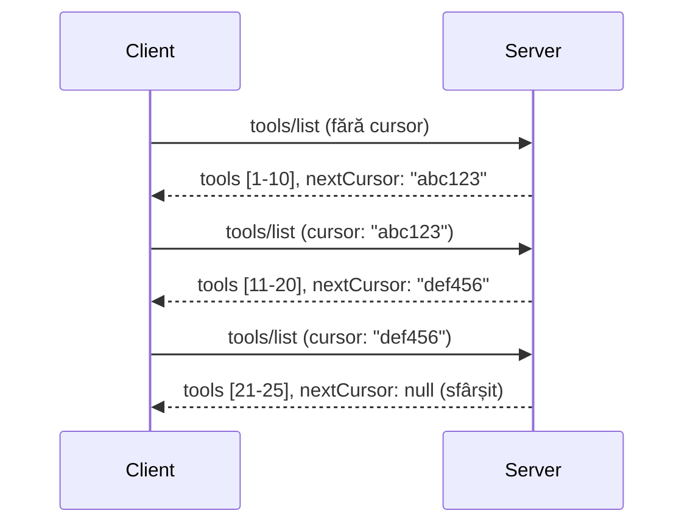

# Paginarea și seturile mari de rezultate în MCP

Atunci când serverul tău MCP gestionează seturi mari de date - fie listând mii de fișiere, înregistrări din baze de date sau rezultate de căutare - ai nevoie de paginare pentru a administra memoria eficient și pentru a oferi experiențe responsive utilizatorilor. Acest ghid acoperă cum să implementezi și să folosești paginarea în MCP.

## De ce este importantă paginarea

Fără paginare, răspunsurile mari pot cauza:

- **Epuizarea memoriei** - Încărcarea a milioane de înregistrări simultan
- **Timp de răspuns lent** - Utilizatorii așteaptă până se încarcă toate datele
- **Erori de timeout** - Cererile depășesc limitele de timp
- **Performanță slabă a AI** - LLM-urile au dificultăți cu contexte masive

MCP folosește **paginare bazată pe cursor** pentru o navigare fiabilă și consistentă prin seturile de rezultate.

---

## Cum funcționează paginarea în MCP

### Conceptul de cursor

Un **cursor** este un șir opac care marchează poziția ta într-un set de rezultate. Gândește-l ca pe un semn de carte într-o carte lungă.


### Paginarea în metodele MCP

Aceste metode MCP suportă paginarea:

| Metodă | Returnează | Suport cursor |
|--------|------------|---------------|
| `tools/list` | Definiții de unelte | ✅ |
| `resources/list` | Definiții de resurse | ✅ |
| `prompts/list` | Definiții de prompturi | ✅ |
| `resources/templates/list` | Șabloane de resurse | ✅ |

---

## Implementarea pe server

### Python (FastMCP)

```python
from mcp.server import Server
from mcp.types import Tool, ListToolsResult
import math

app = Server("paginated-server")

# Set de date mare simulat
ALL_TOOLS = [
    Tool(name=f"tool_{i}", description=f"Tool number {i}", inputSchema={})
    for i in range(100)
]

PAGE_SIZE = 10

@app.list_tools()
async def list_tools(cursor: str | None = None) -> ListToolsResult:
    """List tools with pagination support."""
    
    # Decodează cursorul pentru a obține indicele de start
    start_index = 0
    if cursor:
        try:
            start_index = int(cursor)
        except ValueError:
            start_index = 0
    
    # Obține pagina de rezultate
    end_index = min(start_index + PAGE_SIZE, len(ALL_TOOLS))
    page_tools = ALL_TOOLS[start_index:end_index]
    
    # Calculează cursorul următor
    next_cursor = None
    if end_index < len(ALL_TOOLS):
        next_cursor = str(end_index)
    
    return ListToolsResult(
        tools=page_tools,
        nextCursor=next_cursor
    )
```

### TypeScript

```typescript
import { Server } from "@modelcontextprotocol/sdk/server/index.js";
import { ListToolsResultSchema } from "@modelcontextprotocol/sdk/types.js";

const server = new Server({
  name: "paginated-server",
  version: "1.0.0"
});

// Set de date mare simulat
const ALL_TOOLS = Array.from({ length: 100 }, (_, i) => ({
  name: `tool_${i}`,
  description: `Tool number ${i}`,
  inputSchema: { type: "object", properties: {} }
}));

const PAGE_SIZE = 10;

server.setRequestHandler(ListToolsResultSchema, async (request) => {
  // Decodifică cursorul
  let startIndex = 0;
  if (request.params?.cursor) {
    startIndex = parseInt(request.params.cursor, 10) || 0;
  }
  
  // Obține pagina de rezultate
  const endIndex = Math.min(startIndex + PAGE_SIZE, ALL_TOOLS.length);
  const pageTools = ALL_TOOLS.slice(startIndex, endIndex);
  
  // Calculează următorul cursor
  const nextCursor = endIndex < ALL_TOOLS.length ? String(endIndex) : undefined;
  
  return {
    tools: pageTools,
    nextCursor
  };
});
```

### Java (Spring MCP)

```java
@Service
public class PaginatedToolService {
    
    private static final int PAGE_SIZE = 10;
    private final List<Tool> allTools;
    
    public PaginatedToolService() {
        // Inițializează setul de date mare
        this.allTools = IntStream.range(0, 100)
            .mapToObj(i -> new Tool("tool_" + i, "Tool number " + i, Map.of()))
            .collect(Collectors.toList());
    }
    
    @McpMethod("tools/list")
    public ListToolsResult listTools(@Param("cursor") String cursor) {
        // Decodează cursorul
        int startIndex = 0;
        if (cursor != null && !cursor.isEmpty()) {
            try {
                startIndex = Integer.parseInt(cursor);
            } catch (NumberFormatException e) {
                startIndex = 0;
            }
        }
        
        // Obține pagina de rezultate
        int endIndex = Math.min(startIndex + PAGE_SIZE, allTools.size());
        List<Tool> pageTools = allTools.subList(startIndex, endIndex);
        
        // Calculează cursorul următor
        String nextCursor = endIndex < allTools.size() ? String.valueOf(endIndex) : null;
        
        return new ListToolsResult(pageTools, nextCursor);
    }
}
```

---

## Implementarea pe client

### Client Python

```python
from mcp import ClientSession

async def get_all_tools(session: ClientSession) -> list:
    """Fetch all tools using pagination."""
    all_tools = []
    cursor = None
    
    while True:
        result = await session.list_tools(cursor=cursor)
        all_tools.extend(result.tools)
        
        if result.nextCursor is None:
            break
        cursor = result.nextCursor
    
    return all_tools

# Utilizare
async with client_session as session:
    tools = await get_all_tools(session)
    print(f"Found {len(tools)} tools")
```

### Client TypeScript

```typescript
import { Client } from "@modelcontextprotocol/sdk/client/index.js";

async function getAllTools(client: Client): Promise<Tool[]> {
  const allTools: Tool[] = [];
  let cursor: string | undefined = undefined;
  
  do {
    const result = await client.listTools({ cursor });
    allTools.push(...result.tools);
    cursor = result.nextCursor;
  } while (cursor);
  
  return allTools;
}

// Utilizare
const tools = await getAllTools(client);
console.log(`Found ${tools.length} tools`);
```

### Model Lazy Loading

Pentru seturi foarte mari de date, încarcă paginile la cerere:

```python
class PaginatedToolIterator:
    """Lazily iterate through paginated tools."""
    
    def __init__(self, session: ClientSession):
        self.session = session
        self.cursor = None
        self.buffer = []
        self.exhausted = False
    
    async def __anext__(self):
        # Returnează din buffer dacă este disponibil
        if self.buffer:
            return self.buffer.pop(0)
        
        # Verifică dacă am epuizat toate paginile
        if self.exhausted:
            raise StopAsyncIteration
        
        # Preia pagina următoare
        result = await self.session.list_tools(cursor=self.cursor)
        self.buffer = list(result.tools)
        self.cursor = result.nextCursor
        
        if self.cursor is None:
            self.exhausted = True
        
        if not self.buffer:
            raise StopAsyncIteration
        
        return self.buffer.pop(0)
    
    def __aiter__(self):
        return self

# Utilizare - eficient din punct de vedere al memoriei pentru seturi mari de date
async for tool in PaginatedToolIterator(session):
    process_tool(tool)
```

---

## Paginarea pentru resurse

Resursele au adesea nevoie de paginare pentru directoare sau seturi mari de date:

```python
from mcp.server import Server
from mcp.types import Resource, ListResourcesResult
import os

app = Server("file-server")

@app.list_resources()
async def list_resources(cursor: str | None = None) -> ListResourcesResult:
    """List files in directory with pagination."""
    
    directory = "/data/files"
    all_files = sorted(os.listdir(directory))
    
    # Decodifică cursorul (indexul fișierului)
    start_index = int(cursor) if cursor else 0
    page_size = 20
    end_index = min(start_index + page_size, len(all_files))
    
    # Creează lista de resurse pentru această pagină
    resources = []
    for filename in all_files[start_index:end_index]:
        filepath = os.path.join(directory, filename)
        resources.append(Resource(
            uri=f"file://{filepath}",
            name=filename,
            mimeType="application/octet-stream"
        ))
    
    # Calculează cursorul următor
    next_cursor = str(end_index) if end_index < len(all_files) else None
    
    return ListResourcesResult(
        resources=resources,
        nextCursor=next_cursor
    )
```

---

## Strategii de proiectare a cursorului

### Strategia 1: Bazată pe index (Simplă)

```python
# Cursorul este doar indicele
cursor = "50"  # Porniți de la elementul 50
```

**Pro:** Simplu, fără stare  
**Contra:** Rezultatele se pot schimba dacă se adaugă/șterg elemente

### Strategia 2: Bazată pe ID (Stabilă)

```python
# Cursor este ultimul ID văzut
cursor = "item_abc123"  # Începe după acest element
```

**Pro:** Stabilă chiar dacă elementele se schimbă  
**Contra:** Necesită ID-uri ordonate

### Strategia 3: Stare codificată (Complexă)

```python
import base64
import json

def encode_cursor(state: dict) -> str:
    return base64.b64encode(json.dumps(state).encode()).decode()

def decode_cursor(cursor: str) -> dict:
    return json.loads(base64.b64decode(cursor).decode())

# Cursorul conține mai multe câmpuri de stare
cursor = encode_cursor({
    "offset": 50,
    "filter": "active",
    "sort": "name"
})
```

**Pro:** Poate codifica o stare complexă  
**Contra:** Mai complexă, șiruri de cursor mai mari

---

## Bune practici

### 1. Alege dimensiuni de pagină potrivite

```python
# Ia în considerare dimensiunea datelor
PAGE_SIZE_SMALL_ITEMS = 100   # Metadate simple
PAGE_SIZE_MEDIUM_ITEMS = 20   # Obiecte mai bogate
PAGE_SIZE_LARGE_ITEMS = 5     # Conținut complex
```

### 2. Gestionează cursorii invalizi cu grijă

```python
@app.list_tools()
async def list_tools(cursor: str | None = None) -> ListToolsResult:
    try:
        start_index = int(cursor) if cursor else 0
        if start_index < 0 or start_index >= len(ALL_TOOLS):
            start_index = 0  # Resetează la început
    except (ValueError, TypeError):
        start_index = 0  # Cursor nevalid, începe de la început
    # ...
```

### 3. Include numărul total (opțional)

```python
return ListToolsResult(
    tools=page_tools,
    nextCursor=next_cursor,
    # Unele implementări includ totalul pentru progresul UI
    _meta={"total": len(ALL_TOOLS)}
)
```

### 4. Testează cazuri limită

```python
async def test_pagination():
    # Set de rezultate gol
    result = await session.list_tools()
    assert result.tools == []
    assert result.nextCursor is None
    
    # Pagină unică
    result = await session.list_tools()
    assert len(result.tools) <= PAGE_SIZE
    
    # Cursor invalid
    result = await session.list_tools(cursor="invalid")
    assert result.tools  # Ar trebui să returneze prima pagină
```

---

## Probleme comune

### ❌ Returnarea tuturor rezultatelor și apoi paginarea pe client

```python
# RĂU: Încarcă totul în memorie
@app.list_tools()
async def list_tools() -> ListToolsResult:
    all_tools = load_all_tools()  # 1 milion de unelte!
    return ListToolsResult(tools=all_tools)
```

### ✅ Paginarea la sursa de date

```python
# BUN: Încarcă doar ce este necesar
@app.list_tools()
async def list_tools(cursor: str | None = None) -> ListToolsResult:
    offset = int(cursor) if cursor else 0
    tools = await db.query_tools(offset=offset, limit=PAGE_SIZE)
    return ListToolsResult(tools=tools, nextCursor=...)
```

---

## Ce urmează

- [Modul 5.14 - Ingineria Contextului](../../05-AdvancedTopics/mcp-contextengineering/README.md)
- [Modul 8 - Bune practici](../../08-BestPractices/README.md)
- [3.8 - Testarea serverului MCP](../../03-GettingStarted/08-testing/README.md)

---

## Resurse suplimentare

- [Specificația MCP - Paginarea](https://spec.modelcontextprotocol.io/specification/2025-11-25/)
- [Explicație paginare bazată pe cursor](https://slack.engineering/evolving-api-pagination-at-slack/)
- [Teste de paginare în Python SDK](https://github.com/modelcontextprotocol/python-sdk/blob/main/tests/client/test_list_methods_cursor.py)

---

<!-- CO-OP TRANSLATOR DISCLAIMER START -->
**Declinare de responsabilitate**:
Acest document a fost tradus utilizând serviciul de traducere AI [Co-op Translator](https://github.com/Azure/co-op-translator). Deși ne străduim pentru acuratețe, vă rugăm să rețineți că traducerile automate pot conține erori sau inexactități. Documentul original în limba sa nativă trebuie considerat sursa oficială. Pentru informații critice, se recomandă traducerea profesională realizată de un specialist uman. Nu ne asumăm nicio răspundere pentru eventualele neînțelegeri sau interpretări greșite rezultate din utilizarea acestei traduceri.
<!-- CO-OP TRANSLATOR DISCLAIMER END -->