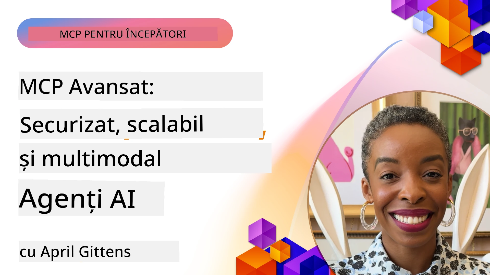

# Subiecte Avansate în MCP

_(Faceți clic pe imaginea de mai sus pentru a viziona videoclipul acestei lecții)_

Acest capitol acoperă o serie de subiecte avansate în implementarea Model Context Protocol (MCP), incluzând integrarea multi-modală, scalabilitatea, cele mai bune practici de securitate și integrarea în mediul enterprise. Aceste subiecte sunt cruciale pentru construirea de aplicații MCP robuste și pregătite pentru producție, capabile să răspundă cerințelor sistemelor AI moderne.

## Prezentare generală

Această lecție explorează concepte avansate în implementarea Model Context Protocol, concentrându-se pe integrarea multi-modală, scalabilitate, cele mai bune practici de securitate și integrarea în mediul enterprise. Aceste subiecte sunt esențiale pentru construirea de aplicații MCP de calitate pentru producție, care pot gestiona cerințe complexe în medii enterprise.

## Obiective de învățare

La finalul acestei lecții, veți putea:

- Implementa capabilități multi-modale în cadrul framework-urilor MCP
- Proiecta arhitecturi MCP scalabile pentru scenarii cu cerere ridicată
- Aplica cele mai bune practici de securitate aliniate cu principiile de securitate MCP
- Integra MCP cu sisteme și framework-uri AI enterprise
- Optimiza performanța și fiabilitatea în mediile de producție

## Lecții și Proiecte exemplu

| Link | Titlu | Descriere |
|------|-------|-------------|
| [5.1 Integration with Azure](./mcp-integration/README.md) | Integrare cu Azure | Aflați cum să integrați serverul MCP pe Azure |
| [5.2 Multi modal sample](./mcp-multi-modality/README.md) | Exemple multi-modal MCP | Exemple pentru răspuns audio, imagine și multi-modal |
| [5.3 MCP OAuth2 sample](../../../05-AdvancedTopics/mcp-oauth2-demo) | Demo MCP OAuth2 | Aplicație minimală Spring Boot care arată OAuth2 cu MCP, atât ca server de autorizare cât și ca server de resurse. Demonstrează emiterea securizată a tokenurilor, endpoint-uri protejate, implementarea cu Azure Container Apps și integrarea cu API Management. |
| [5.4 Root Contexts](./mcp-root-contexts/README.md) | Contexte rădăcină | Aflați mai multe despre contextul rădăcină și cum să-l implementați |
| [5.5 Routing](./mcp-routing/README.md) | Rutare | Aflați diferite tipuri de rutare |
| [5.6 Sampling](./mcp-sampling/README.md) | Sampling | Aflați cum să lucrați cu sampling-ul |
| [5.7 Scaling](./mcp-scaling/README.md) | Scalare | Aflați despre scalare |
| [5.8 Security](./mcp-security/README.md) | Securitate | Asigurați serverul MCP |
| [5.9 Web Search sample](./web-search-mcp/README.md) | Căutare Web MCP | Server și client MCP Python integrând SerpAPI pentru căutare web, știri, produse și Q&A în timp real. Demonstrează orchestrarea multi-tool, integrarea API extern și gestionarea robustă a erorilor. |
| [5.10 Realtime Streaming](./mcp-realtimestreaming/README.md) | Streaming | Streaming-ul de date în timp real a devenit esențial în lumea actuală condusă de date, unde afacerile și aplicațiile necesită acces imediat la informații pentru a lua decizii la timp.|
| [5.11 Realtime Web Search](./mcp-realtimesearch/README.md) | Căutare Web | Cum MCP transformă căutarea web în timp real prin oferirea unei abordări standardizate pentru gestionarea contextului între modele AI, motoare de căutare și aplicații.|
| [5.12  Entra ID Authentication for Model Context Protocol Servers](./mcp-security-entra/README.md) | Autentificare Entra ID | Microsoft Entra ID oferă o soluție robustă de gestionare a identității și accesului bazată pe cloud, ajutând să se asigure că doar utilizatorii și aplicațiile autorizate pot interacționa cu serverul MCP.|
| [5.13 Azure AI Foundry Agent Integration](./mcp-foundry-agent-integration/README.md) | Integrare Azure AI Foundry | Aflați cum să integrați serverele Model Context Protocol cu agenții Azure AI Foundry, oferind capacități puternice de orchestrare a uneltelor și AI enterprise cu conexiuni standardizate către surse externe de date.|
| [5.14 Context Engineering](./mcp-contextengineering/README.md) | Ingineria Contextului | Oportunitatea viitoare a tehnicilor de inginerie a contextului pentru serverele MCP, incluzând optimizarea contextului, management dinamic al contextului și strategii pentru inginerie eficientă a prompturilor în cadrul framework-urilor MCP.|
| [5.15 MCP Custom Transport](./mcp-transport/README.md) | Transport Personalizat | Aflați cum să implementați mecanisme de transport personalizate pentru scenarii specializate de comunicare MCP.|
| [5.16 Protocol Features Deep Dive](./mcp-protocol-features/README.md) | Funcționalități Protocol | Stăpâniți funcționalități avansate ale protocolului, inclusiv notificări de progres, anularea cererilor, template-uri de resurse și modele de gestionare a erorilor.|

> **Noutăți în Specificația MCP 2025-11-25**: Specificația include acum suport experimental pentru **Task-uri** (operațiuni de lungă durată cu monitorizare a progresului), **Anotări pentru Unelte** (metadata despre comportamentul uneltei pentru siguranță), **Eliciere Mod URL** (solicitarea anumitor conținuturi URL de la clienți) și **Roots** îmbunătățite (pentru gestionarea contextului spațiului de lucru). Consultați [jurnalul de modificări MCP Specification](https://spec.modelcontextprotocol.io/) pentru detalii complete.

## Referințe suplimentare

Pentru cele mai actualizate informații despre subiecte avansate MCP, consultați:
- [Documentația MCP](https://modelcontextprotocol.io/)
- [Specificatia MCP (2025-11-25)](https://spec.modelcontextprotocol.io/specification/2025-11-25/)
- [Repository GitHub](https://github.com/modelcontextprotocol)
- [OWASP MCP Top 10](https://microsoft.github.io/mcp-azure-security-guide/mcp/) - Riscuri de securitate și măsuri de atenuare
- [Workshop MCP Security Summit (Sherpa)](https://azure-samples.github.io/sherpa/) - Training practic de securitate

## Aspecte cheie

- Implementările multi-modale MCP extind capabilitățile AI dincolo de procesarea textului
- Scalabilitatea este esențială pentru implementările enterprise și poate fi adresată prin scalare orizontală și verticală
- Măsurile cuprinzătoare de securitate protejează datele și asigură controlul adecvat al accesului
- Integrarea enterprise cu platforme precum Azure OpenAI și Microsoft AI Foundry îmbunătățește capabilitățile MCP
- Implementările avansate MCP beneficiază de arhitecturi optimizate și gestionare atentă a resurselor

## Exercițiu

Proiectați o implementare MCP de nivel enterprise pentru un caz de utilizare specific:

1. Identificați cerințele multi-modale pentru cazul dvs. de utilizare
2. Schițați controalele de securitate necesare pentru a proteja datele sensibile
3. Proiectați o arhitectură scalabilă care poate gestiona volum variabil de încărcare
4. Planificați punctele de integrare cu sistemele AI enterprise
5. Documentați potențialele blocaje de performanță și strategii de atenuare

## Resurse suplimentare

- [Documentația Azure OpenAI](https://learn.microsoft.com/en-us/azure/ai-services/openai/)
- [Documentația Microsoft AI Foundry](https://learn.microsoft.com/en-us/ai-services/)

---

## Ce urmează

Explorați lecțiile din acest modul începând cu: [5.1 MCP Integration](./mcp-integration/README.md)

După ce ați terminat acest modul, continuați cu: [Modul 6: Contribuții Comunitare](../06-CommunityContributions/README.md)

---

<!-- CO-OP TRANSLATOR DISCLAIMER START -->
**Declinare de responsabilitate**:  
Acest document a fost tradus utilizând serviciul de traducere AI [Co-op Translator](https://github.com/Azure/co-op-translator). Deși ne străduim să oferim o traducere exactă, vă rugăm să țineți cont că traducerile automate pot conține erori sau inexactități. Documentul original, în limba sa nativă, trebuie considerat sursa autoritară. Pentru informații critice, se recomandă traducerea profesională realizată de un specialist uman. Nu ne asumăm responsabilitatea pentru eventuale neînțelegeri sau interpretări greșite care pot rezulta din utilizarea acestei traduceri.
<!-- CO-OP TRANSLATOR DISCLAIMER END -->