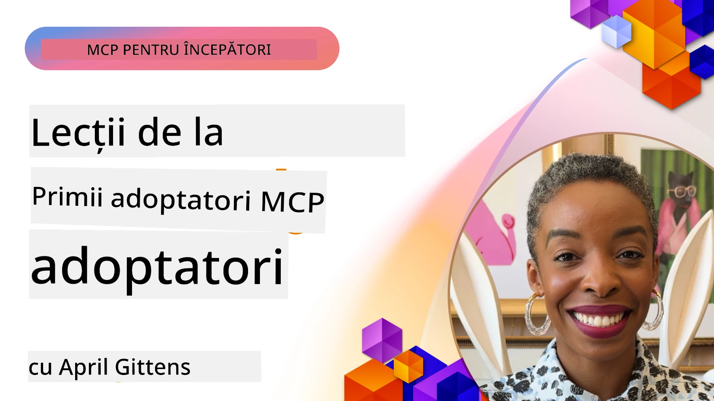

# 🌟 Lecții de la Primii Adoptatori

[](https://youtu.be/jds7dSmNptE)

_(Faceți clic pe imaginea de mai sus pentru a viziona videoclipul acestei lecții)_

## 🎯 Ce Acoperă Acest Modul

Acest modul explorează cum organizațiile reale și dezvoltatorii folosesc Model Context Protocol (MCP) pentru a rezolva provocări reale și a stimula inovația. Prin studii de caz detaliate, proiecte practice și exemple concrete, veți descoperi cum MCP permite integrarea AI securizată și scalabilă care leagă modele de limbaj, instrumente și date enterprise.

### 📚 Vezi MCP în Acțiune

Doriți să vedeți aceste principii aplicate în instrumente pregătite pentru producție? Consultați [**10 servere Microsoft MCP care transformă productivitatea dezvoltatorilor**](microsoft-mcp-servers.md), care prezintă servere reale Microsoft MCP pe care le puteți folosi astăzi.

## Prezentare generală

Această lecție explorează modul în care primii adoptatori au folosit Model Context Protocol (MCP) pentru a rezolva provocări reale și a stimula inovația în diverse industrii. Prin studii de caz detaliate și proiecte practice, veți vedea cum MCP permite o integrare AI standardizată, securizată și scalabilă — conectând modele mari de limbaj, instrumente și date enterprise într-un cadru unificat. Veți dobândi experiență practică în proiectarea și construirea soluțiilor bazate pe MCP, veți învăța din modele de implementare dovedite și veți descoperi cele mai bune practici pentru implementarea MCP în mediile de producție. Lecția evidențiază, de asemenea, tendințe emergente, direcții viitoare și resurse open-source pentru a vă ajuta să rămâneți în avangarda tehnologiei MCP și a ecosistemului său în evoluție.

## Obiective de Învățare

- Analiza implementărilor MCP din lumea reală în diferite industrii
- Proiectarea și construirea aplicațiilor complete bazate pe MCP
- Explorarea tendințelor emergente și direcțiilor viitoare în tehnologia MCP
- Aplicarea celor mai bune practici în scenarii reale de dezvoltare

## Implementări MCP din lumea reală

### Studiu de caz 1: Automatizarea suportului clienți enterprise

O corporație multinațională a implementat o soluție bazată pe MCP pentru a standardiza interacțiunile AI în sistemele lor de suport clienți. Aceasta le-a permis să:

- Creeze o interfață unificată pentru mai mulți furnizori LLM
- Mențină o gestionare consecventă a prompturilor între departamente
- Implementeze controale robuste de securitate și conformitate
- Facă comutări ușoare între diferite modele AI în funcție de necesități specifice

**Implementare tehnică:**

```python
# Implementarea serverului MCP în Python pentru suport clienți
import logging
import asyncio
from modelcontextprotocol import create_server, ServerConfig
from modelcontextprotocol.server import MCPServer
from modelcontextprotocol.transports import create_http_transport
from modelcontextprotocol.resources import ResourceDefinition
from modelcontextprotocol.prompts import PromptDefinition
from modelcontextprotocol.tool import ToolDefinition

# Configurează jurnalizarea
logging.basicConfig(level=logging.INFO)

async def main():
    # Creează configurația serverului
    config = ServerConfig(
        name="Enterprise Customer Support Server",
        version="1.0.0",
        description="MCP server for handling customer support inquiries"
    )
    
    # Inițializează serverul MCP
    server = create_server(config)
    
    # Înregistrează resursele bazei de cunoștințe
    server.resources.register(
        ResourceDefinition(
            name="customer_kb",
            description="Customer knowledge base documentation"
        ),
        lambda params: get_customer_documentation(params)
    )
    
    # Înregistrează șabloanele de prompturi
    server.prompts.register(
        PromptDefinition(
            name="support_template",
            description="Templates for customer support responses"
        ),
        lambda params: get_support_templates(params)
    )
    
    # Înregistrează uneltele de suport
    server.tools.register(
        ToolDefinition(
            name="ticketing",
            description="Create and update support tickets"
        ),
        handle_ticketing_operations
    )
    
    # Pornește serverul cu transport HTTP
    transport = create_http_transport(port=8080)
    await server.run(transport)

if __name__ == "__main__":
    asyncio.run(main())
```

**Rezultate:** Reducere cu 30% a costurilor modelelor, îmbunătățire cu 45% a consistenței răspunsurilor și conformitate sporită în operațiunile globale.

### Studiu de caz 2: Asistent diagnostic medical

Un furnizor de servicii medicale a dezvoltat o infrastructură MCP pentru a integra mai multe modele AI medicale specializate, asigurând în același timp protecția datelor sensibile ale pacienților:

- Comutare fără probleme între modele medicale generaliste și specializate
- Controale stricte de confidențialitate și urme de audit
- Integrare cu sistemele existente de evidență electronică a sănătății (EHR)
- Inginerie consecventă a prompturilor pentru terminologia medicală

**Implementare tehnică:**

```csharp
// C# MCP host application implementation in healthcare application
using Microsoft.Extensions.DependencyInjection;
using ModelContextProtocol.SDK.Client;
using ModelContextProtocol.SDK.Security;
using ModelContextProtocol.SDK.Resources;

public class DiagnosticAssistant
{
    private readonly MCPHostClient _mcpClient;
    private readonly PatientContext _patientContext;
    
    public DiagnosticAssistant(PatientContext patientContext)
    {
        _patientContext = patientContext;
        
        // Configure MCP client with healthcare-specific settings
        var clientOptions = new ClientOptions
        {
            Name = "Healthcare Diagnostic Assistant",
            Version = "1.0.0",
            Security = new SecurityOptions
            {
                Encryption = EncryptionLevel.Medical,
                AuditEnabled = true
            }
        };
        
        _mcpClient = new MCPHostClientBuilder()
            .WithOptions(clientOptions)
            .WithTransport(new HttpTransport("https://healthcare-mcp.example.org"))
            .WithAuthentication(new HIPAACompliantAuthProvider())
            .Build();
    }
    
    public async Task<DiagnosticSuggestion> GetDiagnosticAssistance(
        string symptoms, string patientHistory)
    {
        // Create request with appropriate resources and tool access
        var resourceRequest = new ResourceRequest
        {
            Name = "patient_records",
            Parameters = new Dictionary<string, object>
            {
                ["patientId"] = _patientContext.PatientId,
                ["requestingProvider"] = _patientContext.ProviderId
            }
        };
        
        // Request diagnostic assistance using appropriate prompt
        var response = await _mcpClient.SendPromptRequestAsync(
            promptName: "diagnostic_assistance",
            parameters: new Dictionary<string, object>
            {
                ["symptoms"] = symptoms,
                patientHistory = patientHistory,
                relevantGuidelines = _patientContext.GetRelevantGuidelines()
            });
            
        return DiagnosticSuggestion.FromMCPResponse(response);
    }
}
```

**Rezultate:** Sugestii de diagnostic îmbunătățite pentru medici, păstrând conformitatea completă HIPAA și reducere semnificativă a schimbărilor de context între sisteme.

### Studiu de caz 3: Analiza riscurilor în servicii financiare

O instituție financiară a implementat MCP pentru a standardiza procesele de analiză a riscurilor în diferite departamente:

- Creată o interfață unificată pentru modelele de risc de credit, detectare fraudă și risc investițional
- Implementate controale stricte de acces și versionare a modelelor
- Asigurată auditabilitate pentru toate recomandările AI
- Menținută o formatare consecventă a datelor între sistemele diverse

**Implementare tehnică:**

```java
// Server Java MCP pentru evaluarea riscului financiar
import org.mcp.server.*;
import org.mcp.security.*;

public class FinancialRiskMCPServer {
    public static void main(String[] args) {
        // Creează server MCP cu funcționalități de conformitate financiară
        MCPServer server = new MCPServerBuilder()
            .withModelProviders(
                new ModelProvider("risk-assessment-primary", new AzureOpenAIProvider()),
                new ModelProvider("risk-assessment-audit", new LocalLlamaProvider())
            )
            .withPromptTemplateDirectory("./compliance/templates")
            .withAccessControls(new SOCCompliantAccessControl())
            .withDataEncryption(EncryptionStandard.FINANCIAL_GRADE)
            .withVersionControl(true)
            .withAuditLogging(new DatabaseAuditLogger())
            .build();
            
        server.addRequestValidator(new FinancialDataValidator());
        server.addResponseFilter(new PII_RedactionFilter());
        
        server.start(9000);
        
        System.out.println("Financial Risk MCP Server running on port 9000");
    }
}
```

**Rezultate:** Conformitate sporită cu reglementările, cicluri de implementare a modelelor mai rapide cu 40% și consistență îmbunătățită în evaluarea riscurilor.

### Studiu de caz 4: Serverul Microsoft Playwright MCP pentru automatizarea browserului

Microsoft a dezvoltat [serverul Playwright MCP](https://github.com/microsoft/playwright-mcp) pentru a permite automatizarea browserului securizată și standardizată prin Model Context Protocol. Acest server pregătit pentru producție permite agenților AI și LLM-urilor să interacționeze cu browserele web într-un mod controlat, auditat și extensibil — susținând cazuri de utilizare precum testarea web automată, extragerea datelor și fluxuri de lucru end-to-end.

> **🎯 Instrument pregătit pentru producție**
> 
> Acest studiu de caz prezintă un server MCP real pe care îl puteți folosi astăzi! Aflați mai multe despre Playwright MCP Server și alte 9 servere Microsoft MCP pregătite pentru producție în [**Ghidul Serverelor Microsoft MCP**](microsoft-mcp-servers.md#8--playwright-mcp-server).

**Caracteristici cheie:**
- Expune capacități de automatizare a browserului (navigare, completare formulare, captură de ecran etc.) ca instrumente MCP
- Implementează controale stricte de acces și sandboxing pentru a preveni acțiunile neautorizate
- Oferă jurnale detaliate de audit pentru toate interacțiunile cu browserul
- Suportă integrarea cu Azure OpenAI și alți furnizori LLM pentru automatizarea bazată pe agenți
- Susține agenții de codare GitHub Copilot cu capabilități de navigare web

**Implementare tehnică:**

```typescript
// TypeScript: Înregistrarea instrumentelor de automatizare a browserului Playwright într-un server MCP
import { createServer, ToolDefinition } from 'modelcontextprotocol';
import { launch } from 'playwright';

const server = createServer({
  name: 'Playwright MCP Server',
  version: '1.0.0',
  description: 'MCP server for browser automation using Playwright'
});

// Înregistrează un instrument pentru navigarea către un URL și capturarea unei capturi de ecran
server.tools.register(
  new ToolDefinition({
    name: 'navigate_and_screenshot',
    description: 'Navigate to a URL and capture a screenshot',
    parameters: {
      url: { type: 'string', description: 'The URL to visit' }
    }
  }),
  async ({ url }) => {
    const browser = await launch();
    const page = await browser.newPage();
    await page.goto(url);
    const screenshot = await page.screenshot();
    await browser.close();
    return { screenshot };
  }
);

// Pornește serverul MCP
server.listen(8080);
```

**Rezultate:**

- Automatizare securizată și programatică a browserului pentru agenți AI și LLM-uri
- Reducere a efortului manual în testare și îmbunătățire a acoperirii testelor pentru aplicații web
- Oferă un cadru reutilizabil și extensibil pentru integrarea instrumentelor bazate pe browser în medii enterprise
- Susține capabilitățile de navigare web ale GitHub Copilot

**Referințe:**

- [Playwright MCP Server GitHub](https://github.com/microsoft/playwright-mcp)
- [Microsoft AI și soluții de automatizare](https://azure.microsoft.com/en-us/products/ai-services/)

### Studiu de caz 5: Azure MCP – Model Context Protocol de nivel enterprise ca serviciu

Serverul Azure MCP ([https://aka.ms/azmcp](https://aka.ms/azmcp)) este implementarea Microsoft gestionată, de nivel enterprise, a Model Context Protocol, concepută pentru a oferi capabilități scalabile, securizate și conforme de server MCP ca serviciu în cloud. Azure MCP permite organizațiilor să implementeze rapid, să gestioneze și să integreze servere MCP cu serviciile Azure AI, date și securitate, reducând povara operațională și accelerând adoptarea AI.

> **🎯 Instrument pregătit pentru producție**
> 
> Acesta este un server MCP real pe care îl puteți folosi astăzi! Aflați mai multe despre Azure AI Foundry MCP Server în [**Ghidul Serverelor Microsoft MCP**](microsoft-mcp-servers.md).

- Găzduire complet gestionată pentru server MCP cu scalare, monitorizare și securitate integrate
- Integrare nativă cu Azure OpenAI, Azure AI Search și alte servicii Azure
- Autentificare și autorizare enterprise prin Microsoft Entra ID
- Suport pentru instrumente personalizate, șabloane de prompturi și conectori de resurse
- Conformitate cu cerințele de securitate și reglementare enterprise

**Implementare tehnică:**

```yaml
# Example: Azure MCP server deployment configuration (YAML)
apiVersion: mcp.microsoft.com/v1
kind: McpServer
metadata:
  name: enterprise-mcp-server
spec:
  modelProviders:
    - name: azure-openai
      type: AzureOpenAI
      endpoint: https://<your-openai-resource>.openai.azure.com/
      apiKeySecret: <your-azure-keyvault-secret>
  tools:
    - name: document_search
      type: AzureAISearch
      endpoint: https://<your-search-resource>.search.windows.net/
      apiKeySecret: <your-azure-keyvault-secret>
  authentication:
    type: EntraID
    tenantId: <your-tenant-id>
  monitoring:
    enabled: true
    logAnalyticsWorkspace: <your-log-analytics-id>
```

**Rezultate:**  
- Reducerea timpului până la valoare pentru proiectele enterprise AI oferind o platformă MCP pregătită, conformă  
- Simplificarea integrării LLM-urilor, instrumentelor și surselor de date enterprise  
- Creșterea securității, observabilității și eficienței operaționale pentru sarcinile MCP  
- Îmbunătățirea calității codului prin cele mai bune practici Azure SDK și modele actuale de autentificare

**Referințe:**  
- [Documentație Azure MCP](https://aka.ms/azmcp)  
- [Azure MCP Server GitHub](https://github.com/Azure/azure-mcp)  
- [Servicii Azure AI](https://azure.microsoft.com/en-us/products/ai-services/)  
- [Microsoft MCP Center](https://mcp.azure.com)

## Studiu de caz 6: NLWeb  

MCP (Model Context Protocol) este un protocol emergent pentru chatboți și asistenți AI care interacționează cu instrumente. Fiecare instanță NLWeb este de asemenea un server MCP, care suportă o metodă de bază, ask, folosită pentru a pune o întrebare în limbaj natural unui site web. Răspunsul returnat utilizează schema.org, un vocabular larg folosit pentru descrierea datelor web. Aproximativ, MCP este pentru NLWeb ceea ce HTTP este pentru HTML. NLWeb combină protocoale, formate Schema.org și cod exemplu pentru a ajuta site-urile să creeze rapid aceste endpoint-uri, beneficiind atât oamenii prin interfețe conversaționale, cât și mașinile prin interacțiuni naturale agent-la-agent.

Există două componente distincte ale NLWeb:
- Un protocol, foarte simplu la început, pentru interfațarea cu un site în limbaj natural și un format, utilizând json și schema.org pentru răspunsul returnat. Consultați documentația REST API pentru mai multe detalii.
- O implementare directă a (1) care utilizează markup-ul existent, pentru site-uri ce pot fi abstractizate ca liste de elemente (produse, rețete, atracții, recenzii etc.). Împreună cu un set de widget-uri interfață-utilizator, site-urile pot oferi cu ușurință interfețe conversaționale conținutului lor. Consultați documentația Life of a chat query pentru mai multe detalii despre cum funcționează.

**Referințe:**  
- [Documentație Azure MCP](https://aka.ms/azmcp)  
- [NLWeb](https://github.com/microsoft/NlWeb)

### Studiu de caz 7: Azure AI Foundry MCP Server – Integrare agenți AI enterprise

Serverele Azure AI Foundry MCP demonstrează cum MCP poate fi folosit pentru orchestrarea și gestionarea agenților AI și fluxurilor de lucru în medii enterprise. Prin integrarea MCP cu Azure AI Foundry, organizațiile pot standardiza interacțiunile agenților, valorifica gestionarea fluxurilor Foundry și asigura implementări sigure și scalabile.

> **🎯 Instrument pregătit pentru producție**
> 
> Acesta este un server MCP real pe care îl puteți folosi astăzi! Aflați mai multe despre Azure AI Foundry MCP Server în [**Ghidul Serverelor Microsoft MCP**](microsoft-mcp-servers.md#9--azure-ai-foundry-mcp-server).

**Caracteristici cheie:**
- Acces complet la ecosistemul AI Azure, inclusiv cataloage de modele și gestionarea implementărilor
- Indexare a cunoștințelor cu Azure AI Search pentru aplicații RAG
- Instrumente de evaluare a performanței modelelor AI și asigurare a calității
- Integrare cu Azure AI Foundry Catalog și Labs pentru modele de cercetare avansate
- Capacități de gestionare și evaluare a agenților pentru scenarii de producție

**Rezultate:**
- Prototipare rapidă și monitorizare robustă a fluxurilor de lucru cu agenți AI
- Integrare fără cusur cu serviciile Azure AI pentru scenarii avansate
- Interfață unificată pentru construirea, implementarea și monitorizarea conductelor agenților
- Securitate, conformitate și eficiență operațională îmbunătățite pentru enterprise
- Accelerarea adoptării AI menținând controlul asupra proceselor complexe conduse de agenți

**Referințe:**
- [Azure AI Foundry MCP Server GitHub Repository](https://github.com/azure-ai-foundry/mcp-foundry)
- [Integrarea agenților Azure AI cu MCP (Microsoft Foundry Blog)](https://devblogs.microsoft.com/foundry/integrating-azure-ai-agents-mcp/)

### Studiu de caz 8: Foundry MCP Playground – Experimentare și prototipare

Foundry MCP Playground oferă un mediu pregătit pentru utilizare pentru experimentarea cu servere MCP și integrări Azure AI Foundry. Dezvoltatorii pot prototipa, testa și evalua rapid modele AI și fluxuri de lucru cu agenți folosind resurse din Azure AI Foundry Catalog și Labs. Playground-ul simplifică configurarea, oferă proiecte exemplu și suportă dezvoltarea colaborativă, facilitând explorarea celor mai bune practici și a noilor scenarii cu un minim de încercare. Este deosebit de util pentru echipele care doresc să valideze idei, să partajeze experimente și să accelereze învățarea fără infrastructură complexă. Prin reducerea barierelor de intrare, playground-ul stimulează inovația și contribuțiile comunității în ecosistemul MCP și Azure AI Foundry.

**Referințe:**

- [Foundry MCP Playground GitHub Repository](https://github.com/azure-ai-foundry/foundry-mcp-playground)

### Studiu de caz 9: Microsoft Learn Docs MCP Server – Acces documentație asistat de AI

Serverul Microsoft Learn Docs MCP este un serviciu cloud găzduit care oferă asistenți AI acces în timp real la documentația oficială Microsoft prin Model Context Protocol. Acest server pregătit pentru producție se conectează la ecosistemul amplu Microsoft Learn și permite căutarea semantică în toate sursele oficiale Microsoft.

> **🎯 Instrument pregătit pentru producție**
> 
> Acesta este un server MCP real pe care îl puteți folosi astăzi! Aflați mai multe despre Microsoft Learn Docs MCP Server în [**Ghidul Serverelor Microsoft MCP**](microsoft-mcp-servers.md#1--microsoft-learn-docs-mcp-server).

**Caracteristici cheie:**
- Acces în timp real la documentația oficială Microsoft, documentația Azure și documentația Microsoft 365
- Capacități avansate de căutare semantică care înțeleg contextul și intenția
- Informații mereu actualizate pe măsură ce conținutul Microsoft Learn este publicat
- Acoperire completă a documentației Microsoft Learn, Azure și Microsoft 365
- Returnează până la 10 segmentări de conținut de înaltă calitate cu titluri și URL-uri

**De ce este critic:**
- Rezolvă problema "cunoștințelor AI învechite" pentru tehnologiile Microsoft
- Asigură accesul asistenților AI la cele mai noi funcții .NET, C#, Azure și Microsoft 365
- Oferă informații autoritare, din sursă primară, pentru generarea exactă a codului
- Esențial pentru dezvoltatorii care lucrează cu tehnologii Microsoft în rapidă evoluție

**Rezultate:**
- Precizie dramatic îmbunătățită a codului generat AI pentru tehnologiile Microsoft
- Timp redus de căutare a documentației curente și a celor mai bune practici
- Productivitate crescută a dezvoltatorilor prin recuperare contextuală a documentației
- Integrare fără întreruperi în fluxurile de dezvoltare fără a părăsi IDE-ul

**Referințe:**
- [Microsoft Learn Docs MCP Server GitHub Repository](https://github.com/MicrosoftDocs/mcp)
- [Documentația Microsoft Learn](https://learn.microsoft.com/)

## Proiecte practice

### Proiect 1: Construiește un server MCP multi-furnizor

**Obiectiv:** Creează un server MCP care să poată redirecționa cereri către mai mulți furnizori de modele AI în funcție de criterii specifice.

**Cerințe:**

- Suport pentru cel puțin trei furnizori diferiți de modele (ex: OpenAI, Anthropic, modele locale)
- Implementarea unui mecanism de rutare bazat pe metadatele cererii
- Crearea unui sistem de configurare pentru gestionarea credențialelor furnizorilor
- Adăugarea caching-ului pentru optimizarea performanței și a costurilor
- Construirea unui tablou de bord simplu pentru monitorizarea utilizării

**Pași de implementare:**

1. Configurarea infrastructurii de bază a serverului MCP  
2. Implementarea adaptoarelor pentru fiecare serviciu de model AI  
3. Crearea logicii de rutare bazată pe atributele cererilor  
4. Adăugarea mecanismelor de caching pentru cererile frecvente  
5. Dezvoltarea tabloului de bord pentru monitorizare  
6. Testarea cu diferite tipare de cereri  

**Tehnologii:** Alegeți între Python (.NET/Java/Python după preferință), Redis pentru caching și un framework web simplu pentru tablou de bord.

### Proiect 2: Sistem enterprise de management al prompturilor
**Obiectiv:** Dezvoltați un sistem bazat pe MCP pentru gestionarea, versionarea și implementarea șabloanelor de prompturi în cadrul unei organizații.

**Cerințe:**

- Creați un depozit centralizat pentru șabloanele de prompturi
- Implementați versionarea și fluxuri de aprobare
- Construiți capabilități de testare a șabloanelor cu intrări de probă
- Dezvoltați controale de acces bazate pe roluri
- Creați un API pentru recuperarea și implementarea șabloanelor

**Pași de implementare:**

1. Proiectați schema bazei de date pentru stocarea șabloanelor
2. Creați API-ul de bază pentru operațiuni CRUD pe șabloane
3. Implementați sistemul de versionare
4. Construiți fluxul de aprobare
5. Dezvoltați cadrul de testare
6. Creați o interfață web simplă pentru management
7. Integrați cu un server MCP

**Tehnologii:** Alegerea dvs. de framework backend, bază de date SQL sau NoSQL și un framework frontend pentru interfața de management.

### Proiect 3: Platformă de generare conținut bazată pe MCP

**Obiectiv:** Construiți o platformă de generare conținut care folosește MCP pentru a oferi rezultate consistente pentru diferite tipuri de conținut.

**Cerințe:**

- Suport pentru multiple formate de conținut (articole de blog, social media, texte de marketing)
- Implementați generare bazată pe șabloane cu opțiuni de personalizare
- Creați un sistem de revizuire și feedback pentru conținut
- Monitorizați metricile de performanță ale conținutului
- Suportați versionarea și iterarea conținutului

**Pași de implementare:**

1. Configurați infrastructura client MCP
2. Creați șabloane pentru diferite tipuri de conținut
3. Construiți fluxul de generare a conținutului
4. Implementați sistemul de revizuire
5. Dezvoltați sistemul de monitorizare a metricilor
6. Creați o interfață pentru gestionarea șabloanelor și generarea conținutului

**Tehnologii:** Limbajul de programare preferat, framework web și sistemul de baze de date.

## Direcții viitoare pentru tehnologia MCP

### Tendințe emergente

1. **MCP Multi-Modal**
   - Extinderea MCP pentru a standardiza interacțiunile cu modele de imagine, audio și video
   - Dezvoltarea capacităților de raționament cross-modal
   - Formate standardizate de prompturi pentru diferite modalități

2. **Infrastructură MCP Federată**
   - Rețele MCP distribuite care pot partaja resurse între organizații
   - Protocoale standardizate pentru partajarea securizată a modelelor
   - Tehnici de calcul ce păstrează intimitatea

3. **Piețe MCP**
   - Ecosisteme pentru partajarea și monetizarea șabloanelor și pluginurilor MCP
   - Procese de asigurare a calității și certificare
   - Integrare cu piețe de modele

4. **MCP pentru Edge Computing**
   - Adaptarea standardelor MCP pentru dispozitive edge cu resurse limitate
   - Protocoale optimizate pentru medii cu bandă redusă
   - Implementări MCP specializate pentru ecosisteme IoT

5. **Cadre Reglementare**
   - Dezvoltarea extensiilor MCP pentru conformitate reglementară
   - Trasee de audit standardizate și interfețe explicabile
   - Integrare cu cadre emergente de guvernanță AI

### Soluții MCP de la Microsoft

Microsoft și Azure au dezvoltat mai multe depozite open-source pentru a ajuta dezvoltatorii să implementeze MCP în diverse scenarii:

#### Organizația Microsoft

1. [playwright-mcp](https://github.com/microsoft/playwright-mcp) - Un server Playwright MCP pentru automatizarea și testarea browserului
2. [files-mcp-server](https://github.com/microsoft/files-mcp-server) - Implementare server MCP OneDrive pentru testări locale și contribuții comunitare
3. [NLWeb](https://github.com/microsoft/NlWeb) - NLWeb este o colecție de protocoale deschise și unelte open source asociate. Accentul principal este stabilirea unui strat fundamental pentru Web-ul AI

#### Organizația Azure-Samples

1. [mcp](https://github.com/Azure-Samples/mcp) - Linkuri către exemple, unelte și resurse pentru construirea și integrarea serverelor MCP pe Azure folosind mai multe limbaje
2. [mcp-auth-servers](https://github.com/Azure-Samples/mcp-auth-servers) - Servere MCP de referință care demonstrează autentificarea conform specificației curente Model Context Protocol
3. [remote-mcp-functions](https://github.com/Azure-Samples/remote-mcp-functions) - Pagina de întâmpinare pentru implementările Remote MCP Server în Azure Functions cu linkuri către depozite specifice limbajelor
4. [remote-mcp-functions-python](https://github.com/Azure-Samples/remote-mcp-functions-python) - Șablon quickstart pentru construirea și implementarea serverelor MCP personalizate la distanță folosind Azure Functions cu Python
5. [remote-mcp-functions-dotnet](https://github.com/Azure-Samples/remote-mcp-functions-dotnet) - Șablon quickstart pentru construirea și implementarea serverelor MCP personalizate la distanță folosind Azure Functions cu .NET/C#
6. [remote-mcp-functions-typescript](https://github.com/Azure-Samples/remote-mcp-functions-typescript) - Șablon quickstart pentru construirea și implementarea serverelor MCP personalizate la distanță folosind Azure Functions cu TypeScript
7. [remote-mcp-apim-functions-python](https://github.com/Azure-Samples/remote-mcp-apim-functions-python) - Azure API Management ca AI Gateway către serverele MCP la distanță folosind Python
8. [AI-Gateway](https://github.com/Azure-Samples/AI-Gateway) - Experimente APIM ❤️ AI inclusiv capabilități MCP, integrând Azure OpenAI și AI Foundry

Aceste depozite oferă implementări, șabloane și resurse diverse pentru lucrul cu Model Context Protocol în diferite limbaje de programare și servicii Azure. Acoperă o gamă largă de cazuri de utilizare de la implementări de bază ale serverelor până la autentificare, implementare în cloud și scenarii de integrare enterprise.

#### Directorul Resurselor MCP

Directorul [MCP Resources](https://github.com/microsoft/mcp/tree/main/Resources) din depozitul oficial Microsoft MCP oferă o colecție curată de resurse de probă, șabloane de prompturi și definiții de unelte pentru utilizarea cu serverele Model Context Protocol. Acest director este conceput pentru a ajuta dezvoltatorii să înceapă rapid cu MCP oferind blocuri reutilizabile și exemple de bune practici pentru:

- **Șabloane de Prompturi:** Șabloane gata de utilizare pentru sarcini și scenarii AI comune, adaptabile pentru implementările proprii de server MCP.
- **Definiții de Unelte:** Scheme și metadate exemplu pentru unelte pentru a standardiza integrarea și invocarea uneltelor în diferite servere MCP.
- **Resurse de Probare:** Definiții exemplu ale resurselor pentru conectarea la surse de date, API-uri și servicii externe în cadrul MCP.
- **Implementări de Referință:** Exemple practice care demonstrează cum să structurați și organizați resurse, prompturi și unelte în proiecte MCP din lumea reală.

Aceste resurse accelerează dezvoltarea, promovează standardizarea și ajută la asigurarea celor mai bune practici la construirea și implementarea soluțiilor bazate pe MCP.

#### Directorul Resurselor MCP

- [Resurse MCP (exemple de prompturi, unelte și definiții de resurse)](https://github.com/microsoft/mcp/tree/main/Resources)

### Oportunități de cercetare

- Tehnici eficiente de optimizare a prompturilor în cadrul MEC
- Modele de securitate pentru implementări MCP multi-chiriași
- Benchmarking-ul performanței între diverse implementări MCP
- Metode formale de verificare pentru serverele MCP

## Concluzie

Model Context Protocol (MCP) modelează rapid viitorul integrării AI standardizate, securizate și interoperabile în diverse industrii. Prin studiile de caz și proiectele practice din această lecție, ați putut vedea cum adoptatorii timpurii—printre care Microsoft și Azure—folosesc MCP pentru a rezolva provocări reale, a accelera adoptarea AI și a asigura conformitate, securitate și scalabilitate. Abordarea modulară a MCP permite organizațiilor să conecteze modele de limbaj mari, unelte și date enterprise într-un cadru unificat și auditat. Pe măsură ce MCP evoluează, menținerea implicării în comunitate, explorarea resurselor open-source și aplicarea celor mai bune practici vor fi cruciale pentru construirea unor soluții AI robuste, pregătite pentru viitor.

## Resurse suplimentare

- [Depozitul GitHub MCP Foundry](https://github.com/azure-ai-foundry/mcp-foundry)
- [Foundry MCP Playground](https://github.com/azure-ai-foundry/foundry-mcp-playground)
- [Integrarea agenților Azure AI cu MCP (Blog Microsoft Foundry)](https://devblogs.microsoft.com/foundry/integrating-azure-ai-agents-mcp/)
- [Depozitul GitHub MCP (Microsoft)](https://github.com/microsoft/mcp)
- [Directorul Resurselor MCP (exemple de prompturi, unelte și definiții de resurse)](https://github.com/microsoft/mcp/tree/main/Resources)
- [Comunitatea MCP & Documentație](https://modelcontextprotocol.io/introduction)
- [Specificația MCP (2025-11-25)](https://spec.modelcontextprotocol.io/specification/2025-11-25/)
- [Documentația Azure MCP](https://aka.ms/azmcp)
- [OWASP MCP Top 10](https://microsoft.github.io/mcp-azure-security-guide/mcp/) - cele mai bune practici de securitate
- [Depozitul GitHub Playwright MCP Server](https://github.com/microsoft/playwright-mcp)
- [Files MCP Server (OneDrive)](https://github.com/microsoft/files-mcp-server)
- [Azure-Samples MCP](https://github.com/Azure-Samples/mcp)
- [MCP Auth Servers (Azure-Samples)](https://github.com/Azure-Samples/mcp-auth-servers)
- [Remote MCP Functions (Azure-Samples)](https://github.com/Azure-Samples/remote-mcp-functions)
- [Remote MCP Functions Python (Azure-Samples)](https://github.com/Azure-Samples/remote-mcp-functions-python)
- [Remote MCP Functions .NET (Azure-Samples)](https://github.com/Azure-Samples/remote-mcp-functions-dotnet)
- [Remote MCP Functions TypeScript (Azure-Samples)](https://github.com/Azure-Samples/remote-mcp-functions-typescript)
- [Remote MCP APIM Functions Python (Azure-Samples)](https://github.com/Azure-Samples/remote-mcp-apim-functions-python)
- [AI-Gateway (Azure-Samples)](https://github.com/Azure-Samples/AI-Gateway)
- [Soluții Microsoft AI și Automatizare](https://azure.microsoft.com/en-us/products/ai-services/)

## Exerciții

1. Analizați unul dintre studiile de caz și propuneți o abordare alternativă de implementare.
2. Alegeți una dintre ideile de proiect și creați o specificație tehnică detaliată.
3. Cercetați o industrie neacoperită în studiile de caz și schițați cum MCP ar putea aborda provocările sale specifice.
4. Explorați una dintre direcțiile viitoare și creați un concept pentru o nouă extensie MCP pentru a o susține.

## Ce urmează

Explorați mai mult: [Serverele Microsoft MCP](./microsoft-mcp-servers.md)

Continuați la: [Modul 8: Cele mai bune practici](../08-BestPractices/README.md)

---

<!-- CO-OP TRANSLATOR DISCLAIMER START -->
**Declinarea responsabilității**:
Acest document a fost tradus utilizând serviciul de traducere AI [Co-op Translator](https://github.com/Azure/co-op-translator). Deși ne străduim să oferim o traducere exactă, vă rugăm să rețineți că traducerile automate pot conține erori sau inexactități. Documentul original, în limba sa nativă, trebuie considerat sursa autoritară. Pentru informații critice, se recomandă traducerea profesională realizată de un specialist uman. Nu ne asumăm responsabilitatea pentru eventualele neînțelegeri sau interpretări greșite care pot rezulta din utilizarea acestei traduceri.
<!-- CO-OP TRANSLATOR DISCLAIMER END -->