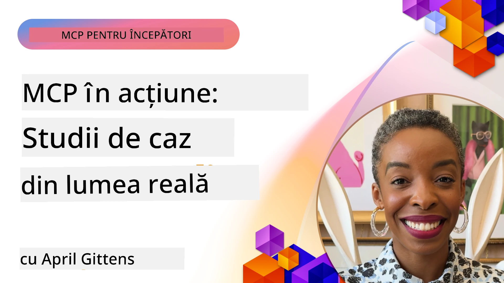

# MCP în Acțiune: Studii de Caz din Lumea Reală

_(Faceți clic pe imaginea de mai sus pentru a viziona videoclipul acestei lecții)_

Model Context Protocol (MCP) transformă modul în care aplicațiile AI interacționează cu datele, uneltele și serviciile. Această secțiune prezintă studii de caz din lumea reală care demonstrează aplicații practice ale MCP în diverse scenarii enterprise.

## Prezentare generală

Această secțiune prezintă exemple concrete de implementări MCP, evidențiind modul în care organizațiile folosesc acest protocol pentru a rezolva provocări complexe de afaceri. Prin examinarea acestor studii de caz, vei obține perspective asupra versatilității, scalabilității și beneficiilor practice ale MCP în scenarii reale.

## Obiective cheie de învățare

Explorând aceste studii de caz, vei:

- Înțelege cum MCP poate fi aplicat pentru a rezolva probleme de afaceri specifice
- Învăța despre diferite modele de integrare și abordări arhitecturale
- Recunoaște cele mai bune practici pentru implementarea MCP în medii enterprise
- Obține perspective asupra provocărilor și soluțiilor întâlnite în implementările din lumea reală
- Identifica oportunități pentru a aplica modele similare în propriile proiecte

## Studii de caz prezentate

### 1. [Agenți de Călătorie Azure AI – Implementare de Referință](./travelagentsample.md)

Acest studiu de caz analizează soluția de referință completă a Microsoft care demonstrează cum să construiești o aplicație de planificare a călătoriilor cu mai mulți agenți, alimentată de AI, folosind MCP, Azure OpenAI și Azure AI Search. Proiectul etalează:

- Orchestrare multi-agent prin MCP
- Integrarea datelor enterprise cu Azure AI Search
- Arhitectură sigură și scalabilă folosind servicii Azure
- Unelte extensibile cu componente MCP reutilizabile
- Experiență conversațională pentru utilizator alimentată de Azure OpenAI

Detaliile arhitecturii și implementării oferă informații valoroase pentru construirea sistemelor complexe multi-agente cu MCP ca strat de coordonare.

### 2. [Actualizarea articolelor Azure DevOps din datele YouTube](./UpdateADOItemsFromYT.md)

Acest studiu de caz demonstrează o aplicație practică a MCP pentru automatizarea proceselor de workflow. Arată cum uneltele MCP pot fi folosite pentru a:

- Extrage date din platforme online (YouTube)
- Actualiza articole de lucru în sistemele Azure DevOps
- Crea workflow-uri automate repetabile
- Integra date între sisteme disparate

Exemplul ilustrează cum chiar și implementările MCP relativ simple pot aduce câștiguri semnificative de eficiență prin automatizarea sarcinilor rutină și îmbunătățirea consistenței datelor între sisteme.

### 3. [Recuperare documentație în timp real cu MCP](./docs-mcp/README.md)

Acest studiu de caz te ghidează prin conectarea unui client consolă Python la un server Model Context Protocol (MCP) pentru a recupera și înregistra documentația Microsoft contextuală și în timp real. Vei învăța cum să:

- Te conectezi la un server MCP folosind un client Python și SDK-ul oficial MCP
- Folosești clienți HTTP pentru streaming eficient, recuperare de date în timp real
- Apelezi uneltele de documentație pe server și înregistrezi răspunsurile direct în consolă
- Integrezi documentația actualizată Microsoft în fluxul tău de lucru fără a părăsi terminalul

Capitolul include o temă practică, un exemplu de cod minimal funcțional și linkuri către resurse suplimentare pentru învățare aprofundată. Consultă parcurgerea completă și codul în capitolul legat pentru a înțelege cum MCP poate transforma accesul la documentație și productivitatea dezvoltatorilor în medii bazate pe consolă.

### 4. [Generatorul Interactiv de Planuri de Studiu Web cu MCP](./docs-mcp/README.md)

Acest studiu de caz demonstrează cum să construiești o aplicație web interactivă folosind Chainlit și Model Context Protocol (MCP) pentru a genera planuri de studiu personalizate pentru orice subiect. Utilizatorii pot specifica un subiect (de exemplu, „certificare AI-900”) și o durată de studiu (de ex., 8 săptămâni), iar aplicația va oferi un plan săptămânal cu conținut recomandat. Chainlit permite o interfață conversațională, făcând experiența captivantă și adaptivă.

- Aplicație web conversațională alimentată de Chainlit
- Prompturi definite de utilizator pentru subiect și durată
- Recomandări de conținut săptămânal folosind MCP
- Răspunsuri în timp real, adaptive, în interfața de chat

Proiectul ilustrează cum AI conversațional și MCP pot fi combinate pentru a crea unelte educaționale dinamice, conduse de utilizator, într-un mediu web modern.

### 5. [Documentație în editor cu server MCP în VS Code](./docs-mcp/README.md)

Acest studiu de caz demonstrează cum poți aduce documentația Microsoft Learn direct în mediul tău VS Code folosind serverul MCP — fără a mai comuta tab-uri în browser! Vei vedea cum să:

- Cauți și să citești instant documentație în VS Code folosind panoul MCP sau paleta de comenzi
- Referențiezi documentația și inserezi linkuri direct în fișiere README sau markdown de curs
- Folosești GitHub Copilot și MCP împreună pentru fluxuri de lucru fără întreruperi, asistate de AI
- Validezi și îmbunătățești documentația cu feedback în timp real și acuratețe din surse Microsoft
- Integrezi MCP cu workflow-urile GitHub pentru validare continuă a documentației

Implementarea include:

- Exemplu de configurație `.vscode/mcp.json` pentru configurare ușoară
- Parcurgeri ilustrate cu capturi de ecran pentru experiența în editor
- Sfaturi pentru combinarea Copilot și MCP pentru productivitate maximă

Acest scenariu este ideal pentru autori de cursuri, scriitori de documentație și dezvoltatori care vor să rămână concentrați în editor în timp ce lucrează cu docs, Copilot și unelte de validare — toate alimentate de MCP.

### 6. [Crearea serverului APIM MCP](./apimsample.md)

Acest studiu de caz oferă un ghid pas cu pas despre cum să creezi un server MCP folosind Azure API Management (APIM). Acoperă:

- Configurarea unui server MCP în Azure API Management
- Expunerea operațiunilor API ca unelte MCP
- Configurarea politicilor pentru limitarea ratei și securitate
- Testarea serverului MCP folosind Visual Studio Code și GitHub Copilot

Acest exemplu ilustrează cum să valorifici capacitățile Azure pentru a crea un server MCP robust, utilizabil în diverse aplicații, care să îmbunătățească integrarea sistemelor AI cu API-urile enterprise.

### 7. [Registrul MCP GitHub — Accelerarea Integrării Agentice](https://github.com/mcp)

Acest studiu de caz analizează modul în care Registrul MCP GitHub, lansat în septembrie 2025, abordează o provocare critică în ecosistemul AI: descoperirea fragmentată și implementarea serverelor Model Context Protocol (MCP).

#### Prezentare generală
**Registrul MCP** rezolvă dificultatea tot mai mare a răspândirii serverelor MCP în multiple depozite și registre, ceea ce făcea integrarea lentă și predispusă la erori. Aceste servere permit agenților AI să interacționeze cu sisteme externe precum API-uri, baze de date și surse de documentație.

#### Declarația problemei
Dezvoltatorii care construiau fluxuri agentice se confruntau cu mai multe provocări:
- **Descoperire slabă** a serverelor MCP pe diferite platforme
- **Întrebări redundante** dispersate în forumuri și documentație
- **Riscuri de securitate** provenite de la surse neverificate și neîncredere
- **Lipsă de standardizare** în calitatea și compatibilitatea serverelor

#### Arhitectura soluției
Registrul MCP GitHub centralizează servere MCP de încredere cu caracteristici cheie:
- **Instalare cu un singur clic** prin integrare VS Code pentru configurare rapidă
- **Sortare semnal-peste-zgomot** după stele, activitate și validare comunitară
- **Integrare directă** cu GitHub Copilot și alte unelte compatibile MCP
- **Model deschis de contribuție** care permite contribuții din partea comunității și partenerilor enterprise

#### Impactul de business
Registrul a generat îmbunătățiri măsurabile:
- **Onboarding mai rapid** pentru dezvoltatori folosind unelte precum Microsoft Learn MCP Server, care transmite documentație oficială direct agenților
- **Productivitate îmbunătățită** prin servere specializate, cum ar fi `github-mcp-server`, care facilitează automatizarea GitHub în limbaj natural (crearea PR, reluarea CI, scanarea codului)
- **Încredere crescută în ecosistem** prin liste curate și standarde transparente de configurare

#### Valoare strategică
Pentru practicienii specializați în managementul ciclului de viață al agenților și fluxuri reproducibile, Registrul MCP oferă:
- **Capabilități modulare de implementare a agenților** cu componente standardizate
- **Pipeline-uri de evaluare susținute de registru** pentru testare și validare consecventă
- **Interoperabilitate cross-tool** pentru integrare fluentă între platforme AI diferite

Acest studiu de caz demonstrează că Registrul MCP este mai mult decât un director — este o platformă fundamentală pentru integrare scalabilă în lumea reală și implementare a sistemelor agentice.

## Concluzie

Aceste șapte studii de caz cuprinzătoare demonstrează versatilitatea remarcabilă și aplicațiile practice ale Model Context Protocol în diverse scenarii din lumea reală. De la sisteme complexe multi-agent pentru planificarea călătoriilor și managementul API enterprise, la fluxuri de lucru simplificate pentru documentație și revoluționarul Registru MCP GitHub, exemplele arată cum MCP oferă o metodă standardizată și scalabilă de a conecta sistemele AI cu uneltele, datele și serviciile necesare pentru a livra valoare excepțională.

Studii de caz acoperă multiple dimensiuni ale implementării MCP:
- **Integrarea Enterprise**: Azure API Management și automatizarea Azure DevOps
- **Orchestrare Multi-Agent**: planificarea călătoriilor cu agenți AI coordonați
- **Productivitatea Dezvoltatorilor**: integrarea în VS Code și accesul în timp real la documentație
- **Dezvoltarea Ecosistemului**: Registrul MCP GitHub ca platformă fundamentală
- **Aplicații Educaționale**: generatoare interactive de planuri de studiu și interfețe conversaționale

Studiind aceste implementări, obții perspective critice asupra:
- **Modelelor arhitecturale** pentru diferite dimensiuni și cazuri de utilizare
- **Strategiilor de implementare** care echilibrează funcționalitatea cu întreținerea
- **Considerațiilor privind securitatea și scalabilitatea** pentru implementări în producție
- **Cele mai bune practici** pentru dezvoltarea serverelor MCP și integrarea clienților
- **Gândirii ecosistemice** pentru construirea de soluții interconectate alimentate de AI

Aceste exemple demonstrează colectiv că MCP nu este doar un cadru teoretic, ci un protocol matur, gata de producție, ce permite soluții practice pentru provocări complexe de afaceri. Indiferent dacă dezvolți unelte automate simple sau sisteme multi-agent sofisticate, modelele și abordările prezentate aici oferă o bază solidă pentru propriile tale proiecte MCP.

## Resurse suplimentare

- [Depozitul GitHub Azure AI Travel Agents](https://github.com/Azure-Samples/azure-ai-travel-agents)
- [Unealta MCP Azure DevOps](https://github.com/microsoft/azure-devops-mcp)
- [Unealta MCP Playwright](https://github.com/microsoft/playwright-mcp)
- [Serverul MCP Microsoft Docs](https://github.com/MicrosoftDocs/mcp)
- [Registrul MCP GitHub — Accelerarea Integrării Agentice](https://github.com/mcp)
- [Exemple Comunitare MCP](https://github.com/microsoft/mcp)

## Ce urmează

- Anterior: [Modulul 8: Cele mai bune practici](../08-BestPractices/README.md)
- Următor: [Modulul 10: Simplificarea fluxurilor AI: Construirea unui server MCP cu AI Toolkit](../10-StreamliningAIWorkflowsBuildingAnMCPServerWithAIToolkit/README.md)

---

<!-- CO-OP TRANSLATOR DISCLAIMER START -->
**Declinare de responsabilitate**:  
Acest document a fost tradus folosind serviciul de traducere AI [Co-op Translator](https://github.com/Azure/co-op-translator). Deși ne străduim pentru acuratețe, vă rugăm să rețineți că traducerile automate pot conține erori sau inexactități. Documentul original în limba sa nativă trebuie considerat sursa autorizată. Pentru informații critice, se recomandă traducerea profesională realizată de un traducător uman. Nu ne asumăm nicio responsabilitate pentru eventualele neînțelegeri sau interpretări greșite care pot apărea din utilizarea acestei traduceri.
<!-- CO-OP TRANSLATOR DISCLAIMER END -->