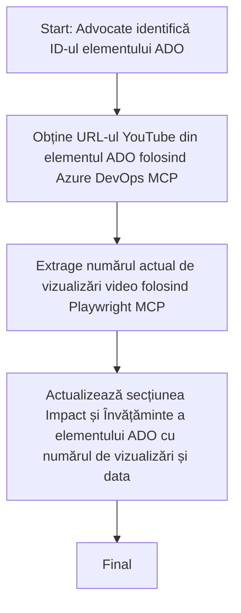

# Studiu de Caz: Actualizarea Elementelor Azure DevOps cu Date YouTube folosind MCP

> **Declinare de responsabilitate:** Există unelte și rapoarte online existente care pot automatiza procesul de actualizare a elementelor Azure DevOps cu date provenite de pe platforme precum YouTube. Scenariul următor este oferit pur și simplu ca un exemplu pentru a ilustra cum pot fi aplicate uneltele MCP pentru automatizare și sarcini de integrare.

## Prezentare generală

Acest studiu de caz demonstrează un exemplu despre cum Model Context Protocol (MCP) și uneltele sale pot fi folosite pentru a automatiza procesul de actualizare a elementelor de lucru Azure DevOps (ADO) cu informații preluate de pe platforme online, cum ar fi YouTube. Scenariul descris este doar o ilustrare a capacităților mai largi ale acestor unelte, care pot fi adaptate la multe alte nevoi similare de automatizare.

În acest exemplu, un Advocate urmărește sesiunile online folosind elementele ADO, unde fiecare element include un URL către un videoclip YouTube. Folosind uneltele MCP, Advocate poate menține elementele ADO actualizate cu cele mai recente metrici video, cum ar fi numărul de vizualizări, într-un mod repetabil și automatizat. Această abordare poate fi generalizată pentru alte cazuri de utilizare în care informațiile de pe surse online trebuie integrate în ADO sau alte sisteme.

## Scenariu

Un Advocate este responsabil pentru monitorizarea impactului sesiunilor online și a implicării comunității. Fiecare sesiune este înregistrată ca un element de lucru ADO în proiectul 'DevRel', iar elementul de lucru conține un câmp pentru URL-ul videoclipului YouTube. Pentru a raporta corect acoperirea sesiunii, Advocate trebuie să actualizeze elementul ADO cu numărul curent de vizualizări ale videoclipului și data la care această informație a fost obținută.

## Unelte utilizate

- [Azure DevOps MCP](https://github.com/microsoft/azure-devops-mcp): Permite accesul programatic și actualizările elementelor de lucru ADO prin MCP.
- [Playwright MCP](https://github.com/microsoft/playwright-mcp): Automatizează acțiunile în browser pentru extragerea datelor actuale de pe paginile web, cum ar fi statisticile videoclipurilor YouTube.

## Flux de lucru pas cu pas

1. **Identificarea elementului ADO**: Începeți cu ID-ul elementului de lucru ADO (de exemplu, 1234) din proiectul 'DevRel'.
2. **Obținerea URL-ului YouTube**: Folosiți unealta Azure DevOps MCP pentru a prelua URL-ul YouTube din elementul de lucru.
3. **Extragerea numărului de vizualizări**: Folosiți unealta Playwright MCP pentru a naviga către URL-ul YouTube și a extrage numărul curent de vizualizări.
4. **Actualizarea elementului ADO**: Scrieți numărul actualizat de vizualizări și data obținerii acestuia în secțiunea 'Impact and Learnings' a elementului de lucru ADO folosind unealta Azure DevOps MCP.

## Exemplu Prompt

```bash
- Work with the ADO Item ID: 1234
- The project is '2025-Awesome'
- Get the YouTube URL for the ADO item
- Use Playwright to get the current views from the YouTube video
- Update the ADO item with the current video views and the updated date of the information
```

## Diagramă Mermaid


## Implementare tehnică

- **Orchestrare MCP**: Fluxul de lucru este orchestrată de un server MCP, care coordonează utilizarea ambelor unelte Azure DevOps MCP și Playwright MCP.
- **Automatizare**: Procesul poate fi declanșat manual sau programat să ruleze la intervale regulate pentru a menține elementele ADO actualizate.
- **Extensibilitate**: Același model poate fi extins pentru a actualiza elementele ADO cu alți metrici online (de exemplu, aprecieri, comentarii) sau de pe alte platforme.

## Rezultate și impact

- **Eficiență**: Reduce efortul manual pentru Advocates prin automatizarea preluării și actualizării metricilor video.
- **Acuratețe**: Asigură că elementele ADO reflectă cele mai recente date disponibile de pe surse online.
- **Repetabilitate**: Oferă un flux de lucru reutilizabil pentru scenarii similare care implică alte surse de date sau metrici.

## Referințe

- [Azure DevOps MCP](https://github.com/microsoft/azure-devops-mcp)
- [Playwright MCP](https://github.com/microsoft/playwright-mcp)
- [Model Context Protocol (MCP)](https://modelcontextprotocol.io/)

## Ce urmează

- Înapoi la: [Prezentare generală a studiilor de caz](./README.md)
- Următorul: [Recuperarea documentației în timp real cu MCP](./docs-mcp/README.md)

---

<!-- CO-OP TRANSLATOR DISCLAIMER START -->
**Declinare de responsabilitate**:  
Acest document a fost tradus folosind serviciul de traducere AI [Co-op Translator](https://github.com/Azure/co-op-translator). Deși ne străduim pentru acuratețe, vă rugăm să aveți în vedere că traducerile automate pot conține erori sau inexactități. Documentul original, în limba sa nativă, trebuie considerat sursa autorizată. Pentru informații critice, se recomandă traducerea profesională realizată de un specialist uman. Nu ne asumăm nicio responsabilitate pentru eventualele neînțelegeri sau interpretări greșite rezultate din utilizarea acestei traduceri.
<!-- CO-OP TRANSLATOR DISCLAIMER END -->