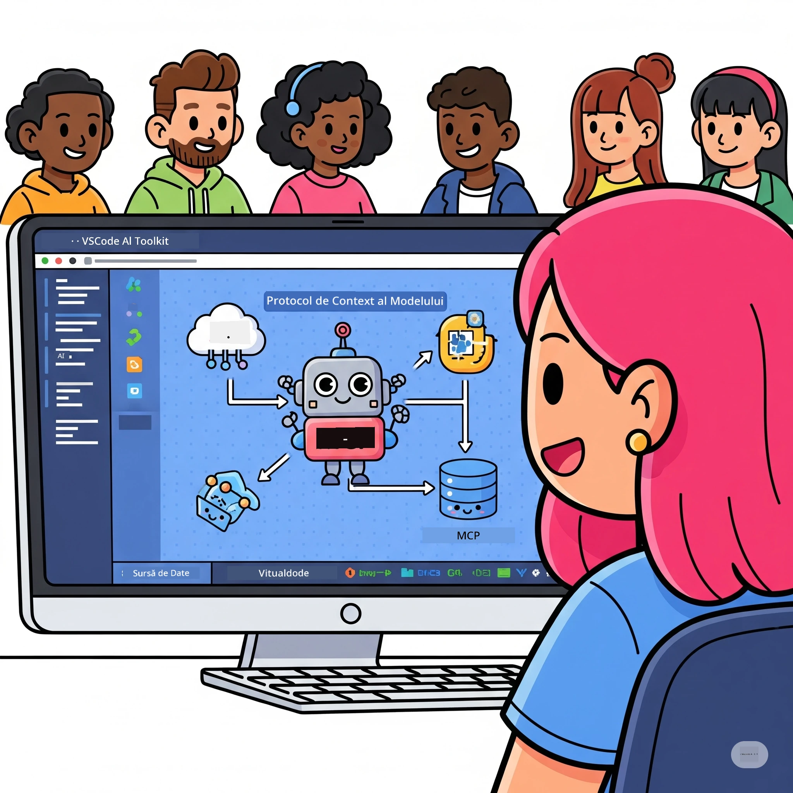
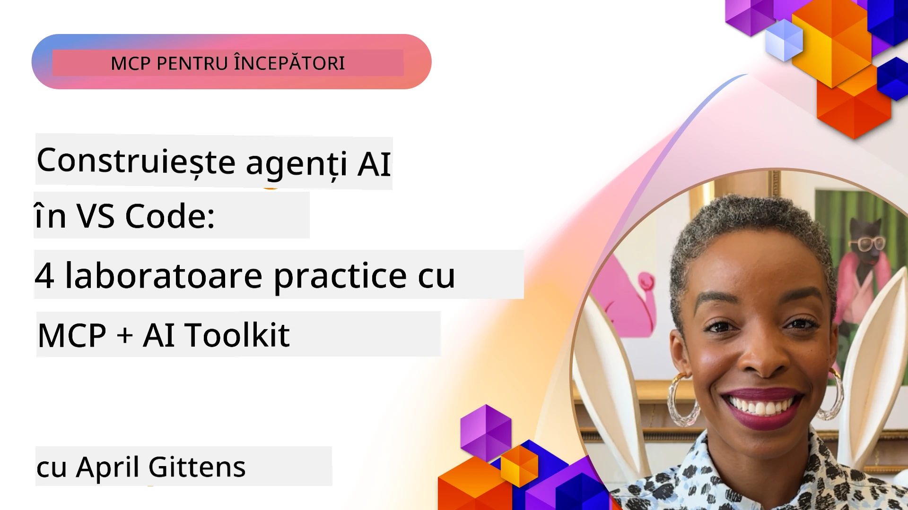

# Simplificarea fluxurilor de lucru AI: Construirea unui server MCP cu AI Toolkit

## 🎯 Prezentare generală

_(Faceți clic pe imaginea de mai sus pentru a viziona videoclipul acestei lecții)_

Bine ați venit la **Atelierul Model Context Protocol (MCP)**! Acest atelier practic cuprinzător combină două tehnologii de ultimă generație pentru a revoluționa dezvoltarea aplicațiilor AI:

- **🔗 Model Context Protocol (MCP)**: Un standard deschis pentru integrarea fără întreruperi a instrumentelor AI
- **🛠️ AI Toolkit pentru Visual Studio Code (AITK)**: Extensia Microsoft puternică pentru dezvoltarea AI

### 🎓 Ce vei învăța

Până la finalul acestui atelier, vei stăpâni arta construirii de aplicații inteligente care leagă modelele AI cu instrumente și servicii din lumea reală. De la testare automată la integrări API personalizate, vei dobândi abilități practice pentru a rezolva provocări complexe de afaceri.

## 🏗️ Stiva Tehnologică

### 🔌 Model Context Protocol (MCP)

MCP este **„USB-C pentru AI”** – un standard universal care conectează modelele AI la instrumente și surse de date externe.

**✨ Caracteristici cheie:**

- 🔄 **Integrare standardizată**: Interfață universală pentru conectarea instrumentelor AI
- 🏛️ **Arhitectură flexibilă**: Servere locale și la distanță prin transport stdio/SSE
- 🧰 **Ecosistem bogat**: Instrumente, prompturi și resurse într-un singur protocol
- 🔒 **Gata pentru mediul enterprise**: Securitate și fiabilitate integrate

**🎯 De ce este important MCP:**  
La fel cum USB-C a eliminat haosul cablurilor, MCP elimină complexitatea integrărilor AI. Un protocol, posibilități infinite.

### 🤖 AI Toolkit pentru Visual Studio Code (AITK)

Extensia emblematică Microsoft pentru dezvoltarea AI care transformă VS Code într-o putere AI.

**🚀 Capabilități de bază:**

- 📦 **Catalog de modele**: Acces la modele de la Azure AI, GitHub, Hugging Face, Ollama
- ⚡ **Inferență locală**: Execuție optimizată ONNX pe CPU/GPU/NPU
- 🏗️ **Agent Builder**: Dezvoltare vizuală de agenți AI cu integrare MCP
- 🎭 **Multi-modal**: Suport pentru text, viziune și output structurat

**💡 Beneficii pentru dezvoltare:**

- Implementare modele fără configurare
- Inginerie vizuală a prompturilor
- Mediu de testare în timp real
- Integrare perfectă cu serverul MCP

## 📚 Parcurs de învățare

### [🚀 Modulul 1: Fundamente AI Toolkit](./lab1/README.md)

**Durată:** 15 minute

- 🛠️ Instalarea și configurarea AI Toolkit pentru VS Code
- 🗂️ Explorarea Catalogului de modele (peste 100 de modele de pe GitHub, ONNX, OpenAI, Anthropic, Google)
- 🎮 Stăpânirea Playground-ului Interactiv pentru testarea modelelor în timp real
- 🤖 Construirea primului agent AI cu Agent Builder
- 📊 Evaluarea performanței modelelor cu metrici integrate (F1, relevanță, similitudine, coerență)
- ⚡ Învățarea procesării în batch și suportul multi-modal

**🎯 Rezultat învățare:** Crearea unui agent AI funcțional cu înțelegere cuprinzătoare a capabilităților AITK

### [🌐 Modulul 2: MCP cu fundamente AI Toolkit](./lab2/README.md)

**Durată:** 20 minute

- 🧠 Stăpânirea arhitecturii și conceptelor Model Context Protocol (MCP)
- 🌐 Explorarea ecosistemului serverelor MCP Microsoft
- 🤖 Construirea unui agent de automatizare browser folosind serverul Playwright MCP
- 🔧 Integrarea serverelor MCP cu AI Toolkit Agent Builder
- 📊 Configurarea și testarea instrumentelor MCP în agenții
- 🚀 Exportarea și implementarea agenților alimentați de MCP pentru producție

**🎯 Rezultat învățare:** Implementarea unui agent AI puternic cu instrumente externe prin MCP

### [🔧 Modulul 3: Dezvoltare avansată MCP cu AI Toolkit](./lab3/README.md)

**Durată:** 20 minute

- 💻 Crearea de servere MCP personalizate cu AI Toolkit
- 🐍 Configurarea și utilizarea celui mai recent MCP Python SDK (v1.9.3)
- 🔍 Configurarea și utilizarea MCP Inspector pentru depanare
- 🛠️ Construirea unui Server Weather MCP cu fluxuri de lucru profesioniste pentru depanare
- 🧪 Depanarea serverelor MCP atât în Agent Builder, cât și în Inspector

**🎯 Rezultat învățare:** Dezvoltarea și depanarea serverelor MCP personalizate cu instrumente moderne

### [🐙 Modulul 4: Dezvoltare practică MCP - Server personalizat GitHub Clone](./lab4/README.md)

**Durată:** 30 minute

- 🏗️ Construirea unui server GitHub Clone MCP pentru fluxuri reale de dezvoltare
- 🔄 Implementarea clonării inteligente a repository-urilor cu validare și gestionare erori
- 📁 Crearea managementului inteligent al directoarelor și integrarea VS Code
- 🤖 Utilizarea modului Agent GitHub Copilot cu instrumente MCP personalizate
- 🛡️ Aplicarea fiabilității gata de producție și compatibilitatea cross-platform

**🎯 Rezultat învățare:** Implementarea unui server MCP gata pentru producție care eficientizează fluxurile reale de dezvoltare

## 💡 Aplicații și impact în lumea reală

### 🏢 Cazuri de utilizare enterprise

#### 🔄 Automatizarea DevOps

Transformă fluxul tău de dezvoltare cu automatizare inteligentă:

- **Management inteligent al repository-urilor**: Revizuire cod AI-driven și decizii de fuziune
- **CI/CD inteligent**: Optimizarea automată a pipeline-urilor pe baza modificărilor de cod
- **Triage probleme**: Clasificare și alocare automată a defectelor

#### 🧪 Revoluția asigurării calității

Ridică testarea cu automatizare alimentată de AI:

- **Generare inteligentă de teste**: Crearea automată de suite de testare cuprinzătoare
- **Testare vizuală de regresie**: Detectare AI a modificărilor UI
- **Monitorizare performanță**: Identificare proactivă și rezolvare a problemelor

#### 📊 Inteligența fluxurilor de date

Construiește fluxuri de prelucrare a datelor mai inteligente:

- **Procese ETL adaptive**: Transformări de date care se auto-optimizează
- **Detectarea anomaliilor**: Monitorizare în timp real a calității datelor
- **Rute inteligente**: Management inteligent al fluxului de date

#### 🎧 Îmbunătățirea experienței clienților

Creează interacțiuni excepționale cu clienții:

- **Suport conștient de context**: Agenți AI cu acces la istoricul clienților
- **Rezolvarea proactivă a problemelor**: Serviciu clienți predictiv
- **Integrare multi-canal**: Experiență AI unificată pe platforme multiple

## 🛠️ Cerințe și configurare

### 💻 Cerințe sistem

| Componentă | Cerință | Note |
|-----------|---------|-------|
| **Sistem de operare** | Windows 10+, macOS 10.15+, Linux | Orice OS modern |
| **Visual Studio Code** | Ultima versiune stabilă | Necesari pentru AITK |
| **Node.js** | v18.0+ și npm | Pentru dezvoltare server MCP |
| **Python** | 3.10+ | Opțional pentru servere MCP Python |
| **Memorie** | Minim 8GB RAM | Recomandat 16GB pentru modele locale |

### 🔧 Mediu de dezvoltare

#### Extensii VS Code recomandate

- **AI Toolkit** (ms-windows-ai-studio.windows-ai-studio)
- **Python** (ms-python.python)
- **Python Debugger** (ms-python.debugpy)
- **GitHub Copilot** (GitHub.copilot) - Opțional dar util

#### Instrumente opționale

- **uv**: Manager modern pachete Python
- **MCP Inspector**: Instrument vizual pentru depanare servere MCP
- **Playwright**: Pentru exemple de automatizare web

## 🎖️ Rezultate de învățare și cale de certificare

### 🏆 Listă de competențe dobândite

Finalizând acest atelier, vei obține competențe în:

#### 🎯 Competențe de bază

- [ ] **Stăpânirea Protocolului MCP**: Înțelegere aprofundată a arhitecturii și a pattern-urilor de implementare
- [ ] **Competență AITK**: Utilizare expertă a AI Toolkit pentru dezvoltare rapidă
- [ ] **Dezvoltare server personalizat**: Construirea, implementarea și mentenanța serverelor MCP de producție
- [ ] **Excelență în integrarea instrumentelor**: Conectarea fluentă a AI cu fluxuri existente de dezvoltare
- [ ] **Aplicarea soluțiilor**: Folosirea abilităților pentru provocări reale de business

#### 🔧 Abilități tehnice

- [ ] Configurarea și configurarea AI Toolkit în VS Code
- [ ] Proiectarea și implementarea serverelor MCP personalizate
- [ ] Integrarea modelelor GitHub cu arhitectura MCP
- [ ] Construirea fluxurilor de testare automate cu Playwright
- [ ] Implementarea agenților AI pentru producție
- [ ] Depanarea și optimizarea performanței serverului MCP

#### 🚀 Capacități avansate

- [ ] Arhitectura integrărilor AI la scară enterprise
- [ ] Implementarea celor mai bune practici de securitate pentru aplicații AI
- [ ] Proiectarea arhitecturilor scalabile pentru servere MCP
- [ ] Crearea lanțurilor de instrumente personalizate pentru domenii specifice
- [ ] Mentorat pentru dezvoltare AI nativă

## 📖 Resurse suplimentare

- [Specificarea MCP (2025-11-25)](https://spec.modelcontextprotocol.io/specification/2025-11-25/)
- [Repozitoriu AI Toolkit GitHub](https://github.com/microsoft/vscode-ai-toolkit)
- [Colecție servere MCP exemplu](https://github.com/modelcontextprotocol/servers)
- [Ghid de bune practici](https://modelcontextprotocol.io/docs/best-practices)
- [OWASP MCP Top 10](https://microsoft.github.io/mcp-azure-security-guide/mcp/) - Cele mai bune practici de securitate

---

**🚀 Gata să revoluționezi fluxul de lucru în dezvoltarea AI?**

Să construim împreună viitorul aplicațiilor inteligente cu MCP și AI Toolkit!

## Ce urmează

Continuă cu: [Modul 11: Laboratoare practice server MCP](../11-MCPServerHandsOnLabs/README.md)

---

<!-- CO-OP TRANSLATOR DISCLAIMER START -->
**Declinare a responsabilității**:
Acest document a fost tradus folosind serviciul de traducere AI [Co-op Translator](https://github.com/Azure/co-op-translator). Deși ne străduim pentru acuratețe, vă rugăm să rețineți că traducerile automate pot conține erori sau inexactități. Documentul original în limba sa nativă trebuie considerat sursa autorizată. Pentru informații critice, se recomandă traducerea profesională realizată de un traducător uman. Nu ne asumăm răspunderea pentru eventualele neînțelegeri sau interpretări greșite rezultate din utilizarea acestei traduceri.
<!-- CO-OP TRANSLATOR DISCLAIMER END -->