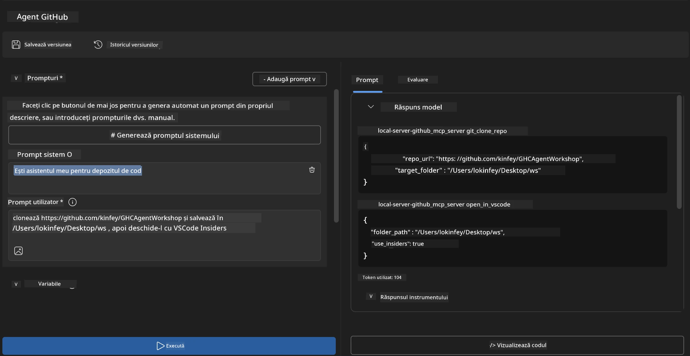
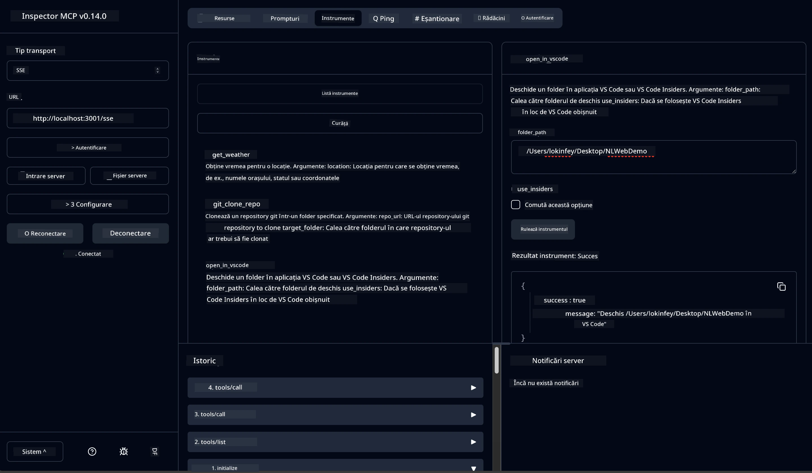

# 🐙 Modulul 4: Dezvoltare Practică MCP - Server Personalizat de Clonare GitHub


> **⚡ Start Rapid:** Construiește un server MCP gata de producție care automatizează clonarea depozitelor GitHub și integrarea VS Code în doar 30 de minute!

## 🎯 Obiective de Învățare

La finalul acestui laborator vei putea:

- ✅ Crea un server MCP personalizat pentru fluxuri de lucru reale de dezvoltare
- ✅ Implementa funcționalitate de clonare a depozitelor GitHub prin MCP
- ✅ Integra servere MCP personalizate cu VS Code și Agent Builder
- ✅ Folosi modul Agent Mode GitHub Copilot cu uneltele MCP personalizate
- ✅ Testa și implementa servere MCP personalizate în medii de producție

## 📋 Precondiții

- Finalizarea laboratoarelor 1-3 (fundamente MCP și dezvoltare avansată)
- Abonament GitHub Copilot ([înregistrare gratuită disponibilă](https://github.com/github-copilot/signup))
- VS Code cu extensiile AI Toolkit și GitHub Copilot
- Git CLI instalat și configurat

## 🏗️ Prezentare Proiect

### **Provocarea De Dezvoltare Reală**
Ca dezvoltatori, folosim frecvent GitHub pentru a clona depozite și a le deschide în VS Code sau VS Code Insiders. Acest proces manual presupune:
1. Deschiderea terminalului/command prompt
2. Navigarea către directorul dorit
3. Rularea comenzii `git clone`
4. Deschiderea VS Code în directorul clonat

**Soluția noastră MCP simplifică totul într-o singură comandă inteligentă!**

### **Ce Vei Construi**
Un **Server MCP de clonare GitHub** (`git_mcp_server`) care oferă:

| Caracteristică | Descriere | Beneficiu |
|---------|-------------|---------|
| 🔄 **Clonare Inteligentă a Depozitelor** | Clonare depozite GitHub cu validare | Verificare automată a erorilor |
| 📁 **Gestionare Inteligentă a Directorului** | Verifică și creează directoare în siguranță | Previne suprascrierea |
| 🚀 **Integrare Cross-Platform VS Code** | Deschide proiecte în VS Code/Insiders | Tranziție fluentă în fluxul de lucru |
| 🛡️ **Gestionare Robustă a Erorilor** | Gestionează probleme de rețea, permisiuni și căi | Fiabilitate gata pentru producție |

---

## 📖 Implementare Pas cu Pas

### Pasul 1: Creează Agent GitHub în Agent Builder

1. **Lansează Agent Builder** prin extensia AI Toolkit
2. **Creează un agent nou** cu următoarea configurație:
   ```
   Agent Name: GitHubAgent
   ```

3. **Inițializează serverul MCP personalizat:**
   - Navighează la **Tools** → **Add Tool** → **MCP Server**
   - Selectează **"Create A new MCP Server"**
   - Alege **șablon Python** pentru flexibilitate maximă
   - **Numele serverului:** `git_mcp_server`

### Pasul 2: Configurează Modul Agent GitHub Copilot

1. **Deschide GitHub Copilot** în VS Code (Ctrl/Cmd + Shift + P → "GitHub Copilot: Open")
2. **Selectează modelul agentului** în interfața Copilot
3. **Alege modelul Claude 3.7** pentru capacități avansate de raționament
4. **Activează integrarea MCP** pentru acces la unelte

> **💡 Sfat Pro:** Claude 3.7 oferă înțelegere superioară a fluxurilor de dezvoltare și a modelelor de gestionare a erorilor.

### Pasul 3: Implementează Funcționalitatea Principală a Serverului MCP

**Folosește următorul prompt detaliat cu GitHub Copilot Agent Mode:**

```
Create two MCP tools with the following comprehensive requirements:

🔧 TOOL A: clone_repository
Requirements:
- Clone any GitHub repository to a specified local folder
- Return the absolute path of the successfully cloned project
- Implement comprehensive validation:
  ✓ Check if target directory already exists (return error if exists)
  ✓ Validate GitHub URL format (https://github.com/user/repo)
  ✓ Verify git command availability (prompt installation if missing)
  ✓ Handle network connectivity issues
  ✓ Provide clear error messages for all failure scenarios

🚀 TOOL B: open_in_vscode
Requirements:
- Open specified folder in VS Code or VS Code Insiders
- Cross-platform compatibility (Windows/Linux/macOS)
- Use direct application launch (not terminal commands)
- Auto-detect available VS Code installations
- Handle cases where VS Code is not installed
- Provide user-friendly error messages

Additional Requirements:
- Follow MCP 1.9.3 best practices
- Include proper type hints and documentation
- Implement logging for debugging purposes
- Add input validation for all parameters
- Include comprehensive error handling
```

### Pasul 4: Testează Serverul MCP

#### 4a. Test în Agent Builder

1. **Lansează configurația de debug** pentru Agent Builder
2. **Configurează agentul tău cu acest prompt de sistem:**

```
SYSTEM_PROMPT:
You are my intelligent coding repository assistant. You help developers efficiently clone GitHub repositories and set up their development environment. Always provide clear feedback about operations and handle errors gracefully.
```

3. **Testează cu scenarii realiste de utilizare:**

```
USER_PROMPT EXAMPLES:

Scenario : Basic Clone and Open
"Clone {Your GitHub Repo link such as https://github.com/kinfey/GHCAgentWorkshop
 } and save to {The global path you specify}, then open it with VS Code Insiders"
```



**Rezultate Așteptate:**
- ✅ Clonare reușită cu confirmarea căii
- ✅ Lansare automată VS Code
- ✅ Mesaje clare de eroare pentru scenarii invalide
- ✅ Gestionare corectă a cazurilor-limită

#### 4b. Test în MCP Inspector




---


**🎉 Felicitări!** Ai creat cu succes un server MCP practic și gata de producție care rezolvă provocări reale din fluxul de lucru de dezvoltare. Serverul tău personalizat de clonare GitHub demonstrează puterea MCP pentru automatizarea și sporirea productivității dezvoltatorilor.

### 🏆 Realizări Obținute:
- ✅ **Dezvoltator MCP** - Serviciu MCP personalizat creat
- ✅ **Automatizator Flux de Lucru** - Procese de dezvoltare simplificate  
- ✅ **Expert în Integrare** - Conectare la multiple unelte de dezvoltare
- ✅ **Gata pentru Producție** - Soluții implementabile construite

---

## 🎓 Finalizarea Workshop-ului: Călătoria Ta cu Model Context Protocol

**Dragă Participant la Workshop,**

Felicitări pentru finalizarea tuturor celor patru module din workshop-ul Model Context Protocol! Ai parcurs un drum lung de la înțelegerea conceptelor de bază AI Toolkit până la construirea de servere MCP gata de producție care rezolvă provocări reale de dezvoltare.

### 🚀 Recapitulare a Parcursului Tău de Învățare:

**[Modulul 1](../lab1/README.md)**: Ai început explorând fundamente AI Toolkit, testarea modelelor și crearea primului agent AI.

**[Modulul 2](../lab2/README.md)**: Ai învățat arhitectura MCP, ai integrat Playwright MCP și ai construit primul agent de automatizare a browserului.

**[Modulul 3](../lab3/README.md)**: Ai avansat la dezvoltarea serverelor MCP personalizate cu serverul Weather MCP și ai stăpânit uneltele de depanare.

**[Modulul 4](../lab4/README.md)**: Acum ai aplicat totul pentru a crea un instrument practic de automatizare a fluxului de lucru GitHub.

### 🌟 Ce Ai Stăpânit:

- ✅ **Ecosistem AI Toolkit**: Modele, agenți și tipare de integrare
- ✅ **Arhitectura MCP**: Design client-server, protocoale de transport și securitate
- ✅ **Unelte pentru Dezvoltatori**: De la Playground la Inspector și implementare în producție
- ✅ **Dezvoltare Personalizată**: Construirea, testarea și implementarea propriilor servere MCP
- ✅ **Aplicații Practice**: Rezolvarea problemelor reale din fluxurile de lucru cu AI

### 🔮 Pașii Următori:

1. **Construiește-ți propriul server MCP**: Aplică aceste abilități pentru a-ți automatiza fluxurile unice
2. **Alătură-te comunității MCP**: Împărtășește creațiile și învață de la alții
3. **Explorează integrarea avansată**: Conectează servere MCP cu sisteme enterprise
4. **Contribuie în open source**: Ajută la îmbunătățirea uneltelor și documentației MCP

Amintește-ți că acest workshop este doar începutul. Ecosistemul Model Context Protocol evoluează rapid, iar tu ești acum pregătit să fii în avangarda uneltelor de dezvoltare alimentate de AI.

**Îți mulțumim pentru participare și dedicare în învățare!**

Sperăm că acest workshop ți-a aprins idei care vor transforma modul în care construiești și interacționezi cu uneltele AI în călătoria ta de dezvoltare.

**Programare plăcută!**

---

## Ce Urmează

Felicitări pentru finalizarea tuturor laboratoarelor din Modulul 10!

- Înapoi la: [Prezentare Modul 10](../README.md)
- Continuă către: [Modulul 11: Laboratoare Practice MCP Server](../../11-MCPServerHandsOnLabs/README.md)

---

<!-- CO-OP TRANSLATOR DISCLAIMER START -->
**Declinarea răspunderii**:  
Acest document a fost tradus folosind serviciul de traducere AI [Co-op Translator](https://github.com/Azure/co-op-translator). Deși ne străduim pentru acuratețe, vă rugăm să țineți cont că traducerile automate pot conține erori sau inexactități. Documentul original în limba sa nativă trebuie considerat sursa autorizată. Pentru informații critice, se recomandă o traducere profesională realizată de un specialist uman. Nu ne asumăm răspunderea pentru eventuale neînțelegeri sau interpretări greșite rezultate din utilizarea acestei traduceri.
<!-- CO-OP TRANSLATOR DISCLAIMER END -->