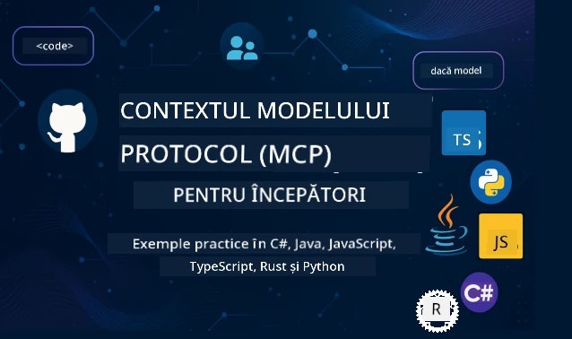

 

[](https://GitHub.com/microsoft/mcp-for-beginners/graphs/contributors)
[](https://GitHub.com/microsoft/mcp-for-beginners/issues)
[](https://GitHub.com/microsoft/mcp-for-beginners/pulls)
[](http://makeapullrequest.com)

[](https://GitHub.com/microsoft/mcp-for-beginners/watchers)
[](https://GitHub.com/microsoft/mcp-for-beginners/fork)
[](https://GitHub.com/microsoft/mcp-for-beginners/stargazers)


[](https://discord.gg/nTYy5BXMWG)

Urmărește acești pași pentru a începe să folosești aceste resurse:
1. **Fă fork la depozit**: Click pe [](https://GitHub.com/microsoft/mcp-for-beginners/fork)
2. **Clonează depozitul**:   `git clone https://github.com/microsoft/mcp-for-beginners.git`
3. **Alătură-te** [](https://discord.gg/nTYy5BXMWG)


### 🌐 Suport Multilingv

#### Suportat prin GitHub Action (Automat și Întotdeauna Actualizat)

<!-- CO-OP TRANSLATOR LANGUAGES TABLE START -->
[Arabic](../ar/README.md) | [Bengali](../bn/README.md) | [Bulgarian](../bg/README.md) | [Burmese (Myanmar)](../my/README.md) | [Chinese (Simplified)](../zh-CN/README.md) | [Chinese (Traditional, Hong Kong)](../zh-HK/README.md) | [Chinese (Traditional, Macau)](../zh-MO/README.md) | [Chinese (Traditional, Taiwan)](../zh-TW/README.md) | [Croatian](../hr/README.md) | [Czech](../cs/README.md) | [Danish](../da/README.md) | [Dutch](../nl/README.md) | [Estonian](../et/README.md) | [Finnish](../fi/README.md) | [French](../fr/README.md) | [German](../de/README.md) | [Greek](../el/README.md) | [Hebrew](../he/README.md) | [Hindi](../hi/README.md) | [Hungarian](../hu/README.md) | [Indonesian](../id/README.md) | [Italian](../it/README.md) | [Japanese](../ja/README.md) | [Kannada](../kn/README.md) | [Korean](../ko/README.md) | [Lithuanian](../lt/README.md) | [Malay](../ms/README.md) | [Malayalam](../ml/README.md) | [Marathi](../mr/README.md) | [Nepali](../ne/README.md) | [Nigerian Pidgin](../pcm/README.md) | [Norwegian](../no/README.md) | [Persian (Farsi)](../fa/README.md) | [Polish](../pl/README.md) | [Portuguese (Brazil)](../pt-BR/README.md) | [Portuguese (Portugal)](../pt-PT/README.md) | [Punjabi (Gurmukhi)](../pa/README.md) | [Romanian](./README.md) | [Russian](../ru/README.md) | [Serbian (Cyrillic)](../sr/README.md) | [Slovak](../sk/README.md) | [Slovenian](../sl/README.md) | [Spanish](../es/README.md) | [Swahili](../sw/README.md) | [Swedish](../sv/README.md) | [Tagalog (Filipino)](../tl/README.md) | [Tamil](../ta/README.md) | [Telugu](../te/README.md) | [Thai](../th/README.md) | [Turkish](../tr/README.md) | [Ukrainian](../uk/README.md) | [Urdu](../ur/README.md) | [Vietnamese](../vi/README.md)

> **Preferi să clonezi local?**
>
> Acest depozit include traduceri în peste 50 de limbi, ceea ce mărește semnificativ dimensiunea descărcării. Pentru a clona fără traduceri, folosește sparse checkout:
>
> **Bash / macOS / Linux:**
> ```bash
> git clone --filter=blob:none --sparse https://github.com/microsoft/mcp-for-beginners.git
> cd mcp-for-beginners
> git sparse-checkout set --no-cone '/*' '!translations' '!translated_images'
> ```
>
> **CMD (Windows):**
> ```cmd
> git clone --filter=blob:none --sparse https://github.com/microsoft/mcp-for-beginners.git
> cd mcp-for-beginners
> git sparse-checkout set --no-cone "/*" "!translations" "!translated_images"
> ```
>
> Astfel primești tot ce ai nevoie pentru a finaliza cursul, cu o descărcare mult mai rapidă.
<!-- CO-OP TRANSLATOR LANGUAGES TABLE END -->

# 🚀 Curriculum Protocolul Contextului Modelului (MCP) pentru Începători

## **Învață MCP cu Exemple Practice de Cod în C#, Java, JavaScript, Rust, Python și TypeScript**

## 🧠 Prezentare generală a Curriculumului Protocolului Contextului Modelului
Bine ai venit în călătoria ta în lumea Protocolului Contextului Modelului! Dacă te-ai întrebat vreodată cum aplicațiile de AI comunică cu diferite instrumente și servicii, ești pe punctul de a descoperi soluția elegantă care transformă modul în care dezvoltatorii creează sisteme inteligente.

Gândește-te la MCP ca la un traducător universal pentru aplicațiile AI - așa cum porturile USB îți permit să conectezi orice dispozitiv la calculatorul tău, MCP permite modelelor AI să se conecteze la orice instrument sau serviciu într-un mod standardizat. Fie că construiești primul tău chatbot sau lucrezi la fluxuri complexe de lucru AI, înțelegerea MCP îți va oferi puterea de a crea aplicații mai capabile și flexibile.

Acest curriculum este conceput cu răbdare și grijă pentru parcursul tău de învățare. Vom începe cu concepte simple pe care le înțelegi deja și vom construi treptat expertiza ta prin practică directă cu limbajul tău de programare preferat. Fiecare pas include explicații clare, exemple practice și multă încurajare pe parcurs.

La finalul acestei călătorii vei avea încrederea să creezi propriile servere MCP, să le integrezi cu platforme AI populare și să înțelegi cum această tehnologie modelează viitorul dezvoltării AI. Hai să începem această aventură captivantă împreună!

### Documentație Oficială și Specificații

Acest curriculum este aliniat cu **Specificația MCP 2025-11-25** (ultima versiune stabilă). Specificația MCP folosește versiuni bazate pe dată (formatul YYYY-MM-DD) pentru o evidență clară a versiunilor protocolului.

Aceste resurse devin mai valoroase pe măsură ce înțelegerea ta crește, dar nu te simți presat să le citești pe toate imediat. Începe cu domeniile care te interesează cel mai mult!
- 📘 [Documentația MCP](https://modelcontextprotocol.io/) – Aceasta este resursa ta principală pentru tutoriale pas cu pas și ghiduri de utilizare. Documentația este scrisă având în vedere începătorii, oferind exemple clare pe care le poți urmări în ritmul tău.
- 📜 [Specificația MCP](https://modelcontextprotocol.io/specification/2025-11-25) – Gândește-te la aceasta ca la manualul tău complet de referință. Pe parcursul curriculumului, vei reveni aici pentru a căuta detalii specifice și pentru a explora funcționalități avansate.
- 📜 [Versiunea Specificației MCP](https://modelcontextprotocol.io/specification/versioning) – Conține informații despre istoricul versiunilor protocolului și modul în care MCP utilizează versiuni bazate pe dată (YYYY-MM-DD).
- 🧑‍💻 [Depozitul GitHub MCP](https://github.com/modelcontextprotocol) – Aici vei găsi SDK-uri, instrumente și exemple de cod în mai multe limbaje de programare. Este ca o comoară de exemple practice și componente gata de utilizat.
- 🌐 [Comunitatea MCP](https://github.com/orgs/modelcontextprotocol/discussions) – Alătură-te altor învățăcei și dezvoltatori experimentați în discuții despre MCP. Este o comunitate de suport unde întrebările sunt binevenite și cunoștințele sunt împărtășite liber.
  
## Obiectivele de Învățare

La finalul acestui curriculum, te vei simți încrezător și entuziasmat de noile tale abilități. Iată ce vei realiza:

• **Înțelege fundamentele MCP**: Vei înțelege ce este Protocolul Contextului Modelului și de ce revoluționează modul în care aplicațiile AI lucrează împreună, folosind analogii și exemple clare.

• **Construiește primul tău server MCP**: Vei crea un server MCP funcțional în limbajul de programare ales, începând cu exemple simple și dezvoltând abilitățile pas cu pas.

• **Conectează modelele AI la unelte reale**: Vei învăța cum să realizezi puntea dintre modelele AI și serviciile reale, oferind aplicațiilor tale capacități noi și puternice.

• **Implementează cele mai bune practici de securitate**: Vei înțelege cum să păstrezi implementările MCP sigure și protejate, protejând atât aplicațiile cât și utilizatorii tăi.

• **Deplasează cu încredere**: Vei ști cum să duci proiectele MCP din faza de dezvoltare în producție, cu strategii practice de implementare care funcționează în lumea reală.

• **Alătură-te comunității MCP**: Vei deveni parte a unei comunități în creștere de dezvoltatori care modelează viitorul dezvoltării aplicațiilor AI. 

## Fundamente Esențiale

Înainte să intrăm în detalii despre MCP, asigură-te că te simți confortabil cu câteva concepte de bază. Nu-ți face griji dacă nu ești expert în aceste domenii - vom explica tot ce trebuie să știi pe parcurs!

### Înțelegerea Protocolurilor (Fundația)

Gândește-te la un protocol ca la regulile unei conversații. Când suni un prieten, amândoi știți să spuneți "bună" când răspundeți, să vorbiți pe rând și să spuneți "la revedere" când terminați. Programele de calculator au nevoie de reguli similare pentru a comunica eficient.

MCP este un protocol - un set de reguli convenite care ajută modelele și aplicațiile AI să aibă "conversații" productive cu instrumente și servicii. Așa cum regulile unei conversații fac comunicarea umană mai ușoară, MCP face comunicarea aplicațiilor AI mult mai fiabilă și puternică.

### Relațiile Client-Server (Cum Lucrează Programele Împreună)

Folosești zilnic relații client-server! Când folosești un browser web (clientul) pentru a vizita un site, te conectezi la un server web care îți trimite conținutul paginii. Browserul știe cum să ceară informații, iar serverul știe cum să răspundă.

În MCP, avem o relație similară: modelele AI acționează ca și clienți care solicită informații sau acțiuni, iar serverele MCP oferă aceste capacități. E ca și cum ai avea un asistent de încredere (serverul) pe care AI-ul îl poate ruga să realizeze sarcini specifice.

### De ce Contează Standardizarea (Pentru a Face Lucrurile să Funcționeze Împreună)

Imaginează-ți că fiecare producător de mașini ar folosi pompe de benzină cu forme diferite - ai avea nevoie de un adaptor diferit pentru fiecare mașină! Standardizarea înseamnă să cădem de acord asupra unor abordări comune astfel încât lucrurile să funcționeze perfect împreună.

MCP oferă această standardizare pentru aplicațiile AI. În loc ca fiecare model AI să aibă nevoie de cod personalizat pentru a lucra cu fiecare unealtă, MCP creează o modalitate universală de comunicare. Aceasta înseamnă că dezvoltatorii pot construi instrumente o singură dată și să le facă să funcționeze cu multe sisteme AI diferite.

## 🧭 Prezentare generală a Parcursului tău de Învățare

Parcursul tău MCP este structurat cu grijă pentru a-ți construi încrederea și abilitățile progresiv. Fiecare fază introduce concepte noi în timp ce consolidează ceea ce ai învățat deja.

### 🌱 Faza de Bază: Înțelegerea Conceptelor Fundamentale (Modulele 0-2)

Aici începe aventura ta! Îți vom prezenta conceptele MCP folosind analogii familiare și exemple simple. Vei înțelege ce este MCP, de ce există și cum se potrivește în lumea mai largă a dezvoltării AI.

• **Modulul 0 - Introducere în MCP**: Vom începe explorând ce este MCP și de ce este atât de important pentru aplicațiile AI moderne. Vei vedea exemple reale de MCP în acțiune și vei înțelege cum rezolvă probleme comune cu care se confruntă dezvoltatorii.

• **Modulul 1 - Explicarea Conceptelor de Bază**: Aici vei învăța blocurile esențiale ale MCP. Vom folosi numeroase analogii și exemple vizuale pentru a ne asigura că aceste concepte par naturale și ușor de înțeles.

• **Modulul 2 - Securitatea în MCP**: Securitatea poate părea intimidantă, dar îți vom arăta cum MCP include funcții de siguranță integrate și te vom învăța cele mai bune practici care protejează aplicațiile de la început.

### 🔨 Faza de Construire: Crearea Primelor Implementări (Modulul 3)

Acum începe adevărata distracție! Vei avea experiență practică construind servere și clienți MCP reali. Nu îți face griji - vom începe simplu și te vom ghida pas cu pas.
Acest modul include multiple ghiduri practice care vă permit să exersați în limbajul de programare preferat. Veți crea primul server, veți construi un client pentru a se conecta la acesta și chiar veți integra cu instrumente populare de dezvoltare precum VS Code.

Fiecare ghid include exemple complete de cod, sfaturi pentru depanare și explicații despre motivele pentru care facem anumite alegeri de design. La finalul acestei faze, veți avea implementări MCP funcționale de care să fiți mândri!

### 🚀 Faza de Dezvoltare: Concepte Avansate și Aplicații din Lumea Reală (Modulele 4-5)

După ce ați stăpânit bazele, sunteți pregătit să explorați caracteristici MCP mai sofisticate. Vom acoperi strategii practice de implementare, tehnici de depanare și subiecte avansate precum integrarea AI multimodală.

De asemenea, veți învăța cum să scalați implementările MCP pentru utilizare în producție și să integrați cu platforme cloud precum Azure. Aceste module vă pregătesc să construiți soluții MCP care pot face față cerințelor din lumea reală.

### 🌟 Faza de Măiestrie: Comunitate și Specializare (Modulele 6-11)

Faza finală se concentrează pe aderarea la comunitatea MCP și specializarea în domeniile care vă interesează cel mai mult. Veți învăța cum să contribuiți la proiecte open-source MCP, să implementați tipare avansate de autentificare și să construiți soluții integrate complexe cu baze de date.

Modulul 11 merită o mențiune specială – este un traseu complet de învățare hands-on cu 13 laboratoare care vă învață să construiți servere MCP gata de producție cu integrare PostgreSQL. Este ca un proiect final care reunește tot ce ați învățat!

### 📚 Structura Completă a Curriculumului

| Modul | Subiect | Descriere | Link |
|--------|-------|-------------|------|
| **Modulele 0-3: Fundamente** | | | |
| 00 | Introducere în MCP | Prezentare generală a Protocolului de Context Model și importanța sa în pipeline-urile AI | [Citește mai mult](./00-Introducere/README.md) |
| 01 | Concepte de bază explicate | Explorare detaliată a conceptelor fundamentale MCP | [Citește mai mult](./01-ConcepteDeBaza/README.md) |
| 02 | Securitate în MCP | Amenințări de securitate și bune practici | [Citește mai mult](./02-Securitate/README.md) |
| 03 | Primii pași cu MCP | Configurarea mediului, servere/cliende de bază, integrare | [Citește mai mult](./03-PrimiiPasi/README.md) |
| **Modul 3: Construirea primului server și client** | | | |
| 3.1 | Primul server | Creează primul tău server MCP | [Ghid](./03-PrimiiPasi/01-primul-server/README.md) |
| 3.2 | Primul client | Dezvoltă un client MCP de bază | [Ghid](./03-PrimiiPasi/02-client/README.md) |
| 3.3 | Client cu LLM | Integrează modele mari de limbaj | [Ghid](./03-PrimiiPasi/03-llm-client/README.md) |
| 3.4 | Integrare VS Code | Utilizează servere MCP în VS Code | [Ghid](./03-PrimiiPasi/04-vscode/README.md) |
| 3.5 | Server stdio | Creează servere folosind transportul stdio | [Ghid](./03-PrimiiPasi/05-stdio-server/README.md) |
| 3.6 | Streaming HTTP | Implementează streaming HTTP în MCP | [Ghid](./03-PrimiiPasi/06-http-streaming/README.md) |
| 3.7 | AI Toolkit | Utilizează AI Toolkit cu MCP | [Ghid](./03-PrimiiPasi/07-aitk/README.md) |
| 3.8 | Testare | Testează implementarea serverului MCP | [Ghid](./03-PrimiiPasi/08-testing/README.md) |
| 3.9 | Implementare | Publică serverele MCP în producție | [Ghid](./03-PrimiiPasi/09-deployment/README.md) |
| 3.10 | Utilizare avansată a serverului | Utilizează servere avansate pentru funcționalități avansate și arhitectură îmbunătățită | [Ghid](./03-PrimiiPasi/10-advanced/README.md) |
| 3.11 | Autentificare simplă | Un capitol care te învață autentificarea de la bază și RBAC | [Ghid](./03-PrimiiPasi/11-simple-auth/README.md) |
| 3.12 | Gazde MCP | Configurează Claude Desktop, Cursor, Cline și alte gazde MCP | [Ghid](./03-PrimiiPasi/12-mcp-hosts/README.md) |
| 3.13 | Inspector MCP | Depanează și testează serverele MCP cu instrumentul Inspector | [Ghid](./03-PrimiiPasi/13-mcp-inspector/README.md) |
| **Modulele 4-5: Practic & Avansat** | | | |
| 04 | Implementare practică | SDK-uri, depanare, testare, șabloane de prompt reutilizabile | [Citește mai mult](./04-ImplementarePractica/README.md) |
| 4.1 | Paginație | Tratează seturi mari de rezultate cu paginație bazată pe cursor | [Ghid](./04-ImplementarePractica/paginatie/README.md) |
| 05 | Subiecte avansate în MCP | AI multimodal, scalare, utilizare în întreprinderi | [Citește mai mult](./05-SubiecteAvansate/README.md) |
| 5.1 | Integrare Azure | Integrare MCP cu Azure | [Ghid](./05-SubiecteAvansate/mcp-integration/README.md) |
| 5.2 | Multimodalitate | Lucrul cu multiple modalități | [Ghid](./05-SubiecteAvansate/mcp-multi-modalitate/README.md) |
| 5.3 | Demo OAuth2 | Implementează autentificare OAuth2 | [Ghid](./05-SubiecteAvansate/mcp-oauth2-demo/README.md) |
| 5.4 | Contexturi rădăcină | Înțelege și implementează contexturi rădăcină | [Ghid](./05-SubiecteAvansate/mcp-context-radacina/README.md) |
| 5.5 | Rutare | Strategii de rutare MCP | [Ghid](./05-SubiecteAvansate/mcp-routing/README.md) |
| 5.6 | Eșantionare | Tehnici de sampling în MCP | [Ghid](./05-SubiecteAvansate/mcp-sampling/README.md) |
| 5.7 | Scalare | Scalează implementările MCP | [Ghid](./05-SubiecteAvansate/mcp-scaling/README.md) |
| 5.8 | Securitate | Considerații avansate de securitate | [Ghid](./05-SubiecteAvansate/mcp-securitate/README.md) |
| 5.9 | Căutare Web | Implementează capabilități de căutare web | [Ghid](./05-SubiecteAvansate/web-search-mcp/README.md) |
| 5.10 | Streaming în timp real | Construiește funcționalitate de streaming în timp real | [Ghid](./05-SubiecteAvansate/mcp-realtimestreaming/README.md) |
| 5.11 | Căutare în timp real | Implementează căutare în timp real | [Ghid](./05-SubiecteAvansate/mcp-realtimesearch/README.md) |
| 5.12 | Autentificare Entra ID | Autentificare cu Microsoft Entra ID | [Ghid](./05-SubiecteAvansate/mcp-securitate-entra/README.md) |
| 5.13 | Integrare Foundry | Integrează cu Azure AI Foundry | [Ghid](./05-SubiecteAvansate/mcp-foundry-agent-integration/README.md) |
| 5.14 | Ingineria Contextelor | Tehnici pentru ingineria eficientă a contextului | [Ghid](./05-SubiecteAvansate/mcp-contextengineering/README.md) |
| 5.15 | Transport personalizat MCP | Implementări de transport personalizate | [Ghid](./05-SubiecteAvansate/mcp-transport/README.md) |
| 5.16 | Caracteristici Protocol | Notificări de progres, anulare, șabloane de resurse | [Ghid](./05-SubiecteAvansate/mcp-protocol-features/README.md) |
| **Modulele 6-10: Comunitate & Bune Practici** | | | |
| 06 | Contribuții Comunitare | Cum să contribuiți la ecosistemul MCP | [Ghid](./06-ContributiiComunitare/README.md) |
| 07 | Lecții din adopția timpurie | Povești de implementare din lumea reală | [Ghid](./07-LectiiDinAdoptieTimpurie/README.md) |
| 08 | Bune practici pentru MCP | Performanță, toleranță la erori, reziliență | [Ghid](./08-BunePractici/README.md) |
| 09 | Studii de caz MCP | Exemple practice de implementare | [Ghid](./09-StudiiDeCaz/README.md) |
| 10 | Workshop hands-on | Construirea unui server MCP cu AI Toolkit | [Laborator](./10-StreamliningAIWorkflowsBuildingAnMCPServerWithAIToolkit/README.md) |
| **Modul 11: Laborator Practic Server MCP** | | | |
| 11 | Integrare MCP Server cu Bază de Date | Traseu complet hands-on cu 13 laboratoare pentru integrare PostgreSQL | [Laboratoare](./11-MCPServerHandsOnLabs/README.md) |
| 11.1 | Introducere | Prezentare generală MCP cu integrare baze de date și caz de utilizare retail analytics | [Laborator 00](./11-MCPServerHandsOnLabs/00-Introducere/README.md) |
| 11.2 | Arhitectură de bază | Înțelegerea arhitecturii serverului MCP, straturilor bazei de date și modelelor de securitate | [Laborator 01](./11-MCPServerHandsOnLabs/01-Arhitectura/README.md) |
| 11.3 | Securitate & Multi-Tenancy | Securitate pe rânduri, autentificare și acces multi-tenant la date | [Laborator 02](./11-MCPServerHandsOnLabs/02-Securitate/README.md) |
| 11.4 | Configurare mediu | Configurarea mediului de dezvoltare, Docker, resurse Azure | [Laborator 03](./11-MCPServerHandsOnLabs/03-Setup/README.md) |
| 11.5 | Design Bază de Date | Configurare PostgreSQL, design schemă retail și date de exemplu | [Laborator 04](./11-MCPServerHandsOnLabs/04-BazaDeDate/README.md) |
| 11.6 | Implementare MCP Server | Construirea serverului FastMCP cu integrare baze de date | [Laborator 05](./11-MCPServerHandsOnLabs/05-MCP-Server/README.md) |
| 11.7 | Dezvoltare unelte | Crearea uneltelor pentru interogare baze de date și introspecție schemă | [Laborator 06](./11-MCPServerHandsOnLabs/06-Unelte/README.md) |
| 11.8 | Căutare semantică | Implementarea vector embeddings cu Azure OpenAI și pgvector | [Laborator 07](./11-MCPServerHandsOnLabs/07-Cautare-Semantica/README.md) |
| 11.9 | Testare & Depanare | Strategii de testare, unelte pentru depanare și metode de validare | [Laborator 08](./11-MCPServerHandsOnLabs/08-Testare/README.md) |
| 11.10 | Integrare VS Code | Configurarea integrării MCP în VS Code și utilizarea AI Chat | [Laborator 09](./11-MCPServerHandsOnLabs/09-VS-Code/README.md) |
| 11.11 | Strategii de implementare | Implementare cu Docker, Azure Container Apps și considerente pentru scalare | [Laborator 10](./11-MCPServerHandsOnLabs/10-Deployment/README.md) |
| 11.12 | Monitorizare | Application Insights, logging, monitorizare performanță | [Laborator 11](./11-MCPServerHandsOnLabs/11-Monitorizare/README.md) |
| 11.13 | Bune practici | Optimizarea performanței, întărirea securității și sfaturi pentru producție | [Laborator 12](./11-MCPServerHandsOnLabs/12-BunePractici/README.md) |

### 💻 Proiecte de Cod Exemplu

Unul dintre cele mai captivante părți ale învățării MCP este să vezi cum abilitățile tale de programare se dezvoltă progresiv. Am proiectat exemplele noastre de cod să înceapă simplu și să devină tot mai sofisticate pe măsură ce înțelegerea ta crește. Iată cum introducem conceptele – cu cod ușor de înțeles dar care demonstrează principii reale MCP, vei înțelege nu doar ce face acest cod, ci și de ce este structurat astfel și cum se potrivește în aplicații MCP mai mari.

#### Exemple de calculatoare MCP de bază

| Limbaj | Descriere | Link |
|----------|-------------|------|
| C# | Exemplu server MCP | [Vezi cod](./03-PrimiiPasi/exemple/csharp/README.md) |
| Java | Calculator MCP | [Vezi cod](./03-PrimiiPasi/exemple/java/calculator/README.md) |
| JavaScript | Demo MCP | [Vezi cod](./03-PrimiiPasi/exemple/javascript/README.md) |
| Python | Server MCP | [Vezi cod](../../03-PrimiiPasi/exemple/python/mcp_calculator_server.py) |
| TypeScript | Exemplu MCP | [Vezi cod](./03-PrimiiPasi/exemple/typescript/README.md) |
| Rust | Exemplu MCP | [Vezi cod](./03-PrimiiPasi/exemple/rust/README.md) |

#### Implementări MCP Avansate

| Limbaj | Descriere | Link |
|----------|-------------|------|
| C# | Exemplu Avansat | [Vezi cod](./04-ImplementarePractica/exemple/csharp/README.md) |
| Java cu Spring | Exemplu Container App | [Vezi cod](./04-ImplementarePractica/exemple/java/containerapp/README.md) |
| JavaScript | Exemplu Avansat | [Vezi cod](./04-ImplementarePractica/exemple/javascript/README.md) |
| Python | Implementare Complexă | [Vezi cod](./04-ImplementarePractica/exemple/python/README.md) |
| TypeScript | Exemplu Container | [Vezi cod](./04-ImplementarePractica/exemple/typescript/README.md) |


## 🎯 Cerințe pentru Învățarea MCP

Pentru a profita la maximum de acest curriculum, ar trebui să aveți:

- Cunoștințe de bază de programare în cel puțin unul dintre următoarele limbaje: C#, Java, JavaScript, Python sau TypeScript
- Înțelegerea modelului client-server și a API-urilor
- Familiaritate cu conceptele REST și HTTP
- (Opțional) Cunoștințe fundamentale despre conceptele AI/ML

- Participarea la discuțiile comunității noastre pentru suport

## 📚 Ghid de Studiu & Resurse

Acest depozit include mai multe resurse pentru a vă ajuta să navigați și să învățați eficient:

### Ghid de Studiu
Un [Ghid de Studiu](./study_guide.md) cuprinzător este disponibil pentru a vă ajuta să navigați eficient prin acest depozit. Această hartă vizuală a curriculumului arată cum se conectează toate subiectele și oferă îndrumări despre cum să folosiți eficient proiectele de exemplu. Este deosebit de util dacă sunteți un învățăcel vizual căruia îi place să vadă imaginea de ansamblu.

Ghidul include:
- O hartă vizuală a curriculumului care arată toate subiectele acoperite
- Defalcarea detaliată a fiecărei secțiuni din depozit
- Îndrumări despre cum să folosiți proiectele de exemplu
- Căi de învățare recomandate pentru diferite niveluri de competență
- Resurse suplimentare pentru a completa călătoria dvs. de învățare

### Istoric modificări

Menținem un [Istoric modificări](./changelog.md) detaliat care urmărește toate actualizările semnificative aduse materialelor curriculare, astfel încât să puteți fi la curent cu cele mai recente îmbunătățiri și adăugiri.
- Adăugiri de conținut noi
- Modificări structurale
- Îmbunătățiri ale funcționalităților
- Actualizări ale documentației

## 🛠️ Cum să folosiți eficient acest curriculum

Fiecare lecție din acest ghid include:

1. Explicații clare ale conceptelor MCP  
2. Exemple live de cod în mai multe limbi  
3. Exerciții pentru construirea de aplicații MCP reale  
4. Resurse suplimentare pentru învățăcei avansați

### Haideți să învățăm MCP cu C# - Seria de tutoriale
Să învățăm despre Model Context Protocol (MCP), un cadru de ultimă generație conceput să standardizeze interacțiunile între modelele AI și aplicațiile client. Prin această sesiune prietenoasă începătorilor, vă vom introduce în MCP și vă vom ghida în crearea primului server MCP.
#### C#: [https://aka.ms/letslearnmcp-csharp](https://aka.ms/letslearnmcp-csharp)
#### Java: [https://aka.ms/letslearnmcp-java](https://aka.ms/letslearnmcp-java)
#### JavaScript: [https://aka.ms/letslearnmcp-javascript](https://aka.ms/letslearnmcp-javascript)
#### Python: [https://aka.ms/letslearnmcp-python](https://aka.ms/letslearnmcp-python)

## 🎓 Călătoria ta MCP începe

Felicitări! Tocmai ai făcut primul pas într-o călătorie captivantă care îți va extinde capacitățile de programare și te va conecta la frontiera dezvoltării AI.

### Ce ai realizat deja

Citind această introducere, ai început deja să construiești baza ta de cunoștințe MCP. Înțelegi ce este MCP, de ce contează și cum acest curriculum te va sprijini în călătoria ta de învățare. Acesta este un succes important și începutul expertizei tale în această tehnologie importantă.

### Aventurile ce urmează

Pe măsură ce avansezi prin module, ține minte că orice expert a fost odată începător. Conceputele care acum par complexe vor deveni naturale pe măsură ce practici și le aplici. Fiecare pas mic clădește capabilități puternice care te vor servi pe tot parcursul carierei tale de dezvoltare.

### Rețeaua ta de sprijin

Te alături unei comunități de învățăcei și experți pasionați de MCP și dornici să ajute pe alții să reușească. Indiferent dacă te blochezi la o provocare de codare sau ești entuziasmat să împărtășești o descoperire, comunitatea este aici să te sprijine.

Dacă te blochezi sau ai întrebări despre construirea aplicațiilor AI. Alătură-te altor învățăcei și dezvoltatori experimentați în discuții despre MCP. Este o comunitate suportivă unde întrebările sunt binevenite și cunoștințele sunt împărtășite liber.

[](https://discord.gg/nTYy5BXMWG)

Dacă ai feedback despre produs sau erori în timpul dezvoltării vizitează:

[](https://aka.ms/foundry/forum)

### Ești gata să începi?

Aventura ta MCP începe acum! Începe cu Modulul 0 pentru a intra în primele experiențe practice MCP sau explorează proiectele exemplu pentru a vedea ce vei construi. Amintește-ți - orice expert a început exact de unde ești tu acum, iar cu răbdare și practică vei fi uimit de ceea ce poți realiza.

Bine ai venit în lumea dezvoltării Model Context Protocol. Să construim ceva uimitor împreună!

## 🤝 Contribuția la comunitatea de învățare

Acest curriculum devine mai puternic cu contribuții de la învățăcei ca tine! Fie că corectezi o greșeală tipografică, sugerezi o explicație mai clară sau adaugi un nou exemplu, contribuțiile tale ajută alți începători să reușească.

Mulțumiri Profesionistului Valorizat Microsoft [Shivam Goyal](https://www.linkedin.com/in/shivam2003/) pentru contribuțiile cu mostre de cod.

Procesul de contribuție este conceput să fie primitor și suportiv. Cele mai multe contribuții necesită un Acord de Licență pentru Contribuitor (CLA), dar instrumentele automate te vor ghida lin prin proces.

## 📜 Învățare Open Source

Întreg acest curriculum este disponibil sub licența MIT [LICENSE](../../LICENSE), ceea ce înseamnă că îl poți folosi, modifica și partaja liber. Acest lucru susține misiunea noastră de a face cunoștințele MCP accesibile dezvoltatorilor oriunde.

## 🤝 Ghiduri de contribuție

Acest proiect primește cu bucurie contribuții și sugestii. Majoritatea contribuțiilor necesită să fii de acord cu un
Acord de Licență pentru Contribuitor (CLA) care declară că ai dreptul și de fapt ne acorzi
drepturile să folosim contribuția ta. Pentru detalii, vizitează <https://cla.opensource.microsoft.com>.

Când trimiți o solicitare pull request, un bot CLA va determina automat dacă trebuie să furnizezi
un CLA și va decora PR-ul corespunzător (de ex., verificare statut, comentariu). Urmează pur și simplu instrucțiunile
furnizate de bot. Trebuie să faci acest lucru o singură dată pentru toate depozitele care folosesc CLA-ul nostru.

Acest proiect a adoptat [Codul de Conduită pentru Open Source Microsoft](https://opensource.microsoft.com/codeofconduct/).
Pentru mai multe informații vezi FAQ-ul [Codului de Conduită](https://opensource.microsoft.com/codeofconduct/faq/) sau
contactează [opencode@microsoft.com](mailto:opencode@microsoft.com) pentru întrebări sau comentarii suplimentare.

---

*Ești pregătit să începi călătoria MCP? Începe cu [Modulul 00 - Introducere în MCP](./00-Introduction/README.md) și fă-ți primii pași în lumea dezvoltării Model Context Protocol!*


## 🎒 Alte cursuri
Echipa noastră produce și alte cursuri! Verifică:

<!-- CO-OP TRANSLATOR OTHER COURSES START -->
### LangChain
[](https://aka.ms/langchain4j-for-beginners)
[](https://aka.ms/langchainjs-for-beginners?WT.mc_id=m365-94501-dwahlin)
[](https://github.com/microsoft/langchain-for-beginners?WT.mc_id=m365-94501-dwahlin)
---

### Azure / Edge / MCP / Agenți
[](https://github.com/microsoft/AZD-for-beginners?WT.mc_id=academic-105485-koreyst)
[](https://github.com/microsoft/edgeai-for-beginners?WT.mc_id=academic-105485-koreyst)
[](https://github.com/microsoft/mcp-for-beginners?WT.mc_id=academic-105485-koreyst)
[](https://github.com/microsoft/ai-agents-for-beginners?WT.mc_id=academic-105485-koreyst)

---
 
### Serie Generative AI
[](https://github.com/microsoft/generative-ai-for-beginners?WT.mc_id=academic-105485-koreyst)
[-9333EA?style=for-the-badge&labelColor=E5E7EB&color=9333EA)](https://github.com/microsoft/Generative-AI-for-beginners-dotnet?WT.mc_id=academic-105485-koreyst)
[-C084FC?style=for-the-badge&labelColor=E5E7EB&color=C084FC)](https://github.com/microsoft/generative-ai-for-beginners-java?WT.mc_id=academic-105485-koreyst)
[-E879F9?style=for-the-badge&labelColor=E5E7EB&color=E879F9)](https://github.com/microsoft/generative-ai-with-javascript?WT.mc_id=academic-105485-koreyst)

---
 
### Învățare de bază
[](https://aka.ms/ml-beginners?WT.mc_id=academic-105485-koreyst)
[](https://aka.ms/datascience-beginners?WT.mc_id=academic-105485-koreyst)
[](https://aka.ms/ai-beginners?WT.mc_id=academic-105485-koreyst)
[](https://github.com/microsoft/Security-101?WT.mc_id=academic-96948-sayoung)
[](https://aka.ms/webdev-beginners?WT.mc_id=academic-105485-koreyst)
[](https://aka.ms/iot-beginners?WT.mc_id=academic-105485-koreyst)
[](https://github.com/microsoft/xr-development-for-beginners?WT.mc_id=academic-105485-koreyst)

---
 
### Serie Copilot
[](https://aka.ms/GitHubCopilotAI?WT.mc_id=academic-105485-koreyst)
[](https://github.com/microsoft/mastering-github-copilot-for-dotnet-csharp-developers?WT.mc_id=academic-105485-koreyst)
[](https://github.com/microsoft/CopilotAdventures?WT.mc_id=academic-105485-koreyst)
<!-- CO-OP TRANSLATOR OTHER COURSES END -->

---

<!-- CO-OP TRANSLATOR DISCLAIMER START -->
**Declinare de responsabilitate**:  
Acest document a fost tradus folosind serviciul de traducere AI [Co-op Translator](https://github.com/Azure/co-op-translator). Deși ne străduim pentru acuratețe, vă rugăm să rețineți că traducerile automate pot conține erori sau inexactități. Documentul original în limba sa nativă trebuie considerat sursa autorizată. Pentru informații critice, se recomandă traducerea profesională realizată de un specialist uman. Nu ne asumăm răspunderea pentru eventuale neînțelegeri sau interpretări greșite rezultate din utilizarea acestei traduceri.
<!-- CO-OP TRANSLATOR DISCLAIMER END -->