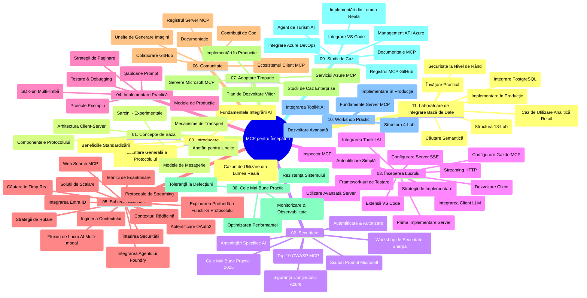

# Protocolul Contextului Modelului (MCP) pentru Începători - Ghid de Studiu

Acest ghid de studiu oferă o prezentare generală a structurii și conținutului repository-ului pentru curriculumul "Protocolul Contextului Modelului (MCP) pentru Începători". Folosiți acest ghid pentru a naviga eficient în repository și pentru a profita la maximum de resursele disponibile.

## Prezentare Generală a Repository-ului

Protocolul Contextului Modelului (MCP) este un cadru standardizat pentru interacțiunile dintre modelele AI și aplicațiile client. Inițial creat de Anthropic, MCP este acum întreținut de comunitatea mai largă MCP prin organizația oficială GitHub. Acest repository oferă un curriculum cuprinzător cu exemple practice de cod în C#, Java, JavaScript, Python și TypeScript, destinat dezvoltatorilor AI, arhitecților de sisteme și inginerilor software.

## Hartă Vizuală a Curriculumului

## Structura Repository-ului

Repository-ul este organizat în unsprezece secțiuni principale, fiecare axându-se pe diferite aspecte ale MCP:

1. **Introducere (00-Introduction/)**
   - Prezentare generală a Protocolului Contextului Modelului
   - De ce contează standardizarea în pipeline-urile AI
   - Cazuri practice de utilizare și beneficii

2. **Concepte de Bază (01-CoreConcepts/)**
   - Arhitectură client-server
   - Componente cheie ale protocolului
   - Modele de mesagerie în MCP

3. **Securitate (02-Security/)**
   - Amenințări de securitate în sistemele bazate pe MCP
   - Cele mai bune practici pentru securizarea implementărilor
   - Strategii de autentificare și autorizare
   - **Documentație cuprinzătoare de securitate**:
     - Cele mai bune practici MCP pentru securitate 2025
     - Ghid de implementare Azure Content Safety
     - Controale și tehnici de securitate MCP
     - Referință rapidă practici MCP pentru securitate
   - **Teme cheie de securitate**:
     - Atacuri de injecție în prompt și otrăvire a uneltelor
     - Hijacking de sesiune și probleme de tip "confused deputy"
     - Vulnerabilități legate de token passthrough
     - Permisiuni excesive și controlul accesului
     - Securitatea lanțului de aprovizionare pentru componente AI
     - Integrarea Microsoft Prompt Shields

4. **Pornirea Începutului (03-GettingStarted/)**
   - Configurarea și pregătirea mediului
   - Crearea primelor servere și clienți MCP
   - Integrarea cu aplicații existente
   - Include secțiuni pentru:
     - Prima implementare a serverului
     - Dezvoltarea clientului
     - Integrarea clientului LLM
     - Integrarea VS Code
     - Server Server-Sent Events (SSE)
     - Utilizare avansată a serverului
     - Streaming HTTP
     - Integrarea AI Toolkit
     - Strategii de testare
     - Ghid pentru implementare

5. **Implementare Practică (04-PracticalImplementation/)**
   - Utilizarea SDK-urilor în diverse limbaje de programare
   - Tehnici de depanare, testare și validare
   - Crearea de template-uri și workflow-uri reutilizabile pentru prompturi
   - Proiecte exemplu cu exemple de implementare

6. **Subiecte Avansate (05-AdvancedTopics/)**
   - Tehnici de inginerie a contextului
   - Integrarea agentului Foundry
   - Workflow-uri AI multi-modale
   - Demo-uri autentificare OAuth2
   - Capacități de căutare în timp real
   - Streaming în timp real
   - Implementare contexte rădăcină
   - Strategii de rutare
   - Tehnici de sampling
   - Abordări de scalare
   - Considerații de securitate
   - Integrarea securității Entra ID
   - Integrarea căutării web

7. **Contribuții Comunitare (06-CommunityContributions/)**
   - Cum să contribuiți cu cod și documentație
   - Colaborare prin GitHub
   - Îmbunătățiri și feedback conduse de comunitate
   - Utilizarea diferiților clienți MCP (Claude Desktop, Cline, VSCode)
   - Lucrul cu populari servere MCP inclusiv generare de imagini

8. **Lecții din Adoptarea Timpurie (07-LessonsfromEarlyAdoption/)**
   - Implementări din lumea reală și povești de succes
   - Construirea și implementarea soluțiilor bazate pe MCP
   - Tendințe și roadmap viitor
   - **Ghid Microsoft MCP Servers**: Ghid complet pentru 10 servere Microsoft MCP gata pentru producție, inclusiv:
     - Microsoft Learn Docs MCP Server
     - Azure MCP Server (15+ conectori specializați)
     - GitHub MCP Server
     - Azure DevOps MCP Server
     - MarkItDown MCP Server
     - SQL Server MCP Server
     - Playwright MCP Server
     - Dev Box MCP Server
     - Azure AI Foundry MCP Server
     - Microsoft 365 Agents Toolkit MCP Server

9. **Cele Mai Bune Practici (08-BestPractices/)**
   - Optimizarea performanței și tuning
   - Proiectarea sistemelor MCP tolerante la erori
   - Strategii de testare și reziliență

10. **Studii de Caz (09-CaseStudy/)**
    - **Șapte studii de caz cuprinzătoare** demonstrând versatilitatea MCP în diverse scenarii:
    - **Azure AI Travel Agents**: Orchestrație multi-agent cu Azure OpenAI și AI Search
    - **Integrare Azure DevOps**: Automatizarea proceselor workflow cu actualizări date YouTube
    - **Obținerea Documentației în timp real**: Client Python consola cu streaming HTTP
    - **Generator Interactiv de Plan de Studiu**: Aplicație web Chainlit cu AI conversațională
    - **Documentație în Editor**: Integrare VS Code cu workflow-uri GitHub Copilot
    - **Gestionare Azure API**: Integrare API enterprise cu crearea de server MCP
    - **Registrul GitHub MCP**: Dezvoltarea ecosistemului și platforma de integrare agentică
    - Exemple de implementare ce acoperă integrarea enterprise, productivitatea dezvoltatorilor și dezvoltarea ecosistemului

11. **Atelier Practic (10-StreamliningAIWorkflowsBuildingAnMCPServerWithAIToolkit/)**
    - Atelier practic cuprinzător combinând MCP cu AI Toolkit
    - Construirea de aplicații inteligente care leagă modelele AI cu unelte din lumea reală
    - Module practice acoperind fundamentele, dezvoltarea serverului personalizat și strategii de implementare în producție
    - **Structura laboratorului**:
      - Laborator 1: Fundamentele serverului MCP
      - Laborator 2: Dezvoltare avansată a serverului MCP
      - Laborator 3: Integrarea AI Toolkit
      - Laborator 4: Implementare și scalare în producție
    - Abordare de învățare bazată pe laborator cu instrucțiuni pas cu pas

12. **Laboratoare pentru Integrarea Bazei de Date MCP Server (11-MCPServerHandsOnLabs/)**
    - **Curs complet de 13 laboratoare** pentru construirea de servere MCP gata pentru producție cu integrare PostgreSQL
    - **Implementare reală de analiză retail** folosind studiul de caz Zava Retail
    - **Tipare enterprise** incluzând Row Level Security (RLS), căutare semantică și acces multi-chiriaș la date
    - **Structura completă a laboratorului**:
      - **Laboratoare 00-03: Fundamente** - Introducere, Arhitectură, Securitate, Configurare mediu
      - **Laboratoare 04-06: Construirea serverului MCP** - Design baza de date, Implementarea serverului MCP, Dezvoltare unelte
      - **Laboratoare 07-09: Funcții avansate** - Căutare semantică, Testare & depanare, Integrarea VS Code
      - **Laboratoare 10-12: Producție & Cele mai bune practici** - Implementare, Monitorizare, Optimizare
    - **Tehnologii acoperite**: Framework FastMCP, PostgreSQL, Azure OpenAI, Azure Container Apps, Application Insights
    - **Rezultate de învățare**: Servere MCP gata pentru producție, tipare de integrare bază de date, analiză AI-powered, securitate enterprise

## Resurse Suplimentare

Repository-ul include resurse suport:

- **Folderul Imagini**: Conține diagrame și ilustrații folosite în curriculum
- **Traduceri**: Suport multi-limbaj cu traduceri automate ale documentației
- **Resurse Oficiale MCP**:
  - [Documentația MCP](https://modelcontextprotocol.io/)
  - [Specificația MCP](https://spec.modelcontextprotocol.io/)
  - [Repository MCP pe GitHub](https://github.com/modelcontextprotocol)

## Cum să Folosești Acest Repository

1. **Învățare Secvențială**: Urmează capitolele în ordine (00 până la 11) pentru o experiență de învățare structurată.
2. **Focalizare pe Limbaj Specific**: Dacă ești interesat de un anumit limbaj de programare, explorează directoarele sample pentru implementări în limbajul preferat.
3. **Implementare Practică**: Începe cu secțiunea „Getting Started” pentru a-ți configura mediul și a crea primul server și client MCP.
4. **Explorare Avansată**: După ce ești confortabil cu bazele, aprofundează subiectele avansate pentru a-ți extinde cunoștințele.
5. **Implicare în Comunitate**: Alătură-te comunității MCP prin discuții pe GitHub și canale Discord pentru a te conecta cu experți și alți dezvoltatori.

## Clienți și Unelte MCP

Curriculumul acoperă diverși clienți și unelte MCP:

1. **Clienți Oficiali**:
   - Visual Studio Code
   - MCP în Visual Studio Code
   - Claude Desktop
   - Claude în VSCode
   - Claude API

2. **Clienți Comunitari**:
   - Cline (bazat pe terminal)
   - Cursor (editor cod)
   - ChatMCP
   - Windsurf

3. **Unelte de Management MCP**:
   - MCP CLI
   - MCP Manager
   - MCP Linker
   - MCP Router

## Servere MCP Populare

Repository-ul prezintă diverse servere MCP, inclusiv:

1. **Servere MCP Oficiale Microsoft**:
   - Microsoft Learn Docs MCP Server
   - Azure MCP Server (15+ conectori specializați)
   - GitHub MCP Server
   - Azure DevOps MCP Server
   - MarkItDown MCP Server
   - SQL Server MCP Server
   - Playwright MCP Server
   - Dev Box MCP Server
   - Azure AI Foundry MCP Server
   - Microsoft 365 Agents Toolkit MCP Server

2. **Servere de Referință Oficiale**:
   - Filesystem
   - Fetch
   - Memory
   - Sequential Thinking

3. **Generare Imagini**:
   - Azure OpenAI DALL-E 3
   - Stable Diffusion WebUI
   - Replicate

4. **Unelte de Dezvoltare**:
   - Git MCP
   - Terminal Control
   - Code Assistant

5. **Servere Specializate**:
   - Salesforce
   - Microsoft Teams
   - Jira & Confluence

## Contribuții

Acest repository primește cu plăcere contribuții din partea comunității. Consultați secțiunea Contribuții Comunitare pentru îndrumări despre cum să contribuiți eficient la ecosistemul MCP.

----

*Acest ghid de studiu a fost actualizat ultima dată pe 5 februarie 2026, reflectând cea mai recentă Specificație MCP 2025-11-25 și oferă o prezentare generală a repository-ului până la această dată. Conținutul repository-ului poate fi actualizat după această dată.*

---

<!-- CO-OP TRANSLATOR DISCLAIMER START -->
**Declinare de responsabilitate**:  
Acest document a fost tradus utilizând serviciul de traducere AI [Co-op Translator](https://github.com/Azure/co-op-translator). Deși ne străduim pentru acuratețe, vă rugăm să rețineți că traducerile automate pot conține erori sau inexactități. Documentul original, în limba sa nativă, trebuie considerat sursa autorizată. Pentru informații critice, se recomandă traducerea profesională realizată de un specialist. Nu ne asumăm răspunderea pentru orice neînțelegeri sau interpretări greșite care pot decurge din utilizarea acestei traduceri.
<!-- CO-OP TRANSLATOR DISCLAIMER END -->