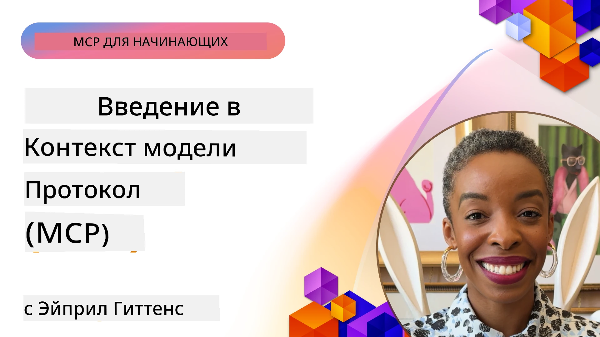
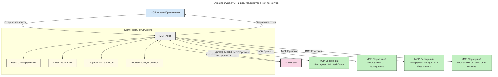

# Введение в протокол контекста модели (MCP): почему это важно для масштабируемых AI-приложений

[](https://youtu.be/agBbdiOPLQA)

_(Нажмите на изображение выше, чтобы посмотреть видео этого урока)_

Генеративные AI-приложения — большой шаг вперёд, так как они часто позволяют пользователю взаимодействовать с приложением с помощью естественных языковых запросов. Однако по мере того, как всё больше времени и ресурсов вкладывается в такие приложения, вы хотите быть уверены, что можете легко интегрировать функциональные возможности и ресурсы таким образом, чтобы расширять приложение было просто, чтобы ваше приложение могло поддерживать использование более чем одной модели, а также справляться с различными особенностями моделей. Короче говоря, создание генеративных AI-приложений легко на начальном этапе, но по мере их роста и усложнения вам нужно будет определять архитектуру и, скорее всего, опираться на стандарт, чтобы ваши приложения строились последовательно. Вот тут и вступает в дело MCP, чтобы организовать всё и обеспечить стандарт.

---

## **🔍 Что такое протокол контекста модели (MCP)?**

**Протокол контекста модели (MCP)** — это **открытый, стандартизированный интерфейс**, который позволяет крупным языковым моделям (LLM) беспрепятственно взаимодействовать с внешними инструментами, API и источниками данных. Он обеспечивает единообразную архитектуру для расширения функциональности AI-моделей за пределы их обучающих данных, что позволяет создавать более умные, масштабируемые и отзывчивые AI-системы.

---

## **🎯 Почему стандартизация в AI важна**

По мере усложнения генеративных AI-приложений крайне важно принимать стандарты, которые обеспечивают **масштабируемость, расширяемость, поддерживаемость** и **избежание зависимости от одного поставщика**. MCP решает эти задачи за счёт:

- Унификации интеграций моделей с инструментами  
- Снижения количества хрупких, единичных кастомных решений  
- Позволяет нескольким моделям от разных поставщиков сосуществовать в одной экосистеме  

**Примечание:** Хотя MCP позиционируется как открытый стандарт, нет планов стандартизировать MCP через какие-либо существующие организации стандартов, такие как IEEE, IETF, W3C, ISO или другие.

---

## **📚 Учебные цели**

К концу статьи вы сможете:

- Определить **протокол контекста модели (MCP)** и его области применения  
- Понять, как MCP стандартизирует коммуникацию модель-инструмент  
- Выделить ключевые компоненты архитектуры MCP  
- Изучить реальные примеры применения MCP в корпоративной и разработческой среде

---

## **💡 Почему протокол контекста модели (MCP) — это прорыв**

### **🔗 MCP решает проблему фрагментации AI-взаимодействий**

До MCP интеграция моделей с инструментами требовала:

- Кастомного кода для каждой пары инструмент-модель  
- Нестандартных API для каждого поставщика  
- Частых сбоев из-за обновлений  
- Плохой масштабируемости при увеличении количества инструментов

### **✅ Преимущества стандартизации MCP**

| **Преимущество**         | **Описание**                                                                   |
|--------------------------|--------------------------------------------------------------------------------|
| Взаимодействие           | LLM работают без проблем с инструментами разных поставщиков                   |
| Единообразие             | Унифицированное поведение на разных платформах и инструментах                  |
| Переиспользуемость       | Инструменты, созданные один раз, можно использовать в разных проектах и системах |
| Ускорение разработки     | Сокращение времени разработки за счет стандартизированных интерфейсов plug-and-play |

---

## **🧱 Обзор архитектуры MCP на высоком уровне**

MCP использует **клиент-серверную модель**, где:

- **MCP Hosts** запускают AI-модели  
- **MCP Clients** инициируют запросы  
- **MCP Servers** предоставляют контекст, инструменты и возможности  

### **Ключевые компоненты:**

- **Ресурсы** – статические или динамические данные для моделей  
- **Промпты** – заранее определённые рабочие процессы для управляемой генерации  
- **Инструменты** – исполняемые функции, такие как поиск, вычисления  
- **Сэмплирование** – агентное поведение через рекурсивные взаимодействия  
- **Элицитация** – запросы от сервера для ввода пользователя  
- **Roots** – границы файловой системы для контроля доступа сервера  

### **Архитектура протокола:**

MCP использует двухслойную архитектуру:  
- **Уровень данных**: коммуникация на основе JSON-RPC 2.0 с управлением жизненным циклом и примитивами  
- **Транспортный уровень**: STDIO (локальный) и стриминговый HTTP с SSE (удалённый) каналы связи  

---

## Как работают MCP сервера

Работа MCP серверов организована следующим образом:

- **Поток запросов**:  
    1. Запрос инициируется конечным пользователем или программным обеспечением, действующим от его имени.  
    2. **MCP Клиент** отправляет запрос **MCP Host**, который отвечает за выполнение AI-модели.  
    3. **AI Модель** получает запрос пользователя и может запросить доступ к внешним инструментам или данным через один или несколько вызовов инструментов.  
    4. **MCP Host**, а не модель напрямую, общается с соответствующими **MCP Серверами** с использованием стандартизированного протокола.  
- **Функциональность MCP Host**:  
    - **Реестр инструментов**: ведёт каталог доступных инструментов и их возможностей.  
    - **Аутентификация**: проверяет разрешения на доступ к инструментам.  
    - **Обработчик запросов**: обрабатывает входящие запросы инструментов от модели.  
    - **Форматировщик ответов**: структурирует вывод инструментов в формате, понятном модели.  
- **Выполнение MCP сервера**:  
    - **MCP Host** маршрутизирует вызовы инструментов на один или несколько **MCP Серверами**, каждый из которых предоставляет специализированные функции (например, поиск, вычисления, запросы к базе данных).  
    - **MCP Серверы** выполняют свои операции и возвращают результаты **MCP Host** в едином формате.  
    - **MCP Host** форматирует и передаёт результаты AI-модели.  
- **Завершение ответа**:  
    - **AI Модель** интегрирует результаты инструментов в итоговый ответ.  
    - **MCP Host** отправляет этот ответ обратно **MCP Клиенту**, который передаёт его конечному пользователю или вызывающему ПО.  
    

## 👨‍💻 Как создать MCP сервер (с примерами)

MCP сервера позволяют расширить возможности LLM, предоставляя данные и функционал.

Готовы попробовать? Вот SDK для различных языков и стеков с примерами создания простых MCP серверов на разных языках/стэках:

- **Python SDK**: https://github.com/modelcontextprotocol/python-sdk

- **TypeScript SDK**: https://github.com/modelcontextprotocol/typescript-sdk

- **Java SDK**: https://github.com/modelcontextprotocol/java-sdk

- **C#/.NET SDK**: https://github.com/modelcontextprotocol/csharp-sdk


## 🌍 Практические примеры использования MCP

MCP расширяет возможности AI для широкого спектра приложений:

| **Применение**               | **Описание**                                                                    |
|-----------------------------|---------------------------------------------------------------------------------|
| Интеграция данных предприятия | Связывает LLM с базами данных, CRM или внутренними инструментами              |
| Агентные AI-системы          | Позволяет автономным агентам использовать инструменты и выполнять рабочие процессы принятия решений |
| Мультимодальные приложения   | Объединяет текстовые, графические и аудио-инструменты в одном AI-приложении     |
| Интеграция данных в реальном времени | Включает живые данные в AI-взаимодействия для более точных и актуальных результатов |

### 🧠 MCP = Универсальный стандарт для AI-взаимодействий

Протокол контекста модели (MCP) действует как универсальный стандарт для AI-взаимодействий, подобно тому, как USB-C стандартизировал физические подключения устройств. В мире AI MCP обеспечивает последовательный интерфейс, позволяющий моделям (клиентам) беспрепятственно интегрироваться с внешними инструментами и поставщиками данных (серверами). Это устраняет необходимость поддерживать множество различных, уникальных протоколов для каждого API или источника данных.

В рамках MCP MCP-совместимый инструмент (называемый MCP-сервером) следует единому стандарту. Эти серверы могут перечислять доступные инструменты или действия и выполнять их по запросу AI-агента. Платформы AI-агентов с поддержкой MCP могут обнаруживать доступные инструменты от серверов и вызывать их через этот стандартный протокол.

### 💡 Обеспечивает доступ к знаниям

Помимо предоставления инструментов, MCP также облегчает доступ к знаниям. Он позволяет приложениям предоставлять контекст крупным языковым моделям (LLM), связывая их с различными источниками данных. Например, MCP сервер может представлять репозиторий документов компании, позволяя агентам запрашивать релевантную информацию по требованию. Другой сервер может обрабатывать конкретные действия, такие как отправка писем или обновление записей. С точки зрения агента, это просто инструменты, которые он может использовать — некоторые инструменты возвращают данные (контекст знаний), а другие выполняют действия. MCP эффективно управляет обоими типами.

Агент, подключаясь к MCP серверу, автоматически узнаёт о доступных у сервера возможностях и данных через стандартный формат. Такая стандартизация обеспечивает динамическую доступность инструментов. Например, добавление нового MCP сервера в систему агента сразу же делает его функции доступными без необходимости доработки инструкций агента.

Этот упрощённый процесс интеграции соответствует схеме на следующей диаграмме, где серверы предоставляют и инструменты, и знания, обеспечивая бесперебойное взаимодействие между системами.

### 👉 Пример: масштабируемое агентное решение

```mermaid
---
title: Масштабируемое агентское решение с MCP
description: Диаграмма, иллюстрирующая, как пользователь взаимодействует с LLM, который подключается к нескольким серверам MCP, каждый из которых предоставляет как знания, так и инструменты, создавая масштабируемую архитектуру ИИ-системы
---
graph TD
    User -->|Запрос| LLM
    LLM -->|Ответ| User
    LLM -->|MCP| ServerA
    LLM -->|MCP| ServerB
    ServerA -->|Универсальный коннектор| ServerB
    ServerA --> KnowledgeA
    ServerA --> ToolsA
    ServerB --> KnowledgeB
    ServerB --> ToolsB

    subgraph Server A
        KnowledgeA[Знания]
        ToolsA[Инструменты]
    end

    subgraph Server B
        KnowledgeB[Знания]
        ToolsB[Инструменты]
    end
```Универсальный коннектор позволяет MCP серверам общаться и обмениваться возможностями друг с другом, позволяя ServerA делегировать задачи ServerB или получать доступ к его инструментам и знаниям. Это федерация инструментов и данных между серверами, поддерживающая масштабируемые и модульные архитектуры агентов. Поскольку MCP стандартизирует экспонирование инструментов, агенты могут динамически обнаруживать и маршрутизировать запросы между серверами без жёстко запрограммированных интеграций.

Федерация инструментов и знаний: инструменты и данные доступны между серверами, позволяя создавать более масштабируемые и модульные агентные архитектуры.

### 🔄 Продвинутые сценарии MCP с интеграцией LLM на стороне клиента

Кроме базовой архитектуры MCP существуют продвинутые сценарии, где и клиент, и сервер содержат LLM, что позволяет реализовать более сложные взаимодействия. На следующей диаграмме **Клиентское приложение** может быть IDE с набором MCP инструментов, доступных для использования LLM:

```mermaid
---
title: Расширенные сценарии MCP с интеграцией клиент-сервер LLM
description: Диаграмма последовательностей, показывающая подробный поток взаимодействия между пользователем, клиентским приложением, клиентским LLM, несколькими MCP серверами и серверным LLM, иллюстрируя этапы обнаружения инструментов, взаимодействия с пользователем, прямого вызова инструментов и согласования функций
---
sequenceDiagram
    autonumber
    actor User as 👤 Пользователь
    participant ClientApp as 🖥️ Клиентское приложение
    participant ClientLLM as 🧠 Клиентский LLM
    participant Server1 as 🔧 MCP Сервер 1
    participant Server2 as 📚 MCP Сервер 2
    participant ServerLLM as 🤖 Серверный LLM
    
    %% Discovery Phase
    rect rgb(220, 240, 255)
        Note over ClientApp, Server2: ЭТАП ОБНАРУЖЕНИЯ ИНСТРУМЕНТОВ
        ClientApp->>+Server1: Запрос доступных инструментов/ресурсов
        Server1-->>-ClientApp: Возврат списка инструментов (JSON)
        ClientApp->>+Server2: Запрос доступных инструментов/ресурсов
        Server2-->>-ClientApp: Возврат списка инструментов (JSON)
        Note right of ClientApp: Локальное хранение комбинированного<br/>каталога инструментов
    end
    
    %% User Interaction
    rect rgb(255, 240, 220)
        Note over User, ClientLLM: ЭТАП ВЗАИМОДЕЙСТВИЯ С ПОЛЬЗОВАТЕЛЕМ
        User->>+ClientApp: Ввод запроса на естественном языке
        ClientApp->>+ClientLLM: Передача запроса + каталог инструментов
        ClientLLM->>-ClientLLM: Анализ запроса и выбор инструментов
    end
    
    %% Scenario A: Direct Tool Calling
    alt Прямой вызов инструментов
        rect rgb(220, 255, 220)
            Note over ClientApp, Server1: СЦЕНАРИЙ A: ПРЯМОЙ ВЫЗОВ ИНСТРУМЕНТОВ
            ClientLLM->>+ClientApp: Запрос на выполнение инструмента
            ClientApp->>+Server1: Выполнение конкретного инструмента
            Server1-->>-ClientApp: Возврат результатов
            ClientApp->>+ClientLLM: Обработка результатов
            ClientLLM-->>-ClientApp: Генерация ответа
            ClientApp-->>-User: Отображение окончательного ответа
        end
    
    %% Scenario B: Feature Negotiation (VS Code style)
    else Согласование функций (стиль VS Code)
        rect rgb(255, 220, 220)
            Note over ClientApp, ServerLLM: СЦЕНАРИЙ B: СОГЛАСОВАНИЕ ФУНКЦИЙ
            ClientLLM->>+ClientApp: Определение необходимых возможностей
            ClientApp->>+Server2: Согласование функций/возможностей
            Server2->>+ServerLLM: Запрос дополнительного контекста
            ServerLLM-->>-Server2: Предоставление контекста
            Server2-->>-ClientApp: Возврат доступных функций
            ClientApp->>+Server2: Вызов согласованных инструментов
            Server2-->>-ClientApp: Возврат результатов
            ClientApp->>+ClientLLM: Обработка результатов
            ClientLLM-->>-ClientApp: Генерация ответа
            ClientApp-->>-User: Отображение окончательного ответа
        end
    end
```
## 🔐 Практические преимущества MCP

Вот практические выгоды от использования MCP:

- **Актуальность**: модели получают доступ к свежей информации за пределами тренировочных данных  
- **Расширение возможностей**: модели могут использовать специализированные инструменты для задач, на которые не обучались  
- **Снижение галлюцинаций**: внешние источники данных обеспечивают фактическую основу  
- **Конфиденциальность**: чувствительные данные могут оставаться в безопасных средах, а не включаться в промпты  

## 📌 Основные выводы

Ключевые выводы по использованию MCP:

- **MCP** стандартизирует взаимодействие AI моделей с инструментами и данными  
- Способствует **расширяемости, консистентности и взаимодействию**  
- MCP помогает **сократить время разработки, повысить надёжность и расширить возможности моделей**  
- Клиент-серверная архитектура **позволяет создавать гибкие, расширяемые AI-приложения**  

## 🧠 Упражнение

Подумайте об AI-приложении, которое вы хотели бы создать.

- Какие **внешние инструменты или данные** могут улучшить его возможности?  
- Как MCP может сделать интеграцию **проще и надежнее?**  

## Дополнительные ресурсы

- [MCP GitHub Репозиторий](https://github.com/modelcontextprotocol)


## Что дальше

Далее: [Глава 1: Основные концепции](../01-CoreConcepts/README.md)

---

<!-- CO-OP TRANSLATOR DISCLAIMER START -->
**Отказ от ответственности**:
Этот документ был переведен с помощью автоматического сервиса перевода [Co-op Translator](https://github.com/Azure/co-op-translator). Несмотря на наши усилия обеспечить точность, пожалуйста, имейте в виду, что автоматический перевод может содержать ошибки или неточности. Оригинальный документ на исходном языке следует считать авторитетным источником. Для критически важной информации рекомендуется использовать профессиональный перевод, выполненный человеком. Мы не несем ответственности за любые недоразумения или неправильные толкования, возникающие в результате использования данного перевода.
<!-- CO-OP TRANSLATOR DISCLAIMER END -->