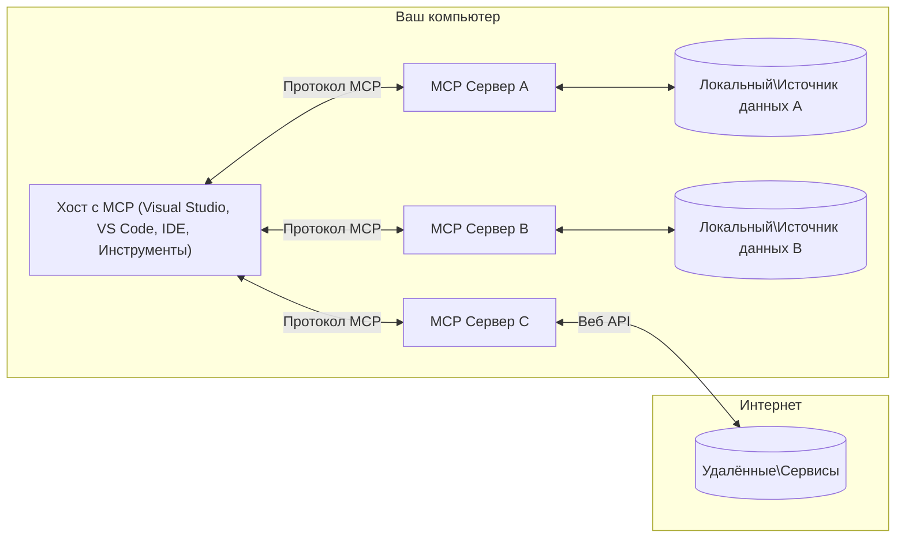

# Основные концепции MCP: освоение протокола контекста модели для интеграции ИИ

[](https://youtu.be/earDzWGtE84)

_(Нажмите на изображение выше, чтобы посмотреть видео этого урока)_

[Протокол контекста модели (Model Context Protocol, MCP)](https://github.com/modelcontextprotocol) — это мощная стандартизированная система, оптимизирующая взаимодействие больших языковых моделей (LLM) с внешними инструментами, приложениями и источниками данных. 
Это руководство познакомит вас с основными концепциями MCP. Вы узнаете о его архитектуре клиент-сервер, ключевых компонентах, механике коммуникации и лучших практиках реализации.

- **Явное согласие пользователя**: Все операции доступа к данным требуют явного одобрения пользователя перед выполнением. Пользователи должны четко понимать, какие данные будут доступны и какие действия будут выполнены, с детальным контролем разрешений и авторизаций.

- **Защита конфиденциальности данных**: Данные пользователя предоставляются только с явного согласия и должны быть защищены надежными механизмами контроля доступа на протяжении всего жизненного цикла взаимодействия. Реализации должны предотвращать несанкционированную передачу данных и строго соблюдать границы конфиденциальности.

- **Безопасность запуска инструментов**: Каждый вызов инструмента требует явного согласия пользователя с полным пониманием функциональности инструмента, его параметров и возможного воздействия. Надежные меры безопасности должны исключать непреднамеренное, небезопасное или вредоносное выполнение инструментов.

- **Безопасность транспортного уровня**: Все каналы связи должны использовать соответствующее шифрование и механизмы аутентификации. Удалённые подключения должны реализовывать защищённые протоколы передачи и корректное управление учетными данными.

#### Рекомендации по реализации:

- **Управление разрешениями**: Реализуйте системы с тонкой настройкой разрешений, позволяющие пользователям контролировать, к каким серверам, инструментам и ресурсам есть доступ
- **Аутентификация и авторизация**: Используйте надежные методы аутентификации (OAuth, API-ключи) с правильным управлением токенами и сроками их действия  
- **Валидация вводимых данных**: Валидируйте все параметры и вводимые данные в соответствии с определёнными схемами, чтобы предотвратить инъекционные атаки
- **Аудит журналов**: Поддерживайте комплексные логи всех операций для мониторинга безопасности и соответствия требованиям

## Обзор

В этом уроке рассматривается фундаментальная архитектура и компоненты, составляющие экосистему Протокола контекста модели (MCP). Вы узнаете о клиент-серверной архитектуре, ключевых компонентах и механизмах коммуникации, обеспечивающих работу MCP.

## Основные цели обучения

К концу урока вы:

- Поймете клиент-серверную архитектуру MCP.
- Определите роли и обязанности Хостов, Клиентов и Серверов.
- Проанализируете основные особенности, делающие MCP гибким уровнем интеграции.
- Узнаете, как информация передается в экосистеме MCP.
- Получите практические знания через примеры кода на .NET, Java, Python и JavaScript.

## Архитектура MCP: углубленное изучение

Экосистема MCP построена на модели клиент-сервер. Такая модульная структура позволяет AI-приложениям эффективно взаимодействовать с инструментами, базами данных, API и контекстуальными ресурсами. Рассмотрим эту архитектуру по ее основным компонентам.

В основе MCP лежит клиент-серверная архитектура, где хост-приложение может подключаться к множеству серверов:


- **MCP Hosts (Хосты MCP)**: программы вроде VSCode, Claude Desktop, IDE или AI-инструменты, которые хотят получать доступ к данным через MCP
- **MCP Clients (Клиенты MCP)**: протокольные клиенты, поддерживающие соединения 1:1 с серверами
- **MCP Servers (Серверы MCP)**: легковесные программы, которые через стандартизованный Протокол контекста модели предоставляют конкретные возможности
- **Локальные источники данных**: файлы, базы данных и сервисы вашего компьютера, к которым MCP-серверы могут безопасно обращаться
- **Удалённые сервисы**: внешние системы в интернете, к которым MCP-серверы могут подключаться через API.

Протокол MCP — это развивающийся стандарт с версионированием на основе даты (формат ГГГГ-ММ-ДД). Текущая версия протокола — **2025-11-25**. Вы можете ознакомиться с последними обновлениями в [спецификации протокола](https://modelcontextprotocol.io/specification/2025-11-25/)

### 1. Хосты

В Протоколе контекста модели (MCP) **Хосты** — это AI-приложения, служащие основным интерфейсом, через который пользователи взаимодействуют с протоколом. Хосты координируют и управляют соединениями с несколькими MCP-серверами, создавая выделенных MCP-клиентов для каждого подключения к серверу. Примеры хостов:

- **AI-приложения**: Claude Desktop, Visual Studio Code, Claude Code
- **Среды разработки**: IDE и редакторы кода с интеграцией MCP  
- **Пользовательские приложения**: специально созданные AI-агенты и инструменты

**Хосты** — приложения, координирующие взаимодействие с AI-моделями. Они:

- **Оркестровка AI-моделей**: выполняют или взаимодействуют с LLM для генерации ответов и координации AI-процессов
- **Управление клиентскими соединениями**: создают и поддерживают по одному MCP-клиенту на каждое соединение с MCP-сервером
- **Управление пользовательским интерфейсом**: обрабатывают ход беседы, взаимодействия с пользователем и презентацию ответов  
- **Обеспечение безопасности**: контролируют разрешения, ограничения безопасности и аутентификацию
- **Обработка согласия пользователя**: управляют одобрением пользователей на обмен данными и запуск инструментов


### 2. Клиенты

**Клиенты** — важные компоненты, поддерживающие выделенные соединения один к одному между Хостами и MCP-серверами. Каждый MCP-клиент создаётся хостом для подключения к конкретному MCP-серверу, обеспечивая организованные и безопасные каналы связи. Несколько клиентов позволяют хостам одновременно подключаться к множеству серверов.

**Клиенты** — это соединительные компоненты внутри хост-приложения. Они:

- **Протокольная коммуникация**: отправляют запросы JSON-RPC 2.0 серверам с подсказками и инструкциями
- **Переговоры возможностей**: согласуют поддерживаемые функции и версии протокола с серверами при инициализации
- **Запуск инструментов**: управляют запросами на выполнение инструментов от моделей и обрабатывают ответы
- **Обновления в реальном времени**: обрабатывают уведомления и обновления от серверов
- **Обработка ответов**: обрабатывают и форматируют ответы серверов для отображения пользователям

### 3. Серверы

**Серверы** — программы, предоставляющие контекст, инструменты и возможности MCP-клиентам. Они могут выполняться локально (на той же машине, что и Хост) или удалённо (на внешних платформах) и отвечают за обработку клиентских запросов и предоставление структурированных ответов. Серверы раскрывают функциональность через стандартизованный Протокол контекста модели.

**Серверы** — сервисы, предоставляющие контекст и возможности. Они:

- **Регистрация функций**: регистрируют и предоставляют доступные примитивы (ресурсы, подсказки, инструменты) клиентам
- **Обработка запросов**: принимают и выполняют вызовы инструментов, запросы ресурсов и подсказок от клиентов
- **Обеспечение контекста**: предоставляют контекстную информацию и данные для улучшения ответов модели
- **Управление состоянием**: поддерживают состояние сессии и обрабатывают состояние при необходимости
- **Оповещения в реальном времени**: отправляют уведомления об изменениях и обновлениях функциональности подключённым клиентам

Серверы могут разрабатываться кем угодно для расширения возможностей моделей специализированным функционалом и поддерживают как локальное, так и удаленное развертывание.

### 4. Примитивы сервера

Серверы в Протоколе контекста модели (MCP) предоставляют три базовых **примитива**, которые задают фундаментальные строительные блоки для богатого взаимодействия между клиентами, хостами и языковыми моделями. Эти примитивы определяют типы контекстной информации и действий, доступных через протокол.

MCP-серверы могут предоставлять любую комбинацию из трёх основных примитивов:

#### Ресурсы

**Ресурсы** — это источники данных, предоставляющие контекстную информацию AI-приложениям. Они представляют статическое или динамическое содержимое, которое может обогатить понимание модели и помощь в принятии решений:

- **Контекстные данные**: структурированная информация и контекст для использования моделью
- **Базы знаний**: хранилища документов, статьи, руководства и научные публикации
- **Локальные источники данных**: файлы, базы данных и локальная системная информация  
- **Внешние данные**: ответы API, веб-сервисы и данные удалённых систем
- **Динамический контент**: данные в реальном времени, обновляющиеся в зависимости от внешних условий

Ресурсы идентифицируются URI и поддерживают поиск через методы `resources/list` и получение через `resources/read`:

```text
file://documents/project-spec.md
database://production/users/schema
api://weather/current
```

#### Подсказки

**Подсказки** — это повторно используемые шаблоны, помогающие структурировать взаимодействия с языковыми моделями. Они обеспечивают стандартизированные шаблоны взаимодействия и шаблоны рабочих процессов:

- **Взаимодействие на основе шаблонов**: заранее подготовленные сообщения и начала диалога
- **Шаблоны рабочих процессов**: стандартизированные последовательности для типовых задач и взаимодействий
- **Примеры с несколькими образцами**: шаблоны с примерами для обучения модели
- **Системные подсказки**: базовые подсказки, определяющие поведение и контекст модели
- **Динамические шаблоны**: параметризованные подсказки, адаптирующиеся к конкретному контексту

Подсказки поддерживают замену переменных и могут быть найдены через `prompts/list` и получены с помощью `prompts/get`:

```markdown
Generate a {{task_type}} for {{product}} targeting {{audience}} with the following requirements: {{requirements}}
```

#### Инструменты

**Инструменты** — исполняемые функции, которые AI-модели могут вызывать для выполнения конкретных действий. Они представляют собой "глаголы" экосистемы MCP, позволяя моделям взаимодействовать с внешними системами:

- **Исполняемые функции**: отдельные операции, которые модели могут вызывать с определёнными параметрами
- **Интеграция с внешними системами**: вызовы API, запросы к базам данных, операции с файлами, вычисления
- **Уникальная идентичность**: каждый инструмент имеет уникальное имя, описание и схему параметров
- **Структурированный ввод/вывод**: инструменты принимают валидированные параметры и возвращают структурированные, типизированные ответы
- **Возможности действий**: позволяют моделям выполнять реальные действия и получать актуальные данные

Инструменты определяются с помощью JSON Schema для валидации параметров, обнаруживаются через `tools/list` и вызываются посредством `tools/call`. Инструменты могут также содержать **иконки** как дополнительную метаинформацию для улучшения UI.

**Аннотации инструментов**: инструменты поддерживают поведенческие аннотации (например, `readOnlyHint`, `destructiveHint`), которые описывают, является ли инструмент доступным только для чтения или разрушительным, помогая клиентам принимать обоснованные решения о запуске инструмента.

Пример определения инструмента:

```typescript
server.tool(
  "search_products", 
  {
    query: z.string().describe("Search query for products"),
    category: z.string().optional().describe("Product category filter"),
    max_results: z.number().default(10).describe("Maximum results to return")
  }, 
  async (params) => {
    // Выполнить поиск и вернуть структурированные результаты
    return await productService.search(params);
  }
);
```

## Клиентские примитивы

В Протоколе контекста модели (MCP) **клиенты** могут предоставлять примитивы, которые позволяют серверам запрашивать дополнительные возможности у хост-приложения. Эти клиентские примитивы позволяют создавать более богатые и интерактивные реализации серверов, способные получать доступ к возможностям AI модели и взаимодействиям с пользователем.

### Семплирование

**Семплирование** позволяет серверам запрашивать генерацию завершений языковой модели из AI-приложения клиента. Этот примитив даёт серверам доступ к возможностям LLM без необходимости встраивания собственных зависимостей моделей:

- **Независимый от модели доступ**: серверы могут запрашивать завершения без необходимости включать SDK LLM и управлять доступом к модели
- **AI, инициированный сервером**: позволяет серверам самостоятельно генерировать контент с использованием модели клиента
- **Рекурсивные взаимодействия с LLM**: поддерживает сложные сценарии, где серверам нужна помощь AI для обработки
- **Динамическое создание контента**: даёт возможность серверам создавать контекстные ответы с помощью модели хоста
- **Поддержка вызова инструментов**: серверы могут включать параметры `tools` и `toolChoice`, позволяющие модели клиента вызывать инструменты во время семплирования

Семплирование инициируется через метод `sampling/complete`, где серверы отправляют запросы на завершение клиенту.

### Корни

**Корни** обеспечивают стандартизированный способ для клиентов раскрывать серверу границы файловой системы, помогая серверам понять, к каким директориям и файлам у них есть доступ:

- **Границы файловой системы**: определяют пределы, в которых серверы могут работать внутри файловой системы
- **Контроль доступа**: помогают серверам понимать, к каким директориям и файлам у них есть разрешение доступа
- **Динамические обновления**: клиенты могут уведомлять серверы о изменениях списка корней
- **Идентификация на основе URI**: корни используют URI с префиксом `file://` для идентификации доступных директорий и файлов

Корни обнаруживаются через метод `roots/list`, а клиенты отправляют уведомления `notifications/roots/list_changed` при изменениях корней.

### Запросы на уточнение  

**Запросы на уточнение** позволяют серверам запрашивать дополнительную информацию или подтверждение от пользователей через интерфейс клиента:

- **Запросы ввода пользователя**: серверы могут запрашивать дополнительные данные, необходимые для выполнения инструментов
- **Диалоги подтверждения**: запрашивать одобрение пользователя для чувствительных или важных операций
- **Интерактивные рабочие процессы**: позволять серверам создавать пошаговые взаимодействия с пользователем
- **Динамический сбор параметров**: собирать отсутствующие или необязательные параметры во время выполнения инструментов

Запросы на уточнение выполняются с помощью метода `elicitation/request` для сбора пользовательского ввода через интерфейс клиента.

**Режим URL-запросов**: серверы также могут запрашивать URL-основанные взаимодействия с пользователем, позволяя перенаправлять пользователей на внешние веб-страницы для аутентификации, подтверждения или ввода данных.

### Логирование

**Логирование** позволяет серверам отправлять структурированные сообщения журналов клиентам для отладки, мониторинга и обеспечения прозрачности операций:

- **Поддержка отладки**: позволяют серверам предоставлять детальные логи выполнения для устранения неполадок
- **Оперативный мониторинг**: отправка статусных обновлений и метрик производительности клиентам
- **Отчёты об ошибках**: предоставление подробного контекста ошибок и диагностической информации
- **Аудит операций**: создание комплексных журналов операций и решений серверов

Сообщения журнала отправляются клиентам для обеспечения прозрачности операций серверов и облегчения отладки.

## Поток информации в MCP

Протокол контекста модели (MCP) определяет структурированный поток информации между хостами, клиентами, серверами и моделями. Понимание этого потока помогает прояснить, как обрабатываются запросы пользователей и как внешние инструменты и данные интегрируются в ответы моделей.

- **Хост устанавливает соединение**  
  Хост-приложение (например, IDE или чат-интерфейс) устанавливает связь с MCP-сервером, обычно через STDIO, WebSocket или другой поддерживаемый транспорт.

- **Переговоры возможностей**  
  Клиент (встроенный в хост) и сервер обмениваются информацией о поддерживаемых возможностях, инструментах, ресурсах и версиях протокола. Это гарантирует, что обе стороны понимают, какие возможности доступны в сессии.

- **Запрос пользователя**  
  Пользователь взаимодействует с хостом (например, вводит подсказку или команду). Хост собирает этот ввод и передает его клиенту для обработки.

- **Использование ресурсов или инструментов**  
  - Клиент может запросить у сервера дополнительный контекст или ресурсы (например, файлы, записи из базы данных или статьи из базы знаний) для обогащения понимания модели.
  - Если модель определяет, что нужен инструмент (например, для получения данных, выполнения вычислений или вызова API), клиент отправляет серверу запрос на вызов инструмента, указывая имя инструмента и параметры.

- **Выполнение на сервере**  

Сервер получает запрос на ресурс или инструмент, выполняет необходимые операции (такие как запуск функции, запрос к базе данных или получение файла) и возвращает результаты клиенту в структурированном формате.

- **Генерация ответа**  
  Клиент интегрирует ответы сервера (данные ресурсов, результаты инструментов и т. д.) в текущем взаимодействии с моделью. Модель использует эту информацию для создания полного и контекстно релевантного ответа.

- **Представление результата**  
  Хост получает итоговый вывод от клиента и представляет его пользователю, часто включая как сгенерированный моделью текст, так и результаты вызовов инструментов или запросов к ресурсам.

Этот поток позволяет MCP поддерживать продвинутые, интерактивные и контекстно осведомленные AI-приложения, бесшовно связывая модели с внешними инструментами и источниками данных.

## Архитектура и уровни протокола

MCP состоит из двух отдельных архитектурных уровней, которые вместе обеспечивают полный коммуникационный каркас:

### Уровень данных

**Уровень данных** реализует основной протокол MCP, используя **JSON-RPC 2.0** как основу. Этот уровень определяет структуру сообщений, семантику и паттерны взаимодействия:

#### Основные компоненты:

- **Протокол JSON-RPC 2.0**: Вся коммуникация использует стандартизированный формат сообщений JSON-RPC 2.0 для вызовов методов, ответов и уведомлений
- **Управление жизненным циклом**: Обрабатывает инициализацию соединения, согласование возможностей и завершение сессии между клиентами и серверами
- **Примитивы сервера**: Позволяют серверам предоставлять основную функциональность через инструменты, ресурсы и подсказки
- **Примитивы клиента**: Позволяют серверам запрашивать сэмплирование у LLM, вызывать ввод пользователя и отправлять лог-сообщения
- **Уведомления в реальном времени**: Поддерживают асинхронные уведомления для динамических обновлений без опроса

#### Ключевые особенности:

- **Согласование версии протокола**: Использует версионирование на основе даты (ГГГГ-ММ-ДД) для обеспечения совместимости
- **Обнаружение возможностей**: Клиенты и серверы обмениваются информацией о поддерживаемых функциях при инициализации
- **Сеансы с сохранением состояния**: Поддерживает состояние соединения в нескольких взаимодействиях для сохранения контекста

### Транспортный уровень

**Транспортный уровень** управляет каналами связи, фреймингом сообщений и аутентификацией между участниками MCP:

#### Поддерживаемые транспортные механизмы:

1. **Транспорт STDIO**:
   - Использует стандартные потоки ввода/вывода для прямой коммуникации процесса
   - Оптимален для локальных процессов на одной машине без сетевых накладных расходов
   - Обычно используется для локальных реализаций MCP серверов

2. **Потоковый HTTP транспорт**:
   - Использует HTTP POST для сообщений клиент-сервер  
   - Опционально Server-Sent Events (SSE) для потоковой передачи сервер-клиент
   - Позволяет удаленную коммуникацию с сервером через сеть
   - Поддерживает стандартную HTTP аутентификацию (токены bearer, API-ключи, пользовательские заголовки)
   - MCP рекомендует OAuth для безопасной токен-базированной аутентификации

#### Абстракция транспорта:

Транспортный уровень абстрагирует детали коммуникации от уровня данных, обеспечивая одинаковый формат сообщений JSON-RPC 2.0 для всех транспортных механизмов. Эта абстракция позволяет приложениям беспрепятственно переключаться между локальными и удаленными серверами.

### Вопросы безопасности

Реализации MCP должны соблюдать несколько критичных принципов безопасности для обеспечения безопасного, надежного и защищенного взаимодействия по всему протоколу:

- **Согласие и контроль пользователя**: Пользователь должен давать явное согласие перед доступом к данным или выполнением операций. Он должен иметь ясный контроль над тем, какие данные передаются и какие действия разрешены, при поддержке интуитивных интерфейсов для просмотра и подтверждения активности.

- **Конфиденциальность данных**: Данные пользователя должны передаваться только с явным согласием и быть защищены соответствующими механизмами доступа. Реализации MCP должны предотвращать неавторизованную передачу данных и обеспечивать сохранение конфиденциальности во всех взаимодействиях.

- **Безопасность инструментов**: Перед вызовом любого инструмента требуется явное согласие пользователя. Пользователь должен чётко понимать функциональность каждого инструмента, а для предотвращения случайного или небезопасного запуска должны применяться строгие механизмы безопасности.

Следуя этим принципам, MCP поддерживает доверие пользователей, конфиденциальность и безопасность во всех взаимодействиях протокола, обеспечивая мощные интеграции искусственного интеллекта.

## Примеры кода: ключевые компоненты

Ниже приведены примеры кода на популярных языках программирования, иллюстрирующие реализацию ключевых компонентов MCP сервера и инструментов.

### Пример .NET: Создание простого MCP сервера с инструментами

Практический пример на .NET, демонстрирующий, как реализовать простой MCP сервер с пользовательскими инструментами. Пример показывает, как определять и регистрировать инструменты, обрабатывать запросы и подключать сервер через Model Context Protocol.

```csharp
using System;
using System.Threading.Tasks;
using ModelContextProtocol.Server;
using ModelContextProtocol.Server.Transport;
using ModelContextProtocol.Server.Tools;

public class WeatherServer
{
    public static async Task Main(string[] args)
    {
        // Create an MCP server
        var server = new McpServer(
            name: "Weather MCP Server",
            version: "1.0.0"
        );
        
        // Register our custom weather tool
        server.AddTool<string, WeatherData>("weatherTool", 
            description: "Gets current weather for a location",
            execute: async (location) => {
                // Call weather API (simplified)
                var weatherData = await GetWeatherDataAsync(location);
                return weatherData;
            });
        
        // Connect the server using stdio transport
        var transport = new StdioServerTransport();
        await server.ConnectAsync(transport);
        
        Console.WriteLine("Weather MCP Server started");
        
        // Keep the server running until process is terminated
        await Task.Delay(-1);
    }
    
    private static async Task<WeatherData> GetWeatherDataAsync(string location)
    {
        // This would normally call a weather API
        // Simplified for demonstration
        await Task.Delay(100); // Simulate API call
        return new WeatherData { 
            Temperature = 72.5,
            Conditions = "Sunny",
            Location = location
        };
    }
}

public class WeatherData
{
    public double Temperature { get; set; }
    public string Conditions { get; set; }
    public string Location { get; set; }
}
```

### Пример Java: Компоненты MCP сервера

Этот пример демонстрирует тот же MCP сервер и регистрацию инструментов, что и пример на .NET выше, но реализован на Java.

```java
import io.modelcontextprotocol.server.McpServer;
import io.modelcontextprotocol.server.McpToolDefinition;
import io.modelcontextprotocol.server.transport.StdioServerTransport;
import io.modelcontextprotocol.server.tool.ToolExecutionContext;
import io.modelcontextprotocol.server.tool.ToolResponse;

public class WeatherMcpServer {
    public static void main(String[] args) throws Exception {
        // Создать MCP сервер
        McpServer server = McpServer.builder()
            .name("Weather MCP Server")
            .version("1.0.0")
            .build();
            
        // Зарегистрировать инструмент погоды
        server.registerTool(McpToolDefinition.builder("weatherTool")
            .description("Gets current weather for a location")
            .parameter("location", String.class)
            .execute((ToolExecutionContext ctx) -> {
                String location = ctx.getParameter("location", String.class);
                
                // Получить данные о погоде (упрощенно)
                WeatherData data = getWeatherData(location);
                
                // Вернуть отформатированный ответ
                return ToolResponse.content(
                    String.format("Temperature: %.1f°F, Conditions: %s, Location: %s", 
                    data.getTemperature(), 
                    data.getConditions(), 
                    data.getLocation())
                );
            })
            .build());
        
        // Подключить сервер, используя stdio транспорт
        try (StdioServerTransport transport = new StdioServerTransport()) {
            server.connect(transport);
            System.out.println("Weather MCP Server started");
            // Поддерживать сервер в работе до завершения процесса
            Thread.currentThread().join();
        }
    }
    
    private static WeatherData getWeatherData(String location) {
        // Реализация вызовет API погоды
        // Упрощено для примера
        return new WeatherData(72.5, "Sunny", location);
    }
}

class WeatherData {
    private double temperature;
    private String conditions;
    private String location;
    
    public WeatherData(double temperature, String conditions, String location) {
        this.temperature = temperature;
        this.conditions = conditions;
        this.location = location;
    }
    
    public double getTemperature() {
        return temperature;
    }
    
    public String getConditions() {
        return conditions;
    }
    
    public String getLocation() {
        return location;
    }
}
```

### Пример Python: Создание MCP сервера

Для этого примера используется fastmcp, поэтому убедитесь, что установили его заранее:

```python
pip install fastmcp
```
Пример кода:

```python
#!/usr/bin/env python3
import asyncio
from fastmcp import FastMCP
from fastmcp.transports.stdio import serve_stdio

# Создать сервер FastMCP
mcp = FastMCP(
    name="Weather MCP Server",
    version="1.0.0"
)

@mcp.tool()
def get_weather(location: str) -> dict:
    """Gets current weather for a location."""
    return {
        "temperature": 72.5,
        "conditions": "Sunny",
        "location": location
    }

# Альтернативный подход с использованием класса
class WeatherTools:
    @mcp.tool()
    def forecast(self, location: str, days: int = 1) -> dict:
        """Gets weather forecast for a location for the specified number of days."""
        return {
            "location": location,
            "forecast": [
                {"day": i+1, "temperature": 70 + i, "conditions": "Partly Cloudy"}
                for i in range(days)
            ]
        }

# Зарегистрировать инструменты класса
weather_tools = WeatherTools()

# Запустить сервер
if __name__ == "__main__":
    asyncio.run(serve_stdio(mcp))
```

### Пример JavaScript: Создание MCP сервера

Пример показывает создание MCP сервера на JavaScript и регистрацию двух инструментов, связанных с погодой.

```javascript
// Использование официального SDK протокола Model Context
import { McpServer } from "@modelcontextprotocol/sdk/server/mcp.js";
import { StdioServerTransport } from "@modelcontextprotocol/sdk/server/stdio.js";
import { z } from "zod"; // Для проверки параметров

// Создать сервер MCP
const server = new McpServer({
  name: "Weather MCP Server",
  version: "1.0.0"
});

// Определить инструмент прогноза погоды
server.tool(
  "weatherTool",
  {
    location: z.string().describe("The location to get weather for")
  },
  async ({ location }) => {
    // Обычно здесь вызывается API погоды
    // Упрощено для демонстрации
    const weatherData = await getWeatherData(location);
    
    return {
      content: [
        { 
          type: "text", 
          text: `Temperature: ${weatherData.temperature}°F, Conditions: ${weatherData.conditions}, Location: ${weatherData.location}` 
        }
      ]
    };
  }
);

// Определить инструмент прогноза
server.tool(
  "forecastTool",
  {
    location: z.string(),
    days: z.number().default(3).describe("Number of days for forecast")
  },
  async ({ location, days }) => {
    // Обычно здесь вызывается API погоды
    // Упрощено для демонстрации
    const forecast = await getForecastData(location, days);
    
    return {
      content: [
        { 
          type: "text", 
          text: `${days}-day forecast for ${location}: ${JSON.stringify(forecast)}` 
        }
      ]
    };
  }
);

// Вспомогательные функции
async function getWeatherData(location) {
  // Симуляция вызова API
  return {
    temperature: 72.5,
    conditions: "Sunny",
    location: location
  };
}

async function getForecastData(location, days) {
  // Симуляция вызова API
  return Array.from({ length: days }, (_, i) => ({
    day: i + 1,
    temperature: 70 + Math.floor(Math.random() * 10),
    conditions: i % 2 === 0 ? "Sunny" : "Partly Cloudy"
  }));
}

// Подключить сервер через stdio транспорт
const transport = new StdioServerTransport();
server.connect(transport).catch(console.error);

console.log("Weather MCP Server started");
```

Данный пример на JavaScript демонстрирует, как создать MCP клиента, который подключается к серверу, отправляет подсказку и обрабатывает ответ, включая любые вызовы инструментов.

## Безопасность и авторизация

MCP включает несколько встроенных концепций и механизмов для управления безопасностью и авторизацией по всему протоколу:

1. **Контроль разрешений для инструментов**:  
  Клиенты могут указывать, какими инструментами модель может пользоваться в ходе сессии. Это гарантирует, что доступны только явно разрешённые инструменты, снижая риски нежелательных или небезопасных операций. Разрешения могут настраиваться динамически исходя из предпочтений пользователя, политик организации или контекста взаимодействия.

2. **Аутентификация**:  
  Серверы могут требовать аутентификацию перед предоставлением доступа к инструментам, ресурсам или конфиденциальным операциям. Это могут быть API-ключи, OAuth токены или другие схемы аутентификации. Правильная аутентификация обеспечивает, что запуск серверных возможностей доступен только доверенным клиентам и пользователям.

3. **Валидация**:  
  Выполняется проверка параметров для всех вызовов инструментов. Каждый инструмент определяет ожидаемые типы, форматы и ограничения параметров, и сервер проверяет входящие запросы соответственно. Это предотвращает передачу неправильных или вредоносных данных в реализацию инструментов и помогает сохранять целостность операций.

4. **Ограничение частоты запросов**:  
  Для предотвращения злоупотреблений и обеспечения справедливого использования ресурсов серверы MCP могут внедрять ограничение частоты вызовов инструментов и доступа к ресурсам. Ограничения могут применяться на пользователя, сессию или глобально и защищают от атак типа «отказ в обслуживании» и чрезмерного потребления ресурсов.

Объединяя эти механизмы, MCP предоставляет надежную основу для интеграции языковых моделей с внешними инструментами и данными, одновременно обеспечивая пользователям и разработчикам гибкий контроль над доступом и использованием.

## Сообщения протокола и поток коммуникации

Взаимодействие в MCP осуществляется с помощью структурированных сообщений **JSON-RPC 2.0**, обеспечивающих ясное и надежное общение между хостами, клиентами и серверами. Протокол определяет конкретные шаблоны сообщений для различных типов операций:

### Основные типы сообщений:

#### **Сообщения инициализации**
- **Запрос `initialize`**: Устанавливает соединение и согласовывает версию протокола и возможности
- **Ответ `initialize`**: Подтверждает поддерживаемые функции и информацию о сервере  
- **`notifications/initialized`**: Сигнализирует, что инициализация завершена и сессия готова

#### **Сообщения обнаружения**
- **Запрос `tools/list`**: Получение списка доступных инструментов от сервера
- **Запрос `resources/list`**: Получение списка доступных ресурсов (источников данных)
- **Запрос `prompts/list`**: Получение списка доступных шаблонов подсказок

#### **Сообщения выполнения**  
- **Запрос `tools/call`**: Выполнение конкретного инструмента с заданными параметрами
- **Запрос `resources/read`**: Получение содержимого конкретного ресурса
- **Запрос `prompts/get`**: Получение шаблона подсказки с опциональными параметрами

#### **Сообщения с клиентской стороны**
- **Запрос `sampling/complete`**: Сервер запрашивает у клиента генерацию дополнения LLM
- **`elicitation/request`**: Сервер запрашивает ввод пользователя через клиентский интерфейс
- **Логирование**: Сервер отправляет структурированные лог-сообщения клиенту

#### **Уведомления**
- **`notifications/tools/list_changed`**: Сервер уведомляет клиента об изменениях в инструментах
- **`notifications/resources/list_changed`**: Сервер уведомляет клиента об изменениях в ресурсах  
- **`notifications/prompts/list_changed`**: Сервер уведомляет клиента об изменениях в подсказках

### Структура сообщений:

Все сообщения MCP соответствуют формату JSON-RPC 2.0 с:
- **Запросы**: содержат `id`, `method` и необязательные `params`
- **Ответы**: содержат `id` и либо `result`, либо `error`  
- **Уведомления**: содержат `method` и необязательные `params` (без `id` и ответа)

Такая структурированная коммуникация обеспечивает надежное, трассируемое и расширяемое взаимодействие, поддерживающее продвинутые сценарии, такие как обновления в реальном времени, цепочки инструментов и устойчивую обработку ошибок.

### Задачи (экспериментальные)

**Задачи** — экспериментальная функция, предоставляющая устойчивые обертки для выполнения, позволяющие отложенный доступ к результатам и отслеживание статуса запросов MCP:

- **Длительные операции**: Отслеживание затратных вычислений, автоматизация рабочих процессов и пакетная обработка
- **Отложенные результаты**: Опрос статуса задачи и получение результата по завершении операции
- **Отслеживание статуса**: Мониторинг прогресса задачи в течение определённых состояний жизненного цикла
- **Многоэтапные операции**: Поддержка сложных рабочих процессов, охватывающих несколько взаимодействий

Задачи оборачивают стандартные запросы MCP для поддержки асинхронных моделей выполнения операций, которые не могут завершиться мгновенно.

## Ключевые выводы

- **Архитектура**: MCP использует клиент-серверную архитектуру, где хосты управляют несколькими подключениями клиентов к серверам
- **Участники**: Экосистема включает хосты (AI-приложения), клиентов (коннекторы протокола) и серверов (поставщики возможностей)
- **Транспортные механизмы**: Поддерживаются STDIO (локальный) и потоковый HTTP с опциональным SSE (удаленный)
- **Основные примитивы**: Серверы выставляют инструменты (исполняемые функции), ресурсы (источники данных) и подсказки (шаблоны)
- **Примитивы клиента**: Серверы могут запрашивать сэмплирование (LLM дополнения с поддержкой вызова инструментов), elicitation (ввод пользователя, включая режим URL), roots (границы файловой системы) и логирование у клиентов
- **Экспериментальные функции**: Задачи предоставляют устойчивые обертки исполнения для длительных операций
- **Основа протокола**: Построен на JSON-RPC 2.0 с версионированием по дате (текущая версия: 2025-11-25)
- **Возможности реального времени**: Поддержка уведомлений для динамических обновлений и синхронизации
- **Безопасность в приоритете**: Требуется явное согласие пользователя, защита данных и безопасный транспорт

## Упражнение

Разработайте простой MCP инструмент, который был бы полезен в вашей области. Определите:
1. Как он будет называться
2. Какие параметры будет принимать
3. Какой вывод будет возвращать
4. Как модель могла бы использовать этот инструмент для решения пользовательских задач


---

## Что дальше

Далее: [Глава 2: Безопасность](../02-Security/README.md)

---

<!-- CO-OP TRANSLATOR DISCLAIMER START -->
**Отказ от ответственности**:  
Этот документ был переведен с помощью автоматического сервиса перевода [Co-op Translator](https://github.com/Azure/co-op-translator). Несмотря на наши усилия обеспечить точность, просим учитывать, что автоматический перевод может содержать ошибки или неточности. Оригинальный документ на его исходном языке следует считать авторитетным источником. Для критически важной информации рекомендуется профессиональный перевод человеком. Мы не несем ответственности за любые недоразумения или неправильные толкования, возникшие в результате использования данного перевода.
<!-- CO-OP TRANSLATOR DISCLAIMER END -->