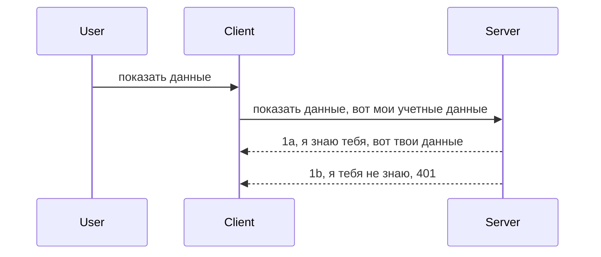

# Простая аутентификация

MCP SDK поддерживают использование OAuth 2.1, что, если честно, довольно сложный процесс, включающий такие понятия, как сервер аутентификации, сервер ресурсов, отправка учетных данных, получение кода, обмен кода на токен доступа, пока вы, наконец, не получите данные ресурса. Если вы не знакомы с OAuth, который является отличным решением для реализации, хорошей идеей будет начать с базового уровня аутентификации и постепенно переходить к более надежной безопасности. Вот почему существует эта глава — чтобы подготовить вас к более продвинутой аутентификации.

## Аутентификация, что мы имеем в виду?

Аутентификация — это сокращение от authentication и authorization. Идея в том, что нам нужно сделать две вещи:

- **Аутентификация**, то есть процесс определения, разрешать ли человеку войти в наш дом, имеет ли он право быть "здесь", то есть иметь доступ к нашему серверу ресурсов, где находятся функции MCP Server.
- **Авторизация** — это процесс определения, должен ли пользователь иметь доступ к конкретным запрашиваемым ресурсам, например, к заказам или продуктам, или разрешено ли ему только читать содержимое, но не удалять, как другой пример.

## Учетные данные: как мы идентифицируемся перед системой

Большинство веб-разработчиков начинают думать в терминах предоставления серверу учетных данных, обычно секрета, который сообщает, разрешено ли им быть здесь — аутентификация. Обычно учетные данные — это base64-закодированная версия имени пользователя и пароля или API-ключ, уникально идентифицирующий конкретного пользователя.

Это предполагает отправку через заголовок с именем "Authorization", например:

```json
{ "Authorization": "secret123" }
```
  
Это обычно называют базовой аутентификацией. Общий процесс работы выглядит следующим образом:


Теперь, когда мы понимаем, как это работает на уровне потока, как его внедрить? Большинство веб-серверов имеют концепцию middleware — части кода, которая выполняется в рамках запроса, может проверить учетные данные, и если они действительны, пропускает запрос дальше. Если учетные данные недействительны, возвращается ошибка аутентификации. Посмотрим, как это можно реализовать:

**Python**

```python
class AuthMiddleware(BaseHTTPMiddleware):
    async def dispatch(self, request, call_next):

        has_header = request.headers.get("Authorization")
        if not has_header:
            print("-> Missing Authorization header!")
            return Response(status_code=401, content="Unauthorized")

        if not valid_token(has_header):
            print("-> Invalid token!")
            return Response(status_code=403, content="Forbidden")

        print("Valid token, proceeding...")
       
        response = await call_next(request)
        # добавьте любые пользовательские заголовки или измените ответ каким-либо образом
        return response


starlette_app.add_middleware(CustomHeaderMiddleware)
```
  
Здесь мы:

- Создали middleware с именем `AuthMiddleware`, у которого метод `dispatch` вызывается веб-сервером.
- Добавили middleware в веб-сервер:

    ```python
    starlette_app.add_middleware(AuthMiddleware)
    ```
  
- Написали логику валидации, которая проверяет наличие заголовка Authorization и валидность передаваемого секрета:

    ```python
    has_header = request.headers.get("Authorization")
    if not has_header:
        print("-> Missing Authorization header!")
        return Response(status_code=401, content="Unauthorized")

    if not valid_token(has_header):
        print("-> Invalid token!")
        return Response(status_code=403, content="Forbidden")
    ```
  
Если секрет присутствует и валиден, мы пропускаем запрос дальше, вызывая `call_next` и возвращаем ответ.

    ```python
    response = await call_next(request)
    # добавьте любые пользовательские заголовки или измените ответ каким-либо образом
    return response
    ```
  
Работает это так: если веб-запрос к серверу осуществляется, middleware вызывается, и в зависимости от его реализации либо пропускает запрос, либо возвращает ошибку, указывая на то, что клиенту не разрешено продолжать.

**TypeScript**

Здесь мы создаем middleware с использованием популярного фреймворка Express и перехватываем запрос до того, как он дойдет до MCP Server. Вот код:

```typescript
function isValid(secret) {
    return secret === "secret123";
}

app.use((req, res, next) => {
    // 1. Заголовок авторизации присутствует?
    if(!req.headers["Authorization"]) {
        res.status(401).send('Unauthorized');
    }
    
    let token = req.headers["Authorization"];

    // 2. Проверить действительность.
    if(!isValid(token)) {
        res.status(403).send('Forbidden');
    }

   
    console.log('Middleware executed');
    // 3. Передать запрос на следующий этап обработки.
    next();
});
```
  
В этом коде мы:

1. Проверяем, присутствует ли заголовок Authorization; если нет — отправляем ошибку 401.
2. Проверяем валидность учетных данных/токена; если не валиден — отправляем ошибку 403.
3. Если все в порядке, передаем запрос дальше по цепочке и возвращаем запрошенный ресурс.

## Упражнение: Реализовать аутентификацию

Давайте применим знания и попробуем реализовать это. План такой:

Сервер

- Создать веб-сервер и экземпляр MCP.
- Реализовать middleware для сервера.

Клиент

- Отправить веб-запрос с учетными данными в заголовке.

### -1- Создать веб-сервер и экземпляр MCP

На первом шаге нам нужно создать экземпляр веб-сервера и MCP Server.

**Python**

Здесь мы создаем экземпляр MCP сервера, создаем web-приложение starlette и размещаем его с помощью uvicorn.

```python
# создание MCP сервера

app = FastMCP(
    name="MCP Resource Server",
    instructions="Resource Server that validates tokens via Authorization Server introspection",
    host=settings["host"],
    port=settings["port"],
    debug=True
)

# создание веб-приложения starlette
starlette_app = app.streamable_http_app()

# запуск приложения через uvicorn
async def run(starlette_app):
    import uvicorn
    config = uvicorn.Config(
            starlette_app,
            host=app.settings.host,
            port=app.settings.port,
            log_level=app.settings.log_level.lower(),
        )
    server = uvicorn.Server(config)
    await server.serve()

run(starlette_app)
```
  
В этом коде мы:

- Создаем MCP Server.
- Конструируем web-приложение starlette из MCP Server, `app.streamable_http_app()`.
- Размещаем и запускаем web-приложение с помощью uvicorn `server.serve()`.

**TypeScript**

Здесь мы создаем экземпляр MCP Server.

```typescript
const server = new McpServer({
      name: "example-server",
      version: "1.0.0"
    });

    // ... настройка ресурсов сервера, инструментов и подсказок ...
```
  
Создание MCP Server должно происходить внутри определения маршрута POST /mcp, поэтому давайте переместим код следующим образом:

```typescript
import express from "express";
import { randomUUID } from "node:crypto";
import { McpServer } from "@modelcontextprotocol/sdk/server/mcp.js";
import { StreamableHTTPServerTransport } from "@modelcontextprotocol/sdk/server/streamableHttp.js";
import { isInitializeRequest } from "@modelcontextprotocol/sdk/types.js"

const app = express();
app.use(express.json());

// Карта для хранения транспортов по идентификатору сессии
const transports: { [sessionId: string]: StreamableHTTPServerTransport } = {};

// Обработка POST-запросов для связи клиент-сервер
app.post('/mcp', async (req, res) => {
  // Проверка существующего идентификатора сессии
  const sessionId = req.headers['mcp-session-id'] as string | undefined;
  let transport: StreamableHTTPServerTransport;

  if (sessionId && transports[sessionId]) {
    // Повторное использование существующего транспорта
    transport = transports[sessionId];
  } else if (!sessionId && isInitializeRequest(req.body)) {
    // Новый запрос инициализации
    transport = new StreamableHTTPServerTransport({
      sessionIdGenerator: () => randomUUID(),
      onsessioninitialized: (sessionId) => {
        // Сохранить транспорт по идентификатору сессии
        transports[sessionId] = transport;
      },
      // Защита от DNS-перепривязки отключена по умолчанию для обратной совместимости. Если вы запускаете этот сервер
      // локально, убедитесь, что установили:
      // enableDnsRebindingProtection: true,
      // allowedHosts: ['127.0.0.1'],
    });

    // Очистить транспорт при закрытии
    transport.onclose = () => {
      if (transport.sessionId) {
        delete transports[transport.sessionId];
      }
    };
    const server = new McpServer({
      name: "example-server",
      version: "1.0.0"
    });

    // ... настройка серверных ресурсов, инструментов и запросов ...

    // Подключение к серверу MCP
    await server.connect(transport);
  } else {
    // Недопустимый запрос
    res.status(400).json({
      jsonrpc: '2.0',
      error: {
        code: -32000,
        message: 'Bad Request: No valid session ID provided',
      },
      id: null,
    });
    return;
  }

  // Обработать запрос
  await transport.handleRequest(req, res, req.body);
});

// Повторно используемый обработчик для GET и DELETE запросов
const handleSessionRequest = async (req: express.Request, res: express.Response) => {
  const sessionId = req.headers['mcp-session-id'] as string | undefined;
  if (!sessionId || !transports[sessionId]) {
    res.status(400).send('Invalid or missing session ID');
    return;
  }
  
  const transport = transports[sessionId];
  await transport.handleRequest(req, res);
};

// Обработка GET-запросов для уведомлений сервера клиенту через SSE
app.get('/mcp', handleSessionRequest);

// Обработка DELETE-запросов для завершения сессии
app.delete('/mcp', handleSessionRequest);

app.listen(3000);
```
  
Теперь вы видите, что создание MCP Server перемещено внутрь `app.post("/mcp")`.

Двигаемся дальше к следующему шагу — созданию middleware для проверки входящих учетных данных.

### -2- Реализовать middleware для сервера

Переходим к части с middleware. Мы создадим middleware, который ищет учетные данные в заголовке `Authorization` и проверяет их. Если они приемлемы, запрос пройдет дальше и выполнит то, для чего предназначен (например, перечислить инструменты, прочитать ресурс или выполнить другую функциональность MCP).

**Python**

Для создания middleware нам нужно создать класс, наследующий от `BaseHTTPMiddleware`. Важны две части:

- Запрос `request`, из которого считываем заголовки.
- `call_next` — callback, который вызывается, если клиент передал приемлемые учетные данные.

Сначала мы обрабатываем случай отсутствия заголовка `Authorization`:

```python
has_header = request.headers.get("Authorization")

# заголовок отсутствует, ошибка 401, в противном случае продолжить.
if not has_header:
    print("-> Missing Authorization header!")
    return Response(status_code=401, content="Unauthorized")
```
  
Здесь мы отправляем сообщение 401 unauthorized, так как клиент не прошел аутентификацию.

Далее, если учетные данные переданы, нам нужно проверить их валидность следующим образом:

```python
 if not valid_token(has_header):
    print("-> Invalid token!")
    return Response(status_code=403, content="Forbidden")
```
  
Обратите внимание, что мы отправляем сообщение 403 forbidden. Вот полный код middleware, реализующий все вышеописанное:

```python
class AuthMiddleware(BaseHTTPMiddleware):
    async def dispatch(self, request, call_next):

        has_header = request.headers.get("Authorization")
        if not has_header:
            print("-> Missing Authorization header!")
            return Response(status_code=401, content="Unauthorized")

        if not valid_token(has_header):
            print("-> Invalid token!")
            return Response(status_code=403, content="Forbidden")

        print("Valid token, proceeding...")
        print(f"-> Received {request.method} {request.url}")
        response = await call_next(request)
        response.headers['Custom'] = 'Example'
        return response

```
  
Отлично, а что насчет функции `valid_token`? Вот она:

```python
# НЕ используйте для производства - улучшите это !!
def valid_token(token: str) -> bool:
    # удалите префикс "Bearer "
    if token.startswith("Bearer "):
        token = token[7:]
        return token == "secret-token"
    return False
```
  
Это, конечно, можно улучшить.

ВАЖНО: Никогда не храните секреты подобным образом в коде. Лучше получать сравниваемое значение из базы данных или IDP (поставщика идентификации) либо, еще лучше, доверить проверку IDP.

**TypeScript**

Для реализации с Express используем метод `use`, который принимает middleware функции.

Нужно:

- Получить учетные данные из заголовка `Authorization` из объекта запроса.
- Проверить их действительность, и если корректно, пропустить запрос дальше, чтобы MCP запрос клиента мог выполнить свои действия (например, вывести инструменты, считать ресурс и т.п.).

Здесь проверяется наличие заголовка Authorization, и если его нет, запрос останавливается:

```typescript
if(!req.headers["authorization"]) {
    res.status(401).send('Unauthorized');
    return;
}
```
  
Если заголовок отсутствует — вы получите 401.

Затем проверяем валидность учетных данных; если они невалидны — опять останавливаем запрос, но с сообщением 403:

```typescript
if(!isValid(token)) {
    res.status(403).send('Forbidden');
    return;
} 
```
  
Обратите внимание, что теперь вы получаете ошибку 403.

Вот полный код:

```typescript
app.use((req, res, next) => {
    console.log('Request received:', req.method, req.url, req.headers);
    console.log('Headers:', req.headers["authorization"]);
    if(!req.headers["authorization"]) {
        res.status(401).send('Unauthorized');
        return;
    }
    
    let token = req.headers["authorization"];

    if(!isValid(token)) {
        res.status(403).send('Forbidden');
        return;
    }  

    console.log('Middleware executed');
    next();
});
```
  
Мы организовали веб-сервер с middleware, которое проверяет учетные данные клиента. А как насчет самого клиента?

### -3- Отправить веб-запрос с учетными данными в заголовке

Нужно обеспечить, чтобы клиент передавал учетные данные через заголовок. Поскольку мы собираемся использовать MCP клиент, нужно понять, как это сделать.

**Python**

Для клиента нам нужно передать заголовок с учетными данными следующим образом:

```python
# НЕ устанавливайте значение жестко, храните его как минимум в переменной окружения или в более безопасном хранилище
token = "secret-token"

async with streamablehttp_client(
        url = f"http://localhost:{port}/mcp",
        headers = {"Authorization": f"Bearer {token}"}
    ) as (
        read_stream,
        write_stream,
        session_callback,
    ):
        async with ClientSession(
            read_stream,
            write_stream
        ) as session:
            await session.initialize()
      
            # TODO, что вы хотите выполнить на клиенте, например, перечислить инструменты, вызвать инструменты и т.д.
```
  
Обратите внимание, как мы формируем свойство `headers` так: `headers = {"Authorization": f"Bearer {token}"}`.

**TypeScript**

Решение на два шага:

1. Заполнить объект конфигурации учетными данными.
2. Передать объект конфигурации в транспорт.

```typescript

// НЕ жёстко кодируйте значение, как показано здесь. Минимум используйте переменную окружения и что-то вроде dotenv (в режиме разработки).
let token = "secret123"

// определить объект параметров транспорта клиента
let options: StreamableHTTPClientTransportOptions = {
  sessionId: sessionId,
  requestInit: {
    headers: {
      "Authorization": "secret123"
    }
  }
};

// передать объект параметров в транспорт
async function main() {
   const transport = new StreamableHTTPClientTransport(
      new URL(serverUrl),
      options
   );
```
  
Здесь видно, что мы создали объект `options` и поместили заголовки в свойство `requestInit`.

ВАЖНО: Как же улучшить это решение? Текущий подход имеет проблемы. Во-первых, передача учетных данных таким образом очень рискованна, если у вас не используется HTTPS. Даже при HTTPS учетные данные могут быть украдены, поэтому нужна система, где можно быстро отозвать токен и добавить дополнительные проверки — откуда он пришел, не слишком ли часто выполняются запросы (поведение бота) и много других соображений.

Тем не менее стоит сказать, что для очень простых API, где вы не хотите, чтобы кто-либо вызывал ваш API без аутентификации, то это вполне разумное начало.

С учетом сказанного, давайте попробуем повысить безопасность, используя стандартизированный формат — JSON Web Token, известный как JWT или "JOT" токены.

## JSON Web Tokens, JWT

Итак, мы пытаемся улучшить ситуацию по сравнению с обычной передачей простых учетных данных. Какие основные преимущества мы получаем, внедрив JWT?

- **Улучшенная безопасность**. При базовой аутентификации вы постоянно отправляете имя пользователя и пароль в виде base64 токена (или API ключ), что увеличивает риски. С JWT вы отправляете имя пользователя и пароль один раз, получаете токен, который имеет время действия (истекает). JWT также позволяет использовать тонкую настройку прав доступа с ролями, областями и разрешениями.
- **Отсутствие состояния и масштабируемость**. JWT автономны, содержат всю информацию о пользователе, что исключает необходимость хранить сессии на сервере. Токены можно проверять локально.
- **Совместимость и федерация**. JWT — основа Open ID Connect и используются популярными провайдерами идентификации, такими как Entra ID, Google Identity и Auth0. Они позволяют реализовать единый вход (SSO) и многое другое, делая их корпоративным решением.
- **Модульность и гибкость**. JWT можно использовать с API шлюзами, например Azure API Management, NGINX и др. Они поддерживают сценарии аутентификации пользователей и коммуникацию между сервисами, включая делегирование.
- **Производительность и кеширование**. JWT можно кешировать после декодирования, что уменьшает количество парсинга. Это полезно для высоконагруженных приложений, увеличивая пропускную способность и снижая нагрузку на инфраструктуру.
- **Дополнительные функции**. Поддерживаются интроспекция (проверка валидности на сервере) и отзыв токенов (делание токена недействительным).

С учетом всех этих преимуществ, давайте посмотрим, как вывести нашу реализацию на новый уровень.

## Превращение базовой аутентификации в JWT

Итак, на высоком уровне нам нужно:

- **Научиться создавать JWT токен** и готовить его для передачи от клиента к серверу.
- **Проверять JWT токен**, и если он валиден, предоставлять клиенту доступ к ресурсам.
- **Безопасно хранить токен**.
- **Защитить маршруты**. В нашем случае — защитить маршруты и конкретные функции MCP.
- **Добавить рефреш токены**. Создавать короткоживущие токены и долгоживущие рефреш токены, которые позволяют получить новые токены при истечении срока. Также реализовать endpoint для рефреша и стратегию ротации.

### -1- Создание JWT токена

Во-первых, JWT токен состоит из следующих частей:

- **header** — алгоритм и тип токена.
- **payload** — утверждения (claims) типа sub (пользователь или сущность, которой принадлежит токен, обычно user id), exp (время истечения), role (роль).
- **signature** — подпись с использованием секрета или приватного ключа.

Для этого создадим header, payload и закодируем токен.

**Python**

```python

import jwt
import jwt
from jwt.exceptions import ExpiredSignatureError, InvalidTokenError
import datetime

# Секретный ключ, используемый для подписи JWT
secret_key = 'your-secret-key'

header = {
    "alg": "HS256",
    "typ": "JWT"
}

# информация о пользователе, его претензии и время истечения
payload = {
    "sub": "1234567890",               # Субъект (ID пользователя)
    "name": "User Userson",                # Пользовательское требование
    "admin": True,                     # Пользовательское требование
    "iat": datetime.datetime.utcnow(),# Время создания
    "exp": datetime.datetime.utcnow() + datetime.timedelta(hours=1)  # Время истечения
}

# закодировать это
encoded_jwt = jwt.encode(payload, secret_key, algorithm="HS256", headers=header)
```
  
В приведенном выше коде мы:

- Определили header с алгоритмом HS256 и типом JWT.
- Сформировали payload с subject или user id, именем пользователя, ролью, временем выпуска и временем истечения, реализуя тем самым ограничение действия по времени.

**TypeScript**

Нам нужны зависимости, которые помогут формировать JWT токен.

Зависимости

```sh

npm install jsonwebtoken
npm install --save-dev @types/jsonwebtoken
```
  
Теперь, имея это, создадим header, payload и сгенерируем закодированный токен.

```typescript
import jwt from 'jsonwebtoken';

const secretKey = 'your-secret-key'; // Используйте переменные окружения в продакшене

// Определите полезную нагрузку
const payload = {
  sub: '1234567890',
  name: 'User usersson',
  admin: true,
  iat: Math.floor(Date.now() / 1000), // Время выдачи
  exp: Math.floor(Date.now() / 1000) + 60 * 60 // Истекает через 1 час
};

// Определите заголовок (необязательно, jsonwebtoken устанавливает значения по умолчанию)
const header = {
  alg: 'HS256',
  typ: 'JWT'
};

// Создайте токен
const token = jwt.sign(payload, secretKey, {
  algorithm: 'HS256',
  header: header
});

console.log('JWT:', token);
```
  
Этот токен:

Подписан с использованием HS256  
Действителен 1 час  
Включает утверждения sub, name, admin, iat и exp.

### -2- Валидация токена

Нужно также валидировать токен — эта проверка производится на сервере, чтобы убедиться, что то, что клиент передает, действительно валидно. Нужно провести много проверок — от структуры до срока действия. Рекомендуется также проверять, что пользователь есть в системе и имеет нужные права.

Для валидации нам надо декодировать токен, чтобы прочитать его содержимое, и начать проверять валидность:

**Python**

```python

# Декодировать и проверить JWT
try:
    decoded = jwt.decode(token, secret_key, algorithms=["HS256"])
    print("✅ Token is valid.")
    print("Decoded claims:")
    for key, value in decoded.items():
        print(f"  {key}: {value}")
except ExpiredSignatureError:
    print("❌ Token has expired.")
except InvalidTokenError as e:
    print(f"❌ Invalid token: {e}")

```
  
Здесь мы вызываем `jwt.decode`, передавая токен, секретный ключ и алгоритм. Обратите внимание на конструкцию try-catch: при неудачной проверке возникает исключение.

**TypeScript**

Здесь вызываем `jwt.verify`, чтобы получить декодированный токен для анализа. Если вызов неудачен, значит структура токена неправильная или он недействителен. 

```typescript

try {
  const decoded = jwt.verify(token, secretKey);
  console.log('Decoded Payload:', decoded);
} catch (err) {
  console.error('Token verification failed:', err);
}
```
  
ПРИМЕЧАНИЕ: как упоминалось ранее, рекомендуется дополнительно проверять, что токен соответствует пользователю в системе и что у пользователя есть заявленные права.
Далее, давайте рассмотрим управление доступом на основе ролей, также известное как RBAC.

## Добавление управления доступом на основе ролей

Идея заключается в том, что мы хотим выразить, что разные роли имеют разные разрешения. Например, мы предполагаем, что администратор может делать всё, а обычные пользователи могут читать/писать, а гости могут только читать. Следовательно, вот некоторые возможные уровни разрешений:

- Admin.Write 
- User.Read
- Guest.Read

Давайте посмотрим, как мы можем реализовать такой контроль с помощью промежуточного ПО (middleware). Промежуточное ПО можно добавить как на отдельные маршруты, так и на все маршруты.

**Python**

```python
from starlette.middleware.base import BaseHTTPMiddleware
from starlette.responses import JSONResponse
import jwt

# НЕ храните секрет в коде, это только для демонстрационных целей. Читайте его из безопасного места.
SECRET_KEY = "your-secret-key" # поместите это в переменную окружения
REQUIRED_PERMISSION = "User.Read"

class JWTPermissionMiddleware(BaseHTTPMiddleware):
    async def dispatch(self, request, call_next):
        auth_header = request.headers.get("Authorization")
        if not auth_header or not auth_header.startswith("Bearer "):
            return JSONResponse({"error": "Missing or invalid Authorization header"}, status_code=401)

        token = auth_header.split(" ")[1]
        try:
            decoded = jwt.decode(token, SECRET_KEY, algorithms=["HS256"])
        except jwt.ExpiredSignatureError:
            return JSONResponse({"error": "Token expired"}, status_code=401)
        except jwt.InvalidTokenError:
            return JSONResponse({"error": "Invalid token"}, status_code=401)

        permissions = decoded.get("permissions", [])
        if REQUIRED_PERMISSION not in permissions:
            return JSONResponse({"error": "Permission denied"}, status_code=403)

        request.state.user = decoded
        return await call_next(request)


```

Существует несколько способов добавить промежуточное ПО, например, как ниже:

```python

# Вариант 1: добавить middleware при создании приложения starlette
middleware = [
    Middleware(JWTPermissionMiddleware)
]

app = Starlette(routes=routes, middleware=middleware)

# Вариант 2: добавить middleware после того, как приложение starlette уже создано
starlette_app.add_middleware(JWTPermissionMiddleware)

# Вариант 3: добавить middleware для каждого маршрута
routes = [
    Route(
        "/mcp",
        endpoint=..., # обработчик
        middleware=[Middleware(JWTPermissionMiddleware)]
    )
]
```

**TypeScript**

Мы можем использовать `app.use` и промежуточное ПО, которое будет выполняться для всех запросов.

```typescript
app.use((req, res, next) => {
    console.log('Request received:', req.method, req.url, req.headers);
    console.log('Headers:', req.headers["authorization"]);

    // 1. Проверьте, был ли отправлен заголовок авторизации

    if(!req.headers["authorization"]) {
        res.status(401).send('Unauthorized');
        return;
    }
    
    let token = req.headers["authorization"];

    // 2. Проверьте, действителен ли токен
    if(!isValid(token)) {
        res.status(403).send('Forbidden');
        return;
    }  

    // 3. Проверьте, существует ли пользователь токена в нашей системе
    if(!isExistingUser(token)) {
        res.status(403).send('Forbidden');
        console.log("User does not exist");
        return;
    }
    console.log("User exists");

    // 4. Проверьте, что токен имеет правильные разрешения
    if(!hasScopes(token, ["User.Read"])){
        res.status(403).send('Forbidden - insufficient scopes');
    }

    console.log("User has required scopes");

    console.log('Middleware executed');
    next();
});

```

Есть несколько вещей, которые мы можем позволить нашему промежуточному ПО делать и которые НАДО сделать, а именно:

1. Проверить, присутствует ли заголовок авторизации
2. Проверить, действителен ли токен, мы вызываем `isValid` — метод, который мы написали для проверки целостности и действительности JWT токена.
3. Проверить, существует ли пользователь в нашей системе, это нужно проверить.

   ```typescript
    // пользователи в базе данных
   const users = [
     "user1",
     "User usersson",
   ]

   function isExistingUser(token) {
     let decodedToken = verifyToken(token);

     // TODO, проверить, существует ли пользователь в базе данных
     return users.includes(decodedToken?.name || "");
   }
   ```

   Выше мы создали очень простой список `users`, который, разумеется, должен храниться в базе данных.

4. Кроме того, мы должны проверить, что у токена есть нужные разрешения.

   ```typescript
   if(!hasScopes(token, ["User.Read"])){
        res.status(403).send('Forbidden - insufficient scopes');
   }
   ```

   В коде выше из промежуточного ПО проверяется, что токен содержит разрешение User.Read, если нет — отправляем ошибку 403. Далее приведён вспомогательный метод `hasScopes`.

   ```typescript
   function hasScopes(scope: string, requiredScopes: string[]) {
     let decodedToken = verifyToken(scope);
    return requiredScopes.every(scope => decodedToken?.scopes.includes(scope));
  }
   ```

Have a think which additional checks you should be doing, but these are the absolute minimum of checks you should be doing.

Using Express as a web framework is a common choice. There are helpers library when you use JWT so you can write less code.

- `express-jwt`, helper library that provides a middleware that helps decode your token.
- `express-jwt-permissions`, this provides a middleware `guard` that helps check if a certain permission is on the token.

Here's what these libraries can look like when used:

```typescript
const express = require('express');
const jwt = require('express-jwt');
const guard = require('express-jwt-permissions')();

const app = express();
const secretKey = 'your-secret-key'; // put this in env variable

// Decode JWT and attach to req.user
app.use(jwt({ secret: secretKey, algorithms: ['HS256'] }));

// Check for User.Read permission
app.use(guard.check('User.Read'));

// multiple permissions
// app.use(guard.check(['User.Read', 'Admin.Access']));

app.get('/protected', (req, res) => {
  res.json({ message: `Welcome ${req.user.name}` });
});

// Error handler
app.use((err, req, res, next) => {
  if (err.code === 'permission_denied') {
    return res.status(403).send('Forbidden');
  }
  next(err);
});

```

Теперь вы видели, как промежуточное ПО можно использовать как для аутентификации, так и для авторизации, а что насчёт MCP? Изменяет ли он способ аутентификации? Давайте узнаем в следующем разделе.

### -3- Добавление RBAC в MCP

Вы уже увидели, как можно добавить RBAC с помощью промежуточного ПО, однако для MCP нет простого способа добавить RBAC для каждой функции MCP, так что же делать? Ну, нам просто нужно добавить код, который проверяет, имеет ли клиент права на вызов конкретного инструмента:

У вас есть несколько вариантов, как реализовать RBAC по каждой функции, вот некоторые из них:

- Добавить проверку для каждого инструмента, ресурса, запроса, где необходимо проверить уровень доступа.

   **python**

   ```python
   @tool()
   def delete_product(id: int):
      try:
          check_permissions(role="Admin.Write", request)
      catch:
        pass # клиент не прошёл авторизацию, вызовите ошибку авторизации
   ```

   **typescript**

   ```typescript
   server.registerTool(
    "delete-product",
    {
      title: Delete a product",
      description: "Deletes a product",
      inputSchema: { id: z.number() }
    },
    async ({ id }) => {
      
      try {
        checkPermissions("Admin.Write", request);
        // сделать, отправить id в productService и remote entry
      } catch(Exception e) {
        console.log("Authorization error, you're not allowed");  
      }

      return {
        content: [{ type: "text", text: `Deletected product with id ${id}` }]
      };
    }
   );
   ```


- Использовать продвинутый подход на сервере и обработчики запросов, чтобы минимизировать количество мест, где нужна проверка.

   **Python**

   ```python
   
   tool_permission = {
      "create_product": ["User.Write", "Admin.Write"],
      "delete_product": ["Admin.Write"]
   }

   def has_permission(user_permissions, required_permissions) -> bool:
      # user_permissions: список разрешений, которыми обладает пользователь
      # required_permissions: список разрешений, необходимых для инструмента
      return any(perm in user_permissions for perm in required_permissions)

   @server.call_tool()
   async def handle_call_tool(
     name: str, arguments: dict[str, str] | None
   ) -> list[types.TextContent]:
    # Предположим, что request.user.permissions — это список разрешений пользователя
     user_permissions = request.user.permissions
     required_permissions = tool_permission.get(name, [])
     if not has_permission(user_permissions, required_permissions):
        # Выдать ошибку "У вас нет разрешения на вызов инструмента {name}"
        raise Exception(f"You don't have permission to call tool {name}")
     # продолжить и вызвать инструмент
     # ...
   ```   
   

   **TypeScript**

   ```typescript
   function hasPermission(userPermissions: string[], requiredPermissions: string[]): boolean {
       if (!Array.isArray(userPermissions) || !Array.isArray(requiredPermissions)) return false;
       // Вернуть true, если у пользователя есть хотя бы одно требуемое разрешение
       
       return requiredPermissions.some(perm => userPermissions.includes(perm));
   }
  
   server.setRequestHandler(CallToolRequestSchema, async (request) => {
      const { params: { name } } = request;
  
      let permissions = request.user.permissions;
  
      if (!hasPermission(permissions, toolPermissions[name])) {
         return new Error(`You don't have permission to call ${name}`);
      }
  
      // продолжать..
   });
   ```

   Обратите внимание, что вам нужно убедиться, что ваше промежуточное ПО присваивает декодированный токен свойству user объекта request, чтобы код выше был простым.

### Итоги

Теперь, когда мы обсудили, как добавить поддержку RBAC в целом и для MCP в частности, пора попробовать самостоятельно реализовать безопасность, чтобы убедиться, что вы поняли представленные вам концепции.

## Задание 1: Постройте MCP сервер и MCP клиент с использованием базовой аутентификации

Здесь вы примените полученные знания о передаче учетных данных через заголовки.

## Решение 1

[Решение 1](./code/basic/README.md)

## Задание 2: Улучшите решение из Задания 1, используя JWT

Возьмите первое решение, но на этот раз улучшите его.

Вместо Basic Auth используйте JWT.

## Решение 2

[Решение 2](./solution/jwt-solution/README.md)

## Задача

Добавьте RBAC по инструменту, который мы описали в разделе «Добавление RBAC в MCP».

## Резюме

Надеюсь, вы узнали много нового в этой главе: от отсутствия безопасности, до базовой безопасности, JWT и того, как его можно внедрить в MCP.

Мы создали прочную основу с кастомными JWT, но по мере масштабирования движемся к модели идентификации, основанной на стандартах. Использование IdP, такого как Entra или Keycloak, позволяет нам передать управление выпуском, проверкой и жизненным циклом токенов доверенной платформе — освобождая нас для сосредоточения на логике приложения и опыте пользователя.

Для этого у нас есть более [продвинутая глава про Entra](../../05-AdvancedTopics/mcp-security-entra/README.md)

## Что дальше

- Далее: [Настройка MCP хостов](../12-mcp-hosts/README.md)

---

<!-- CO-OP TRANSLATOR DISCLAIMER START -->
**Отказ от ответственности**:
Данный документ был переведен с помощью автоматического переводческого сервиса [Co-op Translator](https://github.com/Azure/co-op-translator). Несмотря на наши усилия по обеспечению точности, пожалуйста, учтите, что автоматические переводы могут содержать ошибки или неточности. Оригинальный документ на его родном языке должен считаться авторитетным источником. Для получения критически важной информации рекомендуется обращаться к профессиональному переводу, выполненному человеком. Мы не несем ответственности за любые недоразумения или неправильные толкования, возникшие в результате использования данного перевода.
<!-- CO-OP TRANSLATOR DISCLAIMER END -->