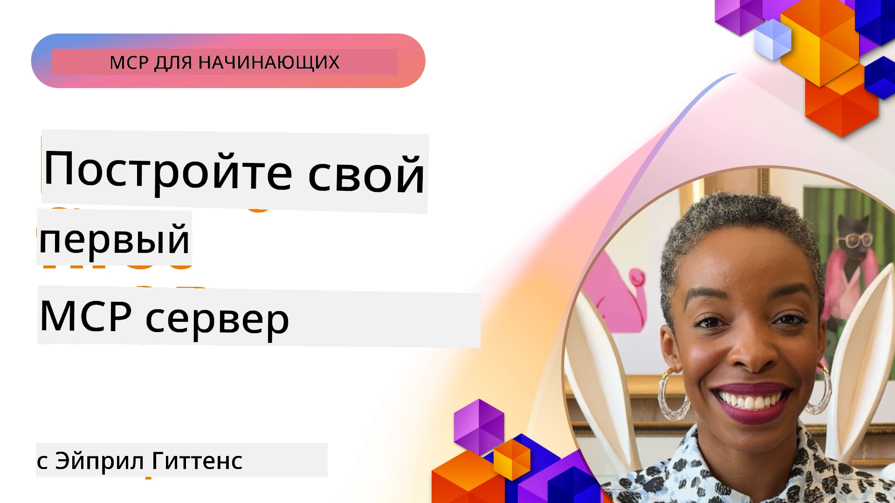

## Начало работы  

_(Нажмите на изображение выше, чтобы посмотреть видео этого урока)_

Этот раздел состоит из нескольких уроков:

- **1 Ваш первый сервер**, в этом первом уроке вы научитесь создавать свой первый сервер и исследовать его с помощью инструмента инспектора, ценного способа тестирования и отладки вашего сервера, [к уроку](01-first-server/README.md)

- **2 Клиент**, в этом уроке вы научитесь писать клиент, который может подключаться к вашему серверу, [к уроку](02-client/README.md)

- **3 Клиент с LLM**, ещё лучший способ написания клиента — добавить в него LLM, чтобы он мог «вести переговоры» с вашим сервером о том, что делать, [к уроку](03-llm-client/README.md)

- **4 Использование режима агента GitHub Copilot на сервере в Visual Studio Code**. Здесь мы рассматриваем запуск нашего MCP сервера из Visual Studio Code, [к уроку](04-vscode/README.md)

- **5 Сервер с транспортом stdio**. Транспорт stdio — это рекомендуемый стандарт для локальной связи между MCP сервером и клиентом, обеспечивающий безопасную коммуникацию через подпроцессы с встроенной изоляцией процессов, [к уроку](05-stdio-server/README.md)

- **6 HTTP потоковая передача с MCP (Streamable HTTP)**. Узнайте о современном HTTP потоковом транспорте (рекомендуемый подход для удалённых MCP серверов согласно [MCP Спецификации 2025-11-25](https://spec.modelcontextprotocol.io/specification/2025-11-25/basic/transports/#streamable-http)), уведомлениях о прогрессе и о том, как реализовать масштабируемые, реального времени MCP серверы и клиенты с использованием Streamable HTTP. [к уроку](06-http-streaming/README.md)

- **7 Использование AI Toolkit для VSCode** для потребления и тестирования ваших MCP клиентов и серверов, [к уроку](07-aitk/README.md)

- **8 Тестирование**. Здесь мы сосредоточимся именно на том, как можно протестировать наш сервер и клиент различными способами, [к уроку](08-testing/README.md)

- **9 Развертывание**. В этой главе мы рассмотрим разные способы развертывания ваших решений MCP, [к уроку](09-deployment/README.md)

- **10 Продвинутое использование сервера**. Эта глава охватывает продвинутое использование сервера, [к уроку](./10-advanced/README.md)

- **11 Аутентификация**. Эта глава рассказывает, как добавить простую аутентификацию: от Basic Auth до использования JWT и RBAC. Рекомендуется начать здесь, затем посмотреть продвинутые темы в главе 5 и выполнить дополнительное укрепление безопасности согласно рекомендациям из главы 2, [к уроку](./11-simple-auth/README.md)

- **12 MCP хосты**. Настройте и используйте популярные MCP хост клиенты, включая Claude Desktop, Cursor, Cline и Windsurf. Узнайте о типах транспорта и устранении неполадок, [к уроку](./12-mcp-hosts/README.md)

- **13 MCP Инспектор**. Интерактивно отлаживайте и тестируйте ваши MCP серверы с помощью инструмента MCP Inspector. Узнайте о средствах устранения неполадок, ресурсах и сообщениях протокола, [к уроку](./13-mcp-inspector/README.md)

Протокол Model Context Protocol (MCP) — это открытый протокол, который стандартизирует способ предоставления контекста приложениям для LLM. Можно сравнить MCP с USB-C портом для AI-приложений — он предоставляет стандартизированный способ подключения AI-моделей к различным источникам данных и инструментам.

## Цели обучения

К концу этого урока вы сможете:

- Настроить среды разработки для MCP на C#, Java, Python, TypeScript и JavaScript
- Создавать и развертывать базовые MCP серверы с пользовательскими функциями (ресурсы, подсказки и инструменты)
- Создавать хост-приложения для подключения к MCP серверам
- Тестировать и отлаживать реализации MCP
- Понимать распространённые проблемы настройки и их решения
- Подключать свои реализации MCP к популярным LLM сервисам

## Настройка вашей среды MCP

Прежде чем начать работу с MCP, важно подготовить среду разработки и понять базовый рабочий процесс. Этот раздел проведёт вас через начальные шаги настройки, чтобы обеспечить плавное начало работы с MCP.

### Требования

Перед погружением в разработку MCP убедитесь, что у вас есть:

- **Среда разработки**: для выбранного языка (C#, Java, Python, TypeScript или JavaScript)
- **IDE/редактор**: Visual Studio, Visual Studio Code, IntelliJ, Eclipse, PyCharm или любой современный редактор кода
- **Менеджеры пакетов**: NuGet, Maven/Gradle, pip или npm/yarn
- **API ключи**: для любых AI-сервисов, которые вы планируете использовать в своих хост-приложениях

### Официальные SDK

В следующих главах вы увидите решения, построенные с использованием Python, TypeScript, Java и .NET. Вот все официально поддерживаемые SDK.

MCP предоставляет официальные SDK для нескольких языков (в соответствии с [MCP Спецификацией 2025-11-25](https://spec.modelcontextprotocol.io/specification/2025-11-25/)):
- [C# SDK](https://github.com/modelcontextprotocol/csharp-sdk) — поддерживается в сотрудничестве с Microsoft
- [Java SDK](https://github.com/modelcontextprotocol/java-sdk) — поддерживается в сотрудничестве с Spring AI
- [TypeScript SDK](https://github.com/modelcontextprotocol/typescript-sdk) — официальная реализация на TypeScript
- [Python SDK](https://github.com/modelcontextprotocol/python-sdk) — официальная реализация на Python (FastMCP)
- [Kotlin SDK](https://github.com/modelcontextprotocol/kotlin-sdk) — официальная реализация на Kotlin
- [Swift SDK](https://github.com/modelcontextprotocol/swift-sdk) — поддерживается в сотрудничестве с Loopwork AI
- [Rust SDK](https://github.com/modelcontextprotocol/rust-sdk) — официальная реализация на Rust
- [Go SDK](https://github.com/modelcontextprotocol/go-sdk) — официальная реализация на Go

## Основные выводы

- Настройка среды разработки MCP проста с использованием SDK для конкретных языков
- Создание MCP серверов включает создание и регистрацию инструментов с ясными схемами
- Клиенты MCP подключаются к серверам и моделям для расширенных возможностей
- Тестирование и отладка необходимы для надежных реализаций MCP
- Варианты развертывания варьируются от локальной разработки до облачных решений

## Практика

У нас есть набор примеров, дополняющих упражнения, которые вы увидите во всех главах этого раздела. Кроме того, в каждой главе есть свои упражнения и задания

- [Калькулятор на Java](./samples/java/calculator/README.md)
- [Калькулятор на .Net](../../../03-GettingStarted/samples/csharp)
- [Калькулятор на JavaScript](./samples/javascript/README.md)
- [Калькулятор на TypeScript](./samples/typescript/README.md)
- [Калькулятор на Python](../../../03-GettingStarted/samples/python)

## Дополнительные ресурсы

- [Создание агентов с использованием Model Context Protocol на Azure](https://learn.microsoft.com/azure/developer/ai/intro-agents-mcp)
- [Удаленный MCP с Azure Container Apps (Node.js/TypeScript/JavaScript)](https://learn.microsoft.com/samples/azure-samples/mcp-container-ts/mcp-container-ts/)
- [.NET OpenAI MCP агент](https://learn.microsoft.com/samples/azure-samples/openai-mcp-agent-dotnet/openai-mcp-agent-dotnet/)

## Что дальше

Начните с первого урока: [Создание вашего первого MCP сервера](01-first-server/README.md)

После завершения этого модуля продолжайте: [Модуль 4: Практическая реализация](../04-PracticalImplementation/README.md)

---

<!-- CO-OP TRANSLATOR DISCLAIMER START -->
**Отказ от ответственности**:  
Этот документ был переведен с помощью сервиса машинного перевода [Co-op Translator](https://github.com/Azure/co-op-translator). Несмотря на наши усилия обеспечить точность, имейте в виду, что автоматический перевод может содержать ошибки или неточности. Оригинальный документ на его родном языке следует считать авторитетным источником. Для критически важной информации рекомендуется профессиональный перевод человеком. Мы не несем ответственности за любые недоразумения или неправильные толкования, возникшие в результате использования данного перевода.
<!-- CO-OP TRANSLATOR DISCLAIMER END -->