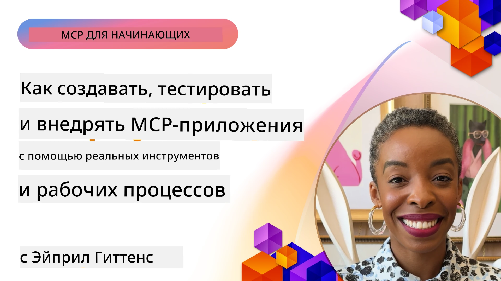

# Практическая реализация

[](https://youtu.be/vCN9-mKBDfQ)

_(Нажмите на изображение выше, чтобы посмотреть видео этого урока)_

Практическая реализация — это момент, когда мощь Протокола Контекста Модели (MCP) становится ощутимой. Понимание теории и архитектуры MCP важно, но настоящая ценность проявляется, когда вы применяете эти концепции для создания, тестирования и развёртывания решений, решающих реальные задачи. Эта глава преодолевает разрыв между концептуальными знаниями и практической разработкой, направляя вас через процесс воплощения приложений на базе MCP.

Будь то разработка интеллектуальных помощников, интеграция ИИ в бизнес-процессы или создание специализированных инструментов для обработки данных, MCP обеспечивает гибкую основу. Его язык-независимый дизайн и официальные SDK для популярных языков программирования делают его доступным для широкого круга разработчиков. Используя эти SDK, вы можете быстро создавать прототипы, внедрять изменения и масштабировать решения на различных платформах и средах.

В следующих разделах вы найдёте практические примеры, исходный код и стратегии развёртывания, демонстрирующие, как реализовать MCP на C#, Java с использованием Spring, TypeScript, JavaScript и Python. Вы также узнаете, как отлаживать и тестировать ваши серверы MCP, управлять API и развёртывать решения в облаке с помощью Azure. Эти практические материалы призваны ускорить ваше обучение и помочь уверенно создавать надёжные, готовые к эксплуатации MCP-приложения.

## Обзор

В этом уроке рассматриваются практические аспекты реализации MCP на нескольких языках программирования. Мы изучим, как использовать SDK MCP на C#, Java с Spring, TypeScript, JavaScript и Python для создания надёжных приложений, отладки и тестирования серверов MCP, а также создания повторно используемых ресурсов, шаблонов и инструментов.

## Цели обучения

По окончании урока вы сможете:

- Реализовывать решения MCP с использованием официальных SDK на различных языках программирования
- Систематически отлаживать и тестировать серверы MCP
- Создавать и использовать функции сервера (Ресурсы, Подсказки и Инструменты)
- Проектировать эффективные рабочие процессы MCP для сложных задач
- Оптимизировать реализации MCP по производительности и надёжности

## Официальные ресурсы SDK

Протокол Контекста Модели предлагает официальные SDK для нескольких языков (в соответствии с [MCP Specification 2025-11-25](https://spec.modelcontextprotocol.io/specification/2025-11-25/)):

- [C# SDK](https://github.com/modelcontextprotocol/csharp-sdk)
- [Java с Spring SDK](https://github.com/modelcontextprotocol/java-sdk) **Примечание:** требует зависимости от [Project Reactor](https://projectreactor.io). (См. [обсуждение #246](https://github.com/orgs/modelcontextprotocol/discussions/246).)
- [TypeScript SDK](https://github.com/modelcontextprotocol/typescript-sdk)
- [Python SDK](https://github.com/modelcontextprotocol/python-sdk)
- [Kotlin SDK](https://github.com/modelcontextprotocol/kotlin-sdk)
- [Go SDK](https://github.com/modelcontextprotocol/go-sdk)

## Работа с MCP SDK

В этом разделе приведены практические примеры реализации MCP на различных языках программирования. Вы найдёте пример кода в каталоге `samples`, организованном по языкам.

### Доступные примеры

В репозитории есть [примеры реализации](../../../04-PracticalImplementation/samples) на следующих языках:

- [C#](./samples/csharp/README.md)
- [Java с Spring](./samples/java/containerapp/README.md)
- [TypeScript](./samples/typescript/README.md)
- [JavaScript](./samples/javascript/README.md)
- [Python](./samples/python/README.md)

Каждый пример демонстрирует основные концепции MCP и шаблоны реализации для данного языка и экосистемы.

### Практические руководства

Дополнительные руководства по практической реализации MCP:

- [Пагинация и большие наборы результатов](./pagination/README.md) — обработка курсорной пагинации для инструментов, ресурсов и больших наборов данных

## Основные функции сервера

Серверы MCP могут реализовать любую комбинацию следующих функций:

### Ресурсы

Ресурсы предоставляют контекст и данные для использования пользователем или моделью ИИ:

- Репозитории документов
- Базы знаний
- Структурированные источники данных
- Файловые системы

### Подсказки

Подсказки — это шаблоны сообщений и рабочих процессов для пользователей:

- Предопределённые шаблоны диалогов
- Направленные паттерны взаимодействия
- Специализированные структуры диалогов

### Инструменты

Инструменты — функции для выполнения моделью ИИ:

- Утилиты обработки данных
- Интеграция с внешними API
- Вычислительные возможности
- Поисковая функциональность

## Примеры реализации: Реализация на C#

Официальный репозиторий SDK для C# содержит несколько примеров реализации, демонстрирующих разные аспекты MCP:

- **Базовый клиент MCP**: простой пример создания клиента MCP и вызова инструментов
- **Базовый сервер MCP**: минимальная реализация сервера с базовой регистрацией инструментов
- **Продвинутый сервер MCP**: полнофункциональный сервер с регистрацией инструментов, аутентификацией и обработкой ошибок
- **Интеграция с ASP.NET**: примеры интеграции с ASP.NET Core
- **Шаблоны реализации инструментов**: различные шаблоны для реализации инструментов с разным уровнем сложности

SDK MCP для C# находится в превью, API может изменяться. Мы будем регулярно обновлять этот блог по мере развития SDK.

### Ключевые возможности

- [C# MCP Nuget ModelContextProtocol](https://www.nuget.org/packages/ModelContextProtocol)
- Создание вашего [первого MCP сервера](https://devblogs.microsoft.com/dotnet/build-a-model-context-protocol-mcp-server-in-csharp/).

Для полноценных примеров реализации на C# посетите [официальный репозиторий с примерами SDK для C#](https://github.com/modelcontextprotocol/csharp-sdk)

## Пример реализации: Java с Spring

SDK для Java с Spring предлагает надёжные возможности реализации MCP с корпоративными функциями.

### Ключевые возможности

- Интеграция с Spring Framework
- Строгая типизация
- Поддержка реактивного программирования
- Полная обработка ошибок

Полный пример реализации на Java с Spring можно найти в [Java с Spring примере](samples/java/containerapp/README.md) в каталоге с примерами.

## Пример реализации: JavaScript

SDK для JavaScript обеспечивает лёгкий и гибкий подход к реализации MCP.

### Ключевые возможности

- Поддержка Node.js и браузера
- API на основе Promise
- Простая интеграция с Express и другими фреймворками
- Поддержка WebSocket для потоковой передачи

Полный пример реализации на JavaScript доступен в [JavaScript примере](samples/javascript/README.md) в каталоге с примерами.

## Пример реализации: Python

SDK для Python предлагает Python-центричный подход к реализации MCP с отличной интеграцией с ML-фреймворками.

### Ключевые возможности

- Поддержка async/await с asyncio
- Интеграция с FastAPI
- Простая регистрация инструментов
- Нативная интеграция с популярными ML-библиотеками

Полный пример реализации на Python доступен в [Python примере](samples/python/README.md) в каталоге с примерами.

## Управление API

Azure API Management — отличное решение для обеспечения безопасности серверов MCP. Идея состоит в том, чтобы разместить Azure API Management перед вашим сервером MCP и позволить ему обрабатывать необходимые функции, такие как:

- ограничение скорости
- управление токенами
- мониторинг
- балансировка нагрузки
- безопасность

### Пример Azure

Вот пример Azure, реализующий именно это, то есть [создание сервера MCP и его защиту с помощью Azure API Management](https://github.com/Azure-Samples/remote-mcp-apim-functions-python).

Посмотрите, как происходит поток авторизации на изображении ниже:


На приведённом изображении происходит следующее:

- Аутентификация / Авторизация осуществляется с помощью Microsoft Entra.
- Azure API Management выступает в роли шлюза и использует политики для управления потоками трафика.
- Azure Monitor ведёт журнал всех запросов для последующего анализа.

#### Поток авторизации

Рассмотрим более подробно поток авторизации:


#### Спецификация авторизации MCP

Подробнее вы можете узнать в [спецификации авторизации MCP](https://spec.modelcontextprotocol.io/specification/2025-11-25/basic/authorization/)

## Развёртывание удалённого MCP сервера в Azure

Посмотрим, можем ли мы развернуть ранее упомянутый пример:

1. Клонируйте репозиторий

    ```bash
    git clone https://github.com/Azure-Samples/remote-mcp-apim-functions-python.git
    cd remote-mcp-apim-functions-python
    ```

1. Зарегистрируйте провайдера ресурсов `Microsoft.App`.

   - Если вы используете Azure CLI, выполните `az provider register --namespace Microsoft.App --wait`.
   - Если вы используете Azure PowerShell, выполните `Register-AzResourceProvider -ProviderNamespace Microsoft.App`. Потом через некоторое время проверьте `(Get-AzResourceProvider -ProviderNamespace Microsoft.App).RegistrationState`, чтобы убедиться, что регистрация завершена.

1. Выполните следующую команду [azd](https://aka.ms/azd) для создания службы управления API, приложения функций (с кодом) и всех необходимых ресурсов Azure

    ```shell
    azd up
    ```

    Эта команда должна развернуть все облачные ресурсы в Azure

### Тестирование вашего сервера с MCP Inspector

1. В **новом окне терминала** установите и запустите MCP Inspector

    ```shell
    npx @modelcontextprotocol/inspector
    ```

    Вы увидите интерфейс, похожий на:

    

1. Нажмите CTRL и кликните, чтобы загрузить веб-приложение MCP Inspector по адресу, отображённому приложением (например, [http://127.0.0.1:6274/#resources](http://127.0.0.1:6274/#resources))
1. Установите тип транспорта на `SSE`
1. Введите URL-адрес вашего работающего API Management SSE endpoint, отображаемого после `azd up`, и нажмите **Подключиться**:

    ```shell
    https://<apim-servicename-from-azd-output>.azure-api.net/mcp/sse
    ```

1. **Список инструментов**. Кликните по инструменту и **Запустите инструмент**.

Если все шаги выполнены успешно, то вы теперь подключены к серверу MCP и смогли вызвать инструмент.

## MCP сервера для Azure

[Remote-mcp-functions](https://github.com/Azure-Samples/remote-mcp-functions-dotnet): этот набор репозиториев — шаблон быстрого старта для создания и развёртывания пользовательских удалённых серверов MCP (Model Context Protocol) с использованием Azure Functions на Python, C# .NET или Node/TypeScript.

Примеры предоставляют полное решение, позволяющее разработчикам:

- Создавать и запускать локально: разрабатывать и отлаживать сервер MCP на локальной машине
- Развёртывать в Azure: просто развернуть в облаке с помощью команды azd up
- Подключаться с клиентов: подключаться к серверу MCP с различных клиентов, включая режим агента Copilot в VS Code и инструмент MCP Inspector

### Основные возможности

- Безопасность по умолчанию: сервер MCP защищён с помощью ключей и HTTPS
- Опции аутентификации: поддержка OAuth с использованием встроенной аутентификации и/или API Management
- Изоляция сети: возможность сетевой изоляции с помощью виртуальных сетей Azure (VNET)
- Безсерверная архитектура: использование Azure Functions для масштабируемого, событийно-ориентированного исполнения
- Локальная разработка: полный набор инструментов для разработки и отладки локально
- Простой деплоймент: упрощённый процесс развёртывания в Azure

В репозитории содержатся все необходимые файлы конфигураций, исходный код и определения инфраструктуры, чтобы быстро начать работу с готовой к эксплуатации реализацией сервера MCP.

- [Azure Remote MCP Functions Python](https://github.com/Azure-Samples/remote-mcp-functions-python) — пример реализации MCP с использованием Azure Functions на Python

- [Azure Remote MCP Functions .NET](https://github.com/Azure-Samples/remote-mcp-functions-dotnet) — пример реализации MCP с использованием Azure Functions на C# .NET

- [Azure Remote MCP Functions Node/Typescript](https://github.com/Azure-Samples/remote-mcp-functions-typescript) — пример реализации MCP с использованием Azure Functions на Node/TypeScript.

## Ключевые выводы

- SDK MCP предоставляют специализированные инструменты для реализации надёжных MCP решений
- Процесс отладки и тестирования критически важен для надёжности MCP приложений
- Повторно используемые шаблоны подсказок обеспечивают единообразное взаимодействие с ИИ
- Хорошо продуманные рабочие процессы могут оркестрировать сложные задачи с несколькими инструментами
- Реализация MCP решений требует учета безопасности, производительности и обработки ошибок

## Упражнение

Спроектируйте практический рабочий процесс MCP, решающий реальную проблему в вашей области:

1. Выберите 3-4 инструмента, которые были бы полезны для решения этой задачи
2. Создайте диаграмму рабочего процесса, показывающую взаимодействие этих инструментов
3. Реализуйте базовую версию одного из инструментов на предпочтительном языке
4. Создайте шаблон подсказки, который поможет модели эффективно использовать ваш инструмент

## Дополнительные ресурсы

---

## Что дальше

Далее: [Продвинутые темы](../05-AdvancedTopics/README.md)

---

<!-- CO-OP TRANSLATOR DISCLAIMER START -->
**Отказ от ответственности**:  
Этот документ был переведен с использованием службы автоматического перевода [Co-op Translator](https://github.com/Azure/co-op-translator). Несмотря на наши усилия обеспечить точность, просим учитывать, что автоматический перевод может содержать ошибки или неточности. Оригинал документа на его исходном языке следует считать авторитетным источником. Для получения критически важной информации рекомендуется обращаться к профессиональному человеческому переводу. Мы не несем ответственности за любые недоразумения или неправильные толкования, возникшие в результате использования данного перевода.
<!-- CO-OP TRANSLATOR DISCLAIMER END -->