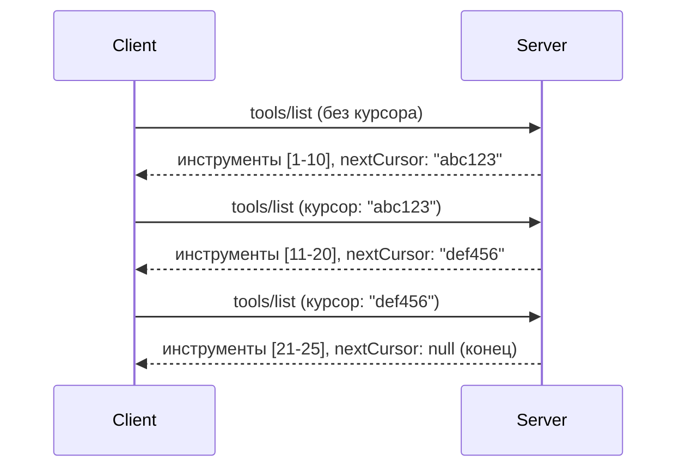

# Пагинация и большие наборы результатов в MCP

Когда ваш сервер MCP обрабатывает большие наборы данных — будь то список из тысяч файлов, записей базы данных или результатов поиска — нужна пагинация для эффективного управления памятью и обеспечения отзывчивого пользовательского интерфейса. В этом руководстве объясняется, как реализовать и использовать пагинацию в MCP.

## Почему пагинация важна

Без пагинации большие ответы могут вызвать:

- **Истощение памяти** — загрузка миллионов записей одновременно
- **Медленное время отклика** — пользователи ждут пока загрузятся все данные
- **Ошибки таймаута** — запросы превышают предельное время ожидания
- **Плохая производительность ИИ** — крупные языковые модели испытывают сложности с массивным контекстом

MCP использует **пагинацию на основе курсора** для надежного и последовательного просмотра наборов результатов.

---

## Как работает пагинация в MCP

### Концепция курсора

**Курсор** — это непрозрачная строка, которая отмечает ваше текущее положение в наборе результатов. Представьте его как закладку в длинной книге.


### Пагинация в методах MCP

Эти методы MCP поддерживают пагинацию:

| Метод | Возвращает | Поддержка курсора |
|--------|---------|----------------|
| `tools/list` | Определения инструментов | ✅ |
| `resources/list` | Определения ресурсов | ✅ |
| `prompts/list` | Определения подсказок | ✅ |
| `resources/templates/list` | Шаблоны ресурсов | ✅ |

---

## Реализация на сервере

### Python (FastMCP)

```python
from mcp.server import Server
from mcp.types import Tool, ListToolsResult
import math

app = Server("paginated-server")

# Смоделированный большой набор данных
ALL_TOOLS = [
    Tool(name=f"tool_{i}", description=f"Tool number {i}", inputSchema={})
    for i in range(100)
]

PAGE_SIZE = 10

@app.list_tools()
async def list_tools(cursor: str | None = None) -> ListToolsResult:
    """List tools with pagination support."""
    
    # Декодировать курсор для получения начального индекса
    start_index = 0
    if cursor:
        try:
            start_index = int(cursor)
        except ValueError:
            start_index = 0
    
    # Получить страницу результатов
    end_index = min(start_index + PAGE_SIZE, len(ALL_TOOLS))
    page_tools = ALL_TOOLS[start_index:end_index]
    
    # Вычислить следующий курсор
    next_cursor = None
    if end_index < len(ALL_TOOLS):
        next_cursor = str(end_index)
    
    return ListToolsResult(
        tools=page_tools,
        nextCursor=next_cursor
    )
```

### TypeScript

```typescript
import { Server } from "@modelcontextprotocol/sdk/server/index.js";
import { ListToolsResultSchema } from "@modelcontextprotocol/sdk/types.js";

const server = new Server({
  name: "paginated-server",
  version: "1.0.0"
});

// Смоделированный большой набор данных
const ALL_TOOLS = Array.from({ length: 100 }, (_, i) => ({
  name: `tool_${i}`,
  description: `Tool number ${i}`,
  inputSchema: { type: "object", properties: {} }
}));

const PAGE_SIZE = 10;

server.setRequestHandler(ListToolsResultSchema, async (request) => {
  // Декодировать курсор
  let startIndex = 0;
  if (request.params?.cursor) {
    startIndex = parseInt(request.params.cursor, 10) || 0;
  }
  
  // Получить страницу результатов
  const endIndex = Math.min(startIndex + PAGE_SIZE, ALL_TOOLS.length);
  const pageTools = ALL_TOOLS.slice(startIndex, endIndex);
  
  // Вычислить следующий курсор
  const nextCursor = endIndex < ALL_TOOLS.length ? String(endIndex) : undefined;
  
  return {
    tools: pageTools,
    nextCursor
  };
});
```

### Java (Spring MCP)

```java
@Service
public class PaginatedToolService {
    
    private static final int PAGE_SIZE = 10;
    private final List<Tool> allTools;
    
    public PaginatedToolService() {
        // Инициализировать большой набор данных
        this.allTools = IntStream.range(0, 100)
            .mapToObj(i -> new Tool("tool_" + i, "Tool number " + i, Map.of()))
            .collect(Collectors.toList());
    }
    
    @McpMethod("tools/list")
    public ListToolsResult listTools(@Param("cursor") String cursor) {
        // Декодировать курсор
        int startIndex = 0;
        if (cursor != null && !cursor.isEmpty()) {
            try {
                startIndex = Integer.parseInt(cursor);
            } catch (NumberFormatException e) {
                startIndex = 0;
            }
        }
        
        // Получить страницу результатов
        int endIndex = Math.min(startIndex + PAGE_SIZE, allTools.size());
        List<Tool> pageTools = allTools.subList(startIndex, endIndex);
        
        // Вычислить следующий курсор
        String nextCursor = endIndex < allTools.size() ? String.valueOf(endIndex) : null;
        
        return new ListToolsResult(pageTools, nextCursor);
    }
}
```

---

## Реализация на клиенте

### Python клиент

```python
from mcp import ClientSession

async def get_all_tools(session: ClientSession) -> list:
    """Fetch all tools using pagination."""
    all_tools = []
    cursor = None
    
    while True:
        result = await session.list_tools(cursor=cursor)
        all_tools.extend(result.tools)
        
        if result.nextCursor is None:
            break
        cursor = result.nextCursor
    
    return all_tools

# Использование
async with client_session as session:
    tools = await get_all_tools(session)
    print(f"Found {len(tools)} tools")
```

### TypeScript клиент

```typescript
import { Client } from "@modelcontextprotocol/sdk/client/index.js";

async function getAllTools(client: Client): Promise<Tool[]> {
  const allTools: Tool[] = [];
  let cursor: string | undefined = undefined;
  
  do {
    const result = await client.listTools({ cursor });
    allTools.push(...result.tools);
    cursor = result.nextCursor;
  } while (cursor);
  
  return allTools;
}

// Использование
const tools = await getAllTools(client);
console.log(`Found ${tools.length} tools`);
```

### Паттерн ленивой загрузки

Для очень больших наборов данных загружайте страницы по запросу:

```python
class PaginatedToolIterator:
    """Lazily iterate through paginated tools."""
    
    def __init__(self, session: ClientSession):
        self.session = session
        self.cursor = None
        self.buffer = []
        self.exhausted = False
    
    async def __anext__(self):
        # Вернуть из буфера, если доступно
        if self.buffer:
            return self.buffer.pop(0)
        
        # Проверить, что мы исчерпали все страницы
        if self.exhausted:
            raise StopAsyncIteration
        
        # Получить следующую страницу
        result = await self.session.list_tools(cursor=self.cursor)
        self.buffer = list(result.tools)
        self.cursor = result.nextCursor
        
        if self.cursor is None:
            self.exhausted = True
        
        if not self.buffer:
            raise StopAsyncIteration
        
        return self.buffer.pop(0)
    
    def __aiter__(self):
        return self

# Использование - эффективно по памяти для больших наборов данных
async for tool in PaginatedToolIterator(session):
    process_tool(tool)
```

---

## Пагинация для ресурсов

Ресурсам часто нужна пагинация для каталогов или больших наборов данных:

```python
from mcp.server import Server
from mcp.types import Resource, ListResourcesResult
import os

app = Server("file-server")

@app.list_resources()
async def list_resources(cursor: str | None = None) -> ListResourcesResult:
    """List files in directory with pagination."""
    
    directory = "/data/files"
    all_files = sorted(os.listdir(directory))
    
    # Декодировать курсор (индекс файла)
    start_index = int(cursor) if cursor else 0
    page_size = 20
    end_index = min(start_index + page_size, len(all_files))
    
    # Создать список ресурсов для этой страницы
    resources = []
    for filename in all_files[start_index:end_index]:
        filepath = os.path.join(directory, filename)
        resources.append(Resource(
            uri=f"file://{filepath}",
            name=filename,
            mimeType="application/octet-stream"
        ))
    
    # Вычислить следующий курсор
    next_cursor = str(end_index) if end_index < len(all_files) else None
    
    return ListResourcesResult(
        resources=resources,
        nextCursor=next_cursor
    )
```

---

## Стратегии проектирования курсора

### Стратегия 1: Индексная (простая)

```python
# Курсор — это просто индекс
cursor = "50"  # Начать с элемента 50
```

**Плюсы:** Простая, без состояния  
**Минусы:** Результаты могут смещаться, если добавляются или удаляются элементы

### Стратегия 2: По ID (устойчивая)

```python
# Курсор — последний просмотренный идентификатор
cursor = "item_abc123"  # Начать после этого элемента
```

**Плюсы:** Устойчива даже при изменении элементов  
**Минусы:** Требуются упорядоченные ID

### Стратегия 3: Закодированное состояние (сложная)

```python
import base64
import json

def encode_cursor(state: dict) -> str:
    return base64.b64encode(json.dumps(state).encode()).decode()

def decode_cursor(cursor: str) -> dict:
    return json.loads(base64.b64decode(cursor).decode())

# Курсор содержит несколько полей состояния
cursor = encode_cursor({
    "offset": 50,
    "filter": "active",
    "sort": "name"
})
```

**Плюсы:** Может кодировать сложное состояние  
**Минусы:** Более сложная, курсор получается длиннее

---

## Лучшие практики

### 1. Выбирайте подходящий размер страницы

```python
# Учтите размер данных
PAGE_SIZE_SMALL_ITEMS = 100   # Простые метаданные
PAGE_SIZE_MEDIUM_ITEMS = 20   # Более сложные объекты
PAGE_SIZE_LARGE_ITEMS = 5     # Сложное содержимое
```

### 2. Обрабатывайте недопустимые курсоры корректно

```python
@app.list_tools()
async def list_tools(cursor: str | None = None) -> ListToolsResult:
    try:
        start_index = int(cursor) if cursor else 0
        if start_index < 0 or start_index >= len(ALL_TOOLS):
            start_index = 0  # Сбросить в начало
    except (ValueError, TypeError):
        start_index = 0  # Недопустимый курсор, начать заново
    # ...
```

### 3. Включайте общее количество (по желанию)

```python
return ListToolsResult(
    tools=page_tools,
    nextCursor=next_cursor,
    # Некоторые реализации включают общее значение для прогресса интерфейса пользователя
    _meta={"total": len(ALL_TOOLS)}
)
```

### 4. Тестируйте граничные случаи

```python
async def test_pagination():
    # Пустой набор результатов
    result = await session.list_tools()
    assert result.tools == []
    assert result.nextCursor is None
    
    # Одна страница
    result = await session.list_tools()
    assert len(result.tools) <= PAGE_SIZE
    
    # Недействительный курсор
    result = await session.list_tools(cursor="invalid")
    assert result.tools  # Должен вернуть первую страницу
```

---

## Распространённые ошибки

### ❌ Возвращать все результаты, а потом делать пагинацию на клиенте

```python
# ПЛОХО: Загружает всё в память
@app.list_tools()
async def list_tools() -> ListToolsResult:
    all_tools = load_all_tools()  # 1 миллион инструментов!
    return ListToolsResult(tools=all_tools)
```

### ✅ Делать пагинацию на уровне источника данных

```python
# ХОРОШО: Загружает только необходимое
@app.list_tools()
async def list_tools(cursor: str | None = None) -> ListToolsResult:
    offset = int(cursor) if cursor else 0
    tools = await db.query_tools(offset=offset, limit=PAGE_SIZE)
    return ListToolsResult(tools=tools, nextCursor=...)
```

---

## Что дальше

- [Модуль 5.14 - Инжиниринг контекста](../../05-AdvancedTopics/mcp-contextengineering/README.md)  
- [Модуль 8 - Лучшие практики](../../08-BestPractices/README.md)  
- [3.8 - Тестирование вашего MCP сервера](../../03-GettingStarted/08-testing/README.md)  

---

## Дополнительные ресурсы

- [Спецификация MCP - Пагинация](https://spec.modelcontextprotocol.io/specification/2025-11-25/)  
- [Объяснение пагинации на основе курсора](https://slack.engineering/evolving-api-pagination-at-slack/)  
- [Тесты пагинации SDK Python](https://github.com/modelcontextprotocol/python-sdk/blob/main/tests/client/test_list_methods_cursor.py)

---

<!-- CO-OP TRANSLATOR DISCLAIMER START -->
**Отказ от ответственности**:  
Этот документ был переведен с помощью сервиса автоматического перевода [Co-op Translator](https://github.com/Azure/co-op-translator). Хотя мы стремимся к точности, имейте в виду, что автоматический перевод может содержать ошибки или неточности. Оригинальный документ на его исходном языке следует считать авторитетным источником. Для получения критически важной информации рекомендуется обращаться к профессиональному человеческому переводу. Мы не несем ответственности за любые недоразумения или неправильные толкования, возникающие в результате использования данного перевода.
<!-- CO-OP TRANSLATOR DISCLAIMER END -->