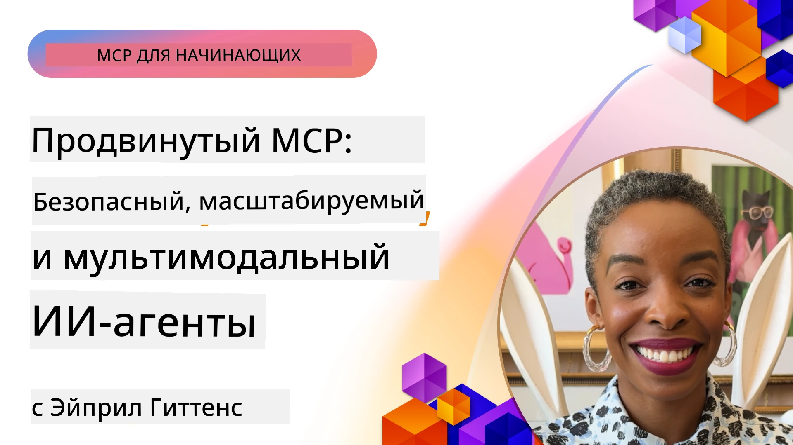

# Продвинутые темы в MCP

_(Нажмите на изображение выше, чтобы посмотреть видео этого урока)_

В этой главе рассматривается ряд продвинутых тем по реализации Протокола Контекста Модели (MCP), включая мультимодальную интеграцию, масштабируемость, лучшие практики безопасности и интеграцию в корпоративной среде. Эти темы важны для создания надежных и готовых к производству приложений MCP, способных удовлетворить требования современных систем ИИ.

## Обзор

В этом уроке изучаются продвинутые концепции реализации Протокола Контекста Модели с акцентом на мультимодальную интеграцию, масштабируемость, лучшие практики безопасности и корпоративную интеграцию. Эти темы необходимы для создания производственных MCP-приложений, которые могут справляться со сложными требованиями в корпоративной среде.

## Цели обучения

К концу этого урока вы сможете:

- Реализовывать мультимодальные возможности в рамках MCP
- Проектировать масштабируемые архитектуры MCP для сценариев с высокой нагрузкой
- Применять лучшие практики безопасности в соответствии с принципами безопасности MCP
- Интегрировать MCP с корпоративными ИИ-системами и фреймворками
- Оптимизировать производительность и надежность в производственной среде

## Уроки и примеры проектов

| Ссылка | Название | Описание |
|------|-------|-------------|
| [5.1 Integration with Azure](./mcp-integration/README.md) | Интеграция с Azure | Узнайте, как интегрировать ваш MCP сервер в Azure |
| [5.2 Multi modal sample](./mcp-multi-modality/README.md) | Примеры мультимодальности MCP | Примеры для аудио, изображений и мультимодального отклика |
| [5.3 MCP OAuth2 sample](../../../05-AdvancedTopics/mcp-oauth2-demo) | Демонстрация MCP OAuth2 | Минимальное Spring Boot приложение, показывающее OAuth2 с MCP как сервер авторизации и сервер ресурсов. Демонстрирует безопасную выдачу токенов, защищённые конечные точки, развертывание в Azure Container Apps и интеграцию с API Management. |
| [5.4 Root Contexts](./mcp-root-contexts/README.md) | Корневые контексты | Узнайте больше о корневых контекстах и как их реализовать |
| [5.5 Routing](./mcp-routing/README.md) | Маршрутизация | Изучите различные типы маршрутизации |
| [5.6 Sampling](./mcp-sampling/README.md) | Сэмплирование | Узнайте, как работать с сэмплированием |
| [5.7 Scaling](./mcp-scaling/README.md) | Масштабирование | Изучите масштабирование |
| [5.8 Security](./mcp-security/README.md) | Безопасность | Обеспечьте безопасность вашего MCP сервера |
| [5.9 Web Search sample](./web-search-mcp/README.md) | Поиск в веб MCP | Python MCP сервер и клиент, интегрирующиеся с SerpAPI для поиска в вебе, новостях, товарах и вопросах в режиме реального времени. Демонстрирует мультинструментальную оркестрацию, интеграцию внешних API и устойчивую обработку ошибок. |
| [5.10 Realtime Streaming](./mcp-realtimestreaming/README.md) | Потоковая передача данных | Потоковая передача данных в реальном времени стала необходимостью в современном мире данных, где бизнес и приложения требуют немедленного доступа к информации для своевременных решений.|
| [5.11 Realtime Web Search](./mcp-realtimesearch/README.md) | Поиск в вебе в реальном времени | Как MCP преобразует поиск в интернете в реальном времени, обеспечивая стандартизированный подход к управлению контекстом между ИИ моделями, поисковыми системами и приложениями.| 
| [5.12  Entra ID Authentication for Model Context Protocol Servers](./mcp-security-entra/README.md) | Аутентификация Entra ID | Microsoft Entra ID предоставляет мощное облачное решение для управления идентификацией и доступом, помогая гарантировать, что только авторизованные пользователи и приложения могут взаимодействовать с вашим MCP сервером.|
| [5.13 Azure AI Foundry Agent Integration](./mcp-foundry-agent-integration/README.md) | Интеграция Azure AI Foundry | Узнайте, как интегрировать серверы MCP с агентами Azure AI Foundry, обеспечивая мощную оркестрацию инструментов и корпоративные возможности ИИ с использованием стандартизованных подключений к внешним источникам данных.|
| [5.14 Context Engineering](./mcp-contextengineering/README.md) | Проектирование контекста | Будущие возможности техник проектирования контекста для серверов MCP, включая оптимизацию контекста, динамическое управление контекстом и стратегии эффективного проектирования подсказок в рамках MCP.|
| [5.15 MCP Custom Transport](./mcp-transport/README.md) | Пользовательский транспорт | Узнайте, как реализовать пользовательские транспортные механизмы для специализированных сценариев коммуникации MCP.|
| [5.16 Protocol Features Deep Dive](./mcp-protocol-features/README.md) | Особенности протокола | Освойте продвинутые особенности протокола, включая уведомления о прогрессе, отмену запросов, шаблоны ресурсов и обработку ошибок.|

> **Новое в спецификации MCP 2025-11-25**: Спецификация теперь включает экспериментальную поддержку **Задач** (долгих операций с отслеживанием прогресса), **Аннотаций инструментов** (метаданные о поведении инструментов для безопасности), **URL-режима выборки** (запрос определенного содержимого URL у клиентов) и улучшенных **Корней** (для управления контекстом рабочего пространства). Полные детали смотрите в [Журнале изменений спецификации MCP](https://spec.modelcontextprotocol.io/).

## Дополнительные ссылки

Для получения самой актуальной информации по продвинутым темам MCP обратитесь к:
- [Документация MCP](https://modelcontextprotocol.io/)
- [Спецификация MCP (2025-11-25)](https://spec.modelcontextprotocol.io/specification/2025-11-25/)
- [Репозиторий GitHub](https://github.com/modelcontextprotocol)
- [OWASP MCP Top 10](https://microsoft.github.io/mcp-azure-security-guide/mcp/) - Риски безопасности и меры по их устранению
- [Саммит по безопасности MCP (Sherpa)](https://azure-samples.github.io/sherpa/) - Практические тренинги по безопасности

## Ключевые выводы

- Мультимодальные реализации MCP расширяют возможности ИИ за пределы обработки текста
- Масштабируемость жизненно важна для корпоративных внедрений и может достигаться горизонтальным и вертикальным масштабированием
- Комплексные меры безопасности защищают данные и обеспечивают надлежащий контроль доступа
- Корпоративная интеграция с платформами, такими как Azure OpenAI и Microsoft AI Foundry, расширяет возможности MCP
- Продвинутые реализации MCP выигрывают от оптимизированных архитектур и тщательного управления ресурсами

## Задание

Спроектируйте корпоративную реализацию MCP для конкретного варианта использования:

1. Определите мультимодальные требования для вашего варианта использования
2. Опишите меры безопасности, необходимые для защиты конфиденциальных данных
3. Спроектируйте масштабируемую архитектуру, способную справляться с переменной нагрузкой
4. Запланируйте точки интеграции с корпоративными ИИ-системами
5. Задокументируйте потенциальные узкие места производительности и стратегии их устранения

## Дополнительные ресурсы

- [Документация Azure OpenAI](https://learn.microsoft.com/en-us/azure/ai-services/openai/)
- [Документация Microsoft AI Foundry](https://learn.microsoft.com/en-us/ai-services/)

---

## Что дальше

Изучайте уроки этого модуля, начиная с: [5.1 Интеграция MCP](./mcp-integration/README.md)

После завершения этого модуля продолжайте: [Модуль 6: Вклад сообщества](../06-CommunityContributions/README.md)

---

<!-- CO-OP TRANSLATOR DISCLAIMER START -->
**Отказ от ответственности**:
Этот документ был переведен с помощью автоматического переводческого сервиса [Co-op Translator](https://github.com/Azure/co-op-translator). Несмотря на наши усилия обеспечить точность, просим учитывать, что автоматические переводы могут содержать ошибки или неточности. Оригинальный документ на его родном языке следует считать авторитетным источником. Для получения критически важной информации рекомендуется обращаться к профессиональному переводу, выполненному человеком. Мы не несем ответственности за любые недоразумения или неправильные толкования, возникающие в результате использования данного перевода.
<!-- CO-OP TRANSLATOR DISCLAIMER END -->