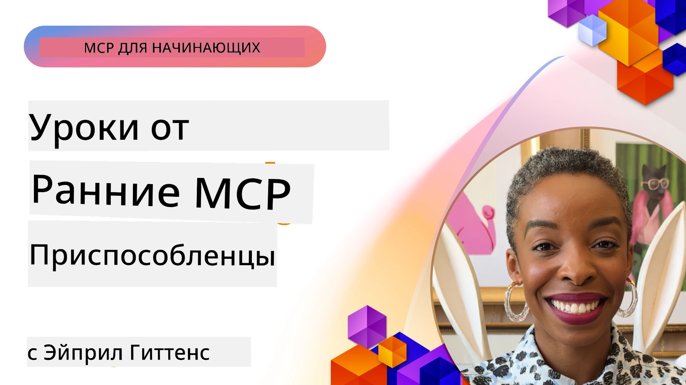

# 🌟 Уроки от первых пользователей

[](https://youtu.be/jds7dSmNptE)

_(Нажмите на изображение выше, чтобы посмотреть видео этого урока)_

## 🎯 О чём этот модуль

В этом модуле рассматривается, как реальные организации и разработчики используют Model Context Protocol (MCP) для решения реальных задач и стимулирования инноваций. Через подробные тематические исследования, практические проекты и примеры вы узнаете, как MCP обеспечивает безопасную, масштабируемую интеграцию ИИ, соединяя языковые модели, инструменты и корпоративные данные.

### 📚 Посмотрите MCP в действии

Хотите увидеть, как эти принципы применяются в готовых к производству инструментах? Ознакомьтесь с нашим [**10 Microsoft MCP Servers That Are Transforming Developer Productivity**](microsoft-mcp-servers.md), где показаны реальные серверы Microsoft MCP, которые вы можете использовать уже сегодня.

## Обзор

В этом уроке рассматривается, как первые пользователи использовали Model Context Protocol (MCP) для решения реальных проблем и стимулирования инноваций в различных отраслях. Через детальные тематические исследования и практические проекты вы увидите, как MCP обеспечивает стандартизированную, безопасную и масштабируемую интеграцию ИИ — объединяя большие языковые модели, инструменты и корпоративные данные в единую структуру. Вы получите практический опыт проектирования и создания решений на базе MCP, изучите проверенные паттерны реализации и узнаете лучшие практики развертывания MCP в производственных условиях. Урок также освещает новые тенденции, направления развития и открытые ресурсы, которые помогут оставаться на переднем крае технологий MCP и развивающейся экосистемы.

## Цели обучения

- Анализировать реальные реализации MCP в разных отраслях
- Проектировать и создавать полноценные приложения на базе MCP
- Изучать новые тенденции и направления развития технологий MCP
- Применять лучшие практики в реальных сценариях разработки

## Реальные реализации MCP

### Тематическое исследование 1: Автоматизация поддержки клиентов в крупном бизнесе

Международная корпорация внедрила решение на базе MCP для стандартизации взаимодействия ИИ во всех системах поддержки клиентов. Это позволило им:

- Создать единый интерфейс для нескольких поставщиков LLM
- Поддерживать единое управление запросами в разных отделах
- Внедрить надежные меры безопасности и соответствия требованиям
- Легко переключаться между разными ИИ-моделями в зависимости от конкретных задач

**Техническая реализация:**

```python
# Реализация сервера Python MCP для поддержки клиентов
import logging
import asyncio
from modelcontextprotocol import create_server, ServerConfig
from modelcontextprotocol.server import MCPServer
from modelcontextprotocol.transports import create_http_transport
from modelcontextprotocol.resources import ResourceDefinition
from modelcontextprotocol.prompts import PromptDefinition
from modelcontextprotocol.tool import ToolDefinition

# Настроить ведение журнала
logging.basicConfig(level=logging.INFO)

async def main():
    # Создать конфигурацию сервера
    config = ServerConfig(
        name="Enterprise Customer Support Server",
        version="1.0.0",
        description="MCP server for handling customer support inquiries"
    )
    
    # Инициализировать сервер MCP
    server = create_server(config)
    
    # Зарегистрировать ресурсы базы знаний
    server.resources.register(
        ResourceDefinition(
            name="customer_kb",
            description="Customer knowledge base documentation"
        ),
        lambda params: get_customer_documentation(params)
    )
    
    # Зарегистрировать шаблоны подсказок
    server.prompts.register(
        PromptDefinition(
            name="support_template",
            description="Templates for customer support responses"
        ),
        lambda params: get_support_templates(params)
    )
    
    # Зарегистрировать инструменты поддержки
    server.tools.register(
        ToolDefinition(
            name="ticketing",
            description="Create and update support tickets"
        ),
        handle_ticketing_operations
    )
    
    # Запустить сервер с HTTP транспортом
    transport = create_http_transport(port=8080)
    await server.run(transport)

if __name__ == "__main__":
    asyncio.run(main())
```
  
**Результаты:** снижение затрат на модели на 30%, улучшение согласованности ответов на 45%, а также повышение уровня соответствия требованиям во всех глобальных операциях.

### Тематическое исследование 2: Диагностический помощник для здравоохранения

Медицинская организация разработала инфраструктуру MCP для интеграции нескольких специализированных медицинских ИИ-моделей при обеспечении защиты чувствительных данных пациентов:

- Бесшовное переключение между универсальными и специализированными медицинскими моделями
- Строгие меры контроля конфиденциальности и аудит
- Интеграция с существующими системами электронных медицинских записей (EHR)
- Единое управление запросами для медицинской терминологии

**Техническая реализация:**

```csharp
// C# MCP host application implementation in healthcare application
using Microsoft.Extensions.DependencyInjection;
using ModelContextProtocol.SDK.Client;
using ModelContextProtocol.SDK.Security;
using ModelContextProtocol.SDK.Resources;

public class DiagnosticAssistant
{
    private readonly MCPHostClient _mcpClient;
    private readonly PatientContext _patientContext;
    
    public DiagnosticAssistant(PatientContext patientContext)
    {
        _patientContext = patientContext;
        
        // Configure MCP client with healthcare-specific settings
        var clientOptions = new ClientOptions
        {
            Name = "Healthcare Diagnostic Assistant",
            Version = "1.0.0",
            Security = new SecurityOptions
            {
                Encryption = EncryptionLevel.Medical,
                AuditEnabled = true
            }
        };
        
        _mcpClient = new MCPHostClientBuilder()
            .WithOptions(clientOptions)
            .WithTransport(new HttpTransport("https://healthcare-mcp.example.org"))
            .WithAuthentication(new HIPAACompliantAuthProvider())
            .Build();
    }
    
    public async Task<DiagnosticSuggestion> GetDiagnosticAssistance(
        string symptoms, string patientHistory)
    {
        // Create request with appropriate resources and tool access
        var resourceRequest = new ResourceRequest
        {
            Name = "patient_records",
            Parameters = new Dictionary<string, object>
            {
                ["patientId"] = _patientContext.PatientId,
                ["requestingProvider"] = _patientContext.ProviderId
            }
        };
        
        // Request diagnostic assistance using appropriate prompt
        var response = await _mcpClient.SendPromptRequestAsync(
            promptName: "diagnostic_assistance",
            parameters: new Dictionary<string, object>
            {
                ["symptoms"] = symptoms,
                patientHistory = patientHistory,
                relevantGuidelines = _patientContext.GetRelevantGuidelines()
            });
            
        return DiagnosticSuggestion.FromMCPResponse(response);
    }
}
```
  
**Результаты:** улучшенные диагностические рекомендации для врачей при полном соблюдении HIPAA и значительном снижении переключений контекста между системами.

### Тематическое исследование 3: Анализ рисков в финансовой сфере

Финансовая организация внедрила MCP для стандартизации процессов оценки рисков в разных отделах:

- Создан единый интерфейс для моделей кредитного риска, обнаружения мошенничества и инвестиционных рисков
- Внедрён строгий контроль доступа и версионирование моделей
- Обеспечена возможность аудита всех рекомендаций ИИ
- Поддерживается единый формат данных в разных системах

**Техническая реализация:**

```java
// Java MCP сервер для оценки финансовых рисков
import org.mcp.server.*;
import org.mcp.security.*;

public class FinancialRiskMCPServer {
    public static void main(String[] args) {
        // Создать MCP сервер с функциями финансового соответствия
        MCPServer server = new MCPServerBuilder()
            .withModelProviders(
                new ModelProvider("risk-assessment-primary", new AzureOpenAIProvider()),
                new ModelProvider("risk-assessment-audit", new LocalLlamaProvider())
            )
            .withPromptTemplateDirectory("./compliance/templates")
            .withAccessControls(new SOCCompliantAccessControl())
            .withDataEncryption(EncryptionStandard.FINANCIAL_GRADE)
            .withVersionControl(true)
            .withAuditLogging(new DatabaseAuditLogger())
            .build();
            
        server.addRequestValidator(new FinancialDataValidator());
        server.addResponseFilter(new PII_RedactionFilter());
        
        server.start(9000);
        
        System.out.println("Financial Risk MCP Server running on port 9000");
    }
}
```
  
**Результаты:** повышено соблюдение нормативных требований, ускорены циклы развертывания моделей на 40% и улучшена согласованность оценки рисков в подразделениях.

### Тематическое исследование 4: Microsoft Playwright MCP Server для автоматизации браузера

Microsoft разработала [Playwright MCP server](https://github.com/microsoft/playwright-mcp), чтобы обеспечить безопасную и стандартизированную автоматизацию браузера через протокол Model Context Protocol. Этот готовый к использованию сервер позволяет ИИ-агентам и LLM взаимодействовать с веб-браузерами контролируемым, поддающимся аудиту и расширяемым способом — поддерживая автоматизированное тестирование веба, извлечение данных и сквозные рабочие процессы.

> **🎯 Готовый к производству инструмент**
> 
> В этом тематическом исследовании представлен реальный сервер MCP, который вы можете использовать сегодня! Подробнее о Playwright MCP Server и 9 других готовых к производству серверах Microsoft MCP читайте в нашем [**Руководстве по серверам Microsoft MCP**](microsoft-mcp-servers.md#8--playwright-mcp-server).

**Основные функции:**  
- Обеспечивает возможности автоматизации браузера (навигация, заполнение форм, захват скриншотов и др.) как MCP-инструменты  
- Внедряет строгий контроль доступа и песочницу для предотвращения неавторизованных действий  
- Предоставляет подробные журналы аудита всех взаимодействий с браузером  
- Поддерживает интеграцию с Azure OpenAI и другими LLM-поставщиками для автоматизации с помощью агентов  
- Обеспечивает функционал браузера для GitHub Copilot Coding Agent

**Техническая реализация:**

```typescript
// TypeScript: Регистрация инструментов автоматизации браузера Playwright на сервере MCP
import { createServer, ToolDefinition } from 'modelcontextprotocol';
import { launch } from 'playwright';

const server = createServer({
  name: 'Playwright MCP Server',
  version: '1.0.0',
  description: 'MCP server for browser automation using Playwright'
});

// Зарегистрировать инструмент для перехода по URL и снятия скриншота
server.tools.register(
  new ToolDefinition({
    name: 'navigate_and_screenshot',
    description: 'Navigate to a URL and capture a screenshot',
    parameters: {
      url: { type: 'string', description: 'The URL to visit' }
    }
  }),
  async ({ url }) => {
    const browser = await launch();
    const page = await browser.newPage();
    await page.goto(url);
    const screenshot = await page.screenshot();
    await browser.close();
    return { screenshot };
  }
);

// Запустить сервер MCP
server.listen(8080);
```
  
**Результаты:**

- Обеспечена безопасная программная автоматизация браузера для ИИ-агентов и LLM  
- Снижены трудозатраты на ручное тестирование и улучшено покрытие тестами веб-приложений  
- Создана многоразовая и расширяемая платформа для интеграции браузерных инструментов в корпоративных средах  
- Обеспечивает возможности веб-браузинга в GitHub Copilot

**Ссылки:**

- [Репозиторий Playwright MCP Server на GitHub](https://github.com/microsoft/playwright-mcp)  
- [Решения Microsoft в области ИИ и автоматизации](https://azure.microsoft.com/en-us/products/ai-services/)

### Тематическое исследование 5: Azure MCP – Корпоративный MCP как сервис

Azure MCP Server ([https://aka.ms/azmcp](https://aka.ms/azmcp)) — это управляемая корпоративная реализация Model Context Protocol от Microsoft, разработанная для предоставления масштабируемых, безопасных и соответствующих требованиям серверам MCP в виде облачной услуги. Azure MCP позволяет организациям быстро развертывать, управлять и интегрировать серверы MCP с сервисами Azure AI, данными и безопасностью, снижая операционные издержки и ускоряя внедрение ИИ.

> **🎯 Готовый к производству инструмент**
> 
> Это реальный сервер MCP, который вы можете использовать сегодня! Подробнее об Azure AI Foundry MCP Server читайте в нашем [**Руководстве по серверам Microsoft MCP**](microsoft-mcp-servers.md).

- Полностью управляемый хостинг серверов MCP с встроенным масштабированием, мониторингом и безопасностью  
- Родная интеграция с Azure OpenAI, Azure AI Search и другими сервисами Azure  
- Корпоративная аутентификация и авторизация через Microsoft Entra ID  
- Поддержка пользовательских инструментов, шаблонов запросов и коннекторов ресурсов  
- Соответствие требованиям корпоративной безопасности и нормативным требованиям

**Техническая реализация:**

```yaml
# Example: Azure MCP server deployment configuration (YAML)
apiVersion: mcp.microsoft.com/v1
kind: McpServer
metadata:
  name: enterprise-mcp-server
spec:
  modelProviders:
    - name: azure-openai
      type: AzureOpenAI
      endpoint: https://<your-openai-resource>.openai.azure.com/
      apiKeySecret: <your-azure-keyvault-secret>
  tools:
    - name: document_search
      type: AzureAISearch
      endpoint: https://<your-search-resource>.search.windows.net/
      apiKeySecret: <your-azure-keyvault-secret>
  authentication:
    type: EntraID
    tenantId: <your-tenant-id>
  monitoring:
    enabled: true
    logAnalyticsWorkspace: <your-log-analytics-id>
```
  
**Результаты:**  
- Сокращение времени вывода проектов ИИ на рынок за счёт готовой к использованию и соответствующей требованиям платформы MCP  
- Упрощённая интеграция LLM, инструментов и корпоративных источников данных  
- Повышенная безопасность, наблюдаемость и операционная эффективность MCP-решений  
- Улучшенное качество кода благодаря лучшим практикам Azure SDK и актуальным паттернам аутентификации

**Ссылки:**  
- [Документация Azure MCP](https://aka.ms/azmcp)  
- [Репозиторий Azure MCP Server на GitHub](https://github.com/Azure/azure-mcp)  
- [Сервисы Azure AI](https://azure.microsoft.com/en-us/products/ai-services/)  
- [Центр Microsoft MCP](https://mcp.azure.com)

## Тематическое исследование 6: NLWeb  
MCP (Model Context Protocol) — это новый протокол для чат-ботов и ИИ-ассистентов, позволяющий взаимодействовать с инструментами. Каждый экземпляр NLWeb также является сервером MCP, поддерживающим единственный базовый метод ask, который используется для задания вопросов веб-сайтам на естественном языке. Возвращаемый ответ строится с использованием schema.org — широко используемой схемы описания веб-данных. Проще говоря, MCP — это NLWeb так же, как Http — HTML. NLWeb объединяет протоколы, форматы schema.org и примерный код, чтобы сайты могли быстро создавать такие конечные точки, принося пользу как людям через разговорные интерфейсы, так и машинам через естественное взаимодействие между агентами.

NLWeb включает два отдельных компонента.  
- Протокол, очень простой для начала, для взаимодействия с сайтом на естественном языке и формат, использующий json и schema.org для ответа. Подробнее об API REST см. в документации.  
- Прямая реализация (1), использующая существующую разметку для сайтов, которые можно представить списками элементов (продукты, рецепты, достопримечательности, обзоры и т.д.). Вместе с набором виджетов пользовательского интерфейса сайты могут легко создавать разговорные интерфейсы для своего контента. Дополнительную информацию см. в разделе Life of a chat query.

**Ссылки:**  
- [Документация Azure MCP](https://aka.ms/azmcp)  
- [NLWeb](https://github.com/microsoft/NlWeb)

### Тематическое исследование 7: Azure AI Foundry MCP Server – Интеграция корпоративных ИИ-агентов

Серверы Azure AI Foundry MCP демонстрируют, как MCP можно использовать для оркестровки и управления ИИ-агентами и рабочими процессами в корпоративной среде. Интеграция MCP с Azure AI Foundry позволяет организациям стандартизировать взаимодействия агентов, использовать управление рабочими процессами Foundry и обеспечивать безопасное масштабируемое развертывание.

> **🎯 Готовый к производству инструмент**
> 
> Это реальный сервер MCP, который вы можете использовать сегодня! Подробнее об Azure AI Foundry MCP Server читайте в нашем [**Руководстве по серверам Microsoft MCP**](microsoft-mcp-servers.md#9--azure-ai-foundry-mcp-server).

**Основные функции:**  
- Всеобъемлющий доступ к экосистеме Azure AI, включая каталоги моделей и управление развертываниями  
- Индексация знаний с помощью Azure AI Search для RAG-приложений  
- Инструменты оценки производительности моделей ИИ и обеспечения качества  
- Интеграция с Azure AI Foundry Catalog и Labs для современных исследовательских моделей  
- Управление агентами и возможности оценки в производственных сценариях

**Результаты:**  
- Быстрое прототипирование и надежный мониторинг рабочих процессов ИИ-агентов  
- Бесшовная интеграция с сервисами Azure AI для продвинутых сценариев  
- Единый интерфейс для создания, развертывания и мониторинга агентских конвейеров  
- Повышенная безопасность, соответствие требованиям и операционная эффективность для предприятий  
- Ускоренное внедрение ИИ при сохранении контроля над сложными процессами с участием агентов

**Ссылки:**  
- [Репозиторий Azure AI Foundry MCP Server на GitHub](https://github.com/azure-ai-foundry/mcp-foundry)  
- [Интеграция Azure AI Agents с MCP (блог Microsoft Foundry)](https://devblogs.microsoft.com/foundry/integrating-azure-ai-agents-mcp/)

### Тематическое исследование 8: Foundry MCP Playground – Эксперименты и прототипирование

Foundry MCP Playground предлагает готовую к использованию среду для экспериментов с серверами MCP и интеграциями Azure AI Foundry. Разработчики могут быстро создавать прототипы, тестировать и оценивать модели ИИ и рабочие процессы агентов, используя ресурсы Azure AI Foundry Catalog и Labs. Площадка упрощает настройку, предоставляет образцы проектов и поддерживает командную разработку, облегчая изучение лучших практик и новых сценариев с минимальными затратами. Особо полезна для команд, стремящихся проверить идеи, поделиться экспериментами и ускорить обучение без необходимости сложной инфраструктуры. Понижение порога входа способствует инновациям и вкладу сообщества в экосистему MCP и Azure AI Foundry.

**Ссылки:**

- [Репозиторий Foundry MCP Playground на GitHub](https://github.com/azure-ai-foundry/foundry-mcp-playground)

### Тематическое исследование 9: Microsoft Learn Docs MCP Server – Доступ к документации на базе ИИ

Microsoft Learn Docs MCP Server — это облачный сервис, предоставляющий ИИ-ассистентам доступ к официальной документации Microsoft в реальном времени через Model Context Protocol. Этот готовый к производству сервер подключается к обширной экосистеме Microsoft Learn и обеспечивает семантический поиск по всем официальным источникам Microsoft.

> **🎯 Готовый к производству инструмент**
> 
> Это реальный сервер MCP, который вы можете использовать сегодня! Подробнее о Microsoft Learn Docs MCP Server читайте в нашем [**Руководстве по серверам Microsoft MCP**](microsoft-mcp-servers.md#1--microsoft-learn-docs-mcp-server).

**Основные функции:**  
- Доступ в реальном времени к официальной документации Microsoft, Azure и Microsoft 365  
- Расширенные возможности семантического поиска, понимающие контекст и намерения  
- Всегда актуальная информация благодаря публикации контента Microsoft Learn  
- Всестороннее покрытие по Microsoft Learn, документации Azure и Microsoft 365  
- Возвращает до 10 качественных фрагментов с названиями статей и URL

**Почему это важно:**  
- Решает проблему «устаревших знаний ИИ» по технологиям Microsoft  
- Обеспечивает ИИ-ассистентов самой свежей информацией о .NET, C#, Azure и Microsoft 365  
- Предоставляет достоверную информацию первого уровня для точной генерации кода  
- Необходим для разработчиков, работающих с быстро развивающимися технологиями Microsoft

**Результаты:**  
- Значительно повышена точность кода, сгенерированного ИИ для технологий Microsoft  
- Сокращено время на поиск актуальной документации и лучших практик  
- Улучшена продуктивность разработчиков с помощью контекстно-зависимого доступа к документации  
- Бесшовная интеграция с рабочими процессами разработки без выхода из среды IDE

**Ссылки:**  
- [Репозиторий Microsoft Learn Docs MCP Server на GitHub](https://github.com/MicrosoftDocs/mcp)  
- [Документация Microsoft Learn](https://learn.microsoft.com/)

## Практические проекты

### Проект 1: Создание MCP-сервера с несколькими поставщиками

**Цель:** Создать MCP-сервер, который может направлять запросы нескольким поставщикам моделей ИИ на основе определённых критериев.

**Требования:**

- Поддержка минимум трёх различных поставщиков моделей (например, OpenAI, Anthropic, локальные модели)  
- Реализация механизма маршрутизации на основе метаданных запросов  
- Создание системы конфигурации для управления учётными данными поставщиков  
- Добавление кэширования для оптимизации производительности и затрат  
- Создание простой панели мониторинга для отслеживания использования

**Шаги реализации:**

1. Настроить базовую инфраструктуру MCP-сервера  
2. Реализовать адаптеры для каждого сервиса моделей ИИ  
3. Создать логику маршрутизации на основе атрибутов запросов  
4. Добавить механизмы кэширования для частых запросов  
5. Разработать панель мониторинга  
6. Провести тестирование с различными сценариями запросов

**Используемые технологии:** Выберите из Python (.NET/Java/Python по предпочтению), Redis для кэширования и простой веб-фреймворк для панели мониторинга.

### Проект 2: Система управления запросами для корпорации
**Цель:** Разработать систему на базе MCP для управления, версионирования и развертывания шаблонов подсказок по организации.

**Требования:**

- Создать централизованный репозиторий шаблонов подсказок
- Реализовать систему версионирования и рабочие процессы утверждения
- Построить возможности тестирования шаблонов с примерами вводов
- Разработать контроль доступа на основе ролей
- Создать API для получения и развертывания шаблонов

**Этапы реализации:**

1. Спроектировать схему базы данных для хранения шаблонов
2. Создать основной API для операций CRUD с шаблонами
3. Реализовать систему версионирования
4. Построить рабочий процесс утверждения
5. Разработать тестовую платформу
6. Создать простой веб-интерфейс для управления
7. Интегрировать с MCP сервером

**Технологии:** Ваш выбор фреймворка backend, базы данных SQL или NoSQL и фронтенд-фреймворка для интерфейса управления.

### Проект 3: Платформа генерации контента на базе MCP

**Цель:** Построить платформу генерации контента, использующую MCP для обеспечения последовательных результатов для различных типов контента.

**Требования:**

- Поддержка нескольких форматов контента (блог-посты, соцсети, маркетинговые тексты)
- Реализация генерации на основе шаблонов с опциями кастомизации
- Создание системы обзора контента и обратной связи
- Отслеживание метрик производительности контента
- Поддержка версионирования и итераций контента

**Этапы реализации:**

1. Настроить инфраструктуру клиента MCP
2. Создать шаблоны для разных типов контента
3. Построить конвейер генерации контента
4. Реализовать систему обзора
5. Разработать систему отслеживания метрик
6. Создать пользовательский интерфейс для управления шаблонами и генерации контента

**Технологии:** Предпочитаемый язык программирования, веб-фреймворк и система базы данных.

## Будущие направления развития технологии MCP

### Возникающие тренды

1. **Мультимодальный MCP**
   - Расширение MCP для стандартизации взаимодействия с моделями изображений, аудио и видео
   - Разработка возможностей кросс-модального рассуждения
   - Стандартизированные форматы подсказок для разных модальностей

2. **Федеративная инфраструктура MCP**
   - Распределенные сети MCP, способные обмениваться ресурсами между организациями
   - Стандартизированные протоколы для безопасного совместного использования моделей
   - Технологии конфиденциальных вычислений

3. **Маркетплейсы MCP**
   - Экосистемы для обмена и монетизации шаблонов и плагинов MCP
   - Процессы обеспечения качества и сертификации
   - Интеграция с маркетплейсами моделей

4. **MCP для edge-вычислений**
   - Адаптация стандартов MCP для устройств с ограниченными ресурсами
   - Оптимизированные протоколы для сред с низкой пропускной способностью
   - Специализированные реализации MCP для экосистем IoT

5. **Регуляторные рамки**
   - Разработка расширений MCP для соответствия нормативным требованиям
   - Стандартизированные аудиторские следы и интерфейсы объяснимости
   - Интеграция с развивающимися рамками управления ИИ

### Решения MCP от Microsoft

Microsoft и Azure разработали несколько открытых репозиториев, чтобы помочь разработчикам реализовывать MCP в различных сценариях:

#### Организация Microsoft

1. [playwright-mcp](https://github.com/microsoft/playwright-mcp) — MCP сервер Playwright для автоматизации и тестирования браузера
2. [files-mcp-server](https://github.com/microsoft/files-mcp-server) — Реализация MCP сервера OneDrive для локального тестирования и вклада сообщества
3. [NLWeb](https://github.com/microsoft/NlWeb) — NLWeb представляет собой набор открытых протоколов и соответствующих инструментов с открытым исходным кодом. Основное внимание уделяется созданию базового слоя для AI Web

#### Организация Azure-Samples

1. [mcp](https://github.com/Azure-Samples/mcp) — Ссылки на примеры, инструменты и ресурсы для построения и интеграции MCP серверов на Azure с использованием нескольких языков
2. [mcp-auth-servers](https://github.com/Azure-Samples/mcp-auth-servers) — Референсные MCP серверы, демонстрирующие аутентификацию с текущей спецификацией протокола Model Context Protocol
3. [remote-mcp-functions](https://github.com/Azure-Samples/remote-mcp-functions) — Страница запуска реализаций Remote MCP Server в Azure Functions с ссылками на репозитории для разных языков
4. [remote-mcp-functions-python](https://github.com/Azure-Samples/remote-mcp-functions-python) — Шаблон быстрого старта для создания и развертывания пользовательских удалённых MCP серверов с использованием Azure Functions на Python
5. [remote-mcp-functions-dotnet](https://github.com/Azure-Samples/remote-mcp-functions-dotnet) — Шаблон быстрого старта для создания и развертывания пользовательских удалённых MCP серверов с помощью Azure Functions на .NET/C#
6. [remote-mcp-functions-typescript](https://github.com/Azure-Samples/remote-mcp-functions-typescript) — Шаблон быстрого старта для создания и развертывания пользовательских удалённых MCP серверов с Azure Functions на TypeScript
7. [remote-mcp-apim-functions-python](https://github.com/Azure-Samples/remote-mcp-apim-functions-python) — Azure API Management как AI шлюз к удалённым MCP серверам с использованием Python
8. [AI-Gateway](https://github.com/Azure-Samples/AI-Gateway) — Эксперименты APIM ❤️ AI, включающие возможности MCP, интеграцию с Azure OpenAI и AI Foundry

Эти репозитории предоставляют различные реализации, шаблоны и ресурсы для работы с протоколом Model Context Protocol на разных языках программирования и сервисах Azure. Они охватывают широкий спектр задач — от базовых реализаций серверов до аутентификации, облачного развертывания и интеграции в корпоративной среде.

#### Каталог ресурсов MCP

Каталог [MCP Resources directory](https://github.com/microsoft/mcp/tree/main/Resources) в официальном репозитории Microsoft MCP содержит отобранный набор образцов ресурсов, шаблонов подсказок и описаний инструментов для использования с MCP серверами. Этот каталог предназначен, чтобы помочь разработчикам быстро начать работу с MCP, предлагая переиспользуемые строительные блоки и примеры лучших практик для:

- **Шаблоны подсказок:** Готовые к использованию шаблоны подсказок для распространённых задач и сценариев ИИ, которые можно адаптировать под собственные реализации MCP серверов.
- **Определения инструментов:** Примеры схем инструментов и метаданных для стандартизации интеграции и вызова инструментов на разных MCP серверах.
- **Образцы ресурсов:** Примеры описаний ресурсов для подключения к источникам данных, API и внешним сервисам в рамках MCP.
- **Референсные реализации:** Практические примеры, демонстрирующие, как структурировать и организовывать ресурсы, подсказки и инструменты в реальных проектах MCP.

Эти ресурсы ускоряют разработку, способствуют стандартизации и помогают обеспечить лучшие практики при создании и развертывании решений на базе MCP.

#### Каталог ресурсов MCP

- [MCP Resources (Образцы подсказок, инструментов и описаний ресурсов)](https://github.com/microsoft/mcp/tree/main/Resources)

### Возможности для исследований

- Эффективные методы оптимизации подсказок в рамках MCP
- Модели безопасности для многоарендных MCP развертываний
- Бенчмаркинг производительности разных реализаций MCP
- Формальные методы верификации MCP серверов

## Заключение

Протокол Model Context Protocol (MCP) быстро формирует будущее стандартизированной, безопасной и взаимосвязанной интеграции ИИ в различных отраслях. На примерах и практических проектах в этом уроке вы увидели, как ранние внедренцы — включая Microsoft и Azure — используют MCP для решения реальных задач, ускорения внедрения ИИ, а также обеспечения соответствия требованиям, безопасности и масштабируемости. Модульный подход MCP позволяет организациям объединять крупные языковые модели, инструменты и корпоративные данные в унифицированной, аудируемой инфраструктуре. По мере эволюции MCP, активное участие в сообществе, исследование открытых ресурсов и применение лучших практик будут ключевыми в создании надёжных и готовых к будущему AI решений.

## Дополнительные ресурсы

- [MCP Foundry GitHub репозиторий](https://github.com/azure-ai-foundry/mcp-foundry)
- [Foundry MCP Playground](https://github.com/azure-ai-foundry/foundry-mcp-playground)
- [Интеграция агентов Azure AI с MCP (блог Microsoft Foundry)](https://devblogs.microsoft.com/foundry/integrating-azure-ai-agents-mcp/)
- [MCP GitHub репозиторий (Microsoft)](https://github.com/microsoft/mcp)
- [Каталог ресурсов MCP (образцы подсказок, инструментов и описаний ресурсов)](https://github.com/microsoft/mcp/tree/main/Resources)
- [Сообщество MCP и документация](https://modelcontextprotocol.io/introduction)
- [Спецификация MCP (2025-11-25)](https://spec.modelcontextprotocol.io/specification/2025-11-25/)
- [Документация Azure MCP](https://aka.ms/azmcp)
- [OWASP MCP Топ 10](https://microsoft.github.io/mcp-azure-security-guide/mcp/) — Лучшие практики безопасности
- [Playwright MCP Server GitHub репозиторий](https://github.com/microsoft/playwright-mcp)
- [Files MCP Server (OneDrive)](https://github.com/microsoft/files-mcp-server)
- [Azure-Samples MCP](https://github.com/Azure-Samples/mcp)
- [MCP Auth Servers (Azure-Samples)](https://github.com/Azure-Samples/mcp-auth-servers)
- [Remote MCP Functions (Azure-Samples)](https://github.com/Azure-Samples/remote-mcp-functions)
- [Remote MCP Functions Python (Azure-Samples)](https://github.com/Azure-Samples/remote-mcp-functions-python)
- [Remote MCP Functions .NET (Azure-Samples)](https://github.com/Azure-Samples/remote-mcp-functions-dotnet)
- [Remote MCP Functions TypeScript (Azure-Samples)](https://github.com/Azure-Samples/remote-mcp-functions-typescript)
- [Remote MCP APIM Functions Python (Azure-Samples)](https://github.com/Azure-Samples/remote-mcp-apim-functions-python)
- [AI-Gateway (Azure-Samples)](https://github.com/Azure-Samples/AI-Gateway)
- [Решения Microsoft AI и автоматизации](https://azure.microsoft.com/en-us/products/ai-services/)

## Упражнения

1. Проанализируйте один из кейсов и предложите альтернативный подход к реализации.
2. Выберите одну из идей проекта и создайте подробную техническую спецификацию.
3. Исследуйте отрасль, не рассмотренную в кейсах, и опишите, как MCP может решить ее специфические задачи.
4. Изучите одно из будущих направлений и разработайте концепцию нового расширения MCP для его поддержки.

## Что дальше

Изучайте дальше: [Microsoft MCP Servers](./microsoft-mcp-servers.md)

Продолжайте: [Модуль 8: Лучшие практики](../08-BestPractices/README.md)

---

<!-- CO-OP TRANSLATOR DISCLAIMER START -->
**Отказ от ответственности**:
Этот документ был переведен с помощью сервиса автоматического перевода [Co-op Translator](https://github.com/Azure/co-op-translator). Несмотря на наши усилия по обеспечению точности, имейте в виду, что автоматический перевод может содержать ошибки или неточности. Оригинальный документ на его исходном языке должен рассматриваться как достоверный источник. Для критически важной информации рекомендуется обращаться к профессиональному переводу, выполненному человеком. Мы не несем ответственности за любые недоразумения или неправильные толкования, возникшие в результате использования этого перевода.
<!-- CO-OP TRANSLATOR DISCLAIMER END -->