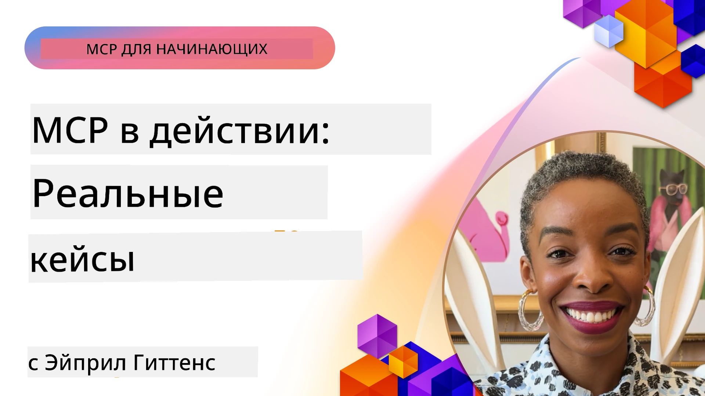

# MCP в действии: реальные тематические исследования

_(Нажмите на изображение выше, чтобы посмотреть видео этого урока)_

Протокол контекста модели (MCP) преобразует способы взаимодействия AI-приложений с данными, инструментами и сервисами. В этом разделе представлены реальные тематические исследования, демонстрирующие практическое применение MCP в различных корпоративных сценариях.

## Обзор

В этом разделе представлены конкретные примеры реализации MCP, показывающие, как организации используют этот протокол для решения сложных бизнес-задач. Изучая эти тематические исследования, вы получите представление о гибкости, масштабируемости и практических преимуществах MCP в реальных сценариях.

## Основные учебные цели

Изучая эти тематические исследования, вы:

- Поймёте, как MCP можно применять для решения конкретных бизнес-задач
- Узнаете о различных шаблонах интеграции и архитектурных подходах
- Ознакомитесь с лучшими практиками реализации MCP в корпоративной среде
- Получите представление о возникающих трудностях и решениях в реальных проектах
- Определите возможности для применения подобных шаблонов в своих проектах

## Представленные тематические исследования

### 1. [Azure AI Travel Agents – эталонная реализация](./travelagentsample.md)

В этом тематическом исследовании рассматривается комплексное эталонное решение Microsoft, демонстрирующее, как построить мультиагентское приложение для планирования путешествий с помощью MCP, Azure OpenAI и Azure AI Search. Проект включает:

- Оркестрацию мультиагентов через MCP
- Интеграцию корпоративных данных с Azure AI Search
- Безопасную масштабируемую архитектуру с использованием Azure сервисов
- Расширяемые инструменты с переиспользуемыми компонентами MCP
- Конверсационный пользовательский опыт на базе Azure OpenAI

Архитектура и детали реализации предоставляют ценные знания по созданию сложных мультиагентских систем с MCP в качестве слоя координации.

### 2. [Обновление элементов Azure DevOps на основе данных YouTube](./UpdateADOItemsFromYT.md)

Это тематическое исследование демонстрирует практическое применение MCP для автоматизации рабочих процессов. Показано, как с помощью MCP можно:

- Извлекать данные с онлайн-платформы (YouTube)
- Обновлять задачи в системе Azure DevOps
- Создавать повторяемые автоматизированные рабочие процессы
- Интегрировать данные из разрозненных систем

Этот пример иллюстрирует, как даже относительно простые реализации MCP могут существенно повысить эффективность, автоматизируя рутинные задачи и улучшая согласованность данных в системах.

### 3. [Получение документации в реальном времени с помощью MCP](./docs-mcp/README.md)

В этом тематическом исследовании рассказывается, как подключить консольного клиента на Python к серверу MCP для получения и логирования актуальной, контекстуально адаптированной документации Microsoft в реальном времени. Вы узнаете, как:

- Подключаться к серверу MCP с помощью Python клиента и официального MCP SDK
- Использовать HTTP клиенты с потоковой передачей для эффективного получения данных в реальном времени
- Вызывать инструменты документации на сервере и выводить ответы непосредственно в консоль
- Интегрировать актуальную документацию Microsoft в рабочий процесс без выхода из терминала

Глава содержит практическое задание, минимальный рабочий пример кода и ссылки на дополнительные ресурсы для углубленного изучения. Полный разбор и код представлены в указанной главе, чтобы показать, как MCP может преобразить доступ к документации и повысить производительность разработчиков в терминальных средах.

### 4. [Интерактивное веб-приложение генератора плана обучения с MCP](./docs-mcp/README.md)

Это тематическое исследование показывает, как создать интерактивное веб-приложение с помощью Chainlit и MCP для генерации персонализированных учебных планов по любой теме. Пользователи могут указать предмет (например, «сертификация AI-900») и длительность обучения (например, 8 недель), а приложение предоставит подробный разбив по неделям с рекомендованным материалом. Chainlit обеспечивает разговорный чат-интерфейс, делая опыт увлекательным и адаптивным.

- Разговорное веб-приложение на базе Chainlit
- Пользовательские запросы по теме и срокам
- Рекомендации контента по неделям с использованием MCP
- Адаптивные ответы в реальном времени в чат-интерфейсе

Проект демонстрирует, как разговорный ИИ и MCP можно сочетать для создания динамичных образовательных инструментов с пользовательским управлением в современной веб-среде.

### 5. [Документация в редакторе с MCP сервером в VS Code](./docs-mcp/README.md)

Это тематическое исследование демонстрирует, как можно интегрировать Microsoft Learn Docs прямо в среду VS Code с помощью MCP сервера — больше не нужно переключаться между вкладками браузера! Вы узнаете, как:

- Мгновенно искать и читать документацию внутри VS Code через панель MCP или командную палитру
- Ссылаться на документацию и вставлять ссылки непосредственно в README или markdown-файлы курса
- Использовать GitHub Copilot и MCP вместе для бесшовного AI-поддерживаемого документо- и кодопотока
- Проверять и улучшать документацию с помощью обратной связи в реальном времени и гарантии точности от Microsoft
- Интегрировать MCP с рабочими процессами GitHub для непрерывной валидации документации

В реализации представлены:

- Пример конфигурации `.vscode/mcp.json` для простой настройки
- Пошаговые руководства с скриншотами работы в редакторе
- Советы по совместному использованию Copilot и MCP для максимальной продуктивности

Сценарий идеален для авторов курсов, технических писателей и разработчиков, которые хотят оставаться сосредоточенными в редакторе при работе с документацией, Copilot и инструментами валидации — всё это на базе MCP.

### 6. [Создание MCP сервера в APIM](./apimsample.md)

Это тематическое исследование предлагает пошаговое руководство по созданию MCP сервера с использованием Azure API Management (APIM). Рассматривается:

- Настройка MCP сервера в Azure API Management
- Экспонирование API операций как MCP инструментов
- Конфигурация политик для ограничения скорости и безопасности
- Тестирование MCP сервера с помощью Visual Studio Code и GitHub Copilot

Пример показывает, как использовать возможности Azure для создания надежного MCP сервера, который может применяться в различных приложениях, улучшая интеграцию AI систем с корпоративными API.

### 7. [GitHub MCP Registry — ускорение агентной интеграции](https://github.com/mcp)

Это тематическое исследование рассматривает, как GitHub MCP Registry, запущенный в сентябре 2025 года, решает критическую проблему в AI-экосистеме: фрагментация поиска и развертывания серверов Model Context Protocol (MCP).

#### Обзор
**MCP Registry** решает проблему разбросанных MCP серверов по репозиториям и регистрам, что ранее замедляло интеграцию и приводило к ошибкам. Эти серверы позволяют AI агентам взаимодействовать с внешними системами, такими как API, базы данных и источники документации.

#### Проблемы
Разработчики, создающие агентные рабочие процессы, сталкивались с такими трудностями:
- **Плохая обнаруживаемость** MCP серверов на разных платформах
- **Повторяющиеся вопросы настройки**, разбросанные по форумам и документации
- **Риски безопасности** из-за непроверенных и ненадежных источников
- **Отсутствие стандартизации** качества и совместимости серверов

#### Архитектура решения
GitHub MCP Registry централизует доверенные MCP серверы с ключевыми возможностями:
- **Установка в один клик** через VS Code для упрощенной настройки
- **Отсев шума с сортировкой** по звёздам, активности и проверке сообществом
- **Прямая интеграция** с GitHub Copilot и другими совместимыми инструментами MCP
- **Модель открытого вклада**, позволяющая вносить поправки и сообществу, и корпоративным партнёрам

#### Бизнес-эффект
Реестр обеспечил измеримые улучшения:
- **Быстрый старт** для разработчиков с такими инструментами, как Microsoft Learn MCP Server, который транслирует официальную документацию прямо агентам
- **Рост продуктивности** благодаря специализированным серверам, как `github-mcp-server`, позволяющим автоматизировать GitHub с помощью естественного языка (создание PR, перезапуск CI, сканирование кода)
- **Повышение доверия в экосистеме** через кураторские списки и прозрачные стандарты конфигурации

#### Стратегическая ценность
Для специалистов по управлению жизненным циклом агентов и воспроизводимым рабочим процессам MCP Registry обеспечивает:
- **Модульное развертывание агентов** со стандартизированными компонентами
- **Оценочные пайплайны на базе реестра** для стабильного тестирования и валидации
- **Интероперабельность между инструментами** для бесшовной интеграции на разных AI платформах

Это тематическое исследование доказывает, что MCP Registry — не просто каталог, а фундаментальная платформа для масштабируемой интеграции моделей и развертывания агентных систем в реальном мире.

## Заключение

Эти семь комплексных тематических исследований демонстрируют выдающуюся универсальность и практическое применение протокола Model Context Protocol в различных реальных сценариях. От сложных мультиагентских систем планирования путешествий и управления корпоративными API до оптимизированных рабочих процессов с документацией и революционного GitHub MCP Registry — эти примеры показывают, как MCP обеспечивает стандартизированный и масштабируемый способ соединения AI систем с инструментами, данными и сервисами для предоставления исключительной ценности.

Темы охватывают разные аспекты внедрения MCP:
- **Интеграция предприятий**: Azure API Management и автоматизация Azure DevOps
- **Оркестрация мультиагентов**: координация AI агентов для планирования путешествий
- **Продуктивность разработчиков**: интеграция в VS Code и доступ к документации в реальном времени
- **Развитие экосистемы**: GitHub MCP Registry как базовая платформа
- **Образовательные приложения**: генерация учебных планов и разговорные интерфейсы

Изучая эти внедрения, вы получаете ключевые знания по:
- **Архитектурным паттернам** для разных масштабов и сценариев
- **Стратегиям реализации**, сочетающим функциональность и поддержку
- **Вопросам безопасности и масштабируемости** для производственных запусков
- **Лучшим практикам** разработки MCP серверов и интеграции клиентов
- **Экосистемному мышлению** при создании взаимосвязанных AI-решений

Эти примеры вместе показывают, что MCP — это не просто теоретическая основа, а зрелый, готовый к продакшну протокол, позволяющий создавать практические решения для сложных бизнес-задач. Независимо от того, строите ли вы простые инструменты автоматизации или сложные мультиагентные системы, шаблоны и подходы, представленные здесь, создадут прочную базу для ваших собственных проектов MCP.

## Дополнительные ресурсы

- [GitHub репозиторий Azure AI Travel Agents](https://github.com/Azure-Samples/azure-ai-travel-agents)
- [Инструмент MCP для Azure DevOps](https://github.com/microsoft/azure-devops-mcp)
- [Инструмент MCP для Playwright](https://github.com/microsoft/playwright-mcp)
- [MCP сервер для Microsoft Docs](https://github.com/MicrosoftDocs/mcp)
- [GitHub MCP Registry — ускорение агентной интеграции](https://github.com/mcp)
- [Примеры сообщества MCP](https://github.com/microsoft/mcp)

## Что дальше

- Предыдущий: [Модуль 8: Лучшие практики](../08-BestPractices/README.md)
- Следующий: [Модуль 10: Оптимизация AI рабочих процессов: создание MCP сервера с AI Toolkit](../10-StreamliningAIWorkflowsBuildingAnMCPServerWithAIToolkit/README.md)

---

<!-- CO-OP TRANSLATOR DISCLAIMER START -->
**Отказ от ответственности**:
Этот документ был переведен с помощью сервиса автоматического перевода [Co-op Translator](https://github.com/Azure/co-op-translator). Несмотря на наши усилия по обеспечению точности, пожалуйста, имейте в виду, что автоматический перевод может содержать ошибки или неточности. Оригинальный документ на его родном языке следует считать авторитетным источником. Для получения критически важной информации рекомендуется профессиональный человеческий перевод. Мы не несем ответственности за любые недоразумения или неправильные толкования, возникшие в результате использования данного перевода.
<!-- CO-OP TRANSLATOR DISCLAIMER END -->