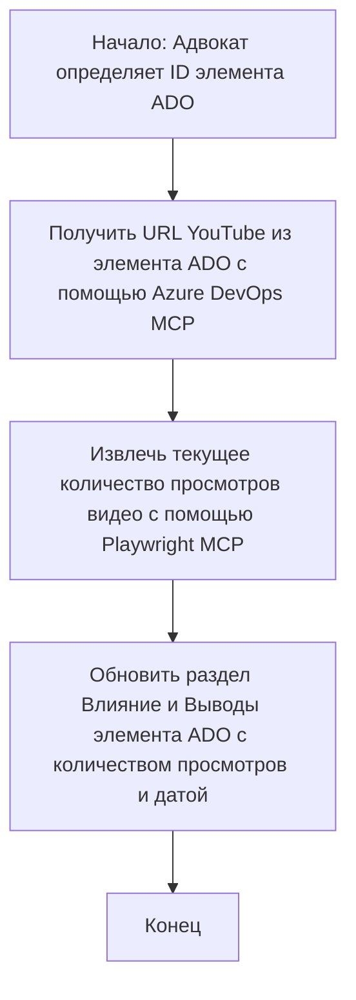

# Кейс: Обновление элементов Azure DevOps данными с YouTube с помощью MCP

> **Отказ от ответственности:** Существуют онлайн-инструменты и отчёты, которые могут автоматически обновлять элементы Azure DevOps данными с платформ, таких как YouTube. Приведённый ниже сценарий представлен исключительно как пример использования для иллюстрации того, как инструменты MCP могут применяться для задач автоматизации и интеграции.

## Обзор

В этом кейсе показан один из примеров использования Протокола Контекста Модели (MCP) и его инструментов для автоматизации процесса обновления рабочих элементов Azure DevOps (ADO) информацией, получаемой с онлайн-платформ, таких как YouTube. Описанный сценарий является лишь одной иллюстрацией более широких возможностей этих инструментов, которые могут быть адаптированы для многих аналогичных задач автоматизации.

В этом примере Адвокат отслеживает онлайн-сессии с помощью элементов ADO, где каждый элемент содержит URL видео YouTube. Используя инструменты MCP, Адвокат может автоматически и повторяемо поддерживать актуальность элементов ADO с последними метриками видео, такими как количество просмотров. Этот подход можно обобщить для других случаев, когда нужно интегрировать данные из онлайн-источников в ADO или другие системы.

## Сценарий

Адвокат отвечает за отслеживание воздействия онлайн-сессий и взаимодействий с сообществом. Каждая сессия фиксируется как рабочий элемент ADO в проекте «DevRel», при этом в элементе есть поле для URL видео YouTube. Чтобы точно отчитаться о охвате сессии, Адвокату необходимо обновить элемент ADO актуальным количеством просмотров видео и датой получения этой информации.

## Используемые инструменты

- [Azure DevOps MCP](https://github.com/microsoft/azure-devops-mcp): Обеспечивает программный доступ и обновление рабочих элементов ADO через MCP.
- [Playwright MCP](https://github.com/microsoft/playwright-mcp): Автоматизирует работу браузера для извлечения актуальных данных с веб-страниц, например, статистики видео на YouTube.

## Пошаговый процесс

1. **Определить элемент ADO**: Начать с ID рабочего элемента ADO (например, 1234) в проекте «DevRel».
2. **Получить URL YouTube**: С помощью инструмента Azure DevOps MCP получить URL видео YouTube из рабочего элемента.
3. **Извлечь количество просмотров**: С помощью Playwright MCP перейти по URL YouTube и извлечь текущее количество просмотров.
4. **Обновить элемент ADO**: Записать последнее количество просмотров и дату получения в раздел «Влияние и выводы» рабочего элемента ADO с использованием Azure DevOps MCP.

## Пример запроса

```bash
- Work with the ADO Item ID: 1234
- The project is '2025-Awesome'
- Get the YouTube URL for the ADO item
- Use Playwright to get the current views from the YouTube video
- Update the ADO item with the current video views and the updated date of the information
```

## Mermaid Flowchart


## Техническая реализация

- **Оркестровка MCP**: Процесс управляется сервером MCP, который координирует использование инструментов Azure DevOps MCP и Playwright MCP.
- **Автоматизация**: Процесс можно запускать вручную или по расписанию, чтобы поддерживать актуальность элементов ADO.
- **Расширяемость**: Тот же шаблон можно использовать для обновления элементов ADO другими онлайн-метриками (например, лайками, комментариями) или с других платформ.

## Результаты и влияние

- **Эффективность**: Снижает ручной труд Адвокатов, автоматизируя получение и обновление метрик видео.
- **Точность**: Обеспечивает отображение в элементах ADO самой актуальной информации из онлайн-источников.
- **Повторяемость**: Предоставляет повторно используемый процесс для похожих сценариев с другими источниками данных или метриками.

## Ссылки

- [Azure DevOps MCP](https://github.com/microsoft/azure-devops-mcp)
- [Playwright MCP](https://github.com/microsoft/playwright-mcp)
- [Model Context Protocol (MCP)](https://modelcontextprotocol.io/)

## Что дальше

- Вернуться к: [Обзор кейсов](./README.md)
- Далее: [Получение документации в реальном времени с MCP](./docs-mcp/README.md)

---

<!-- CO-OP TRANSLATOR DISCLAIMER START -->
**Отказ от ответственности**:  
Этот документ был переведен с использованием сервиса автоматического перевода [Co-op Translator](https://github.com/Azure/co-op-translator). Несмотря на наши усилия обеспечить точность, следует учитывать, что машинный перевод может содержать ошибки или неточности. Оригинальный документ на его языке считается авторитетным источником. Для получения критически важной информации рекомендуется обращаться к профессиональному переводу человеком. Мы не несем ответственности за любые недоразумения или неправильные толкования, возникшие в результате использования данного перевода.
<!-- CO-OP TRANSLATOR DISCLAIMER END -->