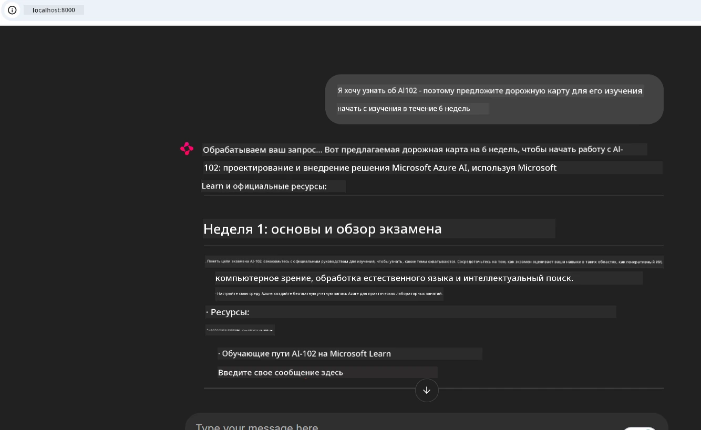
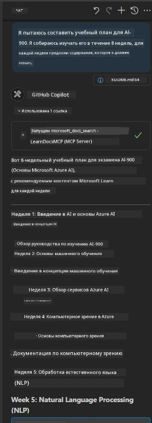

# Кейс: Подключение к серверу Microsoft Learn Docs MCP с клиента

Случалось ли вам метаться между сайтами с документацией, Stack Overflow и бесконечным количеством вкладок поисковика, пытаясь решить проблему в вашем коде? Может быть, у вас стоит второй монитор только для документации, или вы постоянно переключаетесь между редактором и браузером с помощью Alt+Tab. А было бы не лучше, если бы документация оказалась прямо в вашем рабочем процессе — интегрированной в ваши приложения, IDE или даже собственные инструменты? В этом кейсе мы рассмотрим, как сделать именно это, подключившись напрямую к серверу Microsoft Learn Docs MCP из собственного клиентского приложения.

## Обзор

Современная разработка — это не просто написание кода, а поиск нужной информации в нужное время. Документация есть повсюду, но редко там, где она нужна больше всего: в ваших инструментах и рабочих процессах. Интегрируя получение документации прямо в приложения, вы экономите время, снижаете количество переключений контекста и повышаете продуктивность. В этом разделе мы покажем, как подключить клиент к серверу Microsoft Learn Docs MCP, чтобы получить доступ к актуальной, контекстно-зависимой документации, не покидая своё приложение.

Мы пройдём через процесс установления соединения, отправки запроса и эффективной обработки потоковых ответов. Такой подход не только упрощает ваш рабочий процесс, но и открывает двери для создания более умных и полезных инструментов для разработчиков.

## Цели обучения

Зачем всё это делать? Потому что лучшие инструменты для разработчиков устраняют трения. Представьте мир, где ваш редактор кода, чат-бот или веб-приложение могут мгновенно отвечать на вопросы по документации, используя актуальный контент Microsoft Learn. По окончании этой главы вы будете уметь:

- Понимать основы взаимодействия клиента и сервера MCP для работы с документацией
- Реализовывать консольное или веб-приложение для подключения к серверу Microsoft Learn Docs MCP
- Использовать потоковых HTTP клиентов для получения документации в реальном времени
- Логгировать и интерпретировать ответы с документацией в своем приложении

Вы увидите, как эти навыки помогут создавать инструменты, которые не просто реагируют, а действительно интерактивны и зависят от контекста.

## Сценарий 1 — Получение документации в реальном времени с MCP

В этом сценарии мы покажем, как подключить клиента к серверу Microsoft Learn Docs MCP, чтобы получать актуальную, контекстно-зависимую документацию, не покидая приложение.

Давайте перейдём к практике. Ваша задача — написать приложение, которое подключается к серверу Microsoft Learn Docs MCP, вызывает инструмент `microsoft_docs_search` и выводит потоковый ответ в консоль.

### Почему именно такой подход?
Потому что это основа для более сложных интеграций — будь то чат-бот, расширение для IDE или веб-панель управления.

Код и инструкции для этого сценария находятся в папке [`solution`](./solution/README.md) этого кейса. Последовательность шагов поможет вам настроить соединение:
- Использовать официальный MCP SDK и потоковый HTTP клиент для подключения
- Вызывать инструмент `microsoft_docs_search` с параметром запроса для получения документации
- Реализовать правильный логгинг и обработку ошибок
- Создать интерактивный консольный интерфейс для ввода нескольких поисковых запросов

В этом сценарии вы научитесь:
- Подключаться к серверу Docs MCP
- Отправлять запрос
- Разбирать и выводить результаты

Вот как может выглядеть запуск решения:

```
Prompt> What is Azure Key Vault?
Answer> Azure Key Vault is a cloud service for securely storing and accessing secrets. ...
```
  
Ниже приведён минимальный пример решения. Полный код и подробности доступны в папке с решением.

<details>
<summary>Python</summary>

```python
import asyncio
from mcp.client.streamable_http import streamablehttp_client
from mcp import ClientSession

async def main():
    async with streamablehttp_client("https://learn.microsoft.com/api/mcp") as (read_stream, write_stream, _):
        async with ClientSession(read_stream, write_stream) as session:
            await session.initialize()
            result = await session.call_tool("microsoft_docs_search", {"query": "Azure Functions best practices"})
            print(result.content)

if __name__ == "__main__":
    asyncio.run(main())
```
  
- Для полного варианта реализации и логгирования смотрите [`scenario1.py`](../../../../09-CaseStudy/docs-mcp/solution/python/scenario1.py).  
- Инструкции по установке и использованию вы найдёте в файле [`README.md`](./solution/python/README.md) в той же папке.  
</details>


## Сценарий 2 — Веб-приложение генератора интерактивного учебного плана с MCP

В этом сценарии вы узнаете, как интегрировать Docs MCP в проект веб-разработки. Цель — позволить пользователям искать документацию Microsoft Learn прямо из веб-интерфейса, делая её мгновенно доступной внутри вашего приложения или сайта.

Вы научитесь:
- Настраивать веб-приложение
- Подключаться к серверу Docs MCP
- Обрабатывать пользовательский ввод и отображать результаты

Вот как может выглядеть запуск решения:

```
User> I want to learn about AI102 - so suggest the roadmap to get it started from learn for 6 weeks

Assistant> Here’s a detailed 6-week roadmap to start your preparation for the AI-102: Designing and Implementing a Microsoft Azure AI Solution certification, using official Microsoft resources and focusing on exam skills areas:

---
## Week 1: Introduction & Fundamentals
- **Understand the Exam**: Review the [AI-102 exam skills outline](https://learn.microsoft.com/en-us/credentials/certifications/exams/ai-102/).
- **Set up Azure**: Sign up for a free Azure account if you don't have one.
- **Learning Path**: [Introduction to Azure AI services](https://learn.microsoft.com/en-us/training/modules/intro-to-azure-ai/)
- **Focus**: Get familiar with Azure portal, AI capabilities, and necessary tools.

....more weeks of the roadmap...

Let me know if you want module-specific recommendations or need more customized weekly tasks!
```
  
Ниже приведён минимальный пример решения. Полный код и подробности доступны в папке с решением.



<details>
<summary>Python (Chainlit)</summary>

Chainlit — это фреймворк для создания веб-приложений с разговорным ИИ. Он упрощает создание интерактивных чат-ботов и помощников, которые могут вызывать инструменты MCP и отображать результаты в реальном времени. Идеально подходит для быстрой прототипизации и удобных пользовательских интерфейсов.

```python
import chainlit as cl
import requests

MCP_URL = "https://learn.microsoft.com/api/mcp"

@cl.on_message
def handle_message(message):
    query = {"question": message}
    response = requests.post(MCP_URL, json=query)
    if response.ok:
        result = response.json()
        cl.Message(content=result.get("answer", "No answer found.")).send()
    else:
        cl.Message(content="Error: " + response.text).send()
```
  
- Для полной реализации смотрите [`scenario2.py`](../../../../09-CaseStudy/docs-mcp/solution/python/scenario2.py).  
- Инструкции по настройке и запуску — в файле [`README.md`](./solution/python/README.md).  
</details>


## Сценарий 3: Документация в редакторе с MCP сервером в VS Code

Если вы хотите получать Microsoft Learn Docs прямо в VS Code (вместо переключения вкладок браузера), вы можете использовать MCP сервер в вашем редакторе. Это позволяет:  
- Искать и читать документацию в VS Code, не покидая среды разработки.  
- Ссылаться на документацию и вставлять ссылки напрямую в README или в файлы курса.  
- Использовать GitHub Copilot совместно с MCP для бесшовного, ИИ-усиленного рабочего процесса с документацией.

**Вы научитесь:**  
- Добавлять валидный файл `.vscode/mcp.json` в корень вашего рабочего пространства (пример ниже).  
- Открывать панель MCP или использовать палитру команд в VS Code для поиска и вставки документации.  
- Ссылаться на документацию прямо в markdown-файлах во время работы.  
- Совмещать этот рабочий процесс с GitHub Copilot для ещё большей продуктивности.

Вот пример настройки MCP сервера в VS Code:

```json
{
  "servers": {
    "LearnDocsMCP": {
      "url": "https://learn.microsoft.com/api/mcp"
    }
  }
}
```
  
</details>

> Для подробного руководства со скриншотами и пошаговыми инструкциями смотрите [`README.md`](./solution/scenario3/README.md).



Такой подход идеально подходит для тех, кто создаёт технические курсы, пишет документацию или разрабатывает код с частыми обращениями к справочным материалам.

## Основные выводы

Интеграция документации непосредственно в ваши инструменты — это не просто удобство, это революция в продуктивности. Подключаясь к серверу Microsoft Learn Docs MCP с клиента, вы можете:

- Исключить переключения между кодом и документацией  
- Получать актуальную, контекстно-зависимую документацию в реальном времени  
- Создавать более умные и интерактивные инструменты для разработчиков  

Эти навыки помогут создавать решения, которые не только эффективны, но и приятны в использовании.

## Дополнительные ресурсы

Для углубления знаний изучите официальные ресурсы:

- [Microsoft Learn Docs MCP Server (GitHub)](https://github.com/MicrosoftDocs/mcp)  
- [Начало работы с Azure MCP Server (mcp-python)](https://learn.microsoft.com/en-us/azure/developer/azure-mcp-server/get-started#create-the-python-app)  
- [Что такое Azure MCP Server?](https://learn.microsoft.com/en-us/azure/developer/azure-mcp-server/)  
- [Введение в Model Context Protocol (MCP)](https://modelcontextprotocol.io/introduction)  
- [Добавление плагинов из MCP Server (Python)](https://learn.microsoft.com/en-us/semantic-kernel/concepts/plugins/adding-mcp-plugins)  

## Что дальше

- Вернуться к: [Обзор кейсов](../README.md)  
- Продолжить: [Модуль 10: Оптимизация AI рабочих процессов с AI Toolkit](../../10-StreamliningAIWorkflowsBuildingAnMCPServerWithAIToolkit/README.md)

---

<!-- CO-OP TRANSLATOR DISCLAIMER START -->
**Отказ от ответственности**:  
Этот документ был переведен с помощью автоматического сервиса перевода [Co-op Translator](https://github.com/Azure/co-op-translator). Несмотря на наши усилия обеспечить точность, имейте в виду, что автоматический перевод может содержать ошибки или неточности. Оригинальный документ на его исходном языке следует считать авторитетным источником. Для критически важной информации рекомендуется обращаться к профессиональному человеческому переводу. Мы не несем ответственности за любые недоразумения или неправильные толкования, возникшие в результате использования данного перевода.
<!-- CO-OP TRANSLATOR DISCLAIMER END -->