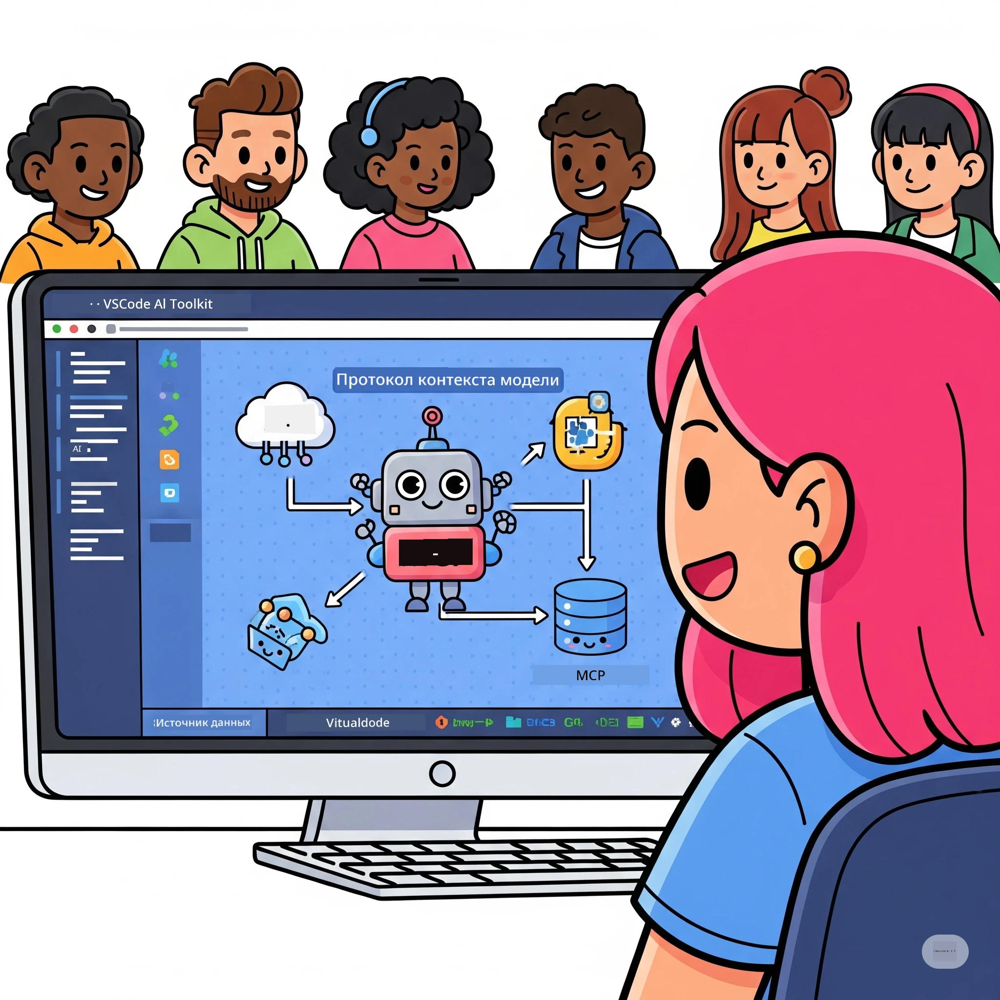
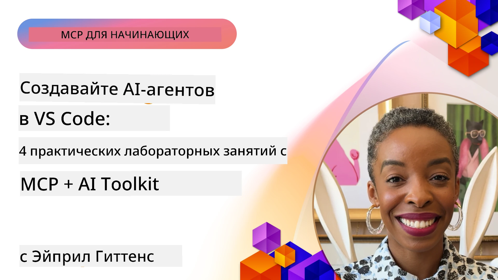

# Оптимизация рабочих процессов ИИ: создание MCP сервера с AI Toolkit

## 🎯 Обзор

_(Нажмите на изображение выше, чтобы посмотреть видео этого урока)_

Добро пожаловать на **семинар по Model Context Protocol (MCP)**! Этот комплексный практический семинар объединяет две передовые технологии для революции в разработке приложений ИИ:

- **🔗 Model Context Protocol (MCP)**: открытый стандарт для бесшовной интеграции ИИ-инструментов
- **🛠️ AI Toolkit для Visual Studio Code (AITK)**: мощное расширение для разработки ИИ от Microsoft

### 🎓 Чему вы научитесь

К концу этого семинара вы освоите создание интеллектуальных приложений, которые связывают ИИ-модели с реальными инструментами и сервисами. От автоматизированного тестирования до пользовательских интеграций API — вы получите практические навыки для решения сложных бизнес-задач.

## 🏗️ Технологический стек

### 🔌 Model Context Protocol (MCP)

MCP — это **“USB-C для ИИ”** — универсальный стандарт, который соединяет ИИ-модели с внешними инструментами и источниками данных.

**✨ Основные особенности:**

- 🔄 **Стандартизированная интеграция**: универсальный интерфейс для подключения ИИ-инструментов
- 🏛️ **Гибкая архитектура**: локальные и удалённые серверы через stdio/SSE транспорт
- 🧰 **Богатая экосистема**: инструменты, подсказки и ресурсы в одном протоколе
- 🔒 **Готовность к корпоративному использованию**: встроенная безопасность и надёжность

**🎯 Почему MCP важен:**
Так же, как USB-C убрал хаос с кабелями, MCP устраняет сложности интеграции ИИ. Один протокол — бесконечные возможности.

### 🤖 AI Toolkit для Visual Studio Code (AITK)

Флагманское расширение Microsoft для разработки ИИ, превращающее VS Code в мощную платформу для ИИ.

**🚀 Основные возможности:**

- 📦 **Каталог моделей**: доступ к моделям из Azure AI, GitHub, Hugging Face, Ollama
- ⚡ **Локальный вывод**: оптимизированное выполнение на CPU/GPU/NPU с ONNX
- 🏗️ **Конструктор агентов**: визуальная разработка ИИ-агентов с интеграцией MCP
- 🎭 **Мультимодальность**: поддержка текста, изображений и структурированного вывода

**💡 Преимущества разработки:**

- Развёртывание моделей без настройки
- Визуальное создание подсказок
- Площадка для тестирования в реальном времени
- Бесшовная интеграция с MCP сервером

## 📚 Учебный курс

### [🚀 Модуль 1: Основы AI Toolkit](./lab1/README.md)

**Длительность**: 15 минут

- 🛠️ Установка и настройка AI Toolkit для VS Code
- 🗂️ Изучение Каталога моделей (100+ моделей с GitHub, ONNX, OpenAI, Anthropic, Google)
- 🎮 Освоение интерактивной площадки для тестирования моделей в реальном времени
- 🤖 Создание первого ИИ-агента с помощью Конструктора агентов
- 📊 Оценка производительности моделей с использованием встроенных метрик (F1, релевантность, сходство, когерентность)
- ⚡ Изучение обработки пакетных данных и поддержки мультимодальности

**🎯 Результат обучения**: создание функционального ИИ-агента с полным пониманием возможностей AITK

### [🌐 Модуль 2: Основы MCP с AI Toolkit](./lab2/README.md)

**Длительность**: 20 минут

- 🧠 Освоение архитектуры и концепций Model Context Protocol (MCP)
- 🌐 Обзор экосистемы MCP серверов от Microsoft
- 🤖 Создание агента автоматизации браузера с использованием Playwright MCP сервера
- 🔧 Интеграция MCP серверов с Конструктором агентов AI Toolkit
- 📊 Настройка и тестирование MCP инструментов внутри ваших агентов
- 🚀 Экспорт и развёртывание агентов, использующих MCP, для производственной эксплуатации

**🎯 Результат обучения**: развертывание ИИ-агента с поддержкой внешних инструментов через MCP

### [🔧 Модуль 3: Продвинутая разработка MCP с AI Toolkit](./lab3/README.md)

**Длительность**: 20 минут

- 💻 Создание кастомных MCP серверов с помощью AI Toolkit
- 🐍 Настройка и использование последней версии MCP Python SDK (v1.9.3)
- 🔍 Настройка и использование MCP Inspector для отладки
- 🛠️ Создание MCP сервера погоды с профессиональными инструментами отладки
- 🧪 Отладка MCP серверов в средах Конструктора агентов и Inspector

**🎯 Результат обучения**: разработка и отладка кастомных MCP серверов с современными инструментами

### [🐙 Модуль 4: Практическая разработка MCP — собственный GitHub Clone сервер](./lab4/README.md)

**Длительность**: 30 минут

- 🏗️ Создание реального MCP сервера GitHub Clone для рабочих процессов разработки
- 🔄 Реализация интеллектуального клонирования репозиториев с проверкой и обработкой ошибок
- 📁 Создание интеллектуального управления каталогами и интеграции с VS Code
- 🤖 Использование GitHub Copilot Agent Mode с кастомными MCP инструментами
- 🛡️ Внедрение надёжности и кроссплатформенной совместимости для производственной эксплуатации

**🎯 Результат обучения**: развёртывание производственного MCP сервера, оптимизирующего реальные рабочие процессы разработки

## 💡 Применение в реальном мире и влияние

### 🏢 Корпоративные кейсы

#### 🔄 Автоматизация DevOps

Трансформируйте рабочие процессы разработки с помощью интеллектуальной автоматизации:

- **Умное управление репозиториями**: ИИ-ориентированный код-ревью и решения о слияниях
- **Интеллектуальный CI/CD**: автоматическая оптимизация пайплайна на основе изменений кода
- **Триаж задач**: автоматическая классификация и назначение багов

#### 🧪 Революция контроля качества

Поднимите тестирование на новый уровень с автоматизацией на базе ИИ:

- **Интеллектуальная генерация тестов**: автоматическое создание комплексных тестовых наборов
- **Визуальное регрессионное тестирование**: ИИ-детекция изменений интерфейса
- **Мониторинг производительности**: проактивное выявление и устранение проблем

#### 📊 Интеллектуальные данные и пайплайны

Создавайте умные рабочие процессы обработки данных:

- **Адаптивные ETL процессы**: самооптимизирующиеся трансформации данных
- **Обнаружение аномалий**: мониторинг качества данных в реальном времени
- **Интеллектуальная маршрутизация**: умное управление потоками данных

#### 🎧 Улучшение клиентского опыта

Создавайте исключительные взаимодействия с клиентами:

- **Клиентоориентированная поддержка**: агенты ИИ с доступом к истории клиента
- **Проактивное решение проблем**: предиктивное обслуживание клиентов
- **Мультиканальная интеграция**: единый ИИ опыт на всех платформах

## 🛠️ Требования и настройка

### 💻 Системные требования

| Компонент | Требование | Примечания |
|-----------|------------|------------|
| **Операционная система** | Windows 10+, macOS 10.15+, Linux | Любая современная ОС |
| **Visual Studio Code** | Последняя стабильная версия | Требуется для AITK |
| **Node.js** | v18.0+ и npm | Для разработки MCP серверов |
| **Python** | 3.10+ | Опционально для Python MCP серверов |
| **Оперативная память** | минимум 8 ГБ | Для локальных моделей рекомендуется 16 ГБ |

### 🔧 Среда разработки

#### Рекомендуемые расширения VS Code

- **AI Toolkit** (ms-windows-ai-studio.windows-ai-studio)
- **Python** (ms-python.python)
- **Python Debugger** (ms-python.debugpy)
- **GitHub Copilot** (GitHub.copilot) — опционально, но полезно

#### Опциональные инструменты

- **uv**: современный менеджер пакетов для Python
- **MCP Inspector**: визуальный инструмент отладки MCP серверов
- **Playwright**: для примеров веб-автоматизации

## 🎖️ Цели обучения и путь сертификации

### 🏆 Чеклист освоенных навыков

Завершив этот семинар, вы овладеете:

#### 🎯 Основные компетенции

- [ ] **Глубокое понимание MCP протокола**: архитектура и паттерны реализации
- [ ] **Профессиональное владение AITK**: экспертное использование AI Toolkit для быстрой разработки
- [ ] **Разработка собственных серверов**: создание, развёртывание и поддержка MCP серверов в продакшене
- [ ] **Отличная интеграция инструментов**: беспроблемное соединение ИИ с существующими рабочими процессами
- [ ] **Применение навыков к бизнес-задачам**: использование изученного в реальных задачах

#### 🔧 Технические навыки

- [ ] Настройка и конфигурация AI Toolkit в VS Code
- [ ] Проектирование и реализация кастомных MCP серверов
- [ ] Интеграция GitHub моделей с MCP архитектурой
- [ ] Создание автоматизированных рабочих процессов тестирования с Playwright
- [ ] Развёртывание ИИ-агентов для промышленного использования
- [ ] Отладка и оптимизация производительности MCP серверов

#### 🚀 Расширенные возможности

- [ ] Архитектура корпоративных интеграций ИИ
- [ ] Внедрение лучших практик безопасности для ИИ приложений
- [ ] Проектирование масштабируемых MCP серверных архитектур
- [ ] Создание кастомных цепочек инструментов для узкоспециализированных задач
- [ ] Наставничество по развитию AI-native разработок

## 📖 Дополнительные ресурсы

- [Спецификация MCP (2025-11-25)](https://spec.modelcontextprotocol.io/specification/2025-11-25/)
- [Репозиторий AI Toolkit на GitHub](https://github.com/microsoft/vscode-ai-toolkit)
- [Коллекция примеров MCP серверов](https://github.com/modelcontextprotocol/servers)
- [Руководство по лучшим практикам](https://modelcontextprotocol.io/docs/best-practices)
- [OWASP MCP Топ 10](https://microsoft.github.io/mcp-azure-security-guide/mcp/) — лучшие практики безопасности

---

**🚀 Готовы революционизировать свой рабочий процесс разработки ИИ?**

Давайте вместе создавать будущее интеллектуальных приложений с MCP и AI Toolkit!

## Что дальше

Продолжайте: [Модуль 11: Практические занятия с MCP сервером](../11-MCPServerHandsOnLabs/README.md)

---

<!-- CO-OP TRANSLATOR DISCLAIMER START -->
**Отказ от ответственности**:  
Этот документ был переведен с помощью сервиса автоматического перевода [Co-op Translator](https://github.com/Azure/co-op-translator). Несмотря на наши усилия по обеспечению точности, имейте в виду, что автоматический перевод может содержать ошибки или неточности. Оригинальный документ на его исходном языке следует считать авторитетным источником. Для критически важной информации рекомендуется профессиональный перевод специалистом. Мы не несем ответственности за любые недоразумения или неправильные толкования, возникшие в результате использования данного перевода.
<!-- CO-OP TRANSLATOR DISCLAIMER END -->