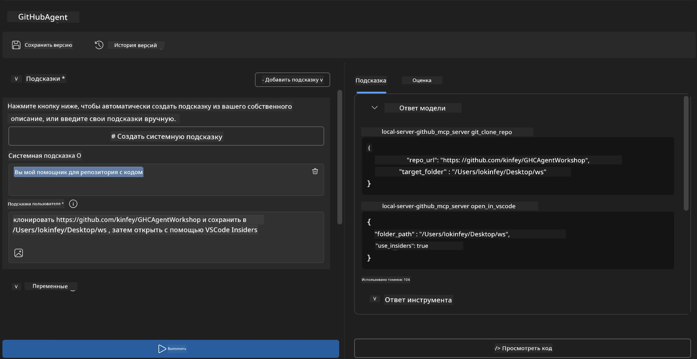
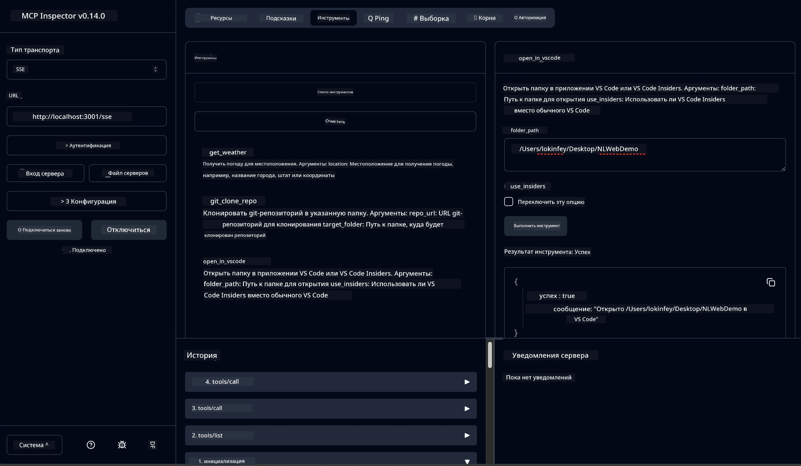

# 🐙 Модуль 4: Практическая разработка MCP - Пользовательский сервер клонирования GitHub


> **⚡ Быстрый старт:** Создайте готовый к производству сервер MCP, который автоматизирует клонирование репозиториев GitHub и интеграцию в VS Code всего за 30 минут!

## 🎯 Цели обучения

К концу этой лабораторной работы вы сможете:

- ✅ Создавать пользовательский сервер MCP для реальных рабочих процессов разработки
- ✅ Реализовать функциональность клонирования репозиториев GitHub через MCP
- ✅ Интегрировать пользовательские серверы MCP с VS Code и Agent Builder
- ✅ Использовать режим агента GitHub Copilot с пользовательскими инструментами MCP
- ✅ Тестировать и развертывать пользовательские серверы MCP в производственной среде

## 📋 Необходимые условия

- Завершение Лабораторных работ 1-3 (основы MCP и продвинутая разработка)
- Подписка на GitHub Copilot ([доступна бесплатная регистрация](https://github.com/github-copilot/signup))
- VS Code с расширениями AI Toolkit и GitHub Copilot
- Установленный и настроенный Git CLI

## 🏗️ Обзор проекта

### **Реальная задача разработки**
В качестве разработчиков мы часто используем GitHub для клонирования репозиториев и открытия их в VS Code или VS Code Insiders. Этот ручной процесс включает:
1. Открытие терминала/командной строки
2. Переход в нужную директорию
3. Выполнение команды `git clone`
4. Открытие VS Code в клонированной директории

**Наше решение MCP упрощает это до одной интеллектуальной команды!**

### **Что вы создадите**
**Сервер клонирования GitHub MCP** (`git_mcp_server`), который предоставляет:

| Возможность | Описание | Преимущество |
|-------------|----------|--------------|
| 🔄 **Интеллектуальное клонирование репозиториев** | Клонирование репозиториев GitHub с проверкой | Автоматическая проверка ошибок |
| 📁 **Интеллектуальное управление директориями** | Безопасная проверка и создание директорий | Предотвращает перезапись |
| 🚀 **Кроссплатформенная интеграция с VS Code** | Открытие проектов в VS Code/Insiders | Бесшовный переход в рабочем процессе |
| 🛡️ **Надёжная обработка ошибок** | Обработка сетевых, разрешительных и путевых ошибок | Надёжность готова к продакшену |

---

## 📖 Пошаговая реализация

### Шаг 1: Создание агента GitHub в Agent Builder

1. **Запустите Agent Builder** через расширение AI Toolkit
2. **Создайте нового агента** со следующими настройками:
   ```
   Agent Name: GitHubAgent
   ```

3. **Инициализируйте пользовательский сервер MCP:**
   - Перейдите в **Инструменты** → **Добавить инструмент** → **MCP Server**
   - Выберите **"Создать новый MCP сервер"**
   - Выберите шаблон **Python** для максимальной гибкости
   - **Имя сервера:** `git_mcp_server`

### Шаг 2: Настройка режима агента GitHub Copilot

1. **Откройте GitHub Copilot** в VS Code (Ctrl/Cmd + Shift + P → "GitHub Copilot: Open")
2. **Выберите модель агента** в интерфейсе Copilot
3. **Выберите модель Claude 3.7** для улучшенных возможностей рассуждения
4. **Включите интеграцию MCP** для доступа к инструментам

> **💡 Полезный совет:** Claude 3.7 обеспечивает лучшее понимание рабочих процессов разработки и шаблонов обработки ошибок.

### Шаг 3: Реализация основной функциональности сервера MCP

**Используйте следующий подробный запрос с режимом агента GitHub Copilot:**

```
Create two MCP tools with the following comprehensive requirements:

🔧 TOOL A: clone_repository
Requirements:
- Clone any GitHub repository to a specified local folder
- Return the absolute path of the successfully cloned project
- Implement comprehensive validation:
  ✓ Check if target directory already exists (return error if exists)
  ✓ Validate GitHub URL format (https://github.com/user/repo)
  ✓ Verify git command availability (prompt installation if missing)
  ✓ Handle network connectivity issues
  ✓ Provide clear error messages for all failure scenarios

🚀 TOOL B: open_in_vscode
Requirements:
- Open specified folder in VS Code or VS Code Insiders
- Cross-platform compatibility (Windows/Linux/macOS)
- Use direct application launch (not terminal commands)
- Auto-detect available VS Code installations
- Handle cases where VS Code is not installed
- Provide user-friendly error messages

Additional Requirements:
- Follow MCP 1.9.3 best practices
- Include proper type hints and documentation
- Implement logging for debugging purposes
- Add input validation for all parameters
- Include comprehensive error handling
```

### Шаг 4: Тестирование вашего сервера MCP

#### 4a. Тестирование в Agent Builder

1. **Запустите конфигурацию отладки** для Agent Builder
2. **Настройте вашего агента с этим системным запросом:**

```
SYSTEM_PROMPT:
You are my intelligent coding repository assistant. You help developers efficiently clone GitHub repositories and set up their development environment. Always provide clear feedback about operations and handle errors gracefully.
```

3. **Проверьте с реалистичными пользовательскими сценариями:**

```
USER_PROMPT EXAMPLES:

Scenario : Basic Clone and Open
"Clone {Your GitHub Repo link such as https://github.com/kinfey/GHCAgentWorkshop
 } and save to {The global path you specify}, then open it with VS Code Insiders"
```



**Ожидаемые результаты:**
- ✅ Успешное клонирование с подтверждением пути
- ✅ Автоматический запуск VS Code
- ✅ Чистые сообщения об ошибках для некорректных сценариев
- ✅ Корректная обработка крайних случаев

#### 4b. Тестирование в MCP Inspector




---


**🎉 Поздравляем!** Вы успешно создали практический, готовый к производству сервер MCP, который решает реальные задачи рабочих процессов разработки. Ваш пользовательский сервер клонирования GitHub демонстрирует мощь MCP для автоматизации и повышения продуктивности разработчиков.

### 🏆 Достижения:
- ✅ **Разработчик MCP** - Создан пользовательский сервер MCP
- ✅ **Автоматизатор рабочих процессов** - Оптимизированы процессы разработки  
- ✅ **Эксперт по интеграции** - Подключено множество инструментов разработки
- ✅ **Готов к продакшену** - Построены развертываемые решения

---

## 🎓 Завершение семинара: Ваш путь с Model Context Protocol

**Уважаемый участник семинара,**

Поздравляем с завершением всех четырёх модулей семинара Model Context Protocol! Вы прошли длинный путь от изучения основ AI Toolkit до создания готовых к производству серверов MCP, которые решают реальные задачи разработки.

### 🚀 Итоги вашего обучения:

**[Модуль 1](../lab1/README.md)**: Вы начали с изучения основ AI Toolkit, тестирования моделей и создания первого AI-агента.

**[Модуль 2](../lab2/README.md)**: Вы изучили архитектуру MCP, интегрировали Playwright MCP и создали первого агента для автоматизации браузера.

**[Модуль 3](../lab3/README.md)**: Вы перешли к разработке пользовательских серверов MCP с сервером погодных данных и освоили инструменты отладки.

**[Модуль 4](../lab4/README.md)**: Сейчас вы применили все знания для создания практического инструмента автоматизации рабочих процессов с репозиториями GitHub.

### 🌟 Чему вы научились:

- ✅ **Экосистема AI Toolkit**: модели, агенты и шаблоны интеграции
- ✅ **Архитектура MCP**: клиент-серверный дизайн, транспортные протоколы и безопасность
- ✅ **Инструменты разработчика**: от Playground до Inspector и до производственного развертывания
- ✅ **Пользовательская разработка**: создание, тестирование и развертывание собственных серверов MCP
- ✅ **Практические применения**: решение реальных задач рабочих процессов с помощью ИИ

### 🔮 Ваши дальнейшие шаги:

1. **Создайте свой MCP сервер**: примените эти навыки для автоматизации ваших уникальных рабочих процессов
2. **Присоединяйтесь к сообществу MCP**: делитесь своими разработками и учитесь у других
3. **Изучайте продвинутую интеграцию**: подключайте серверы MCP к корпоративным системам
4. **Вносите вклад в открытый исходный код**: помогайте улучшать инструменты MCP и документацию

Помните, что этот семинар — это только начало. Экосистема Model Context Protocol быстро развивается, и теперь у вас есть всё, чтобы быть на передовой разработки инструментов с поддержкой ИИ.

**Спасибо за участие и стремление к обучению!**

Надеемся, что этот семинар вдохновил вас на идеи, которые преобразят ваш подход к созданию и взаимодействию с ИИ-инструментами на вашем пути разработчика.

**Успешного кодинга!**

---

## Что дальше

Поздравляем с завершением всех лабораторных работ Модуля 10!

- Вернуться к: [Обзор Модуля 10](../README.md)
- Продолжить к: [Модуль 11: Практические лабораторные работы с MCP Server](../../11-MCPServerHandsOnLabs/README.md)

---

<!-- CO-OP TRANSLATOR DISCLAIMER START -->
**Отказ от ответственности**:  
Этот документ был переведен с помощью сервиса автоматического перевода [Co-op Translator](https://github.com/Azure/co-op-translator). Несмотря на наши усилия обеспечить точность, имейте в виду, что автоматический перевод может содержать ошибки или неточности. Оригинальный документ на его родном языке следует считать авторитетным источником. Для получения критически важной информации рекомендуется воспользоваться профессиональным переводом, выполненным человеком. Мы не несем ответственности за любые недоразумения или неправильные толкования, возникшие в результате использования данного перевода.
<!-- CO-OP TRANSLATOR DISCLAIMER END -->