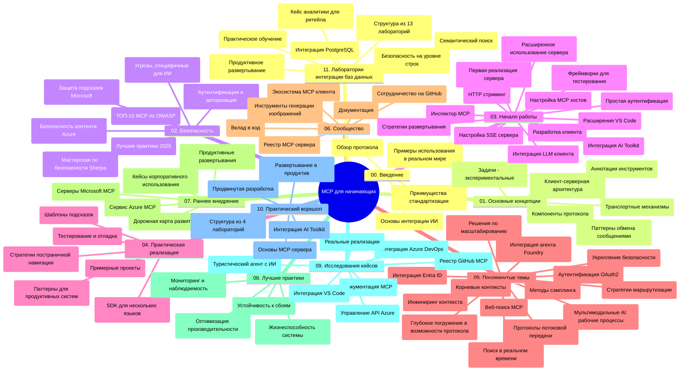

# Протокол Контекста Модели (MCP) для новичков - Учебное руководство

Это учебное руководство предоставляет обзор структуры репозитория и содержимого учебной программы "Протокол Контекста Модели (MCP) для новичков". Используйте это руководство для эффективной навигации по репозиторию и максимального использования доступных ресурсов.

## Обзор репозитория

Протокол Контекста Модели (MCP) — это стандартизированная платформа для взаимодействия между моделями ИИ и клиентскими приложениями. Изначально созданный Anthropic, MCP теперь поддерживается широкой сообществом MCP через официальную организацию на GitHub. Этот репозиторий содержит полную учебную программу с практическими примерами кода на C#, Java, JavaScript, Python и TypeScript, предназначенную для разработчиков ИИ, архитекторов систем и инженеров-программистов.

## Визуальная карта учебной программы

## Структура репозитория

Репозиторий организован в одиннадцать основных разделов, каждый из которых посвящён разным аспектам MCP:

1. **Введение (00-Introduction/)**
   - Обзор Протокола Контекста Модели
   - Почему стандартизация важна в AI-пайплайнах
   - Практические случаи использования и преимущества

2. **Основные концепции (01-CoreConcepts/)**
   - Клиент-серверная архитектура
   - Ключевые компоненты протокола
   - Паттерны обмена сообщениями в MCP

3. **Безопасность (02-Security/)**
   - Угрозы безопасности в системах на базе MCP
   - Лучшие практики по обеспечению безопасности реализации
   - Стратегии аутентификации и авторизации
   - **Комплексная документация по безопасности**:
     - Лучшие практики безопасности MCP 2025
     - Руководство по реализации Azure Content Safety
     - Контролы и методы безопасности MCP
     - Краткое руководство лучших практик MCP
   - **Ключевые темы безопасности**:
     - Атаки внедрения подсказок и отравления инструментов
     - Перехват сессий и проблемы "запутавшегося посредника"
     - Уязвимости передачи токенов
     - Чрезмерные права и контроль доступа
     - Безопасность цепочки поставок компонентов ИИ
     - Интеграция Microsoft Prompt Shields

4. **Начало работы (03-GettingStarted/)**
   - Настройка среды и конфигурация
   - Создание базовых серверов и клиентов MCP
   - Интеграция с существующими приложениями
   - Включает разделы:
     - Первая реализация сервера
     - Разработка клиента
     - Интеграция LLM-клиента
     - Интеграция с VS Code
     - Сервер Server-Sent Events (SSE)
     - Продвинутое использование сервера
     - HTTP стриминг
     - Интеграция AI Toolkit
     - Стратегии тестирования
     - Руководство по развертыванию

5. **Практическая реализация (04-PracticalImplementation/)**
   - Использование SDK на разных языках программирования
   - Отладка, тестирование и методы валидации
   - Разработка повторно используемых шаблонов подсказок и рабочих процессов
   - Примеры проектов с реализациями

6. **Продвинутые темы (05-AdvancedTopics/)**
   - Техники работы с контекстом
   - Интеграция с Foundry агентом
   - Мультимодальные AI-рабочие процессы
   - Демонстрации аутентификации OAuth2
   - Возможности поиска в реальном времени
   - Стриминг в реальном времени
   - Реализация корневых контекстов
   - Стратегии маршрутизации
   - Техники сэмплинга
   - Подходы к масштабированию
   - Вопросы безопасности
   - Интеграция безопасности Entra ID
   - Интеграция веб-поиска

7. **Вклад сообщества (06-CommunityContributions/)**
   - Как вносить код и документацию
   - Сотрудничество через GitHub
   - Улучшения и обратная связь от сообщества
   - Использование различных MCP клиентов (Claude Desktop, Cline, VSCode)
   - Работа с популярными MCP серверами, включая генерацию изображений

8. **Уроки раннего внедрения (07-LessonsfromEarlyAdoption/)**
   - Реальные реализации и истории успеха
   - Создание и развертывание решений на базе MCP
   - Тенденции и дорожная карта развития
   - **Руководство по Microsoft MCP серверам**: Полный справочник по 10 производственным серверам Microsoft MCP, включая:
     - Microsoft Learn Docs MCP Server
     - Azure MCP Server (15+ специализированных коннекторов)
     - GitHub MCP Server
     - Azure DevOps MCP Server
     - MarkItDown MCP Server
     - SQL Server MCP Server
     - Playwright MCP Server
     - Dev Box MCP Server
     - Azure AI Foundry MCP Server
     - Microsoft 365 Agents Toolkit MCP Server

9. **Лучшие практики (08-BestPractices/)**
   - Оптимизация производительности
   - Проектирование отказоустойчивых систем MCP
   - Стратегии тестирования и устойчивости

10. **Кейсы (09-CaseStudy/)**
    - **Семь полных кейсов**, демонстрирующих универсальность MCP в различных сценариях:
    - **Azure AI Travel Agents**: Оркестрация мультиагентов с Azure OpenAI и AI Search
    - **Интеграция Azure DevOps**: Автоматизация рабочих процессов с обновлениями данных YouTube
    - **Документация в реальном времени**: Клиент-консоль на Python с HTTP стримингом
    - **Интерактивный генератор учебного плана**: Веб-приложение Chainlit с разговорным ИИ
    - **Документация в редакторе**: Интеграция VS Code с рабочими процессами GitHub Copilot
    - **Управление Azure API**: Интеграция корпоративных API и создание MCP сервера
    - **Реестр GitHub MCP**: Разработка экосистемы и платформа агентской интеграции
    - Примеры реализации в областях корпоративной интеграции, производительности разработчика и развития экосистемы

11. **Практический семинар (10-StreamliningAIWorkflowsBuildingAnMCPServerWithAIToolkit/)**
    - Всесторонний практический семинар, комбинирующий MCP с AI Toolkit
    - Создание интеллектуальных приложений, связывающих модели ИИ с реальными инструментами
    - Практические модули, охватывающие основы, разработку кастомного сервера и стратегии продакшн-развертывания
    - **Структура лабораторий**:
      - Лаборатория 1: Основы MCP сервера
      - Лаборатория 2: Продвинутая разработка MCP сервера
      - Лаборатория 3: Интеграция AI Toolkit
      - Лаборатория 4: Продакшн-развертывание и масштабирование
    - Обучение на основе лабораторий с пошаговыми инструкциями

12. **Лаборатории интеграции MCP сервера с базой данных (11-MCPServerHandsOnLabs/)**
    - **Обширный путь из 13 лабораторий** для создания производственных MCP серверов с интеграцией PostgreSQL
    - **Реализация на реальном кейсе розничной аналитики Zava Retail**
    - **Корпоративные паттерны**: уровень безопасности строк (RLS), семантический поиск, доступ к данным нескольких арендаторов
    - **Полная структура лабораторий**:
      - **Лаборатории 00-03: Основы** - Введение, архитектура, безопасность, настройка среды
      - **Лаборатории 04-06: Создание MCP сервера** - Проектирование базы данных, реализация сервера, разработка инструментов
      - **Лаборатории 07-09: Продвинутые функции** - Семантический поиск, тестирование и отладка, интеграция с VS Code
      - **Лаборатории 10-12: Продакшн и лучшие практики** - Развертывание, мониторинг, оптимизация
    - **Используемые технологии**: FastMCP framework, PostgreSQL, Azure OpenAI, Azure Container Apps, Application Insights
    - **Результаты обучения**: Серверы MCP готовые к продакшну, паттерны интеграции с базой данных, аналитика на базе ИИ, корпоративная безопасность

## Дополнительные ресурсы

В репозитории содержатся поддерживающие ресурсы:

- **Папка с изображениями**: Диаграммы и иллюстрации, используемые в учебной программе
- **Переводы**: Многоязычная поддержка с автоматическими переводами документации
- **Официальные ресурсы MCP**:
  - [Документация MCP](https://modelcontextprotocol.io/)
  - [Спецификация MCP](https://spec.modelcontextprotocol.io/)
  - [Репозиторий MCP на GitHub](https://github.com/modelcontextprotocol)

## Как использовать этот репозиторий

1. **Последовательное обучение**: Следуйте за главами по порядку (с 00 по 11) для структурированного изучения.
2. **Фокус на язык программирования**: Если вас интересует конкретный язык, изучайте каталоги примеров в соответствующем языке.
3. **Практическая реализация**: Начните с раздела "Начало работы" для настройки среды и создания первых MCP сервера и клиента.
4. **Продвинутое изучение**: После освоения основ переходите к продвинутым темам для расширения знаний.
5. **Взаимодействие с сообществом**: Присоединяйтесь к сообществу MCP через обсуждения на GitHub и каналы Discord для общения с экспертами и разработчиками.

## MCP Клиенты и инструменты

Учебная программа охватывает различные MCP клиенты и инструменты:

1. **Официальные клиенты**:
   - Visual Studio Code
   - MCP в Visual Studio Code
   - Claude Desktop
   - Claude в VSCode
   - Claude API

2. **Клиенты сообщества**:
   - Cline (терминальный клиент)
   - Cursor (редактор кода)
   - ChatMCP
   - Windsurf

3. **Инструменты управления MCP**:
   - MCP CLI
   - MCP Manager
   - MCP Linker
   - MCP Router

## Популярные MCP серверы

В репозитории представлены различные MCP серверы, включая:

1. **Официальные серверы Microsoft MCP**:
   - Microsoft Learn Docs MCP Server
   - Azure MCP Server (15+ специализированных коннекторов)
   - GitHub MCP Server
   - Azure DevOps MCP Server
   - MarkItDown MCP Server
   - SQL Server MCP Server
   - Playwright MCP Server
   - Dev Box MCP Server
   - Azure AI Foundry MCP Server
   - Microsoft 365 Agents Toolkit MCP Server

2. **Официальные референс-серверы**:
   - Filesystem
   - Fetch
   - Memory
   - Sequential Thinking

3. **Генерация изображений**:
   - Azure OpenAI DALL-E 3
   - Stable Diffusion WebUI
   - Replicate

4. **Инструменты разработки**:
   - Git MCP
   - Terminal Control
   - Code Assistant

5. **Специализированные серверы**:
   - Salesforce
   - Microsoft Teams
   - Jira & Confluence

## Вклад в проект

Этот репозиторий приветствует вклад сообщества. См. раздел "Вклад сообщества" для получения рекомендаций по эффективному внесению вклада в экосистему MCP.

----

*Это учебное руководство было обновлено 5 февраля 2026 года с учётом последней спецификации MCP от 2025-11-25 и содержит обзор репозитория на эту дату. Содержимое репозитория может обновляться после этой даты.*

---

<!-- CO-OP TRANSLATOR DISCLAIMER START -->
**Отказ от ответственности**:  
Этот документ был переведен с помощью сервиса машинного перевода [Co-op Translator](https://github.com/Azure/co-op-translator). Несмотря на наши усилия по обеспечению точности, обратите внимание, что автоматический перевод может содержать ошибки или неточности. Оригинальный документ на исходном языке следует считать авторитетным источником. Для важной информации рекомендуется использовать профессиональный перевод, выполненный человеком. Мы не несем ответственности за любые недоразумения или неправильные толкования, возникшие в результате использования данного перевода.
<!-- CO-OP TRANSLATOR DISCLAIMER END -->