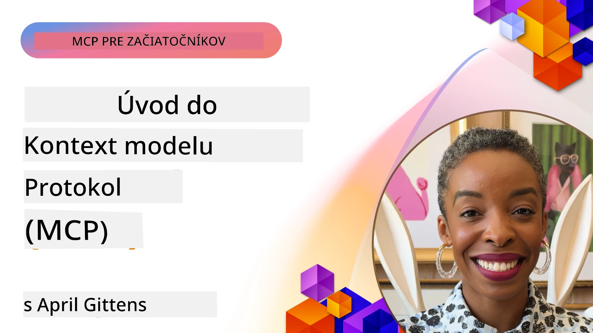
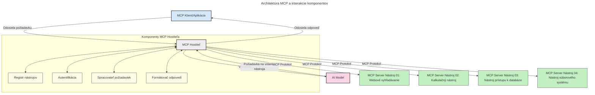

# Úvod do Model Context Protocol (MCP): Prečo je dôležitý pre škálovateľné AI aplikácie

[](https://youtu.be/agBbdiOPLQA)

_(Kliknite na obrázok vyššie pre zobrazenie videa k tejto lekcii)_

Generatívne AI aplikácie sú veľkým krokom vpred, pretože často umožňujú používateľovi interagovať s aplikáciou pomocou prirodzených jazykových podnetov. Avšak, keď do takýchto aplikácií investujete viac času a zdrojov, chcete si byť istí, že môžete jednoducho integrovať funkcie a zdroje tak, aby bolo jednoduché aplikáciu rozširovať, aby vaša aplikácia podporovala viac ako jeden model a vedela zvládnuť rôzne komplexnosti modelov. Stručne povedané, budovanie generatívnych AI aplikácií je spočiatku jednoduché, ale keď rastú a stávajú sa zložitejšími, je potrebné začať definovať architektúru a pravdepodobne budete musieť spoľahnúť na štandard, ktorý zabezpečí, že vaše aplikácie sú postavené konzistentne. Tu prichádza MCP, ktorý organizuje veci a poskytuje štandard.

---

## **🔍 Čo je Model Context Protocol (MCP)?**

**Model Context Protocol (MCP)** je **otvorený, štandardizovaný rozhranie**, ktoré umožňuje veľkým jazykovým modelom (LLM) bezproblémovo komunikovať s externými nástrojmi, API a zdrojmi dát. Poskytuje konzistentnú architektúru na rozšírenie funkčnosti AI modelov nad rámec ich trénovacích dát, umožňujúc inteligentnejšie, škálovateľnejšie a citlivejšie AI systémy.

---

## **🎯 Prečo je štandardizácia v AI dôležitá**

Ako sa generatívne AI aplikácie stávajú zložitejšími, je nevyhnutné prijímať štandardy, ktoré zaručia **škálovateľnosť, rozšíriteľnosť, udržiavateľnosť** a **zabránia viazanosti na dodávateľa**. MCP rieši tieto potreby tým, že:

- Zjednocuje integrácie model–nástroj
- Znižuje krehké, jednorazové vlastné riešenia
- Umožňuje súčasnú existenciu viacerých modelov od rôznych dodávateľov v jednom ekosystéme

**Poznámka:** Hoci sa MCP prezentuje ako otvorený štandard, neplánuje sa jeho štandardizácia cez existujúce štandardizačné organizácie ako IEEE, IETF, W3C, ISO alebo ďalšie.

---

## **📚 Ciele učenia**

Na konci tohto článku budete schopní:

- Definovať **Model Context Protocol (MCP)** a jeho použitia
- Pochopiť, ako MCP štandardizuje komunikáciu model–nástroj
- Identifikovať základné komponenty MCP architektúry
- Preskúmať reálne použitia MCP v podnikových a vývojárskych kontextoch

---

## **💡 Prečo je Model Context Protocol (MCP) prielomový**

### **🔗 MCP rieši fragmentáciu v AI interakciách**

Pred MCP integrácia modelov s nástrojmi vyžadovala:

- Vlastný kód pre každú kombináciu nástroja a modelu
- Neštandardné API pre každého dodávateľa
- Časté prerušenia kvôli aktualizáciám
- Zlá škálovateľnosť pri pridaní viacerých nástrojov

### **✅ Výhody štandardizácie MCP**

| **Výhoda**              | **Popis**                                                                      |
|-------------------------|--------------------------------------------------------------------------------|
| Interoperabilita        | LLM pracujú bezproblémovo s nástrojmi od rôznych dodávateľov                  |
| Konzistencia            | Jednotné správanie naprieč platformami a nástrojmi                            |
| Opätovná použiteľnosť   | Nástroje vytvorené raz je možné použiť v rôznych projektoch a systémoch       |
| Urýchlený vývoj         | Skrátený čas vývoja vďaka štandardizovaným plug-and-play rozhraniam           |

---

## **🧱 Prehľad architektúry MCP na vysokej úrovni**

MCP nasleduje **klient-server model**, kde:

- **MCP Hostitelia** bežia AI modely
- **MCP Klienti** iniciujú požiadavky
- **MCP Servery** poskytujú kontext, nástroje a schopnosti

### **Kľúčové komponenty:**

- **Zdroje** – statické alebo dynamické dáta pre modely  
- **Podnety** – preddefinované pracovné postupy pre riadenú generáciu  
- **Nástroje** – spustiteľné funkcie ako vyhľadávanie, výpočty  
- **Vzorkovanie** – agentické správanie cez rekurzívne interakcie
- **Vytyčovanie** – požiadavky na vstup používateľa iniciované serverom
- **Roots** – hranice súborového systému pre kontrolu prístupu servera

### **Architektúra protokolu:**

MCP používa dvojvrstvovú architektúru:
- **Dátová vrstva**: komunikácia založená na JSON-RPC 2.0 s riadením životného cyklu a primitívami
- **Transportná vrstva**: kanály komunikácie STDIO (lokálne) a Streamable HTTP so SSE (vzdialené)

---

## Ako MCP servery fungujú

MCP servery pracujú nasledujúcim spôsobom:

- **Tok požiadaviek**:
    1. Požiadavka je iniciovaná koncovým používateľom alebo softvérom, ktorý koná v jeho mene.
    2. **MCP Klient** odošle požiadavku na **MCP Hostiteľa**, ktorý spravuje runtime AI modelu.
    3. **AI Model** prijme používateľský podnet a môže si vyžiadať prístup k externým nástrojom alebo dátam pomocou jednej alebo viacerých výziev nástrojov.
    4. **MCP Hostiteľ**, nie priamo model, komunikuje so správnym **MCP Serverom** pomocou štandardizovaného protokolu.
- **Funkcie MCP Hostiteľa**:
    - **Registr nástrojov**: udržiava katalóg dostupných nástrojov a ich schopností.
    - **Autentifikácia**: overuje oprávnenia na prístup k nástrojom.
    - **Spracovateľ požiadaviek**: spracováva prichádzajúce požiadavky na nástroje z modelu.
    - **Formátovač odpovedí**: štrukturuje výstupy nástrojov do formátu, ktorý model rozumie.
- **Vykonávanie MCP Servera**:
    - **MCP Hostiteľ** smeruje volania nástrojov na jeden alebo viac **MCP Serverov**, z ktorých každý vystavuje špecializované funkcie (napr. vyhľadávanie, výpočty, dotazy do databázy).
    - **MCP Servery** vykonajú svoje operácie a vrátia výsledky späť **MCP Hostiteľovi** v konzistentnom formáte.
    - **MCP Hostiteľ** formátuje a odosiela tieto výsledky AI modelu.
- **Dokončenie odpovede**:
    - **AI Model** zakomponuje výstupy nástrojov do konečnej odpovede.
    - **MCP Hostiteľ** túto odpoveď odošle späť **MCP Klientovi**, ktorý ju doručí koncovému používateľovi alebo volajúcemu softvéru.
    


## 👨‍💻 Ako vytvoriť MCP Server (s príkladmi)

MCP servery vám umožňujú rozšíriť schopnosti LLM poskytovaním dát a funkcií.

Pripravení vyskúšať? Tu sú jazyky a/alebo špecifické SDK so vzormi vytvorenia jednoduchých MCP serverov v rôznych jazykoch/stackoch:

- **Python SDK**: https://github.com/modelcontextprotocol/python-sdk

- **TypeScript SDK**: https://github.com/modelcontextprotocol/typescript-sdk

- **Java SDK**: https://github.com/modelcontextprotocol/java-sdk

- **C#/.NET SDK**: https://github.com/modelcontextprotocol/csharp-sdk


## 🌍 Reálne použitia MCP

MCP umožňuje širokú škálu aplikácií rozširovaním schopností AI:

| **Aplikácia**                      | **Popis**                                                                       |
|-----------------------------------|---------------------------------------------------------------------------------|
| Integrácia podnikových dát         | Pripojenie LLM k databázam, CRM alebo interným nástrojom                         |
| Agentické AI systémy              | Umožniť autonómnym agentom prístup k nástrojom a pracovným tokom rozhodovania     |
| Multi-modálne aplikácie           | Kombinovať textové, obrazové a audio nástroje v jednej unified AI aplikácii      |
| Integrácia dát v reálnom čase    | Priniesť živé dáta do AI interakcií pre presnejšie a aktuálne výstupy            |


### 🧠 MCP = Univerzálny štandard pre AI interakcie

Model Context Protocol (MCP) slúži ako univerzálny štandard pre AI interakcie, podobne ako USB-C štandardizoval fyzické pripojenia pre zariadenia. Vo svete AI MCP poskytuje konzistentné rozhranie, ktoré umožňuje modelom (klientom) bezproblémovo sa integrovať s externými nástrojmi a poskytovateľmi dát (servermi). Tým sa eliminuje potreba rôznych, vlastných protokolov pre každé API alebo zdroj dát.

Pod MCP MCP-kompatibilný nástroj (nazývaný MCP server) sleduje jednotný štandard. Tieto servery môžu uviesť nástroje alebo akcie, ktoré ponúkajú, a vykonávať ich na požiadanie AI agentom. Platformy AI agentov podporujúce MCP dokážu vyhľadávať dostupné nástroje na serveroch a vyvolávať ich prostredníctvom tohto štandardného protokolu.

### 💡 Uľahčuje prístup k vedomostiam

Okrem poskytovania nástrojov MCP umožňuje aj prístup k vedomostiam. Aplikácie môžu poskytovať kontext veľkým jazykovým modelom (LLM) tým, že ich prepoja s rôznymi zdrojmi dát. Napríklad MCP server môže predstavovať firemnú dokumentačnú databázu, čo umožňuje agentom na požiadanie načítať relevantné informácie. Iný server môže vykonávať špecifické akcie, napríklad posielanie e-mailov alebo aktualizáciu záznamov. Z pohľadu agenta sú to jednoducho nástroje, ktoré môže používať – niektoré vracajú dáta (kontext vedomostí), iné vykonávajú akcie. MCP oba tieto prípady efektívne spravuje.

Agent, ktorý sa pripája k MCP serveru, automaticky zistí dostupné schopnosti servera a prístupné dáta prostredníctvom štandardizovaného formátu. Táto štandardizácia umožňuje dynamickú dostupnosť nástrojov. Napríklad pridaním nového MCP servera do systému agenta sa jeho funkcie okamžite sprístupnia bez potreby ďalšej úpravy pokynov agenta.

Táto zjednodušená integrácia korešponduje s tokom znázorneným na nasledujúcej schéme, kde servery poskytujú nástroje aj vedomosti, čo zabezpečuje plynulú spoluprácu medzi systémami.

### 👉 Príklad: škálovateľné agentné riešenie

```mermaid
---
title: Škálovateľné riešenie agenta s MCP
description: Diagram zobrazujúci, ako používateľ komunikuje s LLM, ktoré sa pripája k viacerým serverom MCP, pričom každý server poskytuje vedomosti aj nástroje, čím vytvára škálovateľnú architektúru AI systému
---
graph TD
    User -->|Výzva| LLM
    LLM -->|Odpoveď| User
    LLM -->|MCP| ServerA
    LLM -->|MCP| ServerB
    ServerA -->|Univerzálny konektor| ServerB
    ServerA --> KnowledgeA
    ServerA --> ToolsA
    ServerB --> KnowledgeB
    ServerB --> ToolsB

    subgraph Server A
        KnowledgeA[Vedomosti]
        ToolsA[Nástroje]
    end

    subgraph Server B
        KnowledgeB[Vedomosti]
        ToolsB[Nástroje]
    end
```Univerzálny konektor umožňuje MCP serverom komunikovať a zdieľať schopnosti medzi sebou, čo umožňuje ServerA delegovať úlohy na ServerB alebo pristupovať k jeho nástrojom a vedomostiam. Toto federuje nástroje a dáta naprieč servermi, podporujúc škálovateľné a modulárne agentné architektúry. Pretože MCP štandardizuje vystavenie nástrojov, agenti môžu dynamicky objavovať a smerovať požiadavky medzi servermi bez zakódovaných integrácií.


Federácia nástrojov a vedomostí: Nástroje a dáta môžu byť prístupné naprieč servermi, čo umožňuje škálovateľnejšie a modulárne agentné architektúry.

### 🔄 Pokročilé MCP scenáre s integráciou LLM na strane klienta

Okrem základnej MCP architektúry existujú pokročilé scenáre, kde klient aj server obsahujú LLM, čo umožňuje sofistikovanejšie interakcie. Na nasledujúcom diagrame by **Client App** mohla byť IDE s množstvom dostupných MCP nástrojov, ktoré LLM môže používať:

```mermaid
---
title: Pokročilé scenáre MCP s integráciou klient-server LLM
description: Sekvenčný diagram zobrazujúci detailný tok interakcie medzi používateľom, klientskou aplikáciou, klientským LLM, viacerými MCP servermi a serverovým LLM, ilustrujúci fázy objavovania nástrojov, interakcie používateľa, priameho volania nástrojov a vyjednávania funkcií
---
sequenceDiagram
    autonumber
    actor User as 👤 Používateľ
    participant ClientApp as 🖥️ Klientská aplikácia
    participant ClientLLM as 🧠 Klientské LLM
    participant Server1 as 🔧 MCP Server 1
    participant Server2 as 📚 MCP Server 2
    participant ServerLLM as 🤖 Serverové LLM
    
    %% Discovery Phase
    rect rgb(220, 240, 255)
        Note over ClientApp, Server2: FÁZA OBJAVOVANIA NÁSTROJOV
        ClientApp->>+Server1: Požiadať o dostupné nástroje/zdroje
        Server1-->>-ClientApp: Vrátiť zoznam nástrojov (JSON)
        ClientApp->>+Server2: Požiadať o dostupné nástroje/zdroje
        Server2-->>-ClientApp: Vrátiť zoznam nástrojov (JSON)
        Note right of ClientApp: Lokálne uložiť<br/>kombinovaný katalóg nástrojov
    end
    
    %% User Interaction
    rect rgb(255, 240, 220)
        Note over User, ClientLLM: FÁZA INTERAKCIE POUŽÍVATEĽA
        User->>+ClientApp: Zadať prompt v prirodzenom jazyku
        ClientApp->>+ClientLLM: Preposlať prompt + katalóg nástrojov
        ClientLLM->>-ClientLLM: Analyzovať prompt & vybrať nástroje
    end
    
    %% Scenario A: Direct Tool Calling
    alt Priame volanie nástrojov
        rect rgb(220, 255, 220)
            Note over ClientApp, Server1: SCENÁR A: PRIAME VOLANIE NÁSTROJOV
            ClientLLM->>+ClientApp: Požiadať o spustenie nástroja
            ClientApp->>+Server1: Spustiť konkrétny nástroj
            Server1-->>-ClientApp: Vrátiť výsledky
            ClientApp->>+ClientLLM: Spracovať výsledky
            ClientLLM-->>-ClientApp: Vygenerovať odpoveď
            ClientApp-->>-User: Zobraziť konečnú odpoveď
        end
    
    %% Scenario B: Feature Negotiation (VS Code style)
    else Vyjednávanie funkcií (štýl VS Code)
        rect rgb(255, 220, 220)
            Note over ClientApp, ServerLLM: SCENÁR B: VYJEDNÁVANIE FUNKCIÍ
            ClientLLM->>+ClientApp: Identifikovať potrebné kapacity
            ClientApp->>+Server2: Vyjednávať funkcie/kapacity
            Server2->>+ServerLLM: Požiadať o dodatočný kontext
            ServerLLM-->>-Server2: Poskytnúť kontext
            Server2-->>-ClientApp: Vrátiť dostupné funkcie
            ClientApp->>+Server2: Volanie dohodnutých nástrojov
            Server2-->>-ClientApp: Vrátiť výsledky
            ClientApp->>+ClientLLM: Spracovať výsledky
            ClientLLM-->>-ClientApp: Vygenerovať odpoveď
            ClientApp-->>-User: Zobraziť konečnú odpoveď
        end
    end
```
## 🔐 Praktické výhody MCP

Tu sú praktické výhody používania MCP:

- **Aktualizovanosť**: Modely môžu pristupovať k najnovším informáciám nad rámec svojich trénovacích dát
- **Rozšírenie schopností**: Modely môžu využívať špecializované nástroje pre úlohy, na ktoré neboli trénované
- **Zníženie halucinácií**: Externé zdroje dát poskytujú faktické potvrdenie
- **Súkromie**: Citlivé dáta môžu zostať v bezpečnom prostredí namiesto vkladania do podnetov

## 📌 Kľúčové poznatky

Nasledujúce sú kľúčové poznatky o používaní MCP:

- **MCP** štandardizuje, ako AI modely komunikujú s nástrojmi a dátami
- Podporuje **rozšíriteľnosť, konzistenciu a interoperabilitu**
- MCP pomáha **znížiť čas vývoja, zlepšiť spoľahlivosť a rozšíriť schopnosti modelov**
- Klient-server architektúra **umožňuje flexibilné a rozšíriteľné AI aplikácie**

## 🧠 Cvičenie

Zamyslite sa nad AI aplikáciou, ktorú máte záujem vybudovať.

- Aké **externé nástroje alebo dáta** by mohli zvýšiť jej schopnosti?
- Ako by MCP mohol urobiť integráciu **jednoduchšou a spoľahlivejšou?**

## Doplnkové zdroje

- [MCP GitHub Repository](https://github.com/modelcontextprotocol)


## Čo ďalej

Ďalšie: [Kapitola 1: Základné koncepty](../01-CoreConcepts/README.md)

---

<!-- CO-OP TRANSLATOR DISCLAIMER START -->
**Zrieknutie sa zodpovednosti**:  
Tento dokument bol preložený pomocou AI prekladateľskej služby [Co-op Translator](https://github.com/Azure/co-op-translator). Aj keď sa snažíme o presnosť, majte prosím na pamäti, že automatizované preklady môžu obsahovať chyby alebo nepresnosti. Originálny dokument v jeho pôvodnom jazyku by mal byť považovaný za autoritatívny zdroj. Pre kritické informácie sa odporúča profesionálny ľudský preklad. Nie sme zodpovední za akékoľvek nedorozumenia alebo nesprávne výklady vyplývajúce z použitia tohto prekladu.
<!-- CO-OP TRANSLATOR DISCLAIMER END -->