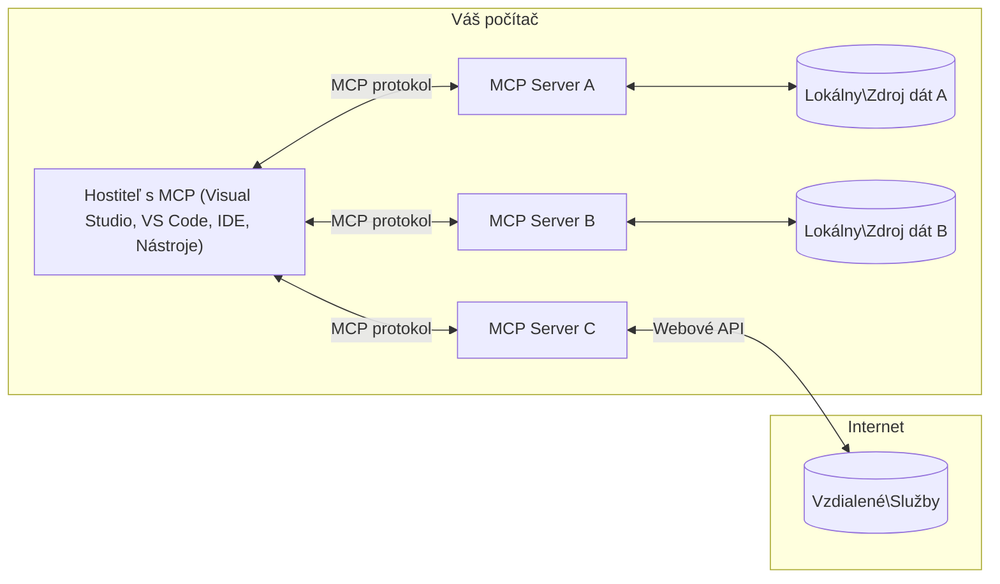

# MCP Core Concepts: Ovládnutie protokolu Model Context pre AI integráciu

[](https://youtu.be/earDzWGtE84)

_(Kliknite na obrázok vyššie pre zobrazenie videa tejto lekcie)_

[Model Context Protocol (MCP)](https://github.com/modelcontextprotocol) je silný, štandardizovaný rámec, ktorý optimalizuje komunikáciu medzi veľkými jazykovými modelmi (LLM) a externými nástrojmi, aplikáciami a zdrojmi dát. 
Tento návod vás prevedie základnými konceptmi MCP. Naučíte sa o jeho architektúre klient-server, podstatných komponentoch, mechanizmoch komunikácie a najlepších postupoch implementácie.

- **Explicitný súhlas používateľa**: Všetky prístupy k dátam a operácie vyžadujú explicitné schválenie používateľa pred vykonaním. Používatelia musia jasne rozumieť, aké dáta budú sprístupnené a aké akcie budú vykonané, s detailnou kontrolou nad oprávneniami a autorizáciou.

- **Ochrana súkromia dát**: Dáta používateľa sú sprístupnené len s explicitným súhlasom a musia byť chránené robustnými kontrolami prístupu počas celého životného cyklu interakcie. Implementácie musí zabrániť neoprávnenej transmisií dát a udržiavať prísne hranice ochrany súkromia.

- **Bezpečnosť spustenia nástrojov**: Každé vyvolanie nástroja vyžaduje explicitný súhlas používateľa s jasným pochopením funkčnosti nástroja, parametrov a potenciálneho dopadu. Robustné bezpečnostné hranice musia zabrániť neúmyselnému, nebezpečnému alebo škodlivému spusteniu nástrojov.

- **Bezpečnosť vrstvy prenosu**: Všetky komunikačné kanály by mali používať vhodné metódy šifrovania a autentifikácie. Vzdialené pripojenia by mali implementovať bezpečné transportné protokoly a správne spravovanie poverení.

#### Pokyny pre implementáciu:

- **Správa oprávnení**: Implementujte jemnozrnné systémy oprávnení, ktoré umožňujú používateľom kontrolovať, ktoré servery, nástroje a zdroje sú prístupné
- **Autentifikácia a autorizácia**: Používajte bezpečné metódy autentifikácie (OAuth, API kľúče) s riadnym spravovaním tokenov a ich expiráciou  
- **Validácia vstupov**: Validujte všetky parametre a vstupné dáta podľa definovaných schém, aby ste predišli injekčným útokom
- **Auditné logovanie**: Zaznamenávajte komplexné logy všetkých operácií pre bezpečnostný monitoring a súlad s predpismi

## Prehľad

Táto lekcia skúma základnú architektúru a komponenty, ktoré tvoria ekosystém Model Context Protocol (MCP). Dozviete sa o architektúre klient-server, hlavných komponentoch a mechanizmoch komunikácie, ktoré poháňajú interakcie MCP.

## Kľúčové vzdelávacie ciele

Na konci tejto lekcie budete:

- Rozumieť architektúre klient-server MCP.
- Identifikovať roly a zodpovednosti Hostov, Klientov a Serverov.
- Analyzovať základné funkcie, ktoré robia MCP flexibilnou integračnou vrstvou.
- Naučiť sa, ako informácie prúdia v ekosystéme MCP.
- Získať praktické poznatky cez príklady kódu v .NET, Java, Python a JavaScript.

## Architektúra MCP: Hlbší pohľad

Ekosystém MCP je postavený na modeli klient-server. Táto modulárna štruktúra umožňuje AI aplikáciám efektívne komunikovať s nástrojmi, databázami, API a kontextuálnymi zdrojmi. Rozoberme túto architektúru na jej základné komponenty.

V jadre MCP nasleduje architektúru klient-server, kde hostiteľská aplikácia sa môže pripojiť k viacerým serverom:


- **MCP Hostia**: Programy ako VSCode, Claude Desktop, IDE alebo AI nástroje, ktoré chcú pristupovať k dátam cez MCP
- **MCP Klienti**: Protokoloví klienti, ktorí udržiavajú 1:1 spojenia so servermi
- **MCP Servery**: Ľahké programy, ktoré vystavujú špecifické funkcie cez štandardizovaný Model Context Protocol
- **Lokálne zdroje dát**: Súbory vášho počítača, databázy a služby, ku ktorým majú MCP servery bezpečný prístup
- **Vzdialené služby**: Externé systémy dostupné cez internet, ku ktorým MCP servery môžu pristupovať prostredníctvom API.

Protokol MCP je vyvíjajúci sa štandard používajúci dátumové verzovanie (formát RRRR-MM-DD). Aktuálna verzia protokolu je **2025-11-25**. Najnovšie aktualizácie môžete vidieť v [špecifikácii protokolu](https://modelcontextprotocol.io/specification/2025-11-25/)

### 1. Hostia

V Model Context Protocol (MCP) sú **Hostia** AI aplikácie, ktoré slúžia ako primárne rozhranie, cez ktoré používatelia komunikujú s protokolom. Hostia koordinujú a spravujú spojenia k viacerým MCP serverom vytváraním dedikovaných MCP klientov pre každé spojenie so serverom. Príklady Hostí zahŕňajú:

- **AI aplikácie**: Claude Desktop, Visual Studio Code, Claude Code
- **Vývojové prostredia**: IDE a editory kódu s MCP integráciou  
- **Vlastné aplikácie**: Účelovo vytvorené AI agenti a nástroje

**Hostia** sú aplikácie, ktoré koordinujú interakcie s AI modelmi. Oni:

- **Orchestruju AI modely**: Vykonávajú alebo interagujú s LLM, aby generovali odpovede a riadili AI pracovné postupy
- **Spravujú klientské spojenia**: Vytvárajú a udržiavajú jedného MCP klienta na spojenie s MCP serverom
- **Kontrolujú používateľské rozhranie**: Riadia tok konverzácie, interakcie používateľov a prezentáciu odpovedí  
- **Uplatňujú bezpečnosť**: Riadia oprávnenia, bezpečnostné obmedzenia a autentifikáciu
- **Spravujú súhlas používateľa**: Riadi schvaľovanie používateľa pre zdieľanie dát a spúšťanie nástrojov

### 2. Klienti

**Klienti** sú základné komponenty, ktoré udržiavajú vyhradené jedno-na-jedno spojenia medzi Hostmi a MCP servermi. Každý MCP klient je vytvorený Hostom na pripojenie k špecifickému MCP serveru, čím zabezpečuje organizované a bezpečné komunikačné kanály. Viacerí klienti umožňujú hostom simultánne pripojenie k viacerým serverom.

**Klienti** sú konektorové komponenty v hostiteľskej aplikácii. Oni:

- **Komunikácia protokolom**: Posielajú JSON-RPC 2.0 požiadavky na servery s promptmi a inštrukciami
- **Vyjednávanie schopností**: Vyjednávajú podporované funkcie a verzie protokolu so servermi počas inicializácie
- **Spúšťanie nástrojov**: Spravujú požiadavky na vykonávanie nástrojov zo strany modelov a spracovávajú odpovede
- **Aktualizácie v reálnom čase**: Riadia notifikácie a aktualizácie od serverov
- **Spracovanie odpovedí**: Spracovávajú a formátujú odpovede serverov pre zobrazenie používateľom

### 3. Servery

**Servery** sú programy, ktoré poskytujú kontext, nástroje a schopnosti MCP klientom. Môžu bežať lokálne (na rovnakom stroji ako Hostiteľ) alebo vzdialene (na externých platformách) a sú zodpovedné za spracovanie požiadaviek klientov a poskytovanie štruktúrovaných odpovedí. Servery vystavujú špecifickú funkcionalitu cez štandardizovaný Model Context Protocol.

**Servery** sú služby, ktoré poskytujú kontext a schopnosti. Oni:

- **Registrácia funkcií**: Zaregistrujú a sprístupnia dostupné primitíva (zdroje, prompty, nástroje) klientom
- **Spracovanie požiadaviek**: Prijímajú a vykonávajú volania nástrojov, požiadavky na zdroje a prompty od klientov
- **Poskytovanie kontextu**: Dodávajú kontextuálne informácie a dáta na obohatenie odpovedí modelov
- **Správa stavu**: Udržiavajú stav relácie a spracovávajú stavové interakcie podľa potreby
- **Notifikácie v reálnom čase**: Posielajú notifikácie o zmenách schopností a aktualizáciách pripojeným klientom

Servery môže vyvíjať ktokoľvek aby rozšíril schopnosti modelov špecializovanou funkcionalitou, a podporujú ako lokálne, tak vzdialené nasadenie.

### 4. Serverové primitíva

Servery v Model Context Protocol (MCP) poskytujú tri základné **primitíva**, ktoré definujú fundamentálne stavebné kamene pre bohaté interakcie medzi klientmi, hosťami a jazykovými modelmi. Tieto primitíva špecifikujú typy kontextuálnych informácií a akcií dostupných cez protokol.

MCP servery môžu sprístupniť ľubovoľnú kombináciu týchto troch základných primitív:

#### Zdroje

**Zdroje** sú dátové zdroje, ktoré poskytujú kontextuálne informácie AI aplikáciám. Reprezentujú statický alebo dynamický obsah, ktorý môže zlepšiť porozumenie modelu a rozhodovanie:

- **Kontextové údaje**: Štruktúrované informácie a kontext pre spotrebu AI modelom
- **Základne znalostí**: Repozitáre dokumentov, články, manuály a vedecké práce
- **Lokálne zdroje dát**: Súbory, databázy a lokálne systémové informácie  
- **Externé dáta**: API odpovede, webové služby a dáta vzdialených systémov
- **Dynamický obsah**: Dáta v reálnom čase, ktoré sa aktualizujú podľa vonkajších podmienok

Zdroje sú identifikované URI a podporujú objavovanie pomocou metód `resources/list` a získavanie pomocou `resources/read`:

```text
file://documents/project-spec.md
database://production/users/schema
api://weather/current
```

#### Prompty

**Prompty** sú znovupoužiteľné šablóny, ktoré pomáhajú štruktúrovať interakcie s jazykovými modelmi. Poskytujú štandardizované vzory interakcií a šablónové pracovné postupy:

- **Šablónové interakcie**: Predštruktúrované správy a začiatky konverzácií
- **Šablóny pracovných postupov**: Štandardizované sekvencie pre bežné úlohy a interakcie
- **Príklady few-shot**: Šablóny založené na príkladoch pre inštrukcie modelu
- **Systémové prompty**: Základné prompty, ktoré definujú správanie a kontext modelu
- **Dynamické šablóny**: Parameterové prompty, ktoré sa prispôsobujú špecifickým kontextom

Prompty podporujú substitúciu premenných a môžu byť objavené cez `prompts/list` a získané cez `prompts/get`:

```markdown
Generate a {{task_type}} for {{product}} targeting {{audience}} with the following requirements: {{requirements}}
```

#### Nástroje

**Nástroje** sú vykonateľné funkcie, ktoré môže AI model vyvolať na vykonanie konkrétnych akcií. Sú „slovesami“ ekosystému MCP, ktoré umožňujú modelom interagovať s externými systémami:

- **Vykonateľné funkcie**: Diskrétne operácie, ktoré modely môžu vyvolať so špecifickými parametrami
- **Integrácia externých systémov**: Volania API, dotazy do databázy, operácie so súbormi, výpočty
- **Jedinečná identita**: Každý nástroj má svoj výnimočný názov, popis a schému parametrov
- **Štruktúrovaný vstup/výstup**: Nástroje prijímajú validované parametre a vracajú štruktúrované, typované odpovede
- **Schopnosti akcií**: Umožňujú modelom vykonávať akcie v reálnom svete a získavať aktuálne dáta

Nástroje sú definované pomocou JSON Schema pre validáciu parametrov a objavujú sa cez `tools/list` a vykonávajú sa cez `tools/call`. Nástroje môžu tiež obsahovať **ikony** ako dodatočné metaúdaje pre lepšiu prezentáciu v UI.

**Anotácie nástrojov**: Nástroje podporujú behaviorálne anotácie (napr. `readOnlyHint`, `destructiveHint`), ktoré popisujú, či je nástroj len na čítanie alebo deštruktívny, čím pomáhajú klientom robiť informované rozhodnutia o vykonaní nástroja.

Príklad definície nástroja:

```typescript
server.tool(
  "search_products", 
  {
    query: z.string().describe("Search query for products"),
    category: z.string().optional().describe("Product category filter"),
    max_results: z.number().default(10).describe("Maximum results to return")
  }, 
  async (params) => {
    // Vykonajte vyhľadávanie a vráťte strukturované výsledky
    return await productService.search(params);
  }
);
```

## Klientove primitíva

V Model Context Protocol (MCP) môžu **klienti** sprístupniť primitíva, ktoré umožňujú serverom požadovať ďalšie schopnosti od hostiteľskej aplikácie. Tieto primitíva na strane klienta umožňujú bohatšie, viac interaktívne implementácie serverov, ktoré môžu pristupovať ku schopnostiam AI modelov a interakciám používateľa.

### Sampling

**Sampling** umožňuje serverom požiadať o doplnenie modelu jazyka z AI aplikácie klienta. Toto primitívum umožňuje serverom pristupovať k schopnostiam LLM bez vlastných závislostí na modeli:

- **Nezávislý prístup k modelu**: Servery môžu žiadať doplnenia bez nutnosti zahrňovať LLM SDK alebo spravovať prístup k modelu
- **Serverom iniciovaná AI**: Umožňuje serverom autonómne generovať obsah pomocou AI modelu klienta
- **Rekurzívne LLM interakcie**: Podporuje zložité scenáre, kde servery potrebujú AI asistenciu na spracovanie
- **Dynamická tvorba obsahu**: Umožňuje serverom vytvárať kontextuálne odpovede pomocou modelu hostiteľa
- **Podpora volania nástrojov**: Servery môžu zahrnúť parametre `tools` a `toolChoice` na umožnenie vyvolania nástrojov modelom klienta počas sampling

Sampling sa spúšťa cez metódu `sampling/complete`, kde servery posielajú požiadavky na doplnenie klientom.

### Roots

**Roots** poskytujú štandardizovaný spôsob, ako môžu klienti sprístupniť hranice súborového systému serverom, čím pomáhajú serverom pochopiť, ku ktorým adresárom a súborom majú prístup:

- **Hranice súborového systému**: Definujú hranice, kde môžu servery v súborovom systéme pôsobiť
- **Kontrola prístupu**: Pomáhajú serverom pochopiť, ku ktorým adresárom a súborom majú oprávnenie prístupu
- **Dynamické aktualizácie**: Klienti môžu notifikovať server o zmene zoznamu roots
- **Identifikácia na základe URI**: Roots používajú URI `file://` na identifikáciu prístupných adresárov a súborov

Roots sa objavujú cez metódu `roots/list` a klient odosiela notifikácie `notifications/roots/list_changed` pri zmene rootov.

### Elicitation

**Elicitation** umožňuje serverom žiadať ďalšie informácie alebo potvrdenia od používateľov cez rozhranie klienta:

- **Požiadavky na vstup používateľa**: Servery môžu žiadať ďalšie informácie, keď sú potrebné na vykonanie nástroja
- **Potvrdzovacie dialógy**: Žiadajú súhlas používateľa pre citlivé alebo zásadné operácie
- **Interaktívne pracovné postupy**: Umožňujú serverom vytvárať krok po kroku interakcie s používateľom
- **Dynamické zberanie parametrov**: Zhromažďujú chýbajúce alebo voliteľné parametre počas spúšťania nástrojov

Požiadavky elicitation sa vykonávajú pomocou metódy `elicitation/request` na zber vstupu používateľa cez rozhranie klienta.

**Režim URL elicitation**: Servery môžu tiež žiadať URL-bázované interakcie s používateľom, umožňujúc serverom nasmerovať používateľov na externé webové stránky pre autentifikáciu, potvrdenie alebo zadanie dát.

### Logging

**Logging** umožňuje serverom posielať štruktúrované logovacie správy klientom na účely ladenia, monitorovania a prevádzkovej transparentnosti:

- **Podpora ladenia**: Umožňuje serverom poskytovať detailné logy vykonávania pre riešenie problémov
- **Prevádzkové monitorovanie**: Posiela stavové aktualizácie a výkonnostné metriky klientom
- **Hlásenie chýb**: Poskytuje detailný kontext chýb a diagnostické informácie
- **Auditné stopy**: Vytvára komplexné záznamy o operáciách a rozhodnutiach servera

Logovacie správy sú posielané klientom na zabezpečenie transparentnosti operácií servera a uľahčenie ladenia.

## Tok informácií v MCP

Model Context Protocol (MCP) definuje štruktúrovaný tok informácií medzi hostiteľmi, klientmi, servermi a modelmi. Pochopenie tohto toku pomáha vyjasniť, ako sa spracúvajú požiadavky používateľov a ako sú externé nástroje a dáta integrované do odpovedí modelu.

- **Hostiteľ inicializuje pripojenie**  
  Hostiteľská aplikácia (napr. IDE alebo chatové rozhranie) nadväzuje spojenie s MCP serverom, typicky cez STDIO, WebSocket alebo iný podporovaný transport.

- **Vyjednávanie schopností**  
  Klient (vložený v hostiteľovi) a server si vymieňajú informácie o podporovaných funkciách, nástrojoch, zdrojoch a verziách protokolu. To zabezpečuje, že obe strany chápu, aké schopnosti sú dostupné počas relácie.

- **Používateľská požiadavka**  
  Používateľ interaguje s hostiteľom (napr. zadá prompt alebo príkaz). Hostiteľ zozbiera tento vstup a odovzdá ho klientovi na spracovanie.

- **Použitie zdroja alebo nástroja**  
  - Klient môže požiadať server o dodatočný kontext alebo zdroje (napr. súbory, databázové záznamy alebo články zo základne znalostí), aby obohatil porozumenie modelu.  
  - Ak model určí, že je potrebné použiť nástroj (napr. na získanie dát, vykonanie výpočtu alebo zavolanie API), klient pošle serveru požiadavku na vyvolanie nástroja, špecifikujúc jeho názov a parametre.

- **Serverové vykonanie**  

Server prijme požiadavku na zdroj alebo nástroj, vykoná potrebné operácie (napríklad spustenie funkcie, dotazovanie do databázy alebo načítanie súboru) a výsledky vráti klientovi v štruktúrovanom formáte.

- **Generovanie odpovede**  
  Klient integruje odpovede servera (údaje o zdroji, výstupy nástrojov a pod.) do prebiehajúcej interakcie s modelom. Model používa tieto informácie na vytvorenie komplexnej a kontextovo relevantnej odpovede.

- **Prezentácia výsledku**  
  Hostiteľ prijme finálny výstup od klienta a prezentuje ho používateľovi, často vrátane textu vygenerovaného modelom aj výsledkov z vykonaných nástrojov alebo vyhľadávania zdrojov.

Tento tok umožňuje MCP podporovať pokročilé, interaktívne a kontextuálne uvedomelé AI aplikácie tým, že bezproblémovo prepája modely s externými nástrojmi a dátovými zdrojmi.

## Architektúra a vrstvy protokolu

MCP pozostáva z dvoch samostatných architektonických vrstiev, ktoré spolupracujú na poskytovaní kompletného komunikačného rámca:

### Dátová vrstva

**Dátová vrstva** implementuje jadro protokolu MCP založeného na **JSON-RPC 2.0**. Táto vrstva definuje štruktúru správ, sémantiku a vzory interakcií:

#### Základné komponenty:

- **Protokol JSON-RPC 2.0**: Celá komunikácia používa štandardizovaný formát správ JSON-RPC 2.0 pre volania metód, odpovede a notifikácie
- **Správa životného cyklu**: Rieši inicializáciu pripojenia, dojednávanie schopností a ukončenie relácie medzi klientmi a servermi
- **Serverové primitíva**: Umožňujú serverom poskytovať základné funkcie cez nástroje, zdroje a promptové šablóny
- **Klientské primitíva**: Umožňujú serverom žiadať vzorkovanie z LLM, vyžiadať vstup používateľa a posielať logovacie správy
- **Notifikácie v reálnom čase**: Podporujú asynchrónne notifikácie pre dynamické aktualizácie bez potreby polling-u

#### Kľúčové vlastnosti:

- **Dojednávanie verzie protokolu**: Používa dátumovú verziu (RRRR-MM-DD) pre zabezpečenie kompatibility
- **Objavovanie schopností**: Klienti a servery si počas inicializácie vymieňajú informácie o podporovaných funkciách
- **Stavové relácie**: Udržiava stav pripojenia cez viaceré interakcie pre kontinuitu kontextu

### Transportná vrstva

**Transportná vrstva** spravuje komunikačné kanály, rámcovanie správ a autentifikáciu medzi účastníkmi MCP:

#### Podporované transportné mechanizmy:

1. **STDIO Transport**:
   - Používa štandardné vstupné/výstupné prúdy pre priamu komunikáciu procesov
   - Optimálne pre lokálne procesy na rovnakom zariadení bez sieťových režijných nákladov
   - Často používané pre lokálne implementácie MCP serverov

2. **Streamovateľný HTTP Transport**:
   - Používa HTTP POST pre správy klient → server  
   - Voliteľné Server-Sent Events (SSE) pre streamovanie server → klient
   - Umožňuje vzdialenú komunikáciu cez siete
   - Podporuje štandardnú HTTP autentifikáciu (bearer tokeny, API kľúče, vlastné hlavičky)
   - MCP odporúča OAuth pre bezpečnú autentifikáciu založenú na tokenoch

#### Abstrakcia transportu:

Transportná vrstva abstrahuje detaily komunikácie od dátovej vrstvy, vďaka čomu je rovnaký formát správ JSON-RPC 2.0 použiteľný pre všetky transportné mechanizmy. Táto abstrakcia umožňuje aplikáciám plynulo prepínať medzi lokálnymi a vzdialenými servermi.

### Bezpečnostné úvahy

Implementácie MCP musia dodržiavať niekoľko kritických bezpečnostných princípov, aby zaistili bezpečné, dôveryhodné a zabezpečené interakcie vo všetkých operáciách protokolu:

- **Súhlas a kontrola používateľa**: Používatelia musia pred sprístupnením akýchkoľvek dát alebo vykonaním operácií vyjadriť výslovný súhlas. Mali by mať jasnú kontrolu nad tým, ktoré dáta sa zdieľajú a ktoré akcie sú autorizované, pričom rozhrania by mali umožniť prehľadné preskúmanie a schválenie činností.

- **Ochrana súkromia dát**: Dáta používateľa by mali byť sprístupnené len so súhlasom a chránené vhodnými prístupovými kontrolami. Implementácie MCP musia zabrániť neoprávnenému prenosu údajov a zabezpečiť súkromie počas celej interakcie.

- **Bezpečnosť nástrojov**: Pred vyvolaním akéhokoľvek nástroja je potrebný výslovný súhlas používateľa. Používatelia by mali mať jasné informácie o funkčnosti a bezpečnostné hranice nástrojov musia byť dôsledne vymedzené, aby sa predišlo neúmyselnej alebo nebezpečnej exekúcii.

Dodržiavaním týchto bezpečnostných princípov MCP zabezpečuje dôveru používateľov, ochranu súkromia a bezpečnosť naprieč všetkými interakciami protokolu, pričom umožňuje silné integrácie AI.

## Ukážky kódu: základné komponenty

Nižšie sú uvedené príklady kódu vo viacerých populárnych programovacích jazykoch, ktoré demonštrujú implementáciu kľúčových komponentov MCP servera a nástrojov.

### Príklad v .NET: Vytvorenie jednoduchého MCP servera s nástrojmi

Praktický príklad .NET kódu ukazuje, ako implementovať jednoduchý MCP server so zákazníckymi nástrojmi. Tento príklad ukazuje definovanie a registráciu nástrojov, spracovanie požiadaviek a pripojenie servera pomocou Model Context Protocol.

```csharp
using System;
using System.Threading.Tasks;
using ModelContextProtocol.Server;
using ModelContextProtocol.Server.Transport;
using ModelContextProtocol.Server.Tools;

public class WeatherServer
{
    public static async Task Main(string[] args)
    {
        // Create an MCP server
        var server = new McpServer(
            name: "Weather MCP Server",
            version: "1.0.0"
        );
        
        // Register our custom weather tool
        server.AddTool<string, WeatherData>("weatherTool", 
            description: "Gets current weather for a location",
            execute: async (location) => {
                // Call weather API (simplified)
                var weatherData = await GetWeatherDataAsync(location);
                return weatherData;
            });
        
        // Connect the server using stdio transport
        var transport = new StdioServerTransport();
        await server.ConnectAsync(transport);
        
        Console.WriteLine("Weather MCP Server started");
        
        // Keep the server running until process is terminated
        await Task.Delay(-1);
    }
    
    private static async Task<WeatherData> GetWeatherDataAsync(string location)
    {
        // This would normally call a weather API
        // Simplified for demonstration
        await Task.Delay(100); // Simulate API call
        return new WeatherData { 
            Temperature = 72.5,
            Conditions = "Sunny",
            Location = location
        };
    }
}

public class WeatherData
{
    public double Temperature { get; set; }
    public string Conditions { get; set; }
    public string Location { get; set; }
}
```

### Príklad v Jave: Komponenty MCP servera

Tento príklad ukazuje rovnaký MCP server a registráciu nástrojov ako vyššie v .NET, ale implementovaný v Jave.

```java
import io.modelcontextprotocol.server.McpServer;
import io.modelcontextprotocol.server.McpToolDefinition;
import io.modelcontextprotocol.server.transport.StdioServerTransport;
import io.modelcontextprotocol.server.tool.ToolExecutionContext;
import io.modelcontextprotocol.server.tool.ToolResponse;

public class WeatherMcpServer {
    public static void main(String[] args) throws Exception {
        // Vytvorte MCP server
        McpServer server = McpServer.builder()
            .name("Weather MCP Server")
            .version("1.0.0")
            .build();
            
        // Zaregistrujte nástroj pre počasie
        server.registerTool(McpToolDefinition.builder("weatherTool")
            .description("Gets current weather for a location")
            .parameter("location", String.class)
            .execute((ToolExecutionContext ctx) -> {
                String location = ctx.getParameter("location", String.class);
                
                // Získajte údaje o počasí (zjednodušené)
                WeatherData data = getWeatherData(location);
                
                // Vráťte naformátovanú odpoveď
                return ToolResponse.content(
                    String.format("Temperature: %.1f°F, Conditions: %s, Location: %s", 
                    data.getTemperature(), 
                    data.getConditions(), 
                    data.getLocation())
                );
            })
            .build());
        
        // Pripojte server pomocou stdio transportu
        try (StdioServerTransport transport = new StdioServerTransport()) {
            server.connect(transport);
            System.out.println("Weather MCP Server started");
            // Udržiavajte server v prevádzke, kým nie je proces ukončený
            Thread.currentThread().join();
        }
    }
    
    private static WeatherData getWeatherData(String location) {
        // Implementácia by volala API počasia
        // Zjednodušené pre ukážkové účely
        return new WeatherData(72.5, "Sunny", location);
    }
}

class WeatherData {
    private double temperature;
    private String conditions;
    private String location;
    
    public WeatherData(double temperature, String conditions, String location) {
        this.temperature = temperature;
        this.conditions = conditions;
        this.location = location;
    }
    
    public double getTemperature() {
        return temperature;
    }
    
    public String getConditions() {
        return conditions;
    }
    
    public String getLocation() {
        return location;
    }
}
```

### Príklad v Pythone: Budovanie MCP servera

Tento príklad používa fastmcp, preto si ho najprv nainštalujte:

```python
pip install fastmcp
```
Ukážka kódu:

```python
#!/usr/bin/env python3
import asyncio
from fastmcp import FastMCP
from fastmcp.transports.stdio import serve_stdio

# Vytvoriť server FastMCP
mcp = FastMCP(
    name="Weather MCP Server",
    version="1.0.0"
)

@mcp.tool()
def get_weather(location: str) -> dict:
    """Gets current weather for a location."""
    return {
        "temperature": 72.5,
        "conditions": "Sunny",
        "location": location
    }

# Alternatívny prístup pomocou triedy
class WeatherTools:
    @mcp.tool()
    def forecast(self, location: str, days: int = 1) -> dict:
        """Gets weather forecast for a location for the specified number of days."""
        return {
            "location": location,
            "forecast": [
                {"day": i+1, "temperature": 70 + i, "conditions": "Partly Cloudy"}
                for i in range(days)
            ]
        }

# Zaregistrovať nástroje triedy
weather_tools = WeatherTools()

# Spustiť server
if __name__ == "__main__":
    asyncio.run(serve_stdio(mcp))
```

### Príklad v JavaScripte: Vytvorenie MCP servera

Tento príklad ukazuje vytvorenie MCP servera v JavaScripte a registráciu dvoch nástrojov súvisiacich s počasím.

```javascript
// Použitie oficiálneho Model Context Protocol SDK
import { McpServer } from "@modelcontextprotocol/sdk/server/mcp.js";
import { StdioServerTransport } from "@modelcontextprotocol/sdk/server/stdio.js";
import { z } from "zod"; // Na overenie parametrov

// Vytvoriť MCP server
const server = new McpServer({
  name: "Weather MCP Server",
  version: "1.0.0"
});

// Definovať nástroj počasia
server.tool(
  "weatherTool",
  {
    location: z.string().describe("The location to get weather for")
  },
  async ({ location }) => {
    // Normálne by to volalo API počasia
    // Zjednodušené na demonštráciu
    const weatherData = await getWeatherData(location);
    
    return {
      content: [
        { 
          type: "text", 
          text: `Temperature: ${weatherData.temperature}°F, Conditions: ${weatherData.conditions}, Location: ${weatherData.location}` 
        }
      ]
    };
  }
);

// Definovať nástroj predpovede
server.tool(
  "forecastTool",
  {
    location: z.string(),
    days: z.number().default(3).describe("Number of days for forecast")
  },
  async ({ location, days }) => {
    // Normálne by to volalo API počasia
    // Zjednodušené na demonštráciu
    const forecast = await getForecastData(location, days);
    
    return {
      content: [
        { 
          type: "text", 
          text: `${days}-day forecast for ${location}: ${JSON.stringify(forecast)}` 
        }
      ]
    };
  }
);

// Pomocné funkcie
async function getWeatherData(location) {
  // Simulovať volanie API
  return {
    temperature: 72.5,
    conditions: "Sunny",
    location: location
  };
}

async function getForecastData(location, days) {
  // Simulovať volanie API
  return Array.from({ length: days }, (_, i) => ({
    day: i + 1,
    temperature: 70 + Math.floor(Math.random() * 10),
    conditions: i % 2 === 0 ? "Sunny" : "Partly Cloudy"
  }));
}

// Pripojiť server pomocou stdio transportu
const transport = new StdioServerTransport();
server.connect(transport).catch(console.error);

console.log("Weather MCP Server started");
```

Tento JavaScript príklad ukazuje, ako vytvoriť MCP klienta, ktorý sa pripája k serveru, posiela prompt a spracováva odpoveď vrátane vyvolaní nástrojov.

## Bezpečnosť a autorizácia

MCP obsahuje niekoľko vstavaných konceptov a mechanizmov na správu bezpečnosti a autorizácie počas celého protokolu:

1. **Kontrola oprávnení nástrojov**:  
   Klienti môžu špecifikovať, ktoré nástroje môže model počas relácie používať. Zabezpečuje sa tak prístup len k explicitne povoleným nástrojom, čím sa znižuje riziko neúmyselných alebo nebezpečných operácií. Oprávnenia možno nastavovať dynamicky podľa preferencií používateľa, organizačných politík alebo kontextu interakcie.

2. **Autentifikácia**:  
  Servery môžu vyžadovať autentifikáciu pred sprístupnením nástrojov, zdrojov alebo citlivých operácií. Môže ísť o API kľúče, OAuth tokeny alebo iné overovacie mechanizmy. Správna autentifikácia zaručuje, že len dôveryhodní klienti a používatelia môžu volať serverové funkcie.

3. **Validácia**:  
  Pre všetky volania nástrojov sa vynucuje validácia parametrov. Každý nástroj definuje očakávané typy, formáty a obmedzenia svojich parametrov a server overuje prichádzajúce požiadavky podľa toho. Zabráni sa tak tomu, aby nevalidné alebo škodlivé vstupy dosiahli implementácie nástrojov a pomáha to zachovať integritu operácií.

4. **Obmedzenie frekvencie (rate limiting)**:  
  Na predchádzanie zneužitia a zaistenie férového využitia serverových zdrojov môžu servery MCP implementovať obmedzenia volaní nástrojov a prístupu k zdrojom. Obmedzenia môžu byť aplikované na používateľa, reláciu alebo globálne, čím sa chráni proti útokom typu denial-of-service alebo nadmernému využívaniu zdrojov.

Kombináciou týchto mechanizmov MCP poskytuje bezpečný základ na integráciu jazykových modelov s externými nástrojmi a dátovými zdrojmi, pričom umožňuje používateľom a vývojárom jemnokontrolovaný prístup a využitie.

## Správy protokolu a tok komunikácie

MCP komunikácia používa štruktúrované správy **JSON-RPC 2.0** na zabezpečenie jasných a spoľahlivých interakcií medzi hostiteľmi, klientmi a servermi. Protokol definuje konkrétne vzory správ pre rôzne typy operácií:

### Základné typy správ:

#### **Inicializačné správy**
- **`initialize` Žiadosť**: Zriaďuje pripojenie a dojednáva verziu protokolu a schopnosti
- **`initialize` Odpoveď**: Potvrdzuje podporované funkcie a informácie o serveri  
- **`notifications/initialized`**: Signalizuje dokončenie inicializácie a pripravenosť relácie

#### **Objavovacie správy**
- **`tools/list` Žiadosť**: Vyhľadáva dostupné nástroje na serveri
- **`resources/list` Žiadosť**: Zoznam dostupných zdrojov (dátových zdrojov)
- **`prompts/list` Žiadosť**: Načíta dostupné promptové šablóny

#### **Výkonné správy**  
- **`tools/call` Žiadosť**: Spustí konkrétny nástroj s dodanými parametrami
- **`resources/read` Žiadosť**: Načíta obsah z konkrétneho zdroja
- **`prompts/get` Žiadosť**: Získa promptovú šablónu s voliteľnými parametrami

#### **Správy na strane klienta**
- **`sampling/complete` Žiadosť**: Server požiada klienta o dokončenie LLM
- **`elicitation/request`**: Server vyžiada používateľský vstup cez rozhranie klienta
- **Logovacie správy**: Server posiela štruktúrované logy klientovi

#### **Notifikačné správy**
- **`notifications/tools/list_changed`**: Server informuje klienta o zmene zoznamu nástrojov
- **`notifications/resources/list_changed`**: Server informuje klienta o zmene zoznamu zdrojov  
- **`notifications/prompts/list_changed`**: Server informuje klienta o zmene promptov

### Štruktúra správ:

Všetky správy MCP používajú formát JSON-RPC 2.0 s:
- **Žiadosťami**: Obsahujú `id`, `method` a voliteľné `params`
- **Odpoveďami**: Obsahujú `id` a buď `result`, alebo `error`  
- **Notifikáciami**: Obsahujú `method` a voliteľné `params` (nemajú `id` a nevyžadujú odpoveď)

Táto štruktúrovaná komunikácia zabezpečuje spoľahlivé, sledovateľné a rozšíriteľné interakcie, ktoré podporujú pokročilé scenáre ako aktualizácie v reálnom čase, reťazenie nástrojov a robustné spracovanie chýb.

### Úlohy (experimentálne)

**Úlohy** sú experimentálna funkcia poskytujúca trvácne exekučné obaly umožňujúce odložené získavanie výsledkov a sledovanie stavu MCP požiadaviek:

- **Dlhodobé operácie**: Sledovanie náročných výpočtov, automatizácia pracovných tokov a dávkové spracovanie
- **Odložené výsledky**: Pollovanie stavu úloh a vyzdvihnutie výsledkov po dokončení operácií
- **Sledovanie stavu**: Monitorovanie pokroku úlohy cez definované životné cykly
- **Viacstupňové operácie**: Podpora komplexných pracovných tokov prekračujúcich viacero interakcií

Úlohy obalujú štandardné MCP žiadosti pre umožnenie asynchrónnych vzorov vykonávania operácií, ktoré nie je možné dokončiť okamžite.

## Kľúčové poznatky

- **Architektúra**: MCP používa klient-server architektúru, kde hostitelia spravujú viaceré pripojenia klientov k serverom
- **Účastníci**: Ekosystém zahŕňa hostiteľov (AI aplikácie), klientov (protokolové konektory) a servery (poskytovatelia schopností)
- **Transportné mechanizmy**: Komunikácia podporuje STDIO (lokálny) a streamovateľný HTTP s voliteľným SSE (vzdialený)
- **Jadrové primitíva**: Servery poskytujú nástroje (vykonávateľné funkcie), zdroje (dátové zdroje) a promptové šablóny
- **Klientské primitíva**: Servery môžu žiadať vzorkovanie (LLM doplnenia s podporou volania nástrojov), vyžiadanie vstupu (vrátane URL režimu), koreňové adresáre (hranice súborového systému) a logovanie od klientov
- **Experimentálne vlastnosti**: Úlohy poskytujú trvácne obaly na dlhodobé operácie
- **Základ protokolu**: Postavený na JSON-RPC 2.0 s dátumovou verziou (aktuálna: 2025-11-25)
- **Funkcie v reálnom čase**: Podpora notifikácií pre dynamické aktualizácie a synchronizáciu
- **Bezpečnosť na prvom mieste**: Výslovný súhlas používateľa, ochrana súkromia a zabezpečený transport sú základnými požiadavkami

## Cvičenie

Navrhnite jednoduchý MCP nástroj, ktorý by bol užitočný vo vašej oblasti. Definujte:
1. Ako by sa nástroj volal
2. Aké parametre by prijímal
3. Aký výstup by vracal
4. Ako by model mohol tento nástroj použiť na riešenie problémov používateľa


---

## Čo ďalej

Ďalej: [Kapitola 2: Bezpečnosť](../02-Security/README.md)

---

<!-- CO-OP TRANSLATOR DISCLAIMER START -->
**Upozornenie**:  
Tento dokument bol preložený pomocou AI prekladateľskej služby [Co-op Translator](https://github.com/Azure/co-op-translator). Aj keď sa snažíme o presnosť, prosím, majte na pamäti, že automatické preklady môžu obsahovať chyby alebo nepresnosti. Originálny dokument v jeho pôvodnom jazyku by mal byť považovaný za autoritatívny zdroj. Pre kritické informácie sa odporúča profesionálny ľudský preklad. Nie sme zodpovední za akékoľvek nedorozumenia alebo nesprávne výklady vyplývajúce z používania tohto prekladu.
<!-- CO-OP TRANSLATOR DISCLAIMER END -->