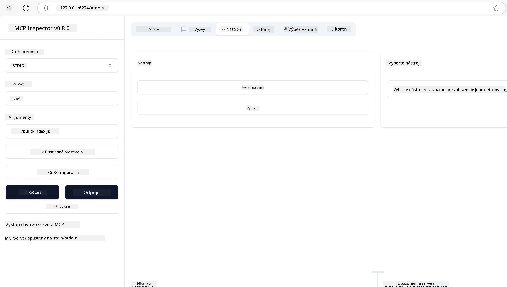
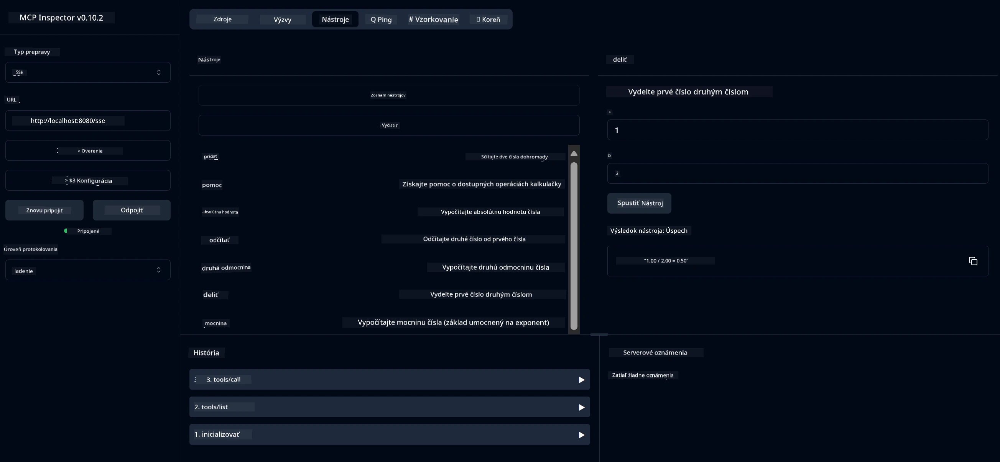
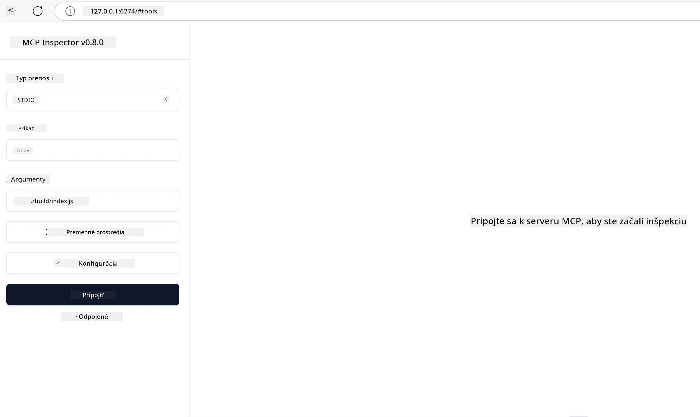
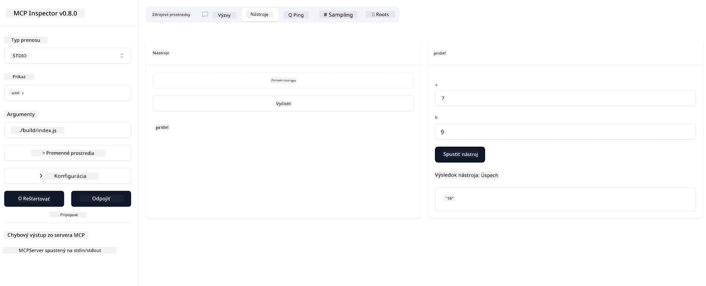

# Začíname s MCP

Vitajte pri vašich prvých krokoch s Model Context Protocol (MCP)! Či už ste v MCP nováčik alebo chcete prehĺbiť svoje znalosti, tento sprievodca vás prevedie základným nastavením a vývojovým procesom. Objavíte, ako MCP umožňuje bezproblémovú integráciu medzi AI modelmi a aplikáciami, a naučíte sa, ako rýchlo pripraviť svoje prostredie na tvorbu a testovanie riešení poháňaných MCP.

> TLDR; Ak vytvárate AI aplikácie, viete, že môžete pridať nástroje a ďalšie zdroje do vášho LLM (large language model), aby bol LLM viac znalý. Ak však tieto nástroje a zdroje umiestnite na server, schopnosti aplikácie a servera môžu využívať akýkoľvek klient s LLM alebo bez neho.

## Prehľad

Táto lekcia poskytuje praktické pokyny na nastavenie MCP prostredí a tvorbu vašich prvých MCP aplikácií. Naučíte sa, ako nastaviť potrebné nástroje a frameworky, vytvoriť základné MCP servery, vytvoriť hostiteľské aplikácie a testovať vaše implementácie.

Model Context Protocol (MCP) je otvorený protokol, ktorý štandardizuje spôsob, akým aplikácie poskytujú kontext LLM. Predstavte si MCP ako USB-C port pre AI aplikácie – poskytuje štandardizovaný spôsob pripojenia AI modelov k rôznym zdrojom dát a nástrojom.

## Ciele učenia

Na konci tejto lekcie budete schopní:

- Nastaviť vývojové prostredia pre MCP v C#, Java, Python, TypeScript a Rust
- Vytvoriť a nasadiť základné MCP servery s vlastnými funkciami (zdroje, výzvy a nástroje)
- Vytvoriť hostiteľské aplikácie, ktoré sa pripájajú k MCP serverom
- Testovať a ladiť implementácie MCP

## Nastavenie vášho MCP prostredia

Predtým, než začnete pracovať s MCP, je dôležité pripraviť si vývojové prostredie a pochopiť základný pracovný tok. Táto sekcia vás prevedie po úvodných krokoch nastavenia, aby ste mali hladký štart s MCP.

### Predpoklady

Predtým, než sa pustíte do vývoja MCP, uistite sa, že máte:

- **Vývojové prostredie**: Pre váš zvolený jazyk (C#, Java, Python, TypeScript alebo Rust)
- **IDE/Editory**: Visual Studio, Visual Studio Code, IntelliJ, Eclipse, PyCharm alebo akýkoľvek moderný kódový editor
- **Správca balíkov**: NuGet, Maven/Gradle, pip, npm/yarn alebo Cargo
- **API kľúče**: Pre akékoľvek AI služby, ktoré plánujete používať vo vašich hostiteľských aplikáciách

## Základná štruktúra MCP servera

MCP server zvyčajne obsahuje:

- **Konfigurácia servera**: Nastavenie portu, autentifikácie a ďalších parametrov
- **Zdroje**: Dáta a kontext sprístupnený LLM
- **Nástroje**: Funkcionalita, ktorú môžu modely vyvolať
- **Výzvy**: Šablóny na generovanie alebo štruktúrovanie textu

Tu je zjednodušený príklad v TypeScript:

```typescript
import { McpServer, ResourceTemplate } from "@modelcontextprotocol/sdk/server/mcp.js";
import { StdioServerTransport } from "@modelcontextprotocol/sdk/server/stdio.js";
import { z } from "zod";

// Vytvorte MCP server
const server = new McpServer({
  name: "Demo",
  version: "1.0.0"
});

// Pridajte nástroj na sčítanie
server.tool("add",
  { a: z.number(), b: z.number() },
  async ({ a, b }) => ({
    content: [{ type: "text", text: String(a + b) }]
  })
);

// Pridajte dynamický zdroj pozdravu
server.resource(
  "file",
  // Parameter 'list' riadi, ako zdroj zobrazuje dostupné súbory. Nastavenie na undefined zakáže zobrazovanie zoznamu pre tento zdroj.
  new ResourceTemplate("file://{path}", { list: undefined }),
  async (uri, { path }) => ({
    contents: [{
      uri: uri.href,
      text: `File, ${path}!`
    }]
  })
);

// Pridajte zdroj súboru, ktorý číta obsah súboru
server.resource(
  "file",
  new ResourceTemplate("file://{path}", { list: undefined }),
  async (uri, { path }) => {
    let text;
    try {
      text = await fs.readFile(path, "utf8");
    } catch (err) {
      text = `Error reading file: ${err.message}`;
    }
    return {
      contents: [{
        uri: uri.href,
        text
      }]
    };
  }
);

server.prompt(
  "review-code",
  { code: z.string() },
  ({ code }) => ({
    messages: [{
      role: "user",
      content: {
        type: "text",
        text: `Please review this code:\n\n${code}`
      }
    }]
  })
);

// Začnite prijímať správy zo stdin a odosielať správy na stdout
const transport = new StdioServerTransport();
await server.connect(transport);
```

V predchádzajúcom kóde sme:

- Importovali potrebné triedy z MCP TypeScript SDK.
- Vytvorili a nakonfigurovali novú inštanciu MCP servera.
- Zaregistrovali vlastný nástroj (`calculator`) s handler funkciou.
- Spustili server, aby počúval prichádzajúce MCP požiadavky.

## Testovanie a ladenie

Predtým, než začnete testovať váš MCP server, je dôležité pochopiť dostupné nástroje a najlepšie postupy pre ladenie. Efektívne testovanie zabezpečí, že server bude fungovať podľa očakávaní a pomôže vám rýchlo identifikovať a vyriešiť problémy. Nasledujúca sekcia popisuje odporúčané prístupy na overenie vašej MCP implementácie.

MCP poskytuje nástroje, ktoré vám pomôžu testovať a ladiť vaše servery:

- **Inspector tool**, toto grafické rozhranie vám umožní pripojiť sa k serveru a testovať vaše nástroje, výzvy a zdroje.
- **curl**, môžete sa tiež pripojiť k serveru pomocou príkazového riadku ako curl alebo iných klientov, ktorí vedia vytvárať a spúšťať HTTP príkazy.

### Použitie MCP Inspector

[MCP Inspector](https://github.com/modelcontextprotocol/inspector) je vizuálny testovací nástroj, ktorý vám pomôže:

1. **Objaviť schopnosti servera**: Automaticky detekovať dostupné zdroje, nástroje a výzvy
2. **Testovať vykonávanie nástrojov**: Vyskúšať rôzne parametre a vidieť odpovede v reálnom čase
3. **Zobraziť metadata servera**: Preskúmať informácie o serveri, schémy a konfigurácie

```bash
# napríklad TypeScript, inštalácia a spustenie MCP Inspector
npx @modelcontextprotocol/inspector node build/index.js
```

Keď spustíte vyššie uvedené príkazy, MCP Inspector spustí lokálne webové rozhranie vo vašom prehliadači. Môžete očakávať, že uvidíte dashboard zobrazujúci vaše registrované MCP servery, ich dostupné nástroje, zdroje a výzvy. Rozhranie vám umožní interaktívne testovať vykonávanie nástrojov, prezerať metadata servera a vidieť odpovede v reálnom čase, čo uľahčuje overovanie a ladenie vašich MCP serverových implementácií.

Tu je screenshot, ako to môže vyzerať:



## Bežné problémy s nastavením a riešenia

| Problém | Možné riešenie |
|---------|----------------|
| Pripojenie odmietnuté | Skontrolujte, či server beží a či je port správny |
| Chyby pri vykonávaní nástroja | Skontrolujte validáciu parametrov a spracovanie chýb |
| Neúspešná autentifikácia | Overte API kľúče a oprávnenia |
| Chyby validácie schémy | Uistite sa, že parametre zodpovedajú definovanej schéme |
| Server sa nespúšťa | Skontrolujte konflikty portov alebo chýbajúce závislosti |
| CORS chyby | Nakonfigurujte správne CORS hlavičky pre požiadavky z iných domén |
| Problémy s autentifikáciou | Overte platnosť tokenu a oprávnenia |

## Lokálny vývoj

Pre lokálny vývoj a testovanie môžete spustiť MCP servery priamo na vašom počítači:

1. **Spustite serverový proces**: Spustite vašu MCP serverovú aplikáciu
2. **Nakonfigurujte sieťovanie**: Uistite sa, že server je dostupný na očakávanom porte
3. **Pripojte klientov**: Použite lokálne URL ako `http://localhost:3000`

```bash
# Príklad: Spustenie TypeScript MCP servera lokálne
npm run start
# Server beží na http://localhost:3000
```

## Vytváranie vášho prvého MCP servera

V predchádzajúcej lekcii sme prebrali [Základné koncepty](/01-CoreConcepts/README.md), teraz je čas tieto znalosti využiť v praxi.

### Čo server dokáže

Predtým, než začneme písať kód, pripomeňme si, čo všetko server dokáže:

MCP server môže napríklad:

- Pristupovať k lokálnym súborom a databázam
- Pripájať sa k vzdialeným API
- Vykonávať výpočty
- Integrovať sa s inými nástrojmi a službami
- Poskytovať používateľské rozhranie pre interakciu

Skvelé, keď už vieme, čo všetko môžeme robiť, poďme začať kódovať.

## Cvičenie: Vytvorenie servera

Na vytvorenie servera je potrebné nasledovať tieto kroky:

- Nainštalovať MCP SDK.
- Vytvoriť projekt a nastaviť jeho štruktúru.
- Napísať serverový kód.
- Otestovať server.

### -1- Vytvorenie projektu

#### TypeScript

```sh
# Vytvorte adresár projektu a inicializujte npm projekt
mkdir calculator-server
cd calculator-server
npm init -y
```

#### Python

```sh
# Vytvorte priečinok projektu
mkdir calculator-server
cd calculator-server
# Otvorte priečinok vo Visual Studio Code - preskočte, ak používate iné IDE
code .
```

#### .NET

```sh
dotnet new console -n McpCalculatorServer
cd McpCalculatorServer
```

#### Java

Pre Java vytvorte Spring Boot projekt:

```bash
curl https://start.spring.io/starter.zip \
  -d dependencies=web \
  -d javaVersion=21 \
  -d type=maven-project \
  -d groupId=com.example \
  -d artifactId=calculator-server \
  -d name=McpServer \
  -d packageName=com.microsoft.mcp.sample.server \
  -o calculator-server.zip
```

Rozbaľte zip súbor:

```bash
unzip calculator-server.zip -d calculator-server
cd calculator-server
# voliteľne odstrániť nepoužitý test
rm -rf src/test/java
```

Pridajte nasledujúcu kompletnú konfiguráciu do vášho *pom.xml* súboru:

```xml
<?xml version="1.0" encoding="UTF-8"?>
<project xmlns="http://maven.apache.org/POM/4.0.0"
    xmlns:xsi="http://www.w3.org/2001/XMLSchema-instance"
    xsi:schemaLocation="http://maven.apache.org/POM/4.0.0 http://maven.apache.org/xsd/maven-4.0.0.xsd">
    <modelVersion>4.0.0</modelVersion>
    
    <!-- Spring Boot parent for dependency management -->
    <parent>
        <groupId>org.springframework.boot</groupId>
        <artifactId>spring-boot-starter-parent</artifactId>
        <version>3.5.0</version>
        <relativePath />
    </parent>

    <!-- Project coordinates -->
    <groupId>com.example</groupId>
    <artifactId>calculator-server</artifactId>
    <version>0.0.1-SNAPSHOT</version>
    <name>Calculator Server</name>
    <description>Basic calculator MCP service for beginners</description>

    <!-- Properties -->
    <properties>
        <java.version>21</java.version>
        <maven.compiler.source>21</maven.compiler.source>
        <maven.compiler.target>21</maven.compiler.target>
    </properties>

    <!-- Spring AI BOM for version management -->
    <dependencyManagement>
        <dependencies>
            <dependency>
                <groupId>org.springframework.ai</groupId>
                <artifactId>spring-ai-bom</artifactId>
                <version>1.0.0-SNAPSHOT</version>
                <type>pom</type>
                <scope>import</scope>
            </dependency>
        </dependencies>
    </dependencyManagement>

    <!-- Dependencies -->
    <dependencies>
        <dependency>
            <groupId>org.springframework.ai</groupId>
            <artifactId>spring-ai-starter-mcp-server-webflux</artifactId>
        </dependency>
        <dependency>
            <groupId>org.springframework.boot</groupId>
            <artifactId>spring-boot-starter-actuator</artifactId>
        </dependency>
        <dependency>
         <groupId>org.springframework.boot</groupId>
         <artifactId>spring-boot-starter-test</artifactId>
         <scope>test</scope>
      </dependency>
    </dependencies>

    <!-- Build configuration -->
    <build>
        <plugins>
            <plugin>
                <groupId>org.springframework.boot</groupId>
                <artifactId>spring-boot-maven-plugin</artifactId>
            </plugin>
            <plugin>
                <groupId>org.apache.maven.plugins</groupId>
                <artifactId>maven-compiler-plugin</artifactId>
                <configuration>
                    <release>21</release>
                </configuration>
            </plugin>
        </plugins>
    </build>

    <!-- Repositories for Spring AI snapshots -->
    <repositories>
        <repository>
            <id>spring-milestones</id>
            <name>Spring Milestones</name>
            <url>https://repo.spring.io/milestone</url>
            <snapshots>
                <enabled>false</enabled>
            </snapshots>
        </repository>
        <repository>
            <id>spring-snapshots</id>
            <name>Spring Snapshots</name>
            <url>https://repo.spring.io/snapshot</url>
            <releases>
                <enabled>false</enabled>
            </releases>
        </repository>
    </repositories>
</project>
```

#### Rust

```sh
mkdir calculator-server
cd calculator-server
cargo init
```

### -2- Pridanie závislostí

Keď máte projekt vytvorený, pridajme teraz závislosti:

#### TypeScript

```sh
# Ak ešte nie je nainštalovaný, nainštalujte TypeScript globálne
npm install typescript -g

# Nainštalujte MCP SDK a Zod pre validáciu schémy
npm install @modelcontextprotocol/sdk zod
npm install -D @types/node typescript
```

#### Python

```sh
# Vytvorte virtuálne prostredie a nainštalujte závislosti
python -m venv venv
venv\Scripts\activate
pip install "mcp[cli]"
```

#### Java

```bash
cd calculator-server
./mvnw clean install -DskipTests
```

#### Rust

```sh
cargo add rmcp --features server,transport-io
cargo add serde
cargo add tokio --features rt-multi-thread
```

### -3- Vytvorenie súborov projektu

#### TypeScript

Otvorte súbor *package.json* a nahraďte jeho obsah nasledujúcim, aby ste zabezpečili možnosť zostavenia a spustenia servera:

```json
{
  "name": "calculator-server",
  "version": "1.0.0",
  "main": "index.js",
  "type": "module",
  "scripts": {
    "build": "tsc",
    "start": "npm run build && node ./build/index.js",
  },
  "keywords": [],
  "author": "",
  "license": "ISC",
  "description": "A simple calculator server using Model Context Protocol",
  "dependencies": {
    "@modelcontextprotocol/sdk": "^1.16.0",
    "zod": "^3.25.76"
  },
  "devDependencies": {
    "@types/node": "^24.0.14",
    "typescript": "^5.8.3"
  }
}
```

Vytvorte *tsconfig.json* so nasledovným obsahom:

```json
{
  "compilerOptions": {
    "target": "ES2022",
    "module": "Node16",
    "moduleResolution": "Node16",
    "outDir": "./build",
    "rootDir": "./src",
    "strict": true,
    "esModuleInterop": true,
    "skipLibCheck": true,
    "forceConsistentCasingInFileNames": true
  },
  "include": ["src/**/*"],
  "exclude": ["node_modules"]
}
```

Vytvorte adresár pre váš zdrojový kód:

```sh
mkdir src
touch src/index.ts
```

#### Python

Vytvorte súbor *server.py*

```sh
touch server.py
```

#### .NET

Nainštalujte potrebné NuGet balíky:

```sh
dotnet add package ModelContextProtocol --prerelease
dotnet add package Microsoft.Extensions.Hosting
```

#### Java

Pre Java Spring Boot projekty sa štruktúra projektu vytvorí automaticky.

#### Rust

Pre Rust sa súbor *src/main.rs* vytvorí automaticky pri spustení `cargo init`. Otvorte súbor a vymažte predvolený kód.

### -4- Vytvorenie serverového kódu

#### TypeScript

Vytvorte súbor *index.ts* a pridajte nasledujúci kód:

```typescript
import { McpServer, ResourceTemplate } from "@modelcontextprotocol/sdk/server/mcp.js";
import { StdioServerTransport } from "@modelcontextprotocol/sdk/server/stdio.js";
import { z } from "zod";
 
// Vytvorte MCP server
const server = new McpServer({
  name: "Calculator MCP Server",
  version: "1.0.0"
});
```

Teraz máte server, ale toho veľa nerobí, poďme to opraviť.

#### Python

```python
# server.py
from mcp.server.fastmcp import FastMCP

# Vytvorte MCP server
mcp = FastMCP("Demo")
```

#### .NET

```csharp
using Microsoft.Extensions.DependencyInjection;
using Microsoft.Extensions.Hosting;
using Microsoft.Extensions.Logging;
using ModelContextProtocol.Server;
using System.ComponentModel;

var builder = Host.CreateApplicationBuilder(args);
builder.Logging.AddConsole(consoleLogOptions =>
{
    // Configure all logs to go to stderr
    consoleLogOptions.LogToStandardErrorThreshold = LogLevel.Trace;
});

builder.Services
    .AddMcpServer()
    .WithStdioServerTransport()
    .WithToolsFromAssembly();
await builder.Build().RunAsync();

// add features
```

#### Java

Pre Java vytvorte základné serverové komponenty. Najprv upravte hlavnú aplikačnú triedu:

*src/main/java/com/microsoft/mcp/sample/server/McpServerApplication.java*:

```java
package com.microsoft.mcp.sample.server;

import org.springframework.ai.tool.ToolCallbackProvider;
import org.springframework.ai.tool.method.MethodToolCallbackProvider;
import org.springframework.boot.SpringApplication;
import org.springframework.boot.autoconfigure.SpringBootApplication;
import org.springframework.context.annotation.Bean;
import com.microsoft.mcp.sample.server.service.CalculatorService;

@SpringBootApplication
public class McpServerApplication {

    public static void main(String[] args) {
        SpringApplication.run(McpServerApplication.class, args);
    }
    
    @Bean
    public ToolCallbackProvider calculatorTools(CalculatorService calculator) {
        return MethodToolCallbackProvider.builder().toolObjects(calculator).build();
    }
}
```

Vytvorte kalkulačnú službu *src/main/java/com/microsoft/mcp/sample/server/service/CalculatorService.java*:

```java
package com.microsoft.mcp.sample.server.service;

import org.springframework.ai.tool.annotation.Tool;
import org.springframework.stereotype.Service;

/**
 * Service for basic calculator operations.
 * This service provides simple calculator functionality through MCP.
 */
@Service
public class CalculatorService {

    /**
     * Add two numbers
     * @param a The first number
     * @param b The second number
     * @return The sum of the two numbers
     */
    @Tool(description = "Add two numbers together")
    public String add(double a, double b) {
        double result = a + b;
        return formatResult(a, "+", b, result);
    }

    /**
     * Subtract one number from another
     * @param a The number to subtract from
     * @param b The number to subtract
     * @return The result of the subtraction
     */
    @Tool(description = "Subtract the second number from the first number")
    public String subtract(double a, double b) {
        double result = a - b;
        return formatResult(a, "-", b, result);
    }

    /**
     * Multiply two numbers
     * @param a The first number
     * @param b The second number
     * @return The product of the two numbers
     */
    @Tool(description = "Multiply two numbers together")
    public String multiply(double a, double b) {
        double result = a * b;
        return formatResult(a, "*", b, result);
    }

    /**
     * Divide one number by another
     * @param a The numerator
     * @param b The denominator
     * @return The result of the division
     */
    @Tool(description = "Divide the first number by the second number")
    public String divide(double a, double b) {
        if (b == 0) {
            return "Error: Cannot divide by zero";
        }
        double result = a / b;
        return formatResult(a, "/", b, result);
    }

    /**
     * Calculate the power of a number
     * @param base The base number
     * @param exponent The exponent
     * @return The result of raising the base to the exponent
     */
    @Tool(description = "Calculate the power of a number (base raised to an exponent)")
    public String power(double base, double exponent) {
        double result = Math.pow(base, exponent);
        return formatResult(base, "^", exponent, result);
    }

    /**
     * Calculate the square root of a number
     * @param number The number to find the square root of
     * @return The square root of the number
     */
    @Tool(description = "Calculate the square root of a number")
    public String squareRoot(double number) {
        if (number < 0) {
            return "Error: Cannot calculate square root of a negative number";
        }
        double result = Math.sqrt(number);
        return String.format("√%.2f = %.2f", number, result);
    }

    /**
     * Calculate the modulus (remainder) of division
     * @param a The dividend
     * @param b The divisor
     * @return The remainder of the division
     */
    @Tool(description = "Calculate the remainder when one number is divided by another")
    public String modulus(double a, double b) {
        if (b == 0) {
            return "Error: Cannot divide by zero";
        }
        double result = a % b;
        return formatResult(a, "%", b, result);
    }

    /**
     * Calculate the absolute value of a number
     * @param number The number to find the absolute value of
     * @return The absolute value of the number
     */
    @Tool(description = "Calculate the absolute value of a number")
    public String absolute(double number) {
        double result = Math.abs(number);
        return String.format("|%.2f| = %.2f", number, result);
    }

    /**
     * Get help about available calculator operations
     * @return Information about available operations
     */
    @Tool(description = "Get help about available calculator operations")
    public String help() {
        return "Basic Calculator MCP Service\n\n" +
               "Available operations:\n" +
               "1. add(a, b) - Adds two numbers\n" +
               "2. subtract(a, b) - Subtracts the second number from the first\n" +
               "3. multiply(a, b) - Multiplies two numbers\n" +
               "4. divide(a, b) - Divides the first number by the second\n" +
               "5. power(base, exponent) - Raises a number to a power\n" +
               "6. squareRoot(number) - Calculates the square root\n" + 
               "7. modulus(a, b) - Calculates the remainder of division\n" +
               "8. absolute(number) - Calculates the absolute value\n\n" +
               "Example usage: add(5, 3) will return 5 + 3 = 8";
    }

    /**
     * Format the result of a calculation
     */
    private String formatResult(double a, String operator, double b, double result) {
        return String.format("%.2f %s %.2f = %.2f", a, operator, b, result);
    }
}
```

**Voliteľné komponenty pre produkčne pripravenú službu:**

Vytvorte konfiguračný súbor štartu *src/main/java/com/microsoft/mcp/sample/server/config/StartupConfig.java*:

```java
package com.microsoft.mcp.sample.server.config;

import org.springframework.boot.CommandLineRunner;
import org.springframework.context.annotation.Bean;
import org.springframework.context.annotation.Configuration;

@Configuration
public class StartupConfig {
    
    @Bean
    public CommandLineRunner startupInfo() {
        return args -> {
            System.out.println("\n" + "=".repeat(60));
            System.out.println("Calculator MCP Server is starting...");
            System.out.println("SSE endpoint: http://localhost:8080/sse");
            System.out.println("Health check: http://localhost:8080/actuator/health");
            System.out.println("=".repeat(60) + "\n");
        };
    }
}
```

Vytvorte health controller *src/main/java/com/microsoft/mcp/sample/server/controller/HealthController.java*:

```java
package com.microsoft.mcp.sample.server.controller;

import org.springframework.http.ResponseEntity;
import org.springframework.web.bind.annotation.GetMapping;
import org.springframework.web.bind.annotation.RestController;
import java.time.LocalDateTime;
import java.util.HashMap;
import java.util.Map;

@RestController
public class HealthController {
    
    @GetMapping("/health")
    public ResponseEntity<Map<String, Object>> healthCheck() {
        Map<String, Object> response = new HashMap<>();
        response.put("status", "UP");
        response.put("timestamp", LocalDateTime.now().toString());
        response.put("service", "Calculator MCP Server");
        return ResponseEntity.ok(response);
    }
}
```

Vytvorte exception handler *src/main/java/com/microsoft/mcp/sample/server/exception/GlobalExceptionHandler.java*:

```java
package com.microsoft.mcp.sample.server.exception;

import org.springframework.http.HttpStatus;
import org.springframework.http.ResponseEntity;
import org.springframework.web.bind.annotation.ExceptionHandler;
import org.springframework.web.bind.annotation.RestControllerAdvice;

@RestControllerAdvice
public class GlobalExceptionHandler {

    @ExceptionHandler(IllegalArgumentException.class)
    public ResponseEntity<ErrorResponse> handleIllegalArgumentException(IllegalArgumentException ex) {
        ErrorResponse error = new ErrorResponse(
            "Invalid_Input", 
            "Invalid input parameter: " + ex.getMessage());
        return new ResponseEntity<>(error, HttpStatus.BAD_REQUEST);
    }

    public static class ErrorResponse {
        private String code;
        private String message;

        public ErrorResponse(String code, String message) {
            this.code = code;
            this.message = message;
        }

        // Gettery
        public String getCode() { return code; }
        public String getMessage() { return message; }
    }
}
```

Vytvorte vlastný banner *src/main/resources/banner.txt*:

```text
_____      _            _       _             
 / ____|    | |          | |     | |            
| |     __ _| | ___ _   _| | __ _| |_ ___  _ __ 
| |    / _` | |/ __| | | | |/ _` | __/ _ \| '__|
| |___| (_| | | (__| |_| | | (_| | || (_) | |   
 \_____\__,_|_|\___|\__,_|_|\__,_|\__\___/|_|   
                                                
Calculator MCP Server v1.0
Spring Boot MCP Application
```

</details>

#### Rust

Pridajte nasledujúci kód na začiatok súboru *src/main.rs*. Tento kód importuje potrebné knižnice a moduly pre váš MCP server.

```rust
use rmcp::{
    handler::server::{router::tool::ToolRouter, tool::Parameters},
    model::{ServerCapabilities, ServerInfo},
    schemars, tool, tool_handler, tool_router,
    transport::stdio,
    ServerHandler, ServiceExt,
};
use std::error::Error;
```

Kalkulačný server bude jednoduchý, ktorý dokáže sčítať dve čísla. Vytvorme štruktúru na reprezentáciu kalkulačnej požiadavky.

```rust
#[derive(Debug, serde::Deserialize, schemars::JsonSchema)]
pub struct CalculatorRequest {
    pub a: f64,
    pub b: f64,
}
```

Ďalej vytvorte štruktúru na reprezentáciu kalkulačného servera. Táto štruktúra bude obsahovať router nástrojov, ktorý sa používa na registráciu nástrojov.

```rust
#[derive(Debug, Clone)]
pub struct Calculator {
    tool_router: ToolRouter<Self>,
}
```

Teraz môžeme implementovať štruktúru `Calculator` na vytvorenie novej inštancie servera a implementovať serverový handler na poskytovanie informácií o serveri.

```rust
#[tool_router]
impl Calculator {
    pub fn new() -> Self {
        Self {
            tool_router: Self::tool_router(),
        }
    }
}

#[tool_handler]
impl ServerHandler for Calculator {
    fn get_info(&self) -> ServerInfo {
        ServerInfo {
            instructions: Some("A simple calculator tool".into()),
            capabilities: ServerCapabilities::builder().enable_tools().build(),
            ..Default::default()
        }
    }
}
```

Nakoniec implementujeme hlavnú funkciu na spustenie servera. Táto funkcia vytvorí inštanciu štruktúry `Calculator` a bude ju obsluhovať cez štandardný vstup/výstup.

```rust
#[tokio::main]
async fn main() -> Result<(), Box<dyn Error>> {
    let service = Calculator::new().serve(stdio()).await?;
    service.waiting().await?;
    Ok(())
}
```

Server je teraz nastavený na poskytovanie základných informácií o sebe. Ďalej pridáme nástroj na vykonávanie sčítania.

### -5- Pridanie nástroja a zdroja

Pridajte nástroj a zdroj pridaním nasledujúceho kódu:

#### TypeScript

```typescript
server.tool(
  "add",
  { a: z.number(), b: z.number() },
  async ({ a, b }) => ({
    content: [{ type: "text", text: String(a + b) }]
  })
);

server.resource(
  "greeting",
  new ResourceTemplate("greeting://{name}", { list: undefined }),
  async (uri, { name }) => ({
    contents: [{
      uri: uri.href,
      text: `Hello, ${name}!`
    }]
  })
);
```

Váš nástroj prijíma parametre `a` a `b` a spúšťa funkciu, ktorá vytvára odpoveď v tvare:

```typescript
{
  contents: [{
    type: "text", content: "some content"
  }]
}
```

Váš zdroj je prístupný cez reťazec "greeting", prijíma parameter `name` a vytvára podobnú odpoveď ako nástroj:

```typescript
{
  uri: "<href>",
  text: "a text"
}
```

#### Python

```python
# Pridajte nástroj na sčítanie
@mcp.tool()
def add(a: int, b: int) -> int:
    """Add two numbers"""
    return a + b


# Pridajte dynamický zdroj pozdravu
@mcp.resource("greeting://{name}")
def get_greeting(name: str) -> str:
    """Get a personalized greeting"""
    return f"Hello, {name}!"
```

V predchádzajúcom kóde sme:

- Definovali nástroj `add`, ktorý prijíma parametre `a` a `b`, oba celé čísla.
- Vytvorili zdroj s názvom `greeting`, ktorý prijíma parameter `name`.

#### .NET

Pridajte toto do vášho súboru Program.cs:

```csharp
[McpServerToolType]
public static class CalculatorTool
{
    [McpServerTool, Description("Adds two numbers")]
    public static string Add(int a, int b) => $"Sum {a + b}";
}
```

#### Java

Nástroje už boli vytvorené v predchádzajúcom kroku.

#### Rust

Pridajte nový nástroj do bloku `impl Calculator`:

```rust
#[tool(description = "Adds a and b")]
async fn add(
    &self,
    Parameters(CalculatorRequest { a, b }): Parameters<CalculatorRequest>,
) -> String {
    (a + b).to_string()
}
```

### -6- Finálny kód

Pridajme posledný kód, ktorý potrebujeme, aby sa server mohol spustiť:

#### TypeScript

```typescript
// Začnite prijímať správy na stdin a odosielať správy na stdout
const transport = new StdioServerTransport();
await server.connect(transport);
```

Tu je kompletný kód:

```typescript
// index.ts
import { McpServer, ResourceTemplate } from "@modelcontextprotocol/sdk/server/mcp.js";
import { StdioServerTransport } from "@modelcontextprotocol/sdk/server/stdio.js";
import { z } from "zod";

// Vytvorte MCP server
const server = new McpServer({
  name: "Calculator MCP Server",
  version: "1.0.0"
});

// Pridajte nástroj na sčítanie
server.tool(
  "add",
  { a: z.number(), b: z.number() },
  async ({ a, b }) => ({
    content: [{ type: "text", text: String(a + b) }]
  })
);

// Pridajte dynamický zdroj pozdravu
server.resource(
  "greeting",
  new ResourceTemplate("greeting://{name}", { list: undefined }),
  async (uri, { name }) => ({
    contents: [{
      uri: uri.href,
      text: `Hello, ${name}!`
    }]
  })
);

// Začnite prijímať správy na stdin a odosielať správy na stdout
const transport = new StdioServerTransport();
server.connect(transport);
```

#### Python

```python
# server.py
from mcp.server.fastmcp import FastMCP

# Vytvorte MCP server
mcp = FastMCP("Demo")


# Pridajte nástroj na sčítanie
@mcp.tool()
def add(a: int, b: int) -> int:
    """Add two numbers"""
    return a + b


# Pridajte dynamický zdroj pozdravu
@mcp.resource("greeting://{name}")
def get_greeting(name: str) -> str:
    """Get a personalized greeting"""
    return f"Hello, {name}!"

# Hlavný blok vykonávania - toto je potrebné na spustenie servera
if __name__ == "__main__":
    mcp.run()
```

#### .NET

Vytvorte súbor Program.cs s nasledujúcim obsahom:

```csharp
using Microsoft.Extensions.DependencyInjection;
using Microsoft.Extensions.Hosting;
using Microsoft.Extensions.Logging;
using ModelContextProtocol.Server;
using System.ComponentModel;

var builder = Host.CreateApplicationBuilder(args);
builder.Logging.AddConsole(consoleLogOptions =>
{
    // Configure all logs to go to stderr
    consoleLogOptions.LogToStandardErrorThreshold = LogLevel.Trace;
});

builder.Services
    .AddMcpServer()
    .WithStdioServerTransport()
    .WithToolsFromAssembly();
await builder.Build().RunAsync();

[McpServerToolType]
public static class CalculatorTool
{
    [McpServerTool, Description("Adds two numbers")]
    public static string Add(int a, int b) => $"Sum {a + b}";
}
```

#### Java

Vaša kompletná hlavná aplikačná trieda by mala vyzerať takto:

```java
// McpServerApplication.java
package com.microsoft.mcp.sample.server;

import org.springframework.ai.tool.ToolCallbackProvider;
import org.springframework.ai.tool.method.MethodToolCallbackProvider;
import org.springframework.boot.SpringApplication;
import org.springframework.boot.autoconfigure.SpringBootApplication;
import org.springframework.context.annotation.Bean;
import com.microsoft.mcp.sample.server.service.CalculatorService;

@SpringBootApplication
public class McpServerApplication {

    public static void main(String[] args) {
        SpringApplication.run(McpServerApplication.class, args);
    }
    
    @Bean
    public ToolCallbackProvider calculatorTools(CalculatorService calculator) {
        return MethodToolCallbackProvider.builder().toolObjects(calculator).build();
    }
}
```

#### Rust

Finálny kód pre Rust server by mal vyzerať takto:

```rust
use rmcp::{
    ServerHandler, ServiceExt,
    handler::server::{router::tool::ToolRouter, tool::Parameters},
    model::{ServerCapabilities, ServerInfo},
    schemars, tool, tool_handler, tool_router,
    transport::stdio,
};
use std::error::Error;

#[derive(Debug, serde::Deserialize, schemars::JsonSchema)]
pub struct CalculatorRequest {
    pub a: f64,
    pub b: f64,
}

#[derive(Debug, Clone)]
pub struct Calculator {
    tool_router: ToolRouter<Self>,
}

#[tool_router]
impl Calculator {
    pub fn new() -> Self {
        Self {
            tool_router: Self::tool_router(),
        }
    }
    
    #[tool(description = "Adds a and b")]
    async fn add(
        &self,
        Parameters(CalculatorRequest { a, b }): Parameters<CalculatorRequest>,
    ) -> String {
        (a + b).to_string()
    }
}

#[tool_handler]
impl ServerHandler for Calculator {
    fn get_info(&self) -> ServerInfo {
        ServerInfo {
            instructions: Some("A simple calculator tool".into()),
            capabilities: ServerCapabilities::builder().enable_tools().build(),
            ..Default::default()
        }
    }
}

#[tokio::main]
async fn main() -> Result<(), Box<dyn Error>> {
    let service = Calculator::new().serve(stdio()).await?;
    service.waiting().await?;
    Ok(())
}
```

### -7- Testovanie servera

Spustite server nasledujúcim príkazom:

#### TypeScript

```sh
npm run build
```

#### Python

```sh
mcp run server.py
```

> Na použitie MCP Inspector použite `mcp dev server.py`, ktorý automaticky spustí Inspector a poskytne potrebný proxy session token. Ak používate `mcp run server.py`, budete musieť Inspector spustiť manuálne a nakonfigurovať pripojenie.

#### .NET

Uistite sa, že ste v adresári vášho projektu:

```sh
cd McpCalculatorServer
dotnet run
```

#### Java

```bash
./mvnw clean install -DskipTests
java -jar target/calculator-server-0.0.1-SNAPSHOT.jar
```

#### Rust

Spustite nasledujúce príkazy na formátovanie a spustenie servera:

```sh
cargo fmt
cargo run
```

### -8- Spustenie pomocou inspectora

Inspector je skvelý nástroj, ktorý dokáže spustiť váš server a umožní vám s ním interagovať, aby ste mohli testovať jeho funkčnosť. Poďme ho spustiť:

> [!NOTE]
> môže to vyzerať inak v poli "command", pretože obsahuje príkaz na spustenie servera s vaším konkrétnym runtime/

#### TypeScript

```sh
npx @modelcontextprotocol/inspector node build/index.js
```

alebo ho pridajte do vášho *package.json* takto: `"inspector": "npx @modelcontextprotocol/inspector node build/index.js"` a potom spustite `npm run inspector`

#### Python

Python obalí Node.js nástroj nazvaný inspector. Je možné tento nástroj volať takto:

```sh
mcp dev server.py
```

Avšak neimplementuje všetky metódy dostupné v nástroji, preto sa odporúča spustiť Node.js nástroj priamo takto:

```sh
npx @modelcontextprotocol/inspector mcp run server.py
```

Ak používate nástroj alebo IDE, ktoré umožňuje konfigurovať príkazy a argumenty na spúšťanie skriptov,
uistite sa, že v poli `Command` je nastavený `python` a v poli `Arguments` `server.py`. Tým sa zabezpečí správne spustenie skriptu.

#### .NET

Uistite sa, že ste v adresári svojho projektu:

```sh
cd McpCalculatorServer
npx @modelcontextprotocol/inspector dotnet run
```

#### Java

Uistite sa, že váš kalkulačný server beží
Potom spustite inšpektora:

```cmd
npx @modelcontextprotocol/inspector
```

V inšpektorovom webovom rozhraní:

1. Vyberte "SSE" ako typ prenosu
2. Nastavte URL na: `http://localhost:8080/sse`
3. Kliknite na "Connect"



**Teraz ste pripojení k serveru**
**Sekcia testovania Java servera je teraz dokončená**

Ďalšia sekcia sa týka interakcie so serverom.

Mali by ste vidieť nasledujúce používateľské rozhranie:



1. Pripojte sa k serveru výberom tlačidla Connect
  Po pripojení k serveru by ste mali vidieť nasledujúce:

  

1. Vyberte "Tools" a "listTools", mali by ste vidieť "Add", vyberte "Add" a vyplňte hodnoty parametrov.

  Mali by ste vidieť nasledujúcu odpoveď, teda výsledok z nástroja "add":

  

Gratulujeme, podarilo sa vám vytvoriť a spustiť váš prvý server!

#### Rust

Na spustenie Rust servera s MCP Inspector CLI použite nasledujúci príkaz:

```sh
npx @modelcontextprotocol/inspector cargo run --cli --method tools/call --tool-name add --tool-arg a=1 b=2
```

### Oficiálne SDK

MCP poskytuje oficiálne SDK pre viaceré jazyky:

- [C# SDK](https://github.com/modelcontextprotocol/csharp-sdk) - Udržiavané v spolupráci s Microsoftom
- [Java SDK](https://github.com/modelcontextprotocol/java-sdk) - Udržiavané v spolupráci so Spring AI
- [TypeScript SDK](https://github.com/modelcontextprotocol/typescript-sdk) - Oficiálna implementácia v TypeScripte
- [Python SDK](https://github.com/modelcontextprotocol/python-sdk) - Oficiálna implementácia v Pythone
- [Kotlin SDK](https://github.com/modelcontextprotocol/kotlin-sdk) - Oficiálna implementácia v Kotlin
- [Swift SDK](https://github.com/modelcontextprotocol/swift-sdk) - Udržiavané v spolupráci s Loopwork AI
- [Rust SDK](https://github.com/modelcontextprotocol/rust-sdk) - Oficiálna implementácia v Rust

## Kľúčové poznatky

- Nastavenie vývojového prostredia MCP je jednoduché s jazykovo špecifickými SDK
- Vytváranie MCP serverov zahŕňa tvorbu a registráciu nástrojov s jasnými schémami
- Testovanie a ladenie sú nevyhnutné pre spoľahlivé implementácie MCP

## Ukážky

- [Java Calculator](../samples/java/calculator/README.md)
- [.Net Calculator](../../../../03-GettingStarted/samples/csharp)
- [JavaScript Calculator](../samples/javascript/README.md)
- [TypeScript Calculator](../samples/typescript/README.md)
- [Python Calculator](../../../../03-GettingStarted/samples/python)
- [Rust Calculator](../../../../03-GettingStarted/samples/rust)

## Zadanie

Vytvorte jednoduchý MCP server s nástrojom podľa vlastného výberu:

1. Implementujte nástroj vo vašom preferovanom jazyku (.NET, Java, Python, TypeScript alebo Rust).
2. Definujte vstupné parametre a návratové hodnoty.
3. Spustite inšpektor, aby ste sa uistili, že server funguje podľa očakávaní.
4. Otestujte implementáciu s rôznymi vstupmi.

## Riešenie

[Riešenie](./solution/README.md)

## Ďalšie zdroje

- [Vytváranie agentov pomocou Model Context Protocol na Azure](https://learn.microsoft.com/azure/developer/ai/intro-agents-mcp)
- [Vzdialený MCP s Azure Container Apps (Node.js/TypeScript/JavaScript)](https://learn.microsoft.com/samples/azure-samples/mcp-container-ts/mcp-container-ts/)
- [.NET OpenAI MCP Agent](https://learn.microsoft.com/samples/azure-samples/openai-mcp-agent-dotnet/openai-mcp-agent-dotnet/)

## Čo ďalej

Ďalej: [Začíname s MCP klientmi](../02-client/README.md)

---

<!-- CO-OP TRANSLATOR DISCLAIMER START -->
**Zrieknutie sa zodpovednosti**:
Tento dokument bol preložený pomocou AI prekladateľskej služby [Co-op Translator](https://github.com/Azure/co-op-translator). Aj keď sa snažíme o presnosť, majte prosím na pamäti, že automatizované preklady môžu obsahovať chyby alebo nepresnosti. Originálny dokument v jeho pôvodnom jazyku by mal byť považovaný za autoritatívny zdroj. Pre kritické informácie sa odporúča profesionálny ľudský preklad. Nie sme zodpovední za akékoľvek nedorozumenia alebo nesprávne interpretácie vyplývajúce z použitia tohto prekladu.
<!-- CO-OP TRANSLATOR DISCLAIMER END -->