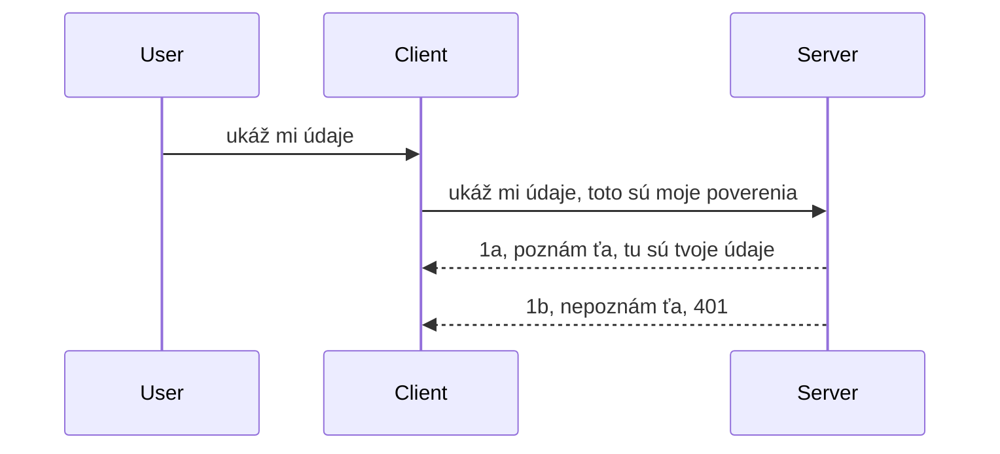

# Jednoduchá autentifikácia

SDK MCP podporujú použitie OAuth 2.1, ktorý je, pravdupovediac, dosť zložitý proces zahŕňajúci koncepty ako overovací server, server so zdrojmi, zasielanie prihlasovacích údajov, získanie kódu, výmenu kódu za prístupový token, až kým nakoniec nedostanete údaje zo zdroja. Ak nie ste oboznámení s OAuth, čo je skvelá vec na implementáciu, je dobré začať s niečím základným a postupne zvyšovať úroveň bezpečnosti. Práve preto táto kapitola existuje, aby vás vyviedla k pokročilejšej autentifikácii.

## Autentifikácia, čo tým myslíme?

Autentifikácia je skratka pre overovanie a autorizáciu. Myšlienka je, že musíme urobiť dve veci:

- **Overovanie** (Authentication), čo je proces zisťovania, či osobu pustíme do nášho domu, či má právo byť „tu“, či má prístup ku nášmu serveru so zdrojmi, kde sú funkcie nášho MCP Servera.
- **Autorizácia** (Authorization), je proces zisťovania, či by používateľ mal mať prístup k konkrétnym zdrojom, o ktoré žiada, napríklad k týmto objednávkam alebo produktom, alebo či môže len čítať obsah, ale nemôže ho mazať, ako iný príklad.

## Prístupové údaje: ako systému povieme, kto sme

No, väčšina webových vývojárov začne premýšľať o poskytovaní prístupových údajov serveru, zvyčajne o tajomstve, ktoré hovorí, či majú povolenie byť tu („Overenie“). Tento prístupový údaj je zvyčajne base64 zakódovaná verzia používateľského mena a hesla alebo API kľúč, ktorý jednoznačne identifikuje konkrétneho používateľa.

To zahŕňa posielanie cez hlavičku nazývanú „Authorization“ takto:

```json
{ "Authorization": "secret123" }
```

Toto sa zvyčajne nazýva základná autentifikácia. Celý proces potom funguje nasledovne:


Teraz, keď rozumieme, ako to funguje z pohľadu toku, ako to implementujeme? Väčšina webových serverov má koncept nazývaný middleware, kus kódu, ktorý beží ako súčasť požiadavky a môže overiť prístupové údaje, a ak sú platné, nechá požiadavku prejsť. Ak požiadavka nemá platné prístupové údaje, dostanete chybu autentifikácie. Pozrime sa, ako sa to dá implementovať:

**Python**

```python
class AuthMiddleware(BaseHTTPMiddleware):
    async def dispatch(self, request, call_next):

        has_header = request.headers.get("Authorization")
        if not has_header:
            print("-> Missing Authorization header!")
            return Response(status_code=401, content="Unauthorized")

        if not valid_token(has_header):
            print("-> Invalid token!")
            return Response(status_code=403, content="Forbidden")

        print("Valid token, proceeding...")
       
        response = await call_next(request)
        # pridajte akékoľvek zákaznícke hlavičky alebo nejako zmeňte odpoveď
        return response


starlette_app.add_middleware(CustomHeaderMiddleware)
```

Tu máme:

- Vytvorený middleware nazvaný `AuthMiddleware`, ktorého metóda `dispatch` sa volá webovým serverom.
- Middleware pridaný k webovému serveru:

    ```python
    starlette_app.add_middleware(AuthMiddleware)
    ```

- Napísanú validačnú logiku, ktorá kontroluje, či hlavička Authorization je prítomná a či je odoslané tajomstvo platné:

    ```python
    has_header = request.headers.get("Authorization")
    if not has_header:
        print("-> Missing Authorization header!")
        return Response(status_code=401, content="Unauthorized")

    if not valid_token(has_header):
        print("-> Invalid token!")
        return Response(status_code=403, content="Forbidden")
    ```

    ak je tajomstvo prítomné a platné, necháme požiadavku prejsť volaním `call_next` a vrátime odpoveď.

    ```python
    response = await call_next(request)
    # pridajte akékoľvek zákaznícke záhlavia alebo nejako zmeňte odpoveď
    return response
    ```

Funguje to tak, že ak je webová požiadavka smerovaná na server, middleware sa vyvolá a podľa jeho implementácie buď nechá požiadavku prejsť alebo vráti chybu indikujúcu, že klient nemá povolenie pokračovať.

**TypeScript**

Tu vytvoríme middleware s populárnym frameworkom Express a zachytíme požiadavku skôr, ako sa dostane k MCP Serveru. Tu je kód:

```typescript
function isValid(secret) {
    return secret === "secret123";
}

app.use((req, res, next) => {
    // 1. Je prítomný hlavička autorizácie?
    if(!req.headers["Authorization"]) {
        res.status(401).send('Unauthorized');
    }
    
    let token = req.headers["Authorization"];

    // 2. Skontrolujte platnosť.
    if(!isValid(token)) {
        res.status(403).send('Forbidden');
    }

   
    console.log('Middleware executed');
    // 3. Odovzdá požiadavku do ďalšieho kroku v požiadavkovom reťazci.
    next();
});
```

V tomto kóde:

1. Kontrolujeme, či je hlavička Authorization prítomná, ak nie, pošleme chybu 401.
2. Overujeme platnosť poverenia/tokenu, ak nie je platné, pošleme chybu 403.
3. Nakoniec požiadavku necháme pokračovať v pipeline a vrátime požadovaný zdroj.

## Cvičenie: Implementujte autentifikáciu

Využime naše vedomosti a skúste to implementovať. Plán:

Server

- Vytvorte inštanciu webového servera a MCP.
- Implementujte middleware pre server.

Klient

- Pošlite webovú požiadavku s poverením cez hlavičku.

### -1- Vytvorte inštanciu webového servera a MCP

V prvom kroku potrebujeme vytvoriť inštanciu webového servera a MCP Server.

**Python**

Tu vytvárame inštanciu MCP servera, vytvárame starlette webovú aplikáciu a hostíme ju pomocou uvicorn.

```python
# vytváranie MCP servera

app = FastMCP(
    name="MCP Resource Server",
    instructions="Resource Server that validates tokens via Authorization Server introspection",
    host=settings["host"],
    port=settings["port"],
    debug=True
)

# vytváranie webovej aplikácie starlette
starlette_app = app.streamable_http_app()

# poskytovanie aplikácie cez uvicorn
async def run(starlette_app):
    import uvicorn
    config = uvicorn.Config(
            starlette_app,
            host=app.settings.host,
            port=app.settings.port,
            log_level=app.settings.log_level.lower(),
        )
    server = uvicorn.Server(config)
    await server.serve()

run(starlette_app)
```

V tomto kóde:

- Vytvoríme MCP Server.
- Konštruujeme starlette webovú aplikáciu z MCP Servera, `app.streamable_http_app()`.
- Hostíme a obsluhujeme webovú aplikáciu pomocou uvicorn `server.serve()`.

**TypeScript**

Tu vytvárame inštanciu MCP Servera.

```typescript
const server = new McpServer({
      name: "example-server",
      version: "1.0.0"
    });

    // ... nastaviť zdroje servera, nástroje a výzvy ...
```

Tento MCP Server sa bude musieť vytvoriť v definícii POST /mcp cesty, takže vezmime vyššie uvedený kód a presuňme ho takto:

```typescript
import express from "express";
import { randomUUID } from "node:crypto";
import { McpServer } from "@modelcontextprotocol/sdk/server/mcp.js";
import { StreamableHTTPServerTransport } from "@modelcontextprotocol/sdk/server/streamableHttp.js";
import { isInitializeRequest } from "@modelcontextprotocol/sdk/types.js"

const app = express();
app.use(express.json());

// Mapa na ukladanie transportov podľa ID relácie
const transports: { [sessionId: string]: StreamableHTTPServerTransport } = {};

// Spracovať POST požiadavky pre komunikáciu klient-server
app.post('/mcp', async (req, res) => {
  // Skontrolovať existujúce ID relácie
  const sessionId = req.headers['mcp-session-id'] as string | undefined;
  let transport: StreamableHTTPServerTransport;

  if (sessionId && transports[sessionId]) {
    // Znovu použiť existujúci transport
    transport = transports[sessionId];
  } else if (!sessionId && isInitializeRequest(req.body)) {
    // Nová inicializačná požiadavka
    transport = new StreamableHTTPServerTransport({
      sessionIdGenerator: () => randomUUID(),
      onsessioninitialized: (sessionId) => {
        // Uložiť transport podľa ID relácie
        transports[sessionId] = transport;
      },
      // Ochrana proti DNS rebindingu je predvolene vypnutá kvôli spätnej kompatibilite. Ak prevádzkujete tento server
      // lokálne, uistite sa, že nastavíte:
      // enableDnsRebindingProtection: true,
      // allowedHosts: ['127.0.0.1'],
    });

    // Vyčistiť transport po zatvorení
    transport.onclose = () => {
      if (transport.sessionId) {
        delete transports[transport.sessionId];
      }
    };
    const server = new McpServer({
      name: "example-server",
      version: "1.0.0"
    });

    // ... nastaviť zdroje servera, nástroje a výzvy ...

    // Pripojiť sa k MCP serveru
    await server.connect(transport);
  } else {
    // Neplatná požiadavka
    res.status(400).json({
      jsonrpc: '2.0',
      error: {
        code: -32000,
        message: 'Bad Request: No valid session ID provided',
      },
      id: null,
    });
    return;
  }

  // Spracovať požiadavku
  await transport.handleRequest(req, res, req.body);
});

// Znovupoužiteľný spracovateľ pre GET a DELETE požiadavky
const handleSessionRequest = async (req: express.Request, res: express.Response) => {
  const sessionId = req.headers['mcp-session-id'] as string | undefined;
  if (!sessionId || !transports[sessionId]) {
    res.status(400).send('Invalid or missing session ID');
    return;
  }
  
  const transport = transports[sessionId];
  await transport.handleRequest(req, res);
};

// Spracovať GET požiadavky na notifikácie zo servera klientovi cez SSE
app.get('/mcp', handleSessionRequest);

// Spracovať DELETE požiadavky na ukončenie relácie
app.delete('/mcp', handleSessionRequest);

app.listen(3000);
```

Teraz vidíte, ako bola tvorba MCP Servera presunutá do vnútra `app.post("/mcp")`.

Pokračujme ďalším krokom, vytvorením middleware, aby sme mohli overiť prichádzajúce poverenie.

### -2- Implementujte middleware pre server

Poďme teraz ku časti middleware. Tu vytvoríme middleware, ktorý hľadá poverenie v hlavičke `Authorization` a overí ho. Ak je akceptovateľné, požiadavka bude pokračovať a vykoná to, čo má (napr. zobraziť nástroje, čítať zdroj alebo akúkoľvek MCP funkcionalitu, ktorú klient žiadal).

**Python**

Na vytvorenie middleware potrebujeme vytvoriť triedu, ktorá dedí z `BaseHTTPMiddleware`. Sú tu dva zaujímavé prvky:

- Požiadavka `request`, z ktorej čítame hlavičky.
- `call_next` je spätné volanie, ktoré musíme vyvolať, ak má klient akceptované poverenie.

Najprv musíme riešiť prípad, ak chýba hlavička `Authorization`:

```python
has_header = request.headers.get("Authorization")

# žiadny hlavičkový záznam, zlyhať s 401, inak pokračovať ďalej.
if not has_header:
    print("-> Missing Authorization header!")
    return Response(status_code=401, content="Unauthorized")
```

Tu posielame správu 401 unauthorized, pretože klient zlyhal pri autentifikácii.

Ďalej, ak bolo poverenie zaslané, potrebujeme overiť jeho platnosť takto:

```python
 if not valid_token(has_header):
    print("-> Invalid token!")
    return Response(status_code=403, content="Forbidden")
```

Všimnite si, ako sme tu poslali správu 403 forbidden. Pozrime sa na celý middleware nižšie, ktorý implementuje všetko, čo sme spomenuli vyššie:

```python
class AuthMiddleware(BaseHTTPMiddleware):
    async def dispatch(self, request, call_next):

        has_header = request.headers.get("Authorization")
        if not has_header:
            print("-> Missing Authorization header!")
            return Response(status_code=401, content="Unauthorized")

        if not valid_token(has_header):
            print("-> Invalid token!")
            return Response(status_code=403, content="Forbidden")

        print("Valid token, proceeding...")
        print(f"-> Received {request.method} {request.url}")
        response = await call_next(request)
        response.headers['Custom'] = 'Example'
        return response

```

Super, ale čo funkcia `valid_token`? Tu je:

```python
# NEPOUŽÍVAJTE na produkciu - vylepšite to !!
def valid_token(token: str) -> bool:
    # odstráňte predponu "Bearer "
    if token.startswith("Bearer "):
        token = token[7:]
        return token == "secret-token"
    return False
```

Toto samozrejme treba zlepšiť.

DÔLEŽITÉ: Nikdy by ste nemali mať tajomstvá priamo v kóde. Hodnotu na porovnanie by ste ideálne mali získavať z dátového zdroja alebo od poskytovateľa identity (IDP), alebo ešte lepšie, nechať IDP vykonať overovanie.

**TypeScript**

Na implementáciu toto s Express potrebujeme zavolať metódu `use`, ktorá prijíma middleware funkcie.

Musíme:

- Interagovať s premennou požiadavky, aby sme skontrolovali odovzdané poverenie v poli `Authorization`.
- Overiť poverenie, a ak je platné, nechať požiadavku pokračovať a spustiť klientovu MCP požiadavku.

Tu kontrolujeme, či je hlavička `Authorization` prítomná, ak nie, zastavíme požiadavku:

```typescript
if(!req.headers["authorization"]) {
    res.status(401).send('Unauthorized');
    return;
}
```

Ak hlavička nie je prítomná, dostanete chybu 401.

Ďalej kontrolujeme, či je poverenie platné, ak nie, opäť zastavíme požiadavku, ale s trochu inou správou:

```typescript
if(!isValid(token)) {
    res.status(403).send('Forbidden');
    return;
} 
```

Vidíte chybu 403.

Tu je celý kód:

```typescript
app.use((req, res, next) => {
    console.log('Request received:', req.method, req.url, req.headers);
    console.log('Headers:', req.headers["authorization"]);
    if(!req.headers["authorization"]) {
        res.status(401).send('Unauthorized');
        return;
    }
    
    let token = req.headers["authorization"];

    if(!isValid(token)) {
        res.status(403).send('Forbidden');
        return;
    }  

    console.log('Middleware executed');
    next();
});
```

Nastavili sme webový server, aby akceptoval middleware, ktorý overuje poverenie, ktoré nám klient dúfajme odosiela. A čo samotný klient?

### -3- Pošlite webovú požiadavku s poverením v hlavičke

Musíme zabezpečiť, aby klient odosielal poverenie cez hlavičku. Keďže použijeme MCP klienta, musíme zistiť, ako sa to robí.

**Python**

Pre klienta musíme poslať hlavičku s poverením takto:

```python
# NEpevne zakódujte hodnotu, majte ju minimálne v premennej prostredia alebo v bezpečnejšom úložisku
token = "secret-token"

async with streamablehttp_client(
        url = f"http://localhost:{port}/mcp",
        headers = {"Authorization": f"Bearer {token}"}
    ) as (
        read_stream,
        write_stream,
        session_callback,
    ):
        async with ClientSession(
            read_stream,
            write_stream
        ) as session:
            await session.initialize()
      
            # TODO, čo chcete spraviť na klientskej strane, napr. vypísať nástroje, zavolať nástroje atď.
```

Všimnite si, ako vyplníme vlastnosť `headers` takto ` headers = {"Authorization": f"Bearer {token}"}`.

**TypeScript**

Môžeme to vyriešiť v dvoch krokoch:

1. Naplniť konfiguračný objekt naším poverením.
2. Odovzdať tento konfiguračný objekt transportu.

```typescript

// NEPEVNĽTE hodnotu ako je to tu zobrazené. Najmenej to maj ako premennú prostredia a použite niečo ako dotenv (v režime vývoja).
let token = "secret123"

// definujte objekt s možnosťami klientského transportu
let options: StreamableHTTPClientTransportOptions = {
  sessionId: sessionId,
  requestInit: {
    headers: {
      "Authorization": "secret123"
    }
  }
};

// odovzdajte objekt s možnosťami transportu
async function main() {
   const transport = new StreamableHTTPClientTransport(
      new URL(serverUrl),
      options
   );
```

Tu vidíte, ako sme museli vytvoriť objekt `options` a umiestniť hlavičky pod vlastnosť `requestInit`.

DÔLEŽITÉ: Ako to však zlepšiť? Aktuálna implementácia má problémy. Najskôr je posielanie poverenia týmto spôsobom dosť rizikové, pokiaľ nemáte minimálne HTTPS. Aj potom môže byť poverenie ukradnuté, takže potrebujete systém, kde môžete token ľahko zrušiť a pridať ďalšie kontroly, ako odkiaľ na svete prichádza požiadavka, či sa požiadavka nevykonáva príliš často (správanie podobné botovi) a podobne, je tu množstvo otázok.

Je však potrebné povedať, že pre veľmi jednoduché API, kde nechcete, aby si niekto volal vaše API bez autentifikácie, a to, čo tu máme, je dobrý začiatok.

S tým povedaným, skúste trochu posilniť bezpečnosť pomocou štandardizovaného formátu ako JSON Web Token, tiež známeho ako JWT alebo "JOT" tokeny.

## JSON Web Tokeny, JWT

Takže sa snažíme zlepšiť veci oproti tomu, že posielame veľmi jednoduché poverenia. Aké sú okamžité vylepšenia, ktoré získame prijatím JWT?

- **Zlepšenie bezpečnosti**. Pri základnej autentifikácii odosielate používateľské meno a heslo ako base64 zakódovaný token (alebo API kľúč) stále dookola, čo zvyšuje riziko. S JWT odošlete používateľské meno a heslo a dostanete token na oplátku, ktorý je časovo obmedzený, teda vyprší po určitom čase. JWT umožňuje jednoducho používať jemné riadenie prístupu pomocou rolí, rozsahov a oprávnení.
- **Bezstavovosť a škálovateľnosť**. JWT sú samostatné, niesú so sebou všetky informácie o používateľovi a odstraňujú potrebu ukladania seans server-side. Token je možné validovať lokálne.
- **Interoperabilita a federácia**. JWT je základom Open ID Connect a používa sa s známymi poskytovateľmi identity ako Entra ID, Google Identity a Auth0. Tiež umožňujú single sign-on a oveľa viac, čo robí systém podnikovej úrovne.
- **Modularita a flexibilita**. JWT sa dá použiť aj s API bránami ako Azure API Management, NGINX a ďalšími. Podporuje použitie v autentifikačných scenároch a komunikáciu server-služba vrátane impersonácie a delegovania.
- **Výkon a kešovanie**. JWT možno kešovať po dekódovaní, čo znižuje potrebu parsovania. To pomáha špeciálne pri vysokom zaťažení, zlepšuje priepustnosť a znižuje záťaž infraštruktúry.
- **Pokročilé funkcie**. Podporuje introspekciu (kontrola platnosti na serveri) a zrušenie platnosti (token sa stane neplatným).

S týmito výhodami si pozrime, ako posunúť našu implementáciu na vyššiu úroveň.

## Premena základnej autentifikácie na JWT

Zmeny, ktoré potrebujeme urobiť vo veľkom:

- **Naučiť sa konštruovať JWT token** a pripraviť ho na odoslanie od klienta k serveru.
- **Validovať JWT token**, a ak je platný, umožniť klientovi prístup k našim zdrojom.
- **Bezpečné ukladanie tokenu**. Ako tento token uchováme.
- **Chrániť cesty**. Potrebujeme chrániť cesty, v našom prípade chrániť trasy a konkrétne funkcie MCP.
- **Pridať obnovovacie tokeny**. Zaistiť, že vytvoríme tokeny s krátkou životnosťou a obnovovacie tokeny s dlhšou životnosťou, ktoré sa používajú na získanie nových tokenov pri ich vypršaní. Tiež zaistiť existenciu obnovovacej endpointu a stratégiu rotácie.

### -1- Konštrukcia JWT tokenu

Token JWT sa skladá z týchto častí:

- **Hlavička** (header), algoritmus a typ tokenu.
- **Telo** (payload), nároky (claims), ako sub (používateľ alebo entita, ktorú token reprezentuje, v auth scenári to je zvyčajne ID používateľa), exp (kedy vyprší), role (rola)
- **Podpis** (signature), podpísaný tajomstvom alebo súkromným kľúčom.

Potrebujeme vytvoriť hlavičku, telo a zakódovaný token.

**Python**

```python

import jwt
import jwt
from jwt.exceptions import ExpiredSignatureError, InvalidTokenError
import datetime

# Tajný kľúč použitý na podpísanie JWT
secret_key = 'your-secret-key'

header = {
    "alg": "HS256",
    "typ": "JWT"
}

# informácie o používateľovi a jeho nároky a čas vypršania
payload = {
    "sub": "1234567890",               # Predmet (ID používateľa)
    "name": "User Userson",                # Vlastný nárok
    "admin": True,                     # Vlastný nárok
    "iat": datetime.datetime.utcnow(),# Dátum vydania
    "exp": datetime.datetime.utcnow() + datetime.timedelta(hours=1)  # Dátum vypršania
}

# zakódovať to
encoded_jwt = jwt.encode(payload, secret_key, algorithm="HS256", headers=header)
```

V kóde vyššie sme:

- Definovali hlavičku s použitím HS256 ako algoritmu a typ JWT.
- Vytvorili telo, ktoré obsahuje subjekt alebo ID používateľa, používateľské meno, rolu, kedy bol vydaný a kedy má expiráciu, čím implementujeme časovú viazanosť, ktorú sme spomínali.

**TypeScript**

Tu budeme potrebovať niektoré závislosti, ktoré nám pomôžu konštruovať JWT token.

Závislosti

```sh

npm install jsonwebtoken
npm install --save-dev @types/jsonwebtoken
```

Keď to máme, vytvorme hlavičku, payload a takto získajme zakódovaný token.

```typescript
import jwt from 'jsonwebtoken';

const secretKey = 'your-secret-key'; // Použite premenné prostredia v produkcii

// Definujte záťaž
const payload = {
  sub: '1234567890',
  name: 'User usersson',
  admin: true,
  iat: Math.floor(Date.now() / 1000), // Vydané o
  exp: Math.floor(Date.now() / 1000) + 60 * 60 // Platí 1 hodinu
};

// Definujte hlavičku (voliteľné, jsonwebtoken nastavuje predvolené hodnoty)
const header = {
  alg: 'HS256',
  typ: 'JWT'
};

// Vytvorte token
const token = jwt.sign(payload, secretKey, {
  algorithm: 'HS256',
  header: header
});

console.log('JWT:', token);
```

Tento token je:

Podpísaný pomocou HS256
Platný 1 hodinu
Obsahuje nároky ako sub, name, admin, iat a exp.

### -2- Validácia tokenu

Takisto potrebujeme token validovať, toto by sa malo robiť na serveri, aby sme sa uistili, že to, čo klient odosiela, je naozaj platné. Mali by sme robiť mnohé kontroly od validácie štruktúry až po platnosť. Odporúča sa tiež pridávať ďalšie kontroly, či používateľ existuje v našom systéme a podobne.

Na validáciu tokenu ho musíme dekódovať, aby sme si ho mohli prečítať a začať kontrolovať jeho platnosť:

**Python**

```python

# Dekódujte a overte JWT
try:
    decoded = jwt.decode(token, secret_key, algorithms=["HS256"])
    print("✅ Token is valid.")
    print("Decoded claims:")
    for key, value in decoded.items():
        print(f"  {key}: {value}")
except ExpiredSignatureError:
    print("❌ Token has expired.")
except InvalidTokenError as e:
    print(f"❌ Invalid token: {e}")

```

V tomto kóde voláme `jwt.decode` s tokenom, tajným kľúčom a použitým algoritmom. Všimnite si, že používame try-catch blok, pretože neúspešná validácia vyvolá výnimku.

**TypeScript**

Tu voláme `jwt.verify`, aby sme získali dekódovanú verziu tokenu, ktorú môžeme ďalej analyzovať. Ak toto volanie zlyhá, znamená to, že štruktúra tokenu je nesprávna alebo už nie je platný.

```typescript

try {
  const decoded = jwt.verify(token, secretKey);
  console.log('Decoded Payload:', decoded);
} catch (err) {
  console.error('Token verification failed:', err);
}
```

POZOR: ako sme už spomínali, mali by ste vykonať ďalšie kontroly, aby ste sa uistili, že tento token odkazuje na používateľa v našom systéme a že používateľ má práva, o ktorých tvrdí, že ich má.
Nasledujúce si pozrime riadenie prístupu založené na rolách, známe aj ako RBAC.

## Pridanie riadenia prístupu založeného na rolách

Myšlienka je, že chceme vyjadriť, že rôzne role majú rôzne oprávnenia. Napríklad predpokladáme, že admin môže urobiť všetko, bežný používateľ môže čítať/písať a hosť môže iba čítať. Preto tu sú možné úrovne oprávnení:

- Admin.Write 
- User.Read
- Guest.Read

Pozrime sa, ako môžeme implementovať takéto riadenie pomocou middleware. Middleware môže byť pridaný k jednotlivým trasám ako aj na všetky trasy.

**Python**

```python
from starlette.middleware.base import BaseHTTPMiddleware
from starlette.responses import JSONResponse
import jwt

# NEUMLČUJTE tajomstvo v kóde, toto je len na demonštračné účely. Prečítajte si ho z bezpečného miesta.
SECRET_KEY = "your-secret-key" # dajte to do premenné prostredia
REQUIRED_PERMISSION = "User.Read"

class JWTPermissionMiddleware(BaseHTTPMiddleware):
    async def dispatch(self, request, call_next):
        auth_header = request.headers.get("Authorization")
        if not auth_header or not auth_header.startswith("Bearer "):
            return JSONResponse({"error": "Missing or invalid Authorization header"}, status_code=401)

        token = auth_header.split(" ")[1]
        try:
            decoded = jwt.decode(token, SECRET_KEY, algorithms=["HS256"])
        except jwt.ExpiredSignatureError:
            return JSONResponse({"error": "Token expired"}, status_code=401)
        except jwt.InvalidTokenError:
            return JSONResponse({"error": "Invalid token"}, status_code=401)

        permissions = decoded.get("permissions", [])
        if REQUIRED_PERMISSION not in permissions:
            return JSONResponse({"error": "Permission denied"}, status_code=403)

        request.state.user = decoded
        return await call_next(request)


```

Existuje niekoľko rôznych spôsobov, ako pridať middleware, napríklad nižšie:

```python

# Alt 1: pridať middleware počas konštrukcie starlette aplikácie
middleware = [
    Middleware(JWTPermissionMiddleware)
]

app = Starlette(routes=routes, middleware=middleware)

# Alt 2: pridať middleware po tom, čo je starlette aplikácia už vytvorená
starlette_app.add_middleware(JWTPermissionMiddleware)

# Alt 3: pridať middleware pre každú trasu
routes = [
    Route(
        "/mcp",
        endpoint=..., # spracovateľ
        middleware=[Middleware(JWTPermissionMiddleware)]
    )
]
```

**TypeScript**

Môžeme použiť `app.use` a middleware, ktorý sa spustí pre všetky požiadavky.

```typescript
app.use((req, res, next) => {
    console.log('Request received:', req.method, req.url, req.headers);
    console.log('Headers:', req.headers["authorization"]);

    // 1. Skontrolujte, či bol odoslaný hlavičkový parameter autorizácie

    if(!req.headers["authorization"]) {
        res.status(401).send('Unauthorized');
        return;
    }
    
    let token = req.headers["authorization"];

    // 2. Skontrolujte, či je token platný
    if(!isValid(token)) {
        res.status(403).send('Forbidden');
        return;
    }  

    // 3. Skontrolujte, či používateľ tokenu existuje v našom systéme
    if(!isExistingUser(token)) {
        res.status(403).send('Forbidden');
        console.log("User does not exist");
        return;
    }
    console.log("User exists");

    // 4. Overte, či má token správne oprávnenia
    if(!hasScopes(token, ["User.Read"])){
        res.status(403).send('Forbidden - insufficient scopes');
    }

    console.log("User has required scopes");

    console.log('Middleware executed');
    next();
});

```

Existuje pomerne veľa vecí, ktoré môžeme nechať na náš middleware a ktoré náš middleware MALO by robiť, a to konkrétne:

1. Skontrolovať, či je prítomný hlavičkový údaj autorizácie
2. Skontrolovať, či je token platný, voláme `isValid`, čo je metóda, ktorú sme napísali na kontrolu integrity a platnosti JWT tokenu.
3. Overiť, či používateľ existuje v našom systéme, toto by sme mali skontrolovať.

   ```typescript
    // používatelia v databáze
   const users = [
     "user1",
     "User usersson",
   ]

   function isExistingUser(token) {
     let decodedToken = verifyToken(token);

     // TODO, skontrolovať, či používateľ existuje v databáze
     return users.includes(decodedToken?.name || "");
   }
   ```

   Vyššie sme vytvorili veľmi jednoduchý zoznam `users`, ktorý by mal byť samozrejme v databáze.

4. Okrem toho by sme mali skontrolovať, či token má správne oprávnenia.

   ```typescript
   if(!hasScopes(token, ["User.Read"])){
        res.status(403).send('Forbidden - insufficient scopes');
   }
   ```

   V tomto kóde middleware vyššie kontrolujeme, či token obsahuje oprávnenie User.Read, ak nie, pošleme chybu 403. Nižšie je pomocná metóda `hasScopes`.

   ```typescript
   function hasScopes(scope: string, requiredScopes: string[]) {
     let decodedToken = verifyToken(scope);
    return requiredScopes.every(scope => decodedToken?.scopes.includes(scope));
  }
   ```

Have a think which additional checks you should be doing, but these are the absolute minimum of checks you should be doing.

Using Express as a web framework is a common choice. There are helpers library when you use JWT so you can write less code.

- `express-jwt`, helper library that provides a middleware that helps decode your token.
- `express-jwt-permissions`, this provides a middleware `guard` that helps check if a certain permission is on the token.

Here's what these libraries can look like when used:

```typescript
const express = require('express');
const jwt = require('express-jwt');
const guard = require('express-jwt-permissions')();

const app = express();
const secretKey = 'your-secret-key'; // put this in env variable

// Decode JWT and attach to req.user
app.use(jwt({ secret: secretKey, algorithms: ['HS256'] }));

// Check for User.Read permission
app.use(guard.check('User.Read'));

// multiple permissions
// app.use(guard.check(['User.Read', 'Admin.Access']));

app.get('/protected', (req, res) => {
  res.json({ message: `Welcome ${req.user.name}` });
});

// Error handler
app.use((err, req, res, next) => {
  if (err.code === 'permission_denied') {
    return res.status(403).send('Forbidden');
  }
  next(err);
});

```

Teraz ste videli, ako middleware môžu byť použité pre autentifikáciu aj autorizáciu, ale čo MCP, mení to spôsob, akým robíme autentifikáciu? Pozrime sa na to v ďalšej sekcii.

### -3- Pridanie RBAC do MCP

Doteraz ste videli, ako môžete pridať RBAC cez middleware, avšak pre MCP neexistuje jednoduchý spôsob, ako pridať RBAC na úrovni každej MCP funkcie, čo teda robiť? No, jednoducho musíme pridať kód ako tento, ktorý v tomto prípade kontroluje, či má klient práva volať konkrétny nástroj:

Máte niekoľko rôznych možností, ako dosiahnuť RBAC na úrovni funkcie, tu je pár z nich:

- Pridať kontrolu pre každý nástroj, zdroj, prompt, kde potrebujete skontrolovať úroveň oprávnenia.

   **python**

   ```python
   @tool()
   def delete_product(id: int):
      try:
          check_permissions(role="Admin.Write", request)
      catch:
        pass # klient zlyhal pri autorizácii, vyvolajte chybu autorizácie
   ```

   **typescript**

   ```typescript
   server.registerTool(
    "delete-product",
    {
      title: Delete a product",
      description: "Deletes a product",
      inputSchema: { id: z.number() }
    },
    async ({ id }) => {
      
      try {
        checkPermissions("Admin.Write", request);
        // todo, poslať id do productService a vzdialeného vstupu
      } catch(Exception e) {
        console.log("Authorization error, you're not allowed");  
      }

      return {
        content: [{ type: "text", text: `Deletected product with id ${id}` }]
      };
    }
   );
   ```


- Použiť pokročilý serverový prístup a spracovateľov požiadaviek, aby ste minimalizovali počet miest, kde musíte robiť kontrolu.

   **Python**

   ```python
   
   tool_permission = {
      "create_product": ["User.Write", "Admin.Write"],
      "delete_product": ["Admin.Write"]
   }

   def has_permission(user_permissions, required_permissions) -> bool:
      # user_permissions: zoznam oprávnení, ktoré užívateľ má
      # required_permissions: zoznam oprávnení potrebných pre nástroj
      return any(perm in user_permissions for perm in required_permissions)

   @server.call_tool()
   async def handle_call_tool(
     name: str, arguments: dict[str, str] | None
   ) -> list[types.TextContent]:
    # Predpokladajme, že request.user.permissions je zoznam oprávnení pre užívateľa
     user_permissions = request.user.permissions
     required_permissions = tool_permission.get(name, [])
     if not has_permission(user_permissions, required_permissions):
        # Vyvolať chybu "Nemáte oprávnenie na volanie nástroja {name}"
        raise Exception(f"You don't have permission to call tool {name}")
     # pokračovať a zavolať nástroj
     # ...
   ```   
   

   **TypeScript**

   ```typescript
   function hasPermission(userPermissions: string[], requiredPermissions: string[]): boolean {
       if (!Array.isArray(userPermissions) || !Array.isArray(requiredPermissions)) return false;
       // Vráti true, ak má používateľ aspoň jedno potrebné povolenie
       
       return requiredPermissions.some(perm => userPermissions.includes(perm));
   }
  
   server.setRequestHandler(CallToolRequestSchema, async (request) => {
      const { params: { name } } = request;
  
      let permissions = request.user.permissions;
  
      if (!hasPermission(permissions, toolPermissions[name])) {
         return new Error(`You don't have permission to call ${name}`);
      }
  
      // pokračuj..
   });
   ```

   Upozornenie, budete musieť zabezpečiť, že váš middleware priradí dekódovaný token do vlastnosti user objektu request, aby bol vyššie uvedený kód jednoduchý.

### Zhrnutie

Teraz, keď sme prebrali, ako všeobecne pridať podporu pre RBAC a konkrétne pre MCP, je čas skúsiť implementovať zabezpečenie sami, aby ste si overili, že ste pochopili predložené koncepty.

## Úloha 1: Vytvorte MCP server a MCP klienta s použitím základnej autentifikácie

Tu použijete to, čo ste sa naučili o odosielaní poverení cez hlavičky.

## Riešenie 1

[Riešenie 1](./code/basic/README.md)

## Úloha 2: Vylepšiť riešenie z úlohy 1 použitím JWT

Vezmite prvé riešenie, ale tentokrát ho vylepšíme.

Namiesto použitia Basic Auth použijeme JWT.

## Riešenie 2

[Riešenie 2](./solution/jwt-solution/README.md)

## Výzva

Pridajte RBAC pre každý nástroj, ako sme popísali v sekcii "Pridanie RBAC do MCP".

## Zhrnutie

Dúfame, že ste sa v tejto kapitole mnoho naučili — od úplnej absencie zabezpečenia, cez základné zabezpečenie až po JWT a jeho začlenenie do MCP.

Vybudovali sme pevný základ s vlastnými JWT, ale keď škálujeme, posúvame sa smerom k štandardizovanému modelu identity. Prijatie poskytovateľa identity ako Entra alebo Keycloak nám umožňuje presunúť vydávanie, overovanie a správu životného cyklu tokenov na dôveryhodnú platformu — čím sa môžeme sústrediť na logiku aplikácie a používateľský zážitok.

Pre to máme ďalšiu [pokročilú kapitolu o Entre](../../05-AdvancedTopics/mcp-security-entra/README.md)

## Čo ďalej

- Ďalej: [Nastavenie MCP hostiteľov](../12-mcp-hosts/README.md)

---

<!-- CO-OP TRANSLATOR DISCLAIMER START -->
**Vyhlásenie o zodpovednosti**:
Tento dokument bol preložený pomocou AI prekladateľskej služby [Co-op Translator](https://github.com/Azure/co-op-translator). Aj keď usilovne pracujeme na presnosti, majte prosím na pamäti, že automatické preklady môžu obsahovať chyby alebo nepresnosti. Originálny dokument v jeho pôvodnom jazyku by sa mal považovať za autoritatívny zdroj. Pre kritické informácie sa odporúča profesionálny ľudský preklad. Nie sme zodpovední za akékoľvek nedorozumenia alebo nesprávne interpretácie vyplývajúce z použitia tohto prekladu.
<!-- CO-OP TRANSLATOR DISCLAIMER END -->