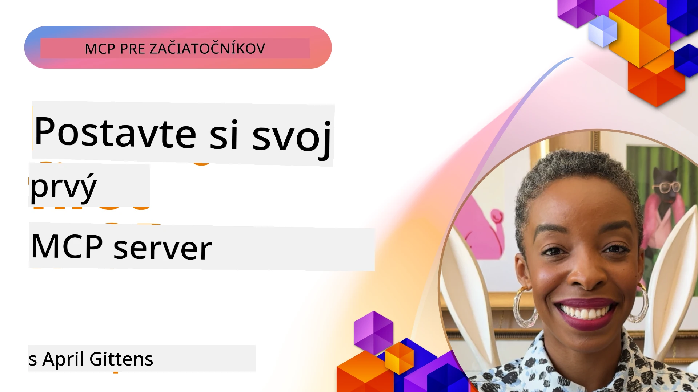

## Začíname  

_(Kliknite na obrázok vyššie pre zobrazenie videa tejto lekcie)_

Táto sekcia pozostáva z niekoľkých lekcií:

- **1 Váš prvý server**, v tejto prvej lekcii sa naučíte, ako vytvoriť svoj prvý server a skontrolovať ho pomocou nástroja inspector, čo je cenný spôsob, ako testovať a ladenie vášho servera, [do lekcie](01-first-server/README.md)

- **2 Klient**, v tejto lekcii sa naučíte, ako napísať klienta, ktorý sa dokáže pripojiť k vášmu serveru, [do lekcie](02-client/README.md)

- **3 Klient s LLM**, ešte lepší spôsob písania klienta je pridať mu LLM, aby „vyjednával“ s vašim serverom, čo má robiť, [do lekcie](03-llm-client/README.md)

- **4 Použitie servera GitHub Copilot Agent režim vo Visual Studio Code**. Tu sa pozrieme na spúšťanie nášho MCP servera priamo vo Visual Studio Code, [do lekcie](04-vscode/README.md)

- **5 stdio Transport Server** stdio transport je odporúčaný štandard pre lokálnu komunikáciu MCP server-klient, poskytujúci bezpečnú komunikáciu na základe podprocesov s vstavanou izoláciou procesov [do lekcie](05-stdio-server/README.md)

- **6 HTTP Streaming s MCP (Streamovateľné HTTP)**. Naučte sa o modernom HTTP streaming transporte (odporúčaný prístup pre vzdialené MCP servery podľa [MCP Špecifikácie 2025-11-25](https://spec.modelcontextprotocol.io/specification/2025-11-25/basic/transports/#streamable-http)), notifikácie o priebehu a ako implementovať škálovateľné, real-time MCP servery a klientov pomocou Streamovateľného HTTP. [do lekcie](06-http-streaming/README.md)

- **7 Využitie AI Toolkit pre VSCode** na používanie a testovanie vašich MCP klientov a serverov [do lekcie](07-aitk/README.md)

- **8 Testovanie**. Tu sa budeme najmä venovať spôsobom, ako môžeme otestovať náš server a klienta rôznymi spôsobmi, [do lekcie](08-testing/README.md)

- **9 Nasadenie**. Táto kapitola sa zameria na rôzne spôsoby nasadenia vašich MCP riešení, [do lekcie](09-deployment/README.md)

- **10 Pokročilé použitie servera**. Táto kapitola pokrýva pokročilé použitie servera, [do lekcie](./10-advanced/README.md)

- **11 Autentifikácia**. Táto kapitola sa venuje tomu, ako pridať jednoduchú autentifikáciu, od Basic Auth po používanie JWT a RBAC. Odporúčame začať tu a potom sa pozrieť na pokročilé témy v kapitole 5 a vykonať ďalšie zabezpečenia podľa odporúčaní v kapitole 2, [do lekcie](./11-simple-auth/README.md)

- **12 MCP Hosty**. Konfigurácia a používanie populárnych MCP host klientov vrátane Claude Desktop, Cursor, Cline a Windsurf. Naučte sa typy transportov a riešenie problémov, [do lekcie](./12-mcp-hosts/README.md)

- **13 MCP Inspector**. Interaktívne ladenie a testovanie vašich MCP serverov pomocou nástroja MCP Inspector. Naučte sa riešiť problémy s nástrojmi, zdrojmi a protokolovými správami, [do lekcie](./13-mcp-inspector/README.md)

Model Context Protocol (MCP) je otvorený protokol, ktorý štandardizuje spôsob, akým aplikácie poskytujú kontext LLM. MCP si môžete predstaviť ako USB-C port pre AI aplikácie - poskytuje štandardizovaný spôsob pripojenia AI modelov k rôznym dátovým zdrojom a nástrojom.

## Ciele učenia

Na konci tejto lekcie budete vedieť:

- Nastaviť vývojové prostredie pre MCP v C#, Jave, Pythone, TypeScripte a JavaScripte
- Vytvárať a nasadzovať základné MCP servery s vlastnými funkciami (zdroje, výzvy a nástroje)
- Vytvárať hostiteľské aplikácie, ktoré sa pripájajú k MCP serverom
- Testovať a ladiť implementácie MCP
- Pochopiť bežné výzvy pri nastavení a ich riešenia
- Pripojiť vaše MCP implementácie k populárnym LLM službám

## Nastavenie vášho MCP prostredia

Predtým, ako začnete pracovať s MCP, je dôležité pripraviť si vývojové prostredie a pochopiť základnú pracovnú postupnosť. Táto sekcia vás prevedie po úvodných krokoch nastavenia, aby ste mali hladký štart s MCP.

### Predpoklady

Pred začatím MCP vývoja sa uistite, že máte:

- **Vývojové prostredie**: Pre zvolený jazyk (C#, Java, Python, TypeScript alebo JavaScript)
- **IDE/Editora**: Visual Studio, Visual Studio Code, IntelliJ, Eclipse, PyCharm alebo akýkoľvek moderný editor kódu
- **Správcu balíčkov**: NuGet, Maven/Gradle, pip, alebo npm/yarn
- **API Kľúče**: Pre akékoľvek AI služby, ktoré plánujete používať vo svojich hostiteľských aplikáciách

### Oficiálne SDK

V nasledujúcich kapitolách uvidíte riešenia vytvorené v Pythone, TypeScripte, Jave a .NET. Tu sú všetky oficiálne podporované SDK.

MCP poskytuje oficiálne SDK pre viaceré jazyky (v súlade s [MCP Špecifikáciou 2025-11-25](https://spec.modelcontextprotocol.io/specification/2025-11-25/)):
- [C# SDK](https://github.com/modelcontextprotocol/csharp-sdk) - Udržiavané v spolupráci s Microsoftom
- [Java SDK](https://github.com/modelcontextprotocol/java-sdk) - Udržiavané v spolupráci so Spring AI
- [TypeScript SDK](https://github.com/modelcontextprotocol/typescript-sdk) - Oficiálna implementácia v TypeScripte
- [Python SDK](https://github.com/modelcontextprotocol/python-sdk) - Oficiálna implementácia v Pythone (FastMCP)
- [Kotlin SDK](https://github.com/modelcontextprotocol/kotlin-sdk) - Oficiálna implementácia v Kotline
- [Swift SDK](https://github.com/modelcontextprotocol/swift-sdk) - Udržiavané v spolupráci s Loopwork AI
- [Rust SDK](https://github.com/modelcontextprotocol/rust-sdk) - Oficiálna implementácia v Rust
- [Go SDK](https://github.com/modelcontextprotocol/go-sdk) - Oficiálna implementácia v Go

## Kľúčové zistenia

- Nastavenie MCP vývojového prostredia je jednoduché s jazykovo špecifickými SDK
- Vývoj MCP serverov spočíva vo vytváraní a registrovaní nástrojov s jasnými schémami
- MCP klienti sa pripájajú k serverom a modelom, aby využili rozšírené schopnosti
- Testovanie a ladenie sú nevyhnutné pre spoľahlivé implementácie MCP
- Možnosti nasadenia sa pohybujú od lokálneho vývoja až po cloudové riešenia

## Cvičenia

Máme sadu príkladov, ktoré dopĺňajú cvičenia, ktoré uvidíte vo všetkých kapitolách tejto sekcie. Okrem toho má každá kapitola vlastné cvičenia a úlohy.

- [Java kalkulačka](./samples/java/calculator/README.md)
- [.Net kalkulačka](../../../03-GettingStarted/samples/csharp)
- [JavaScript kalkulačka](./samples/javascript/README.md)
- [TypeScript kalkulačka](./samples/typescript/README.md)
- [Python kalkulačka](../../../03-GettingStarted/samples/python)

## Doplnkové zdroje

- [Vytváranie agentov pomocou Model Context Protocol na Azure](https://learn.microsoft.com/azure/developer/ai/intro-agents-mcp)
- [Vzdialené MCP s Azure Container Apps (Node.js/TypeScript/JavaScript)](https://learn.microsoft.com/samples/azure-samples/mcp-container-ts/mcp-container-ts/)
- [.NET OpenAI MCP Agent](https://learn.microsoft.com/samples/azure-samples/openai-mcp-agent-dotnet/openai-mcp-agent-dotnet/)

## Čo ďalej

Začnite prvou lekciou: [Vytváranie vášho prvého MCP servera](01-first-server/README.md)

Keď dokončíte tento modul, pokračujte na: [Modul 4: Praktická implementácia](../04-PracticalImplementation/README.md)

---

<!-- CO-OP TRANSLATOR DISCLAIMER START -->
**Vyhlásenie o zodpovednosti**:  
Tento dokument bol preložený pomocou AI prekladateľskej služby [Co-op Translator](https://github.com/Azure/co-op-translator). Hoci sa snažíme o presnosť, prosím, majte na pamäti, že automatizované preklady môžu obsahovať chyby alebo nepresnosti. Originálny dokument v jeho pôvodnom jazyku by mal byť považovaný za autoritatívny zdroj. Pre dôležité informácie sa odporúča profesionálny ľudský preklad. Nie sme zodpovední za žiadne nedorozumenia alebo nesprávne interpretácie vyplývajúce z použitia tohto prekladu.
<!-- CO-OP TRANSLATOR DISCLAIMER END -->