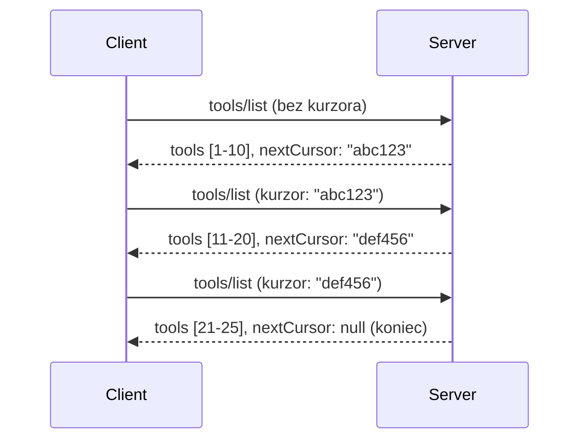

# Paginácia a veľké množiny výsledkov v MCP

Keď váš MCP server spracúva veľké dátové súbory - či už ide o zoznam tisícov súborov, databázových záznamov alebo výsledkov vyhľadávania - potrebujete stránkovanie na efektívnu správu pamäte a zabezpečenie rýchlej odozvy pre používateľov. Tento návod popisuje, ako implementovať a používať stránkovanie v MCP.

## Prečo je stránkovanie dôležité

Bez stránkovania môžu veľké odpovede spôsobiť:

- **Vyčerpanie pamäte** - Načítanie miliónov záznamov naraz
- **Pomalé reakčné časy** - Používatelia čakajú, kým sa všetky dáta načítajú
- **Chyby časového limitu** - Žiadosti prekročenie limitu spracovania
- **Slabý výkon AI** - LLM majú problém s obrovským kontextom

MCP používa **stránkovanie založené na kurzore** pre spoľahlivé a konzistentné prechádzanie cez výsledkové sady.

---

## Ako funguje stránkovanie v MCP

### Koncept kurzora

**Kurzór** je nepriehľadný reťazec, ktorý označuje vašu pozíciu vo výsledkovej sade. Predstavte si ho ako záložku v dlhej knihe.


### Stránkovanie v MCP metódach

Tieto MCP metódy podporujú stránkovanie:

| Metóda | Vracia | Podpora kurzora |
|--------|---------|----------------|
| `tools/list` | Definície nástrojov | ✅ |
| `resources/list` | Definície zdrojov | ✅ |
| `prompts/list` | Definície promptov | ✅ |
| `resources/templates/list` | Šablóny zdrojov | ✅ |

---

## Implementácia na serveri

### Python (FastMCP)

```python
from mcp.server import Server
from mcp.types import Tool, ListToolsResult
import math

app = Server("paginated-server")

# Simulovaný veľký dataset
ALL_TOOLS = [
    Tool(name=f"tool_{i}", description=f"Tool number {i}", inputSchema={})
    for i in range(100)
]

PAGE_SIZE = 10

@app.list_tools()
async def list_tools(cursor: str | None = None) -> ListToolsResult:
    """List tools with pagination support."""
    
    # Dekódovať kurzor pre získanie počiatočného indexu
    start_index = 0
    if cursor:
        try:
            start_index = int(cursor)
        except ValueError:
            start_index = 0
    
    # Získať stránku výsledkov
    end_index = min(start_index + PAGE_SIZE, len(ALL_TOOLS))
    page_tools = ALL_TOOLS[start_index:end_index]
    
    # Vypočítať ďalší kurzor
    next_cursor = None
    if end_index < len(ALL_TOOLS):
        next_cursor = str(end_index)
    
    return ListToolsResult(
        tools=page_tools,
        nextCursor=next_cursor
    )
```

### TypeScript

```typescript
import { Server } from "@modelcontextprotocol/sdk/server/index.js";
import { ListToolsResultSchema } from "@modelcontextprotocol/sdk/types.js";

const server = new Server({
  name: "paginated-server",
  version: "1.0.0"
});

// Simulovaný veľký súbor údajov
const ALL_TOOLS = Array.from({ length: 100 }, (_, i) => ({
  name: `tool_${i}`,
  description: `Tool number ${i}`,
  inputSchema: { type: "object", properties: {} }
}));

const PAGE_SIZE = 10;

server.setRequestHandler(ListToolsResultSchema, async (request) => {
  // Dekódovať kurzor
  let startIndex = 0;
  if (request.params?.cursor) {
    startIndex = parseInt(request.params.cursor, 10) || 0;
  }
  
  // Získať stránku výsledkov
  const endIndex = Math.min(startIndex + PAGE_SIZE, ALL_TOOLS.length);
  const pageTools = ALL_TOOLS.slice(startIndex, endIndex);
  
  // Vypočítať ďalší kurzor
  const nextCursor = endIndex < ALL_TOOLS.length ? String(endIndex) : undefined;
  
  return {
    tools: pageTools,
    nextCursor
  };
});
```

### Java (Spring MCP)

```java
@Service
public class PaginatedToolService {
    
    private static final int PAGE_SIZE = 10;
    private final List<Tool> allTools;
    
    public PaginatedToolService() {
        // Inicializovať veľkú množinu údajov
        this.allTools = IntStream.range(0, 100)
            .mapToObj(i -> new Tool("tool_" + i, "Tool number " + i, Map.of()))
            .collect(Collectors.toList());
    }
    
    @McpMethod("tools/list")
    public ListToolsResult listTools(@Param("cursor") String cursor) {
        // Dekódovať kurzor
        int startIndex = 0;
        if (cursor != null && !cursor.isEmpty()) {
            try {
                startIndex = Integer.parseInt(cursor);
            } catch (NumberFormatException e) {
                startIndex = 0;
            }
        }
        
        // Získať stránku výsledkov
        int endIndex = Math.min(startIndex + PAGE_SIZE, allTools.size());
        List<Tool> pageTools = allTools.subList(startIndex, endIndex);
        
        // Vypočítať ďalší kurzor
        String nextCursor = endIndex < allTools.size() ? String.valueOf(endIndex) : null;
        
        return new ListToolsResult(pageTools, nextCursor);
    }
}
```

---

## Implementácia na klientovi

### Python klient

```python
from mcp import ClientSession

async def get_all_tools(session: ClientSession) -> list:
    """Fetch all tools using pagination."""
    all_tools = []
    cursor = None
    
    while True:
        result = await session.list_tools(cursor=cursor)
        all_tools.extend(result.tools)
        
        if result.nextCursor is None:
            break
        cursor = result.nextCursor
    
    return all_tools

# Použitie
async with client_session as session:
    tools = await get_all_tools(session)
    print(f"Found {len(tools)} tools")
```

### TypeScript klient

```typescript
import { Client } from "@modelcontextprotocol/sdk/client/index.js";

async function getAllTools(client: Client): Promise<Tool[]> {
  const allTools: Tool[] = [];
  let cursor: string | undefined = undefined;
  
  do {
    const result = await client.listTools({ cursor });
    allTools.push(...result.tools);
    cursor = result.nextCursor;
  } while (cursor);
  
  return allTools;
}

// Použitie
const tools = await getAllTools(client);
console.log(`Found ${tools.length} tools`);
```

### Vzorec Lazy Loading

Pre veľmi veľké dáta načítavajte stránky na požiadanie:

```python
class PaginatedToolIterator:
    """Lazily iterate through paginated tools."""
    
    def __init__(self, session: ClientSession):
        self.session = session
        self.cursor = None
        self.buffer = []
        self.exhausted = False
    
    async def __anext__(self):
        # Vrátiť z vyrovnávacej pamäte, ak je k dispozícii
        if self.buffer:
            return self.buffer.pop(0)
        
        # Skontrolovať, či sme vyčerpali všetky stránky
        if self.exhausted:
            raise StopAsyncIteration
        
        # Načítať ďalšiu stránku
        result = await self.session.list_tools(cursor=self.cursor)
        self.buffer = list(result.tools)
        self.cursor = result.nextCursor
        
        if self.cursor is None:
            self.exhausted = True
        
        if not self.buffer:
            raise StopAsyncIteration
        
        return self.buffer.pop(0)
    
    def __aiter__(self):
        return self

# Použitie - pamäťovo efektívne pre veľké dátové súbory
async for tool in PaginatedToolIterator(session):
    process_tool(tool)
```

---

## Stránkovanie pre zdroje

Zdroje často potrebujú stránkovanie pre adresáre alebo veľké dátové súbory:

```python
from mcp.server import Server
from mcp.types import Resource, ListResourcesResult
import os

app = Server("file-server")

@app.list_resources()
async def list_resources(cursor: str | None = None) -> ListResourcesResult:
    """List files in directory with pagination."""
    
    directory = "/data/files"
    all_files = sorted(os.listdir(directory))
    
    # Dekódovať kurzor (index súboru)
    start_index = int(cursor) if cursor else 0
    page_size = 20
    end_index = min(start_index + page_size, len(all_files))
    
    # Vytvoriť zoznam zdrojov pre túto stránku
    resources = []
    for filename in all_files[start_index:end_index]:
        filepath = os.path.join(directory, filename)
        resources.append(Resource(
            uri=f"file://{filepath}",
            name=filename,
            mimeType="application/octet-stream"
        ))
    
    # Vypočítať nasledujúci kurzor
    next_cursor = str(end_index) if end_index < len(all_files) else None
    
    return ListResourcesResult(
        resources=resources,
        nextCursor=next_cursor
    )
```

---

## Stratégie návrhu kurzora

### Stratégia 1: Na základe indexu (jednoduchá)

```python
# Kurzor je iba index
cursor = "50"  # Začni na položke 50
```

**Výhody:** Jednoduché, bezstavové  
**Nevýhody:** Výsledky sa môžu posunúť, ak sa pridajú alebo odstránia položky

### Stratégia 2: Na základe ID (stabilná)

```python
# Kurzor je posledné zaznamenané ID
cursor = "item_abc123"  # Začni po tejto položke
```

**Výhody:** Stabilné, aj keď sa položky menia  
**Nevýhody:** Vyžaduje usporiadané ID

### Stratégia 3: Kódovaný stav (zložitejšia)

```python
import base64
import json

def encode_cursor(state: dict) -> str:
    return base64.b64encode(json.dumps(state).encode()).decode()

def decode_cursor(cursor: str) -> dict:
    return json.loads(base64.b64decode(cursor).decode())

# Kurzor obsahuje viacero stavových polí
cursor = encode_cursor({
    "offset": 50,
    "filter": "active",
    "sort": "name"
})
```

**Výhody:** Môže zakódovať zložitejší stav  
**Nevýhody:** Zložitejšie, väčšie reťazce kurzora

---

## Najlepšie postupy

### 1. Vyberte vhodnú veľkosť stránok

```python
# Zvážte veľkosť dát
PAGE_SIZE_SMALL_ITEMS = 100   # Jednoduché metadáta
PAGE_SIZE_MEDIUM_ITEMS = 20   # Bohatejšie objekty
PAGE_SIZE_LARGE_ITEMS = 5     # Zložitý obsah
```

### 2. Správne spracujte neplatné kurzory

```python
@app.list_tools()
async def list_tools(cursor: str | None = None) -> ListToolsResult:
    try:
        start_index = int(cursor) if cursor else 0
        if start_index < 0 or start_index >= len(ALL_TOOLS):
            start_index = 0  # Obnovenie na začiatok
    except (ValueError, TypeError):
        start_index = 0  # Neplatný kurzor, začať odznova
    # ...
```

### 3. Nechajte zahrnúť celkový počet (voliteľné)

```python
return ListToolsResult(
    tools=page_tools,
    nextCursor=next_cursor,
    # Niektoré implementácie zahŕňajú celkový počet pre progres používateľského rozhrania
    _meta={"total": len(ALL_TOOLS)}
)
```

### 4. Testujte okrajové prípady

```python
async def test_pagination():
    # Prázdna množina výsledkov
    result = await session.list_tools()
    assert result.tools == []
    assert result.nextCursor is None
    
    # Jedna stránka
    result = await session.list_tools()
    assert len(result.tools) <= PAGE_SIZE
    
    # Neplatný kurzor
    result = await session.list_tools(cursor="invalid")
    assert result.tools  # Malo by vrátiť prvú stránku
```

---

## Bežné chyby

### ❌ Vracať všetky výsledky naraz a potom stránkovať na klientovi

```python
# ZLÉ: Načíta všetko do pamäte
@app.list_tools()
async def list_tools() -> ListToolsResult:
    all_tools = load_all_tools()  # 1 milión nástrojov!
    return ListToolsResult(tools=all_tools)
```

### ✅ Stránkovanie priamo zdrojov

```python
# DOBRÉ: Načíta iba to, čo je potrebné
@app.list_tools()
async def list_tools(cursor: str | None = None) -> ListToolsResult:
    offset = int(cursor) if cursor else 0
    tools = await db.query_tools(offset=offset, limit=PAGE_SIZE)
    return ListToolsResult(tools=tools, nextCursor=...)
```

---

## Čo ďalej

- [Modul 5.14 - Konštrukcia kontextu](../../05-AdvancedTopics/mcp-contextengineering/README.md)
- [Modul 8 - Najlepšie postupy](../../08-BestPractices/README.md)
- [3.8 - Testovanie vášho MCP servera](../../03-GettingStarted/08-testing/README.md)

---

## Dodatočné zdroje

- [Špecifikácia MCP - stránkovanie](https://spec.modelcontextprotocol.io/specification/2025-11-25/)
- [Vysvetlenie stránkovania založeného na kurzore](https://slack.engineering/evolving-api-pagination-at-slack/)
- [Testy stránkovania Python SDK](https://github.com/modelcontextprotocol/python-sdk/blob/main/tests/client/test_list_methods_cursor.py)

---

<!-- CO-OP TRANSLATOR DISCLAIMER START -->
**Vysvetlenie**:
Tento dokument bol preložený pomocou AI prekladateľskej služby [Co-op Translator](https://github.com/Azure/co-op-translator). Aj keď sa snažíme o presnosť, upozorňujeme, že automatické preklady môžu obsahovať chyby alebo nepresnosti. Pôvodný dokument v jeho pôvodnom jazyku by mal byť považovaný za autoritatívny zdroj. Pre dôležité informácie sa odporúča profesionálny ľudský preklad. Nezodpovedáme za žiadne nedorozumenia alebo nesprávne výklady, ktoré môžu vzniknúť použitím tohto prekladu.
<!-- CO-OP TRANSLATOR DISCLAIMER END -->