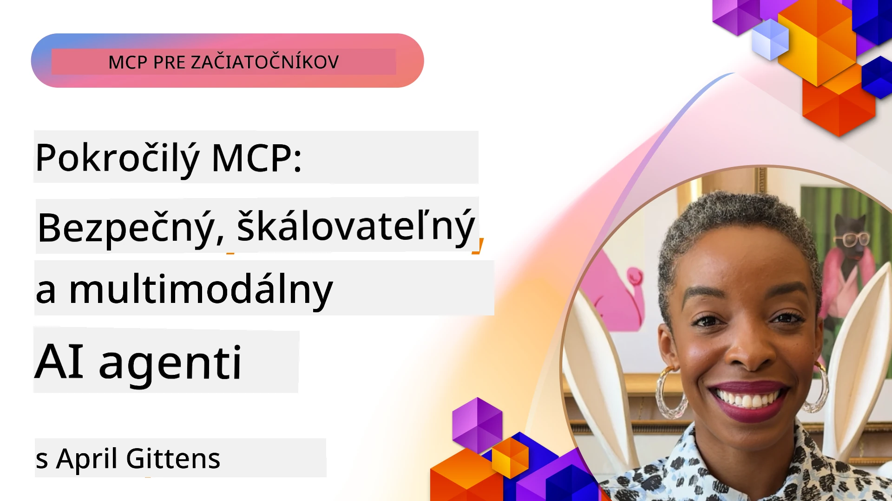

# Pokročilé témy v MCP

_(Kliknite na obrázok vyššie pre zobrazenie videa tejto lekcie)_

Táto kapitola pokrýva sériu pokročilých tém v implementácii Model Context Protocolu (MCP), vrátane multimodálnej integrácie, škálovateľnosti, najlepších bezpečnostných praktík a podnikovej integrácie. Témy sú kľúčové pre budovanie robustných a produkčne pripravených MCP aplikácií, ktoré dokážu uspokojiť požiadavky moderných AI systémov.

## Prehľad

Táto lekcia skúma pokročilé koncepty implementácie Model Context Protocolu so zameraním na multimodálnu integráciu, škálovateľnosť, najlepšie bezpečnostné praktiky a podnikové integrácie. Tieto témy sú nevyhnutné pre budovanie produkčných MCP aplikácií, ktoré dokážu zvládnuť komplexné požiadavky v podnikových prostrediach.

## Ciele učenia

Na konci tejto lekcie budete schopní:

- Implementovať multimodálne schopnosti v rámci MCP rámcov
- Navrhovať škálovateľné MCP architektúry pre scenáre s vysokou záťažou
- Aplikovať najlepšie bezpečnostné praktiky v súlade s bezpečnostnými princípmi MCP
- Integrovať MCP s podnikmi AI systémami a rámcami
- Optimalizovať výkon a spoľahlivosť v produkčných prostrediach

## Lekcie a ukážkové projekty

| Odkaz | Názov | Popis |
|------|-------|-------|
| [5.1 Integrácia s Azure](./mcp-integration/README.md) | Integrácia s Azure | Naučte sa, ako integrovať svoj MCP server na Azure |
| [5.2 Ukážka multimodality](./mcp-multi-modality/README.md) | MCP multimodálne ukážky | Ukážky pre audio, obraz a multimodálnu odpoveď |
| [5.3 MCP OAuth2 ukážka](../../../05-AdvancedTopics/mcp-oauth2-demo) | MCP OAuth2 Demo | Minimálna Spring Boot aplikácia ukazujúca OAuth2 s MCP, ako Autorizačný aj Zdrojový server. Demonštruje bezpečné vydávanie tokenov, chránené endpointy, nasadenie Azure Container Apps a integráciu správy API. |
| [5.4 Koreňové kontexty](./mcp-root-contexts/README.md) | Koreňové kontexty | Zistite viac o koreňovom kontexte a ako ich implementovať |
| [5.5 Smerovanie](./mcp-routing/README.md) | Smerovanie | Naučte sa rôzne typy smerovania |
| [5.6 Vzorkovanie](./mcp-sampling/README.md) | Vzorkovanie | Naučte sa pracovať so vzorkovaním |
| [5.7 Škálovanie](./mcp-scaling/README.md) | Škálovanie | Naučte sa o škálovaní |
| [5.8 Bezpečnosť](./mcp-security/README.md) | Bezpečnosť | Zaistite bezpečnosť svojho MCP servera |
| [5.9 Webové vyhľadávanie MCP](./web-search-mcp/README.md) | Webové vyhľadávanie MCP | Python MCP server a klient integrujúci SerpAPI pre vyhľadávanie na webe, v správach, produktoch a Q&A v reálnom čase. Demonštruje orchestráciu viacerých nástrojov, integráciu externého API a robustné spracovanie chýb. |
| [5.10 Reálny časový streaming](./mcp-realtimestreaming/README.md) | Streaming | Streaming dát v reálnom čase sa stal nevyhnutným v dnešnom dátovo riadenom svete, kde podniky a aplikácie vyžadujú neodkladný prístup k informáciám na rýchle rozhodovanie. |
| [5.11 Reálne časové webové vyhľadávanie](./mcp-realtimesearch/README.md) | Webové vyhľadávanie | Reálne časové webové vyhľadávanie a ako MCP transformuje reálne časové webové vyhľadávanie poskytovaním štandardizovaného prístupu k správe kontextu naprieč AI modelmi, vyhľadávačmi a aplikáciami. |
| [5.12 Autentifikácia Entra ID pre servery Model Context Protocol](./mcp-security-entra/README.md) | Autentifikácia Entra ID | Microsoft Entra ID ponúka robustné cloudové riešenie pre správu identity a prístupu, ktoré zabezpečuje, že iba autorizovaní používatelia a aplikácie môžu komunikovať s vaším MCP serverom. |
| [5.13 Integrácia agenta Azure AI Foundry](./mcp-foundry-agent-integration/README.md) | Integrácia Azure AI Foundry | Naučte sa integrovať servery Model Context Protocol s agentmi Azure AI Foundry, čo umožňuje silnú orchestráciu nástrojov a podnikovú AI funkcionalitu so štandardizovanými pripojeniami na externé zdroje dát. |
| [5.14 Inžinierstvo kontextu](./mcp-contextengineering/README.md) | Inžinierstvo kontextu | Budúce príležitosti techník inžinierstva kontextu pre servery MCP, vrátane optimalizácie kontextu, dynamického riadenia kontextu a stratégií efektívneho tvorenia promptov v rámci MCP rámcov. |
| [5.15 Vlastný transport MCP](./mcp-transport/README.md) | Vlastný transport | Naučte sa implementovať vlastné transportné mechanizmy pre špecializované komunikačné scenáre MCP. |
| [5.16 Hlbší ponor do funkcií protokolu](./mcp-protocol-features/README.md) | Funkcie protokolu | Osvojte si pokročilé funkcie protokolu vrátane oznámení o priebehu, zrušenia žiadostí, šablón zdrojov a vzorov spracovania chýb. |

> **Novinka v MCP Špecifikácii 2025-11-25**: Špecifikácia teraz obsahuje experimentálnu podporu pre **Úlohy** (dlhotrvajúce operácie so sledovaním priebehu), **Anotácie nástrojov** (metadata o správaní nástrojov pre bezpečnosť), **URL mód vyžiadania** (žiadanie konkrétneho URL obsahu od klientov) a vylepšené **Koreňe** (pre riadenie pracovného kontextu). Pozrite si [zmenový denník MCP špecifikácie](https://spec.modelcontextprotocol.io/) pre podrobnosti.

## Dodatočné odkazy

Pre najaktuálnejšie informácie o pokročilých témach MCP sa odvolajte na:
- [Dokumentácia MCP](https://modelcontextprotocol.io/)
- [Špecifikácia MCP (2025-11-25)](https://spec.modelcontextprotocol.io/specification/2025-11-25/)
- [GitHub Repository](https://github.com/modelcontextprotocol)
- [OWASP MCP Top 10](https://microsoft.github.io/mcp-azure-security-guide/mcp/) - Bezpečnostné riziká a opatrenia
- [MCP Security Summit Workshop (Sherpa)](https://azure-samples.github.io/sherpa/) - Praktický bezpečnostný tréning

## Kľúčové poznatky

- Multimodálne implementácie MCP rozširujú schopnosti AI za hranice spracovania textu
- Škálovateľnosť je nevyhnutná pre podnikové nasadenia a rieši sa horizontálnym a vertikálnym škálovaním
- Komplexné bezpečnostné opatrenia chránia dáta a zabezpečujú správnu kontrolu prístupu
- Podniková integrácia s platformami ako Azure OpenAI a Microsoft AI Foundry rozširuje schopnosti MCP
- Pokročilé implementácie MCP profitujú z optimalizovaných architektúr a starostlivého manažmentu zdrojov

## Cvičenie

Navrhnite implementáciu MCP pre podnikové použitie pre konkrétny prípad použitia:

1. Identifikujte multimodálne požiadavky pre váš prípad použitia
2. Načrtnite bezpečnostné opatrenia potrebné na ochranu citlivých dát
3. Navrhnite škálovateľnú architektúru, ktorá zvládne rôzne zaťaženie
4. Naplánujte integračné body s podnikovými AI systémami
5. Zdokumentujte potenciálne výkonnostné úzke miesta a stratégie ich riešenia

## Dodatočné zdroje

- [Azure OpenAI Dokumentácia](https://learn.microsoft.com/en-us/azure/ai-services/openai/)
- [Microsoft AI Foundry Dokumentácia](https://learn.microsoft.com/en-us/ai-services/)

---

## Čo ďalej

Preskúmajte lekcie v tomto module začínajúc [5.1 MCP integrácia](./mcp-integration/README.md)

Po dokončení tohto modulu pokračujte na: [Modul 6: Príspevky komunity](../06-CommunityContributions/README.md)

---

<!-- CO-OP TRANSLATOR DISCLAIMER START -->
**Vyhlásenie o zodpovednosti**:
Tento dokument bol preložený pomocou AI prekladateľskej služby [Co-op Translator](https://github.com/Azure/co-op-translator). Hoci sa snažíme o presnosť, prosím, majte na pamäti, že automatické preklady môžu obsahovať chyby alebo nepresnosti. Pôvodný dokument v jeho rodnom jazyku by mal byť považovaný za autoritatívny zdroj. Pre dôležité informácie sa odporúča profesionálny ľudský preklad. Nie sme zodpovední za akékoľvek nedorozumenia alebo nesprávne interpretácie vyplývajúce z použitia tohto prekladu.
<!-- CO-OP TRANSLATOR DISCLAIMER END -->