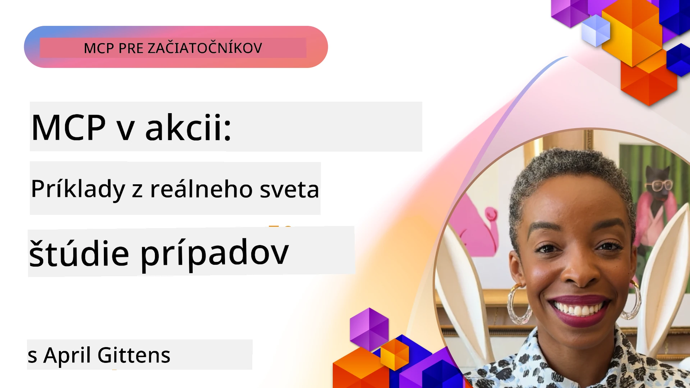

# MCP v praxi: Prípadové štúdie zo skutočného sveta

_(Kliknite na obrázok vyššie pre zobrazenie videa k tejto lekcii)_

Model Context Protocol (MCP) mení spôsob, akým AI aplikácie komunikujú s dátami, nástrojmi a službami. Táto sekcia predstavuje prípadové štúdie zo skutočného sveta, ktoré ukazujú praktické využitie MCP v rôznych podnikových scenároch.

## Prehľad

Táto sekcia predstavuje konkrétne príklady implementácií MCP, ktoré zdôrazňujú, ako organizácie využívajú tento protokol na riešenie zložitých obchodných výziev. Preskúmaním týchto prípadových štúdií získate vhľad do všestrannosti, škálovateľnosti a praktických výhod MCP v reálnych scénach.

## Kľúčové vzdelávacie ciele

Preskúmaním týchto prípadových štúdií budete:

- Rozumieť tomu, ako možno MCP použiť na riešenie konkrétnych obchodných problémov
- Naučiť sa rôzne vzory integrácie a architektonické prístupy
- Rozpoznať najlepšie praktiky pri implementácii MCP v podnikových prostrediach
- Získať vhľad do výziev a riešení stretnutých v reálnych implementáciách
- Identifikovať príležitosti na použitie podobných vzorov vo vašich vlastných projektoch

## Predstavené prípadové štúdie

### 1. [Azure AI Travel Agents – Referenčná implementácia](./travelagentsample.md)

Táto prípadová štúdia skúma komplexné referenčné riešenie Microsoftu, ktoré ukazuje, ako vytvoriť viacagentovú AI aplikáciu pre plánovanie ciest pomocou MCP, Azure OpenAI a Azure AI Search. Projekt demonštruje:

- Orchestráciu viacerých agentov cez MCP
- Integráciu podnikových dát cez Azure AI Search
- Bezpečnú, škálovateľnú architektúru využívajúcu Azure služby
- Rozšíriteľné nástroje s opakovane použiteľnými komponentmi MCP
- Konverzačný používateľský zážitok poháňaný Azure OpenAI

Architektúra a detaily implementácie poskytujú cenné poznatky o tvorbe zložitých viacagentových systémov s MCP ako koordinačnou vrstvou.

### 2. [Aktualizácia položiek Azure DevOps z YouTube dát](./UpdateADOItemsFromYT.md)

Táto prípadová štúdia ukazuje praktické využitie MCP na automatizáciu pracovných procesov. Ukazuje, ako možno MCP nástroje využiť na:

- Extrakciu dát z online platforiem (YouTube)
- Aktualizáciu pracovných položiek v Azure DevOps systémoch
- Vytváranie opakovateľných automatizačných pracovných tokov
- Integráciu dát medzi rôznymi systémami

Tento príklad ilustruje, ako aj relatívne jednoduché implementácie MCP môžu priniesť výrazné zefektívnenie automatizáciou rutinných úloh a zlepšením konzistencie dát naprieč systémami.

### 3. [Získavanie dokumentácie v reálnom čase s MCP](./docs-mcp/README.md)

Táto prípadová štúdia vás prevedie pripojením Python konzolového klienta k MCP serveru na získavanie a logovanie aktuálnej, kontextovo uvedomelej dokumentácie Microsoftu v reálnom čase. Naučíte sa:

- Pripojiť sa k MCP serveru pomocou Python klienta a oficiálneho MCP SDK
- Používať streamingové HTTP klienty pre efektívne získavanie dát v reálnom čase
- Zavolať dokumentačné nástroje na serveri a zaznamenať odpovede priamo do konzoly
- Integrovať aktuálnu Microsoft dokumentáciu do svojho workflow bez opustenia terminálu

Kapitola obsahuje praktickú úlohu, minimálny pracovný ukážkový kód a odkazy na ďalšie zdroje pre hlbšie štúdium. Kompletný prehľad a kód nájdete v prepojenej kapitole, ktorá ukazuje, ako môže MCP transformovať prístup k dokumentáciám a zvýšiť produktivitu vývojárov v konzolových prostrediach.

### 4. [Interaktívna webová aplikácia generátora študijných plánov s MCP](./docs-mcp/README.md)

Táto prípadová štúdia ukazuje, ako vybudovať interaktívnu webovú aplikáciu pomocou Chainlit a Model Context Protocol (MCP) na generovanie personalizovaných študijných plánov pre ľubovoľnú tému. Používatelia môžu špecifikovať predmet (napr. „certifikácia AI-900“) a dĺžku štúdia (napr. 8 týždňov) a aplikácia poskytne týždenný rozpis odporúčaného obsahu. Chainlit umožňuje konverzačné chatové rozhranie, ktoré robí zážitok pútavým a adaptabilným.

- Konverzačná webová aplikácia poháňaná Chainlit
- Používateľom riadené vstupy témy a dĺžky štúdia
- Odporúčania obsahu týždeň po týždni pomocou MCP
- Reálne, adaptívne odpovede v chat rozhraní

Projekt ukazuje, ako možno konverzačné AI a MCP kombinovať na vytvorenie dynamických vzdelávacích nástrojov riadených používateľmi v modernom webovom prostredí.

### 5. [Dokumentácia priamo v editore s MCP serverom vo VS Code](./docs-mcp/README.md)

Táto prípadová štúdia ukazuje, ako môžete priniesť Microsoft Learn Docs priamo do vášho prostredia VS Code pomocou MCP servera—už žiadne prepínanie medzi kartami v prehliadači! Uvidíte, ako:

- Okamžite vyhľadávať a čítať dokumentáciu vo VS Code pomocou MCP panelu alebo príkazovej palety
- Referencovať dokumentáciu a vkladať odkazy priamo do vašich README alebo markdown súborov kurzov
- Používať GitHub Copilot a MCP spolu pre bezproblémové AI-poháňané pracovné postupy s dokumentáciou a kódom
- Validovať a vylepšovať vašu dokumentáciu v reálnom čase s presnosťou zo zdrojov Microsoftu
- Integrovať MCP s GitHub pracovnými tokmi na kontinuálnu validáciu dokumentácie

Implementácia obsahuje:

- Príklad konfigurácie `.vscode/mcp.json` pre jednoduché nastavenie
- Screenshotové návody s prehľadom zážitku z práce priamo v editore
- Tipy na kombinovanie Copilot a MCP pre maximálnu produktivitu

Tento scenár je ideálny pre autorov kurzov, dokumentačných pracovníkov a vývojárov, ktorí chcú zostať sústredení vo svojej editore pri práci s dokumentáciami, Copilotom a validačnými nástrojmi—všetko poháňané MCP.

### 6. [Tvorba MCP servera pomocou APIM](./apimsample.md)

Táto prípadová štúdia poskytuje krok za krokom návod, ako vytvoriť MCP server pomocou Azure API Management (APIM). Pokrýva:

- Nastavenie MCP servera v Azure API Management
- Exponovanie API operácií ako MCP nástrojov
- Konfiguráciu pravidiel pre obmedzenie rýchlosti a bezpečnosť
- Testovanie MCP servera cez Visual Studio Code a GitHub Copilot

Tento príklad ukazuje, ako využiť možnosti Azure na vytvorenie robustného MCP servera, ktorý možno použiť v rôznych aplikáciách a zlepšiť integráciu AI systémov s podnikových API.

### 7. [GitHub MCP Registry — urýchľovanie agentovej integrácie](https://github.com/mcp)

Táto prípadová štúdia skúma, ako GitHub MCP Registry, spustený v septembri 2025, rieši kľúčový problém v AI ekosystéme: roztrošené vyhľadávanie a nasadzovanie Model Context Protocol (MCP) serverov.

#### Prehľad
**MCP Registry** rieši rastúci problém rozptýlených MCP serverov v rôznych repozitároch a registroch, čo predtým spomaľovalo a komplikovalo integráciu. Tieto servery umožňujú AI agentom interakciu s externými systémami ako API, databázy a zdroje dokumentácie.

#### Definícia problému
Vývojári agentných pracovných tokov čelili viacerým výzvam:
- **Zlá dostupnosť** MCP serverov naprieč platformami
- **Duplikované otázky o nastavení** roztrúsené vo fórach a dokumentácii
- **Bezpečnostné riziká** z neoverených a nedôveryhodných zdrojov
- **Nedostatok štandardizácie** kvality a kompatibility serverov

#### Architektúra riešenia
GitHub MCP Registry centralizuje dôveryhodné MCP servery s kľúčovými vlastnosťami:
- **Integrácia inštalácie jedným klikom** cez VS Code pre plynulé nastavenie
- **Zoradenie signálu nad šumom** podľa hviezdičiek, aktivity a overenia komunitou
- **Priama integrácia** s GitHub Copilot a ďalšími MCP-kompatibilnými nástrojmi
- **Model otvoreného príspevku** umožňujúci príspevky od komunity aj podnikových partnerov

#### Obchodný dopad
Registrácia priniesla merateľné zlepšenia:
- **Rýchlejšie zapojenie** vývojárov využívajúcich nástroje ako Microsoft Learn MCP Server, ktorý streamuje oficiálnu dokumentáciu priamo agentom
- **Zvýšená produktivita** vďaka špecializovaným serverom ako `github-mcp-server`, umožňujúcim prirodzenú jazykovú automatizáciu GitHubu (vytváranie PR, opakovanie CI, skenovanie kódu)
- **Silnejšia dôvera v ekosystém** cez kurátorské zoznamy a transparentné štandardy konfigurácie

#### Strategická hodnota
Pre odborníkov špecializujúcich sa na správu životného cyklu agentov a reprodukovateľné pracovné toky poskytuje MCP Registry:
- **Modulárne nasadzovanie agentov** so štandardizovanými komponentmi
- **Evaluáciu založenú na registri** pre konzistentné testovanie a validáciu
- **Medzinástrojovú interoperabilitu** umožňujúcu bezproblémovú integráciu naprieč AI platformami

Táto prípadová štúdia ukazuje, že MCP Registry nie je len adresár—je to základná platforma pre škálovateľnú, reálnu integráciu modelov a nasadzovanie agentných systémov.

## Záver

Tieto sedem podrobných prípadových štúdií demonštrujú pozoruhodnú všestrannosť a praktické využitie Model Context Protocol naprieč rôznymi reálnymi scenármi. Od zložitých viacagentových systémov plánovania ciest a podnikovej správy API, cez zefektívnené pracovné toky s dokumentáciou až po revolučný GitHub MCP Registry, tieto príklady ukazujú, ako MCP poskytuje štandardizovaný, škálovateľný spôsob, ako prepojiť AI systémy s nástrojmi, dátami a službami potrebnými na výnimočnú hodnotu.

Prípadové štúdie pokrývajú viacero rozmerov implementácie MCP:
- **Podniková integrácia**: Azure API Management a automatizácia Azure DevOps
- **Viacagentová orchestrácia**: plánovanie ciest koordinovanými AI agentmi
- **Produktivita vývojára**: integrácia do VS Code a prístup k dokumentácii v reálnom čase
- **Rozvoj ekosystému**: GitHub MCP Registry ako základná platforma
- **Vzdelávacie aplikácie**: generátory študijných plánov a konverzačné rozhrania

Štúdiom týchto implementácií získate kľúčové poznatky o:
- **Architektonických vzoroch** pre rôzne škály a použitia
- **Strategiách implementácie** vyvažujúcich funkčnosť s udržiavateľnosťou
- **Bezpečnosti a škálovateľnosti** pre produkčné nasadenia
- **Najlepších praktikách** vývoja MCP serverov a integrácie klientov
- **Ekosystémovom myslení** pre tvorbu prepojených riešení poháňaných AI

Tieto príklady spolu ukazujú, že MCP nie je iba teoretický rámec, ale zrelý, produkčne pripravený protokol umožňujúci praktické riešenia zložitých obchodných výziev. Či už budujete jednoduché automatizačné nástroje alebo sofistikované viacagentové systémy, vzory a prístupy tu ilustrované poskytujú pevný základ pre vaše vlastné MCP projekty.

## Dodatočné zdroje

- [GitHub repozitár Azure AI Travel Agents](https://github.com/Azure-Samples/azure-ai-travel-agents)
- [Azure DevOps MCP nástroj](https://github.com/microsoft/azure-devops-mcp)
- [Playwright MCP nástroj](https://github.com/microsoft/playwright-mcp)
- [Microsoft Docs MCP server](https://github.com/MicrosoftDocs/mcp)
- [GitHub MCP Registry — urýchľovanie agentovej integrácie](https://github.com/mcp)
- [Príklady MCP komunity](https://github.com/microsoft/mcp)

## Čo bude ďalej

- Predchádzajúce: [Modul 8: Najlepšie praktiky](../08-BestPractices/README.md)
- Nasledujúce: [Modul 10: Zjednodušenie AI pracovných tokov: Tvorba MCP servera s AI Toolkit](../10-StreamliningAIWorkflowsBuildingAnMCPServerWithAIToolkit/README.md)

---

<!-- CO-OP TRANSLATOR DISCLAIMER START -->
**Vyhlásenie o zodpovednosti**:
Tento dokument bol preložený pomocou AI prekladateľskej služby [Co-op Translator](https://github.com/Azure/co-op-translator). Hoci sa snažíme o presnosť, upozorňujeme, že automatické preklady môžu obsahovať chyby alebo nepresnosti. Originálny dokument v jeho pôvodnom jazyku by mal byť považovaný za autoritatívny zdroj. Pre kritické informácie odporúčame profesionálny ľudský preklad. Nie sme zodpovední za akékoľvek nedorozumenia alebo nesprávne výklady vyplývajúce z použitia tohto prekladu.
<!-- CO-OP TRANSLATOR DISCLAIMER END -->