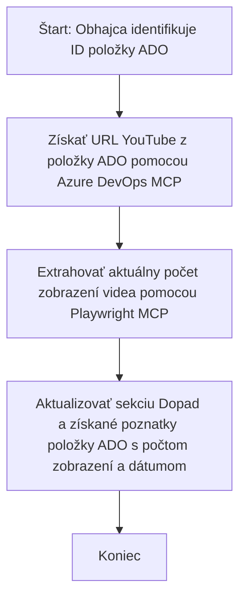

# Case Study: Aktualizácia položiek Azure DevOps z údajov YouTube pomocou MCP

> **Upozornenie:** Existujú online nástroje a správy, ktoré môžu automatizovať proces aktualizácie položiek Azure DevOps údajmi z platforiem, ako je YouTube. Nasledujúci scenár je poskytnutý čisto ako ukážka použitia na ilustráciu, ako možno nástroje MCP použiť na úlohy automatizácie a integrácie.

## Prehľad

Táto prípadová štúdia demonštruje jeden príklad toho, ako možno Model Context Protocol (MCP) a jeho nástroje využiť na automatizáciu procesu aktualizácie pracovných položiek Azure DevOps (ADO) s informáciami získanými z online platforiem, ako je YouTube. Opísaný scenár je iba jednou ukážkou širších možností týchto nástrojov, ktoré je možné prispôsobiť mnohým podobným potrebám automatizácie.

V tomto príklade sleduje Odborník online relácie pomocou položiek ADO, pričom každá položka obsahuje URL adresu videa YouTube. Využitím nástrojov MCP môže Odborník udržiavať položky ADO aktuálne s najnovšími metrikami videa, ako je počet zobrazení, opakovateľným a automatizovaným spôsobom. Tento prístup je možné zobecniť na ďalšie prípady použitia, kde je potrebné integrovať informácie z online zdrojov do ADO alebo iných systémov.

## Scenár

Odborník je zodpovedný za sledovanie dosahu online relácií a angažovanosti komunity. Každá relácia je zaznamenaná ako pracovná položka ADO v projekte „DevRel“ a pracovná položka obsahuje pole pre URL videa YouTube. Na presné hlásenie dosahu relácie potrebuje Odborník aktualizovať položku ADO aktuálnym počtom zobrazení videa a dátumom získania týchto informácií.

## Použité nástroje

- [Azure DevOps MCP](https://github.com/microsoft/azure-devops-mcp): Umožňuje programatický prístup a aktualizácie pracovných položiek ADO cez MCP.
- [Playwright MCP](https://github.com/microsoft/playwright-mcp): Automatizuje prehliadačové akcie na extrakciu živých údajov z webových stránok, ako sú štatistiky videozáznamov YouTube.

## Postup krok za krokom

1. **Identifikujte položku ADO**: Začnite s ID pracovnej položky ADO (napr. 1234) v projekte „DevRel“.
2. **Získajte URL YouTube**: Pomocou nástroja Azure DevOps MCP získajte URL videa YouTube z pracovnej položky.
3. **Extrahujte počet zobrazení videa**: Pomocou nástroja Playwright MCP prejdite na URL YouTube a získajte aktuálny počet zobrazení.
4. **Aktualizujte položku ADO**: Zapíšte najnovší počet zobrazení a dátum načítania do sekcie „Dopad a poznatky“ pracovnej položky ADO pomocou nástroja Azure DevOps MCP.

## Príklad výzvy

```bash
- Work with the ADO Item ID: 1234
- The project is '2025-Awesome'
- Get the YouTube URL for the ADO item
- Use Playwright to get the current views from the YouTube video
- Update the ADO item with the current video views and the updated date of the information
```

## Mermaid diagram toku


## Technická implementácia

- **Orchestrace MCP**: Pracovný tok riadi server MCP, ktorý koordinuje používanie nástrojov Azure DevOps MCP a Playwright MCP.
- **Automatizácia**: Proces možno spustiť manuálne alebo naplánovať na pravidelné intervaly, aby sa položky ADO udržiavali aktuálne.
- **Rozšíriteľnosť**: Rovnaký vzor je možné rozšíriť na aktualizáciu položiek ADO ďalšími online metrikami (napr. „like“, komentáre) alebo z iných platforiem.

## Výsledky a dopad

- **Efektivita**: Znižuje manuálnu prácu odbornej verejnosti tým, že automatizuje získavanie a aktualizáciu metrik videí.
- **Presnosť**: Zabezpečuje, že položky ADO odrážajú najaktuálnejšie dostupné údaje z online zdrojov.
- **Opakovateľnosť**: Poskytuje znovupoužiteľný pracovný postup pre podobné scenáre zahŕňajúce iné zdroje alebo metriky.

## Odkazy

- [Azure DevOps MCP](https://github.com/microsoft/azure-devops-mcp)
- [Playwright MCP](https://github.com/microsoft/playwright-mcp)
- [Model Context Protocol (MCP)](https://modelcontextprotocol.io/)

## Čo ďalej

- Späť na: [Prehľad prípadových štúdií](./README.md)
- Ďalej: [Získavanie dokumentácie v reálnom čase pomocou MCP](./docs-mcp/README.md)

---

<!-- CO-OP TRANSLATOR DISCLAIMER START -->
**Zrieknutie sa zodpovednosti**:  
Tento dokument bol preložený pomocou AI prekladateľskej služby [Co-op Translator](https://github.com/Azure/co-op-translator). Hoci sa snažíme o presnosť, berte prosím na vedomie, že automatizované preklady môžu obsahovať chyby alebo nepresnosti. Pôvodný dokument v jeho rodnom jazyku by mal byť považovaný za autoritatívny zdroj. Pre dôležité informácie sa odporúča profesionálny ľudský preklad. Nie sme zodpovední za akékoľvek nedorozumenia alebo nesprávne výklady, ktoré môžu vzniknúť použitím tohto prekladu.
<!-- CO-OP TRANSLATOR DISCLAIMER END -->